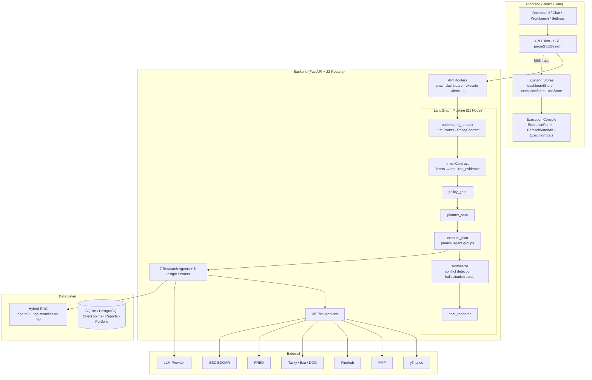
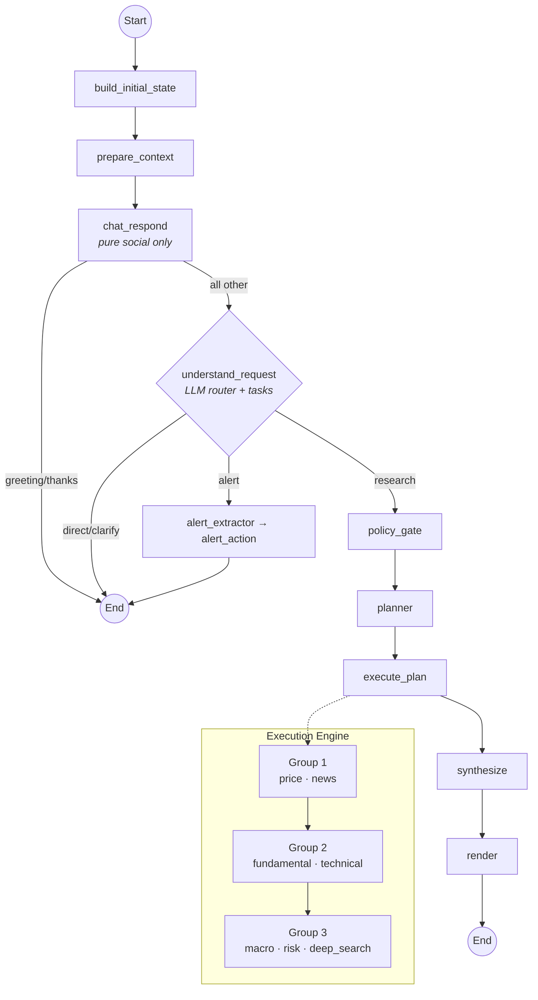
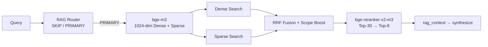

<p align="center">
  
</p>

<h1 align="center">FinSight AI</h1>

<p align="center">
  <strong>Multi-Agent Financial Research Platform powered by LangGraph</strong>
</p>

<p align="center">
  <a href="./README.md">English</a> |
  <a href="./README_CN.md">中文</a> |
  <a href="./docs/DOCS_INDEX.md">Docs Index</a>
</p>

<p align="center">
  🌐 <strong>Live Demo:</strong> <a href="https://finsight-ai.chat">finsight-ai.chat</a>
</p>

---

**FinSight AI** is a production-grade, multi-agent financial research system built on **LangGraph**. It unifies conversational AI, a 6-tab professional dashboard, autonomous task execution (Workbench), real-time execution tracking, and proactive email alerts into one coherent platform.

<p align="center">
  
</p>

---

## ✨ Key Features

| Category | Highlights |
|----------|-----------|
| **Multi-Agent Research** | 7 specialized agents (Price, News, Fundamental, Technical, Macro, Risk, DeepSearch) running in parallel execution groups |
| **LangGraph Pipeline** | Evidence-first intent contract: conversation router → semantic decomposition → policy gate → parallel execution → conflict-aware synthesis |
| **Professional Dashboard** | 6 analytical tabs (Overview, Financial, Technical, News, Research, Peers) with real-time ECharts + 5 AI insight scorers |
| **Execution Console** | Three-mode tracking (User / Expert / Dev) with parallel waterfall, budget priority, LLM token/cost stats |
| **Hybrid RAG** | bge-m3 (1024-dim Dense + Sparse) with bge-reranker-v2-m3 cross-encoder; 3-layer eval gate (12/12 PASS, CR=0.0) |
| **Smart Charts** | Dual-mode LLM charts: `<chart>` (inline data) + `<chart_ref>` (real API data) |
| **Workbench** | Autonomous task execution, portfolio rebalancing with LLM enhancement, report timeline |
| **Proactive Alerts** | 3 schedulers (Price / News / Risk) with email notification via SMTP |
| **Resilience** | 11-source price cascade, LLM circuit breaker, planner stub fallback, RAG hash degradation |
| **Hallucination Defense** | Regex pattern matching + evidence cross-validation + placeholder scrubbing ([details](docs/HALLUCINATION_MITIGATION.md)) |
| **Phase Labs** | Conversational price alerts, stock screener, A-share market data, strategy backtesting |

---

## 🚀 Quick Start

```bash
git clone https://github.com/kkkano/FinSight.git
cd FinSight
cp .env.server.example .env.server
# Edit .env.server — minimum: set OPENAI_COMPATIBLE_API_KEY
docker compose --env-file .env.server up -d --build
```

Open **http://localhost:5173** (frontend) · API at **http://localhost:8000**

<details>
<summary>API Keys</summary>

| Key | Required? | Purpose |
|-----|-----------|---------|
| `OPENAI_COMPATIBLE_API_KEY` | **Yes** | Default LLM endpoint |
| `OPENAI_COMPATIBLE_API_BASE` | **Yes** | LLM base URL |
| `FMP_API_KEY` | Recommended | Financial data (fallback: yfinance) |
| `FINNHUB_API_KEY` | Optional | Real-time quotes & news |
| `TAVILY_API_KEY` | Optional | Web search (fallback: DuckDuckGo) |
| `FRED_API_KEY` | Optional | Macro economic data |

All non-required APIs have automatic fallbacks. See [`.env.server.example`](.env.server.example) for the full list.

</details>

<details>
<summary>Manual Setup (without Docker)</summary>

```bash
# Backend
python -m venv .venv && source .venv/bin/activate  # or .venv\Scripts\activate on Windows
pip install -r requirements.txt
cp .env.server.example .env.server  # edit with your keys
python -m uvicorn backend.api.main:app --host 0.0.0.0 --port 8000

# Frontend
cd frontend && pnpm install && pnpm dev
```

</details>

---

## 📸 Platform Preview

<table>
<tr>
<td width="50%">

**Dashboard — AI Score Ring, Agent Coverage, Risk Metrics**


</td>
<td width="50%">

**Chat + "Ask About This" — Conversational AI with Portfolio Panel**


</td>
</tr>
<tr>
<td width="50%">

**Deep Research Report — Agent Confidence, Catalysts, Risk Alerts**


</td>
<td width="50%">

**Execution Timeline + Agent Summary Cards**


</td>
</tr>
<tr>
<td width="50%">

**Workbench — Task Execution, Rebalancing, Report Timeline**


</td>
<td width="50%">

**Thinking Process — Collapsible Reasoning Sections**


</td>
</tr>
</table>

<details>
<summary>More Screenshots</summary>

| RAG Inspector — Runs & Events | RAG Inspector — Source & Chunks |
|:-:|:-:|
|  |  |

| Chat with Inline Charts | Console & SSE Events |
|:-:|:-:|
|  |  |

</details>

---

## 🏗️ System Architecture



---

## 🔄 LangGraph Pipeline

The chat runtime is a LangGraph stateful graph. `conversation_router` resolves intent, `intent_contract` compiles semantic facets into `required_evidence`, and the policy/planner/executor chain runs agents in parallel groups. Evidence is separated from tool diagnostics — failed tools go to `artifacts.tool_diagnostics`, never to `evidence_pool`.



> **Deep dive**: [Pipeline architecture](docs/LANGGRAPH_PIPELINE_DEEP_DIVE.md) · [Intent contract & GraphState](docs/01_ARCHITECTURE.md) · [Event protocol](docs/execution-event-contract.md)

---

## 🤖 Agent Ecosystem

### 7 Research Agents

Each agent inherits from `BaseFinancialAgent` with reflection loops, tool calling, and evidence collection.

| Agent | Tools | Specialty |
|-------|-------|-----------|
| **PriceAgent** | `get_stock_price`, options, search | 11-source price cascade (yfinance → FMP → Finnhub → ...) |
| **NewsAgent** | company news, sentiment, calendar, search | Source reliability scoring, breaking news detection |
| **FundamentalAgent** | financials, company info, earnings, EPS, search | Revenue/margin trend analysis, 8-quarter data |
| **TechnicalAgent** | historical data, search | RSI, MACD, Bollinger, Stochastic, ADX, 8 MAs |
| **MacroAgent** | FRED, sentiment, events, search | Macro-micro linkage analysis |
| **RiskAgent** | risk eval, factor exposure, stress test | Beta, VaR(95%), max drawdown, Sharpe |
| **DeepSearchAgent** | Tavily → Exa → DDG, doc fetcher | Self-RAG loop with convergence tracking, SSRF protection |

### 5 Dashboard Insight Scorers

Lightweight scorers (not autonomous agents) generating AI insight cards per dashboard tab via a single LLM call + deterministic fallback. Served by `/api/dashboard/insights`, independent from the research pipeline.

> **Details**: [Agent & Tool guide](docs/AGENTS_GUIDE.md) · [Dashboard development](docs/DASHBOARD_DEVELOPMENT_GUIDE.md)

---

## 🔭 Execution Tracking & Observability

The bottom **Execution Console** turns the raw SSE stream into a live, structured view of every run. `ChatInput` bridges the chat SSE stream into `executionStore`, whose reducer parses `plan_ready`, `step_start/step_done`, `agent_*`, and `decision_note` events.

| Mode | Shows |
|------|-------|
| **User** | Phase progress ring + agent cards with data-source chips |
| **Expert** | Stage bar · plan summary · **parallel execution waterfall** · decision flow · token/cost stats |
| **Dev** | Raw SSE event stream |

**Parallel waterfall**: steps grouped by `parallel_group`; bar width ∝ `duration_ms`, color-coded tool (amber) vs agent (violet).

**LLM token metering**: per-run `ContextVar` accumulator at the unified LLM entry; `done.metrics` carries `total_tokens` / `total_cost_usd` / `tokens_by_model`.

> **Details**: [Event protocol](docs/execution-event-contract.md) · [Architecture §10](docs/01_ARCHITECTURE.md)

---

## 🔍 RAG Engine



| Component | Model / Algorithm |
|-----------|-------------------|
| Embedder | `BAAI/bge-m3` — 1024-dim Dense + Sparse |
| Reranker | `BAAI/bge-reranker-v2-m3` Cross-Encoder |
| Store | In-Memory or PostgreSQL (pgvector) |

RAG Quality V2: 3-layer eval (Mock → Real Retrieval → E2E), **12/12 PASS**, CR=0.0 across all layers. [Full report](tests/rag_qualityV2/REPORT.md)

> **Details**: [RAG architecture](docs/05_RAG_ARCHITECTURE.md) · [Evaluation guide](docs/rag-evaluation-guide.md)

---

## 🔧 Tech Stack

| Layer | Technology |
|-------|-----------|
| **Backend** | Python 3.11 · FastAPI · LangGraph · LangChain · Langfuse · APScheduler · Pydantic |
| **Frontend** | React 19 · Vite 6 · TypeScript 5 · Zustand 5 · ECharts 5 · TailwindCSS 4 |
| **Models** | Configurable LLM (OpenAI / Gemini / DeepSeek / Anthropic) · bge-m3 (1024d) · bge-reranker-v2-m3 |
| **Data** | PostgreSQL + pgvector · SQLite · JSON file stores |
| **Infra** | Docker Compose · Cloudflare Tunnel · Nginx |

---

## 📁 Project Structure

```
FinSight/
├── backend/
│   ├── api/              # FastAPI routers (28 modules)
│   ├── graph/            # LangGraph pipeline core (21 nodes)
│   ├── agents/           # 7 research agents + base class
│   ├── tools/            # 38 tool modules
│   ├── dashboard/        # Dashboard data service & AI insight scorers
│   ├── rag/              # Hybrid RAG engine (embedder, reranker, router)
│   ├── services/         # Background services (alerts, memory, LLM usage)
│   └── tests/
├── frontend/
│   └── src/
│       ├── api/          # API client + SSE streaming
│       ├── store/        # Zustand stores (3)
│       ├── components/   # Dashboard, chat, execution, workbench
│       ├── hooks/
│       └── types/
├── docs/                 # Technical documentation
├── tests/                # Regression tests & evaluators
├── docker-compose.yml
├── requirements.txt
└── .env.server.example
```

---

## 📚 Documentation

Full index: [`docs/DOCS_INDEX.md`](docs/DOCS_INDEX.md)

| Document | Content |
|----------|---------|
| [Architecture](docs/01_ARCHITECTURE.md) | System modules, data flow, intent contract, execution tracking |
| [Pipeline Deep Dive](docs/LANGGRAPH_PIPELINE_DEEP_DIVE.md) | 21-node graph, GraphState fields, token metering |
| [Agent Guide](docs/AGENTS_GUIDE.md) | Agent capabilities, tool matrix, budget priority |
| [Dashboard Guide](docs/DASHBOARD_DEVELOPMENT_GUIDE.md) | 6-tab dashboard, components, ExecutionPanel |
| [Event Contract](docs/execution-event-contract.md) | SSE event types, phases, trace protocol |
| [Production Runbook](docs/11_PRODUCTION_RUNBOOK.md) | Deploy, rollback, troubleshooting |
| [Contributing](CONTRIBUTING.md) | Dev environment, workflow, testing |

---

## 📄 License

[MIT License](./LICENSE)

<p align="center">
  Built with LangGraph + React + ECharts
</p>
