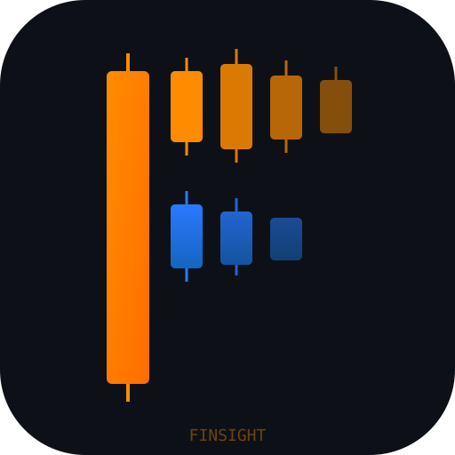
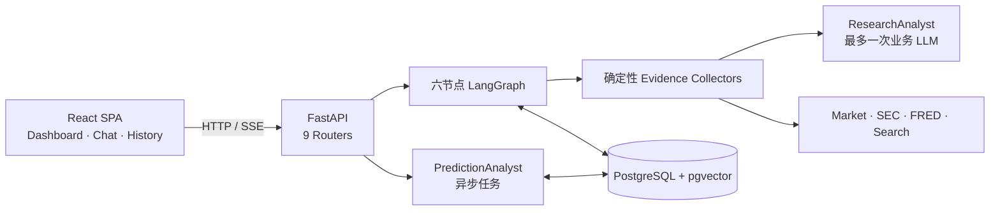

<p align="center"></p>
<h1 align="center">FinSight AI</h1>
<p align="center"><strong>可信行情、可验证 AI 判断与证据化金融研究</strong></p>

FinSight 已收敛为三个主产品入口：Dashboard、Chat、History。用户在 Dashboard 查看真实行情与规则指标，显式生成 `long / short / neutral` Prediction；在 Chat 基于来源继续研究；在 History 查看 Prediction、Outcome 与报告。系统不再提供组合工作台、筛选、回测、调仓、独立告警、晨报、成本审计或浏览器端模型配置。

## 核心能力

| 边界 | 当前实现 |
|---|---|
| 行情 | 规范化 quote/Kline/news/financials 网关；携带 provider、as_of、freshness、quality；禁止 synthetic OHLC |
| Prediction | 显式异步生成、幂等 run、服务端校验、PostgreSQL 落库、图表覆盖与 Outcome |
| Chat / Report | 六节点 LangGraph、确定性 evidence collectors、普通研究最多一次 ResearchAnalyst 调用、引用与质量门禁 |
| Monitor | 只监控当前 Dashboard 页面 lease；无 lease 时不请求行情或 LLM |
| 数据 | 核心业务、Prediction、报告、会话、Watchlist、Monitor 与 LLM usage 均以 PostgreSQL 为事实源；RAG 使用 pgvector |
| API | 9 个 FastAPI Router、35 个 OpenAPI 操作、唯一 `/api/execute` SSE 入口 |

## 快速启动

```bash
git clone https://github.com/kkkano/FinSight.git
cd FinSight
cp .env.server.example .env.server
# 在 .env.server 配置 PostgreSQL、Supabase、LLM 和至少一个可信行情供应商。
docker compose --env-file .env.server up -d --build
```

打开 `http://localhost:5173`。后端在 Compose 中仅绑定宿主机 `127.0.0.1:8000`，PostgreSQL 不暴露宿主端口。

LLM 最小配置：

```env
OPENAI_COMPATIBLE_API_KEY=...
OPENAI_COMPATIBLE_API_BASE=https://provider.example/v1
OPENAI_COMPATIBLE_MODEL=model-id
```

生产必须启用 `APP_MODE=production` 与 `SUPABASE_AUTH_REQUIRED=true`。不要提交真实凭据，也不要把密钥作为 Docker build arg 或命令行参数。

## 架构


```mermaid
flowchart LR
    UI[React SPA\nDashboard · Chat · History] -->|HTTP / SSE| API[FastAPI\n9 Routers]
    API --> GRAPH[六节点 LangGraph]
    GRAPH --> COLLECT[确定性 Evidence Collectors]
    COLLECT --> ANALYST[ResearchAnalyst\n最多一次业务 LLM]
    API --> PRED[PredictionAnalyst\n异步任务]
    COLLECT --> PROVIDERS[Market · SEC · FRED · Search]
    GRAPH <--> PG[(PostgreSQL + pgvector)]
    PRED <--> PG
```

主图只有六个节点：

```text
START
  -> prepare_context
  -> route_request
  -> collect_evidence
  -> analyze
  -> validate
  -> render
  -> END
```

事实查询证据充足时跳过 LLM；研究请求由 ResearchAnalyst 合成一次；Prediction 通过独立服务生成。Price、Technical、Fundamental、News、Macro、Risk 和 Search 是内部 collector 元数据，不是用户选择的七个 AI 人格。

## 产品路由

- `/welcome`：登录或只读入口。
- `/dashboard/:symbol?`：行情、规则指标、Prediction 与页面内 AI 动态。
- `/chat`：证据化追问和报告生成。
- `/history`：Prediction、Outcome 与报告历史。
- `/share/r/:token`：公开只读共享报告。

主导航只显示 Dashboard、Chat、History。

## 验证

```bash
python -m pytest backend/tests -q
npm run test:unit --prefix frontend
npm run build --prefix frontend
docker compose --env-file .env.server config --quiet
```

涉及交互或发布时，再运行 Playwright 与生产 canary。OpenAPI 变化必须同步 `frontend/src/api/openapi.snapshot.json` 和 `frontend/src/api/schema.d.ts`。

## 文档

- [当前架构](docs/01_ARCHITECTURE.md)
- [LangGraph 流程](docs/LANGGRAPH_FLOW.md)
- [Agent / Collector 指南](docs/AGENTS_GUIDE.md)
- [RAG 架构](docs/05_RAG_ARCHITECTURE.md)
- [执行事件合同](docs/execution-event-contract.md)
- [生产 Runbook](docs/11_PRODUCTION_RUNBOOK.md)
- [文档索引](docs/DOCS_INDEX.md)

历史计划、旧架构和一次性证据位于 `docs/archive/`，不作为当前运行事实源。

## 免责声明

本项目用于研究和工程实践，金融输出仅供参考，不构成投资建议。
