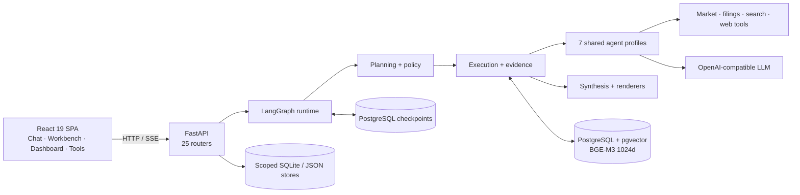
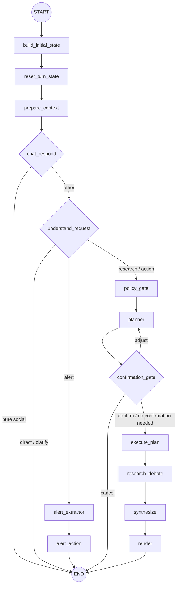
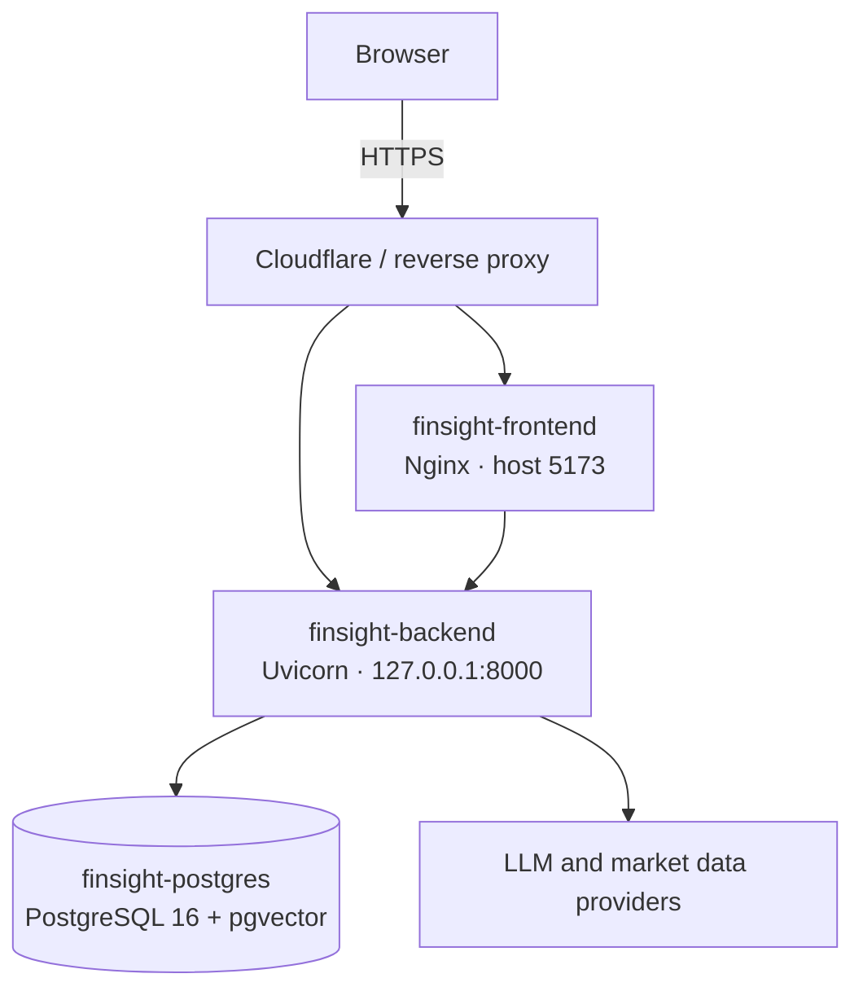

<p align="center"></p>
<h1 align="center">FinSight AI</h1>
<p align="center"><strong>Evidence-first multi-agent financial research built with LangGraph</strong></p>
<p align="center"><a href="./README.md">English</a> · <a href="./README_CN.md">中文</a> · <a href="./docs/DOCS_INDEX.md">Documentation</a> · <a href="https://finsight-ai.chat">Live demo</a></p>

FinSight AI combines conversational research, market dashboards, autonomous tasks, portfolio workflows, alerts and auditable evidence in one production system. The current runtime uses a single LangGraph entry path, seven shared agent profiles, PostgreSQL-backed checkpoints and pgvector RAG, plus an OpenAI-compatible LLM configuration that can be replaced without changing application code.

## What is included

| Area | Current capability |
|---|---|
| Research | Price, news, fundamental, technical, macro, risk and deep-search agents |
| Chat runtime | Request understanding, policy enforcement, plan confirmation, parallel execution, debate, synthesis and rendering |
| Evidence | Structured evidence pool, tool diagnostics isolation, citations and hallucination checks |
| Product surfaces | Chat, Workbench, dashboard, China market, RAG inspector, cost audit, screener, backtest and shared reports |
| Data | PostgreSQL checkpoints and pgvector RAG; selected legacy business stores remain SQLite/JSON |
| Operations | Docker Compose, health checks, SSE execution events and production runbook |

## Quick start

```bash
git clone https://github.com/kkkano/FinSight.git
cd FinSight
cp .env.server.example .env.server
# Set an OpenAI-compatible API key, base URL and model in .env.server.
docker compose --env-file .env.server up -d --build
```

Open `http://localhost:5173`. The backend is bound to `127.0.0.1:8000` by Docker Compose. PostgreSQL is available only inside the Compose network by default.

Required LLM variables:

```env
OPENAI_COMPATIBLE_API_KEY=...
OPENAI_COMPATIBLE_API_BASE=https://provider.example/v1
OPENAI_COMPATIBLE_MODEL=model-id
```

Do not commit real credentials. Optional market/search providers and all supported settings are documented in [`.env.server.example`](.env.server.example).

## System architecture


```mermaid
flowchart LR
    UI[React 19 SPA\nChat · Workbench · Dashboard · Tools] -->|HTTP / SSE| API[FastAPI\n25 routers]
    API --> GRAPH[LangGraph runtime]
    GRAPH --> POLICY[Planning + policy]
    POLICY --> EXEC[Execution + evidence]
    EXEC --> AGENTS[7 shared agent profiles]
    EXEC --> SYNTH[Synthesis + renderers]
    AGENTS --> TOOLS[Market · filings · search · web tools]
    AGENTS --> LLM[OpenAI-compatible LLM]
    EXEC <--> RAG[(PostgreSQL + pgvector\nBGE-M3 1024d)]
    GRAPH <--> CP[(PostgreSQL checkpoints)]
    API --> LEGACY[(Scoped SQLite / JSON stores)]
```

## LangGraph main path


```mermaid
flowchart TD
    S((START)) --> INIT[build_initial_state]
    INIT --> RESET[reset_turn_state]
    RESET --> PREP[prepare_context]
    PREP --> CHAT{chat_respond}
    CHAT -->|pure social| E((END))
    CHAT -->|other| U{understand_request}
    U -->|direct / clarify| E
    U -->|alert| AE[alert_extractor] --> AA[alert_action] --> E
    U -->|research / action| P[policy_gate] --> PL[planner] --> C{confirmation_gate}
    C -->|cancel| E
    C -->|adjust| PL
    C -->|confirm / no confirmation needed| X[execute_plan]
    X --> D[research_debate] --> Y[synthesize] --> R[render] --> E
```

`trim_history`, `summarize_history`, `normalize_ui_context` and `decide_output_mode` are registered compatibility nodes, but are not on the current main edge from `prepare_context`.

## Deployment topology


```mermaid
flowchart TB
    B[Browser] -->|HTTPS| EDGE[Cloudflare / reverse proxy]
    EDGE --> FE[finsight-frontend\nNginx · host 5173]
    EDGE --> BE[finsight-backend\nUvicorn · 127.0.0.1:8000]
    FE --> BE
    BE --> PG[(finsight-postgres\nPostgreSQL 16 + pgvector)]
    BE --> EXT[LLM and market data providers]
```

## Frontend routes

`/welcome`, `/chat`, `/workbench`, `/cn-market`, `/rag-inspector`, `/cost-audit`, `/screener`, `/backtest`, `/dashboard`, `/dashboard/:symbol`, and `/share/r/:token`. `/phase-labs` is only a backward-compatible redirect to `/screener`.

## Technology baseline

| Layer | Baseline |
|---|---|
| Frontend | React 19.2, TypeScript 5.9, Zustand 5, ECharts 6, Tailwind CSS 3.4, Rolldown Vite 7.2.5 |
| Backend | Python 3.11+, FastAPI, LangGraph/LangChain, Pydantic 2 |
| Retrieval | PostgreSQL 16, pgvector, BGE-M3 1024-dimensional embeddings |
| Packaging | Docker Compose: PostgreSQL, backend and Nginx frontend |

## Verification

```bash
python -m pytest backend/tests -q
npm run test:unit --prefix frontend
npm run build --prefix frontend
```

Run Playwright only when the changed user flow requires browser-level verification.

## Documentation

- [Architecture](docs/01_ARCHITECTURE.md)
- [LangGraph flow](docs/LANGGRAPH_FLOW.md) and [pipeline deep dive](docs/LANGGRAPH_PIPELINE_DEEP_DIVE.md)
- [Agent guide](docs/AGENTS_GUIDE.md)
- [RAG architecture](docs/05_RAG_ARCHITECTURE.md)
- [Execution event contract](docs/execution-event-contract.md)
- [Production runbook](docs/11_PRODUCTION_RUNBOOK.md)
- [Complete documentation index](docs/DOCS_INDEX.md)

Historical plans, QA evidence and superseded documents are retained under [`docs/archive/`](docs/archive/). They are not current architecture sources.

## License and disclaimer

This repository is for research and engineering use. Financial outputs are informational and are not investment advice.
