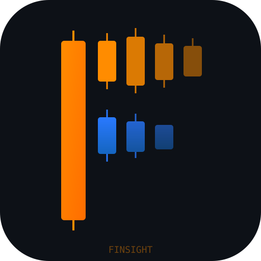
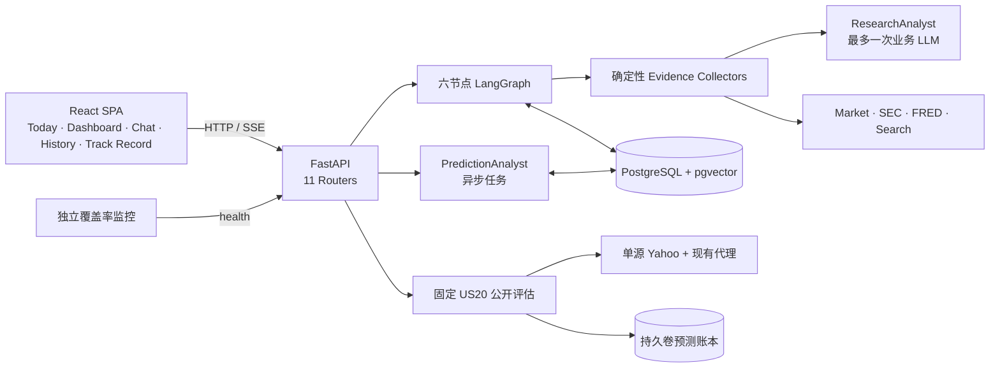

<p align="center"></p>
<h1 align="center">FinSight AI</h1>
<p align="center"><strong>可信行情、可验证 AI 判断与证据化金融研究</strong></p>

FinSight 当前有四个主工作区：Today、Dashboard、Chat、History。用户先在 Today 查看自选标的、最近 Prediction 与待跟进判断，再进入 Dashboard 检查真实行情和规则指标，在 Chat 基于来源继续研究，并在 History 复盘 Prediction、Outcome 与报告。根路径经过欢迎门后进入 Today；组合工作台、筛选、回测、调仓和成本审计不在当前产品面。登录用户可为聊天和报告切换模型；另有 `/track-record` 公开展示固定样本的预测战绩。

## 核心能力

| 边界 | 当前实现 |
|---|---|
| Today | 登录用户的自选报价、最近 Prediction/Outcome 与待跟进摘要；匿名访问只显示登录提示和只读行情入口 |
| 行情 | 规范化 quote/Kline/news/financials 网关；携带 provider、as_of、freshness、quality；禁止 synthetic OHLC |
| Prediction | 显式异步生成、幂等 run、服务端校验、PostgreSQL 落库、图表覆盖与 Outcome |
| Chat / Report | 六节点 LangGraph、确定性 evidence collectors、普通研究最多一次 ResearchAnalyst 调用、引用与质量门禁 |
| Monitor | 只监控当前 Dashboard 页面 lease；无 lease 时不请求行情或 LLM |
| 数据 | 核心业务、Prediction、报告、会话、Watchlist、Monitor 与 LLM usage 均以 PostgreSQL 为事实源；RAG 使用 pgvector |
| 模型选择 | 系统 Step 5 Preview 与用户自带服务，官方 effort、登录校验和完整研究上下文外发确认 |
| 公开战绩 | 固定 20 股每日 40 个机会，五交易日方向/回撤结算、简单基准与独立覆盖率告警 |
| API | 11 个 FastAPI Router、41 个 OpenAPI 操作、唯一 `/api/execute` SSE 入口；`/livez` 与 `/readyz` 分离存活和就绪状态 |

## 数据与安全边界

- 服务端只接受已验证 Supabase JWT 中的用户身份。会话 ID、请求 body 或 UI context 不能覆盖 owner；会话、执行回放、报告、自选和 Monitor 都校验 owner。
- 删除会话同时清理该线程的上下文、报告/引用、RAG 产物和 LangGraph checkpoint，不删除用户级数据。
- 质量门判定为 blocked 的报告只返回不可发布预览，不进入默认索引、共享链接或最终报告缓存。旧的 ticker 级最终报告缓存已禁用。
- 共享报告只输出显式 allowlist 字段，响应为 `private, no-store`；MCP 默认关闭，私有报告工具要求可信 transport principal。
- 公开 quote/news/Kline/Dashboard GET 仍受 IP 限流；只有基础设施健康探针绕过流量桶。
- 2026-09-15 锁文件审计：生产依赖 0 个已知漏洞；完整开发依赖仍有 17 个待升级项，不随生产镜像发布。

## 快速启动

```bash
git clone https://github.com/kkkano/FinSight.git
cd FinSight
cp .env.server.example .env.server
# 在 .env.server 配置 PostgreSQL、Supabase、LLM 和至少一个可信行情供应商。
docker compose --env-file .env.server up -d --build
```

打开 `http://localhost:5173`。后端在 Compose 中仅绑定宿主机 `127.0.0.1:8000`，PostgreSQL 不暴露宿主端口。

LLM 最小配置：

```env
OPENAI_COMPATIBLE_API_KEY=...
OPENAI_COMPATIBLE_API_BASE=https://provider.example/v1
OPENAI_COMPATIBLE_MODEL=model-id
```

生产必须启用 `APP_MODE=production` 与 `SUPABASE_AUTH_REQUIRED=true`。不要提交真实凭据，也不要把密钥作为 Docker build arg 或命令行参数。

## 架构


```mermaid
flowchart LR
    UI[React SPA\nToday · Dashboard · Chat · History · Track Record] -->|HTTP / SSE| API[FastAPI\n11 Routers]
    API --> GRAPH[六节点 LangGraph]
    GRAPH --> COLLECT[确定性 Evidence Collectors]
    COLLECT --> ANALYST[ResearchAnalyst\n最多一次业务 LLM]
    API --> PRED[PredictionAnalyst\n异步任务]
    COLLECT --> PROVIDERS[Market · SEC · FRED · Search]
    GRAPH <--> PG[(PostgreSQL + pgvector)]
    PRED <--> PG
    API --> BENCH[固定 US20 公开评估]
    BENCH --> YAHOO[单源 Yahoo + 现有代理]
    BENCH --> LEDGER[(持久卷预测账本)]
    WATCH[独立覆盖率监控] -->|health| API
```

主图只有六个节点：

```text
START
  -> prepare_context
  -> route_request
  -> collect_evidence
  -> analyze
  -> validate
  -> render
  -> END
```

事实查询证据充足时跳过 LLM；研究请求由 ResearchAnalyst 合成一次；Prediction 通过独立服务生成。Price、Technical、Fundamental、News、Macro、Risk 和 Search 是内部 collector 元数据，不是用户选择的七个 AI 人格。

## 产品路由

- `/welcome`：登录或只读入口。
- `/today`：默认工作区；登录后显示个性化摘要，匿名状态显示登录引导。
- `/dashboard/:symbol?`：行情、规则指标、Prediction 与页面内 AI 动态。
- `/chat`：证据化追问和报告生成。
- `/history`：Prediction、Outcome 与报告历史。
- `/share/r/:token`：公开只读共享报告。

主导航显示 Today、Dashboard、Chat、History。`/chat` 与 `/history` 要求登录；Today 和 Dashboard 通过欢迎门后可进入，但个人数据仍只对有效用户身份开放。

## 运行健康

- `/livez`：只检查后端进程存活，不访问外部依赖。
- `/readyz`：部署和容器编排的就绪门禁；生产环境会检查认证、PostgreSQL/Alembic、可信行情、六节点 Graph、PostgreSQL checkpointer、LLM 与 PostgreSQL/pgvector RAG。
- `/health`：兼容的组件状态摘要，不替代 `/readyz` 的发布判定。

生产启动会先执行一次真实 BGE-M3 embedding readiness probe，并在 CPU 模型冷启动期间由容器 180 秒 start period 保护；probe 失败时生产保持未就绪，不使用 hash 或内存回退。

前端镜像默认使用同源 API，并由 Nginx 代理 `/api`、SSE 与健康探针到后端；只有明确采用独立 API 域名时才设置 `VITE_API_BASE_URL`。

## 验证

```bash
python -m pytest backend/tests -q
npm run test:unit --prefix frontend
npm run build --prefix frontend
docker compose --env-file .env.server config --quiet
```

涉及交互或发布时，再运行 Playwright 与生产 canary。OpenAPI 变化必须同步 `frontend/src/api/openapi.snapshot.json` 和 `frontend/src/api/schema.d.ts`。

Playwright 登录场景使用 Supabase client contract fixture 驱动 `getSession` 与 `onAuthStateChange`，不再用 localStorage 假登录；生产 canary 仍必须使用隔离的真实 Supabase 用户。

## 文档

- [当前架构](docs/01_ARCHITECTURE.md)
- [LangGraph 流程](docs/LANGGRAPH_FLOW.md)
- [Agent / Collector 指南](docs/AGENTS_GUIDE.md)
- [RAG 架构](docs/05_RAG_ARCHITECTURE.md)
- [执行事件合同](docs/execution-event-contract.md)
- [生产 Runbook](docs/11_PRODUCTION_RUNBOOK.md)
- [文档索引](docs/DOCS_INDEX.md)

历史计划、旧架构和一次性证据位于 `docs/archive/`，不作为当前运行事实源。

## 免责声明

本项目用于研究和工程实践，金融输出仅供参考，不构成投资建议。
