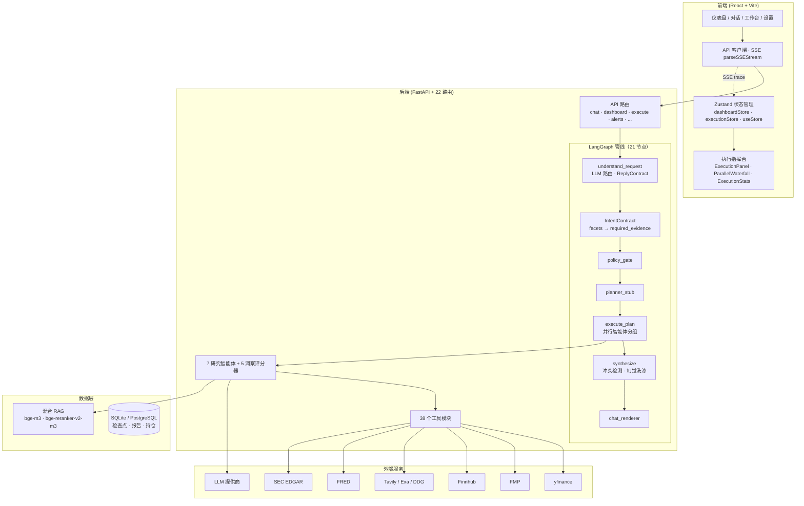
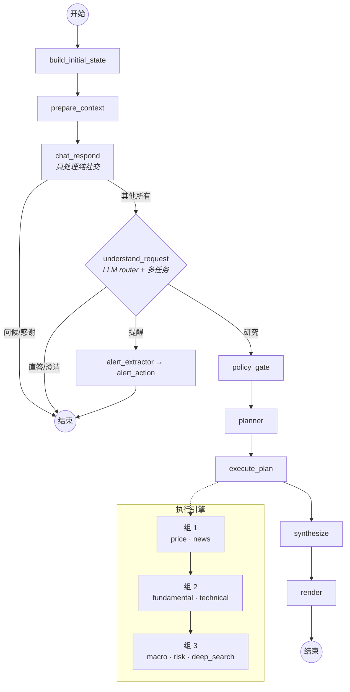
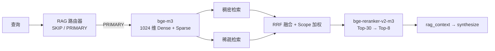

<p align="center">
  
</p>

<h1 align="center">FinSight AI</h1>

<p align="center">
  <strong>基于 LangGraph 的多智能体金融研究平台</strong>
</p>

<p align="center">
  <a href="./README.md">English</a> |
  <a href="./README_CN.md">中文</a> |
  <a href="./docs/DOCS_INDEX.md">文档索引</a>
</p>

<p align="center">
  🌐 <strong>在线演示:</strong> <a href="https://finsight-ai.chat">finsight-ai.chat</a>
</p>

---

**FinSight AI** 是一个生产级多智能体金融研究系统，基于 **LangGraph** 构建。它将对话式 AI、6 标签页专业仪表盘、自主任务执行（工作台）、实时执行追踪和邮件主动预警统一在一个平台中。

<p align="center">
  
</p>

---

## ✨ 核心特性

| 类别 | 亮点 |
|------|------|
| **多智能体研究** | 7 个专业智能体（价格、新闻、基本面、技术面、宏观、风险、深度搜索）支持并行执行组 |
| **LangGraph 管线** | 证据优先意图合同：会话路由 → 语义分解 → 策略门控 → 并行执行 → 冲突感知合成 |
| **专业仪表盘** | 6 个分析标签页（总览、财务、技术、新闻、研究、同行）+ 实时 ECharts + 5 个 AI 洞察评分器 |
| **执行指挥台** | 三模式追踪（用户/专家/开发）+ 并行瀑布图 + 预算优先级 + LLM token/成本统计 |
| **混合 RAG** | bge-m3（1024 维 Dense + Sparse）+ bge-reranker-v2-m3 交叉编码器；三层评估门控（12/12 通过，CR=0.0） |
| **智能图表** | 双模式 LLM 图表：`<chart>`（内联数据）+ `<chart_ref>`（真实 API 数据引用） |
| **工作台** | 自主任务执行、投资组合再平衡（LLM 增强）、研报时间线 |
| **主动预警** | 3 个调度器（价格/新闻/风险）通过 SMTP 邮件通知 |
| **韧性设计** | 11 源价格级联、LLM 熔断器、planner stub 回退、RAG hash 降级 |
| **幻觉防御** | 正则模式匹配 + 证据交叉验证 + 占位符洗涤（[详情](docs/HALLUCINATION_MITIGATION.md)） |
| **Phase Labs** | 对话式价格提醒、智能选股、A 股市场数据、策略回测 |

---

## 🚀 快速开始

```bash
git clone https://github.com/kkkano/FinSight.git
cd FinSight
cp .env.server.example .env.server
# 编辑 .env.server — 最少配置 OPENAI_COMPATIBLE_API_KEY
docker compose --env-file .env.server up -d --build
```

打开 **http://localhost:5173**（前端）· API 位于 **http://localhost:8000**

<details>
<summary>API 密钥说明</summary>

| Key | 是否必填 | 用途 |
|-----|---------|------|
| `OPENAI_COMPATIBLE_API_KEY` | **必填** | 默认 LLM 端点 |
| `OPENAI_COMPATIBLE_API_BASE` | **必填** | LLM base URL |
| `FMP_API_KEY` | 推荐 | 财务数据（回退：yfinance） |
| `FINNHUB_API_KEY` | 选填 | 实时行情与新闻 |
| `TAVILY_API_KEY` | 选填 | 网页搜索（回退：DuckDuckGo） |
| `FRED_API_KEY` | 选填 | 宏观经济数据 |

非必填 API 均有自动回退机制。完整列表见 [`.env.server.example`](.env.server.example)。

</details>

<details>
<summary>手动部署（不使用 Docker）</summary>

```bash
# 后端
python -m venv .venv && source .venv/bin/activate  # Windows: .venv\Scripts\activate
pip install -r requirements.txt
cp .env.server.example .env.server  # 填入 API key
python -m uvicorn backend.api.main:app --host 0.0.0.0 --port 8000

# 前端
cd frontend && pnpm install && pnpm dev
```

</details>

---

## 📸 平台预览

<table>
<tr>
<td width="50%">

**仪表盘 — AI 评分环、智能体覆盖、风险指标**


</td>
<td width="50%">

**对话 + "问这条" — 对话式 AI + 持仓面板**


</td>
</tr>
<tr>
<td width="50%">

**深度研究报告 — 智能体置信度、催化剂、风险提示**


</td>
<td width="50%">

**执行时间线 + 分析师摘要卡片**


</td>
</tr>
<tr>
<td width="50%">

**工作台 — 任务执行、组合再平衡、研报时间线**


</td>
<td width="50%">

**思考过程 — 折叠式推理节点**


</td>
</tr>
</table>

<details>
<summary>更多截图</summary>

| RAG Inspector — 查询运行与事件 | RAG Inspector — 原文与 Chunk |
|:-:|:-:|
|  |  |

| 对话内联图表 | 控制台 & SSE 事件 |
|:-:|:-:|
|  |  |

</details>

---

## 🏗️ 系统架构



---

## 🔄 LangGraph 管线

聊天主链路是一个 LangGraph 有状态图。`conversation_router` 定位意图，`intent_contract` 将语义 facets 编译为 `required_evidence`，随后 policy/planner/executor 链按并行组调度智能体。证据与工具诊断分离——失败工具输出进入 `artifacts.tool_diagnostics`，不会伪装成 evidence。



> **深入了解**: [管线架构](docs/LANGGRAPH_PIPELINE_DEEP_DIVE.md) · [意图合同与 GraphState](docs/01_ARCHITECTURE.md) · [事件协议](docs/execution-event-contract.md)

---

## 🤖 智能体生态

### 7 个研究智能体

每个智能体继承自 `BaseFinancialAgent`，实现带反思循环、工具调用和证据收集的 `research()` 方法。

| 智能体 | 工具 | 特色 |
|--------|------|------|
| **价格智能体** | `get_stock_price`、期权、搜索 | 11 源价格级联（yfinance → FMP → Finnhub → ...） |
| **新闻智能体** | 公司新闻、情绪、日历、搜索 | 信源可靠性评分、突发新闻检测 |
| **基本面智能体** | 财报、公司信息、盈利、EPS、搜索 | 营收/利润率趋势分析、8 季度数据 |
| **技术面智能体** | 历史数据、搜索 | RSI、MACD、布林带、Stochastic、ADX、8 条均线 |
| **宏观智能体** | FRED、情绪、事件、搜索 | 宏观-微观联动分析 |
| **风险智能体** | 风险评估、因子暴露、压力测试 | Beta、VaR(95%)、最大回撤、夏普 |
| **深度搜索智能体** | Tavily → Exa → DDG、文档抓取 | Self-RAG 循环 + 收敛追踪、SSRF 防护 |

### 5 个仪表盘洞察评分器

轻量级评分器（非自主智能体），通过单次 LLM 调用 + 确定性回退为每个仪表盘标签页生成 AI 洞察卡片。经 `/api/dashboard/insights` 独立提供，不在研究管线内。

> **详细说明**: [Agent 与 Tool 指南](docs/AGENTS_GUIDE.md) · [Dashboard 开发指南](docs/DASHBOARD_DEVELOPMENT_GUIDE.md)

---

## 🔭 执行追踪与可观测性

底部的**执行指挥台**把原始 SSE 流变成实时的、结构化的执行追踪视图。`ChatInput` 把聊天 SSE 流接入 `executionStore`，其 reducer 解析 `plan_ready`、`step_start/step_done`、`agent_*`、`decision_note` 事件。

| 模式 | 展示 |
|------|------|
| **用户** | 阶段进度环 + 带数据源 chips 的 agent 卡片 |
| **专家** | 阶段条 · 计划摘要 · **并行执行瀑布图** · 决策流 · token/成本统计 |
| **开发** | 原始 SSE 事件流 |

**并行瀑布图**：步骤按 `parallel_group` 分泳道；bar 宽度 ∝ `duration_ms`，颜色区分工具（amber）与 agent（violet）。

**LLM token 计量**：每个 run 用 `ContextVar` 累加器在 LLM 统一入口采集；`done.metrics` 携带 `total_tokens` / `total_cost_usd` / `tokens_by_model`。

> **详细说明**: [事件协议](docs/execution-event-contract.md) · [架构文档 §10](docs/01_ARCHITECTURE.md)

---

## 🔍 RAG 引擎



| 组件 | 模型 / 算法 |
|------|------------|
| 嵌入器 | `BAAI/bge-m3` — 1024 维 Dense + Sparse |
| 精排器 | `BAAI/bge-reranker-v2-m3` 交叉编码器 |
| 存储 | 内存 或 PostgreSQL（pgvector） |

RAG Quality V2：三层评估（Mock → 真实检索 → 端到端），**12/12 通过**，三层 CR=0.0。[完整报告](tests/rag_qualityV2/REPORT.md)

> **详细说明**: [RAG 架构](docs/05_RAG_ARCHITECTURE.md) · [评估指南](docs/rag-evaluation-guide.md)

---

## 🔧 技术栈

| 层级 | 技术 |
|------|------|
| **后端** | Python 3.11 · FastAPI · LangGraph · LangChain · Langfuse · APScheduler · Pydantic |
| **前端** | React 19 · Vite 6 · TypeScript 5 · Zustand 5 · ECharts 5 · TailwindCSS 4 |
| **模型** | 可配置 LLM（OpenAI / Gemini / DeepSeek / Anthropic）· bge-m3（1024d）· bge-reranker-v2-m3 |
| **数据** | PostgreSQL + pgvector · SQLite · JSON 文件存储 |
| **基础设施** | Docker Compose · Cloudflare Tunnel · Nginx |

---

## 📁 项目结构

```
FinSight/
├── backend/
│   ├── api/              # FastAPI 路由（28 个模块）
│   ├── graph/            # LangGraph 管线核心（21 节点）
│   ├── agents/           # 7 个研究智能体 + 基类
│   ├── tools/            # 38 个工具模块
│   ├── dashboard/        # 仪表盘数据服务 & AI 洞察评分器
│   ├── rag/              # 混合 RAG 引擎（嵌入、精排、路由）
│   ├── services/         # 后台服务（预警、记忆、LLM 用量）
│   └── tests/
├── frontend/
│   └── src/
│       ├── api/          # API 客户端 + SSE 流式
│       ├── store/        # Zustand 状态管理（3 个 Store）
│       ├── components/   # 仪表盘、对话、执行追踪、工作台
│       ├── hooks/
│       └── types/
├── docs/                 # 技术文档
├── tests/                # 回归测试与评估器
├── docker-compose.yml
├── requirements.txt
└── .env.server.example
```

---

## 📚 文档

完整索引: [`docs/DOCS_INDEX.md`](docs/DOCS_INDEX.md)

| 文档 | 内容 |
|------|------|
| [系统架构](docs/01_ARCHITECTURE.md) | 模块、数据流、意图合同、执行追踪 |
| [管线深度拆解](docs/LANGGRAPH_PIPELINE_DEEP_DIVE.md) | 21 节点图、GraphState 字段、token 埋点 |
| [Agent 指南](docs/AGENTS_GUIDE.md) | 智能体能力、工具矩阵、预算优先级 |
| [Dashboard 指南](docs/DASHBOARD_DEVELOPMENT_GUIDE.md) | 6 标签页仪表盘、组件、ExecutionPanel |
| [事件协议](docs/execution-event-contract.md) | SSE 事件类型、阶段、trace 协议 |
| [生产运维手册](docs/11_PRODUCTION_RUNBOOK.md) | 部署、回滚、排障 |
| [贡献指南](CONTRIBUTING.md) | 开发环境、工作流、测试 |

---

## 📄 许可证

[MIT License](./LICENSE)

<p align="center">
  基于 LangGraph + React + ECharts 构建
</p>
