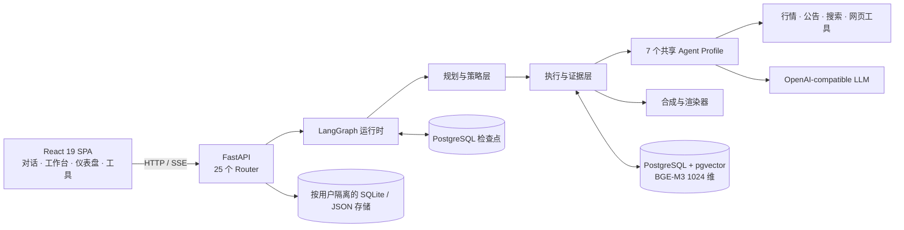
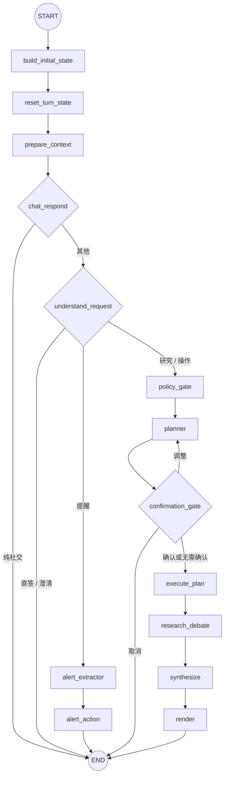
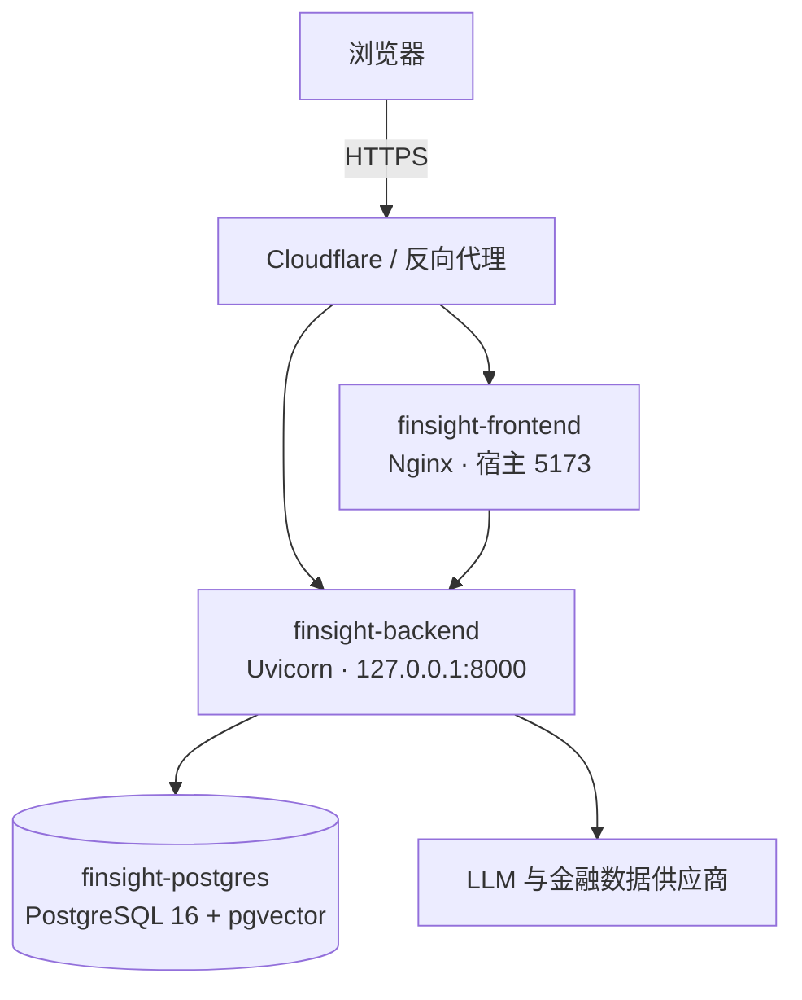

<p align="center"></p>
<h1 align="center">FinSight AI</h1>
<p align="center"><strong>基于 LangGraph、以证据为先的多智能体金融研究平台</strong></p>
<p align="center"><a href="./README.md">English</a> · <a href="./README_CN.md">中文</a> · <a href="./docs/DOCS_INDEX.md">文档索引</a> · <a href="https://finsight-ai.chat">在线演示</a></p>

FinSight AI 将对话研究、市场仪表盘、自主任务、投资组合工作流、主动提醒和可审计证据整合在一个生产系统中。当前运行时使用统一 LangGraph 主入口、7 个共享 Agent Profile、PostgreSQL 检查点和 pgvector RAG；LLM 采用 OpenAI-compatible 配置，可替换供应商而无需修改业务代码。

## 当前能力

| 领域 | 当前实现 |
|---|---|
| 研究 | 价格、新闻、基本面、技术面、宏观、风险、深度搜索 7 类智能体 |
| 对话运行时 | 请求理解、策略约束、计划确认、并行执行、研究辩论、合成和渲染 |
| 证据 | 结构化证据池、工具诊断隔离、引用和幻觉检查 |
| 产品入口 | 对话、工作台、仪表盘、A 股市场、RAG 检查器、成本审计、选股、回测和报告分享 |
| 数据 | PostgreSQL 检查点与 pgvector RAG；部分旧业务存储仍为 SQLite/JSON |
| 运维 | Docker Compose、健康检查、SSE 执行事件和生产 Runbook |

## 快速开始

```bash
git clone https://github.com/kkkano/FinSight.git
cd FinSight
cp .env.server.example .env.server
# 在 .env.server 配置 OpenAI-compatible API key、base URL 和模型名。
docker compose --env-file .env.server up -d --build
```

访问 `http://localhost:5173`。Docker Compose 中后端只绑定 `127.0.0.1:8000`；PostgreSQL 默认只开放给 Compose 内部网络。

必需的 LLM 配置：

```env
OPENAI_COMPATIBLE_API_KEY=...
OPENAI_COMPATIBLE_API_BASE=https://provider.example/v1
OPENAI_COMPATIBLE_MODEL=model-id
```

不要提交真实凭据。可选行情/搜索供应商及完整变量见 [`.env.server.example`](.env.server.example)。

## 系统架构


```mermaid
flowchart LR
    UI[React 19 SPA\n对话 · 工作台 · 仪表盘 · 工具] -->|HTTP / SSE| API[FastAPI\n25 个 Router]
    API --> GRAPH[LangGraph 运行时]
    GRAPH --> POLICY[规划与策略层]
    POLICY --> EXEC[执行与证据层]
    EXEC --> AGENTS[7 个共享 Agent Profile]
    EXEC --> SYNTH[合成与渲染器]
    AGENTS --> TOOLS[行情 · 公告 · 搜索 · 网页工具]
    AGENTS --> LLM[OpenAI-compatible LLM]
    EXEC <--> RAG[(PostgreSQL + pgvector\nBGE-M3 1024 维)]
    GRAPH <--> CP[(PostgreSQL 检查点)]
    API --> LEGACY[(按用户隔离的 SQLite / JSON 存储)]
```

## LangGraph 主路径


```mermaid
flowchart TD
    S((START)) --> INIT[build_initial_state]
    INIT --> RESET[reset_turn_state]
    RESET --> PREP[prepare_context]
    PREP --> CHAT{chat_respond}
    CHAT -->|纯社交| E((END))
    CHAT -->|其他| U{understand_request}
    U -->|直答 / 澄清| E
    U -->|提醒| AE[alert_extractor] --> AA[alert_action] --> E
    U -->|研究 / 操作| P[policy_gate] --> PL[planner] --> C{confirmation_gate}
    C -->|取消| E
    C -->|调整| PL
    C -->|确认或无需确认| X[execute_plan]
    X --> D[research_debate] --> Y[synthesize] --> R[render] --> E
```

`trim_history`、`summarize_history`、`normalize_ui_context` 和 `decide_output_mode` 仍作为兼容节点注册，但不在 `prepare_context` 之后的当前主边上。

## 部署拓扑


```mermaid
flowchart TB
    B[浏览器] -->|HTTPS| EDGE[Cloudflare / 反向代理]
    EDGE --> FE[finsight-frontend\nNginx · 宿主 5173]
    EDGE --> BE[finsight-backend\nUvicorn · 127.0.0.1:8000]
    FE --> BE
    BE --> PG[(finsight-postgres\nPostgreSQL 16 + pgvector)]
    BE --> EXT[LLM 与金融数据供应商]
```

## 前端路由

`/welcome`、`/chat`、`/workbench`、`/cn-market`、`/rag-inspector`、`/cost-audit`、`/screener`、`/backtest`、`/dashboard`、`/dashboard/:symbol` 和 `/share/r/:token`。`/phase-labs` 仅保留为跳转到 `/screener` 的兼容入口。

## 技术基线

| 层 | 当前版本/实现 |
|---|---|
| 前端 | React 19.2、TypeScript 5.9、Zustand 5、ECharts 6、Tailwind CSS 3.4、Rolldown Vite 7.2.5 |
| 后端 | Python 3.11+、FastAPI、LangGraph/LangChain、Pydantic 2 |
| 检索 | PostgreSQL 16、pgvector、BGE-M3 1024 维向量 |
| 打包 | Docker Compose：PostgreSQL、后端、Nginx 前端 |

## 验证

```bash
python -m pytest backend/tests -q
npm run test:unit --prefix frontend
npm run build --prefix frontend
```

只有涉及用户交互链路时才需要追加 Playwright 验证。

## 当前文档

- [系统架构](docs/01_ARCHITECTURE.md)
- [LangGraph 流程](docs/LANGGRAPH_FLOW.md)与[管线深潜](docs/LANGGRAPH_PIPELINE_DEEP_DIVE.md)
- [Agent 指南](docs/AGENTS_GUIDE.md)
- [RAG 架构](docs/05_RAG_ARCHITECTURE.md)
- [执行事件契约](docs/execution-event-contract.md)
- [生产 Runbook](docs/11_PRODUCTION_RUNBOOK.md)
- [完整文档索引](docs/DOCS_INDEX.md)

历史计划、QA 证据和被替代文档保存在 [`docs/archive/`](docs/archive/)；它们不再是当前架构事实源。

## 免责声明

本项目用于研究和工程实践，金融输出仅供参考，不构成投资建议。
