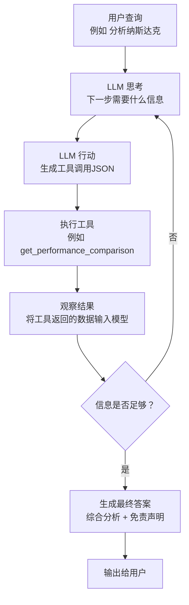

# FinSight: AI驱动的股票分析代理

[English Version](./readme.md) | [中文版](./readme_cn.md)
[example](./example.md)
## 核心理念

FinSight 是一个基于大型语言模型 (LLM) 的智能代理，用于进行实时的股票和市场分析。它采用 **ReAct (推理 + 行动)** 框架，通过自主调用 `yfinance`、网络搜索等工具来收集数据，并最终合成结构化的分析报告。

- **适用场景**：快速获取对股票、指数或市场趋势的综合概述，例如“分析 NVDA 股票”或“纳斯达克最近表现如何？”。
- **核心优势**：具备自主推理能力，能获取实时数据，并采用模块化工具设计。通过 LiteLLM 代理，可轻松切换 Gemini、OpenAI 等不同模型。
- **安装简单**：只需克隆仓库、创建虚拟环境、安装依赖并设置 API 密钥，即可通过命令行界面 (CLI) 运行。
- **局限性**：分析依赖于公开的免费 API，数据可能有轻微延迟；项目不提供实时交易功能。

---

## 工作原理 (ReAct 框架)

FinSight 通过模拟金融分析师的思考过程来工作。它遵循一个“思考 -> 行动 -> 观察”的循环，直到收集到足够的信息来回答用户的问题。



---

## 快速入门

1.  **克隆仓库**：
    ```bash
    git clone https://github.com/kkkano/FinSight-main.git
    cd FinSight-main
    ```

2.  **创建并激活虚拟环境**：
    *   **Linux/macOS**:
        ```bash
        python3 -m venv .venv && source .venv/bin/activate
        ```
    *   **Windows**:
        ```bash
        python -m venv .venv && .\.venv\Scripts\activate
        pip install -r requirements.txt -i https://mirrors.aliyun.com/pypi/simple/
        ```

3.  **安装依赖**：
    ```bash
    pip install -r requirements.txt
    ```

4.  **配置 API 密钥**：
    在项目根目录创建一个名为 `.env` 的文件，并添加你的 API 密钥：
    ```env
    # 必需：LLM API 密钥
    GEMINI_PROXY_API_KEY=your_gemini_api_key_here
    GEMINI_PROXY_API_BASE=https://your-proxy-url.com/v1
    
    # 可选但强烈推荐：金融数据 API
    ALPHA_VANTAGE_API_KEY=your_alpha_vantage_key_here
    FINNHUB_API_KEY=your_finnhub_key_here
    ```
    
    **API 密钥获取：**
    - **Gemini/LLM**：你的 LLM 提供商的 API 密钥（必需，用于 AI 分析）
    - **Alpha Vantage**：[获取免费密钥](https://www.alphavantage.co/support/#api-key)（每天 500 次请求）
    - **Finnhub**：[获取免费密钥](https://finnhub.io/register)（每分钟 60 次请求）
    
    > 💡 **注意**：Alpha Vantage 和 Finnhub 相比免费数据源提供更稳定的金融数据。虽然是可选的，但它们能显著提高可靠性并减少速率限制问题。

5.  **运行代理**：
    ```bash
    python main.py
    ```
    启动后，根据提示输入你的查询（例如“分析 AAPL”），或输入“exit”退出程序。

---

## 执行案例：分析“纳斯达克”

以下是 FinSight 处理用户查询“纳斯达克”时的完整思考和执行过程。

**用户输入:**
```
> 纳斯达克
```

---

#### 步骤 1: 获取当前日期

-   **思考**: 我需要获取当前日期和时间，以确保分析具有时效性。
-   **行动**: 调用 `get_current_datetime` 工具。
-   **结果**: `2025-10-12 20:09:11`

*此步骤确保所有后续数据分析都基于最新的时间点。*

---

#### 步骤 2: 搜索纳斯达克概述

-   **思考**: 我已经有了当前日期。现在我需要了解纳斯达克综合指数的基本信息。
-   **行动**: 调用 `search` 工具，查询 `"Nasdaq composite index overview"`。
-   **结果**:
    > 搜索结果:
    > 1.  **Wikipedia Nasdaq Composite**: 纳斯达克综合指数（代码 ^IXIC）是一个股票市场指数，包括纳斯达克股票交易所上市的几乎所有股票...

*此步骤确认了分析对象（^IXIC）及其定义，为后续的数据获取奠定基础。*

---

#### 步骤 3: 与其他指数进行性能比较

-   **思考**: 为了更好地评估纳斯达克的表现，我应该将其与其它主要市场指数进行比较。
-   **行动**: 调用 `get_performance_comparison` 工具，比较 `^IXIC` (纳斯达克), `^GSPC` (标普500), 和 `^DJI` (道琼斯)。
-   **结果**:

| 指数 | 当前值 | 年初至今 (YTD) | 1年回报 |
| :--- | :--- | :--- | :--- |
| **Nasdaq Composite** | **22204.43** | **+15.16%** | **+21.05%** |
| S&P 500 | 6552.51 | +11.65% | +12.68% |
| Dow Jones Indu. | 34890.12 | +7.28% | +6.10% |

*数据显示，纳斯达克在 YTD 和 1 年回报上均显著优于标普500和道琼斯，反映了科技板块的强劲势头。*

---

#### 步骤 4: 分析历史回撤

-   **思考**: 强劲的增长通常伴随着高波动性。我需要分析纳斯达克的历史回撤来揭示其风险特征。
-   **行动**: 调用 `analyze_historical_drawdowns` 工具，分析 `^IXIC`。
-   **结果**:
    > **^IXIC 的前3大历史回撤:**
    > 1.  **2000年崩盘 (互联网泡沫)**: 最大回撤 **-77.93%** | 恢复期: 5518天 (约15.1年)
    > 2.  **1973年崩盘 (石油危机)**: 最大回撤 **-59.90%** | 恢复期: 2063天 (约5.6年)
    > 3.  **2021年崩盘 (利率上升)**: 最大回撤 **-36.40%** | 恢复期: 829天 (约2.3年)

*历史数据明确显示了纳斯达克的高风险特征，尤其是在市场泡沫破裂时，可能需要极长的时间来恢复。*

---

#### 步骤 5: 生成最终分析报告

-   **思考**: 我已经收集了关于纳斯达克的定义、近期表现、与同行的比较以及历史风险。现在我可以生成一份全面的分析报告了。
-   **最终答案**:

    > 纳斯达克综合指数 (^IXIC) 是一个以科技和成长型公司为主导的市场指数。
    >
    > **近期表现 (截至 2025年10月12日):**
    > 它的表现非常强劲，年初至今增长了 **+15.16%**，过去一年增长了 **+21.05%**，显著优于标普500和道琼斯工业平均指数。这表明市场对科技和创新领域的投资热情高涨。
    >
    > **历史风险:**
    > 然而，高回报伴随着高风险。历史数据显示，纳斯达克在市场危机中波动剧烈。最著名的例子是2000年的互联网泡沫破裂，当时指数暴跌近 **78%**，并花费了超过15年的时间才完全恢复。
    >
    > **总结:**
    > 纳斯达克目前处于强劲的上升趋势中，但投资者必须警惕其固有的高波动性。历史经验提醒我们，在追逐高增长的同时，风险管理至关重要。
    >
    > *免责声明: 本分析不构成任何投资建议。*

---

## 项目结构

-   `agent.py`: 核心 ReAct 循环，负责解析 LLM 的思考与行动。
-   `tools.py`: 所有金融工具的定义，采用**多数据源策略**：
    - **股票价格**：Alpha Vantage → Finnhub → yfinance → 网页爬取 → 搜索引擎
    - **公司信息**：yfinance → Finnhub → Alpha Vantage → 网页搜索
    - **新闻资讯**：智能路由（公司股票使用 API，市场指数使用搜索）
    - **市场情绪**：CNN 恐惧与贪婪指数，带有备用机制
    - **经济事件**：DuckDuckGo 搜索配合智能解析
    - **性能比较**：多股票代码的年初至今和1年期分析
    - **历史回撤**：20年回撤分析及恢复期追踪
-   `llm_service.py`: 封装对 LiteLLM 代理的调用。
-   `main.py`: 项目的命令行入口。
-   `requirements.txt`: 项目依赖列表。
-   `.env`: 存储 API 密钥。

---

## 核心特性与改进

### 🚀 多数据源策略
FinSight 现在实现了**级联回退系统**来获取数据：
1. **主要**：高级 API（Alpha Vantage、Finnhub）- 更快、更可靠
2. **次要**：免费 API（yfinance）- 好用但容易遇到速率限制
3. **第三**：从 Yahoo Finance 爬取网页数据
4. **最后手段**：搜索引擎解析

这确保了即使单个数据源失败或达到速率限制，系统仍能**保持最大正常运行时间**。

### 📊 智能工具选择
- **公司股票**（如 AAPL、TSLA）：使用金融 API 获取准确的实时数据
- **市场指数**（如 ^IXIC、^GSPC）：使用专门的搜索策略进行宏观分析
- 自动检测股票代码类型并路由到合适的数据源

### 🛡️ 增强的错误处理
- 带指数退避的重试机制
- API 失败时优雅降级
- 详细的日志记录便于故障排查
- 用户友好的错误消息

---

## 可用工具

| 工具名称 | 描述 | 数据源 |
|---------|------|--------|
| `get_stock_price` | 实时股价和涨跌幅 | Alpha Vantage、Finnhub、yfinance、爬虫 |
| `get_company_info` | 公司简介、行业、市值 | yfinance、Finnhub、Alpha Vantage |
| `get_company_news` | 最新新闻（自动检测指数） | yfinance、Finnhub、Alpha Vantage、搜索 |
| `get_market_sentiment` | CNN 恐惧与贪婪指数 | CNN API、网页爬取、搜索 |
| `get_economic_events` | 即将到来的 FOMC、CPI、就业报告 | DuckDuckGo 搜索 |
| `get_performance_comparison` | 比较多个股票代码（YTD、1年） | yfinance 历史数据 |
| `analyze_historical_drawdowns` | 前3大历史崩盘与恢复 | yfinance 20年数据 |
| `search` | 通用网页搜索 | DuckDuckGo |
| `get_current_datetime` | 当前时间戳 | 系统时间 |

---

## 故障排除

### 速率限制问题
如果遇到 `Too Many Requests` 错误：
1. **添加 API 密钥**：在 `.env` 中配置 Alpha Vantage 和 Finnhub
2. **等待**：免费层有冷却期（通常为 1 分钟）
3. **使用高级版**：升级到付费计划以获得更高限制

### API 密钥不工作
- 确保 `.env` 文件中密钥周围没有引号
- 检查额外空格：应为 `KEY=value` 而不是 `KEY = value`
- 在提供商网站上验证密钥是否有效

### 工具故障
- 检查网络连接
- 查看终端输出中的具体错误消息
- 大多数工具都有备用机制，会尝试替代数据源

---

## 贡献

欢迎贡献！可能的增强功能：
- 额外的数据源（Bloomberg API、路透社等）
- 更多分析工具（技术指标、情绪分析）
- 支持加密货币和大宗商品
- 可视化功能（图表、图形）
- Web 界面或 Discord 机器人

---

## 许可证

本项目在 MIT 许可证下开源。