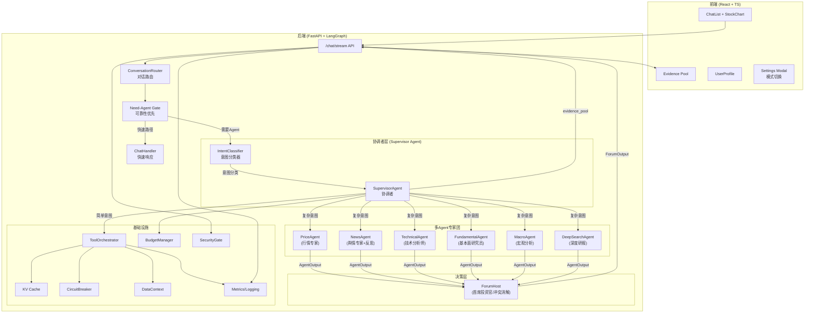
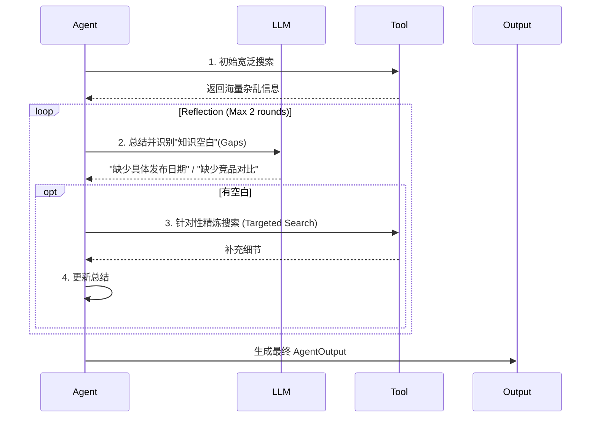

# FinSight 终极架构设计：智能金融合伙人

> **更新日期**: 2026-01-24
> **核心愿景**: 从被动问答的"工具人"升级为主动服务的"智能合伙人"
> **架构模式**: Supervisor Agent (协调者模式)
>
> **近期同步**:
> - ReportIR citations 增加 confidence / freshness_hours 字段（P0-2）
> - News/Macro 回退结构化输出，避免 raw 文本进入报告（P0-3）
> - get_company_news 改为结构化列表，NewsAgent/SupervisorAgent 同步适配（P1-1）
> - SSRF 防护扩展至 DeepSearch + fetch_url_content（P1-2）
> - pytest 收集 backend/tests + test/（不再标记 legacy）
> - PlanIR + Executor 与 EvidencePolicy 落地（计划模板/执行 trace/引用校验）
> - DataContext 统一 as_of/currency/adjustment 并输出一致性告警（P0-27）
> - BudgetManager 限制工具调用/轮次/耗时预算，预算快照可追溯（P0-28）
> - SecurityGate：鉴权 + 限流 + 免责声明模板落地（P0-29）
> - Cache 抖动 + 负缓存，CircuitBreaker 支持分源阈值
> - Trace 规范化输出 + /metrics 可观测性入口
> - 新增 Need-Agent Gate：可靠性优先路由 + Trace 记录是否调用 Agent
> - Evidence Pool：外部数据/工具调用时返回证据池并在前端展示
> - News/Report 输出加入“总览/结论”摘要，防止堆叠信息
> - 多 ticker 对比自动补齐图表标记（多图或合图）
> - 金融类搜索禁止 Wikipedia 兜底，避免无关内容

> - Split backend/tools.py into backend/tools/ (search/news/price/financial/macro/web); keep backend.tools compatibility
> - Config entry unified: backend/llm_config.py uses user_config.json > .env; llm_service uses same source
> - Core backend logging migrated from print to logging (API/Agents/Services/Orchestration)
---

## 一、架构全景图 (The Big Picture)

FinSight 采用 **Supervisor Agent 协调者模式**，实现业界标准的多 Agent 协作架构。



---

## 1.1 Need-Agent Gate（可靠性优先闸门）

在对话模式下新增 **Need-Agent Gate**，用于决定“是否升级到 Supervisor 多 Agent”：

- **硬触发**：时效词 / 决策词 / 对比 / 财务指标 / 新闻情绪 / 宏观事件  
- **软触发**：低置信度、ticker 不清晰、多 ticker  
- **目标**：可靠性优先，宁可多调用，也不漏调用  
- **可解释性**：Trace 中明确记录“是否调用 Agent + 触发原因 + 置信度”

## 1.2 Evidence Pool 与 Trace 可追溯

当调用工具/外部数据源时，系统返回 **evidence_pool**（证据池）并在前端展示：

- **内容**：来源、URL、时间戳、置信度、简短摘要
- **原则**：凡涉及外部数据或推断，必须附证据池；纯对话不强制
- **展示**：Chat 与 Report 均可展示证据池，避免“无源结论”
- **回传**：Supervisor 与工具输出统一透传到 SSE done 与 /chat 响应

## 1.3 News / Report “总览”输出

- **News**：默认输出“要点 + 简短总览 + 风险提示”，避免堆叠无关内容
- **Report**：总览放在开头，后续分章节展开，并标注引用与新鲜度

---

## 二、Supervisor Agent 架构 (核心创新)

### 2.1 设计理念

**问题**: 传统的"直接 Tool Calling"模式存在以下问题：

| 场景 | 不分类（直接Tool Calling） | 先分类再处理 |
|------|---------------------------|-------------|
| "你好" | 调用LLM + 传工具列表 = 贵 | 规则匹配直接回复 = 免费 |
| "分析苹果" | LLM可能选错工具 | 明确走REPORT流程 |
| 出错排查 | 不知道哪里错了 | 知道是哪个意图的问题 |

**解决方案**: 三层混合意图分类架构

```
用户输入
    ↓
┌─────────────────────────────────────┐
│ 第一层：规则匹配（快速通道）          │
│ - "你好/帮助/退出" → 直接处理         │
│ - 多 ticker → 自动识别为对比         │
└─────────────────────────────────────┘
    ↓ 没匹配到
┌─────────────────────────────────────┐
│ 第二层：Embedding相似度 + 关键词加权  │
│ - 计算与各意图例句的相似度            │
│ - 关键词命中 → 加权 +0.12           │
│ - 相似度 >= 0.75 → 直接分类          │
└─────────────────────────────────────┘
    ↓ 置信度不够
┌─────────────────────────────────────┐
│ 第三层：LLM Router（兜底）           │
│ - 把候选意图告诉LLM                  │
│ - LLM做最终决策                      │
└─────────────────────────────────────┘
```

### 2.2 IntentClassifier (意图分类器)

**文件**: `backend/orchestration/intent_classifier.py`

**关键设计**: 关键词不是用来"匹配"的，而是用来**加权/提升置信度**

```python
def _embedding_classify(self, query, query_lower, tickers):
    # 1. 先用 embedding 算语义相似度
    scores = self._embedding_classifier.compute_similarity(query)

    # 2. 关键词命中则加分（不是直接决定）
    for intent, keywords in KEYWORD_BOOST.items():
        if any(kw in query_lower for kw in keywords):
            scores[intent] += 0.12  # 加权，不是直接选择

    # 3. 选最高分，置信度不够则调用 LLM
    ...
```

**Embedding 模型**: `paraphrase-multilingual-MiniLM-L12-v2` (支持中英文，延迟加载)

**方案对比**:

| 方案 | 适用场景 | 准确率 | 成本 |
|------|---------|--------|------|
| 关键词匹配 | 快速通道、辅助加权 | 60-70% | 免费 |
| Embedding相似度 | 主力方案 | 80-90% | 低 |
| 微调分类模型 | 大规模生产 | 95%+ | 训练成本高 |
| LLM Router | 兜底、复杂场景 | 90%+ | 高 |

### 2.3 SupervisorAgent (协调者)

**文件**: `backend/orchestration/supervisor_agent.py`

**处理策略**:

| 意图 | 处理方式 | 成本 |
|------|---------|------|
| GREETING | 规则直接回复 | 免费 |
| PRICE/NEWS/SENTIMENT | 直接调用工具 | 低 |
| TECHNICAL/FUNDAMENTAL/MACRO | 单Agent | 中 |
| REPORT | 多Agent + Forum | 高 |
| COMPARISON | 工具 | 中 |
| SEARCH | LLM + 搜索 | 中 |

### 2.4 NEWS 子意图分类 (Sub-intent Classification) 🆕

NEWS 意图进一步细分为两种子意图：

| 子意图 | 触发条件 | 处理方式 | 输出 |
|--------|---------|---------|------|
| `fetch` | 默认 | `_handle_news()` | 新闻列表 + 链接 |
| `analyze` | 包含分析类关键词 | `_handle_news_analysis()` | 新闻摘要 + 市场影响 + 投资启示 + 风险提示 |

**分析类关键词**: 分析、影响、解读、意味、评估、趋势、预测、利好、利空...

```python
# 示例：_classify_news_subintent()
if any(kw in query for kw in ["分析", "影响", "解读", "预测"]):
    return "analyze"  # 走深度分析
return "fetch"  # 走原始新闻列表
```

### 2.5 多轮对话上下文管理 🆕

系统支持跨轮对话的上下文感知：

- **前端传递**: 最近 6 条消息作为 `history` 参数
- **后端提取**: `_extract_context_info()` 提取股票代码和摘要
- **智能应用**: 各 handler 根据上下文优化响应

---

## 三、核心角色定义

### 2.1 专家 Agent 团队 (The Specialists)

| Agent | 角色 | 职责 | 特性 |
|-------|------|------|------|
| **PriceAgent** | 交易员 | 实时盯盘、报价、盘口数据 | 极速响应 (TTL=30s)，多源熔断 |
| **NewsAgent** | 舆情分析师 | 全网新闻、社交媒体情绪 | **反思循环** (Reflection Loop) + 官方RSS优先（Reuters/Bloomberg）+ Finnhub 48h + 搜索回退 |
| **TechnicalAgent** | 技术分析师 | K线形态、指标背离 (MACD/RSI) | 结合图表数据，给出买卖点位 |
| **FundamentalAgent** | 研究员 | 财报解读、估值模型 (DCF/PE) | 处理长文本，数据来源于 10-K/10-Q |
| **RiskAgent** 🆕 | 风控官 | 仓位管理、VaR计算、止损建议 | **个性化**，基于用户风险偏好 (Phase 3) |
| **MacroAgent** | 宏观分析师 | 宏观经济数据、FRED API | 实时 CPI/GDP/利率/失业率 (Phase 2 升级) |

### 2.2 首席投资官 (ForumHost)

**ForumHost** 是整个系统的"大脑"，它不再是简单的拼接器，而是具备**冲突消解**能力的决策者。

*   **输入**：各 Agent 的 `AgentOutput`（含置信度、证据）。
*   **处理**：
    1.  **冲突检测**：News 说利好，Tech 说超买？-> 识别分歧点。
    2.  **观点融合**：基于权重（如基本面 > 技术面）生成最终判断。
    3.  **个性化注入**：读取 `UserContext`，调整建议语气（激进 vs 保守）。
*   **输出**：结构化的 `ReportIR`（中间表示）。

---

## 三、关键机制详解

### 3.1 反思循环 (Reflection Loop)

NewsAgent 和 DeepSearchAgent 拥有自我修正能力：



### 3.2 智能合伙人记忆 (UserContext)

系统不再是"阅后即焚"的聊天机器人，而是有记忆的伙伴。

*   **静态画像**：风险等级 (Conservative/Aggressive)、资金体量、投资目标。
*   **动态关注**：Watchlist（自选股）、持仓成本。
*   **交互历史**：记住用户偏好的行业（"他喜欢科技股"）。

### 3.3 知识检索增强 (RAG - Phase 2) 🆕

系统引入向量检索增强生成（RAG）能力，支持长文档分析和知识库构建：

```
┌─────────────────────────────────────────────────────────┐
│                    RAGEngine                            │
│  ┌─────────────┐    ┌─────────────┐    ┌─────────────┐ │
│  │ chunk_text  │ -> │   ingest    │ -> │   query     │ │
│  │ (切片+边界) │    │ (向量化入库)│    │ (相似度检索)│ │
│  └─────────────┘    └─────────────┘    └─────────────┘ │
│                            │                            │
│                            v                            │
│                    ┌─────────────┐                      │
│                    │ VectorStore │                      │
│                    │ (ChromaDB)  │                      │
│                    └─────────────┘                      │
└─────────────────────────────────────────────────────────┘
```

**核心组件**：
- **VectorStore**: ChromaDB 封装，支持持久化和临时集合
- **RAGEngine**: 文档切片（句子边界检测）+ 向量化入库 + 相似度检索
- **Embedding**: `paraphrase-multilingual-MiniLM-L12-v2` 多语言模型

**应用场景**：
- DeepSearchAgent 长文研报分析
- 用户记忆持久化存储
- 历史对话上下文检索

### 3.4 主动服务 (Active Service)

从 Request-Response 转变为 Event-Driven：

*   **场景**：用户没打开 App，但持仓股财报突发暴雷。
*   **流程**：`AlertSystem` 轮询 -> 触发 `RiskAgent` 评估 -> 调用 `Notification` 接口 -> 推送"紧急风险提示"。

---

## 四、数据流与中间表示 (IR)

为了解耦生成与渲染，我们定义了 **ReportIR (Intermediate Representation)**。

```json
{
  "ticker": "AAPL",
  "user_context": {"risk_profile": "balanced"},
  "overall_sentiment": "bullish",
  "confidence_score": 0.85,
  "sections": [
    {
      "type": "consensus",
      "content": "各方一致看好 AI 手机换机潮...",
      "sources": ["NewsAgent", "FundamentalAgent"]
    },
    {
      "type": "conflict",
      "content": "技术面显示短期超买，但基本面估值仍合理",
      "agents": ["TechnicalAgent", "FundamentalAgent"]
    }
  ],
  "citations": [
    {
      "source_id": "DS-1",
      "title": "Apple earnings transcript",
      "url": "https://example.com",
      "snippet": "Management highlighted AI-driven demand...",
      "published_date": "2026-01-20",
      "confidence": 0.86,
      "freshness_hours": 6.5
    }
  ],
  "actionable_advice": "建议分批建仓，回调至 200 日均线时加仓",
  "risks": ["反垄断诉讼", "消费电子周期下行"]
}
```

---

## 五、技术栈升级

| 层级 | 原有方案 | **升级方案** |
|------|----------|--------------|
| **编排** | LangChain Agent | **LangGraph** (支持循环与多分支) |
| **搜索** | DuckDuckGo | **Tavily / Exa** (专业研报搜索) |
| **缓存** | 内存 Dict | **Redis / SQLite** (持久化 KV) |
| **监控** | Print日志 | **LangSmith** (全链路 Tracing) |
| **风控** | 无 | **VaR / MaxDrawdown 计算引擎** |
| **向量存储** 🆕 | 无 | **ChromaDB** (持久化向量数据库) |
| **Embedding** 🆕 | 无 | **Sentence Transformers** (多语言本地模型) |
| **宏观数据** 🆕 | 无 | **FRED API** (美联储经济数据) |

---

> 🚀 **Next Step**: 进入 Phase 2 研报增强（ReportIR Schema/DeepSearch/Macro）与前端报告卡片对齐。
