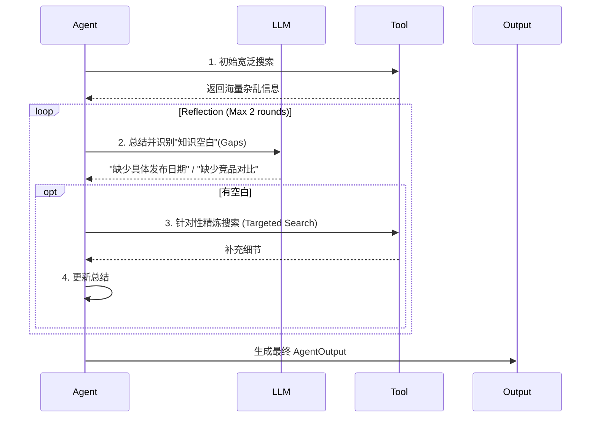

# FinSight 终极架构设计：智能金融合伙人

> 📅 **更新日期**: 2026-01-12
> 🎯 **核心愿景**: 从被动问答的"工具人"升级为主动服务的"智能合伙人"

---

## 一、架构全景图 (The Big Picture)

FinSight 采用 **论坛式多 Agent 协作** 架构，模仿真实的金融投研团队运作模式。

```mermaid
flowchart TB
    subgraph Frontend["前端 (React + TS)"]
        UI[ChatList + StockChart]
        Profile[UserProfile 🆕]
        Diag[DiagnosticsPanel]
    end

    subgraph Backend["后端 (FastAPI + LangGraph)"]
        API["/chat API"]

        subgraph MemoryLayer["记忆与画像层 (Phase 1.5)"]
            UserMem[UserContext & Memory]
            Watch[Watchlist Monitor]
        end

        subgraph Agents["多Agent专家团 (Phase 1)"]
            PA[PriceAgent<br/>(行情专家)]
            NA[NewsAgent<br/>(舆情专家+反思)]
            TA[TechnicalAgent<br/>(技术分析师)]
            FA[FundamentalAgent<br/>(基本面研究员)]
            RA[RiskAgent 🆕<br/>(风控官 Phase 3)]
        end

        subgraph OnDemand["按需调用层 (Phase 2)"]
            MA[MacroAgent<br/>(宏观分析)]
            DS[DeepSearchAgent<br/>(深度研报)]
        end

        subgraph Orchestration["编排与决策"]
            SUP[Supervisor<br/>(任务分发)]
            FH[ForumHost<br/>(首席投资官/冲突消解)]
        end

        subgraph Infrastructure["基础设施 (Phase 0)"]
            ORC[ToolOrchestrator]
            Cache[KV Cache]
            CB[CircuitBreaker]
            Alert[AlertSystem 🆕]
        end

        subgraph Knowledge["知识检索层 (Phase 2) 🆕"]
            VS[VectorStore<br/>(ChromaDB)]
            RAG[RAGEngine<br/>(切片+检索)]
        end
    end

    %% Data Flow
    UI --> API
    API --> SUP
    SUP --> UserMem
    UserMem --> FH

    SUP --> PA & NA & TA & FA & RA
    PA & NA & TA & FA & RA --> ORC
    ORC --> Cache & CB

    %% RAG Flow
    DS --> RAG
    RAG --> VS

    %% Forum Mechanism
    PA & NA & TA & FA & RA --"AgentOutput"--> FH
    FH --"ForumOutput"--> API

    %% Background Jobs
    Alert -.-> Watch
    Watch -.-> UI
```

---

## 二、核心角色定义

### 2.1 专家 Agent 团队 (The Specialists)

| Agent | 角色 | 职责 | 特性 |
|-------|------|------|------|
| **PriceAgent** | 交易员 | 实时盯盘、报价、盘口数据 | 极速响应 (TTL=30s)，多源熔断 |
| **NewsAgent** | 舆情分析师 | 全网新闻、社交媒体情绪 | **反思循环** (Reflection Loop) + 官方RSS优先（Reuters/Bloomberg）+ Finnhub 48h + 搜索回退 |
| **TechnicalAgent** | 技术分析师 | K线形态、指标背离 (MACD/RSI) | 结合图表数据，给出买卖点位 |
| **FundamentalAgent** | 研究员 | 财报解读、估值模型 (DCF/PE) | 处理长文本，数据来源于 10-K/10-Q |
| **RiskAgent** 🆕 | 风控官 | 仓位管理、VaR计算、止损建议 | **个性化**，基于用户风险偏好 (Phase 3) |
| **MacroAgent** | 宏观分析师 | 宏观经济数据、FRED API | 实时 CPI/GDP/利率/失业率 (Phase 2 升级) |

### 2.2 首席投资官 (ForumHost)

**ForumHost** 是整个系统的"大脑"，它不再是简单的拼接器，而是具备**冲突消解**能力的决策者。

*   **输入**：各 Agent 的 `AgentOutput`（含置信度、证据）。
*   **处理**：
    1.  **冲突检测**：News 说利好，Tech 说超买？-> 识别分歧点。
    2.  **观点融合**：基于权重（如基本面 > 技术面）生成最终判断。
    3.  **个性化注入**：读取 `UserContext`，调整建议语气（激进 vs 保守）。
*   **输出**：结构化的 `ReportIR`（中间表示）。

---

## 三、关键机制详解

### 3.1 反思循环 (Reflection Loop)

NewsAgent 和 DeepSearchAgent 拥有自我修正能力：



### 3.2 智能合伙人记忆 (UserContext)

系统不再是"阅后即焚"的聊天机器人，而是有记忆的伙伴。

*   **静态画像**：风险等级 (Conservative/Aggressive)、资金体量、投资目标。
*   **动态关注**：Watchlist（自选股）、持仓成本。
*   **交互历史**：记住用户偏好的行业（"他喜欢科技股"）。

### 3.3 知识检索增强 (RAG - Phase 2) 🆕

系统引入向量检索增强生成（RAG）能力，支持长文档分析和知识库构建：

```
┌─────────────────────────────────────────────────────────┐
│                    RAGEngine                            │
│  ┌─────────────┐    ┌─────────────┐    ┌─────────────┐ │
│  │ chunk_text  │ -> │   ingest    │ -> │   query     │ │
│  │ (切片+边界) │    │ (向量化入库)│    │ (相似度检索)│ │
│  └─────────────┘    └─────────────┘    └─────────────┘ │
│                            │                            │
│                            v                            │
│                    ┌─────────────┐                      │
│                    │ VectorStore │                      │
│                    │ (ChromaDB)  │                      │
│                    └─────────────┘                      │
└─────────────────────────────────────────────────────────┘
```

**核心组件**：
- **VectorStore**: ChromaDB 封装，支持持久化和临时集合
- **RAGEngine**: 文档切片（句子边界检测）+ 向量化入库 + 相似度检索
- **Embedding**: `paraphrase-multilingual-MiniLM-L12-v2` 多语言模型

**应用场景**：
- DeepSearchAgent 长文研报分析
- 用户记忆持久化存储
- 历史对话上下文检索

### 3.4 主动服务 (Active Service)

从 Request-Response 转变为 Event-Driven：

*   **场景**：用户没打开 App，但持仓股财报突发暴雷。
*   **流程**：`AlertSystem` 轮询 -> 触发 `RiskAgent` 评估 -> 调用 `Notification` 接口 -> 推送"紧急风险提示"。

---

## 四、数据流与中间表示 (IR)

为了解耦生成与渲染，我们定义了 **ReportIR (Intermediate Representation)**。

```json
{
  "ticker": "AAPL",
  "user_context": {"risk_profile": "balanced"},
  "overall_sentiment": "bullish",
  "confidence_score": 0.85,
  "sections": [
    {
      "type": "consensus",
      "content": "各方一致看好 AI 手机换机潮...",
      "sources": ["NewsAgent", "FundamentalAgent"]
    },
    {
      "type": "conflict",
      "content": "技术面显示短期超买，但基本面估值仍合理",
      "agents": ["TechnicalAgent", "FundamentalAgent"]
    }
  ],
  "actionable_advice": "建议分批建仓，回调至 200 日均线时加仓",
  "risks": ["反垄断诉讼", "消费电子周期下行"]
}
```

---

## 五、技术栈升级

| 层级 | 原有方案 | **升级方案** |
|------|----------|--------------|
| **编排** | LangChain Agent | **LangGraph** (支持循环与多分支) |
| **搜索** | DuckDuckGo | **Tavily / Exa** (专业研报搜索) |
| **缓存** | 内存 Dict | **Redis / SQLite** (持久化 KV) |
| **监控** | Print日志 | **LangSmith** (全链路 Tracing) |
| **风控** | 无 | **VaR / MaxDrawdown 计算引擎** |
| **向量存储** 🆕 | 无 | **ChromaDB** (持久化向量数据库) |
| **Embedding** 🆕 | 无 | **Sentence Transformers** (多语言本地模型) |
| **宏观数据** 🆕 | 无 | **FRED API** (美联储经济数据) |

---

> 🚀 **Next Step**: 进入 Phase 2 研报增强（ReportIR Schema/DeepSearch/Macro）与前端报告卡片对齐。
