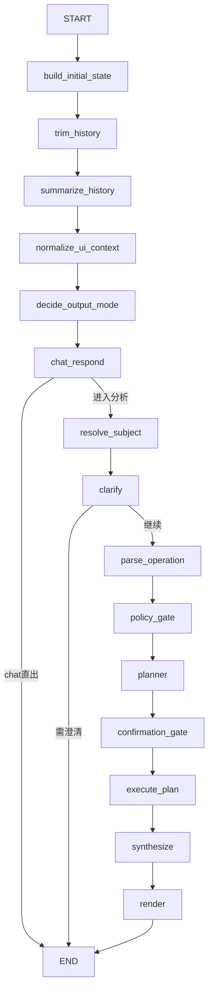
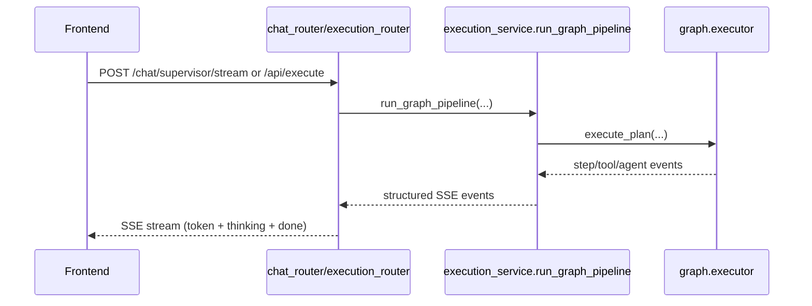

# FinSight 当前架构（代码对齐版）

> 更新时间：2026-02-18  
> 适用分支：`feat/phase-e-rag-upgrade`  
> 主链实现：`backend/graph/runner.py`

## 1. 系统总览

```mermaid
flowchart LR
  subgraph FE[Frontend]
    CHAT_UI[Chat]
    DASH_UI[Dashboard]
    WB_UI[Workbench]
  end

  subgraph API[FastAPI]
    CHAT_EP[/chat/supervisor*]
    EXEC_EP[/api/execute*]
    DASH_EP[/api/dashboard*]
    REPORT_EP[/api/reports/*]
    AGENT_PREF_EP[/api/agents/preferences]
  end

  subgraph GRAPH[LangGraph Pipeline]
    RUNNER[GraphRunner]
    NODES[StateGraph Nodes]
    EXECUTOR[executor.py]
    SYNTH[synthesize + render]
  end

  subgraph ANALYSIS[Execution Layer]
    TA[tool_adapter]
    AA[agent_adapter]
    TOOLS[langchain_tools]
    AGENTS[price/news/fundamental/technical/macro/risk/deep_search]
  end

  FE --> API
  CHAT_EP --> RUNNER
  EXEC_EP --> RUNNER
  RUNNER --> NODES --> EXECUTOR --> ANALYSIS --> SYNTH
  DASH_EP --> FE
  REPORT_EP --> FE
  AGENT_PREF_EP --> FE
```

## 2. LangGraph 主流程

```mermaid
flowchart TD
  START --> build_initial_state
  build_initial_state --> trim_history
  trim_history --> summarize_history
  summarize_history --> normalize_ui_context
  normalize_ui_context --> decide_output_mode
  decide_output_mode --> chat_respond
  chat_respond -->|chat直出| END
  chat_respond -->|进入分析| resolve_subject
  resolve_subject --> clarify
  clarify -->|需澄清| END
  clarify -->|继续| parse_operation
  parse_operation --> policy_gate
  policy_gate --> planner
  planner --> confirmation_gate
  confirmation_gate --> execute_plan
  execute_plan --> synthesize
  synthesize --> render
  render --> END
```

## 3. 规划与执行策略

### 3.1 Policy Gate（入口约束）

文件：`backend/graph/nodes/policy_gate.py`

- 根据 `subject_type + operation + output_mode` 生成 tool allowlist
- 支持用户覆盖：
  - `agents_override`
  - `budget_override`
  - `analysis_depth`（`quick/report/deep_research`）
  - `agent_preferences`
- 在 `investment_report` 模式下，通过 `capability_registry` 做 agent 评分选择

### 3.2 Planner / Planner Stub

文件：`backend/graph/nodes/planner.py`, `backend/graph/nodes/planner_stub.py`

- `planner.py` 支持：
  - `LANGGRAPH_PLANNER_MODE=stub|llm`
  - A/B 变体与指标（`get_planner_ab_metrics`）
  - LLM 解析失败回退 `planner_stub`
- `planner_stub.py` 已支持新工具关键词路由：
  - `get_earnings_estimates`, `get_eps_revisions`
  - `get_option_chain_metrics`
  - `get_factor_exposure`, `run_portfolio_stress_test`
  - `get_event_calendar`
  - `score_news_source_reliability`

### 3.3 Executor

文件：`backend/graph/executor.py`

- 支持 `parallel_group` 并行执行
- step 级缓存：`step_cache_key`
- 支持 optional step 容错与 required step 中断
- 统一事件输出：`step_start/step_done/step_error/tool_start/tool_end/agent_start/agent_done`

## 4. SSE 事件与前端消费链路

```mermaid
sequenceDiagram
  participant UI as Frontend
  participant ROUTER as chat_router/execution_router
  participant PIPE as execution_service.run_graph_pipeline
  participant EX as graph.executor

  UI->>ROUTER: POST /chat/supervisor/stream or /api/execute
  ROUTER->>PIPE: run_graph_pipeline(...)
  PIPE->>EX: execute_plan(...)
  EX-->>PIPE: step/tool/agent events
  PIPE-->>ROUTER: structured SSE events
  ROUTER-->>UI: SSE stream (token + thinking + done)
```

前端事件解析位置：`frontend/src/api/client.ts`

## 5. Dashboard / Workbench 数据链路

```mermaid
flowchart LR
  DSH[Dashboard Page] --> DS[useDashboardData]
  DS --> DAPI[/api/dashboard]
  DSH --> INS[useDashboardInsights]
  INS --> IAPI[/api/dashboard/insights]
  DAPI --> DATA_SERVICE[dashboard.data_service]
  IAPI --> INS_ENGINE[dashboard.insights_engine]
  INS_ENGINE --> DIGEST[Overview/Financial/Technical/News/Peers Digests]

  WB[Workbench Page] --> TASK[TaskSection]
  WB --> REPORT[ReportSection]
  TASK --> EXEC[/api/execute]
  REPORT --> RINDEX[/api/reports/index]
```

## 6. Agent/Tool 边界

- Tool 只通过 `backend/graph/adapters/tool_adapter.py` 注入执行层
- Agent 只通过 `backend/graph/adapters/agent_adapter.py` 注入执行层
- Graph 节点不直接依赖具体 agent/tool 实现（降低耦合）

详细矩阵见：`docs/AGENTS_GUIDE.md`

## 7. 已知约束（当前版本）

- `GraphState` 尚未显式定义 `agent_preferences` 字段（偏好仍走 `ui_context`）
- `confirmation_gate` 目前是 run 级中断，非逐 step 人工确认
- `synthesize` 仍保留 `stub/llm` 双模式，需要按环境切换
