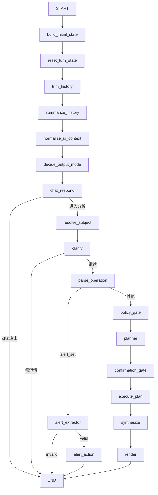
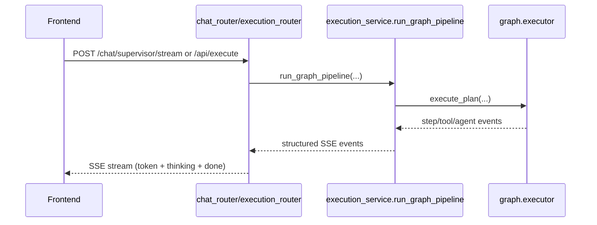
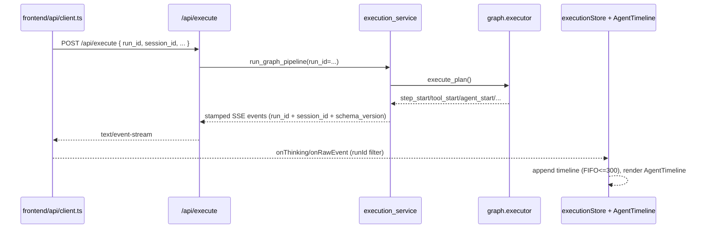
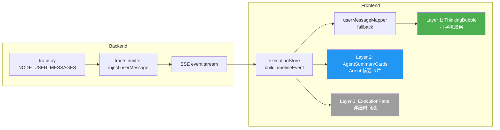
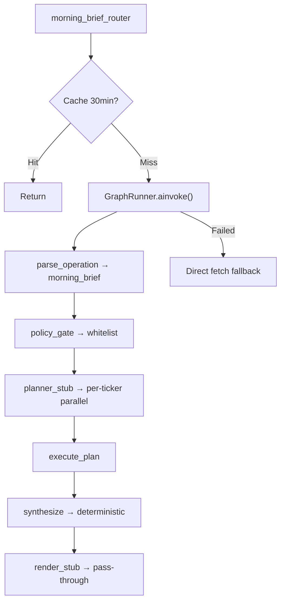
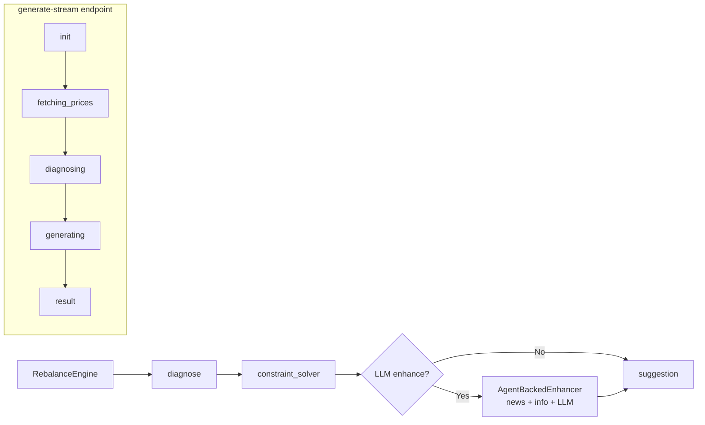

# FinSight 当前架构（代码对齐版）

> 更新时间：2026-02-26
> 适用分支：`feat/p0-p2-quality-orchestration-productization`
> 主链实现：`backend/graph/runner.py`

## 1. 系统总览

```mermaid
flowchart LR
  subgraph FE[Frontend]
    CHAT_UI[Chat]
    DASH_UI[Dashboard]
    WB_UI[Workbench]
  end

  subgraph API[FastAPI]
    CHAT_EP[/chat/supervisor*]
    EXEC_EP[/api/execute*]
    DASH_EP[/api/dashboard*]
    REPORT_EP[/api/reports/*]
    AGENT_PREF_EP[/api/agents/preferences]
  end

  subgraph GRAPH[LangGraph Pipeline]
    RUNNER[GraphRunner]
    NODES[StateGraph Nodes]
    EXECUTOR[executor.py]
    SYNTH[synthesize + render]
  end

  subgraph ANALYSIS[Execution Layer]
    TA[tool_adapter]
    AA[agent_adapter]
    TOOLS[langchain_tools]
    AGENTS[price/news/fundamental/technical/macro/risk/deep_search]
  end

  FE --> API
  CHAT_EP --> RUNNER
  EXEC_EP --> RUNNER
  RUNNER --> NODES --> EXECUTOR --> ANALYSIS --> SYNTH
  DASH_EP --> FE
  REPORT_EP --> FE
  AGENT_PREF_EP --> FE
```

## 2. LangGraph 主流程

```mermaid
flowchart TD
  START --> build_initial_state
  build_initial_state --> reset_turn_state
  reset_turn_state --> trim_history
  trim_history --> summarize_history
  summarize_history --> normalize_ui_context
  normalize_ui_context --> decide_output_mode
  decide_output_mode --> chat_respond
  chat_respond -->|chat直出| END
  chat_respond -->|进入分析| resolve_subject
  resolve_subject --> clarify
  clarify -->|需澄清| END
  clarify -->|继续| parse_operation
  parse_operation -->|alert_set| alert_extractor
  parse_operation -->|其他| policy_gate
  alert_extractor -->|valid| alert_action
  alert_extractor -->|invalid| END
  alert_action --> END
  policy_gate --> planner
  planner --> confirmation_gate
  confirmation_gate --> execute_plan
  execute_plan --> synthesize
  synthesize --> render
  render --> END
```

### 2.1 意图分类（parse_operation）

`parse_operation` 节点实现规则优先的意图分类，包含 14 种操作类型：

| 优先级 | 操作 | 置信度 | 说明 |
|:---:|------|:---:|------|
| 1 | `compare` | 0.85 | vs/对比/比较 |
| 2 | `analyze_impact` | 0.75 | 影响/冲击/利好利空 |
| 3 | `backtest` | 0.86 | 回测/策略回测 (Phase 4) |
| 4 | `alert_set` | 0.88 | 提醒/预警 (Phase 1) |
| 5 | `screen` | 0.86 | 筛选/选股 (Phase 2) |
| 6 | `cn_market` | 0.84 | 资金流向/北向/龙虎榜 (Phase 3) |
| 7 | `technical` | 0.85 | 技术面/macd/rsi |
| 8 | `price` | 0.80 | 股价/现价/报价 |
| 9 | `summarize` | 0.75 | 总结/摘要 |
| 10 | `extract_metrics` | 0.70 | 提取指标/eps |
| 11 | `fetch` | 0.65 | 获取/新闻 |
| 12 | `morning_brief` | 0.85 | 晨报/早报 |
| 13 | 多标的默认 | 0.70 | `len(tickers)>=2` 自动 compare |
| 14 | `qa` | 0.40-0.55 | 兜底问答 |

**Guardrail-A**：单任务关键词（如 price）阻止多标的强制 compare。

## 3. 规划与执行策略

### 3.1 Policy Gate（入口约束）

文件：`backend/graph/nodes/policy_gate.py`

- 根据 `subject_type + operation + output_mode` 生成 tool allowlist
- 支持用户覆盖：
  - `agents_override`
  - `budget_override`
  - `analysis_depth`（`quick/report/deep_research`）
  - `agent_preferences`
- 在 `investment_report` 模式下，通过 `capability_registry` 做 agent 评分选择

### 3.2 Planner / Planner Stub

文件：`backend/graph/nodes/planner.py`, `backend/graph/nodes/planner_stub.py`

- `planner.py` 支持：
  - `LANGGRAPH_PLANNER_MODE=stub|llm`
  - A/B 变体与指标（`get_planner_ab_metrics`）
  - LLM 解析失败回退 `planner_stub`
- `planner_stub.py` 已支持新工具关键词路由：
  - `get_earnings_estimates`, `get_eps_revisions`
  - `get_option_chain_metrics`
  - `get_factor_exposure`, `run_portfolio_stress_test`
  - `get_event_calendar`
  - `score_news_source_reliability`

### 3.3 Executor

文件：`backend/graph/executor.py`

- 支持 `parallel_group` 并行执行
- step 级缓存：`step_cache_key`
- 支持 optional step 容错与 required step 中断
- 统一事件输出：`step_start/step_done/step_error/tool_start/tool_end/agent_start/agent_done`

## 4. SSE 事件与前端消费链路

```mermaid
sequenceDiagram
  participant UI as Frontend
  participant ROUTER as chat_router/execution_router
  participant PIPE as execution_service.run_graph_pipeline
  participant EX as graph.executor

  UI->>ROUTER: POST /chat/supervisor/stream or /api/execute
  ROUTER->>PIPE: run_graph_pipeline(...)
  PIPE->>EX: execute_plan(...)
  EX-->>PIPE: step/tool/agent events
  PIPE-->>ROUTER: structured SSE events
  ROUTER-->>UI: SSE stream (token + thinking + done)
```

前端事件解析位置：`frontend/src/api/client.ts`

## 5. Dashboard / Workbench 数据链路

```mermaid
flowchart LR
  DSH[Dashboard Page] --> DS[useDashboardData]
  DS --> DAPI[/api/dashboard]
  DSH --> INS[useDashboardInsights]
  INS --> IAPI[/api/dashboard/insights]
  DAPI --> DATA_SERVICE[dashboard.data_service]
  IAPI --> INS_ENGINE[dashboard.insights_engine]
  INS_ENGINE --> DIGEST[Overview/Financial/Technical/News/Peers Digests]

  WB[Workbench Page] --> TASK[TaskSection]
  WB --> REPORT[ReportSection]
  TASK --> EXEC[/api/execute]
  REPORT --> RINDEX[/api/reports/index]
```

## 6. Agent/Tool 边界

- Tool 只通过 `backend/graph/adapters/tool_adapter.py` 注入执行层
- Agent 只通过 `backend/graph/adapters/agent_adapter.py` 注入执行层
- Graph 节点不直接依赖具体 agent/tool 实现（降低耦合）

详细矩阵见：`docs/AGENTS_GUIDE.md`

## 7. 已知约束（当前版本）

- `GraphState` 尚未显式定义 `agent_preferences` 字段（偏好仍走 `ui_context`）
- `confirmation_gate` 目前是 run 级中断，非逐 step 人工确认
- `synthesize` 仍保留 `stub/llm` 双模式，需要按环境切换

---

## 8. Phase I 增量链路（I1-I4）

### 8.1 Execution SSE Event Flow（with `run_id`）

```mermaid
sequenceDiagram
  participant FE as frontend/api/client.ts
  participant API as /api/execute
  participant SVC as execution_service
  participant EX as graph.executor
  participant UI as executionStore + AgentTimeline

  FE->>API: POST /api/execute { run_id, session_id, ... }
  API->>SVC: run_graph_pipeline(run_id=...)
  SVC->>EX: execute_plan()
  EX-->>SVC: step_start/tool_start/agent_start/...
  SVC-->>API: stamped SSE events (run_id + session_id + schema_version)
  API-->>FE: text/event-stream
  FE-->>UI: onThinking/onRawEvent (runId filter)
  UI-->>UI: append timeline (FIFO<=300), render AgentTimeline
```

### 8.2 Alert Scheduler -> Alert Feed -> Right Panel

```mermaid
flowchart LR
  subgraph Scheduler
    PRICE[PriceChangeScheduler]
    NEWS[NewsAlertScheduler]
    RISK[RiskAlertScheduler]
  end

  PRICE -->|record_alert_event| SUBS[(subscriptions.json)]
  NEWS -->|record_alert_event| SUBS
  RISK -->|record_alert_event| SUBS

  SUBS --> FEED[/GET /api/alerts/feed]
  FEED --> RP_HOOK[useRightPanelData]
  RP_HOOK --> RP_TAB[RightPanelAlertsTab]
  RP_TAB --> USER[事件列表 + 订阅配置 + 未读数]
```

### 8.3 Workbench 收口策略（2026-02-18）

- `RightPanel` 自动切换规则：仅在 `activeRuns` 发生 `0->N` 时触发。
- 若用户已手动锁定非 `execution` 标签页（`userPinnedTab`），不强制切换，改为 execution 标签脉冲提示。
- `useRightPanelData` 对 Alerts 状态做类型化输出：
  - 事件状态：`no_email | loading | error | no_events | ready`
  - 订阅状态：`no_email | loading | error | no_subscriptions | ready`
- 当前 Alerts 数据刷新模式仍为轮询（`60s`），后续可按需要演进到推送模型。

---

## 9. P0-P2 增量链路（2026-02-26）

### 9.1 ThinkingBubble 三层展示

将程序员视角的 trace 事件转换为用户友好的三层展示：

```mermaid
flowchart LR
    subgraph Backend
        T[trace.py<br/>NODE_USER_MESSAGES] --> E[trace_emitter<br/>inject userMessage]
        E --> S[SSE event stream]
    end

    subgraph Frontend
        S --> STORE[executionStore<br/>buildTimelineEvent]
        STORE --> M[userMessageMapper<br/>fallback]
        M --> L1["Layer 1: ThinkingBubble<br/>打字机效果"]
        STORE --> L2["Layer 2: AgentSummaryCards<br/>Agent 摘要卡片"]
        STORE --> L3["Layer 3: ExecutionPanel<br/>详细时间线"]
    end

    style L1 fill:#4caf50,color:#fff
    style L2 fill:#2196f3,color:#fff
    style L3 fill:#9e9e9e,color:#fff
```

- `ThinkingBubble.tsx`：以打字机动画展示当前阶段的用户友好消息
- `AgentSummaryCards.tsx`：Agent 完成研究后展示摘要卡片
- `ExecutionPanel.tsx`：详细时间线，支持展开查看完整 trace

### 9.2 晨报 Graph Pipeline 接入

晨报操作通过 LangGraph Pipeline 执行，使用确定性合成（零 LLM 成本）：

```mermaid
flowchart TD
    ROUTER["morning_brief_router"] --> CACHE{"Cache 30min?"}
    CACHE -->|Hit| RET[Return]
    CACHE -->|Miss| GP["GraphRunner.ainvoke()"]
    GP --> PARSE["parse_operation → morning_brief"]
    PARSE --> POLICY["policy_gate → whitelist"]
    POLICY --> PLAN["planner_stub → per-ticker parallel"]
    PLAN --> EXEC["execute_plan"]
    EXEC --> SYNTH["synthesize → deterministic"]
    SYNTH --> RENDER["render_stub → pass-through"]
    GP -->|Failed| FALLBACK["Direct fetch fallback"]
```

- 关键词匹配：13 个中英文关键词，confidence=0.85
- 工具白名单：`get_stock_price`, `get_company_news`, `get_current_datetime`
- 合成模式：纯确定性（`_synthesize_morning_brief_data`），不调用 LLM

### 9.3 调仓 LLM 增强（HC-2 独立路径）

调仓引擎保持独立于 Graph Pipeline（HC-2 约束），新增 Agent-backed LLM 增强：

```mermaid
flowchart LR
    ENGINE[RebalanceEngine] --> DIAG[diagnose]
    DIAG --> SOLVE[constraint_solver]
    SOLVE --> ENH{"LLM enhance?"}
    ENH -->|Yes| AGENT[AgentBackedEnhancer<br/>news + info + LLM]
    ENH -->|No| OUT[suggestion]
    AGENT --> OUT

    subgraph SSE["generate-stream endpoint"]
        P1[init] --> P2[fetching_prices]
        P2 --> P3[diagnosing]
        P3 --> P4[generating]
        P4 --> P5[result]
    end
```

- `AgentBackedEnhancer`：并行获取新闻+公司信息，LLM 精调优先级和理由
- SSE 流式端点：`POST /api/rebalance/suggestions/generate-stream`（6 阶段进度事件）
- 安全回退：LLM 失败时返回原始 candidates，不丢失数据
