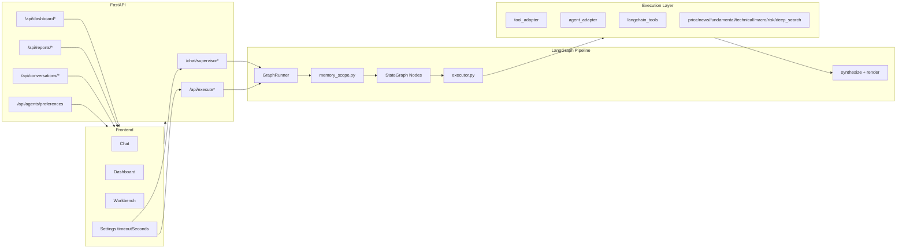
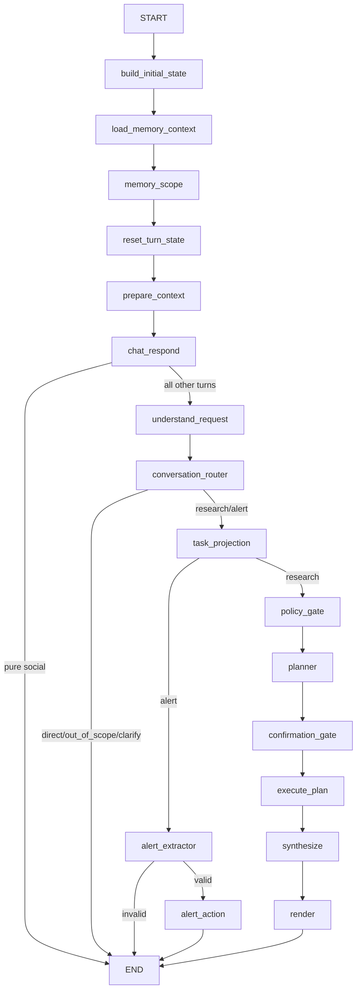
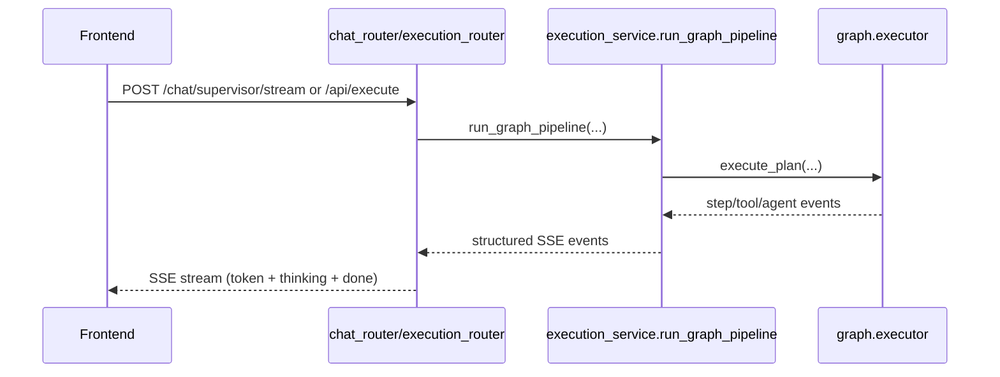
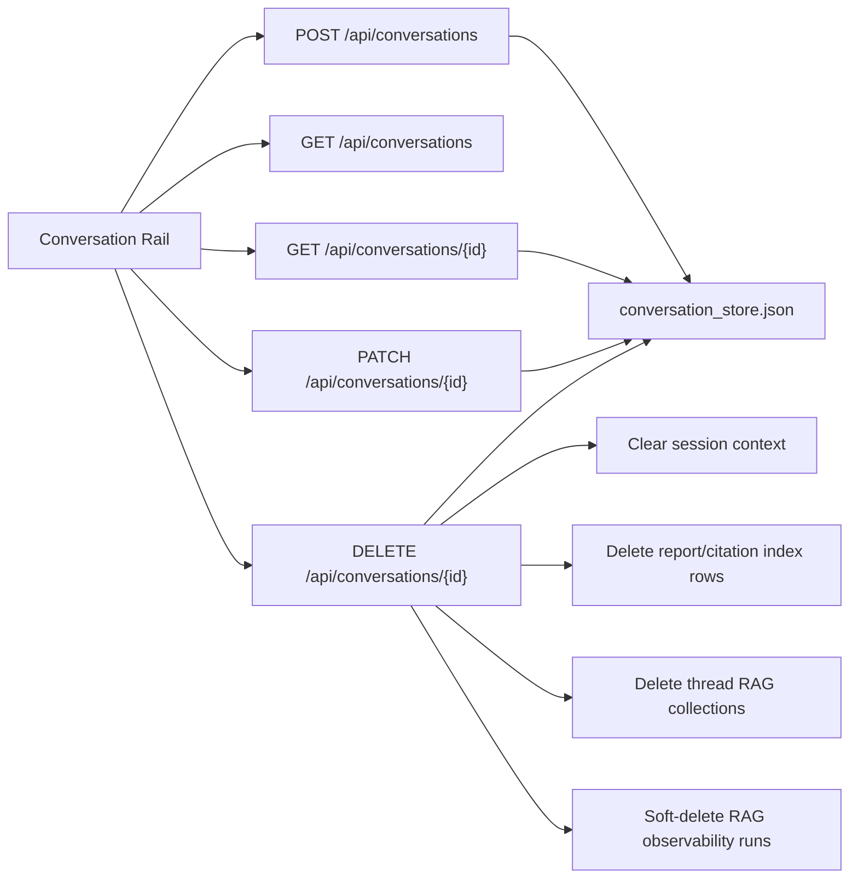
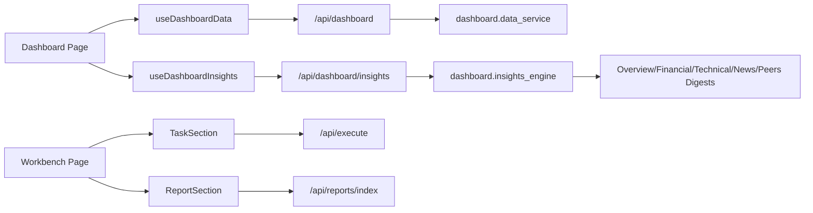
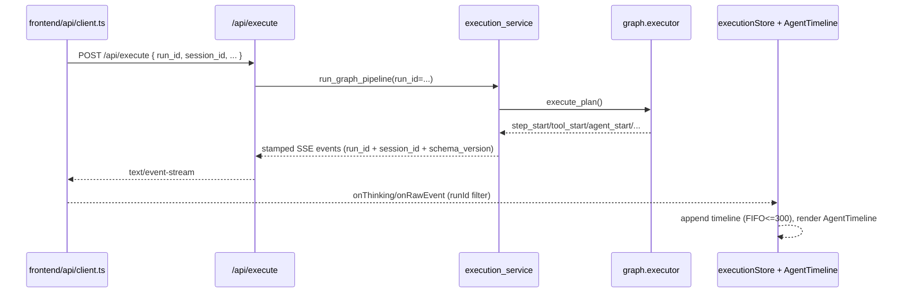
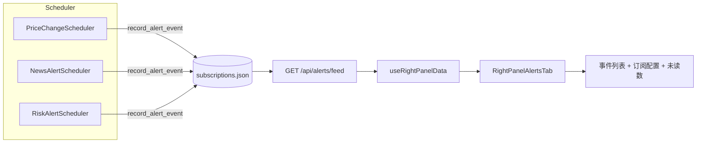
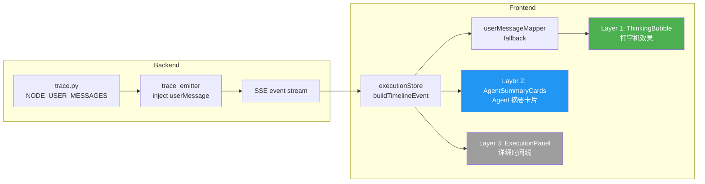
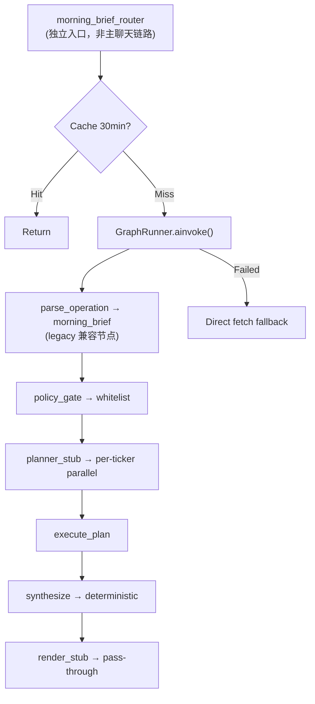
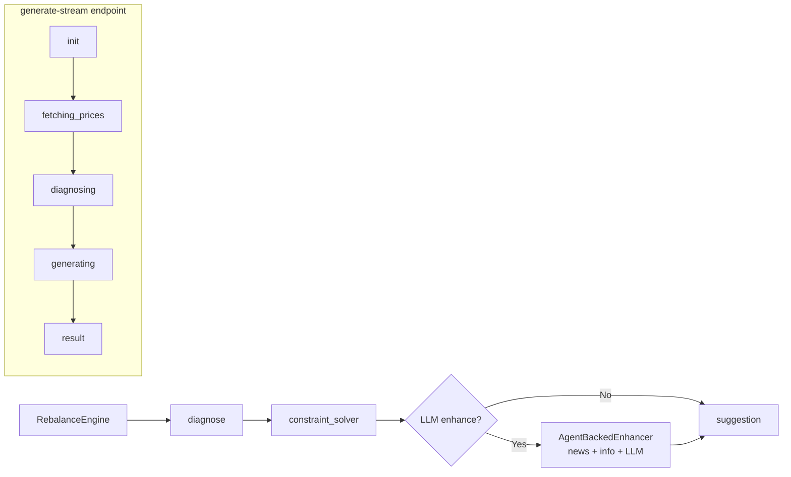

# FinSight 当前架构（代码对齐版）

> 更新时间：2026-05-11
> 适用分支：`main`
> 主链实现：`backend/graph/runner.py`

> 2026-05-06 运行时事实：聊天主链路为 `prepare_context -> chat_respond -> understand_request`。`chat_respond` 只处理纯问候/感谢/确认/再见；普通聊天、追问、非金融边界、URL/文章分析、提醒、行情和报告请求都进入 `understand_request` 内部的 LLM conversation router。显式 `output_mode=investment_report`（报告按钮）或强报告 query（如深度投资报告 / deep report / filing document longform）进入报告模板；普通 chat/brief 不套报告结构。URL 读取通过 planner/agent 工具 `fetch_url_content`，不在请求理解层预抓取。若本文与代码冲突，以 `backend/graph/runner.py`、`backend/graph/nodes/understand_request.py` 和测试为准。
> 同日增量：后端已提供 `/api/conversations` 会话生命周期 API 与轻量 conversation snapshot store；删除会话会清理 session context、report index、thread RAG collections 和 RAG observability runs。停止生成会发出 `cancelled` trace/pipeline 事件，executor/agent 会读取 cancellation token，并保留已完成内容。
> 2026-05-10 增量：`understand_request` 现在写入 `ReplyContract`，将默认聊天、取证回答、报告生成拆成 `chat_answer / source_grounded_answer / report_generation` 三条 lane；`brief` 仅作为长度偏好保留。工具失败、403、rejected、empty、timeout 等只能进入 `artifacts.tool_diagnostics`，不能进入 `evidence_pool` 或被渲染为来源/结论。
> 2026-05-11 验收：最终聊天 UX current-state 运行见 `docs/qa/chat-router-100-final100-current-state.md` / `.json`，`tests/eval/chat_router_100.json` 共 100 条、95 个 hard 红线用例，结果 `100/100 PASS`。这批用例覆盖连续上下文、会话隔离、报告追问、URL/新闻/报价取证、不要新闻纠偏和工具错误证据隔离。
> 2026-05-11 增量：`memory_context` 改为作用域化结构，区分 `user_profile_memory`、`historical_focus_memory`、`current_thread_focus`、`current_report`；只有当前线程焦点/报告可绑定“刚才那份报告/第三点”等指代。前端偏好新增 `agent_preferences.timeoutSeconds`，`0` 使用系统默认，正数限制在 `30-1200s` 并应用到 chat/planner/synthesize/graph 执行预算。

## 1. 系统总览

```mermaid
flowchart LR
  subgraph FE[Frontend]
    CHAT_UI[Chat]
    DASH_UI[Dashboard]
    WB_UI[Workbench]
    PREF_UI[Settings timeoutSeconds]
  end

  subgraph API[FastAPI]
    CHAT_EP["/chat/supervisor*"]
    EXEC_EP["/api/execute*"]
    DASH_EP["/api/dashboard*"]
    REPORT_EP["/api/reports/*"]
    CONV_EP["/api/conversations/*"]
    AGENT_PREF_EP["/api/agents/preferences"]
  end

  subgraph GRAPH[LangGraph Pipeline]
    RUNNER[GraphRunner]
    MEM_SCOPE[memory_scope.py]
    NODES[StateGraph Nodes]
    EXECUTOR[executor.py]
    SYNTH[synthesize + render]
  end

  subgraph ANALYSIS[Execution Layer]
    TA[tool_adapter]
    AA[agent_adapter]
    TOOLS[langchain_tools]
    AGENTS[price/news/fundamental/technical/macro/risk/deep_search]
  end

  FE --> API
  PREF_UI --> CHAT_EP
  PREF_UI --> EXEC_EP
  CHAT_EP --> RUNNER
  EXEC_EP --> RUNNER
  RUNNER --> MEM_SCOPE --> NODES --> EXECUTOR --> ANALYSIS --> SYNTH
  DASH_EP --> FE
  REPORT_EP --> FE
  CONV_EP --> FE
  AGENT_PREF_EP --> FE
```

## 2. LangGraph 主流程

```mermaid
flowchart TD
  START --> build_initial_state
  build_initial_state --> load_memory_context
  load_memory_context --> memory_scope
  memory_scope --> reset_turn_state
  reset_turn_state --> prepare_context
  prepare_context --> chat_respond
  chat_respond -->|pure social| END
  chat_respond -->|all other turns| understand_request
  understand_request --> conversation_router
  conversation_router -->|direct/out_of_scope/clarify| END
  conversation_router -->|research/alert| task_projection
  task_projection -->|alert| alert_extractor
  task_projection -->|research| policy_gate
  alert_extractor -->|valid| alert_action
  alert_extractor -->|invalid| END
  alert_action --> END
  policy_gate --> planner
  planner --> confirmation_gate
  confirmation_gate --> execute_plan
  execute_plan --> synthesize
  synthesize --> render
  render --> END
```

### 2.1 请求理解（understand_request）

`understand_request` 是聊天前半段的语义事实源，一次性处理：

- 纯寒暄由 `chat_respond` 快速结束；其他直接回复、非金融边界和澄清由 LLM conversation router 自然生成，不走本地模板。
- 公司、ticker、中文别名、index、commodity、macro、theme、selection、portfolio。
- URL/网页/文章任务作为可规划的 `fetch_url_content` 工具步骤进入执行层。
- 复合请求拆成 `tasks[]`，例如 `company/GOOGL/price` + `company/MSFT/fetch` + `macro/fact_check`。
- 局部缺信息写入 `blocked_tasks[]`，例如缺持仓只阻塞 portfolio task，不阻塞公司/宏观任务。
- 当前 query 明说的 ticker 优先于 UI `active_symbol`；UI 选择、MiniChat 当前标的和持仓只作为上下文候选。
- 兼容投影：`subject` / `operation` 从 primary task 写入，保证旧 policy/planner/executor 可继续运行。
- 结构化回复契约：写入 `reply_contract`，包含 lane、回答风格、长度偏好、上下文绑定、source constraints、citation policy 和续问目标。
- 用户可见 trace：发出 `type="trace"`、`visibility="user"`、`stage="understanding"`。

旧 `trim_history / summarize_history / normalize_ui_context / decide_output_mode / resolve_subject / clarify / parse_operation` 仍保留为兼容 helper 或聚焦测试对象；当前主链路由 `prepare_context` 承接上下文准备，再进入 `understand_request`，它们不再作为独立主路径节点串联。

当前 `ReplyContract` lane：

| Lane | 触发 | 下游约束 |
|---|---|---|
| `chat_answer` | 普通解释、追问、纠偏、安全边界、明确“不要新闻/不要链接/直接说” | 不强制查新闻，不套报告结构，`citation_policy=none` |
| `source_grounded_answer` | 明确要新闻/链接/引用/实时价格/URL/数据证据 | 规划取证工具；有可用来源则引用，没有则披露不可用 |
| `report_generation` | 报告按钮、`output_mode=investment_report`、明确生成报告/研报、`deep report` / `filing document longform` 等强报告 query | 使用报告模板和报告级引用约束 |

### 2.2 记忆作用域与连续对话边界

`build_initial_state` 读取长期 JSON 记忆后，会通过 `backend/graph/memory_scope.py` 和 `backend/graph/store.py` 投影成四个明确字段：

| 字段 | 作用 | 能否绑定当前追问 |
|---|---|---|
| `user_profile_memory` | 用户级偏好、风险偏好、自选列表等稳定信息 | 否，只能个性化 |
| `historical_focus_memory` | 用户历史 `last_focus / last_report / recent_focuses` 兼容载荷 | 否，不能当成当前线程上下文 |
| `current_thread_focus` | 当前 `thread_id` 下的最近主体、报告和焦点 | 是 |
| `current_report` | 当前线程最后一份报告 artifact | 是 |

因此 conversation router、planner prompt、synthesize prompt 只通过 helper 读取安全投影：普通“它/刚才/第三点”这类指代必须来自当前线程；用户其他会话的 `last_report` 不会混入当前线程。

```mermaid
flowchart LR
  STORE[(data/memory/{user}.json)] --> LOAD[load_memory_context]
  LOAD --> PROFILE[user_profile_memory]
  LOAD --> HISTORY[historical_focus_memory]
  LOAD --> THREAD[current_thread_focus by thread_id]
  THREAD --> REPORT[current_report]
  PROFILE --> PROMPT[prompt_memory_context]
  THREAD --> PROMPT
  REPORT --> PROMPT
  HISTORY -. not current referent .-> AUDIT[history only]
  PROMPT --> ROUTER[conversation_router / planner / synthesize]
```

### 2.3 用户可调超时

前端 Settings 写入 `agent_preferences.timeoutSeconds` 并随 `ChatOptions` / execute payload 进入 `ui_context`。后端通过 `backend/graph/preference_timeouts.py` 统一校验：`0`、空值、`auto/default/system` 使用系统默认；正数按 `30-1200s` clamp。该偏好被 chat direct reply、planner、synthesize、agent adapter、同步 `/chat/supervisor` 和流式 `execution_service` 的整体执行超时读取。

## 3. 规划与执行策略

### 3.1 Policy Gate（入口约束）

文件：`backend/graph/nodes/policy_gate.py`

- 根据 `subject_type + operation + output_mode` 生成 tool allowlist
- 支持用户覆盖：
  - `agents_override`
  - `budget_override`
  - `analysis_depth`（`quick/report/deep_research`）
  - `agent_preferences`
- 在 `investment_report` 模式下，通过 `capability_registry` 做 agent 评分选择
- 普通聊天若 `reply_contract.source_constraints.disallow_news=true`，会从 allowlist 移除新闻类工具，避免上一轮 research 惯性泄漏。

### 3.2 Planner / Planner Stub

文件：`backend/graph/nodes/planner.py`, `backend/graph/nodes/planner_stub.py`

- `planner.py` 支持：
  - `LANGGRAPH_PLANNER_MODE=stub|llm`
  - A/B 变体与指标（`get_planner_ab_metrics`）
  - LLM 解析失败回退 `planner_stub`
  - JSON Schema 容错（2026-05-20）：`PlannerSchemaShapeError` + 自动重试 prompt，解析失败时二次修复
  - `plan_ready` 事件携带 `agent_selection` 诊断——被跳过 Agent 附带原因、预算优先级排序（详见 `execution-event-contract.md`）
  - 新闻引用兜底：当 plan 无新闻源时直接抓取文章，确保回复契约有可引用 URL
  - 对话路由安全边界：`_query_requests_illicit_nonpublic_info` 拦截索取内幕/非公开信息的请求，阻止进入 research
  - 执行闭环守卫（2026-05-21）：`direct_answer` 携带结构化可执行 `task_hints` 时会投射为 research；direct 回复层会清理“是否启动研究/进入研究链路”类二次确认话术，避免明确请求被反问绕圈。
  - 显式执行 fast path（2026-05-21）：`investment_report` 与技术面 query 已有明确执行意图时不再等待会话路由 LLM，直接进入 research 任务投射。
- `planner_stub.py` 已支持新工具关键词路由：
  - `get_earnings_estimates`, `get_eps_revisions`
  - `get_option_chain_metrics`
  - `get_factor_exposure`, `run_portfolio_stress_test`
  - `get_event_calendar`
  - `score_news_source_reliability`
- request-understanding tasks 路径的 `investment_report` 会补齐 SEC 10-K/10-Q、CompanyFacts、8-K、权威媒体、电话会 transcript 与报告 agent 步骤，不再只保留任务自身的价格/新闻/公司信息步骤。
- `policy_gate.py` 对显式技术面任务在 chat 模式开放 `technical_agent`，planner 会和 `get_stock_price` / `get_technical_snapshot` 一起执行，避免技术面请求只输出工具摘要。
- `base_agent.py` 对 Agent 内部 LLM 分析、gap detection 与 summary update 增加硬超时；长尾或失败时回退确定性摘要，避免单 Agent 阻塞整轮报告。
- `technical_agent.py` 已将技术分析扩展为 K 线、当前报价、期权 IV/PCR/Skew、市场情绪和 search 的共振证据；确定性摘要包含支撑/阻力、MA20 偏离和成交量相对均量，而不是单一 K 线判断。

### 3.3 Executor

文件：`backend/graph/executor.py`

- 支持 `parallel_group` 并行执行
- step 级缓存：`step_cache_key`
- 支持 optional step 容错与 required step 中断
- 统一事件输出：`step_start/step_done/step_error/tool_start/tool_end/agent_start/agent_done`
- `execute_plan_stub` 从工具输出中构建 `evidence_pool` 前先执行 evidence gate；失败/拒绝/空结果/超时输出写入 `artifacts.tool_diagnostics` 的 `ToolError`，不进入 `EvidenceItem`。

## 4. SSE 事件与前端消费链路

```mermaid
sequenceDiagram
  participant UI as Frontend
  participant ROUTER as chat_router/execution_router
  participant PIPE as execution_service.run_graph_pipeline
  participant EX as graph.executor

  UI->>ROUTER: POST /chat/supervisor/stream or /api/execute
  ROUTER->>PIPE: run_graph_pipeline(...)
  PIPE->>EX: execute_plan(...)
  EX-->>PIPE: step/tool/agent events
  PIPE-->>ROUTER: structured SSE events
  ROUTER-->>UI: SSE stream (token + thinking + done)
```

前端事件解析位置：`frontend/src/api/client.ts`

取消语义：

- 前端通过 `AbortController.abort()` 停止当前 SSE。
- `backend/services/execution_service.py` 捕获取消后发送 `trace.stage="cancelled"` 和 `pipeline_stage.stage="cancelled"`。
- `backend/graph/cancellation.py` 提供 context-scoped cancellation token，executor 与 agent adapter 在阶段边界检查 token，尽量停止后续 step/agent 输出。
- 前端消息保留已收到 token、thinking steps 和“已停止生成，保留已完成的结果。”提示。

## 4.1 会话生命周期链路

```mermaid
flowchart LR
  RAIL[Conversation Rail] --> CREATE["POST /api/conversations"]
  RAIL --> LIST["GET /api/conversations"]
  RAIL --> GET["GET /api/conversations/{id}"]
  RAIL --> PATCH["PATCH /api/conversations/{id}"]
  RAIL --> DELETE["DELETE /api/conversations/{id}"]
  CREATE --> STORE[conversation_store.json]
  GET --> STORE
  PATCH --> STORE
  DELETE --> STORE
  DELETE --> CTX[Clear session context]
  DELETE --> RPT[Delete report/citation index rows]
  DELETE --> RAG[Delete thread RAG collections]
  DELETE --> OBS[Soft-delete RAG observability runs]
```

边界：

- 前端 localStorage 仍是当前浏览器运行态的消息真相源。
- 后端 `conversation_store` 保存 messages/title/pinned/archive snapshot，服务 list/get/patch/delete 和基础恢复。
- 后端 conversation API 负责 thread context 隔离、服务端 snapshot 删除和 RAG/report/session 清理。
- 下一阶段若要多设备同步，应迁移到数据库并增加用户级权限边界。

## 5. Dashboard / Workbench 数据链路

```mermaid
flowchart LR
  DSH[Dashboard Page] --> DS[useDashboardData]
  DS --> DAPI["/api/dashboard"]
  DSH --> INS[useDashboardInsights]
  INS --> IAPI["/api/dashboard/insights"]
  DAPI --> DATA_SERVICE[dashboard.data_service]
  IAPI --> INS_ENGINE[dashboard.insights_engine]
  INS_ENGINE --> DIGEST[Overview/Financial/Technical/News/Peers Digests]

  WB[Workbench Page] --> TASK[TaskSection]
  WB --> REPORT[ReportSection]
  TASK --> EXEC["/api/execute"]
  REPORT --> RINDEX["/api/reports/index"]
```

## 6. Agent/Tool 边界

- Tool 只通过 `backend/graph/adapters/tool_adapter.py` 注入执行层
- Agent 只通过 `backend/graph/adapters/agent_adapter.py` 注入执行层
- Graph 节点不直接依赖具体 agent/tool 实现（降低耦合）

详细矩阵见：`docs/AGENTS_GUIDE.md`

## 7. 已知约束（当前版本）

- `agent_preferences` 仍通过 `ui_context` 传递；其中 `timeoutSeconds` 已接入预算控制，后续可再显式化为 `GraphState` 字段
- `confirmation_gate` 目前是 run 级中断，非逐 step 人工确认
- `synthesize` 仍保留 `stub/llm` 双模式，需要按环境切换

---

## 8. Phase I 增量链路（I1-I4）

### 8.1 Execution SSE Event Flow（with `run_id`）

```mermaid
sequenceDiagram
  participant FE as frontend/api/client.ts
  participant API as /api/execute
  participant SVC as execution_service
  participant EX as graph.executor
  participant UI as executionStore + AgentTimeline

  FE->>API: POST /api/execute { run_id, session_id, ... }
  API->>SVC: run_graph_pipeline(run_id=...)
  SVC->>EX: execute_plan()
  EX-->>SVC: step_start/tool_start/agent_start/...
  SVC-->>API: stamped SSE events (run_id + session_id + schema_version)
  API-->>FE: text/event-stream
  FE-->>UI: onThinking/onRawEvent (runId filter)
  UI-->>UI: append timeline (FIFO<=300), render AgentTimeline
```

### 8.2 Alert Scheduler -> Alert Feed -> Right Panel

```mermaid
flowchart LR
  subgraph Scheduler
    PRICE[PriceChangeScheduler]
    NEWS[NewsAlertScheduler]
    RISK[RiskAlertScheduler]
  end

  PRICE -->|record_alert_event| SUBS[(subscriptions.json)]
  NEWS -->|record_alert_event| SUBS
  RISK -->|record_alert_event| SUBS

  SUBS --> FEED["GET /api/alerts/feed"]
  FEED --> RP_HOOK[useRightPanelData]
  RP_HOOK --> RP_TAB[RightPanelAlertsTab]
  RP_TAB --> USER[事件列表 + 订阅配置 + 未读数]
```

### 8.3 Workbench 收口策略（2026-02-18）

- `RightPanel` 自动切换规则：仅在 `activeRuns` 发生 `0->N` 时触发。
- 若用户已手动锁定非 `execution` 标签页（`userPinnedTab`），不强制切换，改为 execution 标签脉冲提示。
- `useRightPanelData` 对 Alerts 状态做类型化输出：
  - 事件状态：`no_email | loading | error | no_events | ready`
  - 订阅状态：`no_email | loading | error | no_subscriptions | ready`
- 当前 Alerts 数据刷新模式仍为轮询（`60s`），后续可按需要演进到推送模型。

---

## 9. P0-P2 增量链路（2026-02-26）

### 9.1 ThinkingBubble 三层展示

将程序员视角的 trace 事件转换为用户友好的三层展示：

```mermaid
flowchart LR
    subgraph Backend
        T[trace.py<br/>NODE_USER_MESSAGES] --> E[trace_emitter<br/>inject userMessage]
        E --> S[SSE event stream]
    end

    subgraph Frontend
        S --> STORE[executionStore<br/>buildTimelineEvent]
        STORE --> M[userMessageMapper<br/>fallback]
        M --> L1["Layer 1: ThinkingBubble<br/>打字机效果"]
        STORE --> L2["Layer 2: AgentSummaryCards<br/>Agent 摘要卡片"]
        STORE --> L3["Layer 3: ExecutionPanel<br/>详细时间线"]
    end

    style L1 fill:#4caf50,color:#fff
    style L2 fill:#2196f3,color:#fff
    style L3 fill:#9e9e9e,color:#fff
```

- `ThinkingBubble.tsx`：以打字机动画展示当前阶段的用户友好消息
- `AgentSummaryCards.tsx`：Agent 完成研究后展示摘要卡片
- `ExecutionPanel.tsx`：详细时间线，支持展开查看完整 trace

### 9.2 晨报 Graph Pipeline 接入

晨报操作通过独立的 `morning_brief_router` 入口接入 LangGraph Pipeline，使用确定性合成（零 LLM 成本）。**该路径不经过主聊天的 `prepare_context → understand_request`**，仍由兼容 `parse_operation` 节点做关键词解析；后续若把 morning_brief 收敛进 `understand_request` 的 task graph，这条独立路径会被替换为 `understanding.tasks[].operation == "morning_brief"`。

```mermaid
flowchart TD
    ROUTER["morning_brief_router<br/>(独立入口，非主聊天链路)"] --> CACHE{"Cache 30min?"}
    CACHE -->|Hit| RET[Return]
    CACHE -->|Miss| GP["GraphRunner.ainvoke()"]
    GP --> PARSE["parse_operation → morning_brief<br/>(legacy 兼容节点)"]
    PARSE --> POLICY["policy_gate → whitelist"]
    POLICY --> PLAN["planner_stub → per-ticker parallel"]
    PLAN --> EXEC["execute_plan"]
    EXEC --> SYNTH["synthesize → deterministic"]
    SYNTH --> RENDER["render_stub → pass-through"]
    GP -->|Failed| FALLBACK["Direct fetch fallback"]
```

- 关键词匹配：13 个中英文关键词，confidence=0.85
- 工具白名单：`get_stock_price`, `get_company_news`, `get_current_datetime`
- 合成模式：纯确定性（`_synthesize_morning_brief_data`），不调用 LLM

### 9.3 调仓 LLM 增强（HC-2 独立路径）

调仓引擎保持独立于 Graph Pipeline（HC-2 约束），新增 Agent-backed LLM 增强：

```mermaid
flowchart LR
    ENGINE[RebalanceEngine] --> DIAG[diagnose]
    DIAG --> SOLVE[constraint_solver]
    SOLVE --> ENH{"LLM enhance?"}
    ENH -->|Yes| AGENT[AgentBackedEnhancer<br/>news + info + LLM]
    ENH -->|No| OUT[suggestion]
    AGENT --> OUT

    subgraph SSE["generate-stream endpoint"]
        P1[init] --> P2[fetching_prices]
        P2 --> P3[diagnosing]
        P3 --> P4[generating]
        P4 --> P5[result]
    end
```

- `AgentBackedEnhancer`：并行获取新闻+公司信息，LLM 精调优先级和理由
- SSE 流式端点：`POST /api/rebalance/suggestions/generate-stream`（6 阶段进度事件）
- 安全回退：LLM 失败时返回原始 candidates，不丢失数据
