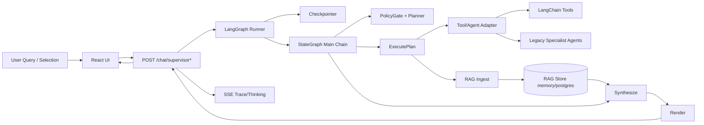
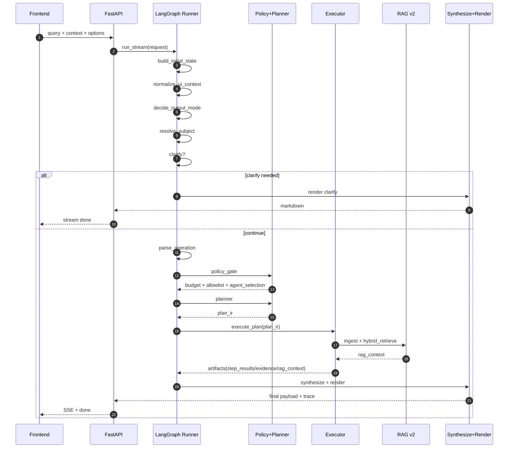
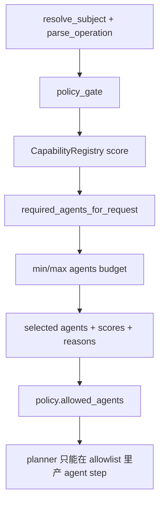
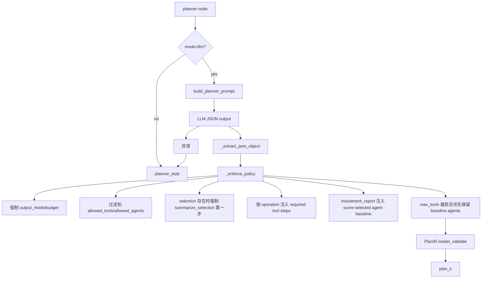
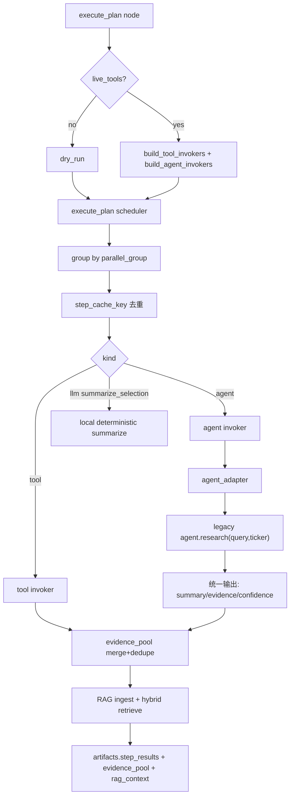
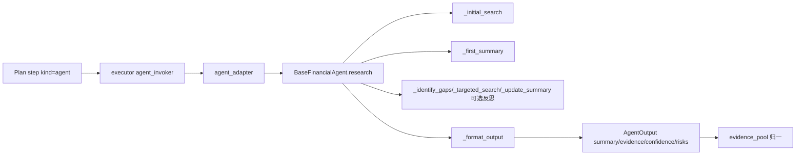
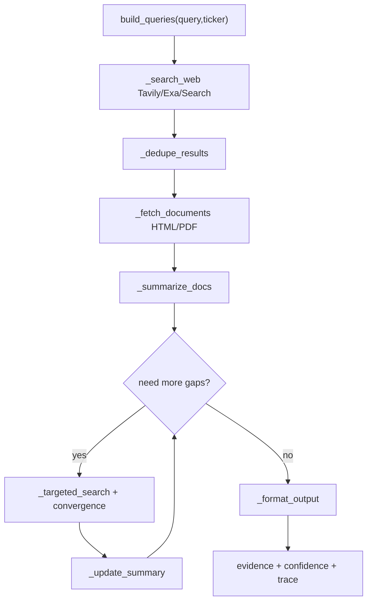

# FinSight 当前生产架构（SSOT 对齐版）

> **状态**: Active (Production)
> **最后更新**: 2026-02-07
> **SSOT**: `docs/06_LANGGRAPH_REFACTOR_GUIDE.md`
> **部署手册**: `docs/11_PRODUCTION_RUNBOOK.md`

---

## 1. 版本基线（当前运行）

| 组件 | 版本 | 来源 |
|---|---|---|
| LangChain | `1.2.7` | `requirements.txt` |
| LangGraph | `1.0.7` | `requirements.txt` |
| Python | `3.10+` | 项目运行基线 |
| React | `18+` | `frontend/package.json` |
| TypeScript | `5.x` | `frontend/package.json` |

---

## 2. 系统总览（前后端 + 编排 + 检索）


```mermaid
flowchart LR
  U[User Query / Selection] --> FE[React UI]
  FE --> API[POST /chat/supervisor*]
  API --> ORCH[LangGraph Runner]

  ORCH --> CKPT[Checkpointer]
  ORCH --> GRAPH[StateGraph Main Chain]

  GRAPH --> PLAN[PolicyGate + Planner]
  GRAPH --> EXEC[ExecutePlan]
  EXEC --> ADAPTER[Tool/Agent Adapter]
  ADAPTER --> TOOLS[LangChain Tools]
  ADAPTER --> AGENTS[Legacy Specialist Agents]

  EXEC --> RAGI[RAG Ingest]
  RAGI --> RAGS[(RAG Store memory/postgres)]
  RAGS --> SYN[Synthesize]
  GRAPH --> SYN
  SYN --> RENDER[Render]

  RENDER --> API
  API --> SSE[SSE Trace/Thinking]
  API --> FE
```

---

## 3. Query 到结果的完整时序


```mermaid
sequenceDiagram
  autonumber
  participant UI as Frontend
  participant API as FastAPI
  participant G as LangGraph Runner
  participant P as Policy+Planner
  participant E as Executor
  participant R as RAG v2
  participant S as Synthesize+Render

  UI->>API: query + context + options
  API->>G: run_stream(request)

  G->>G: build_initial_state
  G->>G: normalize_ui_context
  G->>G: decide_output_mode
  G->>G: resolve_subject
  G->>G: clarify?

  alt clarify needed
    G->>S: render clarify
    S-->>API: markdown
    API-->>UI: stream done
  else continue
    G->>G: parse_operation
    G->>P: policy_gate
    P-->>G: budget + allowlist + agent_selection
    G->>P: planner
    P-->>G: plan_ir

    G->>E: execute_plan(plan_ir)
    E->>R: ingest + hybrid_retrieve
    R-->>E: rag_context
    E-->>G: artifacts(step_results/evidence/rag_context)

    G->>S: synthesize + render
    S-->>API: final payload + trace
    API-->>UI: SSE + done
  end
```

---

## 4. LangGraph 节点职责（逐节点）

| 顺序 | 节点 | 输入 | 输出 | 失败/降级 | 代码 |
|---|---|---|---|---|---|
| 1 | `build_initial_state` | API request | 初始 `GraphState` | 保底字段补齐 | `backend/graph/nodes/build_initial_state.py` |
| 2 | `normalize_ui_context` | `context` | 统一 selection/active symbol | 缺失字段置空 | `backend/graph/nodes/normalize_ui_context.py` |
| 3 | `decide_output_mode` | query/options | `output_mode` | 默认 `brief` | `backend/graph/nodes/decide_output_mode.py` |
| 4 | `resolve_subject` | selection/query/active symbol | `subject_type/tickers/selection_ids` | `unknown` | `backend/graph/nodes/resolve_subject.py` |
| 5 | `clarify` | subject/query | 需要澄清或继续 | 早停返回澄清文案 | `backend/graph/nodes/clarify.py` |
| 6 | `parse_operation` | query/subject | `operation` | 规则兜底 `qa` | `backend/graph/nodes/parse_operation.py` |
| 7 | `policy_gate` | output/subject/op | budget + allowlists + schemas | 保守 allowlist | `backend/graph/nodes/policy_gate.py` |
| 8 | `planner` | state+policy | `plan_ir` | LLM 失败回退 `planner_stub` | `backend/graph/nodes/planner.py` |
| 9 | `execute_plan` | `plan_ir` | `step_results/evidence_pool/rag_context` | dry-run/optional 容错 | `backend/graph/nodes/execute_plan_stub.py` |
| 10 | `synthesize` | artifacts + rag_context | render vars / report ir | fallback deterministic | `backend/graph/nodes/synthesize.py` |
| 11 | `render` | render vars + template | markdown/report | fallback brief template | `backend/graph/nodes/render_stub.py` |

---

## 5. LangGraph 用到的关键特性

| 特性 | 在 FinSight 的用途 | 代码 |
|---|---|---|
| `StateGraph` + Typed State | 所有节点共享 `GraphState`，避免隐式全局状态 | `backend/graph/state.py` |
| 条件边 | `clarify` 可早停，不进入重流程 | `backend/graph/runner.py` |
| Checkpointer | 线程级状态持久化（sqlite/postgres） | `backend/graph/checkpointer.py` |
| 结构化 PlanIR | planner 输出可校验 JSON，executor 可追踪执行 | `backend/graph/plan_ir.py` |
| Node Trace | 每个节点输入/输出摘要可观测 | `backend/graph/trace.py` |
| SSE Event Bus | 前端实时看到 node/tool/agent 进度 | `backend/graph/event_bus.py`, `backend/api/main.py` |
| 统一失败策略 | 失败结构化 + fallback 可回归测试 | `backend/graph/failure.py` |

---

## 6. Agent 是如何“被选出来”的

### 6.1 选路主流程


```mermaid
flowchart TD
  A[resolve_subject + parse_operation] --> B[policy_gate]
  B --> C[CapabilityRegistry score]
  C --> D[required_agents_for_request]
  D --> E[min/max agents budget]
  E --> F[selected agents + scores + reasons]
  F --> G[policy.allowed_agents]
  G --> H[planner 只能在 allowlist 里产 agent step]
```

### 6.2 评分规则（当前实现）

`score = base + subject_weight + operation_weight + output_mode_weight + keyword_boost + selection_boost`

实现位置：`backend/graph/capability_registry.py`

### 6.3 Query 示例（真实策略，不是概念图）

> 下表基于当前 registry 规则推导；实际结果受 `LANGGRAPH_REPORT_MAX_AGENTS/MIN_AGENTS` 影响。

| Query 示例 | subject_type / operation | 典型选中 Agent | 选中原因（摘要） |
|---|---|---|---|
| `详细分析 AAPL 并生成投资报告，重点估值与风险` | `company / generate_report` | `fundamental, price, news, macro` | company+report 权重高，fundamental/price/news 为 required 主干 |
| `基于 10-K filing 深度分析 NVDA 的长期护城河与风险` | `filing / generate_report` | `deep_search, fundamental, macro, price` | filing 对 `deep_search` 权重最高，且 deep 关键词有额外 boost |
| `结合最新新闻评估 TSLA 三个月波动风险并出报告` | `news_set / analyze_impact` | `news, price, macro, fundamental` | news selection 对 `news_agent` 有 selection_boost，impact 场景 macro 也高 |
| `从 RSI MACD 和均线角度分析 AMD，给我报告` | `company / technical` | `technical, price, fundamental, news` | technical operation + technical keywords 对 `technical_agent` 高加权 |

### 6.4 policy_gate 输出（示例）

```json
{
  "policy": {
    "budget": {"max_rounds": 6, "max_tools": 8},
    "allowed_tools": ["get_stock_price", "get_company_news", "search"],
    "allowed_agents": ["fundamental_agent", "price_agent", "news_agent", "macro_agent"],
    "agent_selection": {
      "selected": ["fundamental_agent", "price_agent", "news_agent", "macro_agent"],
      "required": ["price_agent", "news_agent", "fundamental_agent"],
      "scores": {"fundamental_agent": 1.55}
    }
  }
}
```

### 6.5 本地复现选路（建议）

```bash
python - <<'PY'
from backend.graph.capability_registry import select_agents_for_request, REPORT_AGENT_CANDIDATES
state = {
    "query": "详细分析 AAPL 并生成投资报告，重点估值与风险",
    "output_mode": "investment_report",
    "operation": {"name": "generate_report"},
    "subject": {"subject_type": "company", "selection_types": []},
}
ret = select_agents_for_request(state, REPORT_AGENT_CANDIDATES, max_agents=4, min_agents=2)
print(ret["selected"])
print(ret["scores"])
print(ret["reasons"])
PY
```

---

## 7. Planner 到 Executor 的内部执行（LangGraph 内部）

### 7.1 Planner 内部流程


```mermaid
flowchart TD
  A[planner node] --> B{mode=llm?}
  B -- no --> S[planner_stub]
  B -- yes --> C[build_planner_prompt]
  C --> D[LLM JSON output]
  D --> E[_extract_json_object]
  E --> F[_enforce_policy]

  F --> F1[强制 output_mode/budget]
  F --> F2[过滤到 allowed_tools/allowed_agents]
  F --> F3[selection 存在时强制 summarize_selection 第一步]
  F --> F4[按 operation 注入 required tool steps]
  F --> F5[investment_report 注入 score-selected agent baseline]
  F --> F6[max_tools 裁剪且优先保留 baseline agents]

  F6 --> G[PlanIR.model_validate]
  G --> H[plan_ir]
  D --> X[异常]
  X --> S
```

### 7.2 Executor 内部流程


```mermaid
flowchart TD
  A[execute_plan node] --> B{live_tools?}
  B -- no --> C[dry_run]
  B -- yes --> D[build_tool_invokers + build_agent_invokers]

  C --> E[execute_plan scheduler]
  D --> E

  E --> E1[group by parallel_group]
  E1 --> E2[step_cache_key 去重]
  E2 --> E3{kind}
  E3 -->|tool| T[tool invoker]
  E3 -->|agent| AG[agent invoker]
  E3 -->|llm summarize_selection| L[local deterministic summarize]

  AG --> ADP[agent_adapter]

  ADP --> LEG["legacy agent.research(query,ticker)"]

  LEG --> NORM["统一输出: summary/evidence/confidence"]

  T --> MERGE[evidence_pool merge+dedupe]
  NORM --> MERGE
  MERGE --> RAG[RAG ingest + hybrid retrieve]
  RAG --> OUT[artifacts.step_results + evidence_pool + rag_context]

```

### 7.3 PlanIR 最小示例

```json
{
  "goal": "分析 AAPL 并生成研报",
  "output_mode": "investment_report",
  "budget": {"max_rounds": 6, "max_tools": 8},
  "steps": [
    {"id": "s1", "kind": "llm", "name": "summarize_selection", "inputs": {"selection": []}},
    {"id": "s2", "kind": "tool", "name": "get_stock_price", "inputs": {"ticker": "AAPL"}},
    {"id": "s3", "kind": "agent", "name": "fundamental_agent", "inputs": {"query": "...", "ticker": "AAPL"}}
  ]
}
```

---

## 8. 子 Agent（Sub-Agent）内部到底做什么

结论先说：**有子 Agent**。当前是 6 个专家子 Agent，通过 `agent_adapter` 接到 LangGraph Executor。

### 8.1 总体调用链


```mermaid
flowchart LR
  STEP[Plan step kind=agent] --> INV[executor agent_invoker]
  INV --> ADP[agent_adapter]
  ADP --> BASE[BaseFinancialAgent.research]
  BASE --> S1[_initial_search]
  BASE --> S2[_first_summary]
  BASE --> S3[_identify_gaps/_targeted_search/_update_summary 可选反思]
  BASE --> S4[_format_output]
  S4 --> OUT[AgentOutput summary/evidence/confidence/risks]
  OUT --> EPOOL[evidence_pool 归一]
```

### 8.2 各子 Agent 细节

| Agent | 主要数据源/策略 | 关键 fallback | 输出重点 | 代码 |
|---|---|---|---|---|
| `price_agent` | `yfinance -> finnhub -> alpha_vantage -> tavily/search` 多源价格链 | 全源失败后走搜索兜底 | 即时价格、涨跌、来源、confidence | `backend/agents/price_agent.py` |
| `news_agent` | finnhub 新闻优先，补 `get_company_news`，再 tavily，再 search | source 级熔断器 + 解析兜底 | 新闻 evidence 列表，支持 convergence 去重 | `backend/agents/news_agent.py` |
| `fundamental_agent` | `get_financial_statements` + `get_company_info` | 工具缺失/报错时低置信输出 | 收入/净利/现金流/杠杆等基本面摘要 | `backend/agents/fundamental_agent.py` |
| `technical_agent` | `get_stock_historical_data` 计算 MA/RSI/MACD | 数据不足时降级描述 | 技术指标、趋势判断、风险提示 | `backend/agents/technical_agent.py` |
| `macro_agent` | `get_fred_data` 优先，失败走 search fallback | FRED 不可用时回退搜索模板 | 利率/CPI/失业/GDP/利差与宏观解读 | `backend/agents/macro_agent.py` |
| `deep_search_agent` | Tavily/Exa/Web 搜索 + HTML/PDF 抽取 + Self-RAG 反思轮 | 无结果时 search 文本解析；LLM 失败降级摘要 | 深度证据、文档级引用、信息增益控制 | `backend/agents/deep_search_agent.py` |

### 8.3 deep_search_agent 内部（重点）


```mermaid
flowchart TD
  A["build_queries(query,ticker)"] --> B[_search_web Tavily/Exa/Search]
  B --> C[_dedupe_results]
  C --> D[_fetch_documents HTML/PDF]
  D --> E[_summarize_docs]
  E --> F{need more gaps?}
  F -- yes --> G[_targeted_search + convergence]
  G --> H[_update_summary]
  H --> F
  F -- no --> I[_format_output]
  I --> J[evidence + confidence + trace]

```

---

## 9. 前后端交互边界（React 与 LangGraph）

- `App.tsx`：路由壳，不承载业务编排。
- `WorkspaceShell`：布局壳 + 右侧面板状态 + 行情轮询。
- `RightPanel`：展示组合层，具体 tab 逻辑在 `right-panel/*`。
- `MiniChat`：通过 `/chat/supervisor/stream` 消费 SSE，展示 node/tool/agent 执行状态。

请求关键字段：

```json
{
  "query": "详细分析 AAPL 并生成投资报告",
  "context": {
    "active_symbol": "AAPL",
    "selection": [{"id": "news-1", "type": "news", "title": "..."}]
  },
  "options": {
    "output_mode": "investment_report",
    "strict_selection": false
  }
}
```

---

## 10. Fallback 统一口径

| 层级 | 主路径 | 回退路径 |
|---|---|---|
| Clarify | 图内 `clarify` 节点 | 确定性澄清文案 |
| Planner | `LANGGRAPH_PLANNER_MODE=llm` | `planner_stub`（保留 policy 约束） |
| Synthesize | `LANGGRAPH_SYNTHESIZE_MODE=llm` | deterministic synthesize |
| Agent/Tool | live invoker | dry-run + structured skipped result |
| RAG backend | postgres（有 DSN） | memory |
| Checkpointer | sqlite/postgres | memory（仅允许时） |

---

## 11. 文档边界

- 架构决策与任务推进：`docs/06_LANGGRAPH_REFACTOR_GUIDE.md`
- 生产部署与排障：`docs/11_PRODUCTION_RUNBOOK.md`
- RAG 数据边界与存储策略：`docs/05_RAG_ARCHITECTURE.md`
- 本文只回答：**系统现在如何运行、Agent 如何被选、LangGraph 内部如何执行**。

---

## 12. 变更记录

| 日期 | 变更 |
|---|---|
| 2026-02-07 | 增补“query->agent 选路示例”“planner/executor 内部流程图”“子 Agent 内部步骤与数据源/fallback 表” |
