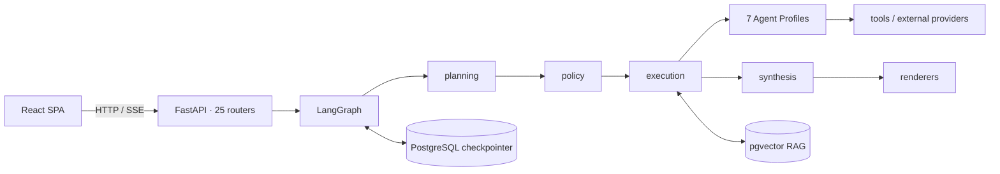
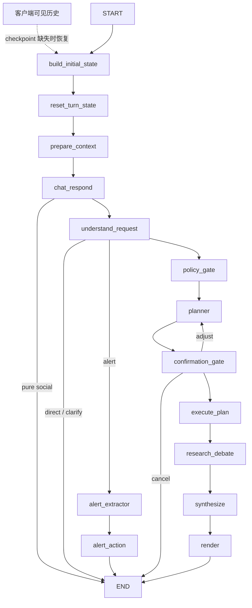

# FinSight 当前架构

更新时间：2026-07-13

## 1. 架构原则

FinSight 的聊天和研究主链路以 `backend/graph/runner.py` 为唯一图结构事实源。请求理解之后，职责按边界分离：

- `backend/graph/planning/`：从请求合同生成计划、依赖、角色和执行策略。
- `backend/graph/policy/`：在执行前约束能力、证据、安全和工具选择。
- `backend/graph/execution/`：执行计划、采集工具/Agent 结果、构建证据与观测。
- `backend/graph/synthesis/`：把结构化证据合成为叙事或晨报。
- `backend/graph/renderers/`：按回答形态渲染，不重新推断意图。
- `backend/agents/`：专项研究实现；公共身份与质量合同由 `AgentProfile` 复用。
- `backend/rag/`：memory、working set、knowledge base 的摄取、检索和观测。

旧 `*_stub.py` 节点已迁移，禁止恢复。兼容行为应通过薄适配层或规则规划器实现。

## 2. 运行时总览

```mermaid
flowchart LR
    WEB[React SPA] -->|HTTP / SSE| API[FastAPI · 25 routers]
    API --> GRAPH[LangGraph]
    GRAPH --> PLAN[planning]
    PLAN --> POLICY[policy]
    POLICY --> EXEC[execution]
    EXEC --> AGENT[7 Agent Profiles]
    EXEC --> SYN[synthesis]
    SYN --> RENDER[renderers]
    AGENT --> TOOL[tools / external providers]
    EXEC <--> RAG[(pgvector RAG)]
    GRAPH <--> CP[(PostgreSQL checkpointer)]
```

FastAPI 当前注册 25 个 router：system、user、watchlist、conversation、chat、market、subscription、alerts、screener、cn_market、backtest、config、report、research、task、tools、skills、agents、execution、dashboard、portfolio、attribution、monitor、rebalance、morning_brief。

## 3. GraphState 与请求合同

`GraphState` 承载本轮输入、会话上下文、请求理解结果、策略、计划、证据、产物、追踪和最终回复。关键规则：

- 用户 query 明示的标的优先于 UI hint。
- `understand_request` 生成结构化任务、请求帧和回复合同。
- `policy_gate`、`planner`、`execute_plan` 和 renderer 消费结构化合同，不靠重复关键词猜测。
- 工具失败、拒绝、空结果和超时进入 diagnostics，不得伪装成 evidence。
- 取消信号贯穿 API、执行服务、图节点和 executor。
- 客户端发送最近可见历史；仅当当前 thread 的 checkpoint 没有消息时，`build_initial_state` 才恢复最多 12 条，避免刷新/实例切换后丢失连续对话。
- 认证用户按 user id 隔离长期记忆；匿名会话按完整 thread id 的稳定摘要隔离，不能共享统一 `anonymous` 记忆桶。
- 会话 router/reply 使用独立短超时和统一 LLM 重试；单端点瞬态连接错误复用当前端点，多端点故障则轮换；回退通过 `degraded` SSE、终态字段和前端徽标显式披露。
- IntentFrame、DAG executor、AgentBrief 与 evidence bus 默认启用；环境变量显式 `off` 仅作为运行时回滚开关。
- renderer 的降级输出仍受语义合同约束：比较问题必须展示实际可比证据或明确缺口，价格图必须使用真实行情且保持价格/收益率单位一致。

## 4. 主路径

```mermaid
flowchart TD
    H[客户端可见历史] -. checkpoint 缺失时恢复 .-> build_initial_state
    START --> build_initial_state --> reset_turn_state --> prepare_context --> chat_respond
    chat_respond -->|pure social| END
    chat_respond --> understand_request
    understand_request -->|direct / clarify| END
    understand_request -->|alert| alert_extractor --> alert_action --> END
    understand_request --> policy_gate --> planner --> confirmation_gate
    confirmation_gate -->|adjust| planner
    confirmation_gate -->|cancel| END
    confirmation_gate --> execute_plan --> research_debate --> synthesize --> render --> END
```

`trim_history`、`summarize_history`、`normalize_ui_context`、`decide_output_mode` 仍注册以兼容历史调用，但当前主边从 `prepare_context` 直接进入 `chat_respond`。

## 5. 数据边界

| 数据 | 当前生产存储 |
|---|---|
| LangGraph checkpoint | PostgreSQL |
| RAG chunk / embedding / observability | PostgreSQL + pgvector，BGE-M3 1024 维 |
| Agent 预测、结果与运行归档 | PostgreSQL |
| Monitor page lease / comments | PostgreSQL |
| 部分持仓、会话、报告及兼容业务数据 | 仍存在按用户隔离的 SQLite/JSON store |

因此不能笼统声称“全部业务数据已迁移 PostgreSQL”。新增跨实例协调或高一致性数据应优先落 PostgreSQL；修改旧业务存储前必须先设计迁移与回滚。

## 6. 前端边界

`frontend/src/App.tsx` 是页面路由事实源。当前入口包括 welcome、chat、workbench、cn-market、rag-inspector、cost-audit、screener、backtest、dashboard 和共享报告。`/phase-labs` 仅为兼容重定向。

后端合同变化必须同步：

- `frontend/src/api/` 下的 API 客户端与 schema；
- `frontend/src/types/` 和对应 store；
- 单元测试，以及必要时的 Playwright 关键路径。

## 7. 部署边界

Docker Compose 运行三项服务：PostgreSQL/pgvector、FastAPI/Uvicorn 后端、Nginx/React 前端。后端宿主端口只绑定 `127.0.0.1:8000`；前端映射 `5173:80`。生产操作以 [`11_PRODUCTION_RUNBOOK.md`](11_PRODUCTION_RUNBOOK.md) 为准。
