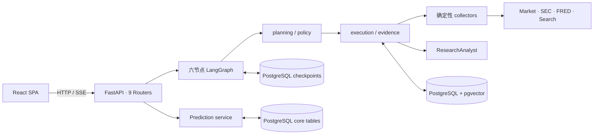
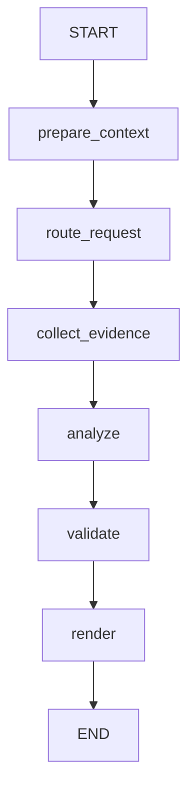

# FinSight 当前架构

更新时间：2026-07-16

## 1. 产品边界

FinSight 的唯一产品目标是：围绕一个标的展示可信行情和确定性指标，生成可验证的 AI Prediction，并支持证据化追问与历史复盘。

当前主入口只有 Dashboard、Chat、History；另有 Welcome/Login 与只读 Shared Report。组合工作台、Screener、Backtest、A 股榜单、Attribution、Rebalance、Morning Brief、Daily Tasks、邮件订阅、Alert Feed、RAG Inspector、Cost Audit、Skills/Agents/Tools 目录均不属于当前产品。

## 2. 运行时总览

```mermaid
flowchart LR
    WEB[React SPA] -->|HTTP / SSE| API[FastAPI · 9 Routers]
    API --> GRAPH[六节点 LangGraph]
    GRAPH --> PLAN[planning / policy]
    PLAN --> EXEC[execution / evidence]
    EXEC --> COLLECT[确定性 collectors]
    EXEC --> ANALYZE[ResearchAnalyst]
    API --> PRED[Prediction service]
    COLLECT --> TOOL[Market · SEC · FRED · Search]
    EXEC <--> RAG[(PostgreSQL + pgvector)]
    GRAPH <--> CP[(PostgreSQL checkpoints)]
    PRED <--> CORE[(PostgreSQL core tables)]
```

FastAPI 只注册以下九个 Router：

| Router | 责任 |
|---|---|
| `system_router` | `/health`、`/metrics` 与受保护诊断 |
| `user_router` | 当前用户只读资料 |
| `watchlist_router` | Watchlist 增删查 |
| `conversation_router` | 对话列表与历史 |
| `market_router` | quote、Kline、financials、news、Dashboard snapshot |
| `execution_router` | 唯一 Chat/Report SSE 执行、回放与取消 |
| `predictions_router` | generate、run、latest、history、detail、stats、Outcome 运维入口 |
| `monitor_router` | 页面 lease 与当前标的 comments feed |
| `report_router` | 报告索引、回放、分享与公开只读读取 |

当前 OpenAPI 为 35 个操作。新增公开端点必须先证明不能并入上述边界，并保持总量门禁。

## 3. Graph 与请求合同

`backend/graph/runner.py` 是图结构唯一事实源：

```mermaid
flowchart TD
    START --> PC[prepare_context]
    PC --> RR[route_request]
    RR --> CE[collect_evidence]
    CE --> AN[analyze]
    AN --> VA[validate]
    VA --> RE[render]
    RE --> END
```

- `prepare_context`：恢复同 thread 上下文并建立本轮状态。
- `route_request`：优先确定性规则；仅歧义请求允许一次结构化 LLM router。
- `collect_evidence`：规划、策略检查和并行工具采集；collector 被强制关闭自身 LLM 与 reflection。
- `analyze`：事实查询直接构建渲染变量；研究请求最多调用一次 ResearchAnalyst。
- `validate`：统一检查 Claim、引用、TaskOutcome、报告/回答质量与失败披露。
- `render`：按 Chat 或 Report 合同输出，不重新取数或发明证据。

`GraphState` 保存 query、thread、UI 上下文、请求帧、计划、证据、产物、trace 与最终回复。用户本轮显式标的优先于历史和 UI hint；diagnostics 不得进入 evidence；取消信号贯穿 SSE、图和执行器。

## 4. AI 角色

用户可感知的业务 LLM 角色只有两个：

1. `PredictionAnalyst`：消费可信 K 线、服务端指标和新闻摘要，输出受校验的 Prediction JSON；独立异步执行，最多一次纠错。
2. `ResearchAnalyst`：消费 collectors 的结构化证据，生成 Chat 答案或报告草稿；普通研究最多一个业务分析调用，长报告才允许一次 verifier。

Price、Technical、Fundamental、News、Macro、Risk、Deep Search 只作为内部 evidence collector/profile。Technical 指标由代码计算。任何 collector 都不得自行调用 LLM、reflection 或补充搜索循环。

## 5. 行情与真实性

`backend/services/market_data_gateway.py` 是 quote/Kline/news/financials 的规范化入口。每种 capability 最多配置 primary 与 secondary 两级供应商。响应携带 `provider`、`as_of`、`freshness_seconds`、`quality` 与稳定错误码。

硬约束：

- K 线必须通过时间单调、去重、正价格和 OHLC 关系校验。
- Prediction 与 Outcome 只接受 `quality=trusted` 的真实 K 线。
- 单价拼接 OHLC、mock、synthetic 或搜索结果数字不得进入分析。
- degraded 数据可只读展示，但必须显式标记并禁用 Prediction。

## 6. 数据与认证

| 数据 | 生产事实源 |
|---|---|
| 会话、Watchlist、报告与引用 | PostgreSQL |
| Prediction、Outcome、run archive、LLM usage | PostgreSQL |
| Monitor leases/comments | PostgreSQL |
| LangGraph checkpoint | PostgreSQL |
| RAG chunks、embedding、observability | PostgreSQL + pgvector |

核心 schema 由 Alembic 管理；应用启动只校验 revision，不执行运行时 DDL。`scripts/migrate_legacy_storage.py` 仅用于一次性 dry-run/import/verify/rollback，不是运行路径。

生产启用 `APP_MODE=production` 和 `SUPABASE_AUTH_REQUIRED=true`。Prediction、Chat、History、Watchlist、Monitor 与私有报告必须带有效 JWT。公开面仅包括健康检查、明确允许的只读行情和 share token 报告。

## 7. 前端边界

`frontend/src/App.tsx` 是路由事实源：

- `/welcome`
- `/dashboard/:symbol?`
- `/chat`
- `/history`
- `/share/r/:token`

Dashboard 的“问 AI”通过 handoff 进入主 Chat，不创建第二条 SSE。History 统一承载 Prediction/Outcome 与报告。后端合同变化必须同步 API client、OpenAPI snapshot、生成类型、store 和测试。

## 8. 部署边界

Docker Compose 运行 PostgreSQL/pgvector、FastAPI/Uvicorn 后端和 Nginx/React 前端。后端宿主端口仅绑定 `127.0.0.1:8000`；前端映射 `5173:80`。镜像用 commit SHA 标记，数据库先迁移，随后依次部署后端和前端。完整操作与 canary 标准见 [11_PRODUCTION_RUNBOOK.md](11_PRODUCTION_RUNBOOK.md)。
