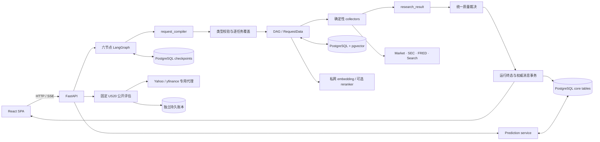
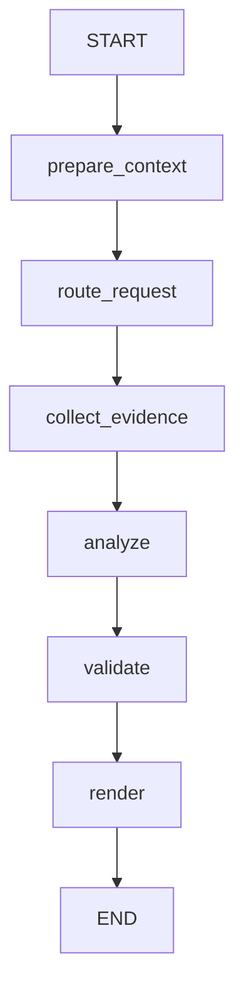

# FinSight 当前架构

更新时间：2026-10-08

## 1. 产品边界

FinSight 的产品目标是：先把与用户关注标的有关的变化摆到面前，再用可信行情、可验证 Prediction、证据化追问和历史复盘帮助用户理解公开金融信息。

当前主工作区为 Today、Dashboard、Chat、History；另有 Welcome/Login 与只读 Shared Report。右侧战绩工作区区分个人 Prediction 与 US20；`/track-record` 是独立公开分享页。Today 是默认入口，登录用户可查看自选报价、最近 Prediction/Outcome 和待跟进判断；匿名用户只看到登录引导并可转到只读 Dashboard。Ask、Research、Portfolio、Library 是后续目标信息架构，不是当前已注册路由。

组合工作台、Screener、Backtest、A 股榜单、Attribution、Rebalance、独立 Morning Brief/Daily Tasks、邮件订阅、Alert Feed、RAG Inspector、Cost Audit、Skills/Agents/Tools 目录均不属于当前产品。

## 2. 运行时总览

```mermaid
flowchart LR
    WEB[React SPA] -->|HTTP / SSE| API[FastAPI]
    API --> GRAPH[六节点 LangGraph]
    GRAPH --> REQUEST[request_compiler]
    REQUEST --> PLAN[类型校验与逐任务覆盖]
    PLAN --> EXEC[DAG / RequestData]
    EXEC --> COLLECT[确定性 collectors]
    COLLECT --> RESULT[research_result]
    RESULT --> QUALITY[统一质量裁决]
    QUALITY --> SAVE[运行终态与权威消息事务]
    SAVE --> WEB
    SAVE --> CORE
    API --> PRED[Prediction service]
    COLLECT --> TOOL[Market · SEC · FRED · Search]
    EXEC <--> RAG[(PostgreSQL + pgvector)]
    EXEC --> WORKER[私网 embedding / 可选 reranker]
    GRAPH <--> CP[(PostgreSQL checkpoints)]
    PRED <--> CORE[(PostgreSQL core tables)]
    API --> BENCH[固定 US20 公开评估]
    BENCH --> YAHOO[Yahoo / yfinance 专用代理]
    BENCH --> LEDGER[(独立持久账本)]
```

FastAPI 注册以下十一个 Router：

| Router | 责任 |
|---|---|
| `system_router` | `/livez`、`/readyz`、`/health`、公开只读 `/api/capabilities` 与 `/metrics` |
| `user_router` | 当前用户只读资料 |
| `watchlist_router` | Watchlist 增删查 |
| `conversation_router` | 对话列表与历史 |
| `market_router` | quote、Kline、financials、news、Dashboard snapshot |
| `execution_router` | 唯一 Chat/Report SSE 执行、持久运行状态、回放与取消 |
| `predictions_router` | 用户触发的 PostgreSQL PredictionTrack：generate、run、latest、history、detail、stats、Outcome 运维入口；保留旧账本地址的隐藏兼容入口 |
| `monitor_router` | 页面 lease 与当前标的 comments feed |
| `report_router` | 报告索引、回放、分享与公开只读读取 |
| `model_router` | 公开模型目录与能力、登录用户的连接测试 |
| `prediction_router` | 独立 `/api/benchmarks/us20-v1/track-record`：固定 US20 五日公开基准账本，只读 |

操作清单以生成的 OpenAPI 为准。其中 `/api/models`、`/api/models/capabilities`、`/api/models/test` 提供请求级模型配置；`/api/execute/runs/{run_id}` 提供持久研究运行状态；`/api/benchmarks/us20-v1/track-record` 提供固定公开样本的只读账本。旧 `/api/predictions/track-record` 是现有 `predictions_router` 内部的静态兼容入口，排在详情查询之前，不进入 OpenAPI。两个 Router 的应用注册顺序可以互换。

聊天和研究报告的模型选择通过 `backend/services/model_selection.py` 进入现有 LLM 调用链；使用单独端点池，保持全站共享报告缓存停用。详见 [模型选择](MODEL_SELECTION.md)。

固定 US20 账本独立于用户的 PostgreSQL Prediction/Outcome：Technical 与 Risk 仅在显式定时 forecast 模式产出五日方向及回撤事件，使用独立预算、冻结输入和单源 Yahoo。公开评估记录写入持久卷中的 `prediction_ledger.db`，独立 watchdog 记录投递状态；这不恢复旧业务 SQLite/JSON 路径。两者采样和评分合同不同，不合并战绩或用户数据。详见 [公开预测账本](PREDICTION_TRACK_RECORD.md)。

## 3. Graph 与请求合同

`backend/graph/runner.py` 是图结构唯一事实源：

```mermaid
flowchart TD
    START --> PC[prepare_context]
    PC --> RR[route_request]
    RR --> CE[collect_evidence]
    CE --> AN[analyze]
    AN --> VA[validate]
    VA --> RE[render]
    RE --> END
```

- `prepare_context`：恢复同 thread 上下文并建立本轮状态。
- `route_request`：模型抽取语义并由 `request_compiler` 唯一编译版本化 `RequestSpec`；注册能力、主体、限定条件和展示要求在入口冻结，兼容 operation 只作为投影。语义不可用时保留完整原问的未确认检索合同，不用旧规则任务替换原始需求。`CapabilitySpec` 区分必需来源组与可选补充，能力与未知限定条件分别判定。
- `collect_evidence`：实际工具 schema、任务引用、依赖和无环校验后执行计划；覆盖按 `(task_id, subject, evidence_kind)` 检查。工具和 collector 共享本轮 `RequestData`；执行时一次归一化证据，合成不再同时重建原始 Agent evidence。
- `analyze`：基于规范化 evidence/claim 生成唯一 `research_result`；事实可确定性渲染，分析、报告草稿及核验调用按真实 usage 统计。
- `validate`：冻结逐需求结果、来源质量与发布资格，保留真实缺项和硬冲突；恢复过的执行告警不自动改成内容缺项。
- `render`：只读已验证结果，按 Chat 或 Report 合同输出，不重新判定需求或修改业务状态。

`GraphState` 保存 query、thread、UI 上下文、请求帧、计划、证据、产物、trace 与最终回复。用户本轮显式标的优先于历史和 UI hint；diagnostics 不得进入 evidence；取消信号贯穿 SSE、图和执行器。

`depends_on` 表示必须成功的控制依赖；`data_dependencies` 表示等待数据生产者进入成功或失败终态后再分析。某个来源失败不会让仅等待其数据的 Agent 或无依赖分支被连带跳过。用户明确要求的维度不能被成本 profile 删除；缺失按任务披露。

`research_result` 保留事实、判断、引用、每个任务的结果和缺口。来源质量为 `pass/warn/block`，内容状态单独记录；澄清为 `clarification_required`，不能发布为研究报告。真实来源冲突与发布硬阻断不能被后续成功洗掉；完整报告必须有受支持论据。

## 4. AI 角色

LLM 按调用用途区分，均继承请求中选定的模型配置：

1. `PredictionAnalyst`：消费可信 K 线、服务端指标和新闻摘要，输出受校验的 Prediction JSON；独立异步执行，最多一次纠错。
2. `ResearchAnalyst`：消费规范化证据和论据，生成任务分析及报告草稿；按任务、草稿、核验和重试阶段记录实际调用，不把一个角色等同于一次模型调用。
3. `direct_answer`：回答无需实时资料的通用概念与虚构示例；不采集行情，已有固定回复或澄清问题时无需模型。

Price、Technical、Fundamental、News、Macro、Risk、Deep Search 作为内部 evidence collector/profile。Technical 指标由代码计算。公告财务抽取是显式、可计量的模型调用，候选数值、单位、期间、页码和口径必须回到原文核验；其预算与研究分析共享 `RunContext`，不再隐藏在工具内部另开预算。

`RunContext` 绑定服务端 owner、所选模型、累计截止时间、额度、取消信号和实际用量。普通研究180秒、报告300秒、个人预测180秒，纠错共享剩余时间。每个完成步骤即时记录，到期只做本地事实投影并停止新模型调用；投影与终态保存各有3秒/2秒上限，保存失败明确标记。

## 5. 行情与真实性

`backend/services/market_data_gateway.py` 是 quote/Kline/news/financials 的规范化入口。每种 capability 最多配置 primary 与 secondary 两级供应商。响应携带 `provider`、`as_of`、`freshness_seconds`、`quality` 与稳定错误码。

`AssetContext` 绑定市场、时区与交易日历；`DataResult` 区分数据状态、源时间与抓取时间。报价币种和财报币种独立；看板保留实际期间及频率，公共计算按期间键匹配同比和权益，缺失保持 null。默认日线报价明确为 `daily_close`，不能支撑盘中异动；监控按每个目标日历和实际输入能力运行。

硬约束：

- K 线必须通过时间单调、去重、正价格和 OHLC 关系校验。
- Prediction 与 Outcome 只接受 `quality=trusted` 的真实 K 线。
- 单价拼接 OHLC、mock、synthetic 或搜索结果数字不得进入分析。
- degraded 数据可只读展示，但必须显式标记并禁用 Prediction。
- `financial_facts.py` 统一主体、指标、实际起止日期、频率、单位和来源；SEC 单季度按真实 duration 选择，不能把半年累计或年度数据当单季。
- 财务行按明确别名及优先级匹配，增长按真实日期对齐同比/环比；缺对应期间就缺失。
- 本地公告必须核验发行人代码/名称；官方域名本身不够。新闻格式头不是新闻，CPI 指数水平不是通胀同比。

## 6. 数据与认证

| 数据 | 生产事实源 |
|---|---|
| 会话、权威消息、研究运行终态、Watchlist、报告与引用 | PostgreSQL |
| Prediction、Outcome、run archive、LLM usage | PostgreSQL |
| Monitor leases/comments | PostgreSQL |
| LangGraph checkpoint | PostgreSQL |
| RAG chunks、embedding、observability | PostgreSQL + pgvector |

核心 schema 由 Alembic 管理；应用启动只校验 revision，不执行运行时 DDL。`scripts/migrate_legacy_storage.py` 仅用于一次性 dry-run/import/verify/rollback，不是运行路径。

`research_runs` 与 `conversation_messages` 使用 owner 复合键、外键和 RLS；会话 `version` 支持乐观版本检查。运行开始先保存问题及助手占位，终态在短事务中保存后才交付 `done`。旧浏览器快照采用合并，不能抹掉权威回复。运行恢复读取持久终态，租约失联后标为 `interrupted`，不自动重新付费执行。完整协议见 [执行事件合同](execution-event-contract.md)。

生产启用 `APP_MODE=production` 和 `SUPABASE_AUTH_REQUIRED=true`。Prediction、Chat、History、Watchlist、Monitor 与私有报告必须带有效 Supabase JWT。公开面仅包括 `/livez`、`/readyz`、`/health`、明确允许的只读 quote/news/Kline/Dashboard GET，以及 share token 报告。前端的欢迎门只控制页面进入体验，不替代后端身份校验；Today 在没有有效用户身份时不得请求或展示个人自选与历史判断。

认证后的 `user_id` 是资源 owner 的唯一来源；客户端 session/body/UI context 不得覆盖。线程 ID 的 owner 段必须与认证用户一致。删除线程会清理进程内上下文、该 owner 的报告与引用、thread-scoped RAG 数据和 LangGraph checkpoint；用户级数据不随线程删除。

共享报告不是对私有报告对象做递归黑名单清洗，而是只投影显式允许的正文、章节、引用和质量字段；非 HTTP(S) 引用 URL 被清空，响应禁止缓存。quality blocked 报告不写默认索引、不创建 share，并且旧 ticker/output-mode 最终报告缓存已从执行路径移除。MCP 默认关闭；启用后，私有报告工具仍要求 transport 注入可信 principal 并校验 session owner。

## 7. 前端边界

`frontend/src/App.tsx` 是路由事实源：

- `/welcome`
- `/today`
- `/dashboard/:symbol?`
- `/chat`
- `/history`
- `/share/r/:token`
- `/track-record`（公开分享）

`/` 默认重定向到 `/today`；若 query 带 `symbol`，则进入对应 Dashboard。`/chat` 与 `/history` 使用强登录 Guard，Today 与 Dashboard 使用欢迎门，其中个人数据仍由用户身份和后端 JWT 控制。Dashboard 的“问 AI”通过 handoff 进入主 Chat，不创建第二条 SSE。History 统一承载 Prediction/Outcome 与报告。后端合同变化必须同步 API client、OpenAPI snapshot、生成类型、store 和测试。

## 8. 部署边界

Docker Compose 运行 PostgreSQL/pgvector、FastAPI/Uvicorn、私网 `rag-inference` 和 Nginx/React。后端宿主端口仅绑定 `127.0.0.1:8000`；前端映射 `5173:80`，默认由 Nginx 同源代理。worker 不映射宿主端口，只接收有 token 的推理请求，默认限制 3000 MiB 内存、3600 MiB 内存加 swap、1 CPU，reranker 默认关闭。首次加载前取 `/proc/meminfo` 的 `MemAvailable` 与 cgroup `memory.max-memory.current` 的较小值，默认至少需要 2400 MiB；不足则为 `resource_limited`，不加载模型。API 不在请求或验收子进程里另加载 BGE 副本。

向量携带实际模型、版本和维数形成的 `metadata.embedding_identity`，查询只比较相同身份；旧身份未知的向量不自动标为 BGE。worker 不可用时保留 PostgreSQL 词法检索，`/readyz` 可就绪并明确语义降级，不把词法可用说成语义推理成功。健康成功状态短期缓存后重查。

研究终态已持久化，但正在执行的 Python task、取消路由、Prediction worker、Monitor/Outcome scheduler 仍在 Web 进程内；本次不声明支持 backend 横向扩容。镜像用 commit SHA 标记，先迁移，再部署 API、worker 与前端。数据库 `0005/0006` 为保留数据的前向迁移，回滚须使用认识新 head 的兼容镜像。完整操作与验收证据要求见 [11_PRODUCTION_RUNBOOK.md](11_PRODUCTION_RUNBOOK.md)。
