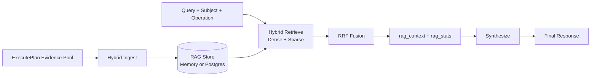

# FinSight RAG v2 架构（当前有效）

> **状态**: Active (Production-Oriented)  
> **最后更新**: 2026-02-07  
> **SSOT 对齐**: `docs/06_LANGGRAPH_REFACTOR_GUIDE.md`（11.10 / 11.11.2）

---

## 1. 目标

RAG v2 的目标不是“所有内容都入库”，而是让检索在正确场景下稳定提升结论质量：

- 历史/长文问题：提升召回与证据可追溯
- 实时新闻问题：优先走 live tools，不被旧知识污染
- 研报综合：检索结果进入 `rag_context` 再参与综合输出

---

## 2. 架构图

---

## 3. 后端实现位置

| 模块 | 文件 |
|---|---|
| RAG 服务 | `backend/rag/hybrid_service.py` |
| 执行层写入/检索接入 | `backend/graph/nodes/execute_plan_stub.py` |
| 综合层消费检索上下文 | `backend/graph/nodes/synthesize.py` |
| 测试 | `backend/tests/test_rag_v2_service.py` |

---

## 4. 存储分层策略（存什么）

| 数据类型 | 是否长期入库 | 建议内容 | 生命周期 |
|---|---|---|---|
| 财报/公告/电话会纪要 | 是 | 分块正文 + 元数据（ticker/period/section） | 长期 |
| 内部研究文档 | 是 | 分块正文 + 版本信息 | 长期 |
| 实时新闻全文 | 否（默认） | 标题/摘要/来源/时间 + embedding | TTL 7~30 天 |
| DeepSearch 临时抓取 | 否（默认） | 会话级临时 chunk | 任务级 TTL |

---

## 4.1 研报库边界（最容易做错的点）

结论：**不要把“生成的研报正文”作为主检索语料长期入库**。  
RAG 主库应优先存“可追溯原始证据”，研报正文只适合作为会话产物或短期缓存。

| 内容 | 是否建议入 RAG 主库 | 原因 |
|---|---|---|
| 财报原文、电话会纪要、公告、研究原文 | 是 | 事实稳定、可溯源、可复用 |
| 实时新闻全文 | 默认否（摘要+元数据即可） | 时效衰减快，容易污染后续检索 |
| LLM 生成的研报正文 | 否（默认） | 二次加工文本，易放大幻觉/偏差 |
| 研报结构化摘要（结论+证据ID映射） | 可选（短 TTL） | 便于会话续写，不替代原始证据 |

---

## 4.2 推荐入库来源（先做可控闭环）

1. SEC/交易所文件：10-K/10-Q/20-F、8-K、公告。
2. 财报电话会文字稿：按 speaker turn 切分。
3. 内部研究文档：版本化存储。
4. 新闻只存结构化摘要：`title/summary/url/source/published_at`。
5. DeepSearch 抓取文本：只做会话级临时库（ephemeral）。

---

## 5. 检索策略（怎么检）

1. Dense + Sparse 混合召回
2. RRF 融合排序
3. 返回 `rag_context`（供综合）与 `rag_stats`（供 trace/诊断）
4. 按场景选择优先级：
   - `latest/news-now`：live tools first
   - `history/filing/details`：RAG first

---

## 6. 后端选择与回退

- `RAG_V2_BACKEND=auto`：有 Postgres DSN 时优先 Postgres，否则回退 memory
- memory 模式用于本地开发和测试
- Postgres 模式用于生产一致性与可运维性

---

## 7. 与主编排关系

RAG v2 不单独暴露为入口服务，而是嵌入主编排：

- Planner/Executor 产出的证据先入 RAG
- 同请求内再检索回填 `rag_context`
- Synthesize 使用 `rag_context` 生成最终回答

这保证了“检索-综合”是同一条可观测链路。

---

## 8. 验收口径

- 检索可返回可解释的 `rag_stats`
- `rag_context` 在综合节点被消费
- TTL 生效，过期内容不会长期污染
- 与实时链路冲突时，实时链路优先

---

## 9. 变更记录

| 日期 | 变更 |
|---|---|
| 2026-02-07 | 从旧 Chroma 规划文档重写为 RAG v2 当前实现与生产导向策略 |
| 2026-02-07 | 新增“研报库边界”与“推荐入库来源”，明确生成研报不作为主检索语料 |
