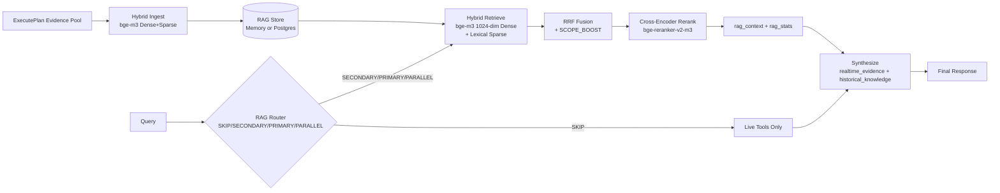

# FinSight RAG v2 架构（当前有效）

> **状态**: Active (Production-Oriented, Phase E Upgraded)
> **最后更新**: 2026-02-17
> **SSOT 对齐**: `docs/06_LANGGRAPH_REFACTOR_GUIDE.md`（11.10 / 11.11.2）

---

## 1. 目标

RAG v2 的目标不是“所有内容都入库”，而是让检索在正确场景下稳定提升结论质量：

- 历史/长文问题：提升召回与证据可追溯
- 实时新闻问题：优先走 live tools，不被旧知识污染
- 研报综合：检索结果进入 `rag_context` 再参与综合输出

### 1.1 RAG 要解决的具体问题（Problem Statement）

为避免“RAG 是不是可有可无”的歧义，明确本项目中 RAG 的职责边界如下：

1. **历史/长文稳定召回**
   - 场景：财报、公告、电话会纪要、研究文档。
   - 问题：若每次临时抓取，延迟高且结果不稳定，难以复现同一问题的分析过程。
   - 目标：同主题问题在跨时间查询中保持可复现、可验证的召回质量。

2. **证据可追溯（Citation-first）**
   - 场景：投研结论需要对应来源和时间戳。
   - 问题：仅靠模型口述会降低可信度，无法审计“结论从何而来”。
   - 目标：输出可落到 source/citation，并可被回放与人工复核。

3. **跨会话复用与回放**
   - 场景：同一主题在多轮、多天、多页面连续分析。
   - 问题：无索引与回放会导致重复计算、上下文断裂、结论漂移。
   - 目标：支持会话内外复用结构化证据与报告索引，降低重复构建成本。

4. **实时与长期分层（Tool-first + RAG-second）**
   - 场景：实时行情/快讯与历史文档混合问题。
   - 问题：不分层会出现“旧知识污染实时判断”或“全靠实时接口导致不稳定”。
   - 目标：`latest/news-now` 走 live tools 优先，`history/filing/details` 走 RAG 优先。

5. **质量与成本平衡（TTL + 分层存储）**
   - 场景：高频新闻与长期文档共存。
   - 问题：全部长期入库会造成噪声累积、检索污染与存储/计算开销上升。
   - 目标：高价值原始文档长期化，短时效内容 TTL 化，保证质量与成本的长期可控。

### 1.2 非目标（避免误用）

- RAG **不是**实时行情/新闻 API 的替代品。
- RAG 主库默认不长期存储 LLM 生成的研报正文。
- RAG 不承担“自动交易决策”，只提供可追溯证据与检索增强能力。

---

## 2. 架构图



---

## 3. 后端实现位置

| 模块 | 文件 |
|---|---|
| Embedding 服务 (bge-m3 + hash fallback) | `backend/rag/embedder.py` |
| 文档切片策略 | `backend/rag/chunker.py` |
| Cross-Encoder 精排 | `backend/rag/reranker.py` |
| 查询路由 | `backend/rag/rag_router.py` |
| RAG 服务 (Hybrid Search + RRF + SCOPE_BOOST) | `backend/rag/hybrid_service.py` |
| 执行层写入/检索接入 | `backend/graph/nodes/execute_plan_stub.py` |
| 综合层消费检索上下文 | `backend/graph/nodes/synthesize.py` |
| 测试 | `backend/tests/test_rag_v2_service.py`, `test_embedder.py`, `test_chunker.py`, `test_reranker.py`, `test_rag_router.py` |

---

## 4. 存储分层策略（存什么）

| 数据类型 | 是否长期入库 | 建议内容 | 生命周期 |
|---|---|---|---|
| 财报/公告/电话会纪要 | 是 | 分块正文 + 元数据（ticker/period/section） | 长期 |
| 内部研究文档 | 是 | 分块正文 + 版本信息 | 长期 |
| 实时新闻全文 | 否（默认） | 标题/摘要/来源/时间 + embedding | TTL 7~30 天 |
| DeepSearch 临时抓取 | 否（默认） | 会话级临时 chunk | 任务级 TTL |

---

## 4.1 研报库边界（最容易做错的点）

结论：**不要把“生成的研报正文”作为主检索语料长期入库**。  
RAG 主库应优先存“可追溯原始证据”，研报正文只适合作为会话产物或短期缓存。

| 内容 | 是否建议入 RAG 主库 | 原因 |
|---|---|---|
| 财报原文、电话会纪要、公告、研究原文 | 是 | 事实稳定、可溯源、可复用 |
| 实时新闻全文 | 默认否（摘要+元数据即可） | 时效衰减快，容易污染后续检索 |
| LLM 生成的研报正文 | 否（默认） | 二次加工文本，易放大幻觉/偏差 |
| 研报结构化摘要（结论+证据ID映射） | 可选（短 TTL） | 便于会话续写，不替代原始证据 |

---

## 4.2 推荐入库来源（先做可控闭环）

1. SEC/交易所文件：10-K/10-Q/20-F、8-K、公告。
2. 财报电话会文字稿：按 speaker turn 切分。
3. 内部研究文档：版本化存储。
4. 新闻只存结构化摘要：`title/summary/url/source/published_at`。
5. DeepSearch 抓取文本：高质量结果持久化 (confidence ≥ 0.7 AND source_reliability ≥ 0.75)，其余会话级临时库（ephemeral）。

---

## 4.3 数据分层与字段归属（Memory / Portfolio / RAG / Live）

### 4.3.1 分层总览（职责边界）

```text
                     +----------------------+
User / UI ---------->| Orchestrator(Graph)  |
                     +----------+-----------+
                                |
         +----------------------+----------------------+
         |                      |                      |
         v                      v                      v
+----------------+    +-------------------+   +------------------+
| Memory Store   |    | Portfolio Store   |   | RAG Store        |
| 用户偏好/会话   |    | 持仓/交易/自选     |   | 文档块/引用/向量   |
+----------------+    +-------------------+   +------------------+
         ^                      ^                      ^
         |                      |                      |
         +----------------------+----------------------+
                                |
                                v
                       +------------------+
                       | Live Tools       |
                       | 实时价格/新闻/API |
                       +------------------+
                                |
                                v
                         Final Response
```

### 4.3.2 字段归属规则（放哪里）

| 数据类型 | 字段示例 | 建议存储层 | 生命周期 |
|---|---|---|---|
| 用户风格偏好 | `user_id, locale, tone, verbosity` | Memory Store | 长期（可修改） |
| 投资偏好 | `risk_profile, horizon, sector_preferences` | Memory Store | 长期（可修改） |
| 会话短记忆 | `session_id, last_topics, session_summary` | Memory Store | 中期（TTL/压缩） |
| 持仓主数据 | `ticker, quantity, avg_cost, opened_at` | Portfolio Store | 长期（真相源） |
| 交易流水 | `trade_id, side, qty, price, timestamp` | Portfolio Store | 长期（审计） |
| 自选列表 | `user_id, watchlist[]` | Portfolio Store | 长期 |
| 官方文档元数据 | `doc_id, source_type, title, url, published_at` | RAG Store | 长期 |
| 文档分块 | `chunk_id, doc_id, text, embedding` | RAG Store | 长期 |
| 引用映射 | `citation_id, source_id, section_ref` | RAG Store | 长期 |
| 新闻结构化摘要（可选） | `title, summary, source, ts, ticker_tags` | RAG Store（可选） | 短期（TTL 7~30 天） |
| 实时行情快照 | `symbol, price, change_pct, provider, ts` | Live cache only | 极短（秒/分钟） |
| 实时新闻流 | `headline, source, ts` | Live cache only | 极短（分钟/小时） |

### 4.3.3 三条硬规则（防混用）

1. `Portfolio`（持仓/自选/交易）是业务真相源，不得写入 RAG 作为主存储。
2. `RAG` 主库只存可追溯证据（财报/公告/研究文档等），不长期存 LLM 生成研报正文。
3. 实时问题优先 `Live Tools`，历史深度问题优先 `RAG`，两者由编排层按场景路由。

---

## 5. 检索策略（怎么检）

### 5.1 四阶段检索管道 (Phase E)

```
Stage 0: RAG Router → decide_rag_priority() → SKIP / SECONDARY / PRIMARY / PARALLEL
Stage 1: Metadata Pre-filter → collection / scope / TTL 过滤
Stage 2: Hybrid Retrieval → bge-m3 Dense (1024维) + Sparse (lexical weights) → RRF Fusion + SCOPE_BOOST
Stage 3: Cross-Encoder Reranking → bge-reranker-v2-m3 精排 → Top-N (默认 8)
Stage 4: Output → rag_context + rag_stats → synthesize.py
```

### 5.2 SCOPE_BOOST 权重

| Scope | Boost |
|---|---|
| persistent | +0.15 |
| medium_ttl | +0.05 |
| ephemeral | +0.00 |

### 5.3 Embedding 模型

| 模型 | 维度 | 用途 | 回退条件 |
|---|---|---|---|
| BAAI/bge-m3 | 1024 | 生产 Dense + Sparse | FlagEmbedding 已安装 |
| SHA1 hash (legacy) | 96 | CI / 轻量开发 | FlagEmbedding 未安装 |

### 5.4 Reranking 模型

| 模型 | 用途 | 回退条件 |
|---|---|---|
| BAAI/bge-reranker-v2-m3 | Cross-Encoder 精排 | sentence-transformers 已安装 |
| (跳过) | 直接用 RRF 排序 | 模型不可用时 |

### 5.5 查询路由矩阵

| 查询类型 | 判断依据 | RAGPriority |
|---|---|---|
| 实时行情 | operation=quote / "最新价格" | SKIP |
| 实时新闻 | operation=news / "今天新闻" | SECONDARY |
| 历史分析 | "去年Q3" / "10-K" / "同比" | PRIMARY |
| 深度研究 | output_mode=investment_report | PARALLEL |
| 默认 | 其他查询 | PARALLEL |

---

## 6. 后端选择与回退

- `RAG_V2_BACKEND=auto`：有 Postgres DSN 时优先 Postgres，否则回退 memory
- memory 模式用于本地开发和测试
- Postgres 模式用于生产一致性与可运维性

---

## 7. 与主编排关系

RAG v2 不单独暴露为入口服务，而是嵌入主编排：

- Planner/Executor 产出的证据先入 RAG
- 同请求内再检索回填 `rag_context`
- Synthesize 使用 `rag_context` 生成最终回答

这保证了“检索-综合”是同一条可观测链路。

---

## 8. 验收口径

- 检索可返回可解释的 `rag_stats`
- `rag_context` 在综合节点被消费
- TTL 生效，过期内容不会长期污染
- 与实时链路冲突时，实时链路优先

---

## 9. 变更记录

| 日期 | 变更 |
|---|---|
| 2026-02-07 | 从旧 Chroma 规划文档重写为 RAG v2 当前实现与生产导向策略 |
| 2026-02-07 | 新增"研报库边界"与"推荐入库来源"，明确生成研报不作为主检索语料 |
| 2026-02-17 | Phase E RAG 引擎升级：bge-m3 替换 SHA1 伪 embedding、chunker/reranker/router 新建、SCOPE_BOOST、DeepSearch 持久化双重门槛、synthesize XML 标签分离 |
