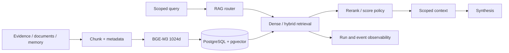

# FinSight RAG 架构

更新时间：2026-07-12

## 1. 当前生产基线

- 存储：PostgreSQL 16 + pgvector。
- 向量：BGE-M3，1024 维。
- 分层：memory、working set、knowledge base。
- 入口：`backend/rag/`；执行层接入位于 `backend/graph/execution/`。
- 观测：RAG Inspector 与后端 diagnostics API；生产访问受认证约束。
- 降级：允许配置内存回退，但生产事实存储仍是 PostgreSQL。

```mermaid
flowchart LR
    SRC[Evidence / documents / memory] --> CHUNK[Chunk + metadata]
    CHUNK --> EMB[BGE-M3 1024d]
    EMB --> PG[(PostgreSQL + pgvector)]
    QUERY[Scoped query] --> ROUTE[RAG router]
    ROUTE --> RETRIEVE[Dense / hybrid retrieval]
    PG --> RETRIEVE
    RETRIEVE --> RERANK[Rerank / score policy]
    RERANK --> CONTEXT[Scoped context]
    CONTEXT --> SYNTH[Synthesis]
    RETRIEVE --> OBS[Run and event observability]
```

## 2. 三层语义

| 层 | 目的 | 生命周期 |
|---|---|---|
| memory | 用户与会话可复用记忆 | 受 user/thread scope 和保留策略约束 |
| working set | 当前研究运行产生的证据上下文 | 短期、与 run/thread 强绑定 |
| knowledge base | 可重复检索的文档与知识 | 长期、带来源和版本元数据 |

任何检索都必须携带适当的 user/thread/run 过滤条件，避免跨用户或跨会话引用。

## 3. 摄取合同

摄取至少保存：chunk id、文本、source URI/title、文档/证据类型、时间、user/thread/run scope、内容 hash、embedding model/version。重复内容通过稳定标识或 hash 去重。

工具失败、空结果和 diagnostics 不进入知识 chunk。只有通过 execution evidence gate 的内容才可进入 working set。

## 4. 检索与合成边界

- RAG 返回候选上下文和分数，不直接宣称投资结论。
- rerank/score 不得覆盖来源元数据。
- synthesis 引用 RAG 内容时仍需遵守 citation policy。
- 找不到足够证据时返回“不足/不可用”，不使用 hash embedding 或模型常识伪装真实检索。

## 5. 运维与评估

生产 Compose 使用 `RAG_V2_BACKEND=postgres` 和 PostgreSQL DSN。模型缓存由 Docker volume 持久化。评估方法、数据集和门禁见 [`rag-evaluation-guide.md`](rag-evaluation-guide.md)。

最小验证包括：

- 摄取、去重、scope 隔离；
- 1024 维向量与数据库 schema 一致；
- 检索相关性、引用覆盖和空结果降级；
- RAG Inspector 不泄露其他用户或敏感元数据；
- PostgreSQL 不可用时的明确失败/受控回退。
