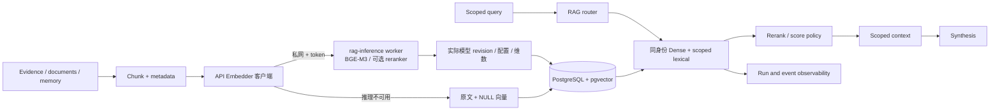

# FinSight RAG 架构

更新时间：2026-10-08

## 1. 当前生产基线

- 存储：PostgreSQL 16 + pgvector。
- 语义向量：私网 worker 执行 BGE-M3，1024 维；身份包含实际模型 revision、编码配置和维数。
- 分层：memory、working set、knowledge base。
- 入口：`backend/rag/`；执行层接入位于 `backend/graph/execution/`。
- 观测：PostgreSQL 观测表、结构化日志和指标；排障通过受保护的运维/评估命令完成，不提供用户侧 Inspector 或 diagnostics API。
- 推理：`backend/rag/worker.py`，与 API 进程隔离；可选 reranker 默认关闭。
- 降级：生产保留 PostgreSQL 词法检索，语义不可用时新文档向量为 NULL，不使用同维 hash 冒充 BGE，也不改用内存作为生产事实源。

```mermaid
flowchart LR
    SRC[Evidence / documents / memory] --> CHUNK[Chunk + metadata]
    CHUNK --> CLIENT[API Embedder 客户端]
    CLIENT -->|私网 + token| EMB[rag-inference worker\nBGE-M3 / 可选 reranker]
    EMB --> ID[实际模型 revision / 配置 / 维数]
    ID --> PG[(PostgreSQL + pgvector)]
    CLIENT -->|推理不可用| LEX[原文 + NULL 向量]
    LEX --> PG
    QUERY[Scoped query] --> ROUTE[RAG router]
    ROUTE --> RETRIEVE[同身份 Dense + scoped lexical]
    PG --> RETRIEVE
    RETRIEVE --> RERANK[Rerank / score policy]
    RERANK --> CONTEXT[Scoped context]
    CONTEXT --> SYNTH[Synthesis]
    RETRIEVE --> OBS[Run and event observability]
```

## 2. 三层语义

| 层 | 目的 | 生命周期 |
|---|---|---|
| memory | 当前线程的可信轻上下文，不存大原文 | 与 user/thread 绑定，不跨线程猜测用户画像 |
| working set | 当前研究运行产生的证据上下文 | 短期、与 run/thread 强绑定 |
| knowledge base | 可重复检索的文档与知识 | 长期、带来源和版本元数据 |

任何检索都必须携带适当的 user/thread/run 过滤条件，避免跨用户或跨会话引用。

## 3. 摄取合同

摄取至少保存：chunk id、文本、source URI/title、文档/证据类型、时间、user/thread/run scope、内容 hash、embedding model/version。重复内容通过稳定标识或 hash 去重。

工具失败、空结果和 diagnostics 不进入知识 chunk。只有通过 execution evidence gate 的内容才可进入 working set。

`EmbeddingResult` 返回实际 `model_name/model_version/dim`，`embedding_identity()` 组合为字符串写入 `metadata.embedding_identity`。worker 的 BGE version 来自已加载模型的 commit hash，并包含最大长度、数值精度和编码契约版本；取不到 revision 时拒绝声明语义可用。

`20261003_0006` 允许 `rag_documents_v2.embedding` 为 NULL。推理失败时保留文本、来源和 scope，供词法检索；更新已有 chunk 时不因无向量回退抹掉原有向量及其身份。既有身份未知的向量保留原数据，不批量猜测或回填 BGE 身份。

文档元数据的 `index_state` 区分 `lexical_only` 与带实际模型身份的索引。`HybridRAGService.index_status(identity)` 统计未过期文档及匹配该身份的向量；文档保存成功不等于语义索引就绪。

模型恢复后执行 `python scripts/reindex_rag_documents.py --batch-size 4 --max-batches 100`，可用 `--collection` 限定集合。每批只处理 NULL 或身份不匹配的向量，推理在事务外；写回同时核对 collection/source_id/原文，避免覆盖并发重新摄取的内容。批次独立提交，中断后可重跑；不会重新抓取外部网页或猜测旧向量身份。

## 4. 检索与合成边界

- RAG 返回候选上下文和分数，不直接宣称投资结论。
- rerank/score 不得覆盖来源元数据。
- synthesis 引用 RAG 内容时仍需遵守 citation policy。
- 找不到足够证据时返回“不足/不可用”，不使用 hash embedding 或模型常识伪装真实检索。
- Dense 查询要求文档向量非空且 `metadata.embedding_identity` 与本次真实查询向量完全一致；维数相等只是必要条件。hash、不同模型 revision 或不同编码配置都不能混比。
- 没有可用查询向量或身份匹配向量时，继续按相同 owner/thread/collection 过滤做 PostgreSQL 词法检索。未知身份旧文档可以被词法召回，但不能冒充语义命中。
- 开发/CI 可显式选择 hash 模型并使用其独立身份；这类测试不构成生产 BGE 语义质量验收。

## 5. 运维与评估

生产 Compose 使用 `RAG_V2_BACKEND=postgres`、PostgreSQL DSN、`RAG_WORKER_URL=http://rag-inference:8010` 与服务端 `RAG_WORKER_TOKEN`。worker 不映射宿主端口，不加载业务 API、数据库或供应商凭据；`/encode`、`/rerank` 使用 token 校验，`/health` 只返回无秘密的推理状态。API 客户端访问私网 worker 时不继承外部代理。

worker 共享 `model_cache` 持久卷，默认 `RAG_RERANKER=none`；开启 reranker 后只有实际推理成功才标记为可用，不能用模块可导入代替验证。默认容器限制为 `3000m` 内存、`3600m` 内存加 swap、1 CPU、128 PID；内存加 swap 上限不是额外 3600m swap。worker 启动健康保护为 180 秒，失败自动重启最多 3 次。

首次加载 BGE 前，worker 读取 `/proc/meminfo` 的 `MemAvailable`，并与 cgroup v2 的 `memory.max-memory.current` 取较小值。默认 `RAG_WORKER_MIN_AVAILABLE_MB=2400`；可用内存不足时返回 `status=resource_limited`、`inference_verified=false`，编码请求返回 503 `embedding_memory_unavailable`，不尝试加载模型。API 保持明确词法降级；提高容器上限并不能创造宿主可用内存，也不能在 API 或额外验收进程里绕过保护重复加载模型。

健康成功状态缓存约 15 秒后重查，失败/降级默认缓存 45 秒，可由 `RAG_PROBE_FAILURE_TTL_SECONDS` 调整。生产 `/readyz` 的数据库检查必须正常；当 RAG `status=degraded` 且 `lexical_ready=true` 时允许服务就绪，同时公开 `semantic_ready=false` 和 `semantic_retrieval_unavailable_using_lexical`。`ready=true` 不能被报告成真实语义推理已通过。

`/api/capabilities` 将服务就绪与检索能力分开。`full_ready=true` 必须同时满足实际 BGE 编码验证、实际 reranker 推理成功、全部未过期文档匹配当前索引身份。worker warmup 在资源允许时验证编码及重排；reranker 首次加载同样检查宿主与容器剩余内存，不足明确为 `resource_limited`。

当前主机约3.3 GiB内存，安全清理后仍不足以加载完整组合；清理磁盘不能补足内存。独立8 GiB推理节点是资源验证起点，共机运行其它应用建议16 GiB，实际峰值与延迟仍需验收。资源未满足时保持词法模式，不能将配置开关或 fixture 通过称为完整 RAG 已恢复。

评估方法、数据集和门禁见 [`rag-evaluation-guide.md`](rag-evaluation-guide.md)。真实 worker 推理、目标机资源占用和线上语义能力必须由本次发布记录补充，配置或 fixture 通过不能代替这些证据。

最小验证包括：

- 摄取、去重、scope 隔离；
- 1024 维与 schema 一致，且同维不同模型/版本不能互相召回；
- 检索相关性、引用覆盖和空结果降级；
- 运维查询、日志和评估产物不泄露其他用户或敏感元数据；
- worker 中断时 NULL 向量摄取、词法检索及健康降级；PostgreSQL 不可用仍阻断生产就绪；
- 不改写旧向量身份、不以 hash 验收冒充生产语义检索通过。
