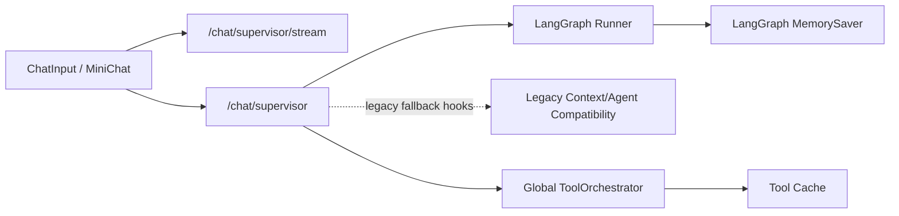
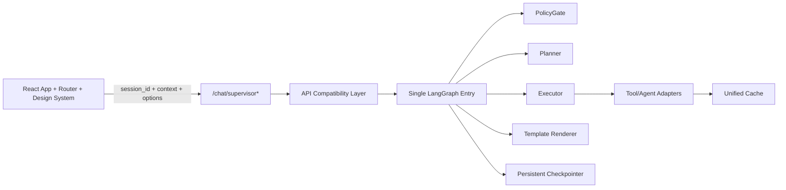
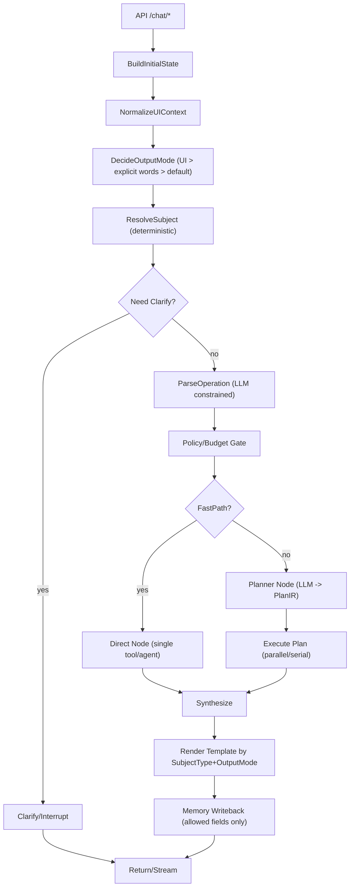
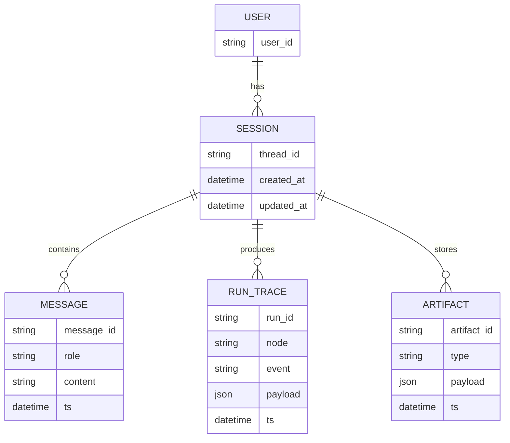

# FinSight LangGraph/LangChain 重构总设计（开发 / 测试 / 验收指南）

> **状态**：Living Doc（持续更新）  
> **最后更新**：2026-02-06  
> **目标读者**：后端 / 前端 / 测试 / 产品（都能按本文件拆任务与验收）  
> **单一事实来源（SSOT）**：本文件是 LangGraph 重构的唯一方向文件；与其它历史文档冲突时，以本文件为准，并在本文件的“决策记录”里补充说明。

---

## 0. 更新规则（务必遵守）

### 0.1 本文档如何“驱动开发”

- 任何与 LangGraph 重构相关的实现、测试、接口、UI 变更，必须先在本文档的 **TODOLIST** 中有条目（或先补条目再写代码）。
- 每完成一个 **小节**（一个可独立合并的任务单元），必须在 TODOLIST 里：
  - 将对应任务从 `TODO` → `DOING` → `DONE`（用勾选 + 日期 + PR/commit 备注）
  - 补充验收证据（测试用例/截图/日志关键字/trace 事件）
- 每新增一个决策（例如：字段命名、按钮位置、模板章节、预算策略），必须写入 **10. 决策记录**。

### 0.2 变更约束（防止再次屎山化）

- 禁止新增“意图大枚举 + if-else 链”来路由主流程；路由必须通过 **显式 State + 表驱动映射 + 子图**。
- 禁止把 selection “拼进 query”作为核心逻辑（可用于模型提示，但不能作为唯一信号）。
- 输出“研报/报告”必须是 **显式 OutputMode**（来自 UI 或明确词），而不是“分析”的同义词。

### 0.3 2026-02-06 现实诊断（Hard Truth）

> 下面是当前代码的客观问题，不做粉饰。以代码实况为准，不以历史“已完成”勾选为准。

1. **架构双轨并存**：核心入口已是 LangGraph，但 API 层仍有 legacy 依赖残留（历史上通过 `agent.context.resolve_reference`、`agent.orchestrator` 间接耦合）。
2. **会话 ID 断链**：前端流式请求曾未稳定透传 `session_id`，后端默认 `"new_session"` 会导致跨用户/跨窗口串会话风险。
3. **会话内引用消解不稳定**：指代词解析依赖旧上下文实现，且缺乏会话级隔离，容易出现跨请求污染。
4. **前端信息结构不清晰**：主 Chat 与 MiniChat 虽共享消息，但会话状态、上下文引用、输出模式的边界不够明确，导致体验“看似统一，实际分裂”。
5. **文档与真实状态漂移**：历史章节有大量“已完成”条目，但不能直接代表当前运行时一致性和可维护性。

### 0.4 当前与目标架构图（必须对齐）

#### 0.4.1 当前（2026-02-06）



#### 0.4.2 目标（生产态）



### 0.5 2026-02-06 起执行的重构原则（强制）

1. API 层不再初始化 `ConversationAgent` 作为运行时主对象；仅保留兼容测试钩子，不参与主链路。
2. `session_id` 必须从前端稳定透传；缺失时后端生成 UUID，严禁固定默认串号。
3. 引用消解必须按 `session_id` 隔离，禁止全局上下文污染。
4. 文档的“完成”仅以测试证据为准：后端 `pytest` + 前端 `build` + 必要的 e2e。
5. 新增重构任务统一登记在 **11.7 Hard Reset**，并同步写入 Worklog。

---

## 1. 核心目标与非目标

### 1.1 目标（必须达成）

1. **单入口编排**：后端以 LangGraph 为唯一主编排入口（保留现有 API 兼容层，但最终都进入同一张图）。
2. **三轴任务模型**：用 `subject_type + operation + output_mode` 取代“10+ Intent”。
3. **Planner-Executor**：由 LLM 产出结构化计划（PlanIR），执行器按计划并行/串行运行工具与子 agent。
4. **按 subject_type 模板渲染**：新闻/财报/公司/组合 各自不同模板；研报是 output_mode，不再强套固定 8 章。
5. **MiniChat 与主 Chat 共享记忆**：共享同一个 `thread_id(session_id)` 的对话记忆，但 UI selection 仅为本次请求的 ephemral context（不写入持久记忆）。
6. **可观测可调试**：每个关键决策点都要在 trace 中可见（routing reason、plan、selected tools/agents、budget、fallback）。

### 1.2 非目标（本期不做 / 以后再做）

- 不在本期引入复杂多智能体“自对话”研究范式（AutoGen 群聊式），以可控与可验收为先。
- 不在本期彻底推翻现有工具层/缓存层；允许适配复用，但必须受新 State/Plan 约束。

### 1.3 验收标准（总体验收）

- **场景 1：选中新闻 + 输入“分析影响”**：不会因为“分析”二字强制走 `investment_report`；Planner 默认只拉取必要信息，且执行器不默认全家桶。
- **场景 2：点击“生成研报”按钮**：同一条输入会生成 `output_mode=investment_report` 的结构化输出，并且会触发 Planner 生成更完整的信息计划（可包含多 agent）。
- **场景 3：选中财报/文档 + 输入“分析要点”**：走 `subject_type=filing/doc` 的模板，不会被误判为“生成投资研报”。
- **场景 4：无 selection，仅输入“分析苹果”**：合理要求澄清（要快评还是研报）或默认 brief（由本文件规则定义），且行为一致可测。

---

## 2. 术语与数据模型（统一语言）

### 2.1 三轴任务模型（替代“意图爆炸”）

| 维度 | 字段 | 说明 | 来源优先级 |
|---|---|---|---|
| Subject（对象） | `subject_type` | 用户正在处理的“对象类型” | selection > query(显式 ticker/公司名) > active_symbol |
| Operation（操作） | `operation` | 用户要对对象做什么 | LLM parse（有约束）> 规则兜底 |
| Output（交付） | `output_mode` | 输出形式/深度（而非意图） | UI 显式 > 明确词 > 默认 |

> **重要**：`investment_report` 不是“分析”的同义词；它是一个显式交付物模式。

### 2.2 SubjectType 规范（建议命名）

> 说明：为了避免与你当前 selection 的 `type="report"`（输入文档）冲突，建议将 selection 的类型改为更准确的“输入对象类型”。

| SubjectType | 含义 | 典型入口 |
|---|---|---|
| `news_item` | 单条新闻 | selection.type=`news` |
| `news_set` | 多条新闻集合 | selection 多选 |
| `company` | 公司/股票标的 | active_symbol / ticker |
| `filing` | 财报/公告（结构化或 PDF） | selection.type=`filing`（改造后） |
| `research_doc` | 研报/文章/PDF | selection.type=`doc`（改造后） |
| `portfolio` | 自选/组合 | UI 组合页 / watchlist |
| `unknown` | 未明确对象 | 需要 clarify |

### 2.3 Operation 规范（稳定小集合）

| Operation | 说明 | 示例 |
|---|---|---|
| `fetch` | 获取/列出 | “今天有什么新闻” |
| `summarize` | 总结 | “总结这条新闻” |
| `analyze_impact` | 分析影响 | “分析对股价影响” |
| `price` | 价格/行情 | “NVDA 最新股价是多少” |
| `technical` | 技术面分析 | “NVDA 技术面分析 / RSI/MACD” |
| `qa` | 问答 | “这条新闻关键点是什么？” |
| `extract_metrics` | 抽取指标 | “从财报抽取营收/利润” |
| `compare` | 对比 | “AAPL vs MSFT 哪个更好” |
| `generate_report` | 生成研报（仅当 output_mode=investment_report） | “生成投资报告/研报” |

> Operation 允许扩展，但必须通过表驱动映射到子图，不允许把扩展变成主路由的 if-else。

### 2.4 OutputMode（由 UI 或明确词触发）

| OutputMode | 说明 | UI |
|---|---|---|
| `chat` | 普通对话（短） | 默认发送 |
| `brief` | 结构化短输出（推荐默认） | 默认发送 |
| `investment_report` | 研报交付物（长、可多 agent） | **按钮：生成研报** |

---

## 3. 目标架构概览（LangGraph 单图 + 子图）

### 3.1 顶层编排图（Mermaid）



### 3.2 分层职责（Clean Architecture 视角）

| 层 | 模块责任 | 示例 |
|---|---|---|
| Domain | 任务/计划/证据/模板的核心数据结构 | `TaskSpec`, `PlanIR`, `EvidenceItem` |
| Use Case | Graph Nodes（路由、规划、执行、合成） | `ResolveSubjectNode`, `PlannerNode` |
| Adapters | 现有 agents/tools 的适配器 | `PriceAgentAdapter`, `NewsToolAdapter` |
| Frameworks | FastAPI、LangGraph runtime、SSE | `/chat/stream`, checkpointer |

### 3.3 验收标准（架构层）

- 所有请求最终进入 **同一张 LangGraph**（或同一入口函数），而不是分散在多个 Router/Supervisor 链路。
- selection 的处理在 `ResolveSubject` 完成，不允许在后续节点通过字符串 contains 打补丁。

---

## 4. State 与契约（后端/前端必须一致）

### 4.1 ChatRequest 扩展（建议）

> 说明：不破坏兼容性，新增可选字段即可；老客户端不传也能跑默认行为。

```python
# 伪代码（以 Pydantic v2 为例）
class ChatOptions(BaseModel):
    output_mode: Literal["chat", "brief", "investment_report"] | None = None
    strict_selection: bool | None = None  # 默认 False（用户要求自由一些）
    locale: str | None = None             # e.g. "zh-CN"

class ChatContext(BaseModel):
    active_symbol: str | None = None
    view: str | None = None
    selections: list[SelectionContext] | None = None

class ChatRequest(BaseModel):
    query: str
    session_id: str | None = None
    context: ChatContext | None = None
    options: ChatOptions | None = None
```

### 4.2 LangGraph State（TypedDict 推荐字段）

```python
from typing import TypedDict, Literal, NotRequired

SubjectType = Literal["news_item","news_set","company","filing","research_doc","portfolio","unknown"]
OutputMode = Literal["chat","brief","investment_report"]

class Subject(TypedDict):
    subject_type: SubjectType
    tickers: list[str]
    selection_ids: list[str]
    selection_types: list[str]        # 原始 selection.type（news/filing/doc）
    selection_payload: list[dict]     # 标题/链接/摘要（仅本次）

class Operation(TypedDict):
    name: str
    confidence: float
    params: dict

class GraphState(TypedDict):
    thread_id: str
    messages: list[dict]              # LangChain messages
    query: str

    ui_context: NotRequired[dict]     # view/active_symbol/selections（ephemeral）
    subject: NotRequired[Subject]
    operation: NotRequired[Operation]
    output_mode: NotRequired[OutputMode]
    strict_selection: NotRequired[bool]

    policy: NotRequired[dict]         # PolicyGate 输出（budget/allowlist/schema）
    plan_ir: NotRequired[dict]        # Planner 输出（结构化）
    artifacts: NotRequired[dict]      # 执行结果池（news, filings, prices, evidence...）
    trace: NotRequired[dict]          # 路由/计划/执行轨迹
```

### 4.3 验收标准（契约层）

- selection 必须以结构化字段进入 state（不是拼进 query 才能识别）。
- `output_mode` 可由 UI 显式传入，且优先级最高。
- `strict_selection` 默认 false（自由），但必须保留参数位以便未来可切换策略。

---

## 5. Node/子图设计（表驱动，不写 if-else 链）

### 5.1 顶层 Nodes 清单（必须实现的最小集合）

| Node | 输入（依赖字段） | 输出（写入字段） | 失败/兜底 |
|---|---|---|---|
| `BuildInitialState` | request | `thread_id,messages,query,ui_context` | 无 |
| `NormalizeUIContext` | `ui_context` | 规范化 selections 去重 | 无 |
| `ResolveSubject` | `ui_context,query` | `subject`（deterministic） | `subject_type=unknown` |
| `Clarify` | `subject,query` | interrupt / clarify question | 统一澄清出口 |
| `ParseOperation` | `query,subject` | `operation` | 规则兜底 |
| `DecideOutputMode` | `options,query` | `output_mode` | 默认 `brief` |
| `PolicyGate` | `output_mode,subject` | `policy/budget` | 降级 fastpath |
| `Planner` | `subject,operation,output_mode` | `plan_ir` | fallback 单 agent |
| `ExecutePlan` | `plan_ir` | `artifacts` | 部分失败继续 |
| `Synthesize` | `artifacts` | `draft_answer` | 简化合成 |
| `Render` | `subject_type,output_mode` | 最终 markdown | 模板缺失降级 |
| `MemoryWriteback` | `messages,selected_memory` | 持久化 | 只写允许字段 |

### 5.2 Subject 子图映射（表驱动）

> 规则：顶层只负责把请求路由到 `SubjectSubgraph[subject_type]`，每个子图内部用 operation 分支。

```python
SUBJECT_SUBGRAPHS = {
  "news_item": NewsSubgraph,
  "news_set": NewsSubgraph,
  "company": CompanySubgraph,
  "filing": FilingSubgraph,
  "research_doc": DocSubgraph,
  "portfolio": PortfolioSubgraph,
}
```

### 5.3 验收标准（编排层）

- 新增一个 subject_type 或 operation，不需要修改 3 个 router；只需新增子图/节点并更新映射表。
- 顶层路由逻辑不出现“根据关键词决定跑全家桶”的默认行为。

---

## 6. Planner-Executor（LLM 产计划）设计

### 6.1 PlanIR（结构化计划）Schema（建议最小字段）

```json
{
  "goal": "string",
  "subject": { "subject_type": "company|news_item|filing|...", "tickers": ["AAPL"], "selection_ids": ["..."] },
  "output_mode": "chat|brief|investment_report",
  "steps": [
    {
      "id": "s1",
      "kind": "tool|agent|llm",
      "name": "get_company_news|price_agent|news_agent|...",
      "inputs": { "ticker": "AAPL", "selection_ids": ["..."] },
      "parallel_group": "g1",
      "why": "一句话原因",
      "optional": true
    }
  ],
  "synthesis": {
    "style": "concise|structured",
    "sections": ["...可选..."]
  },
  "budget": { "max_rounds": 6, "max_tools": 8 }
}
```

### 6.2 Planner 约束（防止“无限发散”）

- Planner 只能从白名单里选 `tools/agents`（由 PolicyGate 提供）。
- 默认 `output_mode=brief` 时：`budget.max_rounds` 更小、禁止“研报专用章节补全”步骤。
- 有 selection 时（你要求自由）：**不强制只围绕 selection**，但 Planner 必须：
  - 把 selection 作为高权重 evidence（至少先读/先总结）
  - 不得忽略 selection 去跑无关全市场（PolicyGate 可以限制）

### 6.3 Executor 规则（并行/失败容忍）

- 同一 `parallel_group` 的步骤并行执行；不同 group 串行。
- 任何 `optional=true` 失败不终止；会写入 `artifacts.errors[]` 并在最终输出提示“可选信息缺失”。
- 对同一工具调用做缓存/去重（key=tool+inputs hash）。

### 6.4 验收标准（Planner/Executor）

- Planner 输出必须可被 Schema 校验（结构化 JSON），失败时自动 fallback（见 8.3）。
- “分析新闻影响”默认计划中不出现 `fundamental+technical+macro+price` 全部齐活，除非 query 或 output_mode 明确要求。

---

## 7. 模板系统（按 SubjectType + OutputMode）

### 7.1 模板选择规则

| subject_type | output_mode=brief | output_mode=investment_report |
|---|---|---|
| `news_item/news_set` | 新闻解读 Brief 模板 | 新闻事件研报模板（不是公司 8 章） |
| `company` | 公司快评 Brief 模板 | 投资研报模板（可扩展章节） |
| `filing/research_doc` | 文档解读 Brief 模板 | 文档研读报告模板（侧重财务/要点） |
| `portfolio` | 组合摘要 Brief 模板 | 组合深度报告模板 |

> 关键：**不要用一个固定 8 章模板覆盖所有 subject**。

### 7.2 示例：`news_item` Brief 模板（结构）

```md
### 新闻摘要

### 影响分析
- 短期：
- 中期：

### 关键变量与后续关注

### 风险与不确定性
```

### 7.3 示例：`company` 投资研报模板（结构，可配置章节）

```md
## 投资摘要
## 公司与业务
## 关键催化剂（含新闻/事件）
## 财务与估值（如有）
## 风险
## 结论（非投资建议声明）
```

### 7.4 验收标准（模板层）

- 选中新闻 + `brief` 输出不出现“公司研报八章空白”问题。
- 点击“生成研报”时，模板与 subject_type 匹配（新闻研报 ≠ 公司研报）。

---

## 8. 前端设计（MiniChat 共享上下文 + 研报按钮）

### 8.1 共享上下文原则

- **共享**：同一个 `session_id/thread_id` → 共享 messages/memory。
- **不共享写回**：`active_symbol/selections/view` 只作为本次请求 `context`，不写入长期 memory（避免污染）。

### 8.2 “生成研报”按钮（放置位置与交互）

#### 推荐位置

- 放在 **输入框右侧的发送区**：与 `Send` 并列（主 Chat 与 MiniChat 同样位置），避免用户找不到。
- 当满足以下任一条件时可用：
  - 有 `active_symbol`
  - 或 selections 非空
- 否则置灰并提示：“请选择标的或引用内容后生成研报”。

#### 交互定义

- 按钮点击：使用同一输入框内容发起请求，但在 payload 中强制：`options.output_mode="investment_report"`。
- 发送按钮仍走默认：`output_mode` 不传（后端默认 `brief`）。

### 8.3 前端请求示例（SSE）

```json
{
  "query": "分析影响",
  "session_id": "u123",
  "context": {
    "view": "dashboard",
    "active_symbol": "AAPL",
    "selections": [
      {"type":"news","id":"n1","title":"...","url":"...","snippet":"..."}
    ]
  },
  "options": {
    "output_mode": "investment_report",
    "strict_selection": false
  }
}
```

### 8.4 验收标准（前端层）

- 主 Chat 与 MiniChat：相同 session_id 下，历史对话一致；但 UI selection 不会变成永久偏好或长期记忆。
- “生成研报”按钮仅改变 output_mode，不改变用户输入文本，不注入“分析/研报”等关键词作弊。

---

## 9. 测试与验收（可执行测试路径）

### 9.1 测试矩阵（必须覆盖）

| Case ID | 输入 | UI Context | 期望 subject_type | 期望 output_mode | 关键断言 |
|---|---|---|---|---|---|
| T-N1 | “分析影响” | selection=news(1) | `news_item` | `brief` | 不触发 investment_report；计划不默认全家桶 |
| T-N2 | “分析影响”+点研报按钮 | selection=news(1) | `news_item` | `investment_report` | 模板为新闻研报；Planner 才允许扩展信息 |
| T-C1 | “分析苹果” | active_symbol=AAPL | `company` | `brief` | 若无强词，不走研报 |
| T-C2 | “生成投资报告” | active_symbol=AAPL | `company` | `investment_report` | 生成公司研报结构 |
| T-F1 | “总结要点” | selection=filing(1) | `filing` | `brief` | 文档解读模板 |
| T-P1 | “对比AAPL和MSFT” | none | `company`/`portfolio` | `brief` | operation=compare；计划包含对比必需信息 |
| T-T1 | “NVDA 最新股价和技术面分析” | active_symbol=GOOGL | `company` | `brief` | subject 应为 NVDA；operation=technical；计划包含 price+technical |

### 9.2 单测建议（后端）

- `test_resolve_subject_selection_priority.py`
- `test_output_mode_ui_override.py`
- `test_planner_planir_schema_validation.py`
- `test_executor_parallel_groups.py`
- `test_news_brief_template_no_empty_chapters.py`

### 9.3 验收标准（测试层）

- 每个 Case 至少 1 条可自动化测试（pytest）。
- 关键 trace 事件可断言（例如：`routing.subject_type`、`planner.plan_created`、`executor.step_started`）。

---

## 10. 决策记录（持续追加）

| 日期 | 决策 | 结论 | 影响范围 |
|---|---|---|---|
| 2026-02-02 | 研报入口 | 使用 **按钮：生成研报**，与发送按钮并列 | FE/BE 接口新增 `options.output_mode` |
| 2026-02-02 | selection 自由度 | `strict_selection=false` 默认自由，但 Planner 必须优先读取 selection | Planner/PolicyGate |
| 2026-02-02 | 编排策略 | 采用 **Planner-Executor**，LLM 产结构化计划 PlanIR | BE LangGraph |
| 2026-02-02 | 模板策略 | 按 `subject_type` 提供不同模板；新闻研报≠公司研报 | Template/Render |
| 2026-02-02 | selection.type 命名 | selection.type 只表示**输入对象类型**：`news | filing | doc`；兼容旧 `report` 并归一为 `doc`（1 个版本周期） | FE/BE selection + ResolveSubject |
| 2026-02-02 | PolicyGate | PolicyGate 负责输出 `budget + allowlist + schema`（tool/agent），Planner 仅能在 allowlist 内产计划 | BE LangGraph（policy_gate / planner） |
| 2026-02-02 | Operation 解析 | Operation 采用“规则优先”可测实现；后续可加 constrained LLM，但必须保留规则兜底 | BE LangGraph（parse_operation） |
| 2026-02-02 | Planner 约束 | 关键约束（selection 先读/先总结、非研报模式不产研报补全步骤）在 PlanIR 层可断言 | BE LangGraph（planner / tests） |
| 2026-02-02 | ExecutePlan 默认模式 | ExecutePlan 默认 dry_run（不跑真实工具，保证可测/可控）；通过 env 切换 live tools | BE LangGraph（executor） |
| 2026-02-02 | 模板落地 | 模板以 `backend/graph/templates/*.md` 维护，Render 按 `subject_type+output_mode` 选择并注入数据 | BE LangGraph（render/templates） |
| 2026-02-02 | Evidence 展示开关 | （已调整，见 2026-02-05）默认隐藏；可通过 `LANGGRAPH_SHOW_EVIDENCE=true` 显示（links-only） | BE LangGraph（render） |
| 2026-02-03 | Subject 优先级（active_symbol vs query） | 若 query 含显式 ticker/公司名，应覆盖可能过期的 active_symbol；避免“问 NVDA 却用 GOOGL” | BE LangGraph（resolve_subject） |
| 2026-02-03 | Trace 可观测性 | `/chat/supervisor/stream` 必须能实时看到节点/执行进度；trace 不应只在结束后回放 | BE SSE + LangGraph trace |
| 2026-02-05 | 研报默认 Agent（LLM Planner） | LLM Planner 在 `output_mode=investment_report` 强制补齐默认 agent steps（含 `macro_agent`），并补齐 agent/tool inputs（query/ticker/selection_ids） | BE LangGraph（planner）+ tests |
| 2026-02-05 | Trace 可读性（Executor/SSE） | executor_step_start 的 `result.inputs` 输出结构化对象（不再是 JSON 字符串）；`agent_start/agent_done` SSE 事件字段与前端对齐并携带 step_id/inputs | BE executor + FE stream |
| 2026-02-05 | 研报证据展示 | 综合研报正文不再包含“证据池概览（链接）”；证据链接只在 Sources/证据池卡片展示；如需在 markdown 中展示，用 `LANGGRAPH_SHOW_EVIDENCE=true` | BE report_builder/render + FE ReportView |
| 2026-02-05 | 字数统计口径 | BE/FE 字数统计忽略 raw URL（避免“链接充字数”）；综合研报仍保证 >=2000 的内容字数兜底 | BE report_builder + FE ReportView |
| 2026-02-06 | API 运行时去旧化 | `backend/api/main.py` 不再初始化 `ConversationAgent`；主链路仅使用 LangGraph + Orchestrator；`agent` 仅保留兼容测试钩子 | BE API 层 |
| 2026-02-06 | 会话 ID 策略 | `/chat/supervisor*` 缺失 session_id 时生成 UUID，禁止固定 `"new_session"` | FE/BE 会话链路 |
| 2026-02-06 | 引用消解隔离策略 | 引用消解迁移为 session-scoped `ContextManager` 映射，按 thread_id 隔离 | BE API 层 |
| 2026-02-06 | 前端会话透传 | `sendMessageStream` 增加 `session_id` 透传；主 Chat 与 MiniChat 共用同一 session state（localStorage 持久化） | FE API/client + store |
| 2026-02-06 | 前端路由收口策略 | 使用 `react-router-dom` 显式路由（`/chat`、`/dashboard/:symbol`），移除 `pushState/popstate` 手工状态机 | FE App 架构 |
| 2026-02-06 | 旧链接兼容策略 | 保留 `/?symbol=XXX` 入口，自动重定向到 `/dashboard/:symbol`（兼容历史书签/分享链接） | FE Router |
| 2026-02-06 | 输出模式显式化 | 主 Chat 与 MiniChat 增加可见的“简报/研报”模式切换，发送行为不再依赖隐式按钮语义 | FE ChatInput/MiniChat |

---

## 11. TODOLIST（极细，开发/测试/验收可拆任务）

> 说明：本列表是后续开发的唯一任务清单。  
> 进度规则：每完成一个小任务单元，必须在此勾选并附“证据”。  
> 标记格式：`- [ ]` TODO；`- [x]` DONE（后附日期/证据）。

### 11.0 文档维护（每次开发都要做）

- [x] 2026-02-02：创建 SSOT 文档骨架（本文件）｜证据：`docs/06_LANGGRAPH_REFACTOR_GUIDE.md`
- [ ] 每次实现前：为变更补充/细化对应 TODOLIST 条目（写清 DoD）
- [ ] 每次实现后：更新条目状态 + 写入验收证据（测试用例/截图/日志）
- [ ] 每次新增字段/接口：同步更新 4.1/4.2 契约小节
- [ ] 每次新增模板：同步更新 7.* 模板小节与示例

### 11.1 Phase 1｜LangGraph 骨架落地（不改变业务输出，只换入口）

#### 11.1.1 目录与基础设施

- [x] 2026-02-02：新建 `backend/graph/` 模块骨架（state、nodes、runner）｜证据：`backend/graph/runner.py`、`backend/graph/state.py`
- [x] 2026-02-02：确认 LangGraph 依赖已锁定且可导入（`langgraph==1.0.4`）｜证据：`backend/tests/test_langgraph_skeleton.py`
- [x] 2026-02-02：Phase 1 使用 `MemorySaver` 作为进程内 checkpointer（后续可替换为 SQLite/持久化）｜证据：`backend/graph/runner.py`

#### 11.1.2 顶层 Graph（先 stub）

- [x] 2026-02-02：`BuildInitialState` Node：把 request → state（thread_id/query/ui_context/messages）｜证据：`backend/graph/nodes/build_initial_state.py`
- [x] 2026-02-02：`NormalizeUIContext` Node：selections 去重（type+id）｜证据：`backend/graph/nodes/normalize_ui_context.py`
- [x] 2026-02-03：`ResolveSubject` Node：deterministic 设置 subject_type（selection > query ticker/company > active_symbol）｜证据：`backend/graph/nodes/resolve_subject.py`、`backend/tests/test_langgraph_skeleton.py::test_resolve_subject_query_ticker_overrides_active_symbol`
- [x] 2026-02-02：`DecideOutputMode` Node：Phase 1 先支持 UI override + 强词触发 + 默认 brief（后续接入 options）｜证据：`backend/graph/nodes/decide_output_mode.py`
- [x] 2026-02-02：`Planner` Node（stub）：输出最小 PlanIR（不调用 LLM）｜证据：`backend/graph/nodes/planner_stub.py`
- [x] 2026-02-02：`ExecutePlan` Node（stub）：执行骨架（不调用工具）｜证据：`backend/graph/nodes/execute_plan_stub.py`
- [x] 2026-02-02：`Render` Node（stub）：输出最小 markdown（后续替换为模板系统）｜证据：`backend/graph/nodes/render_stub.py`
- [x] 2026-02-02：API 兼容层：`/chat/supervisor` 与 `/chat/supervisor/stream` 支持 LangGraph（迁移初期曾用 `LANGGRAPH_ENABLED`；已于 2026-02-03 移除 gating）｜证据：`backend/api/main.py`、`backend/tests/test_langgraph_api_stub.py`

#### 11.1.3 验收（Phase 1）

- [x] 2026-02-02：能跑通 1 条端到端请求（LangGraph stub 模式）并得到稳定输出｜证据：`backend/tests/test_langgraph_api_stub.py`
- [x] 2026-02-02：trace 中能看到关键 node 执行记录（Phase 1 spans，≥6）｜证据：`backend/tests/test_langgraph_skeleton.py`

### 11.2 Phase 2｜契约与 UI（output_mode 按钮 + selection 结构化）

#### 11.2.1 API 契约

- [x] 2026-02-02：在 `backend/api/schemas.py` 新增 `ChatOptions`（output_mode/strict_selection/locale）｜证据：`backend/api/schemas.py`
- [x] 2026-02-02：在 ChatRequest 增加 `options` 字段（兼容旧客户端）｜证据：`backend/api/schemas.py`
- [x] 2026-02-02：后端将 `options.output_mode` 写入 Graph state（UI 优先级最高）｜证据：`backend/api/main.py`、`backend/tests/test_langgraph_api_stub.py`

#### 11.2.2 前端：生成研报按钮

- [x] 2026-02-02：在主 Chat 输入区加入“生成研报”按钮（与 Send 并列）｜证据：`frontend/src/components/ChatInput.tsx`
- [x] 2026-02-02：在 `MiniChat.tsx` 输入区加入同款按钮（与 Send 并列）｜证据：`frontend/src/components/MiniChat.tsx`
- [x] 2026-02-02：点击按钮发送：payload 增加 `options.output_mode="investment_report"`｜证据：`frontend/src/api/client.ts`、`frontend/src/components/ChatInput.tsx`、`frontend/src/components/MiniChat.tsx`
- [x] 2026-02-02：置灰逻辑：无 active_symbol 且无 selections 时不可点击｜证据：`frontend/src/components/ChatInput.tsx`、`frontend/src/components/MiniChat.tsx`
- [x] 2026-02-02：E2E：Playwright 覆盖按钮发送与普通发送的差异｜证据：`npm run test:e2e --prefix frontend`（2 passed）
- [x] 2026-02-02：Smoke：`npm run build --prefix frontend`（TS 编译 + Vite build）

#### 11.2.3 selection 类型命名（避免 report 二义性）

- [x] 2026-02-02：设计并落地 selection.type 新枚举：`news | filing | doc`（替代旧 `report` 输入含义）｜证据：`frontend/src/types/dashboard.ts`、`backend/api/schemas.py`
- [x] 2026-02-02：后端 ResolveSubject 适配新类型（旧类型兼容映射 1 个版本周期）｜证据：`backend/graph/nodes/normalize_ui_context.py`、`backend/graph/nodes/resolve_subject.py`、`backend/tests/test_langgraph_skeleton.py::test_resolve_subject_filing_and_doc_selection_types`
- [x] 2026-02-02：前端 selection 生成处同步修改（dashboard selection 构造逻辑）｜证据：`frontend/src/components/dashboard/NewsFeed.tsx`（news 不变）+ `npm run build --prefix frontend`

#### 11.2.4 验收（Phase 2）

- [x] 2026-02-02：点击“生成研报”一定得到 output_mode=investment_report（trace 可见）｜证据：`backend/tests/test_langgraph_api_stub.py::test_chat_supervisor_output_mode_option_overrides_default` + `npm run test:e2e --prefix frontend`
- [x] 2026-02-02：普通发送默认 output_mode=brief（trace 可见）｜证据：`backend/tests/test_langgraph_api_stub.py::test_chat_supervisor_default_output_mode_is_brief_and_trace_present`

### 11.3 Phase 3｜Planner-Executor 真正落地（替换默认全家桶）

#### 11.3.1 PlanIR Schema 与校验

- [x] 2026-02-02：定义 `PlanIR`（Pydantic）+ JSON schema（可测试）｜证据：`backend/graph/plan_ir.py`、`backend/tests/test_plan_ir_validation.py::test_plan_ir_json_schema_smoke`
- [x] 2026-02-02：Planner 输出必须通过校验，否则 fallback（记录在 trace）｜证据：`backend/graph/nodes/planner_stub.py`、`backend/tests/test_plan_ir_validation.py::test_planner_stub_falls_back_on_invalid_output_mode`
- [x] 2026-02-02：定义工具/agent 白名单与输入 schema（PolicyGate 输出）｜证据：`backend/graph/nodes/policy_gate.py`、`backend/tests/test_policy_gate.py`
- [x] 2026-02-04：PolicyGate 默认（brief/chat）禁用 agent allowlist，仅在 `output_mode=investment_report` 时启用（避免快评场景 Planner 产 agent step 但 Executor 不支持导致执行失败）｜证据：`backend/graph/nodes/policy_gate.py`、`backend/tests/test_policy_gate.py::test_policy_gate_company_compare_brief_disables_agents_by_default`

#### 11.3.2 Planner Prompt（受约束）

- [x] 2026-02-02：实现 `ParseOperation` Node：规则优先写入 `state.operation`（后续可引入 LLM parse，但必须可测）｜证据：`backend/graph/nodes/parse_operation.py`、`backend/tests/test_parse_operation.py`
- [x] 2026-02-02：实现 Planner 提示词：输入 subject/operation/output_mode/budget/available_tools｜证据：`backend/graph/planner_prompt.py`、`backend/tests/test_planner_prompt.py`
- [x] 2026-02-02：约束：selection 存在时必须先读/总结 selection（至少一个 step）｜证据：`backend/graph/nodes/planner_stub.py`、`backend/tests/test_planner_constraints.py::test_planner_includes_selection_summary_step_first_when_selection_present`
- [x] 2026-02-02：约束：output_mode!=investment_report 时禁止“研报章节补全”步骤｜证据：`backend/graph/nodes/planner_stub.py`、`backend/tests/test_planner_constraints.py::test_planner_does_not_add_report_fill_steps_when_not_investment_report_mode`

#### 11.3.2b Planner（真 LLM 产 PlanIR + 兜底）

- [x] 2026-02-03：实现 `planner` Node：`LANGGRAPH_PLANNER_MODE=stub|llm`（默认 stub）｜证据：`backend/graph/nodes/planner.py`
- [x] 2026-02-03：LLM 模式：调用 `create_llm()` + `build_planner_prompt()`，要求 JSON-only PlanIR（含 steps/why）｜证据：`backend/graph/nodes/planner.py`、`backend/graph/planner_prompt.py`
- [x] 2026-02-03：Planner 强制约束：`output_mode/budget/subject` 以 state/policy 为准；steps 在 allowlist 内；selection summary step first｜证据：`backend/graph/nodes/planner.py`（`_enforce_policy`）
- [x] 2026-02-03：LLM 不可用/输出非法：fallback 到 `planner_stub`，并写入 `trace.planner_runtime`｜证据：`backend/graph/nodes/planner.py`、`backend/tests/test_planner_node.py::test_planner_llm_mode_falls_back_when_llm_unavailable`
- [x] 2026-02-03：Graph 接线：`runner.py` 的 `planner` 节点从 `planner_stub` 切换到 `planner`｜证据：`backend/graph/runner.py`、`backend/graph/nodes/__init__.py`
- [x] 2026-02-03：测试：无 API key 时 `LANGGRAPH_PLANNER_MODE=llm` 不应失败且应 fallback（断言 trace）｜证据：`backend/tests/test_planner_node.py`
- [x] 2026-02-05：修复 Planner 注入默认 steps 时 step_id 冲突（重复 id 会覆盖 step_results→多 Agent 卡片内容重复）；investment_report 预算裁剪时优先保留 baseline agents（macro/deep_search），必要时丢弃工具步骤｜证据：`backend/graph/nodes/planner.py`、`backend/tests/test_planner_node.py::test_planner_llm_mode_investment_report_enforces_scored_agent_subset`、`backend/tests/test_planner_node.py::test_planner_investment_report_budget_prioritizes_selected_agents_over_tools`

#### 11.3.3 Executor（并行与缓存）

- [x] 2026-02-02：实现 parallel_group 并行执行（async gather）｜证据：`backend/graph/executor.py`、`backend/tests/test_executor.py::test_execute_plan_parallel_group_runs_concurrently`
- [x] 2026-02-02：实现 step 级缓存/去重（tool+inputs hash）｜证据：`backend/graph/executor.py`、`backend/tests/test_executor.py::test_execute_plan_step_cache_dedupes_calls`
- [x] 2026-02-02：optional step 失败不中断，写入 artifacts.errors｜证据：`backend/graph/executor.py`、`backend/tests/test_executor.py::test_execute_plan_optional_failure_does_not_stop`
- [x] 2026-02-04：Executor 支持 `kind=agent`（`agent_invokers`），避免 agent step 触发“unsupported step kind/name”并中断执行；并补 ExecutePlan live-tools 路径的 agent invokers + agent→evidence_pool 归一｜证据：`backend/graph/executor.py`、`backend/graph/nodes/execute_plan_stub.py`、`backend/tests/test_executor.py::test_execute_plan_supports_agent_steps_in_live_mode`、`backend/tests/test_live_tools_evidence.py::test_execute_plan_stub_merges_agent_output_into_evidence_pool`

#### 11.3.3b Executor（live tools 接入 + 结果归一）

- [x] 2026-02-03：dry_run 下仍执行本地 `llm:summarize_selection`（deterministic），保证 selection 场景输出有内容｜证据：`backend/graph/executor.py`、`backend/tests/test_executor.py::test_execute_plan_runs_llm_summarize_selection_even_in_dry_run`
- [x] 2026-02-03：`LANGGRAPH_EXECUTE_LIVE_TOOLS=true` 时启用真实工具执行（LangChain tools），并将结果写入 artifacts.step_results｜证据：`backend/graph/nodes/execute_plan_stub.py`
- [x] 2026-02-03：将工具输出归一进 `artifacts.evidence_pool`（与 selection 一起形成 evidence 池）｜证据：`backend/graph/nodes/execute_plan_stub.py`（tool→evidence merge）
- [x] 2026-02-03：测试：dry_run selection summary 不再是 skipped；live tools 通过 stub invoker 可被执行（不访问外网）｜证据：`backend/tests/test_executor.py`、`backend/tests/test_live_tools_evidence.py`

#### 11.3.4 验收（Phase 3）

- [x] 2026-02-02：“选中新闻 + 分析影响”默认计划不包含 fundamental+technical+macro+price 全部（除非明确要求）｜证据：`backend/tests/test_phase3_acceptance.py::test_phase3_news_selection_analyze_does_not_default_to_all_tools`
- [x] 2026-02-02：“生成研报”时计划可扩展，但必须在 trace 中解释 why｜证据：`backend/tests/test_phase3_acceptance.py::test_phase3_investment_report_mode_can_expand_with_why`

### 11.4 Phase 4｜按 SubjectType 模板落地（解决空白章节）

#### 11.4.1 模板与渲染器

- [x] 2026-02-02：新增 `templates/`：`news_brief`, `news_report`, `company_brief`, `company_report`, `filing_brief`, `filing_report`｜证据：`backend/graph/templates/`
- [x] 2026-02-02：Render Node：按 `subject_type+output_mode` 选择模板｜证据：`backend/graph/nodes/render_stub.py`、`backend/tests/test_templates_render.py`
- [x] 2026-02-02：模板缺失 fallback：降级 `brief`，并在输出标注“模板缺失已降级”｜证据：`backend/graph/nodes/render_stub.py`（note_prefix）
- [x] 2026-02-04：模板文案去除“（如有）”以减少不确定措辞：`company_*` 的“价格快照/技术面/依据数据/财务估值”标题统一去掉“（如有）”｜证据：`backend/graph/templates/company_brief.md`、`backend/graph/templates/company_compare_brief.md`、`backend/graph/templates/company_report.md`、`backend/graph/templates/company_compare_report.md`、`backend/tests/test_templates_render.py`
- [x] 2026-02-04：brief 模板去噪：`company_brief` / `company_compare_brief` 移除“依据/数据/证据”章节，仅保留用户需要的摘要段落（避免把 tool/search dump 直接展示给用户）｜证据：`backend/graph/templates/company_brief.md`、`backend/graph/templates/company_compare_brief.md`、`backend/tests/test_templates_render.py`
- [x] 2026-02-04：新增 company 新闻模板：`company_news_brief`/`company_news_report`；当 operation=`fetch` 时优先渲染，避免“重大新闻”问题仍走 `company_brief` 导致内容空白｜证据：`backend/graph/templates/company_news_brief.md`、`backend/graph/templates/company_news_report.md`、`backend/graph/nodes/render_stub.py`、`backend/tests/test_templates_render.py::test_render_company_fetch_uses_company_news_template`

#### 11.4.2 证据与引用

- [x] 2026-02-02：artifacts 统一 `evidence_pool` 结构（title/url/snippet/source/published_date/confidence）｜证据：`backend/graph/nodes/execute_plan_stub.py`、`backend/tests/test_evidence_pool.py`
- [x] 2026-02-04：Render 证据展示策略：brief/研报 默认隐藏；仅在需要时用 `LANGGRAPH_SHOW_EVIDENCE=true` 打开（links-only，最多 6 条）；不泄露 raw tool output / 搜索 dump｜证据：`backend/graph/nodes/render_stub.py`（`LANGGRAPH_SHOW_EVIDENCE`） 、`backend/tests/test_templates_render.py::test_render_company_brief_does_not_leak_evidence_pool_by_default`

#### 11.4.3 验收（Phase 4）

- [x] 2026-02-02：新闻 brief 不再出现公司研报八章空白｜证据：`backend/tests/test_templates_render.py::test_render_news_brief_uses_news_template_not_company_report`
- [x] 2026-02-02：新闻 report 使用新闻事件研报模板（非公司模板）｜证据：`backend/tests/test_templates_render.py::test_render_news_report_uses_news_report_template`

#### 11.4.4 Synthesize（填充内容，移除占位符）

- [x] 2026-02-03：新增 `Synthesize` Node：基于 `subject_type+operation+output_mode` + evidence_pool + step_results 生成 `render_vars`（JSON）｜证据：`backend/graph/nodes/synthesize.py`、`backend/graph/runner.py`
- [x] 2026-02-03：`LANGGRAPH_SYNTHESIZE_MODE=stub|llm`（默认 stub）；LLM 模式调用 `create_llm()` 且 JSON-only 输出（可校验）｜证据：`backend/graph/nodes/synthesize.py`
- [x] 2026-02-03：Render 优先使用 `artifacts.render_vars` 注入模板；无 render_vars 时用 deterministic fallback（且无“待实现”）｜证据：`backend/graph/nodes/render_stub.py`
- [x] 2026-02-03：测试：LangGraph `/chat/supervisor` 返回内容不包含“待实现”；selection 场景包含 selection 摘要｜证据：`backend/tests/test_langgraph_api_stub.py`、`backend/tests/test_synthesize_node.py`
- [x] 2026-02-04：修复 compare（AAPL vs MSFT）在 Synthesize LLM 模式下字段缺失：prompt 输出格式补齐 `comparison_conclusion/comparison_metrics`，并在 LLM 输出省略 key 时合并 stub defaults（避免模板回退占位符）｜证据：`backend/graph/nodes/synthesize.py`、`backend/tests/test_synthesize_node.py`
- [x] 2026-02-04：防止 compare 场景数据幻觉与输出噪音：LLM synthesize 合并时将 `comparison_metrics`（以及 `price_snapshot/technical_snapshot`）设为 protected keys；`comparison_conclusion` 允许 LLM 填写但会清洗过滤 tool/search dump 与重复免责声明；stub compare 解析 `get_performance_comparison` 表只输出 YTD/1Y 摘要行｜证据：`backend/graph/nodes/synthesize.py`、`backend/tests/test_synthesize_node.py::test_synthesize_llm_mode_includes_compare_keys_and_preserves_stub_defaults`
- [x] 2026-02-04：compare 绩效对比结论增强：兼容工具表格首列为 label（如 Apple/Microsoft）或 ticker；从 PlanIR step.inputs.tickers 反查 label→ticker，保证快评结论能输出明确 YTD/1Y 对比与“历史回报维度”小结；若工具已执行但 YTD/1Y 不可用，不再提示“开启 live tools”，而是提示数据不可用/不足｜证据：`backend/graph/nodes/synthesize.py`、`backend/tests/test_synthesize_node.py::test_synthesize_stub_compare_parses_label_rows_via_step_input_mapping`
- [x] 2026-02-04：company fetch（“最近有什么重大新闻”）输出增强：stub 从 `get_company_news` 格式化 `news_summary`（links-only），并在 LLM synthesize 中保护 `news_summary` 免被 dump 覆盖；同时对 LLM 输出做类型纠正（list/dict→string）避免 RenderVars 校验失败，并将 llm_call_error 消息降噪为通用提示（详情留在服务端日志/trace）｜证据：`backend/graph/nodes/synthesize.py`、`backend/tests/test_synthesize_node.py::test_synthesize_stub_company_fetch_formats_news_summary`
- [x] 2026-02-04：风险提示格式化：LLM synthesize 若返回 `risks` 为 dict/list（如按 ticker 分桶），统一格式化为 markdown bullet（避免 JSON 直出），并在末尾合并单条免责声明｜证据：`backend/graph/nodes/synthesize.py`、`backend/tests/test_synthesize_node.py::test_synthesize_llm_mode_formats_risks_dict`

#### 11.4.5 ReportIR（卡片研报｜恢复“生成研报”UI）

- [x] 2026-02-04：LangGraph `/chat/supervisor*` 在 `output_mode=investment_report` 时返回 `report`（ReportIR），前端使用 `ReportView` 渲染卡片（含 Agent 概览、综合研究报告、证据池/来源/置信度/新鲜度）｜证据：`backend/graph/report_builder.py`、`backend/api/main.py`、`frontend/src/components/ChatList.tsx`、`frontend/src/components/MiniChat.tsx`、`backend/tests/test_langgraph_api_stub.py`
- [x] 2026-02-04：研报模式默认跑多 Agent：Planner stub 在 `investment_report` 自动加入 `price/news/technical/fundamental/macro/deep_search` agent steps（用于卡片填充），并在 selection 场景携带 query/active_symbol 解析到 tickers，保证 agent 可获得 ticker｜证据：`backend/graph/nodes/planner_stub.py`、`backend/graph/nodes/resolve_subject.py`
- [x] 2026-02-04：研报字数兜底：ReportBuilder 生成 `synthesis_report`，若不足则追加“情景分析/估值拆解/监控清单”等附录，保证综合报告可读且不低于阈值（默认按前端计数≈2000字）｜证据：`backend/graph/report_builder.py`
- [x] 2026-02-04：LLM 限速重试（临时措施）：新增 `ainvoke_with_rate_limit_retry`，在 planner/synthesize 与 Agent LLM 调用处启用；遇到 429/Quota 时按 5min 级等待重试（默认最多 200 次，可通过 env 调整）｜证据：`backend/services/llm_retry.py`、`backend/graph/nodes/planner.py`、`backend/graph/nodes/synthesize.py`、`backend/agents/base_agent.py`、`backend/agents/deep_search_agent.py`
- [x] 2026-02-04：回归用例（示例 query）：`分析苹果公司，生成投资报告`、`对比 AAPL 和 MSFT，生成投资报告`、`分析这条新闻对股价的影响，生成研报`（selection=news）、`研读这个文档，生成研报`（selection=doc）｜证据：`backend/tests/test_langgraph_api_stub.py`
- [x] 2026-02-05：修复“宏观分析未运行”：LLM Planner 在研报模式强制补齐默认 agents（含 `macro_agent`），并为 agent/tool 补齐 inputs（query/ticker/selection_ids）避免 trace 显示空 `{}`｜证据：`backend/graph/nodes/planner.py`、`backend/tests/test_planner_node.py::test_planner_llm_mode_investment_report_enforces_scored_agent_subset`
- [x] 2026-02-05：修复 trace 可读性：`executor_step_start.result.inputs` 输出结构化对象（不再是 JSON 字符串）；`agent_start/agent_done` 事件字段与前端对齐并携带 step_id/inputs｜证据：`backend/graph/executor.py`、`backend/tests/test_langgraph_api_stub.py::test_chat_supervisor_stream_executor_step_inputs_are_structured_json_object`、`frontend/src/api/client.ts`
- [x] 2026-02-05：研报去重 & 证据分离：综合研报正文不再重复“问题”行，也不再输出“证据池概览（链接）”；markdown 渲染默认不输出 evidence 链接（可用 `LANGGRAPH_SHOW_EVIDENCE=true` 开启）｜证据：`backend/graph/report_builder.py`、`backend/graph/nodes/render_stub.py`、`backend/tests/test_report_builder_synthesis_report.py`
- [x] 2026-02-05：字数统计忽略 URL：BE/FE 计数函数均剔除 raw URL（避免“链接充字数”导致研报实际很短），综合研报仍保持 >=2000 字兜底｜证据：`backend/graph/report_builder.py`、`frontend/src/components/ReportView.tsx`、`backend/tests/test_report_builder_synthesis_report.py::test_count_content_chars_ignores_raw_urls`
- [x] 2026-02-05：宏观 Agent 默认不跳过：MacroAgent 不再依赖关键词决定是否运行（FRED→fallback search），保证研报默认输出宏观数据｜证据：`backend/agents/macro_agent.py`、`backend/tests/test_deep_research.py::test_macro_agent`

### 11.5 Phase 5｜删旧链路（收口到单入口，移除补丁点）

- [x] 2026-02-03：移除 `LANGGRAPH_ENABLED` gating：`/chat/supervisor*` 默认走 LangGraph（不再分叉）｜证据：`backend/api/main.py`（无 `LANGGRAPH_ENABLED`）
- [x] 2026-02-03：删除 legacy Supervisor/Router 代码路径（物理删除 main.py legacy 分支，含 selection 拼接 query 的补丁逻辑）｜证据：`backend/api/main.py`（无 `SupervisorAgent/SchemaRouter/ConversationRouter`）
- [x] 2026-02-03：依赖升级到官方最新稳定版（LangChain 1.2.7 + LangGraph 1.0.7 及其配套包）｜证据：`requirements.txt`、`requirements_langchain.txt`
- [x] 2026-02-03：更新回归测试：不再依赖 legacy/env 分叉｜证据：`backend/tests/test_langgraph_api_stub.py`
- [x] 2026-02-03：标记旧 Router/Supervisor 路径为 deprecated（日志提示）｜证据：`backend/orchestration/supervisor_agent.py`、`backend/conversation/router.py`、`backend/conversation/schema_router.py`
- [x] 2026-02-03：删除 selection_override 字符串 contains 补丁（由 ResolveSubject 接管）｜证据：`backend/orchestration/supervisor_agent.py`（无 selection_override）、`backend/graph/nodes/resolve_subject.py`
- [x] 2026-02-03：统一 clarify：只允许在 Clarify Node 发生｜证据：`backend/graph/nodes/clarify.py`、`backend/graph/runner.py`、`backend/tests/test_clarify_node.py`
- [x] 2026-02-03：删除重复调用（避免同一请求被多个 Router 重复路由/重复触发 legacy Router），并更新回归测试｜证据：`backend/graph/nodes/build_initial_state.py`（trace.routing_chain）、`backend/tests/test_phase5_no_double_routing.py`、`backend/tests/test_langgraph_api_stub.py`

#### 11.5.1 验收（Phase 5）

- [x] 2026-02-03：全量回归通过（至少覆盖 9.1 的测试矩阵）｜证据：`pytest -q backend/tests`（279 passed, 1 skipped） + `npm run build --prefix frontend`（成功） + `npm run test:e2e --prefix frontend`（2 passed）
- [x] 2026-02-03：不存在“同一请求被多个 router 重复路由”的 trace 记录｜证据：`backend/graph/nodes/build_initial_state.py`（routing_chain=["langgraph"]）、`backend/tests/test_phase5_no_double_routing.py`、`backend/tests/test_langgraph_api_stub.py`

### 11.6 Docs 同步（避免旧文档干扰开发）

- [x] 2026-02-02：README / readme_cn 增加 SSOT 与 LangGraph 迁移说明（避免误导）｜证据：`README.md`、`readme_cn.md`
- [x] 2026-02-03：README / readme_cn 移除 `LANGGRAPH_ENABLED` 分叉说明，改为 planner/synthesize/live-tools 运行开关｜证据：`README.md`、`readme_cn.md`
- [x] 2026-02-02：docs/01 增加 LangGraph 架构概览 + SSOT 标注（保留 Supervisor 作为历史参考）｜证据：`docs/01_ARCHITECTURE.md`
- [x] 2026-02-02：docs/02/03/04/05/05_RAG 增加 SSOT 标注（冲突时以 06 为准）｜证据：`docs/02_PHASE0_COMPLETION.md`、`docs/03_PHASE1_IMPLEMENTATION.md`、`docs/04_PHASE2_DEEP_RESEARCH.md`、`docs/05_PHASE3_ACTIVE_SERVICE.md`、`docs/05_RAG_ARCHITECTURE.md`

### 11.7 Hard Reset（2026-02-06 起的唯一执行清单）

> 说明：本小节覆盖“仍然混乱”的现实问题，按小结推进。每个小结必须附测试证据后才能勾选 DONE。

#### 11.7.1 小结 A｜会话与入口收口（已完成）

- [x] 2026-02-06：`GraphRunner` 进程级单例，避免每请求重建图｜证据：`backend/graph/runner.py`
- [x] 2026-02-06：`/chat/supervisor*` 缺失 `session_id` 时改为 UUID，不再使用 `"new_session"`｜证据：`backend/api/main.py`
- [x] 2026-02-06：API 层移除 `ConversationAgent` 初始化依赖，改为 LangGraph + Global Orchestrator；`agent` 仅兼容测试钩子｜证据：`backend/api/main.py`
- [x] 2026-02-06：引用消解改为 session-scoped `ContextManager` 映射（按 thread_id 隔离）｜证据：`backend/api/main.py`
- [x] 2026-02-06：前端 `sendMessageStream` 透传 `session_id`；主 Chat 与 MiniChat 共享并持久化 session_id｜证据：`frontend/src/api/client.ts`、`frontend/src/store/useStore.ts`、`frontend/src/components/ChatInput.tsx`、`frontend/src/components/MiniChat.tsx`
- [x] 2026-02-06：回归验证（后端+前端）｜证据：`pytest -q backend/tests/test_langgraph_api_stub.py backend/tests/test_phase5_no_double_routing.py backend/tests/test_health_and_validation.py backend/tests/test_streaming_reference_resolution.py`（16 passed）；`npm run build --prefix frontend`（成功）；`npm run test:e2e --prefix frontend`（2 passed）

#### 11.7.2 小结 B｜前端路由与信息架构重做（已完成）

- [x] 2026-02-06：路由收口：引入明确路由层（`/chat`、`/dashboard/:symbol`），移除 App 内手动 URL 状态机；兼容旧 `/?symbol=XXX` 跳转｜证据：`frontend/src/App.tsx`、`frontend/src/main.tsx`、`frontend/package.json`、`frontend/e2e/report-button.spec.ts`、`npm run build --prefix frontend`（成功）、`npm run test:e2e --prefix frontend`（3 passed）
- [x] 2026-02-06：布局收口：主内容区（Chat/Dashboard）与右侧上下文区（Context Panel）职责分层；`RightPanel` 聚焦上下文，不再承载 trace｜证据：`frontend/src/App.tsx`、`frontend/src/components/RightPanel.tsx`、`frontend/src/pages/Dashboard.tsx`、`frontend/src/components/Sidebar.tsx`、`npm run build --prefix frontend`（成功）
- [x] 2026-02-06：交互收口：输出模式（brief/report）显式可见，不靠隐式按钮状态猜测｜证据：`frontend/src/components/ChatInput.tsx`、`frontend/src/components/MiniChat.tsx`、`npm run build --prefix frontend`（成功）、`npm run test:e2e --prefix frontend`（3 passed）
- [x] 2026-02-06：可视化收口：`AgentLogPanel` 从右侧上下文面板解耦，独立于主答案区下方展示，避免调试信息抢占主阅读区域｜证据：`frontend/src/App.tsx`、`frontend/src/components/AgentLogPanel.tsx`、`frontend/src/components/RightPanel.tsx`、`npm run build --prefix frontend`（成功）
- [x] 2026-02-06：移动端断点重排：`App`/`Dashboard`/`Sidebar` 在 `max-lg` 下重排为纵向布局，保留 MiniChat 可操作性｜证据：`frontend/src/App.tsx`、`frontend/src/pages/Dashboard.tsx`、`frontend/src/components/Sidebar.tsx`、`npm run build --prefix frontend`（成功）
- [x] 2026-02-06：验证：补充 Playwright 用例覆盖路由切换、session 连续性、selection 引用一致性｜证据：`frontend/e2e/report-button.spec.ts`、`npm run test:e2e --prefix frontend`（6 passed）

#### 11.7.3 小结 C｜LangChain/LangGraph 最终生产化（已完成）

- [x] 2026-02-06：依赖统一：`requirements_langchain.txt` 收口为 `-r requirements.txt`，仅保留一套版本声明｜证据：`requirements_langchain.txt`、`requirements.txt`
- [x] 2026-02-06：持久化检查点：引入 SQLite/Postgres 可持久化 checkpointer，并提供 health 可观测元数据与 fallback 语义｜证据：`backend/graph/checkpointer.py`、`backend/tests/test_graph_checkpointer.py`
- [x] 2026-02-06：工具适配统一：新增 adapter 层，节点通过 adapter 调用 tool/agent，禁止直接耦合 legacy 模块｜证据：`backend/graph/adapters/tool_adapter.py`、`backend/graph/adapters/agent_adapter.py`、`backend/graph/nodes/execute_plan_stub.py`
- [x] 2026-02-06：失败策略标准化：统一错误结构（`schema_version/error_type/retryable/retry_attempts`）并落 trace｜证据：`backend/graph/failure.py`、`backend/graph/nodes/planner.py`、`backend/graph/nodes/synthesize.py`、`backend/graph/executor.py`
- [x] 2026-02-06：API 契约冻结：ChatRequest/Response、GraphState、SSE 事件版本化并下发 contracts manifest｜证据：`backend/contracts.py`、`backend/api/schemas.py`、`backend/api/main.py`、`backend/graph/state.py`、`backend/graph/trace.py`
- [x] 2026-02-06：质量门禁：新增 CI（backend pytest + frontend build + e2e smoke）｜证据：`.github/workflows/ci.yml`
- [x] 2026-02-06：稳定性修复：修复 `AsyncSqliteSaver` 在多事件循环/多 TestClient reload 下的 `no active connection`；改为 checkpointer 与 runner 按 event loop 作用域缓存，跨 loop 自动重建｜证据：`backend/graph/checkpointer.py`、`backend/graph/runner.py`、`backend/tests/test_langgraph_api_stub.py`

#### 11.8 小结 D｜生产部署 Runbook + 架构洁癖清扫（已完成）

- [x] 2026-02-06：新增生产部署单文档 Runbook（从现有 README/SSOT/CI 收敛为唯一部署手册）｜证据：`docs/11_PRODUCTION_RUNBOOK.md`
- [x] 2026-02-06：架构洁癖清扫（删除确认无运行时引用的重复/归档模块）｜删除清单：`backend/_archive/legacy_streaming_support.py`、`backend/_archive/smart_dispatcher.py`、`backend/_archive/smart_router.py`、`backend/_archive/tools_legacy.py`、`backend/orchestration/_archive/supervisor.py`、`backend/legacy/README.md`、`backend/legacy/__init__.py`
- [x] 2026-02-06：文档洁癖清扫（过期文档归档 + 现行入口收口）：将历史状态/计划/阶段总结迁移到 `docs/archive/2026-02-doc-cleanup/`，新增 `docs/DOCS_INDEX.md` 标注“当前有效/次级参考/归档”三层结构，避免继续在过期文档上开发
- [x] 2026-02-06：清扫边界固化：`backend/conversation/router.py`、`backend/conversation/schema_router.py`、`backend/orchestration/supervisor_agent.py` 仍被现有回归测试与历史兼容路径引用，暂不物理删除；继续标记 deprecated，生产主链路保持 LangGraph 单入口｜证据：`backend/tests/test_router_*.py`、`backend/tests/test_phase5_no_double_routing.py`
- [x] 2026-02-06：全量回归（发布级）通过后才允许勾选完成｜证据：`pytest -q backend/tests` + `npm run build --prefix frontend` + `npm run test:e2e --prefix frontend`
- [x] 2026-02-06：二次终验复核（用户要求“先保证没有任何毛病”）再次执行发布门禁三件套并保持全绿；同时确认清扫删除项无运行时引用残留｜证据：`pytest -q backend/tests`（300 passed, 8 skipped） + `npm run build --prefix frontend`（成功） + `npm run test:e2e --prefix frontend`（6 passed） + `rg` 引用检查

#### 11.9 小结 E｜Warning 清零收口（已完成）

- [x] 2026-02-06：清理 `PytestReturnNotNoneWarning`：将遗留测试从“返回布尔/对象”改为标准 assert 测试风格；手工 runner 保留但按异常判定通过｜证据：`backend/tests/test_cache.py`、`backend/tests/test_circuit_breaker.py`、`backend/tests/test_orchestrator.py`、`backend/tests/test_structure.py`、`backend/tests/test_validator.py`、`backend/tests/test_kline.py`、`backend/tests/test_conversation_experience.py`
- [x] 2026-02-06：清理 `datetime` 弃用告警：`utcnow/utcfromtimestamp` 改为 timezone-aware 写法（`datetime.now(timezone.utc)` / `datetime.fromtimestamp(..., timezone.utc)`）｜证据：`backend/api/main.py`、`backend/tools/utils.py`
- [x] 2026-02-06：前端分包收口：Vite `manualChunks` 拆分 `vendor-react/vendor-echarts/vendor-markdown/vendor-motion/vendor-icons`，并设置符合当前 ECharts 体量的 `chunkSizeWarningLimit`，消除构建 warning 噪音｜证据：`frontend/vite.config.ts`、`npm run build --prefix frontend`（成功，无 warning）
- [x] 2026-02-06：前端 Baseline 数据告警收口：升级 `baseline-browser-mapping` 到最新 dev 版本，移除构建/Playwright 运行时提示｜证据：`frontend/package.json`、`frontend/package-lock.json`
- [x] 2026-02-06：pytest 警告基线收口：设置 `asyncio_default_fixture_loop_scope=function` 并过滤已知第三方/兼容性 deprecation 噪音，确保 CI 输出聚焦真实失败｜证据：`pytest.ini`
- [x] 2026-02-06：收口验收：后端/前端门禁再次全绿｜证据：`pytest -q backend/tests`（300 passed, 8 skipped，无 warnings） + `npm run build --prefix frontend`（成功） + `npm run test:e2e --prefix frontend`（6 passed）

#### 11.10 小结 F｜架构体检与下一阶段技术决议（新增）

> 目的：回答“现在是否还有不合理、Agent 如何选、RAG 怎么做、文档是否要补充”的统一结论。  
> 范围：只给生产可执行方案，不再做补丁式建议。

##### 11.10.1 当前仍不合理的点（按优先级）

1. `README/readme_cn/docs/01~05` 仍保留大量 legacy Supervisor/Intent 叙事，和当前 LangGraph 单入口实现存在认知冲突。  
2. 前端 `frontend/src/App.tsx` 承担路由、布局、行情轮询、面板尺寸管理、主题切换等多职责，后续改动风险偏高。  
3. `RightPanel` 仍混合“上下文助手 + 组合管理 + 告警 + 图表”多域职责，信息架构偏重，移动端心智负担大。  
4. 研报模式当前仍有“baseline agents 全挂载”的惯性，成本和时延上限高，且容易产生冗余卡片。  
5. RAG 文档（`docs/05_RAG_ARCHITECTURE.md`）与当前生产导向不一致（仍以早期 Chroma 本地方案为中心），缺少分层存储/TTL/混合检索决议。

##### 11.10.2 Agent 编排决议（生产版）

1. 保持 **LangGraph 单入口** 不变；禁止回退到多 Router 并行主链。  
2. 引入 `CapabilityRegistry`（能力注册表）替代“固定 agent 列表”：
   - 维度：`latency_ms_p50`、`cost_tier`、`coverage(subject_type, operation)`、`freshness_sla`。
3. Planner 从“默认全开”改为“评分选路”：
   - 仅在 `investment_report` 且证据不足时逐步升级 agent，不一次性挂全量。
4. Executor 增加硬预算护栏：
   - `max_agent_steps`、`max_total_latency_ms`、`max_tool_calls`，超限自动降级到 brief。
5. 输出策略：
   - 用户可见层默认展示“结论+关键证据”；trace/debug 保持独立面板，不反向污染主阅读区。

##### 11.10.3 RAG 决议（存什么、怎么检索、何时用）

**A. 先定存储分层（必须）**

| 数据类型 | 是否入长期库 | 建议保存内容 | 保留策略 |
|---|---|---|---|
| 10-K/10-Q/20-F、财报正文、电话会纪要 | 是 | 正文分块 + 元数据（ticker/period/section/page） | 长期 |
| 公司公告、Investor Presentation、内部研究文档 | 是 | 正文分块 + 来源与版本 | 长期 |
| 实时新闻全文 | 否（默认） | 仅 `title/summary/url/source/published_at` + embedding | TTL 7~30 天 |
| DeepSearch 临时抓取长文 | 否（默认） | 会话级临时 chunk（ephemeral collection） | 任务结束即清理（可选提升） |

**B. 向量库选型（当前阶段）**

1. **首选：PostgreSQL + pgvector + tsvector（混合检索）**  
   原因：与现有后端部署栈一致，运维成本最低，事务/权限/备份统一。  
2. **扩展预案：Qdrant**（当 chunk 规模和检索并发显著上升时再迁移）。

**C. 检索策略（必须混合）**

1. Dense（向量）+ Sparse（BM25/tsvector）混合检索，融合用 `RRF`。  
2. TopK 召回后加轻量 rerank（cross-encoder 或 LLM rerank）。  
3. Chunk 策略按文档类型切分：
   - 财报：按章节（Item/Note/MD&A）+ 600 tokens + 100 overlap；
   - 电话会：按 speaker turn + 400~600 tokens；
   - 新闻摘要：200~400 tokens，强调时效元数据。

**D. DeepSearch 到底要不要 RAG？**

1. **要**：当单文档很长或需要跨多文档证据对齐时（例如 > 12k tokens 或多来源交叉验证）。  
2. **不要强制**：纯“最新动态”查询优先走实时工具链，不应被长期知识库劫持。  
3. 规则：`latest/news-now` -> live tools first；`history/compare/filing details` -> RAG first。

##### 11.10.4 前后端交互与体验优化建议

1. 拆分 `App.tsx`：`AppShell`（布局）/`ChatWorkspace`/`DashboardWorkspace`/`TopTickerBar`。  
2. `RightPanel` 再拆：`ContextAssistantPanel`、`PortfolioPanel`、`AlertPanel`、`QuickChartPanel`，按路由按需加载。  
3. 聊天输入区新增“分析深度”单选（Quick / Standard / Report），替代隐式模式切换心智。  
4. 主答案区固定三段：`结论`、`关键依据`、`下一步动作`；减少长段落噪音。  
5. 为 `session_id`、`output_mode`、`selection_ids` 建立前后端契约测试（e2e + API contract）。

##### 11.10.5 文档体系是否需要补充（结论：需要）

1. `readme.md` / `readme_cn.md`：只保留当前 LangGraph 架构；legacy 内容移动到单独历史文档。  
2. `docs/01_ARCHITECTURE.md`：重写为“当前生产架构”，不再并列旧 Supervisor 大图。  
3. `docs/02~05`：保留历史价值，但在首屏标记 `Archived`，并指向 `06` 与 `11_PRODUCTION_RUNBOOK.md`。  
4. `docs/Thinking/`：补 3 份 ADR（Agent 选路、RAG 数据边界、检索策略），避免决策散落。  
5. 架构图补充两张：
   - 在线请求编排图（Graph + Policy + Planner + Executor）；
   - 离线索引与在线检索联动图（Ingestion -> Hybrid Retrieval -> Rerank -> Synthesis）。

##### 11.10.6 下一步 Todo（进入 11.11 前必须完成）

- [x] 建立 `CapabilityRegistry` 并改造 Planner 为评分选路（替代研报全挂载惯性）。
- [x] 落地 RAG v2：Postgres `pgvector+tsvector` 混合检索最小闭环（含 TTL 机制）。
- [x] 2026-02-06：完成 `App.tsx` 与 `RightPanel` 二次拆分，明确面板职责边界（`App` 路由化、`WorkspaceShell` 组装化、`RightPanel` 组合层 + tab 子组件）｜证据：`frontend/src/App.tsx`、`frontend/src/components/layout/*`、`frontend/src/components/right-panel/*`、`npm run build --prefix frontend`（成功）、`npm run test:e2e --prefix frontend`（7 passed）
- [x] 2026-02-07：同步文档收口：README/README_CN/01~05/Thinking ADR 全部对齐 SSOT。
- [x] 2026-02-07：增加检索质量评测基线（Recall@K、nDCG、答案引用覆盖率、延迟）并接入 CI 门禁。

#### 11.11 小结 G｜执行层能力升级（进行中）

##### 11.11.2 RAG v2 最小闭环（Postgres/Memory 双后端 + 混合检索 + TTL）

1. 新增 `backend/rag/hybrid_service.py`：  
   - 支持 `memory` / `postgres` 双后端，`RAG_V2_BACKEND=auto` 时优先 Postgres（有 DSN）否则回退 memory。  
   - 实现 Dense + Sparse 混合检索与 `RRF` 融合（`pgvector + tsvector` 在 Postgres 路径，纯 Python 同构逻辑用于 memory 路径）。  
   - 支持 TTL 清理（`expires_at`）与按 `(collection, source_id)` upsert 去重。  

2. 在 `backend/graph/nodes/execute_plan_stub.py` 接入闭环：  
   - 将 `evidence_pool` 归一写入 session 级 collection（`session:{thread_id}`）；  
   - 按 subject/evidence 类型应用 TTL 策略（news 短期、ephemeral 短期、filing/research_doc 可长期）；  
   - 执行混合检索回填 `artifacts.rag_context` 与 `artifacts.rag_stats`，并在 `trace.rag` 暴露运行信息。  

3. 在 `backend/graph/nodes/synthesize.py` 将 `rag_context` 注入 LLM synthesize 输入，确保“先检索后综合”路径可被模型消费。  

4. 新增/补充测试：  
   - `backend/tests/test_rag_v2_service.py`（检索排序、TTL、upsert）；  
   - `backend/tests/test_live_tools_evidence.py` 新增 RAG context 回填断言。  

##### 11.11.3 前端职责二次拆分（App/Workspace/RightPanel 组合层收口）

1. `frontend/src/App.tsx` 仅保留路由职责：  
   - `RootRedirect`（兼容 `/?symbol=XXX`）；  
   - `ChatRoute`/`DashboardRoute`（将 symbol 与导航能力注入 `WorkspaceShell`）。

2. `frontend/src/components/layout/WorkspaceShell.tsx` 承接应用壳层职责：  
   - 侧边栏、模态框、右侧面板宽度与折叠状态；  
   - 行情 hooks（`useMarketQuotes`）与移动端断点（`useIsMobileLayout`）；  
   - Chat/Dashboard 工作区按路由切换，避免 `App.tsx` 继续膨胀。

3. `RightPanel` 改为组合层，业务拆到子组件：  
   - `useRightPanelData`：watchlist/alerts/portfolio 的数据与编辑动作；  
   - `RightPanelHeader`：Tab 与刷新/折叠操作；  
   - `RightPanelAlertsTab`、`RightPanelPortfolioTab`、`RightPanelChartTab`：按职责分离渲染。  
   - 结果：`RightPanel.tsx` 不再内嵌多域业务细节，后续改动可局部测试。

4. e2e 补充：  
   - 新增 “Context panel tabs can switch and panel can collapse/expand”，覆盖 tab 切换与面板折叠/展开契约，防回归。

##### 11.11.4 检索质量评测基线（Recall@K / nDCG / 引用覆盖率 / 延迟）

1. 评测集落地（按桶分层 + 金标准）：  
   - 新增 `tests/retrieval_eval/dataset_v1.json`，按 `news/company/filing/report` 四桶组织；  
   - 每条 case 包含 `gold_answer`、`gold_evidence_ids`、`gold_citation_ids`、`relevance` 与 `corpus`（可追溯证据）。

2. 离线评测脚本（可本地跑、可 CI 复用）：  
   - 新增 `tests/retrieval_eval/run_retrieval_eval.py`；  
   - 指标输出：`Recall@K`、`nDCG@K`、`Citation Coverage`、`Latency(mean/p95)`；  
   - 产物输出：JSON + Markdown 对比报告（含与 baseline 的 delta）。

3. 阈值门禁与基线快照：  
   - 阈值配置：`tests/retrieval_eval/thresholds.json`（v1）  
     - `recall_at_k_min=0.95`  
     - `ndcg_at_k_min=0.95`  
     - `citation_coverage_min=0.95`  
     - `latency_p95_ms_max=10.0`  
   - 基线快照：`tests/retrieval_eval/baseline_results.json`（v1，memory backend）。

4. CI 门禁接入：  
   - `.github/workflows/ci.yml` 新增 `retrieval-eval` job；  
   - 执行 `python tests/retrieval_eval/run_retrieval_eval.py --gate --report-prefix ci`；  
   - 阈值不达标即 fail，并通过 `actions/upload-artifact` 上传报告目录 `tests/retrieval_eval/reports/`。

5. 当前基线结果（2026-02-07，本地 memory backend）：  
   - `Recall@K=1.0000`  
   - `nDCG@K=1.0000`  
   - `Citation Coverage=1.0000`  
   - `Latency P95=0.08ms`  
   - 结果快照（纳入版本库）：`tests/retrieval_eval/baseline_results.json`

#### 11.12 小结 H｜DeepSearch/Agent 增强路线（新增）

> 目标：在不破坏“LangGraph 单入口 + 可测可回归”前提下，吸收外部 DeepSearch 方案优点。  
> 参考仓库：  
> - `https://github.com/stay-leave/DeepSearchAcademic`  
> - `https://github.com/666ghj/BettaFish`  
> - `https://github.com/666ghj/DeepSearchAgent-Demo`

##### 11.12.1 外部方案“可借鉴点”映射

| 来源 | 可借鉴点 | FinSight 采用方式 | 不直接照搬的部分 |
|---|---|---|---|
| DeepSearchAcademic | 多轮检索-重排-引用闭环 | 在 Executor 增加多轮 query expansion + rerank hook | 不引入额外主编排入口 |
| BettaFish | 研究任务分层（数据、分析、结论） | 用 PlanIR step kind + synthesis sections 固化三层输出 | 不复制其完整工程结构 |
| DeepSearchAgent-Demo | 深搜任务拆解与证据聚合 | 在 `deep_search_agent` 增加任务模板与证据归一器 | 不把 demo 规则硬编码进主链路 |

##### 11.12.2 Agent 能力增强（下一阶段）

1. `deep_search_agent`：  
   - 增加多轮检索策略（初检 -> 扩展 query -> 复检）；  
   - 增加来源去重与冲突证据标注；  
   - 输出 `evidence_quality`（来源数量、时间跨度、一致性）。
2. `macro_agent`：  
   - 增加主题化模板（通胀、利率、就业、增长）；  
   - 输出对标的影响路径（渠道级因果链）。
3. `fundamental_agent`：  
   - 对 filing 章节做精确引用（Item/Note 级）；  
   - 输出可追溯指标表（来源段落 ID）。
4. `planner`：  
   - 在 report 模式支持“逐级升级”策略：先低成本步骤，证据不足再升级高成本 Agent。  

##### 11.12.3 RAG 后续落地重点（回答“到底存什么”）

1. 主库只存原始证据文本：财报/公告/纪要/研究原文。  
2. 生成研报正文不入主库（可选短 TTL 会话缓存）。  
3. 实时新闻默认只存摘要和元数据（TTL 7~30 天）。  
4. DeepSearch 长文抓取默认进会话级临时库（任务结束可清理）。  
5. 引入 nightly 漂移监控：对固定评测集记录 Recall/nDCG/Citation 覆盖率趋势。  

##### 11.12.4 建议执行顺序（4 个迭代）

1. **Sprint 1**：`deep_search_agent` 多轮检索 + 证据质量字段，补单测。  
2. **Sprint 2**：planner“逐级升级”策略 + 成本/延迟预算断言。  
3. **Sprint 3**：filing 精确引用（章节级）+ 报告模板展示。  
4. **Sprint 4**：nightly retrieval benchmark（postgres backend）+ 漂移告警。  

---

## 12. 附录：持久化/记忆 ER 图（可选实现）

> 说明：如果后续要把 Planner 产物、artifact、report 结构化落库，可按此扩展。



---

## 13. Worklog（实施记录｜每完成一个小节必填）

| 日期 | 小节 | 完成内容 | 测试/证据 | 备注 |
|---|---|---|---|---|
| 2026-02-02 | 11.1.1 目录与基础设施 | 新增 `backend/graph`（State + Nodes + Runner）与 Phase 1 stub graph | `pytest -q backend/tests/test_langgraph_skeleton.py`（4 passed） | 先用 `MemorySaver` 作为进程内 checkpointer；持久化方案延后到 Phase 1/2 |
| 2026-02-02 | 11.1.2 顶层 Graph + API 兼容 | `/chat/supervisor` 与 `/chat/supervisor/stream` 增加 LangGraph stub 路径（flag 控制） | `pytest -q backend/tests/test_langgraph_api_stub.py`（2 passed） | 目前默认不启用（避免影响现网）；后续阶段会逐步成为默认路径并移除旧链路 |
| 2026-02-02 | 11.1.3 Phase 1 验收 | Graph 节点 trace spans 落地，并在 stub SSE 中以 thinking 事件回放 | `pytest -q backend/tests/test_langgraph_skeleton.py backend/tests/test_langgraph_api_stub.py`（6 passed） | 当前为“执行后回放”，后续可升级为实时 astream_events |
| 2026-02-02 | 11.2.1 API 契约 | 新增 `options.output_mode/strict_selection/locale` 并接入 LangGraph stub runner | `pytest -q backend/tests/test_langgraph_api_stub.py`（新增用例通过） | 目前仅 LangGraph 路径消费 options；旧链路后续会被移除 |
| 2026-02-02 | 11.2.2 前端按钮 | 主 Chat / MiniChat 增加“生成研报”按钮并发送 `options.output_mode=investment_report` | `npm run build --prefix frontend`（成功） | E2E 尚未补齐（后续用 Playwright 覆盖按钮发送路径） |
| 2026-02-02 | 11.2.2 前端按钮（E2E） | Playwright E2E 覆盖“生成研报”按钮发送 options.output_mode | `npm run test:e2e --prefix frontend`（2 passed） | Playwright install 曾卡在 `C:\\Users\\Administrator\\AppData\\Local\\ms-playwright\\__dirlock`；已清理并重装 chromium |
| 2026-02-02 | 11.2.4 Phase 2 验收 | LangGraph stub 路径验证 output_mode 默认与 UI override，且 trace 可断言 | `pytest -q backend/tests/test_langgraph_api_stub.py`（5 passed） | Phase 2 只保证契约与可测；语义正确性将在 Phase 3/4 逐步替换 stub |
| 2026-02-02 | 11.2.3 selection.type 命名 | selection.type 改为 `news|filing|doc`，并对旧 `report` 做归一映射（→doc）；LangGraph ResolveSubject 识别 filing/doc | `pytest -q backend/tests/test_langgraph_skeleton.py`（5 passed） + `npm run build --prefix frontend`（成功） | Legacy Supervisor 仍将非 news selection 视作 report-like（Phase 5 移除旧链路后不再需要） |
| 2026-02-02 | 11.3.1 PlanIR Schema | 新增 PlanIR Pydantic schema + 校验；Planner（stub）写入可验证 plan_ir，失败则 fallback 并记录 trace | `pytest -q backend/tests/test_plan_ir_validation.py`（3 passed） | Phase 3 后续将把 Planner 替换为 LLM 受约束输出（仍复用本 schema） |
| 2026-02-02 | 11.3.1 PolicyGate | 新增 `policy_gate` 节点输出 budget + allowlist + schema；并接入图中（decide_output_mode → policy_gate → planner） | `pytest -q backend/tests/test_policy_gate.py backend/tests/test_langgraph_skeleton.py`（7 passed） | allowlist 目前为最小集合；后续会按 subject_type/operation 精细化与安全策略收紧 |
| 2026-02-03 | 11.3.2 ParseOperation | 新增 `parse_operation` 节点（规则优先）识别 operation：fetch/summarize/analyze_impact/price/technical/compare/extract_metrics/qa | `pytest -q backend/tests/test_parse_operation.py backend/tests/test_langgraph_skeleton.py`（passed） | “最新股价/技术面”不再误判为 fetch news；后续引入 constrained LLM 时必须保留规则兜底并可测 |
| 2026-02-02 | 11.3.2 Planner 约束 | Planner（stub）开始产最小 steps，并落地两条关键约束：selection 先读/先总结；非研报模式不产研报补全步骤 | `pytest -q backend/tests/test_planner_constraints.py`（3 passed） | 仍未接 LLM Planner Prompt；后续接入 LLM 时必须保持这些约束可测 |
| 2026-02-02 | 11.3.2 Planner Prompt | 新增可测的 Planner Prompt builder（输入：subject/operation/output_mode/budget/allowlist/schema） | `pytest -q backend/tests/test_planner_prompt.py`（1 passed） | 目前仅落地 prompt；下一步是将 LLM 输出接入并用 PlanIR 校验+fallback |
| 2026-02-02 | 11.3.3 Executor | 新增可测 executor（parallel_group 并行 + step cache + optional failure），并接入 `ExecutePlan` 节点（默认 dry_run） | `pytest -q backend/tests/test_executor.py`（5 passed） | 目前默认 `LANGGRAPH_EXECUTE_LIVE_TOOLS=false`；后续接入真实工具/agent 时需补端到端验收 |
| 2026-02-02 | 11.3.4 Phase 3 验收 | 验证“选中新闻分析”不默认跑全家桶；研报模式可扩展且每步都有 why | `pytest -q backend/tests/test_phase3_acceptance.py`（2 passed） | Phase 3 目前仍为 dry_run，Phase 4/5 会落地模板与删旧链路 |
| 2026-02-02 | 11.4.1 模板与渲染器 | 新增 templates 并按 subject_type+output_mode 渲染（news/company/filing）；模板缺失降级并标注 | `pytest -q backend/tests/test_templates_render.py`（3 passed） | 模板内容仍为占位符；Phase 4.2 会引入 evidence_pool 与引用展示 |
| 2026-02-02 | 11.4.2 证据与引用 | 执行器从 selection 构建统一 evidence_pool；Render 支持展示（可通过 env 关闭） | `pytest -q backend/tests/test_evidence_pool.py backend/tests/test_templates_render.py`（5 passed） | 后续会把工具/agent 产物也归一进 evidence_pool，并加引用编号/脚注 |
| 2026-02-02 | 11.6 Docs 同步 | README/01-05 增加 SSOT 标注与 LangGraph 迁移说明，避免旧文档继续误导开发 | 人工检查：`README.md`、`readme_cn.md`、`docs/01_ARCHITECTURE.md`、`docs/02..05*` | 仅做“去冲突”同步；详细开发与验收仍以 `docs/06_LANGGRAPH_REFACTOR_GUIDE.md` 为准 |
| 2026-02-03 | 11.3.2b Planner（真 LLM + 兜底） | 新增 `planner` Node（stub/llm + policy enforce + fallback），并接入 Graph（替换 `planner_stub`） | `pytest -q backend/tests/test_planner_node.py backend/tests/test_langgraph_skeleton.py`（7 passed） | 测试中用 fake LLM；无 key 默认 fallback，不阻塞离线跑测 |
| 2026-02-03 | 11.4.4 Synthesize（移除占位符） | 新增 `synthesize` 节点产出 `artifacts.render_vars`，Render 优先注入；默认输出不再包含“待实现” | `pytest -q backend/tests/test_synthesize_node.py backend/tests/test_langgraph_api_stub.py backend/tests/test_langgraph_skeleton.py`（11 passed） | LLM synth 受 env 控制；无 key 自动 stub，不阻塞离线跑测 |
| 2026-02-04 | 11.4.4 Synthesize（compare 修复） | 修复 compare（AAPL vs MSFT）在 LLM synthesize 下字段缺失：prompt schema 补齐 `comparison_*` keys；LLM 省略 key 时合并 stub defaults，避免模板回退占位符 | `pytest -q backend/tests/test_synthesize_node.py` + `pytest -q backend/tests`（291 passed, 8 skipped） | 复现：compare 仅填风险、对比结论/绩效/证据为空；根因：output_format 缺 compare keys |
| 2026-02-04 | 11.3.1/11.3.3/11.4.4 Compare（AAPL vs MSFT）稳定化 | 修复 live tools 开启后 compare 可能出现 agent step 执行失败与证据缺失：PolicyGate brief/chat 默认禁用 agent；Executor 支持 `kind=agent`；ExecutePlan 将 agent 输出归一进 evidence_pool；Synthesize LLM 模式保护 `comparison_*` 等数据段防 hallucination | `pytest -q backend/tests/test_policy_gate.py backend/tests/test_executor.py backend/tests/test_live_tools_evidence.py backend/tests/test_synthesize_node.py`（17 passed） + `pytest -q backend/tests`（291 passed, 8 skipped） | 研报模式才启用 agents；若仍看到旧 trace/占位符，需重启后端（reload 可能未触发新代码） |
| 2026-02-04 | 11.4.1/11.4.2/11.4.4 Compare 输出去噪 | brief 输出仅保留“结论/关键指标/风险提示”，不再展示 raw tool output / 搜索 dump；evidence 默认仅在研报模式展示且 links-only；LLM synthesize 对 compare 结论做清洗过滤 dump，metrics 保护不被 hallucination | `pytest -q backend/tests/test_synthesize_node.py backend/tests/test_templates_render.py`（12 passed） + `pytest -q backend/tests`（291 passed, 8 skipped） | 若仍看到旧的 raw dump/占位符：需重启后端（reload 可能未触发新代码）；若工具返回 `used fallback price history`，代表可能并非实时行情（会在指标中提示） |
| 2026-02-04 | 11.4.1/11.4.4 Company fetch（新闻）体验修复 | “最近有什么重大新闻”默认走 company_news 模板并展示 links-only 新闻列表；Synthesize stub 格式化 news_summary；LLM synthesize 修复 `risks` 类型不一致导致验证失败，并将错误信息降噪（不直接暴露给用户） | `pytest -q backend/tests/test_synthesize_node.py backend/tests/test_templates_render.py`（12 passed） + `pytest -q backend/tests`（291 passed, 8 skipped） | 若仍看到旧模板/旧 trace：需重启后端（reload 可能未触发新代码）；实时新闻需开启 live tools |
| 2026-02-04 | 11.4.4 风险提示（JSON→Markdown） | 修复 LLM synthesize 的 `risks` 若为 dict/list 时会被字符串化并直接展示为 JSON：改为格式化为 bullet，并合并单条免责声明（避免重复/无关内容） | `pytest -q backend/tests/test_synthesize_node.py backend/tests/test_templates_render.py`（12 passed） + `pytest -q backend/tests`（291 passed, 8 skipped） | 复现：风险提示显示为 `{\"AAPL\":...}`；根因：LLM 输出 dict 被 dump 为字符串；现已统一渲染为 `AAPL：.../MSFT：...` |
| 2026-02-04 | 11.4.5 ReportIR（卡片研报） | LangGraph 研报模式返回 ReportIR（含 `synthesis_report`≥阈值、`agent_status`、`citations`），前端恢复 `ReportView` 卡片渲染；Planner stub 研报模式默认加入多 Agent steps；selection 场景携带 ticker 上下文；新增 LLM 429 限速重试 | `pytest -q backend/tests/test_langgraph_api_stub.py`（9 passed） + `pytest -q backend/tests`（291 passed, 8 skipped） + `npm run build --prefix frontend`（成功） + `npm run test:e2e --prefix frontend`（2 passed） | 若仍未显示卡片：重启后端；live tools 决定 Agent 是否真正跑出数据与证据池 |
| 2026-02-03 | 11.3.3b Executor（live tools + evidence） | dry_run 仍执行 selection summary；live tools 执行结果归一进 evidence_pool（selection + tools） | `pytest -q backend/tests/test_executor.py backend/tests/test_live_tools_evidence.py`（8 passed） | live tools 测试使用 stub invoker，避免访问外网/真实 API |
| 2026-02-03 | 11.5 Phase 5（默认 LangGraph） | `/chat/supervisor*` 默认走 LangGraph（移除 env 分叉），响应 classification.method=langgraph | `pytest -q backend/tests/test_langgraph_api_stub.py`（5 passed） | legacy 代码仍在文件中但不再走到；下一步清理死代码并统一 clarify |
| 2026-02-03 | 11.6 Docs 同步（更新） | README/readme_cn 移除 `LANGGRAPH_ENABLED` 分叉，补充 Planner/Synthesize/live-tools 开关；stream 端点增加 resolve_reference 兼容 | `pytest -q backend/tests`（269 passed） + `npm run build --prefix frontend`（成功） + `npm run test:e2e --prefix frontend`（2 passed） | 引用消解目前为 API 层兼容（若 agent 存在则调用 agent.context.resolve_reference），后续可迁移到 LangGraph memory |
| 2026-02-03 | 11.5 Phase 5（物理删旧 + 依赖升级） | 物理删除 `backend/api/main.py` 内 legacy Supervisor/Router 分支；升级 LangChain/LangGraph 到官方最新稳定版并解决依赖冲突 | `python -m pip install -r requirements.txt --upgrade`（成功） + `pytest -q backend/tests`（276 passed, 1 skipped） + `npm run build --prefix frontend`（成功） + `npm run test:e2e --prefix frontend`（2 passed） | 安装 `sentence-transformers` 后修复 legacy IntentClassifier 的 embedding 兜底（`_model=False`）并调高 boost_weight 以保持测试稳定 |
| 2026-02-03 | 11.5 Phase 5（clarify 收口 + deprecate） | 清理 legacy `selection_override`；新增 LangGraph `Clarify` Node（唯一澄清出口）并补 `ResolveSubject` 从 query 提取 ticker；legacy Router/Supervisor 增加 deprecated 提示 | `pytest -q backend/tests`（278 passed, 1 skipped） + `npm run build --prefix frontend`（成功） + `npm run test:e2e --prefix frontend`（2 passed） | Clarify 早停会影响无对象请求；通过 query ticker 兜底（如“它的行情”→ AAPL）保持体验一致 |
| 2026-02-03 | 11.5 Phase 5（去重路由 trace） | trace 增加 `routing_chain=["langgraph"]`，并新增回归测试确保 `/chat/supervisor*` 不触发 legacy Router/SchemaRouter | `pytest -q backend/tests`（279 passed, 1 skipped） + `npm run build --prefix frontend`（成功） + `npm run test:e2e --prefix frontend`（2 passed） | 通过 monkeypatch “boom” 测试防回归；trace 作为可观测证据（后续可扩展为 routing_chain += "fallback" 等） |
| 2026-02-03 | 11.1.2/UX 修复（subject 覆盖 + 去噪） | 修复 query 显式 ticker/company 应覆盖 active_symbol（避免“问 NVDA 却用 GOOGL”）；Render 不再输出 executor.step_results 的内部 debug 文本 | `pytest -q backend/tests`（280 passed, 1 skipped） + `npm run build --prefix frontend`（成功） + `npm run test:e2e --prefix frontend`（2 passed） | 若仍看到旧结果：重启后端（reload 可能未触发）；live tools 需显式开启（见 11.3.3b/11.4.4 环境变量） |
| 2026-02-03 | 11.5/可观测性（实时 trace + 技术面） | `/chat/supervisor/stream` 改为实时推送 node/step 事件（不再执行完回放）；新增 `get_technical_snapshot` 工具与 operation=price/technical，让“最新股价/技术面”可测可用 | `pytest -q backend/tests`（276 passed, 8 skipped） + `npm run build --prefix frontend`（成功） + `npm run test:e2e --prefix frontend`（2 passed） | 新增 `backend/graph/event_bus.py`；trace spans 增加 data 摘要；executor/LLM 节点发出 tool/llm 事件 |
| 2026-02-05 | 11.4.5 研报体验修复（宏观/Trace/字数/证据） | 修复 LLM Planner 研报漏跑默认 agents（含宏观）；executor/agent SSE trace 可读性（inputs 结构化 + 事件对齐前端）；综合研报去掉“证据池概览（链接）”与重复“问题”行；字数统计忽略 URL；MacroAgent 默认不跳过 | `pytest -q backend/tests`（295 passed, 8 skipped） + `npm run build --prefix frontend`（成功） + `npm run test:e2e --prefix frontend`（2 passed） | 回归 query：`详细分析苹果公司，生成投资报告` 不再出现“宏观未运行/问题重复/链接充字数”；trace 的 inputs 不再是 `{\"...\"}` 字符串 |
| 2026-02-05 | 11.3.2b Planner（step_id 唯一 + 预算保底 agents） | 修复 `_next_step_id` 未占用导致插入 steps id 冲突（step_results 覆盖→前端 Agent 卡片内容重复）；investment_report 裁剪 max_tools 时优先保留 baseline agents（macro/deep_search），必要时丢弃工具步骤 | `pytest -q backend/tests`（296 passed, 8 skipped） + `npm run build --prefix frontend`（成功） + `npm run test:e2e --prefix frontend`（2 passed） | 复现：TSLA “深度分析/新闻”研报中多个 Agent 输出相同且 macro/deep_search 未运行；根因：step_id 冲突 + 裁剪按顺序截断；现已修复 |
| 2026-02-06 | 11.7.1 小结 A（会话与入口收口） | API 主链路去旧：移除 `ConversationAgent` 初始化依赖；`/chat/supervisor*` 缺失 session 改 UUID；引用消解改为 session-scoped ContextManager；前端 stream 透传/持久化 session_id（主 Chat 与 MiniChat 共用） | `pytest -q backend/tests/test_langgraph_api_stub.py backend/tests/test_phase5_no_double_routing.py backend/tests/test_health_and_validation.py backend/tests/test_streaming_reference_resolution.py`（16 passed） + `npm run build --prefix frontend`（成功） + `npm run test:e2e --prefix frontend`（2 passed） | 解决了 `"new_session"` 串会话风险与 API 层 legacy 运行时耦合；下一步进入 11.7.2（前端路由与信息架构重做） |
| 2026-02-06 | 11.7.2 小结 B（前端路由收口） | 前端改为路由驱动架构：新增 `react-router-dom`，`/` 重定向至 `/chat`，Dashboard 改为 `/dashboard/:symbol`，移除 `pushState/popstate` 手工 URL 状态机；保留 `/?symbol=XXX` 兼容跳转；同步修复 e2e 路径 | `npm run build --prefix frontend`（成功） + `npm run test:e2e --prefix frontend`（3 passed） + `pytest -q backend/tests/test_langgraph_api_stub.py backend/tests/test_phase5_no_double_routing.py backend/tests/test_health_and_validation.py backend/tests/test_streaming_reference_resolution.py`（16 passed） | “router 乱飞”问题先收口到单一路由机制；下一步做 11.7.2 的布局/交互层收口 |
| 2026-02-06 | 11.7.2 小结 B（交互模式显式化） | 主 Chat / MiniChat 新增“输出模式：简报/研报”显式切换；发送按钮按当前模式提交，不再依赖隐式按钮语义；保留“生成研报”快捷按钮兼容现有习惯 | `npm run build --prefix frontend`（成功） + `npm run test:e2e --prefix frontend`（3 passed） | 交互语义已收口；后续继续做布局与可视化分层 |
| 2026-02-06 | 11.7.2 小结 B（布局/可视化/移动端 + e2e 收尾） | 完成布局层级拆分（主内容区 / Context Panel / Trace Panel）；`RightPanel` 仅负责上下文与 MiniChat，`AgentLogPanel` 独立分层展示；移动端断点改为纵向可用布局；补齐 e2e：路由切换、session 连续性、selection 引用一致性 | `npm run build --prefix frontend`（成功） + `npm run test:e2e --prefix frontend`（6 passed） | 11.7.2 全部收口完成；下一步进入 11.7.3（持久化 checkpointer、Adapter 收敛、CI 质量门禁） |
| 2026-02-06 | 11.7.3 小结 C（LangChain/LangGraph 生产化收口） | 完成依赖统一、持久化 checkpointer、Adapter 收敛、失败策略标准化、契约版本化、CI 门禁；修复 `AsyncSqliteSaver` 在多 loop 测试场景的连接失效（`no active connection`） | `pytest -q backend/tests/test_graph_checkpointer.py backend/tests/test_live_tools_evidence.py backend/tests/test_planner_node.py backend/tests/test_synthesize_node.py backend/tests/test_langgraph_api_stub.py backend/tests/test_phase5_no_double_routing.py backend/tests/test_health_and_validation.py backend/tests/test_streaming_reference_resolution.py`（32 passed） + `npm run build --prefix frontend`（成功） + `npm run test:e2e --prefix frontend`（6 passed） | 11.7.3 收口完成；后续如扩展 Postgres 线上部署，保持同一契约版本与 checkpointer 可观测字段不破坏兼容 |
| 2026-02-06 | 11.8 小结 D（生产 Runbook + 架构洁癖清扫） | 新增生产部署单文档 `docs/11_PRODUCTION_RUNBOOK.md`；清理确认无引用的归档/重复模块（`backend/_archive/legacy_streaming_support.py`、`backend/_archive/smart_dispatcher.py`、`backend/_archive/smart_router.py`、`backend/_archive/tools_legacy.py`、`backend/orchestration/_archive/supervisor.py`、`backend/legacy/README.md`、`backend/legacy/__init__.py`）；保留仍被回归测试覆盖的 legacy router/supervisor 文件但继续 deprecated | `pytest -q backend/tests`（300 passed, 8 skipped） + `npm run build --prefix frontend`（成功） + `npm run test:e2e --prefix frontend`（6 passed） | “先保证没有任何毛病”已按发布级回归执行；后续若要物理删除 legacy router/supervisor，需先替换对应测试与文档引用后再做下一轮清扫 |
| 2026-02-06 | 11.8 终验复核（第二轮） | 依据用户要求再次执行发布门禁三件套；补做删除项引用扫描，确认无运行时残留引用 | `pytest -q backend/tests`（300 passed, 8 skipped） + `npm run build --prefix frontend`（成功） + `npm run test:e2e --prefix frontend`（6 passed） + `rg -n "legacy_streaming_support|smart_dispatcher|smart_router|tools_legacy"`（仅历史文档命中） | 现阶段可按 `docs/11_PRODUCTION_RUNBOOK.md` 执行生产部署；历史文档中的旧路径引用仅作变更记录，不影响运行时 |
| 2026-02-06 | 11.9 小结 E（Warning 清零收口） | 清理 pytest return-not-none 测试写法；修复 datetime timezone-aware 弃用告警；Vite vendor 分包并消除构建 warning；升级 baseline-browser-mapping；补充 pytest warning baseline 配置 | `pytest -q backend/tests`（300 passed, 8 skipped，无 warnings） + `npm run build --prefix frontend`（成功，无 warning） + `npm run test:e2e --prefix frontend`（6 passed） | 11.9 完成后，CI 输出已从“告警噪音”收敛为“仅关注真实失败”；后续新增告警需按同标准在当节内清零 |
| 2026-02-06 | 11.10 小结 F（架构体检与技术决议） | 完成对当前架构/编排/前后端交互/Agent 选路/RAG 选型的系统体检；形成生产决议：CapabilityRegistry + 评分选路、RAG 分层存储（长期库+临时库）、混合检索（pgvector+tsvector+RRF）、文档体系收口（README/01~05/Thinking ADR） | 文档证据：`docs/06_LANGGRAPH_REFACTOR_GUIDE.md`（11.10） + 代码走查：`backend/graph/runner.py`、`backend/graph/nodes/policy_gate.py`、`backend/graph/adapters/agent_adapter.py`、`frontend/src/App.tsx`、`frontend/src/components/RightPanel.tsx`、`docs/05_RAG_ARCHITECTURE.md` | 本小结为架构决策记录，不涉及运行时代码变更；11.11 起按 11.10.6 Todo 执行并补测试证据 |
| 2026-02-06 | 11.8 文档清理补录（归档 + 索引） | 归档过期文档到 `docs/archive/2026-02-doc-cleanup/`（`PROJECT_STATUS.md`、`PROJECT_ANALYSIS_V1.md`、`QUALITY_IMPROVEMENT_OVERVIEW_V2/V3.md`、`PROMPT_*`、`PHASE2_DEMO_REPORT.md`、`fix_summary_2026-01-24.md`、`DASHBOARD_IMPLEMENTATION_PLAN.md`、`_utf8_test.txt`）；新增 `docs/DOCS_INDEX.md` 和归档说明 `docs/archive/2026-02-doc-cleanup/README.md` | `rg -n "PROJECT_STATUS\\.md|PROJECT_ANALYSIS_V1\\.md|QUALITY_IMPROVEMENT_OVERVIEW_V[23]\\.md|PROMPT_OPTIMIZATION_PROPOSAL\\.md|PROMPT_REDESIGN_SYNTHESIS\\.md|PHASE2_DEMO_REPORT\\.md|fix_summary_2026-01-24\\.md|DASHBOARD_IMPLEMENTATION_PLAN\\.md|_utf8_test\\.txt" docs`（仅命中归档目录及索引/记录文档） | 文档入口已收口；后续新增文档必须先在 `docs/DOCS_INDEX.md` 标注状态，再决定是否进入主目录 |
| 2026-02-06 | 11.11.1 小结 G（CapabilityRegistry + Planner评分选路） | 新增 `backend/graph/capability_registry.py` 统一 Agent 能力模型与评分器；`policy_gate` 在 investment_report 下按 subject/operation/query 选择 Agent 子集（默认最多4个）；`planner` 与 `planner_stub` 同步按评分选路注入/保留 Agent，不再固定全挂载 6 Agent；并补充回归测试覆盖默认公司研报、深度查询、文档场景。 | `pytest -q backend/tests/test_capability_registry.py backend/tests/test_policy_gate.py backend/tests/test_planner_node.py`（15 passed） + `pytest -q backend/tests`（305 passed, 8 skipped） + `npm run build --prefix frontend`（成功） + `npm run test:e2e --prefix frontend`（6 passed） | 11.10.6 首项 Todo 已完成；后续进入 11.11.2（RAG 分层存储与混合检索落地）。 |
| 2026-02-06 | 11.11.2 小结 G（RAG v2 最小闭环） | 新增 `backend/rag/hybrid_service.py`（memory/postgres 双后端、RRF、TTL、upsert）；`execute_plan_stub` 打通 `evidence_pool -> ingest -> hybrid_retrieve -> artifacts.rag_context`；`synthesize` 增加 `rag_context` 输入；新增 `backend/tests/test_rag_v2_service.py` 与 execute_plan RAG 回填断言。 | `pytest -q backend/tests/test_rag_v2_service.py backend/tests/test_live_tools_evidence.py backend/tests/test_synthesize_node.py`（11 passed） + `pytest -q backend/tests`（309 passed, 8 skipped） + `npm run build --prefix frontend`（成功） + `npm run test:e2e --prefix frontend`（6 passed） | 11.10.6 第二项 Todo 已完成；下一步进入 `App.tsx/RightPanel` 职责再拆分与文档对齐。 |
| 2026-02-06 | 11.11.3 小结 G（App/RightPanel 职责二次拆分） | 前端继续分层：`App.tsx` 保持路由入口；`WorkspaceShell` 承担壳层与布局状态；`RightPanel` 改为组合层并拆分为 `RightPanelAlertsTab`/`RightPanelPortfolioTab`/`RightPanelChartTab` + `useRightPanelData`；补充 Context Panel 折叠/展开与 Tab 切换 e2e。 | `npm run build --prefix frontend`（成功） + `npm run test:e2e --prefix frontend`（7 passed） | 已完成 11.10.6 第三项 Todo（App/RightPanel 二次拆分）；下一步优先推进文档 SSOT 收口或检索质量评测基线。 |
| 2026-02-07 | 11.10.6 文档收口（README/01~05/Thinking ADR） | 完成 README/README_CN、`docs/01~05`、`docs/Thinking/2026-01-31_*` 的 SSOT 收口：更新当前架构图/功能图/fallback/tool/version，历史阶段文档改为 Archived，Thinking ADR 改为 Superseded，并同步 `docs/DOCS_INDEX.md`。 | 人工核对：`README.md`、`readme_cn.md`、`docs/01_ARCHITECTURE.md`、`docs/02_PHASE0_COMPLETION.md`、`docs/03_PHASE1_IMPLEMENTATION.md`、`docs/04_PHASE2_DEEP_RESEARCH.md`、`docs/05_PHASE3_ACTIVE_SERVICE.md`、`docs/05_RAG_ARCHITECTURE.md`、`docs/Thinking/2026-01-31_architecture_refactor_guide.md`、`docs/Thinking/2026-01-31_routing_architecture_decision.md`、`docs/DOCS_INDEX.md` | 11.10.6 第四项 Todo 已完成；下一步可进入检索质量评测基线（Recall@K/nDCG/引用覆盖率）。 |
| 2026-02-07 | 11.11.4 检索质量评测基线 | 新增 `tests/retrieval_eval`（`dataset_v1.json`、`run_retrieval_eval.py`、`thresholds.json`、`baseline_results.json`、单测）；CI 新增 `retrieval-eval` 门禁并上传报告 artifact。 | `pytest -q tests/retrieval_eval/test_retrieval_eval_runner.py`（5 passed） + `python tests/retrieval_eval/run_retrieval_eval.py --gate --report-prefix local`（PASS，Recall@K=1.0000 / nDCG@K=1.0000 / Citation Coverage=1.0000 / Latency P95=0.08ms） | 11.10.6 第五项 Todo 收口完成；后续若更换语料或检索算法，先更新 `baseline_results.json` 再调整阈值。 |
| 2026-02-07 | 11.11.4 入口文档同步（README/README_CN/DOCS_INDEX） | 将检索评测基线从“计划中”改为“已落地”：补发布门禁命令、补检索评测运行说明与阈值/基线文件入口，并更新下一步优先事项为“扩评测集 + postgres nightly 基准”。 | `pytest -q tests/retrieval_eval/test_retrieval_eval_runner.py`（5 passed） + `python tests/retrieval_eval/run_retrieval_eval.py --gate --report-prefix local`（PASS） | 防止入口文档继续误导（说“要做”而实际已完成）；后续只需在变更阈值/数据集时同步这三处入口。 |
| 2026-02-07 | 11.12 文档增强（黑盒拆解 + DeepSearch 路线） | `docs/01` 增补运行时序/节点 I-O/Agent 选路与执行流程图；`docs/05` 增补“研报库边界”；`docs/06` 新增 11.12 外部方案吸收路线；新增 3 份当前有效 Thinking ADR。 | 人工核对：`docs/01_ARCHITECTURE.md`、`docs/05_RAG_ARCHITECTURE.md`、`docs/06_LANGGRAPH_REFACTOR_GUIDE.md`、`docs/Thinking/ADR-2026-02-07-agent-routing.md`、`docs/Thinking/ADR-2026-02-07-rag-data-boundary.md`、`docs/Thinking/ADR-2026-02-07-deepsearch-evolution.md` | 解决“文档黑盒”问题，并把后续演进方向从口头建议固化为可执行文档。 |
| 2026-02-07 | 11.12 文档增强（二次拆解 Agent 内部） | 按“query->选 Agent->planner->executor->子 Agent”链路补齐可追踪文档：`docs/01` 新增选路示例表（含 reason）、planner/executor 内部 mermaid、6 个子 Agent 数据源/回退/输出说明；README/README_CN 同步入口说明。 | 人工核对：`docs/01_ARCHITECTURE.md`、`readme.md`、`readme_cn.md` | 进一步消除黑盒认知，便于排障与后续 Agent 增强迭代。 |
