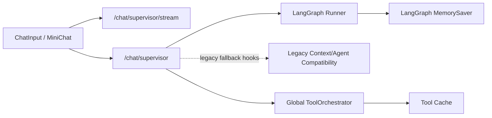
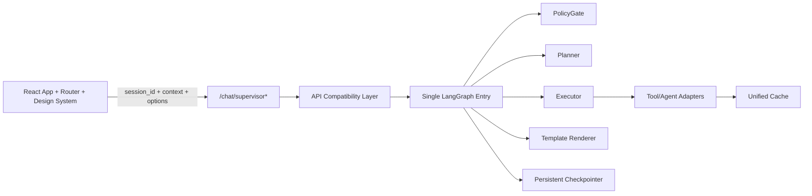
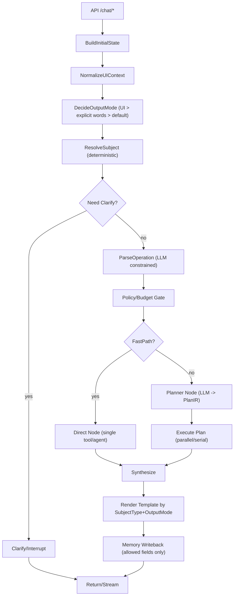
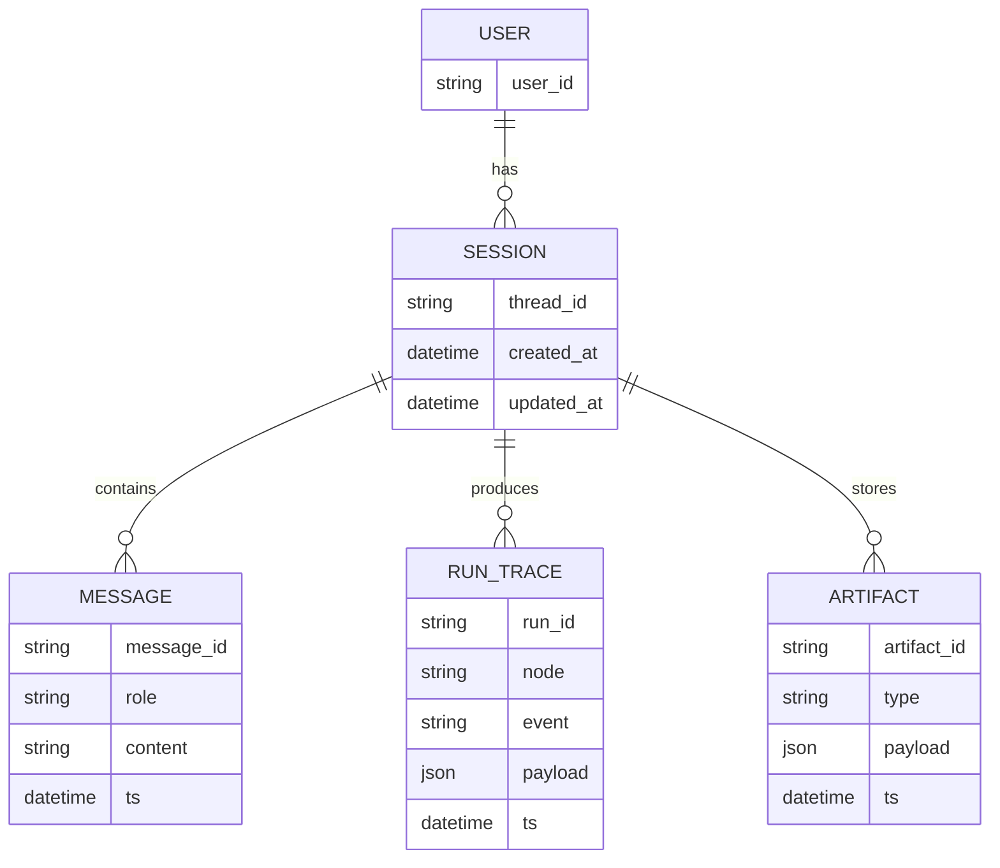

# FinSight LangGraph/LangChain �ع�����ƣ���??/ ���� / ����ָ��??

> **״??*��Living Doc���������£�  
> **����??*??026-02-06  
> **Ŀ���??*����??/ ǰ�� / ���� / ��Ʒ�����ܰ����ļ������������գ�  
> **��һ��ʵ��Դ��SSOT??*�����ļ�??LangGraph �ع���Ψһ�����ļ�����������ʷ�ĵ���ͻʱ���Ա��ļ�Ϊ׼�����ڱ��ļ��ġ����߼�¼���ﲹ��˵��??

---

## 0. ���¹���������أ�

### 0.1 ���ĵ���Ρ���������??

- �κ�??LangGraph �ع���ص�ʵ�֡����ԡ��ӿڡ�UI ������������ڱ��ĵ�??**TODOLIST** ������Ŀ�����Ȳ���Ŀ��д���룩??
- ÿ���һ??**С��**��һ���ɶ����ϲ�������Ԫ���������� TODOLIST �
  - ����Ӧ����� `TODO` ??`DOING` ??`DONE`���ù�??+ ���� + PR/commit ��ע??
  - ��������֤�ݣ�������??��ͼ/��־�ؼ�??trace �¼�??
- ÿ����һ�����ߣ����磺�ֶ���������ťλ�á�ģ���½ڡ�Ԥ����ԣ�������д??**10. ���߼�¼**??

### 0.2 ���Լ������ֹ�ٴ�ʺɽ��??

- ��ֹ��������ͼ��ö�� + if-else ������·�������̣�·�ɱ���ͨ�� **��ʽ State + ������ӳ??+ ��ͼ**??
- ��ֹ??selection ��ƴ??query����Ϊ�����߼���������ģ����ʾ����������ΪΨһ�źţ�??
- �������??���桱������ **��ʽ OutputMode**����??UI ����ȷ�ʣ��������ǡ���������ͬ���??

### 0.3 2026-02-06 ��ʵ��ϣ�Hard Truth??

> �����ǵ�ǰ����Ŀ͹����⣬�������Ρ��Դ���ʵ��Ϊ׼��������ʷ������ɡ���ѡΪ׼??

1. **�ܹ�˫�첢��**�����������??LangGraph���� API ����??legacy �����������ʷ��ͨ�� `agent.context.resolve_reference`��`agent.orchestrator` �����ϣ�??
2. **�Ự ID ����**��ǰ����ʽ������δ�ȶ�͸�� `session_id`�����Ĭ??`"new_session"` �ᵼ�¿��û�/�細�ڴ��Ự����??
3. **�Ự���������ⲻ�ȶ�**��ָ���ʽ���������������ʵ�֣���ȱ���Ự�����룬���׳��ֿ�������Ⱦ??
4. **ǰ����Ϣ�ṹ����??*���� Chat ??MiniChat �乲����Ϣ�����Ự״̬�����������á����ģʽ�ı߽粻����ȷ���������顰����ͳһ��ʵ�ʷ��ѡ�??
5. **�ĵ�����ʵ״̬Ư??*����ʷ�½��д���������ɡ���Ŀ��������ֱ�Ӵ����ǰ����ʱһ���ԺͿ�ά����??

### 0.4 ��ǰ��Ŀ��ܹ�ͼ��������룩

#### 0.4.1 ��ǰ??026-02-06??



#### 0.4.2 Ŀ�꣨����̬��



### 0.5 2026-02-06 ��ִ�е��ع�ԭ��ǿ�ƣ�

1. API �㲻�ٳ�ʼ�� `ConversationAgent` ��Ϊ����ʱ�����󣻽�������ݲ��Թ��ӣ�����������·??
2. `session_id` �����ǰ���ȶ�͸����ȱʧʱ������� UUID���Ͻ��̶�Ĭ�ϴ���??
3. �����������??`session_id` ���룬��ֹȫ����������Ⱦ??
4. �ĵ��ġ���ɡ����Բ���֤��Ϊ׼����� `pytest` + ǰ�� `build` + ��Ҫ??e2e??
5. �����ع�����ͳһ�Ǽ�??**11.7 Hard Reset**����ͬ��д�� Worklog??

---

## 1. ����Ŀ�����Ŀ��

### 1.1 Ŀ�꣨�����ɣ�

1. **����ڱ�??*������� LangGraph ΪΨһ��������ڣ��������� API ���ݲ㣬�����ն�����ͬһ��ͼ��??
2. **��������ģ��**���� `subject_type + operation + output_mode` ȡ��??0+ Intent��??
3. **Planner-Executor**���� LLM �����ṹ���ƻ���PlanIR����ִ�������ƻ�����/�������й������� agent??
4. **??subject_type ģ����Ⱦ**����??�Ʊ�/��˾/��� ���Բ�ͬģ�壻�б��� output_mode������ǿ�׹�??8 ��??
5. **MiniChat ���� Chat �������**������ͬһ??`thread_id(session_id)` �ĶԻ����䣬??UI selection ��Ϊ��������??ephemral context����д��־ü��䣩??
6. **�ɹ۲�ɵ���**��ÿ���ؼ����ߵ㶼Ҫ??trace �пɼ���routing reason��plan��selected tools/agents��budget��fallback��??

### 1.2 ��Ŀ�꣨���ڲ��� / �Ժ�����??

- ���ڱ������븴�Ӷ������塰�ԶԻ����о���ʽ��AutoGen Ⱥ��ʽ�����Կɿ��������Ϊ��??
- ���ڱ��ڳ����Ʒ����й���??����㣻�������临�ã����������� State/Plan Լ��??

### 1.3 ���ձ�׼����������??

- **���� 1��ѡ������ + ���롰����Ӱ��??*��������Ϊ������������ǿ���� `investment_report`��Planner Ĭ��ֻ��ȡ��Ҫ��Ϣ����ִ������Ĭ��ȫ��Ͱ??
- **���� 2������������б�����??*��ͬһ����������� `output_mode=investment_report` �Ľṹ����������һᴥ�� Planner ���ɸ���������Ϣ�ƻ����ɰ���??agent��??
- **���� 3��ѡ�вƱ�/�ĵ� + ���롰����Ҫ��??*���� `subject_type=filing/doc` ��ģ�壬���ᱻ����Ϊ������Ͷ���б���??
- **���� 4���� selection�������롰����ƻ��??*������Ҫ����壨Ҫ���������б�����Ĭ??brief���ɱ��ļ������壩������Ϊһ�¿ɲ�??

---

## 2. ����������ģ�ͣ�ͳһ����??

### 2.1 ��������ģ�ͣ��������ͼ��ը����

| ά�� | �ֶ� | ˵�� | ��Դ����??|
|---|---|---|---|
| Subject������ | `subject_type` | �û����ڴ���ġ���������??| selection > query(��ʽ ticker/��˾?? > active_symbol |
| Operation�������� | `operation` | �û�Ҫ�Զ�����ʲ??| LLM parse����Լ��?? ���򶵵� |
| Output�������� | `output_mode` | �����ʽ/��ȣ�������ͼ??| UI ��ʽ > ��ȷ??> Ĭ�� |

> **��Ҫ**��`investment_report` ���ǡ���������ͬ��ʣ�����һ����ʽ������ģʽ??

### 2.2 SubjectType �淶������������

> ˵����Ϊ�˱������㵱??selection ??`type="report"`�������ĵ�����ͻ�����齫 selection �����͸�Ϊ��׼ȷ�ġ�����������͡�??

| SubjectType | ���� | ������� |
|---|---|---|
| `news_item` | �������� | selection.type=`news` |
| `news_set` | �������ż��� | selection ��??|
| `company` | ��˾/��Ʊ��� | active_symbol / ticker |
| `filing` | �Ʊ�/���棨�ṹ��??PDF??| selection.type=`filing`�������??|
| `research_doc` | �б�/����/PDF | selection.type=`doc`�������??|
| `portfolio` | ��??��� | UI ���??/ watchlist |
| `unknown` | δ��ȷ��??| ��??clarify |

### 2.3 Operation �淶���ȶ�С����??

| Operation | ˵�� | ʾ�� |
|---|---|---|
| `fetch` | ��ȡ/�г� | ��������ʲô����??|
| `summarize` | �ܽ� | ���ܽ���������??|
| `analyze_impact` | ����Ӱ�� | �������Թɼ�Ӱ��??|
| `price` | �۸�/���� | ��NVDA ���¹ɼ��Ƕ���??|
| `technical` | ��������� | ��NVDA ��������� / RSI/MACD??|
| `qa` | �ʴ� | ���������Źؼ�����ʲô��??|
| `extract_metrics` | ��ȡָ�� | ���ӲƱ���ȡӪ��/����??|
| `compare` | �Ա� | ��AAPL vs MSFT �ĸ�����??|
| `generate_report` | �����б�����??output_mode=investment_report??| ������Ͷ�ʱ�??�б�??|

> Operation ������չ��������ͨ��������ӳ�䵽��ͼ�����������չ�����·��??if-else??

### 2.4 OutputMode���� UI ����ȷ�ʴ���??

| OutputMode | ˵�� | UI |
|---|---|---|
| `chat` | ��ͨ�Ի����̣� | Ĭ�Ϸ�??|
| `brief` | �ṹ����������Ƽ�Ĭ�ϣ� | Ĭ�Ϸ�??|
| `investment_report` | �б������������??agent??| **��ť��������??* |

---

## 3. Ŀ��ܹ�������LangGraph ��ͼ + ��ͼ??

### 3.1 �������ͼ��Mermaid??



### 3.2 �ֲ�ְ��Clean Architecture �ӽ�??

| ??| ģ������ | ʾ�� |
|---|---|---|
| Domain | ����/�ƻ�/֤��/ģ��ĺ������ݽ�??| `TaskSpec`, `PlanIR`, `EvidenceItem` |
| Use Case | Graph Nodes��·�ɡ��滮��ִ�С��ϳɣ� | `ResolveSubjectNode`, `PlannerNode` |
| Adapters | ���� agents/tools ������??| `PriceAgentAdapter`, `NewsToolAdapter` |
| Frameworks | FastAPI��LangGraph runtime��SSE | `/chat/stream`, checkpointer |

### 3.3 ���ձ�׼���ܹ���??

- �����������ս�??**ͬһ??LangGraph**����ͬһ��ں������������Ƿ�ɢ�ڶ�� Router/Supervisor ��·??
- selection �Ĵ����� `ResolveSubject` ��ɣ��������ں����ڵ�ͨ���ַ�??contains �򲹶�??

---

## 4. State ����Լ�����/ǰ�˱���һ�£�

### 4.1 ChatRequest ��չ�����飩

> ˵�������ƻ������ԣ�������ѡ�ֶμ��ɣ��Ͽͻ��˲���Ҳ����Ĭ����Ϊ??

```python
# α���루??Pydantic v2 Ϊ��??
class ChatOptions(BaseModel):
    output_mode: Literal["chat", "brief", "investment_report"] | None = None
    strict_selection: bool | None = None  # Ĭ�� False���û�Ҫ������һЩ��
    locale: str | None = None             # e.g. "zh-CN"

class ChatContext(BaseModel):
    active_symbol: str | None = None
    view: str | None = None
    selections: list[SelectionContext] | None = None

class ChatRequest(BaseModel):
    query: str
    session_id: str | None = None
    context: ChatContext | None = None
    options: ChatOptions | None = None
```

### 4.2 LangGraph State��TypedDict �Ƽ��ֶ�??

```python
from typing import TypedDict, Literal, NotRequired

SubjectType = Literal["news_item","news_set","company","filing","research_doc","portfolio","unknown"]
OutputMode = Literal["chat","brief","investment_report"]

class Subject(TypedDict):
    subject_type: SubjectType
    tickers: list[str]
    selection_ids: list[str]
    selection_types: list[str]        # ԭʼ selection.type��news/filing/doc??
    selection_payload: list[dict]     # ����/����/ժҪ��������??

class Operation(TypedDict):
    name: str
    confidence: float
    params: dict

class GraphState(TypedDict):
    thread_id: str
    messages: list[dict]              # LangChain messages
    query: str

    ui_context: NotRequired[dict]     # view/active_symbol/selections��ephemeral??
    subject: NotRequired[Subject]
    operation: NotRequired[Operation]
    output_mode: NotRequired[OutputMode]
    strict_selection: NotRequired[bool]

    policy: NotRequired[dict]         # PolicyGate �����budget/allowlist/schema??
    plan_ir: NotRequired[dict]        # Planner ������ṹ��??
    artifacts: NotRequired[dict]      # ִ�н���أ�news, filings, prices, evidence...??
    trace: NotRequired[dict]          # ·��/�ƻ�/ִ�й켣
```

### 4.3 ���ձ�׼����Լ��??

- selection �����Խṹ���ֶν��� state������ƴ??query ����ʶ��??
- `output_mode` ���� UI ��ʽ���룬�����ȼ����??
- `strict_selection` Ĭ�� false�����ɣ��������뱣�����λ�Ա�δ�����л�����??

---

## 5. Node/��ͼ��ƣ�����������??if-else ����

### 5.1 ���� Nodes �嵥������ʵ�ֵ���С���ϣ�

| Node | ���루�����ֶΣ� | �����д���ֶΣ� | ʧ��/���� |
|---|---|---|---|
| `BuildInitialState` | request | `thread_id,messages,query,ui_context` | ??|
| `NormalizeUIContext` | `ui_context` | �淶??selections ȥ�� | ??|
| `ResolveSubject` | `ui_context,query` | `subject`��deterministic??| `subject_type=unknown` |
| `Clarify` | `subject,query` | interrupt / clarify question | ͳһ������� |
| `ParseOperation` | `query,subject` | `operation` | ���򶵵� |
| `DecideOutputMode` | `options,query` | `output_mode` | Ĭ�� `brief` |
| `PolicyGate` | `output_mode,subject` | `policy/budget` | ���� fastpath |
| `Planner` | `subject,operation,output_mode` | `plan_ir` | fallback ??agent |
| `ExecutePlan` | `plan_ir` | `artifacts` | ����ʧ�ܼ��� |
| `Synthesize` | `artifacts` | `draft_answer` | �򻯺�??|
| `Render` | `subject_type,output_mode` | ��??markdown | ģ��ȱʧ���� |
| `MemoryWriteback` | `messages,selected_memory` | �־�??| ֻд�����ֶ� |

### 5.2 Subject ��ͼӳ�䣨������??

> ���򣺶���ֻ���������·�ɵ� `SubjectSubgraph[subject_type]`��ÿ����ͼ�ڲ��� operation ��֧??

```python
SUBJECT_SUBGRAPHS = {
  "news_item": NewsSubgraph,
  "news_set": NewsSubgraph,
  "company": CompanySubgraph,
  "filing": FilingSubgraph,
  "research_doc": DocSubgraph,
  "portfolio": PortfolioSubgraph,
}
```

### 5.3 ���ձ�׼�����Ų�??

- ����һ??subject_type ??operation������Ҫ��??3 ??router��ֻ��������ͼ/�ڵ㲢����ӳ���??
- ����·���߼������֡����ݹؼ��ʾ�����ȫ��Ͱ����Ĭ����Ϊ??

---

## 6. Planner-Executor��LLM ���ƻ������

### 6.1 PlanIR���ṹ���ƻ���Schema��������С�ֶΣ�

```json
{
  "goal": "string",
  "subject": { "subject_type": "company|news_item|filing|...", "tickers": ["AAPL"], "selection_ids": ["..."] },
  "output_mode": "chat|brief|investment_report",
  "steps": [
    {
      "id": "s1",
      "kind": "tool|agent|llm",
      "name": "get_company_news|price_agent|news_agent|...",
      "inputs": { "ticker": "AAPL", "selection_ids": ["..."] },
      "parallel_group": "g1",
      "why": "һ�仰ԭ��",
      "optional": true
    }
  ],
  "synthesis": {
    "style": "concise|structured",
    "sections": ["...��??.."]
  },
  "budget": { "max_rounds": 6, "max_tools": 8 }
}
```

### 6.2 Planner Լ������ֹ�����޷�ɢ����

- Planner ֻ�ܴӰ�������??`tools/agents`���� PolicyGate �ṩ��??
- Ĭ�� `output_mode=brief` ʱ��`budget.max_rounds` ��С����ֹ���б�ר���½ڲ�ȫ������??
- ??selection ʱ����Ҫ�����ɣ�??*��ǿ��ֻΧ�� selection**���� Planner ����??
  - ??selection ��Ϊ��Ȩ??evidence��������??���ܽ�??
  - ���ú��� selection ȥ���޹�ȫ�г���PolicyGate ��������??

### 6.3 Executor ���򣨲�??ʧ������??

- ͬһ `parallel_group` �IJ��貢��ִ�У���ͬ group ����??
- �κ� `optional=true` ʧ�ܲ���ֹ����д??`artifacts.errors[]` �������������ʾ����ѡ��Ϣȱʧ��??
- ��ͬһ���ߵ�������??ȥ�أ�key=tool+inputs hash��??

### 6.4 ���ձ�׼��Planner/Executor??

- Planner �������ɱ� Schema У�飨�ṹ�� JSON����ʧ��ʱ��??fallback���� 8.3��??
- ����������Ӱ�족Ĭ�ϼƻ��в���??`fundamental+technical+macro+price` ȫ������??query ??output_mode ��ȷҪ��??

---

## 7. ģ��ϵͳ���� SubjectType + OutputMode??

### 7.1 ģ��ѡ�����

| subject_type | output_mode=brief | output_mode=investment_report |
|---|---|---|
| `news_item/news_set` | ���Ž�� Brief ģ�� | �����¼��б�ģ�壨���ǹ�??8 �£� |
| `company` | ��˾���� Brief ģ�� | Ͷ���б�ģ�壨����չ�½�??|
| `filing/research_doc` | �ĵ���� Brief ģ�� | �ĵ��ж�����ģ�壨���ز�??Ҫ��??|
| `portfolio` | ���ժҪ Brief ģ�� | �����ȱ���ģ�� |

> �ؼ�??*��Ҫ��һ����??8 ��ģ�帲����??subject**??

### 7.2 ʾ����`news_item` Brief ģ�壨�ṹ��

```md
### ����ժҪ

### Ӱ�����
- ����??
- ����??

### �ؼ������������??

### �����벻ȷ��??
```

### 7.3 ʾ����`company` Ͷ���б�ģ�壨�ṹ���������½ڣ�

```md
## Ͷ��ժҪ
## ��˾��ҵ??
## �ؼ��߻���������??�¼�??
## �������ֵ������??
## ����
## ���ۣ���Ͷ�ʽ�������??
```

### 7.4 ���ձ�׼��ģ���??

- ѡ������ + `brief` ��������֡���˾�б����¿հס�����??
- ����������б���ʱ��ģ���� subject_type ƥ�䣨������????��˾�б���??

---

## 8. ǰ����ƣ�MiniChat ��������??+ �б���ť??

### 8.1 ����������ԭ??

- **����**��ͬһ??`session_id/thread_id` ??���� messages/memory??
- **������д??*��`active_symbol/selections/view` ֻ��Ϊ������??`context`����д�볤�� memory��������Ⱦ��??

### 8.2 �������б�����ť������λ���뽻����

#### �Ƽ�λ��

- ���� **������Ҳ�ķ�����**���� `Send` ���У��� Chat ??MiniChat ͬ��λ�ã��������û��Ҳ���??
- ������������һ����ʱ���ã�
  - ??`active_symbol`
  - ??selections �ǿ�
- �����ûҲ���ʾ������ѡ���Ļ��������ݺ������б���??

#### ��������

- ��ť�����ʹ��ͬһ��������ݷ������󣬵��� payload ��ǿ�ƣ�`options.output_mode="investment_report"`??
- ���Ͱ�ť����Ĭ�ϣ�`output_mode` ���������Ĭ??`brief`��??

### 8.3 ǰ������ʾ����SSE??

```json
{
  "query": "����Ӱ��",
  "session_id": "u123",
  "context": {
    "view": "dashboard",
    "active_symbol": "AAPL",
    "selections": [
      {"type":"news","id":"n1","title":"...","url":"...","snippet":"..."}
    ]
  },
  "options": {
    "output_mode": "investment_report",
    "strict_selection": false
  }
}
```

### 8.4 ���ձ�׼��ǰ�˲�??

- ??Chat ??MiniChat����??session_id �£���ʷ�Ի�һ�£�??UI selection ����������ƫ�û��ڼ���??
- �������б�����ť���ı� output_mode�����ı��û������ı�����ע�롰��??�б����ȹؼ�������??

---

## 9. ���������գ���ִ�в���·����

### 9.1 ���Ծ��󣨱��븲�ǣ�

| Case ID | ���� | UI Context | ���� subject_type | ���� output_mode | �ؼ����� |
|---|---|---|---|---|---|
| T-N1 | ������Ӱ��??| selection=news(1) | `news_item` | `brief` | ����??investment_report���ƻ���Ĭ��ȫ��??|
| T-N2 | ������Ӱ��??���б���??| selection=news(1) | `news_item` | `investment_report` | ģ��Ϊ�����б���Planner ��������չ��??|
| T-C1 | ������ƻ��??| active_symbol=AAPL | `company` | `brief` | ����ǿ�ʣ�������??|
| T-C2 | ������Ͷ�ʱ���??| active_symbol=AAPL | `company` | `investment_report` | ���ɹ�˾�б��ṹ |
| T-F1 | ���ܽ�Ҫ��??| selection=filing(1) | `filing` | `brief` | �ĵ����ģ�� |
| T-P1 | ���Ա�AAPL��MSFT??| none | `company`/`portfolio` | `brief` | operation=compare���ƻ������Աȱ�����Ϣ |
| T-T1 | ��NVDA ���¹ɼۺͼ��������??| active_symbol=GOOGL | `company` | `brief` | subject ӦΪ NVDA��operation=technical���ƻ���??price+technical |

### 9.2 ���⽨�飨��ˣ�

- `test_resolve_subject_selection_priority.py`
- `test_output_mode_ui_override.py`
- `test_planner_planir_schema_validation.py`
- `test_executor_parallel_groups.py`
- `test_news_brief_template_no_empty_chapters.py`

### 9.3 ���ձ�׼�����Բ�??

- ÿ�� Case ���� 1 �����Զ������ԣ�pytest��??
- �ؼ� trace �¼��ɶ��ԣ����磺`routing.subject_type`��`planner.plan_created`��`executor.step_started`��??

---

## 10. ���߼�¼������׷�ӣ�

| ���� | ���� | ���� | Ӱ�췶Χ |
|---|---|---|---|
| 2026-02-02 | �б���� | ʹ�� **��ť��������??*���뷢�Ͱ�ť��??| FE/BE �ӿ����� `options.output_mode` |
| 2026-02-02 | selection ����??| `strict_selection=false` Ĭ�����ɣ��� Planner �������ȶ�ȡ selection | Planner/PolicyGate |
| 2026-02-02 | ���Ų��� | ���� **Planner-Executor**��LLM ���ṹ���ƻ� PlanIR | BE LangGraph |
| 2026-02-02 | ģ����� | ??`subject_type` �ṩ��ͬģ�壻�����б��ٹ�˾�б� | Template/Render |
| 2026-02-02 | selection.type ���� | selection.type ֻ��??*�����������**��`news | filing | doc`�����ݾ� `report` ����һ??`doc`?? ���汾���ڣ� | FE/BE selection + ResolveSubject |
| 2026-02-02 | PolicyGate | PolicyGate ������� `budget + allowlist + schema`��tool/agent����Planner ����??allowlist �ڲ��ƻ� | BE LangGraph��policy_gate / planner??|
| 2026-02-02 | Operation ���� | Operation ���á��������ȡ��ɲ�ʵ�֣������ɼ� constrained LLM�������뱣����򶵵� | BE LangGraph��parse_operation??|
| 2026-02-02 | Planner Լ�� | �ؼ�Լ����selection �ȶ�/���ܽᡢ���б�ģʽ�����б���ȫ���裩�� PlanIR ��ɶ��� | BE LangGraph��planner / tests??|
| 2026-02-02 | ExecutePlan Ĭ��ģʽ | ExecutePlan Ĭ�� dry_run��������ʵ���ߣ���֤�ɲ�/�ɿأ���ͨ�� env �л� live tools | BE LangGraph��executor??|
| 2026-02-02 | ģ����� | ģ��??`backend/graph/templates/*.md` ά����Render ??`subject_type+output_mode` ѡ��ע����??| BE LangGraph��render/templates??|
| 2026-02-02 | Evidence չʾ��??| ���ѵ������� 2026-02-05��Ĭ�����أ���ͨ�� `LANGGRAPH_SHOW_EVIDENCE=true` ��ʾ��links-only??| BE LangGraph��render??|
| 2026-02-03 | Subject ���ȼ���active_symbol vs query??| ??query ����??ticker/��˾����Ӧ���ǿ��ܹ��ڵ� active_symbol�����⡰�� NVDA ȴ�� GOOGL??| BE LangGraph��resolve_subject??|
| 2026-02-03 | Trace �ɹ۲�??| `/chat/supervisor/stream` ������ʵʱ������??ִ�н��ȣ�trace ��Ӧֻ�ڽ������??| BE SSE + LangGraph trace |
| 2026-02-05 | �б�Ĭ�� Agent��LLM Planner??| LLM Planner ??`output_mode=investment_report` ǿ�Ʋ���Ĭ�� agent steps���� `macro_agent`��������??agent/tool inputs��query/ticker/selection_ids??| BE LangGraph��planner?? tests |
| 2026-02-05 | Trace �ɶ��ԣ�Executor/SSE??| executor_step_start ??`result.inputs` ����ṹ�����󣨲���??JSON �ַ�������`agent_start/agent_done` SSE �¼��ֶ���ǰ�˶��벢Я�� step_id/inputs | BE executor + FE stream |
| 2026-02-05 | �б�֤��չʾ | �ۺ��б����IJ��ٰ�����֤�ݳظ��������ӣ�����֤������ֻ�� Sources/֤�ݳؿ�Ƭչʾ������??markdown ��չʾ��??`LANGGRAPH_SHOW_EVIDENCE=true` | BE report_builder/render + FE ReportView |
| 2026-02-05 | ����ͳ�ƿھ� | BE/FE ����ͳ�ƺ��� raw URL�����⡰���ӳ������������ۺ��б��Ա�֤ >=2000 ������������??| BE report_builder + FE ReportView |
| 2026-02-06 | API ����ʱȥ�ɻ� | `backend/api/main.py` ���ٳ�ʼ??`ConversationAgent`������·��ʹ??LangGraph + Orchestrator��`agent` ��������ݲ��Թ�??| BE API ??|
| 2026-02-06 | �Ự ID ���� | `/chat/supervisor*` ȱʧ session_id ʱ��??UUID����ֹ��??`"new_session"` | FE/BE �Ự��· |
| 2026-02-06 | �������������� | ��������Ǩ��??session-scoped `ContextManager` ӳ�䣬�� thread_id ���� | BE API ??|
| 2026-02-06 | ǰ�˻Ự͸�� | `sendMessageStream` ���� `session_id` ͸������ Chat ??MiniChat ����ͬһ session state��localStorage �־û��� | FE API/client + store |
| 2026-02-06 | ǰ��·���տڲ��� | ʹ�� `react-router-dom` ��ʽ·�ɣ�`/chat`��`/dashboard/:symbol`�����Ƴ� `pushState/popstate` �ֹ�״̬�� | FE App �ܹ� |
| 2026-02-06 | �����Ӽ��ݲ�??| ���� `/?symbol=XXX` ��ڣ��Զ��ض���??`/dashboard/:symbol`��������ʷ��??��������??| FE Router |
| 2026-02-06 | ���ģʽ��ʽ??| ??Chat ??MiniChat ���ӿɼ��ġ���??�б���ģʽ�л���������Ϊ����������ʽ��ť��??| FE ChatInput/MiniChat |

---

## 11. TODOLIST����ϸ����??����/���տɲ�����??

> ˵�������б��Ǻ���������Ψһ�����嵥?? 
> ���ȹ���ÿ���һ��С����Ԫ�������ڴ˹�ѡ������֤�ݡ�?? 
> ��Ǹ�ʽ��`- [ ]` TODO��`- [x]` DONE������??֤�ݣ�??

### 11.0 �ĵ�ά����ÿ�ο�����Ҫ��??

- [x] 2026-02-02����??SSOT �ĵ��Ǽܣ����ļ�����֤�ݣ�`docs/06_LANGGRAPH_REFACTOR_GUIDE.md`
- [x] 2026-02-07���̻����Ự��ʧ�ɻָ����䡱���̣����� `docs/TEAM_EXECUTION_MEMORY.md`������ȷÿ������Ҫͬ�� `11.x TODOLIST` + `13.Worklog` + `docs/feature_logs` devlog��֤�ݣ�`docs/TEAM_EXECUTION_MEMORY.md`��`docs/feature_logs/2026-02-07_session_recovery_memory.md`
- [ ] ÿ��ʵ��ǰ��Ϊ�����??ϸ����Ӧ TODOLIST ��Ŀ��д??DoD??
- [ ] ÿ��ʵ�ֺ󣺸�����Ŀ״??+ д������֤�ݣ�������??��ͼ/��־?? ��һ??`docs/feature_logs` devlog
- [ ] ÿ�������ֶ�/�ӿڣ�ͬ����??4.1/4.2 ��ԼС��
- [ ] ÿ������ģ�壺ͬ����??7.* ģ��С����ʾ??

### 11.1 Phase 1��LangGraph �Ǽ���أ����ı�ҵ�������ֻ����ڣ�

#### 11.1.1 Ŀ¼�������ʩ

- [x] 2026-02-02����??`backend/graph/` ģ��Ǽܣ�state��nodes��runner����֤�ݣ�`backend/graph/runner.py`��`backend/graph/state.py`
- [x] 2026-02-02��ȷ??LangGraph �����������ҿɵ��루`langgraph==1.0.4`����֤�ݣ�`backend/tests/test_langgraph_skeleton.py`
- [x] 2026-02-02��Phase 1 ʹ�� `MemorySaver` ��Ϊ����??checkpointer���������滻??SQLite/�־û�����֤�ݣ�`backend/graph/runner.py`

#### 11.1.2 ���� Graph���� stub??

- [x] 2026-02-02��`BuildInitialState` Node���� request ??state��thread_id/query/ui_context/messages����֤�ݣ�`backend/graph/nodes/build_initial_state.py`
- [x] 2026-02-02��`NormalizeUIContext` Node��selections ȥ�أ�type+id����֤�ݣ�`backend/graph/nodes/normalize_ui_context.py`
- [x] 2026-02-03��`ResolveSubject` Node��deterministic ���� subject_type��selection > query ticker/company > active_symbol����֤�ݣ�`backend/graph/nodes/resolve_subject.py`��`backend/tests/test_langgraph_skeleton.py::test_resolve_subject_query_ticker_overrides_active_symbol`
- [x] 2026-02-02��`DecideOutputMode` Node��Phase 1 ��֧??UI override + ǿ�ʴ��� + Ĭ�� brief��������??options����֤�ݣ�`backend/graph/nodes/decide_output_mode.py`
- [x] 2026-02-02��`Planner` Node��stub���������??PlanIR�������� LLM����֤�ݣ�`backend/graph/nodes/planner_stub.py`
- [x] 2026-02-02��`ExecutePlan` Node��stub����ִ�йǼܣ������ù��ߣ���֤�ݣ�`backend/graph/nodes/execute_plan_stub.py`
- [x] 2026-02-02��`Render` Node��stub���������??markdown�������滻Ϊģ��ϵͳ����֤�ݣ�`backend/graph/nodes/render_stub.py`
- [x] 2026-02-02��API ���ݲ㣺`/chat/supervisor` ??`/chat/supervisor/stream` ֧�� LangGraph��Ǩ�Ƴ�����??`LANGGRAPH_ENABLED`����??2026-02-03 �Ƴ� gating����֤�ݣ�`backend/api/main.py`��`backend/tests/test_langgraph_api_stub.py`

#### 11.1.3 ���գ�Phase 1??

- [x] 2026-02-02������??1 ���˵�������LangGraph stub ģʽ�����õ��ȶ������֤�ݣ�`backend/tests/test_langgraph_api_stub.py`
- [x] 2026-02-02��trace ���ܿ����ؼ� node ִ�м�¼��Phase 1 spans����6����֤�ݣ�`backend/tests/test_langgraph_skeleton.py`

### 11.2 Phase 2����Լ�� UI��output_mode ��ť + selection �ṹ����

#### 11.2.1 API ��Լ

- [x] 2026-02-02���� `backend/api/schemas.py` ���� `ChatOptions`��output_mode/strict_selection/locale����֤�ݣ�`backend/api/schemas.py`
- [x] 2026-02-02���� ChatRequest ���� `options` �ֶΣ����ݾɿͻ��ˣ���֤�ݣ�`backend/api/schemas.py`
- [x] 2026-02-02����˽� `options.output_mode` д�� Graph state��UI ���ȼ���ߣ���֤�ݣ�`backend/api/main.py`��`backend/tests/test_langgraph_api_stub.py`

#### 11.2.2 ǰ�ˣ������б���??

- [x] 2026-02-02����??Chat ���������롰�����б�����ť��??Send ���У���֤�ݣ�`frontend/src/components/ChatInput.tsx`
- [x] 2026-02-02���� `MiniChat.tsx` ����������ͬ�ť��??Send ���У���֤�ݣ�`frontend/src/components/MiniChat.tsx`
- [x] 2026-02-02�������ť���ͣ�payload ���� `options.output_mode="investment_report"`��֤�ݣ�`frontend/src/api/client.ts`��`frontend/src/components/ChatInput.tsx`��`frontend/src/components/MiniChat.tsx`
- [x] 2026-02-02���û��߼����� active_symbol ���� selections ʱ���ɵ����֤�ݣ�`frontend/src/components/ChatInput.tsx`��`frontend/src/components/MiniChat.tsx`
- [x] 2026-02-02��E2E��Playwright ���ǰ�ť��������ͨ���͵IJ����֤�ݣ�`npm run test:e2e --prefix frontend`?? passed??
- [x] 2026-02-02��Smoke��`npm run build --prefix frontend`��TS ���� + Vite build??

#### 11.2.3 selection ������������??report �����ԣ�

- [x] 2026-02-02����Ʋ���� selection.type ��ö�٣�`news | filing | doc`������� `report` ���뺬�壩��֤�ݣ�`frontend/src/types/dashboard.ts`��`backend/api/schemas.py`
- [x] 2026-02-02����??ResolveSubject ���������ͣ������ͼ���ӳ??1 ���汾���ڣ���֤�ݣ�`backend/graph/nodes/normalize_ui_context.py`��`backend/graph/nodes/resolve_subject.py`��`backend/tests/test_langgraph_skeleton.py::test_resolve_subject_filing_and_doc_selection_types`
- [x] 2026-02-02��ǰ??selection ���ɴ�ͬ���޸ģ�dashboard selection �����߼�����֤�ݣ�`frontend/src/components/dashboard/NewsFeed.tsx`��news ����?? `npm run build --prefix frontend`

#### 11.2.4 ���գ�Phase 2??

- [x] 2026-02-02������������б���һ����??output_mode=investment_report��trace �ɼ�����֤�ݣ�`backend/tests/test_langgraph_api_stub.py::test_chat_supervisor_output_mode_option_overrides_default` + `npm run test:e2e --prefix frontend`
- [x] 2026-02-02����ͨ����Ĭ??output_mode=brief��trace �ɼ�����֤�ݣ�`backend/tests/test_langgraph_api_stub.py::test_chat_supervisor_default_output_mode_is_brief_and_trace_present`

### 11.3 Phase 3��Planner-Executor ������أ��滻Ĭ��ȫ��Ͱ??

#### 11.3.1 PlanIR Schema ��У??

- [x] 2026-02-02����??`PlanIR`��Pydantic?? JSON schema���ɲ��ԣ���֤�ݣ�`backend/graph/plan_ir.py`��`backend/tests/test_plan_ir_validation.py::test_plan_ir_json_schema_smoke`
- [x] 2026-02-02��Planner �������ͨ��У�飬��??fallback����¼�� trace����֤�ݣ�`backend/graph/nodes/planner_stub.py`��`backend/tests/test_plan_ir_validation.py::test_planner_stub_falls_back_on_invalid_output_mode`
- [x] 2026-02-02�����幤??agent ������������ schema��PolicyGate �������֤�ݣ�`backend/graph/nodes/policy_gate.py`��`backend/tests/test_policy_gate.py`
- [x] 2026-02-04��PolicyGate Ĭ�ϣ�brief/chat����??agent allowlist����??`output_mode=investment_report` ʱ���ã������������ Planner ??agent step ??Executor ��֧�ֵ���ִ��ʧ�ܣ���֤�ݣ�`backend/graph/nodes/policy_gate.py`��`backend/tests/test_policy_gate.py::test_policy_gate_company_compare_brief_disables_agents_by_default`

#### 11.3.2 Planner Prompt����Լ��??

- [x] 2026-02-02��ʵ??`ParseOperation` Node����������д??`state.operation`������������ LLM parse��������ɲ⣩��֤�ݣ�`backend/graph/nodes/parse_operation.py`��`backend/tests/test_parse_operation.py`
- [x] 2026-02-02��ʵ??Planner ��ʾ�ʣ����� subject/operation/output_mode/budget/available_tools��֤�ݣ�`backend/graph/planner_prompt.py`��`backend/tests/test_planner_prompt.py`
- [x] 2026-02-02��Լ����selection ����ʱ������??�ܽ� selection������һ??step����֤�ݣ�`backend/graph/nodes/planner_stub.py`��`backend/tests/test_planner_constraints.py::test_planner_includes_selection_summary_step_first_when_selection_present`
- [x] 2026-02-02��Լ����output_mode!=investment_report ʱ��ֹ���б��½ڲ�ȫ�������֤�ݣ�`backend/graph/nodes/planner_stub.py`��`backend/tests/test_planner_constraints.py::test_planner_does_not_add_report_fill_steps_when_not_investment_report_mode`

#### 11.3.2b Planner���� LLM ??PlanIR + ����??

- [x] 2026-02-03��ʵ??`planner` Node��`LANGGRAPH_PLANNER_MODE=stub|llm`��Ĭ??stub����֤�ݣ�`backend/graph/nodes/planner.py`
- [x] 2026-02-03��LLM ģʽ����??`create_llm()` + `build_planner_prompt()`��Ҫ??JSON-only PlanIR���� steps/why����֤�ݣ�`backend/graph/nodes/planner.py`��`backend/graph/planner_prompt.py`
- [x] 2026-02-03��Planner ǿ��Լ����`output_mode/budget/subject` ??state/policy Ϊ׼��steps ??allowlist �ڣ�selection summary step first��֤�ݣ�`backend/graph/nodes/planner.py`��`_enforce_policy`??
- [x] 2026-02-03��LLM ����??����Ƿ���fallback ??`planner_stub`����д�� `trace.planner_runtime`��֤�ݣ�`backend/graph/nodes/planner.py`��`backend/tests/test_planner_node.py::test_planner_llm_mode_falls_back_when_llm_unavailable`
- [x] 2026-02-03��Graph ���ߣ�`runner.py` ??`planner` �ڵ�??`planner_stub` �л�??`planner`��֤�ݣ�`backend/graph/runner.py`��`backend/graph/nodes/__init__.py`
- [x] 2026-02-03�����ԣ�??API key ??`LANGGRAPH_PLANNER_MODE=llm` ��Ӧʧ����Ӧ fallback������ trace����֤�ݣ�`backend/tests/test_planner_node.py`
- [x] 2026-02-05����??Planner ע��Ĭ�� steps ??step_id ��ͻ����??id �Ḳ??step_results���� Agent ��Ƭ�����ظ�����investment_report Ԥ��ü�ʱ���ȱ�??baseline agents��macro/deep_search������Ҫʱ�������߲����֤�ݣ�`backend/graph/nodes/planner.py`��`backend/tests/test_planner_node.py::test_planner_llm_mode_investment_report_enforces_scored_agent_subset`��`backend/tests/test_planner_node.py::test_planner_investment_report_budget_prioritizes_selected_agents_over_tools`

#### 11.3.3 Executor�������뻺��??

- [x] 2026-02-02��ʵ??parallel_group ����ִ�У�async gather����֤�ݣ�`backend/graph/executor.py`��`backend/tests/test_executor.py::test_execute_plan_parallel_group_runs_concurrently`
- [x] 2026-02-02��ʵ??step ����??ȥ�أ�tool+inputs hash����֤�ݣ�`backend/graph/executor.py`��`backend/tests/test_executor.py::test_execute_plan_step_cache_dedupes_calls`
- [x] 2026-02-02��optional step ʧ�ܲ��жϣ�д�� artifacts.errors��֤�ݣ�`backend/graph/executor.py`��`backend/tests/test_executor.py::test_execute_plan_optional_failure_does_not_stop`
- [x] 2026-02-04��Executor ֧�� `kind=agent`��`agent_invokers`�������� agent step ������unsupported step kind/name�����ж�ִ�У���??ExecutePlan live-tools ·��??agent invokers + agent��evidence_pool ��һ��֤�ݣ�`backend/graph/executor.py`��`backend/graph/nodes/execute_plan_stub.py`��`backend/tests/test_executor.py::test_execute_plan_supports_agent_steps_in_live_mode`��`backend/tests/test_live_tools_evidence.py::test_execute_plan_stub_merges_agent_output_into_evidence_pool`

#### 11.3.3b Executor��live tools ���� + �����һ??

- [x] 2026-02-03��dry_run ����ִ�б��� `llm:summarize_selection`��deterministic������֤ selection ������������ݣ�֤�ݣ�`backend/graph/executor.py`��`backend/tests/test_executor.py::test_execute_plan_runs_llm_summarize_selection_even_in_dry_run`
- [x] 2026-02-03��`LANGGRAPH_EXECUTE_LIVE_TOOLS=true` ʱ������ʵ����ִ�У�LangChain tools�����������д�� artifacts.step_results��֤�ݣ�`backend/graph/nodes/execute_plan_stub.py`
- [x] 2026-02-03�������������һ??`artifacts.evidence_pool`���� selection һ����??evidence �أ���֤�ݣ�`backend/graph/nodes/execute_plan_stub.py`��tool��evidence merge??
- [x] 2026-02-03�����ԣ�dry_run selection summary ����??skipped��live tools ͨ�� stub invoker �ɱ�ִ�У���������������֤�ݣ�`backend/tests/test_executor.py`��`backend/tests/test_live_tools_evidence.py`

#### 11.3.4 ���գ�Phase 3??

- [x] 2026-02-02����ѡ������ + ����Ӱ�족Ĭ�ϼƻ������� fundamental+technical+macro+price ȫ����������ȷҪ�󣩣�֤�ݣ�`backend/tests/test_phase3_acceptance.py::test_phase3_news_selection_analyze_does_not_default_to_all_tools`
- [x] 2026-02-02���������б���ʱ�ƻ�����չ���������� trace �н�??why��֤�ݣ�`backend/tests/test_phase3_acceptance.py::test_phase3_investment_report_mode_can_expand_with_why`

### 11.4 Phase 4���� SubjectType ģ����أ�����հ��½ڣ�

#### 11.4.1 ģ������Ⱦ��

- [x] 2026-02-02����??`templates/`��`news_brief`, `news_report`, `company_brief`, `company_report`, `filing_brief`, `filing_report`��֤�ݣ�`backend/graph/templates/`
- [x] 2026-02-02��Render Node���� `subject_type+output_mode` ѡ��ģ���֤�ݣ�`backend/graph/nodes/render_stub.py`��`backend/tests/test_templates_render.py`
- [x] 2026-02-02��ģ��ȱ??fallback����??`brief`�����������ע��ģ��ȱʧ�ѽ�������֤�ݣ�`backend/graph/nodes/render_stub.py`��note_prefix??
- [x] 2026-02-04��ģ���İ�ȥ���������У����Լ��ٲ�ȷ����ǣ�`company_*` �ġ��۸��??������/��������/�����ֵ������ͳһȥ��������У�����֤�ݣ�`backend/graph/templates/company_brief.md`��`backend/graph/templates/company_compare_brief.md`��`backend/graph/templates/company_report.md`��`backend/graph/templates/company_compare_report.md`��`backend/tests/test_templates_render.py`
- [x] 2026-02-04��brief ģ��ȥ�룺`company_brief` / `company_compare_brief` �Ƴ�����??����/֤�ݡ��½ڣ��������û���Ҫ��ժҪ���䣨����� tool/search dump ֱ��չʾ���û�����֤�ݣ�`backend/graph/templates/company_brief.md`��`backend/graph/templates/company_compare_brief.md`��`backend/tests/test_templates_render.py`
- [x] 2026-02-04����??company ����ģ�壺`company_news_brief`/`company_news_report`���� operation=`fetch` ʱ������Ⱦ�����⡰�ش����š�������??`company_brief` �������ݿհף�֤�ݣ�`backend/graph/templates/company_news_brief.md`��`backend/graph/templates/company_news_report.md`��`backend/graph/nodes/render_stub.py`��`backend/tests/test_templates_render.py::test_render_company_fetch_uses_company_news_template`

#### 11.4.2 ֤������??

- [x] 2026-02-02��artifacts ͳһ `evidence_pool` �ṹ��title/url/snippet/source/published_date/confidence����֤�ݣ�`backend/graph/nodes/execute_plan_stub.py`��`backend/tests/test_evidence_pool.py`
- [x] 2026-02-04��Render ֤��չʾ���ԣ�brief/�б� Ĭ�����أ�������Ҫʱ??`LANGGRAPH_SHOW_EVIDENCE=true` �򿪣�links-only����??6 ��������й¶ raw tool output / ���� dump��֤�ݣ�`backend/graph/nodes/render_stub.py`��`LANGGRAPH_SHOW_EVIDENCE`??��`backend/tests/test_templates_render.py::test_render_company_brief_does_not_leak_evidence_pool_by_default`

#### 11.4.3 ���գ�Phase 4??

- [x] 2026-02-02����??brief ���ٳ��ֹ�˾�б����¿հף�֤�ݣ�`backend/tests/test_templates_render.py::test_render_news_brief_uses_news_template_not_company_report`
- [x] 2026-02-02����??report ʹ�������¼��б�ģ�壨�ǹ�˾ģ�壩��֤�ݣ�`backend/tests/test_templates_render.py::test_render_news_report_uses_news_report_template`

#### 11.4.4 Synthesize��������ݣ��Ƴ�ռλ����

- [x] 2026-02-03����??`Synthesize` Node����??`subject_type+operation+output_mode` + evidence_pool + step_results ���� `render_vars`��JSON����֤�ݣ�`backend/graph/nodes/synthesize.py`��`backend/graph/runner.py`
- [x] 2026-02-03��`LANGGRAPH_SYNTHESIZE_MODE=stub|llm`��Ĭ??stub����LLM ģʽ���� `create_llm()` ??JSON-only �������У�飩��֤�ݣ�`backend/graph/nodes/synthesize.py`
- [x] 2026-02-03��Render ����ʹ�� `artifacts.render_vars` ע��ģ�壻�� render_vars ʱ�� deterministic fallback�����ޡ���ʵ�֡�����֤�ݣ�`backend/graph/nodes/render_stub.py`
- [x] 2026-02-03�����ԣ�LangGraph `/chat/supervisor` �������ݲ���������ʵ�֡���selection �������� selection ժҪ��֤�ݣ�`backend/tests/test_langgraph_api_stub.py`��`backend/tests/test_synthesize_node.py`
- [x] 2026-02-04����??compare��AAPL vs MSFT���� Synthesize LLM ģʽ���ֶ�ȱʧ��prompt �����ʽ���� `comparison_conclusion/comparison_metrics`����??LLM ���ʡ�� key ʱ��??stub defaults������ģ�����ռλ������֤�ݣ�`backend/graph/nodes/synthesize.py`��`backend/tests/test_synthesize_node.py`
- [x] 2026-02-04����??compare �������ݻþ�����������LLM synthesize �ϲ�ʱ�� `comparison_metrics`����??`price_snapshot/technical_snapshot`����??protected keys��`comparison_conclusion` ���� LLM ��д������ϴ���� tool/search dump ���ظ�����������stub compare ���� `get_performance_comparison` ��ֻ��� YTD/1Y ժҪ�У�֤�ݣ�`backend/graph/nodes/synthesize.py`��`backend/tests/test_synthesize_node.py::test_synthesize_llm_mode_includes_compare_keys_and_preserves_stub_defaults`
- [x] 2026-02-04��compare ��Ч�ԱȽ�����ǿ�����ݹ��߱������Ϊ label���� Apple/Microsoft���� ticker���� PlanIR step.inputs.tickers ���� label��ticker����֤���������������ȷ YTD/1Y �Ա��롰��ʷ�ر�ά�ȡ�С�᣻�������ִ��??YTD/1Y �����ã�������ʾ����??live tools����������ʾ���ݲ���??�����֤�ݣ�`backend/graph/nodes/synthesize.py`��`backend/tests/test_synthesize_node.py::test_synthesize_stub_compare_parses_label_rows_via_step_input_mapping`
- [x] 2026-02-04��company fetch���������ʲô�ش����š��������ǿ��stub ??`get_company_news` ��ʽ??`news_summary`��links-only�������� LLM synthesize �б�??`news_summary` �ⱻ dump ���ǣ�ͬʱ�� LLM ��������;�����list/dict��string����??RenderVars У��ʧ�ܣ���??llm_call_error ��Ϣ����Ϊͨ����ʾ���������ڷ������־/trace����֤�ݣ�`backend/graph/nodes/synthesize.py`��`backend/tests/test_synthesize_node.py::test_synthesize_stub_company_fetch_formats_news_summary`
- [x] 2026-02-04��������ʾ��ʽ����LLM synthesize ���??`risks` ??dict/list����??ticker ��Ͱ����ͳһ��ʽ��Ϊ markdown bullet����??JSON ֱ����������ĩβ�ϲ���������������֤�ݣ�`backend/graph/nodes/synthesize.py`��`backend/tests/test_synthesize_node.py::test_synthesize_llm_mode_formats_risks_dict`

#### 11.4.5 ReportIR����Ƭ�б����ָ��������б���UI??

- [x] 2026-02-04��LangGraph `/chat/supervisor*` ??`output_mode=investment_report` ʱ��??`report`��ReportIR����ǰ��ʹ�� `ReportView` ��Ⱦ��Ƭ���� Agent �������ۺ��о����桢֤�ݳ�/��Դ/����??���ʶȣ���֤�ݣ�`backend/graph/report_builder.py`��`backend/api/main.py`��`frontend/src/components/ChatList.tsx`��`frontend/src/components/MiniChat.tsx`��`backend/tests/test_langgraph_api_stub.py`
- [x] 2026-02-04���б�ģʽĬ����??Agent��Planner stub ??`investment_report` �Զ����� `price/news/technical/fundamental/macro/deep_search` agent steps�����ڿ�Ƭ��䣩����??selection ����Я�� query/active_symbol ����??tickers����??agent �ɻ�??ticker��֤�ݣ�`backend/graph/nodes/planner_stub.py`��`backend/graph/nodes/resolve_subject.py`
- [x] 2026-02-04���б��������ף�ReportBuilder ���� `synthesis_report`���������׷�ӡ��龰��??��ֵ��??����嵥���ȸ�¼����֤�ۺϱ���ɶ��Ҳ�������ֵ��Ĭ�ϰ�ǰ�˼�����2000�֣���֤�ݣ�`backend/graph/report_builder.py`
- [x] 2026-02-04��LLM �������ԣ���ʱ��ʩ�������� `ainvoke_with_rate_limit_retry`���� planner/synthesize ??Agent LLM ���ô����ã����� 429/Quota ʱ�� 5min ���ȴ����ԣ�Ĭ����??200 �Σ���ͨ�� env ��������֤�ݣ�`backend/services/llm_retry.py`��`backend/graph/nodes/planner.py`��`backend/graph/nodes/synthesize.py`��`backend/agents/base_agent.py`��`backend/agents/deep_search_agent.py`
- [x] 2026-02-04���ع�������ʾ�� query����`����ƻ����˾������Ͷ�ʱ���`��`�Ա� AAPL ??MSFT������Ͷ�ʱ���`��`�����������ŶԹɼ۵�Ӱ�죬�����б�`��selection=news����`�ж�����ĵ��������б�`��selection=doc����֤�ݣ�`backend/tests/test_langgraph_api_stub.py`
- [x] 2026-02-05���޸�����۷���δ���С���LLM Planner ���б�ģʽǿ�Ʋ���Ĭ??agents���� `macro_agent`������Ϊ agent/tool ���� inputs��query/ticker/selection_ids����??trace ��ʾ??`{}`��֤�ݣ�`backend/graph/nodes/planner.py`��`backend/tests/test_planner_node.py::test_planner_llm_mode_investment_report_enforces_scored_agent_subset`
- [x] 2026-02-05����??trace �ɶ��ԣ�`executor_step_start.result.inputs` ����ṹ�����󣨲���??JSON �ַ�������`agent_start/agent_done` �¼��ֶ���ǰ�˶��벢Я�� step_id/inputs��֤�ݣ�`backend/graph/executor.py`��`backend/tests/test_langgraph_api_stub.py::test_chat_supervisor_stream_executor_step_inputs_are_structured_json_object`��`frontend/src/api/client.ts`
- [x] 2026-02-05���б�ȥ??& ֤�ݷ��룺�ۺ��б����IJ����ظ������⡱�У�Ҳ���������֤�ݳظ��������ӣ�����markdown ��ȾĬ�ϲ���??evidence ���ӣ���??`LANGGRAPH_SHOW_EVIDENCE=true` �������֤�ݣ�`backend/graph/report_builder.py`��`backend/graph/nodes/render_stub.py`��`backend/tests/test_report_builder_synthesis_report.py`
- [x] 2026-02-05������ͳ�ƺ�??URL��BE/FE ������������??raw URL�����⡰���ӳ������������б�ʵ�ʺ̣ܶ����ۺ��б��Ա��� >=2000 �ֶ��ף�֤�ݣ�`backend/graph/report_builder.py`��`frontend/src/components/ReportView.tsx`��`backend/tests/test_report_builder_synthesis_report.py::test_count_content_chars_ignores_raw_urls`
- [x] 2026-02-05����??Agent Ĭ�ϲ�������MacroAgent ���������ؼ��ʾ����Ƿ����У�FRED��fallback search������֤�б�Ĭ�����������ݣ�֤�ݣ�`backend/agents/macro_agent.py`��`backend/tests/test_deep_research.py::test_macro_agent`

### 11.5 Phase 5��ɾ����·���տڵ�����ڣ��Ƴ�������??

- [x] 2026-02-03����??`LANGGRAPH_ENABLED` gating��`/chat/supervisor*` Ĭ��??LangGraph�����ٷֲ棩��֤�ݣ�`backend/api/main.py`���� `LANGGRAPH_ENABLED`??
- [x] 2026-02-03��ɾ??legacy Supervisor/Router ����·��������ɾ??main.py legacy ��֧���� selection ƴ�� query �IJ����߼�����֤�ݣ�`backend/api/main.py`���� `SupervisorAgent/SchemaRouter/ConversationRouter`??
- [x] 2026-02-03�������������ٷ������ȶ��棨LangChain 1.2.7 + LangGraph 1.0.7 �������װ�����֤�ݣ�`requirements.txt`��`requirements_langchain.txt`
- [x] 2026-02-03�����»ع���ԣ��������� legacy/env �ֲ��֤�ݣ�`backend/tests/test_langgraph_api_stub.py`
- [x] 2026-02-03����Ǿ� Router/Supervisor ·��??deprecated����־��ʾ����֤�ݣ�`backend/orchestration/supervisor_agent.py`��`backend/conversation/router.py`��`backend/conversation/schema_router.py`
- [x] 2026-02-03��ɾ??selection_override �ַ�??contains �������� ResolveSubject �ӹܣ���֤�ݣ�`backend/orchestration/supervisor_agent.py`���� selection_override����`backend/graph/nodes/resolve_subject.py`
- [x] 2026-02-03��ͳһ clarify��ֻ����??Clarify Node ������֤�ݣ�`backend/graph/nodes/clarify.py`��`backend/graph/runner.py`��`backend/tests/test_clarify_node.py`
- [x] 2026-02-03��ɾ���ظ����ã�����ͬһ���󱻶�??Router �ظ�·��/�ظ����� legacy Router���������»ع���ԣ�֤�ݣ�`backend/graph/nodes/build_initial_state.py`��trace.routing_chain����`backend/tests/test_phase5_no_double_routing.py`��`backend/tests/test_langgraph_api_stub.py`

#### 11.5.1 ���գ�Phase 5??

- [x] 2026-02-03��ȫ���ع�ͨ�������ٸ�??9.1 �IJ��Ծ��󣩣�֤�ݣ�`pytest -q backend/tests`??79 passed, 1 skipped??+ `npm run build --prefix frontend`���ɹ��� + `npm run test:e2e --prefix frontend`?? passed??
- [x] 2026-02-03�������ڡ�ͬһ���󱻶�??router �ظ�·�ɡ��� trace ��¼��֤�ݣ�`backend/graph/nodes/build_initial_state.py`��routing_chain=["langgraph"]����`backend/tests/test_phase5_no_double_routing.py`��`backend/tests/test_langgraph_api_stub.py`

### 11.6 Docs ͬ����������ĵ����ſ�����

- [x] 2026-02-02��README / readme_cn ���� SSOT ??LangGraph Ǩ��˵���������󵼣���֤�ݣ�`README.md`��`readme_cn.md`
- [x] 2026-02-03��README / readme_cn �Ƴ� `LANGGRAPH_ENABLED` �ֲ�˵������??planner/synthesize/live-tools ���п��أ�֤�ݣ�`README.md`��`readme_cn.md`
- [x] 2026-02-02��docs/01 ���� LangGraph �ܹ����� + SSOT ��ע����??Supervisor ��Ϊ��ʷ�ο�����֤�ݣ�`docs/01_ARCHITECTURE.md`
- [x] 2026-02-02��docs/02/03/04/05/05_RAG ���� SSOT ��ע����ͻʱ??06 Ϊ׼����֤�ݣ�`docs/02_PHASE0_COMPLETION.md`��`docs/03_PHASE1_IMPLEMENTATION.md`��`docs/04_PHASE2_DEEP_RESEARCH.md`��`docs/05_PHASE3_ACTIVE_SERVICE.md`��`docs/05_RAG_ARCHITECTURE.md`

### 11.7 Hard Reset??026-02-06 ���Ψһִ���嵥??

> ˵������С�ڸ��ǡ���Ȼ���ҡ�����ʵ���⣬��С���ƽ���ÿ��С����븽����֤�ݺ���ܹ�??DONE??

#### 11.7.1 С�� A���Ự������տڣ������??

- [x] 2026-02-06��`GraphRunner` ���̼�����������ÿ�����ؽ�ͼ��֤�ݣ�`backend/graph/runner.py`
- [x] 2026-02-06��`/chat/supervisor*` ȱʧ `session_id` ʱ��??UUID������ʹ??`"new_session"`��֤�ݣ�`backend/api/main.py`
- [x] 2026-02-06��API ����??`ConversationAgent` ��ʼ����������Ϊ LangGraph + Global Orchestrator��`agent` �����ݲ��Թ��ӣ�֤�ݣ�`backend/api/main.py`
- [x] 2026-02-06�����������??session-scoped `ContextManager` ӳ�䣨�� thread_id ���룩��֤�ݣ�`backend/api/main.py`
- [x] 2026-02-06��ǰ??`sendMessageStream` ͸�� `session_id`���� Chat ??MiniChat ������־û� session_id��֤�ݣ�`frontend/src/api/client.ts`��`frontend/src/store/useStore.ts`��`frontend/src/components/ChatInput.tsx`��`frontend/src/components/MiniChat.tsx`
- [x] 2026-02-06���ع���֤�����+ǰ�ˣ���֤�ݣ�`pytest -q backend/tests/test_langgraph_api_stub.py backend/tests/test_phase5_no_double_routing.py backend/tests/test_health_and_validation.py backend/tests/test_streaming_reference_resolution.py`??6 passed����`npm run build --prefix frontend`���ɹ�����`npm run test:e2e --prefix frontend`?? passed??

#### 11.7.2 С�� B��ǰ��·������Ϣ�ܹ������������??

- [x] 2026-02-06��·���տڣ�������ȷ·�ɲ㣨`/chat`��`/dashboard/:symbol`�����Ƴ� App ����??URL ״̬�������ݾ� `/?symbol=XXX` ��ת��֤�ݣ�`frontend/src/App.tsx`��`frontend/src/main.tsx`��`frontend/package.json`��`frontend/e2e/report-button.spec.ts`��`npm run build --prefix frontend`���ɹ�����`npm run test:e2e --prefix frontend`?? passed??
- [x] 2026-02-06�������տڣ�����������Chat/Dashboard�����Ҳ�����������Context Panel��ְ��ֲ㣻`RightPanel` �۽������ģ����ٳ��� trace��֤�ݣ�`frontend/src/App.tsx`��`frontend/src/components/RightPanel.tsx`��`frontend/src/pages/Dashboard.tsx`��`frontend/src/components/Sidebar.tsx`��`npm run build --prefix frontend`���ɹ���
- [x] 2026-02-06�������տڣ����ģʽ��brief/report����ʽ�ɼ���������ʽ��ť״̬�²��֤�ݣ�`frontend/src/components/ChatInput.tsx`��`frontend/src/components/MiniChat.tsx`��`npm run build --prefix frontend`���ɹ�����`npm run test:e2e --prefix frontend`?? passed??
- [x] 2026-02-06�����ӻ��տڣ�`AgentLogPanel` ���Ҳ�������������������������·�չʾ�����������Ϣ��ռ���Ķ������֤�ݣ�`frontend/src/App.tsx`��`frontend/src/components/AgentLogPanel.tsx`��`frontend/src/components/RightPanel.tsx`��`npm run build --prefix frontend`���ɹ���
- [x] 2026-02-06���ƶ��˶ϵ����ţ�`App`/`Dashboard`/`Sidebar` ??`max-lg` ������Ϊ���򲼾֣���??MiniChat �ɲ����ԣ�֤�ݣ�`frontend/src/App.tsx`��`frontend/src/pages/Dashboard.tsx`��`frontend/src/components/Sidebar.tsx`��`npm run build --prefix frontend`���ɹ���
- [x] 2026-02-06����֤������ Playwright ��������·���л���session �����ԡ�selection ����һ���ԣ�֤�ݣ�`frontend/e2e/report-button.spec.ts`��`npm run test:e2e --prefix frontend`?? passed??

#### 11.7.3 �� C��LangChain/LangGraph �����������������??

- [x] 2026-02-06������ͳһ��`requirements_langchain.txt` �տ�??`-r requirements.txt`��������һ�װ汾������֤�ݣ�`requirements_langchain.txt`��`requirements.txt`
- [x] 2026-02-06���־û����㣺��??SQLite/Postgres �ɳ־û� checkpointer�����ṩ health �ɹ۲�Ԫ����??fallback �����֤�ݣ�`backend/graph/checkpointer.py`��`backend/tests/test_graph_checkpointer.py`
- [x] 2026-02-06����������ͳһ����??adapter �㣬�ڵ�ͨ�� adapter ���� tool/agent����ֱֹ����� legacy ģ���֤�ݣ�`backend/graph/adapters/tool_adapter.py`��`backend/graph/adapters/agent_adapter.py`��`backend/graph/nodes/execute_plan_stub.py`
- [x] 2026-02-06��ʧ�ܲ��Ա�׼����ͳһ����ṹ��`schema_version/error_type/retryable/retry_attempts`����??trace��֤�ݣ�`backend/graph/failure.py`��`backend/graph/nodes/planner.py`��`backend/graph/nodes/synthesize.py`��`backend/graph/executor.py`
- [x] 2026-02-06��API ��Լ���᣺ChatRequest/Response��GraphState��SSE �¼��汾�����·� contracts manifest��֤�ݣ�`backend/contracts.py`��`backend/api/schemas.py`��`backend/api/main.py`��`backend/graph/state.py`��`backend/graph/trace.py`
- [x] 2026-02-06�������Ž������� CI��backend pytest + frontend build + e2e smoke����֤�ݣ�`.github/workflows/ci.yml`
- [x] 2026-02-06���ȶ����޸����޸� `AsyncSqliteSaver` �ڶ��¼�ѭ��/??TestClient reload �µ� `no active connection`����??checkpointer ??runner ??event loop �����򻺴棬??loop �Զ��ؽ���֤�ݣ�`backend/graph/checkpointer.py`��`backend/graph/runner.py`��`backend/tests/test_langgraph_api_stub.py`

#### 11.8 С�� D��������??Runbook + �ܹ������ɨ�������??

- [x] 2026-02-06���������������ĵ� Runbook�������� README/SSOT/CI ����ΪΨһ�����ֲᣩ��֤�ݣ�`docs/11_PRODUCTION_RUNBOOK.md`
- [x] 2026-02-06���ܹ������ɨ��ɾ��ȷ��������ʱ���õ���??�鵵ģ�飩��ɾ���嵥��`backend/_archive/legacy_streaming_support.py`��`backend/_archive/smart_dispatcher.py`��`backend/_archive/smart_router.py`��`backend/_archive/tools_legacy.py`��`backend/orchestration/_archive/supervisor.py`��`backend/legacy/README.md`��`backend/legacy/__init__.py`
- [x] 2026-02-06���ĵ������ɨ�������ĵ��鵵 + ��������տڣ�������ʷ״??�ƻ�/�׶��ܽ�Ǩ��??`docs/archive/2026-02-doc-cleanup/`����??`docs/DOCS_INDEX.md` ��ע����ǰ��??�μ���??�鵵������ṹ����������ڹ����ĵ��Ͽ�??
- [x] 2026-02-06����ɨ�߽�̻���`backend/conversation/router.py`��`backend/conversation/schema_router.py`��`backend/orchestration/supervisor_agent.py` �Ա����лع��������ʷ����·�����ã��ݲ�����ɾ����������??deprecated����������·���� LangGraph ����ڣ�֤�ݣ�`backend/tests/test_router_*.py`��`backend/tests/test_phase5_no_double_routing.py`
- [x] 2026-02-06��ȫ���ع飨��������ͨ����������ѡ��ɣ�֤�ݣ�`pytest -q backend/tests` + `npm run build --prefix frontend` + `npm run test:e2e --prefix frontend`
- [x] 2026-02-06���������鸴�ˣ��û�Ҫ���ȱ�֤û���κ�ë�������ٴ�ִ�з����Ž������ײ�����ȫ�̣�ͬʱȷ����ɨɾ����������ʱ���ò����֤�ݣ�`pytest -q backend/tests`??00 passed, 8 skipped??+ `npm run build --prefix frontend`���ɹ��� + `npm run test:e2e --prefix frontend`?? passed??+ `rg` ���ü�??

#### 11.9 С�� E��Warning �����տڣ������??

- [x] 2026-02-06����??`PytestReturnNotNoneWarning`����������Դӡ����ز�??���󡱸�Ϊ��??assert ���Է����??runner ��������쳣�ж�ͨ����֤�ݣ�`backend/tests/test_cache.py`��`backend/tests/test_circuit_breaker.py`��`backend/tests/test_orchestrator.py`��`backend/tests/test_structure.py`��`backend/tests/test_validator.py`��`backend/tests/test_kline.py`��`backend/tests/test_conversation_experience.py`
- [x] 2026-02-06����??`datetime` ���ø澯��`utcnow/utcfromtimestamp` ��Ϊ timezone-aware д����`datetime.now(timezone.utc)` / `datetime.fromtimestamp(..., timezone.utc)`����֤�ݣ�`backend/api/main.py`��`backend/tools/utils.py`
- [x] 2026-02-06��ǰ�˷ְ��տڣ�Vite `manualChunks` ��� `vendor-react/vendor-echarts/vendor-markdown/vendor-motion/vendor-icons`�������÷��ϵ�ǰ ECharts ����??`chunkSizeWarningLimit`��������??warning �����֤�ݣ�`frontend/vite.config.ts`��`npm run build --prefix frontend`���ɹ���??warning??
- [x] 2026-02-06��ǰ??Baseline ���ݸ澯�տڣ���??`baseline-browser-mapping` ����??dev �汾���Ƴ���??Playwright ����ʱ��ʾ��֤�ݣ�`frontend/package.json`��`frontend/package-lock.json`
- [x] 2026-02-06��pytest ��������տڣ���??`asyncio_default_fixture_loop_scope=function` ��������֪������/����??deprecation �����ȷ??CI ����۽���ʵʧ�ܣ�֤�ݣ�`pytest.ini`
- [x] 2026-02-06���տ����գ����/ǰ���Ž��ٴ�ȫ�̣�֤�ݣ�`pytest -q backend/tests`??00 passed, 8 skipped���� warnings??+ `npm run build --prefix frontend`���ɹ��� + `npm run test:e2e --prefix frontend`?? passed??

#### 11.10 С�� F���ܹ��������һ�׶μ������飨����??

> Ŀ�ģ��ش������Ƿ��в������Agent ���ѡ��RAG ��ô�����ĵ��Ƿ�Ҫ���䡱��ͳһ����?? 
> ��Χ��ֻ��������ִ�з���������������ʽ����??

##### 11.10.1 ��ǰ�Բ�����ĵ㣨�����ȼ���

1. `README/readme_cn/docs/01~05` �Ա����??legacy Supervisor/Intent ���£��͵�ǰ LangGraph �����ʵ�ִ�����֪��ͻ?? 
2. ǰ�� `frontend/src/App.tsx` �е�·�ɡ����֡�������ѯ�����ߴ����������л��ȶ�ְ�𣬺����Ķ�����ƫ��?? 
3. `RightPanel` �Ի�ϡ����������� + ��Ϲ��� + �澯 + ͼ�������ְ����Ϣ�ܹ�ƫ�أ��ƶ������Ǹ�����?? 
4. �б�ģʽ��ǰ���С�baseline agents ȫ���ء��Ĺ��ԣ��ɱ���ʱ�����޸ߣ������ײ������࿨Ƭ?? 
5. RAG �ĵ���`docs/05_RAG_ARCHITECTURE.md`���뵱ǰ��������һ�£��������� Chroma ���ط���Ϊ���ģ���ȱ�ٷֲ��??TTL/��ϼ�������??

##### 11.10.2 Agent ���ž��飨������??

1. ���� **LangGraph ����??* ���䣻��ֹ���˵��� Router ��������?? 
2. ���� `CapabilityRegistry`������ע�����������??agent �б����
   - ά�ȣ�`latency_ms_p50`��`cost_tier`��`coverage(subject_type, operation)`��`freshness_sla`??
3. Planner �ӡ�Ĭ��ȫ������Ϊ������ѡ·����
   - ���� `investment_report` ��֤�ݲ���ʱ������ agent����һ���Թ�ȫ��??
4. Executor ����ӲԤ�㻤����
   - `max_agent_steps`��`max_total_latency_ms`��`max_tool_calls`�������Զ������� brief??
5. �������??
   - �û��ɼ���Ĭ��չʾ����??�ؼ�֤�ݡ���trace/debug ���ֶ�����壬��������Ⱦ���Ķ���??

##### 11.10.3 RAG ���飨��ʲô����ô��������ʱ��??

**A. �ȶ��洢�ֲ㣨���룩**

| �������� | �Ƿ��볤�ڿ� | ���鱣������ | ������� |
|---|---|---|---|
| 10-K/10-Q/20-F���Ʊ����ġ��绰���Ҫ | ??| ���ķֿ� + Ԫ���ݣ�ticker/period/section/page??| ���� |
| ��˾���桢Investor Presentation���ڲ��о���??| ??| ���ķֿ� + ��Դ���??| ���� |
| ʵʱ����ȫ�� | ��Ĭ��??| ??`title/summary/url/source/published_at` + embedding | TTL 7~30 ??|
| DeepSearch ��ʱץȡ���� | ��Ĭ��??| �Ự����??chunk��ephemeral collection??| ����������������ѡ������ |

**B. ������ѡ�ͣ���ǰ�׶Σ�**

1. **��ѡ��PostgreSQL + pgvector + tsvector����ϼ�����**  
   ԭ�������к�˲���ջһ�£���ά�ɱ���ͣ�����/Ȩ��/����ͳһ?? 
2. **��չԤ����Qdrant**���� chunk ��ģ�ͼ���������������ʱ��Ǩ�ƣ�??

**C. �������ԣ�������??*

1. Dense��������+ Sparse��BM25/tsvector����ϼ������ں�??`RRF`?? 
2. TopK �ٻغ������ rerank��cross-encoder ??LLM rerank��?? 
3. Chunk ���԰��ĵ������з֣�
   - �Ʊ������½ڣ�Item/Note/MD&A?? 600 tokens + 100 overlap??
   - �绰�᣺??speaker turn + 400~600 tokens??
   - ����ժҪ??00~400 tokens��ǿ��ʱЧԪ����??

**D. DeepSearch ����Ҫ��??RAG??*

1. **??*�������ĵ��ܳ�����Ҫ����ĵ�֤�ݶ���ʱ����??> 12k tokens �����Դ������֤��?? 
2. **��Ҫǿ��**���������¶�̬����ѯ������ʵʱ����������Ӧ������֪ʶ��ٳ�?? 
3. ����`latest/news-now` -> live tools first��`history/compare/filing details` -> RAG first??

##### 11.10.4 ǰ��˽����������Ż�����

1. ��� `App.tsx`��`AppShell`������??`ChatWorkspace`/`DashboardWorkspace`/`TopTickerBar`?? 
2. `RightPanel` �ٲ�`ContextAssistantPanel`��`PortfolioPanel`��`AlertPanel`��`QuickChartPanel`����·�ɰ������?? 
3. ����������������������ȡ���ѡ��Quick / Standard / Report���������ʽģʽ�л�����?? 
4. �������̶����Σ�`����`��`�ؼ�����`��`��һ������`�����ٳ���������?? 
5. ??`session_id`��`output_mode`��`selection_ids` ����ǰ�����Լ���ԣ�e2e + API contract��??

##### 11.10.5 �ĵ���ϵ�Ƿ���Ҫ���䣨���ۣ���Ҫ��

1. `readme.md` / `readme_cn.md`��ֻ�����ǰ LangGraph �ܹ���legacy �����ƶ���������ʷ�ĵ�?? 
2. `docs/01_ARCHITECTURE.md`����дΪ����ǰ�����ܹ��������ٲ���??Supervisor ��ͼ?? 
3. `docs/02~05`��������ʷ��ֵ������������� `Archived`����ָ�� `06` ??`11_PRODUCTION_RUNBOOK.md`?? 
4. `docs/Thinking/`���� 3 ??ADR��Agent ѡ·��RAG ���ݱ߽硢�������ԣ����������ɢ��?? 
5. �ܹ�ͼ�������ţ�
   - �����������ͼ��Graph + Policy + Planner + Executor����
   - �������������߼�������ͼ��Ingestion -> Hybrid Retrieval -> Rerank -> Synthesis��??

##### 11.10.6 ��һ??Todo����??11.11 ǰ������ɣ�

- [x] ���� `CapabilityRegistry` ����??Planner Ϊ����ѡ·������б�ȫ���ع��ԣ�??
- [x] ��� RAG v2��Postgres `pgvector+tsvector` ��ϼ�����С�ջ���??TTL ���ƣ�??
- [x] 2026-02-06����??`App.tsx` ??`RightPanel` ���β�֣���ȷ���ְ��߽磨`App` ·�ɻ���`WorkspaceShell` ��װ����`RightPanel` ���??+ tab ���������֤�ݣ�`frontend/src/App.tsx`��`frontend/src/components/layout/*`��`frontend/src/components/right-panel/*`��`npm run build --prefix frontend`���ɹ�����`npm run test:e2e --prefix frontend`?? passed??
- [x] 2026-02-07��ͬ���ĵ��տڣ�README/README_CN/01~05/Thinking ADR ȫ������ SSOT??
- [x] 2026-02-07�����Ӽ�������������ߣ�Recall@K��nDCG�������ø����ʡ��ӳ٣�����??CI �Ž�??

#### 11.11 С�� G��ִ�в�����������������??

##### 11.11.2 RAG v2 ��С�ջ���Postgres/Memory ˫��??+ ��ϼ�??+ TTL??

1. ���� `backend/rag/hybrid_service.py`?? 
   - ֧�� `memory` / `postgres` ˫��ˣ�`RAG_V2_BACKEND=auto` ʱ��??Postgres���� DSN��������� memory?? 
   - ʵ�� Dense + Sparse ��ϼ����� `RRF` �ںϣ�`pgvector + tsvector` ??Postgres ·������ Python ͬ���߼����� memory ·����?? 
   - ֧�� TTL �����`expires_at`����??`(collection, source_id)` upsert ȥ��?? 

2. ??`backend/graph/nodes/execute_plan_stub.py` ����ջ�?? 
   - ??`evidence_pool` ��һд�� session ??collection��`session:{thread_id}`����  
   - ??subject/evidence ����Ӧ�� TTL ���ԣ�news ���ڡ�ephemeral ���ڡ�filing/research_doc �ɳ��ڣ�?? 
   - ִ�л�ϼ�����??`artifacts.rag_context` ??`artifacts.rag_stats`����??`trace.rag` ��¶������Ϣ?? 

3. ??`backend/graph/nodes/synthesize.py` ??`rag_context` ע�� LLM synthesize ���룬ȷ�����ȼ������ۺϡ�·���ɱ�ģ������?? 

4. ����/�������?? 
   - `backend/tests/test_rag_v2_service.py`����������TTL��upsert����  
   - `backend/tests/test_live_tools_evidence.py` ���� RAG context �������?? 

##### 11.11.3 ǰ��ְ����β�֣�App/Workspace/RightPanel ��ϲ��տڣ�

1. `frontend/src/App.tsx` ������·��ְ��  
   - `RootRedirect`����??`/?symbol=XXX`����  
   - `ChatRoute`/`DashboardRoute`���� symbol �뵼������ע??`WorkspaceShell`��??

2. `frontend/src/components/layout/WorkspaceShell.tsx` �н�Ӧ�ÿDz�ְ��?? 
   - �������ģ̬���Ҳ���������۵�״̬��  
   - ���� hooks��`useMarketQuotes`�����ƶ��˶ϵ㣨`useIsMobileLayout`����  
   - Chat/Dashboard ��������·���л�����??`App.tsx` ��������??

3. `RightPanel` ��Ϊ��ϲ㣬ҵ����������  
   - `useRightPanelData`��watchlist/alerts/portfolio ��������༭����?? 
   - `RightPanelHeader`��Tab ��ˢ??�۵�����?? 
   - `RightPanelAlertsTab`��`RightPanelPortfolioTab`��`RightPanelChartTab`����ְ�������Ⱦ?? 
   - �����`RightPanel.tsx` ������Ƕ����ҵ��ϸ�ڣ������Ķ��ɾֲ�����??

4. e2e ����?? 
   - ���� ��Context panel tabs can switch and panel can collapse/expand�������� tab �л��������??չ����Լ�����ع�??

##### 11.11.4 ��������������ߣ�Recall@K / nDCG / ���ø���??/ �ӳ�??

1. ���⼯��أ���Ͱ�ֲ� + ���׼��?? 
   - ���� `tests/retrieval_eval/dataset_v1.json`���� `news/company/filing/report` ��Ͱ��֯?? 
   - ÿ�� case ���� `gold_answer`��`gold_evidence_ids`��`gold_citation_ids`��`relevance` ??`corpus`����׷��֤�ݣ�??

2. ��������ű����ɱ����ܡ��� CI ���ã���  
   - ���� `tests/retrieval_eval/run_retrieval_eval.py`?? 
   - ָ�������`Recall@K`��`nDCG@K`��`Citation Coverage`��`Latency(mean/p95)`?? 
   - ���������JSON + Markdown �Աȱ��棨��??baseline ??delta��??

3. ��ֵ�Ž�����߿���?? 
   - ��ֵ���ã�`tests/retrieval_eval/thresholds.json`��v1?? 
     - `recall_at_k_min=0.95`  
     - `ndcg_at_k_min=0.95`  
     - `citation_coverage_min=0.95`  
     - `latency_p95_ms_max=10.0`  
   - ���߿��գ�`tests/retrieval_eval/baseline_results.json`��v1��memory backend��??

4. CI �Ž�����?? 
   - `.github/workflows/ci.yml` ���� `retrieval-eval` job?? 
   - ִ�� `python tests/retrieval_eval/run_retrieval_eval.py --gate --report-prefix ci`?? 
   - ��ֵ�����??fail����ͨ�� `actions/upload-artifact` �ϴ�����Ŀ¼ `tests/retrieval_eval/reports/`??

5. ��ǰ���߽��??026-02-07����??memory backend����  
   - `Recall@K=1.0000`  
   - `nDCG@K=1.0000`  
   - `Citation Coverage=1.0000`  
   - `Latency P95=0.08ms`  
   - ������գ�����汾�⣩��`tests/retrieval_eval/baseline_results.json`

#### 11.12 С�� H��DeepSearch/Agent ��ǿ·�ߣ�������

> Ŀ�꣺�ڲ��ƻ���LangGraph ����??+ �ɲ�ɻع顱ǰ���£�������??DeepSearch �����ŵ�?? 
> �ο��ֿ⣺  
> - `https://github.com/stay-leave/DeepSearchAcademic`  
> - `https://github.com/666ghj/BettaFish`  
> - `https://github.com/666ghj/DeepSearchAgent-Demo`

##### 11.12.1 �ⲿ�������ɽ���㡱ӳ??

| ��Դ | �ɽ��??| FinSight ���÷�ʽ | ��ֱ���հ�IJ��� |
|---|---|---|---|
| DeepSearchAcademic | ���ּ�??����-���ñջ� | ??Executor ���Ӷ��� query expansion + rerank hook | ������������������ |
| BettaFish | �о�����ֲ㣨���ݡ����������ۣ� | ??PlanIR step kind + synthesis sections �̻�������� | ���������������̽ṹ |
| DeepSearchAgent-Demo | ������������֤�ݾ�??| ??`deep_search_agent` ��������ģ����֤�ݹ�һ??| ���� demo ����Ӳ���������??|

##### 11.12.2 Agent ������ǿ����һ�׶�??

1. `deep_search_agent`?? 
   - ���Ӷ��ּ������ԣ����� -> ��չ query -> ���죩��  
   - ������Դȥ�����ͻ֤�ݱ�ע��  
   - ��� `evidence_quality`����Դ������ʱ���ȡ�һ���ԣ�??
2. `macro_agent`?? 
   - �������⻯ģ�壨ͨ�͡����ʡ���ҵ��������?? 
   - ����Ա��Ӱ��·�����������������??
3. `fundamental_agent`?? 
   - ??filing �½�����ȷ���ã�Item/Note ����?? 
   - �����׷��ָ������Դ��??ID��??
4. `planner`?? 
   - ??report ģʽ֧�֡������������ԣ��ȵͳɱ����裬֤�ݲ����������߳�??Agent?? 

##### 11.12.3 RAG ��������ص㣨�ش𡰵��״�ʲô����

1. ����ֻ��ԭʼ֤���ı�����??����/��Ҫ/�о�ԭ��?? 
2. �����б����IJ������⣨��ѡ�� TTL �Ự���棩?? 
3. ʵʱ����Ĭ��ֻ��ժҪ��Ԫ���ݣ�TTL 7~30 �죩?? 
4. DeepSearch ����ץȡĬ�Ͻ��Ự����ʱ�⣨��������������?? 
5. ���� nightly Ư�Ƽ�أ��Թ̶����⼯��??Recall/nDCG/Citation ����������?? 

##### 11.12.4 ����ִ��˳��?? ��������

1. **Sprint 1**��`deep_search_agent` ���ּ�??+ ֤�������ֶΣ�������?? 
2. **Sprint 2**��planner������������??+ �ɱ�/�ӳ�Ԥ�����?? 
3. **Sprint 3**��filing ��ȷ���ã��½ڼ�?? ����ģ��չʾ?? 
4. **Sprint 4**��nightly retrieval benchmark��postgres backend?? Ư�Ƹ澯?? 

##### 11.12.5 �տ�״̬��2026-02-07??

- [x] Sprint 1��`deep_search_agent`??
  - ���� `evidence_quality` ����ֶΣ�`doc_count/source_diversity/freshness_score/has_conflicts/overall_score`��??
  - ÿ�� evidence ���� `doc_quality` ??`conflict_flag` Ԫ��Ϣ������ trace д�� `evidence_quality` �¼�??
  - ֤�ݳ�ͻʱ��������ʾ׷�ӳ�ͻ�澯??
- [x] Sprint 2��Planner ������ + Ԥ�����??
  - �б�ģʽ�¸߳ɱ� agent��`macro_agent` / `deep_search_agent`��Ĭ�ϴ��Ͻ����������룺
    - `__escalation_stage=high_cost`
    - `__run_if_min_confidence`
    - `__force_run`
  - Executor ֧��??`max_confidence` �ź������߳ɱ���ѡ���裨`escalation_not_needed`��??
  - Planner runtime ���� `budget_assertions`����??cost/latency��Ԥ����ֵ���Ƿ�Ԥ�㡢���ü���裩??
- [x] Sprint 3��filing �½ڼ����ã�
  - citation �������� `section_ref`��Item/Note/Part��ʶ��??
  - Report payload ���� `meta.filing_section_citations`����??`sections` ���� `Section-level Citations`??
  - `filing_report.md` / `filing_brief.md` ģ������ `Section-Level Citations` չʾ��??
- [x] Sprint 4��nightly postgres benchmark + drift??
  - ���� `.github/workflows/retrieval-nightly.yml`��`pgvector/pgvector:pg16`��postgres ��������⣩??
  - ����ű����� `--drift-gate` ??drift ��ֵУ�飬������� `drift_gate` ���??
  - `tests/retrieval_eval/thresholds.json` ���� `drift_gates`??

��֤��ڣ������տڣ�??
- `pytest -q backend/tests/test_deep_research.py backend/tests/test_executor.py backend/tests/test_planner_node.py`
- `pytest -q backend/tests/test_templates_render.py backend/tests/test_report_builder_synthesis_report.py`
- `pytest -q tests/retrieval_eval/test_retrieval_eval_runner.py`
- `python tests/retrieval_eval/run_retrieval_eval.py --gate --drift-gate --report-prefix local`

---

## 12. ��¼���־û�/���� ER ͼ����ѡʵ�֣�

> ˵�����������Ҫ??Planner ���artifact��report �ṹ����⣬�ɰ�����չ??



---

## 13. Worklog��ʵʩ��¼��ÿ���һ��С�ڱ��

| ���� | С�� | ������� | ����/֤�� | ��ע |
|---|---|---|---|---|
| 2026-02-02 | 11.1.1 Ŀ¼�������ʩ | ���� `backend/graph`��State + Nodes + Runner���� Phase 1 stub graph | `pytest -q backend/tests/test_langgraph_skeleton.py`?? passed??| ���� `MemorySaver` ��Ϊ����??checkpointer���־û������Ӻ�??Phase 1/2 |
| 2026-02-02 | 11.1.2 ���� Graph + API ���� | `/chat/supervisor` ??`/chat/supervisor/stream` ���� LangGraph stub ·����flag ����??| `pytest -q backend/tests/test_langgraph_api_stub.py`?? passed??| ĿǰĬ�ϲ����ã�����Ӱ���������������׶λ��𲽳�ΪĬ��·�����Ƴ�����· |
| 2026-02-02 | 11.1.3 Phase 1 ���� | Graph �ڵ� trace spans ��أ���??stub SSE ���� thinking �¼��ط� | `pytest -q backend/tests/test_langgraph_skeleton.py backend/tests/test_langgraph_api_stub.py`?? passed??| ��ǰΪ��ִ�к�طš�������������Ϊʵʱ astream_events |
| 2026-02-02 | 11.2.1 API ��Լ | ���� `options.output_mode/strict_selection/locale` ����??LangGraph stub runner | `pytest -q backend/tests/test_langgraph_api_stub.py`����������ͨ��??| Ŀǰ??LangGraph ·������ options������·�����ᱻ�Ƴ� |
| 2026-02-02 | 11.2.2 ǰ�˰�ť | ??Chat / MiniChat ���ӡ������б�����ť����??`options.output_mode=investment_report` | `npm run build --prefix frontend`���ɹ��� | E2E ��δ���루������ Playwright ���ǰ�ť����·���� |
| 2026-02-02 | 11.2.2 ǰ�˰�ť��E2E??| Playwright E2E ���ǡ������б�����ť��??options.output_mode | `npm run test:e2e --prefix frontend`?? passed??| Playwright install ����??`C:\\Users\\Administrator\\AppData\\Local\\ms-playwright\\__dirlock`�����������??chromium |
| 2026-02-02 | 11.2.4 Phase 2 ���� | LangGraph stub ·����֤ output_mode Ĭ��??UI override���� trace �ɶ��� | `pytest -q backend/tests/test_langgraph_api_stub.py`?? passed??| Phase 2 ֻ��֤��Լ��ɲ⣻������ȷ�Խ�??Phase 3/4 ���滻 stub |
| 2026-02-02 | 11.2.3 selection.type ���� | selection.type ��Ϊ `news|filing|doc`�����Ծ� `report` ����һӳ�䣨��doc����LangGraph ResolveSubject ʶ�� filing/doc | `pytest -q backend/tests/test_langgraph_skeleton.py`?? passed??+ `npm run build --prefix frontend`���ɹ��� | Legacy Supervisor �Խ�??news selection ���� report-like��Phase 5 �Ƴ�����·������Ҫ�� |
| 2026-02-02 | 11.3.1 PlanIR Schema | ���� PlanIR Pydantic schema + У�飻Planner��stub��д�����֤ plan_ir��ʧ���� fallback ����??trace | `pytest -q backend/tests/test_plan_ir_validation.py`?? passed??| Phase 3 �������� Planner �滻??LLM ��Լ��������Ը��ñ� schema??|
| 2026-02-02 | 11.3.1 PolicyGate | ���� `policy_gate` �ڵ���� budget + allowlist + schema��������ͼ�У�decide_output_mode ??policy_gate ??planner??| `pytest -q backend/tests/test_policy_gate.py backend/tests/test_langgraph_skeleton.py`?? passed??| allowlist ĿǰΪ��С���ϣ������ᰴ subject_type/operation ��ϸ���밲ȫ�����ս� |
| 2026-02-03 | 11.3.2 ParseOperation | ���� `parse_operation` �ڵ㣨�������ȣ�ʶ�� operation��fetch/summarize/analyze_impact/price/technical/compare/extract_metrics/qa | `pytest -q backend/tests/test_parse_operation.py backend/tests/test_langgraph_skeleton.py`��passed??| �����¹�??�����桱��������Ϊ fetch news��������??constrained LLM ʱ���뱣����򶵵ײ��ɲ� |
| 2026-02-02 | 11.3.2 Planner Լ�� | Planner��stub����ʼ����??steps������������ؼ�Լ����selection �ȶ�/���ܽ᣻���б�ģʽ�����б���ȫ���� | `pytest -q backend/tests/test_planner_constraints.py`?? passed??| ��δ??LLM Planner Prompt��������??LLM ʱ���뱣����ЩԼ����??|
| 2026-02-02 | 11.3.2 Planner Prompt | �����ɲ�??Planner Prompt builder�����룺subject/operation/output_mode/budget/allowlist/schema??| `pytest -q backend/tests/test_planner_prompt.py`?? passed??| Ŀǰ����??prompt����һ����??LLM ������벢�� PlanIR У��+fallback |
| 2026-02-02 | 11.3.3 Executor | �����ɲ� executor��parallel_group ���� + step cache + optional failure��������??`ExecutePlan` �ڵ㣨Ĭ??dry_run??| `pytest -q backend/tests/test_executor.py`?? passed??| ĿǰĬ�� `LANGGRAPH_EXECUTE_LIVE_TOOLS=false`������������ʵ��??agent ʱ�貹�˵������� |
| 2026-02-02 | 11.3.4 Phase 3 ���� | ��֤��ѡ�����ŷ�������Ĭ����ȫ��Ͱ���б�ģʽ����չ��ÿ����??why | `pytest -q backend/tests/test_phase3_acceptance.py`?? passed??| Phase 3 Ŀǰ��Ϊ dry_run��Phase 4/5 �����ģ����ɾ����· |
| 2026-02-02 | 11.4.1 ģ������Ⱦ�� | ���� templates ���� subject_type+output_mode ��Ⱦ��news/company/filing����ģ��ȱʧ��������??| `pytest -q backend/tests/test_templates_render.py`?? passed??| ģ��������Ϊռλ����Phase 4.2 ����??evidence_pool ������չ??|
| 2026-02-02 | 11.4.2 ֤������??| ִ������ selection ����ͳһ evidence_pool��Render ֧��չʾ����ͨ�� env �ر�??| `pytest -q backend/tests/test_evidence_pool.py backend/tests/test_templates_render.py`?? passed??| ������ѹ���/agent ����Ҳ��һ??evidence_pool���������ñ�??��ע |
| 2026-02-02 | 11.6 Docs ͬ�� | README/01-05 ���� SSOT ��ע??LangGraph Ǩ��˵����������ĵ������󵼿�??| �˹���飺`README.md`��`readme_cn.md`��`docs/01_ARCHITECTURE.md`��`docs/02..05*` | ������ȥ��ͻ��ͬ������ϸ�������������� `docs/06_LANGGRAPH_REFACTOR_GUIDE.md` Ϊ׼ |
| 2026-02-03 | 11.3.2b Planner���� LLM + ����??| ���� `planner` Node��stub/llm + policy enforce + fallback��������??Graph����??`planner_stub`??| `pytest -q backend/tests/test_planner_node.py backend/tests/test_langgraph_skeleton.py`?? passed??| �������� fake LLM���� key Ĭ�� fallback�������������ܲ� |
| 2026-02-03 | 11.4.4 Synthesize���Ƴ�ռλ��??| ���� `synthesize` �ڵ���� `artifacts.render_vars`��Render ����ע�룻Ĭ��������ٰ�������ʵ��??| `pytest -q backend/tests/test_synthesize_node.py backend/tests/test_langgraph_api_stub.py backend/tests/test_langgraph_skeleton.py`??1 passed??| LLM synth ??env ���ƣ��� key �Զ� stub�������������ܲ� |
| 2026-02-04 | 11.4.4 Synthesize��compare �޸�??| �޸� compare��AAPL vs MSFT���� LLM synthesize ���ֶ�ȱʧ��prompt schema ���� `comparison_*` keys��LLM ʡ�� key ʱ��??stub defaults������ģ�����ռλ??| `pytest -q backend/tests/test_synthesize_node.py` + `pytest -q backend/tests`??91 passed, 8 skipped??| ���֣�compare ������ա��ԱȽ�??��Ч/֤��Ϊ�գ�����output_format ??compare keys |
| 2026-02-04 | 11.3.1/11.3.3/11.4.4 Compare��AAPL vs MSFT���ȶ��� | �޸� live tools ����� compare ���ܳ��� agent step ִ��ʧ����֤��ȱʧ��PolicyGate brief/chat Ĭ�Ͻ��� agent��Executor ֧�� `kind=agent`��ExecutePlan ??agent �����һ??evidence_pool��Synthesize LLM ģʽ���� `comparison_*` �����ݶ�??hallucination | `pytest -q backend/tests/test_policy_gate.py backend/tests/test_executor.py backend/tests/test_live_tools_evidence.py backend/tests/test_synthesize_node.py`??7 passed??+ `pytest -q backend/tests`??91 passed, 8 skipped??| �б�ģʽ����??agents�����Կ����� trace/ռλ�����������ˣ�reload ����δ�����´���??|
| 2026-02-04 | 11.4.1/11.4.2/11.4.4 Compare ���ȥ�� | brief ������������??�ؼ�ָ��/������ʾ��������չʾ raw tool output / ���� dump��evidence Ĭ�Ͻ����б�ģʽչʾ??links-only��LLM synthesize ??compare ��������ϴ��??dump��metrics �������� hallucination | `pytest -q backend/tests/test_synthesize_node.py backend/tests/test_templates_render.py`??2 passed??+ `pytest -q backend/tests`??91 passed, 8 skipped??| ���Կ����ɵ� raw dump/ռλ�����������ˣ�reload ����δ�����´��룩������߷�??`used fallback price history`��������ܲ���ʵʱ���飨����ָ������ʾ�� |
| 2026-02-04 | 11.4.1/11.4.4 Company fetch�����ţ������޸� | �������ʲô�ش����š�Ĭ���� company_news ģ�岢չ??links-only �����б��Synthesize stub ��ʽ??news_summary��LLM synthesize �޸� `risks` ���Ͳ�һ�µ�����֤ʧ�ܣ�����������Ϣ���루��ֱ�ӱ�¶���û��� | `pytest -q backend/tests/test_synthesize_node.py backend/tests/test_templates_render.py`??2 passed??+ `pytest -q backend/tests`??91 passed, 8 skipped??| ���Կ�����ģ????trace���������ˣ�reload ����δ�����´��룩��ʵʱ�����迪??live tools |
| 2026-02-04 | 11.4.4 ������ʾ��JSON��Markdown??| �޸� LLM synthesize ??`risks` ��Ϊ dict/list ʱ�ᱻ�ַ�������ֱ��չʾ??JSON����Ϊ��ʽ��??bullet�����ϲ���������������������??�޹�����??| `pytest -q backend/tests/test_synthesize_node.py backend/tests/test_templates_render.py`??2 passed??+ `pytest -q backend/tests`??91 passed, 8 skipped??| ���֣�������ʾ��ʾΪ `{\"AAPL\":...}`������LLM ��� dict ??dump Ϊ�ַ���������ͳһ��Ⱦ??`AAPL??../MSFT??..` |
| 2026-02-04 | 11.4.5 ReportIR����Ƭ�б��� | LangGraph �б�ģʽ���� ReportIR���� `synthesis_report`����ֵ��`agent_status`��`citations`����ǰ�˻ָ� `ReportView` ��Ƭ��Ⱦ��Planner stub �б�ģʽĬ�ϼ���??Agent steps��selection ����Я�� ticker �����ģ����� LLM 429 ������??| `pytest -q backend/tests/test_langgraph_api_stub.py`?? passed??+ `pytest -q backend/tests`??91 passed, 8 skipped??+ `npm run build --prefix frontend`���ɹ��� + `npm run test:e2e --prefix frontend`?? passed??| ����δ��ʾ��Ƭ�������ˣ�live tools ���� Agent �Ƿ������ܳ�������֤�ݳ� |
| 2026-02-03 | 11.3.3b Executor��live tools + evidence??| dry_run ��ִ??selection summary��live tools ִ�н����һ??evidence_pool��selection + tools??| `pytest -q backend/tests/test_executor.py backend/tests/test_live_tools_evidence.py`?? passed??| live tools ����ʹ�� stub invoker�����������??��ʵ API |
| 2026-02-03 | 11.5 Phase 5��Ĭ??LangGraph??| `/chat/supervisor*` Ĭ��??LangGraph����??env �ֲ棩����Ӧ classification.method=langgraph | `pytest -q backend/tests/test_langgraph_api_stub.py`?? passed??| legacy ���������ļ��е������ߵ�����һ�����������벢ͳһ clarify |
| 2026-02-03 | 11.6 Docs ͬ�������£� | README/readme_cn �Ƴ� `LANGGRAPH_ENABLED` �ֲ棬��??Planner/Synthesize/live-tools ���أ�stream �˵����� resolve_reference ���� | `pytest -q backend/tests`??69 passed??+ `npm run build --prefix frontend`���ɹ��� + `npm run test:e2e --prefix frontend`?? passed??| ��������Ŀǰ??API ����ݣ�??agent �������??agent.context.resolve_reference����������Ǩ�Ƶ� LangGraph memory |
| 2026-02-03 | 11.5 Phase 5������ɾ??+ ��������??| ����ɾ�� `backend/api/main.py` ??legacy Supervisor/Router ��֧����??LangChain/LangGraph ���ٷ������ȶ��沢���������??| `python -m pip install -r requirements.txt --upgrade`���ɹ��� + `pytest -q backend/tests`??76 passed, 1 skipped??+ `npm run build --prefix frontend`���ɹ��� + `npm run test:e2e --prefix frontend`?? passed??| ��װ `sentence-transformers` ����??legacy IntentClassifier ??embedding ���ף�`_model=False`�������� boost_weight �Ա��ֲ�����??|
| 2026-02-03 | 11.5 Phase 5��clarify �տ� + deprecate??| ���� legacy `selection_override`����??LangGraph `Clarify` Node��Ψһ������ڣ���??`ResolveSubject` ??query ��ȡ ticker��legacy Router/Supervisor ���� deprecated ��ʾ | `pytest -q backend/tests`??78 passed, 1 skipped??+ `npm run build --prefix frontend`���ɹ��� + `npm run test:e2e --prefix frontend`?? passed??| Clarify ��ͣ��Ӱ���޶�������ͨ�� query ticker ���ף��硰�������顱�� AAPL����������һ??|
| 2026-02-03 | 11.5 Phase 5��ȥ��·??trace??| trace ���� `routing_chain=["langgraph"]`���������ع����ȷ�� `/chat/supervisor*` ����??legacy Router/SchemaRouter | `pytest -q backend/tests`??79 passed, 1 skipped??+ `npm run build --prefix frontend`���ɹ��� + `npm run test:e2e --prefix frontend`?? passed??| ͨ�� monkeypatch ��boom??���Է��ع飻trace ��Ϊ�ɹ۲�֤�ݣ���������չΪ routing_chain += "fallback" �ȣ� |
| 2026-02-03 | 11.1.2/UX �޸���subject ���� + ȥ��??| �޸� query ��ʽ ticker/company Ӧ��??active_symbol�����⡰�� NVDA ȴ�� GOOGL������Render ������� executor.step_results ����??debug �ı� | `pytest -q backend/tests`??80 passed, 1 skipped??+ `npm run build --prefix frontend`���ɹ��� + `npm run test:e2e --prefix frontend`?? passed??| ���Կ����ɽ���������ˣ�reload ����δ��������live tools ����ʽ�����??11.3.3b/11.4.4 ��������??|
| 2026-02-03 | 11.5/�ɹ۲��ԣ�ʵʱ trace + ������??| `/chat/supervisor/stream` ��Ϊʵʱ��??node/step �¼�������ִ����طţ������� `get_technical_snapshot` ����??operation=price/technical���á����¹�??�����桱�ɲ��??| `pytest -q backend/tests`??76 passed, 8 skipped??+ `npm run build --prefix frontend`���ɹ��� + `npm run test:e2e --prefix frontend`?? passed??| ���� `backend/graph/event_bus.py`��trace spans ���� data ժҪ��executor/LLM �ڵ㷢�� tool/llm �¼� |
| 2026-02-05 | 11.4.5 �б������޸�����??Trace/����/֤��??| �޸� LLM Planner �б�©��Ĭ�� agents������ۣ���executor/agent SSE trace �ɶ��ԣ�inputs �ṹ??+ �¼�����ǰ�ˣ����ۺ��б�ȥ���֤�ݳظ��������ӣ������ظ������⡱�У�����ͳ�ƺ�??URL��MacroAgent Ĭ�ϲ���??| `pytest -q backend/tests`??95 passed, 8 skipped??+ `npm run build --prefix frontend`���ɹ��� + `npm run test:e2e --prefix frontend`?? passed??| �ع� query��`��ϸ����ƻ����˾������Ͷ�ʱ���` ���ٳ��֡����δ����/�����ظ�/���ӳ���������trace ??inputs ����??`{\"...\"}` �ַ�??|
| 2026-02-05 | 11.3.2b Planner��step_id Ψһ + Ԥ�㱣�� agents??| �޸� `_next_step_id` δռ�õ��²�??steps id ��ͻ��step_results ���ǡ�ǰ??Agent ��Ƭ�����ظ�����investment_report �ü� max_tools ʱ���ȱ�??baseline agents��macro/deep_search������Ҫʱ�������߲�??| `pytest -q backend/tests`??96 passed, 8 skipped??+ `npm run build --prefix frontend`���ɹ��� + `npm run test:e2e --prefix frontend`?? passed??| ���֣�TSLA ����ȷ�??���š��б��ж�� Agent �����ͬ??macro/deep_search δ���У�����step_id ��ͻ + �ü��˳��ضϣ������޸� |
| 2026-02-06 | 11.7.1 С�� A���Ự������տ�??| API ����·ȥ�ɣ��Ƴ� `ConversationAgent` ��ʼ��������`/chat/supervisor*` ȱʧ session ??UUID�����������??session-scoped ContextManager��ǰ??stream ͸��/�־�??session_id���� Chat ??MiniChat ����??| `pytest -q backend/tests/test_langgraph_api_stub.py backend/tests/test_phase5_no_double_routing.py backend/tests/test_health_and_validation.py backend/tests/test_streaming_reference_resolution.py`??6 passed??+ `npm run build --prefix frontend`���ɹ��� + `npm run test:e2e --prefix frontend`?? passed??| ���??`"new_session"` ���Ự������ API ??legacy ����ʱ��ϣ���һ����??11.7.2��ǰ��·������Ϣ�ܹ�����??|
| 2026-02-06 | 11.7.2 С�� B��ǰ��·���տڣ� | ǰ�˸�Ϊ·�������ܹ�����??`react-router-dom`��`/` �ض����� `/chat`��Dashboard ��Ϊ `/dashboard/:symbol`����??`pushState/popstate` �ֹ� URL ״̬������??`/?symbol=XXX` ������ת��ͬ����??e2e ·�� | `npm run build --prefix frontend`���ɹ��� + `npm run test:e2e --prefix frontend`?? passed??+ `pytest -q backend/tests/test_langgraph_api_stub.py backend/tests/test_phase5_no_double_routing.py backend/tests/test_health_and_validation.py backend/tests/test_streaming_reference_resolution.py`??6 passed??| ��router �ҷɡ��������տڵ���һ·�ɻ��ƣ���һ���� 11.7.2 �IJ���/��������??|
| 2026-02-06 | 11.7.2 С�� B������ģʽ��ʽ��??| ??Chat / MiniChat ���������ģʽ����??�б�����ʽ�л������Ͱ�ť����ǰģʽ�ύ������������ʽ��ť���壻����������б�����ݰ�ť��������ϰ??| `npm run build --prefix frontend`���ɹ��� + `npm run test:e2e --prefix frontend`?? passed??| �����������տڣ�������������������ӻ��ֲ� |
| 2026-02-06 | 11.7.2 С�� B������/����??�ƶ�??+ e2e ��β??| ��ɲ��ֲ㼶��֣�������??/ Context Panel / Trace Panel����`RightPanel` ������������??MiniChat��`AgentLogPanel` �����ֲ�չʾ���ƶ��˶ϵ��Ϊ������ò��֣���??e2e��·���л���session �����ԡ�selection ����һ��??| `npm run build --prefix frontend`���ɹ��� + `npm run test:e2e --prefix frontend`?? passed??| 11.7.2 ȫ���տ���ɣ���һ����??11.7.3���־û� checkpointer��Adapter ������CI �����Ž�??|
| 2026-02-06 | 11.7.3 С�� C��LangChain/LangGraph �������տڣ� | �������ͳһ���־û� checkpointer��Adapter ������ʧ�ܲ��Ա�׼������Լ�汾����CI �Ž�����??`AsyncSqliteSaver` �ڶ� loop ���Գ���������ʧЧ��`no active connection`??| `pytest -q backend/tests/test_graph_checkpointer.py backend/tests/test_live_tools_evidence.py backend/tests/test_planner_node.py backend/tests/test_synthesize_node.py backend/tests/test_langgraph_api_stub.py backend/tests/test_phase5_no_double_routing.py backend/tests/test_health_and_validation.py backend/tests/test_streaming_reference_resolution.py`??2 passed??+ `npm run build --prefix frontend`���ɹ��� + `npm run test:e2e --prefix frontend`?? passed??| 11.7.3 �տ���ɣ���������չ Postgres ���ϲ��𣬱���ͬһ��Լ�汾??checkpointer �ɹ۲��ֶβ��ƻ����� |
| 2026-02-06 | 11.8 С�� D����??Runbook + �ܹ������ɨ??| ��������������??`docs/11_PRODUCTION_RUNBOOK.md`������ȷ�������õĹ�??�ظ�ģ�飨`backend/_archive/legacy_streaming_support.py`��`backend/_archive/smart_dispatcher.py`��`backend/_archive/smart_router.py`��`backend/_archive/tools_legacy.py`��`backend/orchestration/_archive/supervisor.py`��`backend/legacy/README.md`��`backend/legacy/__init__.py`���������Ա��ع���Ը���??legacy router/supervisor �ļ�����??deprecated | `pytest -q backend/tests`??00 passed, 8 skipped??+ `npm run build --prefix frontend`���ɹ��� + `npm run test:e2e --prefix frontend`?? passed??| ���ȱ�֤û���κ�ë�����Ѱ��������ع�ִ�У�������Ҫ����ɾ??legacy router/supervisor�������滻��Ӧ�������ĵ����ú�������һ����??|
| 2026-02-06 | 11.8 ���鸴�ˣ��ڶ���??| �����û�Ҫ���ٴ�ִ�з����Ž������ף�����ɾ��������ɨ�裬ȷ��������ʱ�������� | `pytest -q backend/tests`??00 passed, 8 skipped??+ `npm run build --prefix frontend`���ɹ��� + `npm run test:e2e --prefix frontend`?? passed??+ `rg -n "legacy_streaming_support|smart_dispatcher|smart_router|tools_legacy"`������ʷ�ĵ�����??| �ֽ׶ο�??`docs/11_PRODUCTION_RUNBOOK.md` ִ������������ʷ�ĵ��еľ�·�����ý��������¼����Ӱ������??|
| 2026-02-06 | 11.9 С�� E��Warning �����տ�??| ���� pytest return-not-none ����д������??datetime timezone-aware ���ø澯��Vite vendor �ְ���������??warning����??baseline-browser-mapping����??pytest warning baseline ���� | `pytest -q backend/tests`??00 passed, 8 skipped���� warnings??+ `npm run build --prefix frontend`���ɹ���??warning??+ `npm run test:e2e --prefix frontend`?? passed??| 11.9 ��ɺ�CI ����Ѵӡ��澯���������Ϊ������ע��ʵʧ�ܡ������������澯�谴ͬ��׼�ڵ��������� |
| 2026-02-06 | 11.10 С�� F���ܹ�����뼼�����飩 | ��ɶԵ�ǰ��??����/ǰ��˽�??Agent ѡ·/RAG ѡ�͵�ϵͳ��죻�γ��������飺CapabilityRegistry + ����ѡ·��RAG �ֲ�洢�����ڿ�+��ʱ�⣩����ϼ�����pgvector+tsvector+RRF�����ĵ���ϵ�տڣ�README/01~05/Thinking ADR??| �ĵ�֤�ݣ�`docs/06_LANGGRAPH_REFACTOR_GUIDE.md`??1.10??+ �����߲飺`backend/graph/runner.py`��`backend/graph/nodes/policy_gate.py`��`backend/graph/adapters/agent_adapter.py`��`frontend/src/App.tsx`��`frontend/src/components/RightPanel.tsx`��`docs/05_RAG_ARCHITECTURE.md` | ��С��Ϊ�ܹ����߼�¼�����漰����ʱ��������11.11 �� 11.10.6 Todo ִ�в�������֤�� |
| 2026-02-06 | 11.8 �ĵ������¼����??+ ����??| �鵵�����ĵ�??`docs/archive/2026-02-doc-cleanup/`��`PROJECT_STATUS.md`��`PROJECT_ANALYSIS_V1.md`��`QUALITY_IMPROVEMENT_OVERVIEW_V2/V3.md`��`PROMPT_*`��`PHASE2_DEMO_REPORT.md`��`fix_summary_2026-01-24.md`��`DASHBOARD_IMPLEMENTATION_PLAN.md`��`_utf8_test.txt`�������� `docs/DOCS_INDEX.md` �͹鵵˵??`docs/archive/2026-02-doc-cleanup/README.md` | `rg -n "PROJECT_STATUS\\.md|PROJECT_ANALYSIS_V1\\.md|QUALITY_IMPROVEMENT_OVERVIEW_V[23]\\.md|PROMPT_OPTIMIZATION_PROPOSAL\\.md|PROMPT_REDESIGN_SYNTHESIS\\.md|PHASE2_DEMO_REPORT\\.md|fix_summary_2026-01-24\\.md|DASHBOARD_IMPLEMENTATION_PLAN\\.md|_utf8_test\\.txt" docs`�������й鵵Ŀ¼����??��¼�ĵ�??| �ĵ�������տڣ����������ĵ��������� `docs/DOCS_INDEX.md` ��ע״̬���پ����Ƿ������Ŀ¼ |
| 2026-02-06 | 11.11.1 С�� G��CapabilityRegistry + Planner����ѡ·??| ���� `backend/graph/capability_registry.py` ͳһ Agent ����ģ������������`policy_gate` ??investment_report �°� subject/operation/query ѡ�� Agent �Ӽ���Ĭ����??������`planner` ??`planner_stub` ͬ��������ѡ·ע��/���� Agent�����ٹ̶�ȫ���� 6 Agent��������ع���Ը���Ĭ�Ϲ�˾�б�����Ȳ�ѯ���ĵ�����??| `pytest -q backend/tests/test_capability_registry.py backend/tests/test_policy_gate.py backend/tests/test_planner_node.py`??5 passed??+ `pytest -q backend/tests`??05 passed, 8 skipped??+ `npm run build --prefix frontend`���ɹ��� + `npm run test:e2e --prefix frontend`?? passed??| 11.10.6 ���� Todo ����ɣ��������� 11.11.2��RAG �ֲ�洢���ϼ�����أ�??|
| 2026-02-06 | 11.11.2 С�� G��RAG v2 ��С�ջ��� | ���� `backend/rag/hybrid_service.py`��memory/postgres ˫��ˡ�RRF��TTL��upsert����`execute_plan_stub` ��??`evidence_pool -> ingest -> hybrid_retrieve -> artifacts.rag_context`��`synthesize` ���� `rag_context` ���룻��??`backend/tests/test_rag_v2_service.py` ??execute_plan RAG �������??| `pytest -q backend/tests/test_rag_v2_service.py backend/tests/test_live_tools_evidence.py backend/tests/test_synthesize_node.py`??1 passed??+ `pytest -q backend/tests`??09 passed, 8 skipped??+ `npm run build --prefix frontend`���ɹ��� + `npm run test:e2e --prefix frontend`?? passed??| 11.10.6 �ڶ�??Todo ����ɣ���һ����??`App.tsx/RightPanel` ְ���ٲ�����ĵ�����??|
| 2026-02-06 | 11.11.3 С�� G��App/RightPanel ְ����β��??| ǰ�˼����ֲ㣺`App.tsx` ����·����ڣ�`WorkspaceShell` �е��Dz��벼��״̬��`RightPanel` ��Ϊ��ϲ㲢���??`RightPanelAlertsTab`/`RightPanelPortfolioTab`/`RightPanelChartTab` + `useRightPanelData`����??Context Panel �۵�/չ��??Tab �л� e2e??| `npm run build --prefix frontend`���ɹ��� + `npm run test:e2e --prefix frontend`?? passed??| ����??11.10.6 ����??Todo��App/RightPanel ���β�֣�����һ�������ƽ���??SSOT �տڻ���������������??|
| 2026-02-07 | 11.10.6 �ĵ��տڣ�README/01~05/Thinking ADR??| ��� README/README_CN��`docs/01~05`��`docs/Thinking/2026-01-31_*` ??SSOT �տڣ����µ�ǰ�ܹ�ͼ/����??fallback/tool/version����ʷ�׶��ĵ���??Archived��Thinking ADR ��Ϊ Superseded����ͬ�� `docs/DOCS_INDEX.md`??| �˹��˶ԣ�`README.md`��`readme_cn.md`��`docs/01_ARCHITECTURE.md`��`docs/02_PHASE0_COMPLETION.md`��`docs/03_PHASE1_IMPLEMENTATION.md`��`docs/04_PHASE2_DEEP_RESEARCH.md`��`docs/05_PHASE3_ACTIVE_SERVICE.md`��`docs/05_RAG_ARCHITECTURE.md`��`docs/Thinking/2026-01-31_architecture_refactor_guide.md`��`docs/Thinking/2026-01-31_routing_architecture_decision.md`��`docs/DOCS_INDEX.md` | 11.10.6 ����??Todo ����ɣ���һ���ɽ����������������ߣ�Recall@K/nDCG/���ø����ʣ�??|
| 2026-02-07 | 11.11.4 �������������??| ���� `tests/retrieval_eval`��`dataset_v1.json`��`run_retrieval_eval.py`��`thresholds.json`��`baseline_results.json`�����⣩��CI ���� `retrieval-eval` �Ž����ϴ���??artifact??| `pytest -q tests/retrieval_eval/test_retrieval_eval_runner.py`?? passed??+ `python tests/retrieval_eval/run_retrieval_eval.py --gate --report-prefix local`��PASS��Recall@K=1.0000 / nDCG@K=1.0000 / Citation Coverage=1.0000 / Latency P95=0.08ms??| 11.10.6 ����??Todo �տ���ɣ�������������ϻ�����㷨���ȸ�??`baseline_results.json` �ٵ�����ֵ??|
| 2026-02-07 | 11.11.4 ����ĵ�ͬ����README/README_CN/DOCS_INDEX??| ������������ߴӡ��ƻ��С���Ϊ������ء����������Ž������������������˵������??�����ļ���ڣ���������һ����������Ϊ��������??+ postgres nightly ��׼��??| `pytest -q tests/retrieval_eval/test_retrieval_eval_runner.py`?? passed??+ `python tests/retrieval_eval/run_retrieval_eval.py --gate --report-prefix local`��PASS??| ��ֹ����ĵ������󵼣�˵��Ҫ������ʵ������ɣ�������ֻ���ڱ����??���ݼ�ʱͬ�����������??|
| 2026-02-07 | 11.12 �ĵ���ǿ���ںв�??+ DeepSearch ·��??| `docs/01` ��������ʱ��/�ڵ� I-O/Agent ѡ·��ִ������ͼ��`docs/05` �������б���߽硱��`docs/06` ���� 11.12 �ⲿ��������·�ߣ���??3 �ݵ�ǰ��??Thinking ADR??| �˹��˶ԣ�`docs/01_ARCHITECTURE.md`��`docs/05_RAG_ARCHITECTURE.md`��`docs/06_LANGGRAPH_REFACTOR_GUIDE.md`��`docs/Thinking/ADR-2026-02-07-agent-routing.md`��`docs/Thinking/ADR-2026-02-07-rag-data-boundary.md`��`docs/Thinking/ADR-2026-02-07-deepsearch-evolution.md` | ������ĵ��ںС����⣬���Ѻ����ݽ�����ӿ�ͷ����̻�Ϊ��ִ���ĵ�??|
| 2026-02-07 | 11.12 �ĵ���ǿ�����β�??Agent �ڲ�??| ����query->??Agent->planner->executor->??Agent����·�����׷���ĵ���`docs/01` ����ѡ·ʾ�����??reason����planner/executor �ڲ� mermaid?? ���� Agent ����??����/���˵����README/README_CN ͬ�����˵��??| �˹��˶ԣ�`docs/01_ARCHITECTURE.md`��`readme.md`��`readme_cn.md` | ��һ�������ں���֪�������������??Agent ��ǿ����??|
| 2026-02-07 | 11.0 �ĵ�ά�����Ự��ʧ�ָ�����̻��� | ���� `docs/TEAM_EXECUTION_MEMORY.md` ��Ϊ���Ự��ʧ�ָ�ê�㡱����ȷ����Ϊ������ǰд `11.x TODOLIST`�������??`TODO->DOING->DONE` ����֤�ݣ�ͬʱ�� `docs/feature_logs` devlog??| �˹��˶ԣ�`docs/06_LANGGRAPH_REFACTOR_GUIDE.md`��`docs/TEAM_EXECUTION_MEMORY.md`��`docs/feature_logs/2026-02-07_session_recovery_memory.md` | �Ժ���Ự��ʧ���ȶ�ȡ��ê���ļ��ټ���ִ������??|
| 2026-02-07 | 11.14 ���߳�����嵥��Master TODOLIST??| ����������̨/�б�??RAG/�Ự����/�ɹ۲�??����������һ�廯ִ���嵥���� P0(P����)/P1(P�Ż�)/P2(P��ǿ) ��Ⲣ������ Gate����ȷ��Ŀ??99.99% �����ԣ�����ŵ��ȱ�ݡ��Ĺ��̿ھ�??| �˹��˶ԣ�`docs/06_LANGGRAPH_REFACTOR_GUIDE.md`��`docs/feature_logs/2026-02-07_launch_master_todolist.md` | ���ڴӵ�ǰ״̬�ƽ����ɷ����ջ������⡰�������ܶ൫����ִ�С�������Ư��??|
| 2026-02-07 | 11.14 ���䣨LLM ����Կ��??+ Raw Trace ���أ� | �����������󲹳�������������������??OpenAI-compatible ??endpoint/??key ��ѯ+�����л����� Raw SSE/Trace �ɼ����أ���һ��ȫ��/Ĭ�ϲ��Կ��䣩����Ҫ�� provider ����ȥ���壨`openai_compatible` Ϊ����`gemini_proxy` ���ݱ�����??| �˹��˶ԣ�`docs/06_LANGGRAPH_REFACTOR_GUIDE.md`��`docs/feature_logs/2026-02-07_llm_rotation_trace_switch_addendum.md` | ����������� Gemini ʵ��??OpenAI Э�顱���������� trace �ɼ����Գ�ͻ����??|
| 2026-02-07 | 11.14 ��ϸ��⣨Ĭ??Trace ON??| ���û�Ҫ�������嵥ϸ��??WBS ����11.14.13�������� Raw Trace Ĭ�ϲ��Ե���??ON����??LLM ??endpoint �ֻ����ɽ��� Trace�����߻ع����ࡢDoD ������Ŀ??| �˹��˶ԣ�`docs/06_LANGGRAPH_REFACTOR_GUIDE.md`��`docs/feature_logs/2026-02-07_ultra_granular_todolist_trace_on.md` | Ŀ���ǡ���ֱ��ִ�С���ÿһ�����ɷ�??owner ������??|
| 2026-02-07 | 11.14.13 A~G ʵʩ�տ� | ��� Trace/raw ������·���� endpoint �ֻ����ɽ��� trace��Workbench �׷��ջ����б�������طš��Ự��������?? �׶� CI �Ž���������??G ֹͣ��ִ�У�H/I δ���??| `pytest -q backend/tests`??27 passed, 8 skipped??+ `pytest -q tests/retrieval_eval/test_retrieval_eval_runner.py`?? passed??+ `python tests/retrieval_eval/run_retrieval_eval.py --gate`��PASS??+ `npm run build --prefix frontend`���ɹ��� + `npm run test:e2e --prefix frontend`?? passed??| ͬ����� 11.14.13.A~G ��ѡ��֤�ݹ鵵��devlog��`docs/feature_logs/2026-02-07_11.14.13_A_to_G_implementation.md`??|
| 2026-02-08 | 11.14.13 A~G follow-up stabilization | Fixed broken `test_llm_rotation.py` and completed failover/recovery/explainable-error coverage; added cross-session reference isolation + RAG collection naming tests; stabilized Workbench/Trace E2E selectors with event-count assertion; added report_index filter and source_id consistency test coverage. | `pytest -q backend/tests` (337 passed, 8 skipped) + `pytest -q tests/retrieval_eval/test_retrieval_eval_runner.py` (6 passed) + `python tests/retrieval_eval/run_retrieval_eval.py --gate` (PASS) + `npm run build --prefix frontend` (success) + `npm run test:e2e --prefix frontend` (10 passed) | Closed remaining A~G follow-up gaps; H/I still pending by scope. |
| 2026-02-08 | 11.14.13 A~G tail closure (B/C/E/F) | Completed concurrency distribution pressure test for endpoint rotation, added fallback-summary stability test, delivered report_index migration/rollback scripts, and added second-pass redaction before AgentLog export. | `pytest -q backend/tests` (340 passed, 8 skipped) + `pytest -q tests/retrieval_eval/test_retrieval_eval_runner.py` (6 passed) + `python tests/retrieval_eval/run_retrieval_eval.py --gate` (PASS) + `npm run build --prefix frontend` (success) + `npm run test:e2e --prefix frontend` (12 passed) | 11.14.13 A~G remaining operational TODOs are closed except B-UI multi-endpoint config panel (still pending by scope/effort). |
| 2026-02-08 | 11.14.13.B UI multi-endpoint panel closure | Added Settings visual editor for `llm_endpoints[]` (add/remove/edit enabled/weight/cooldown/model/base/key), persisted payload to `/api/config`, and aligned provider naming to `openai_compatible` + `gemini_proxy` alias. Added E2E save assertion for multi-endpoint payload and legacy-field backfill. | `npm run build --prefix frontend`��success??+ `npm run test:e2e --prefix frontend`??3 passed??| This closes the last pending B-item within A~G scope. |
| 2026-02-08 | 11.14.13 H/I release drill + DoD closure | Completed pre-release 24h/2h checks (freeze + smoke + DB snapshot), staged gray rollout rehearsal (10%??0%??00%), rollback threshold hardening, rollback drill evidence, multi-endpoint failover drill, security/session final verification, and 20-request explainable trace sampling. Checked off Gate A-E and DoD-1~DoD-6. | `pytest -q backend/tests`??44 passed, 8 skipped??+ `pytest -q tests/retrieval_eval/test_retrieval_eval_runner.py`?? passed??+ `python tests/retrieval_eval/run_retrieval_eval.py --gate`��PASS??+ `npm run build --prefix frontend`��success??+ `npm run test:e2e --prefix frontend`??3 passed??+ `pytest -q backend/tests/test_security_gate_auth_rate_limit.py backend/tests/test_trace_and_session_security.py backend/tests/test_llm_rotation.py`??9 passed??| Evidence bundle: `docs/release_evidence/2026-02-08_go_live_drill/`; runbook thresholds solidified in `docs/11_PRODUCTION_RUNBOOK.md`. |
| 2026-02-08 | 11.15 �ȶ����������ģ�P0??| ��غ�˰�ȫ/�Ự���գ�CORS env + public path ���� + session TTL/LRU����ǰ??session ���� UUID �־û���API base ͳһ??`VITE_API_BASE_URL`��CI ���� lint ǰ���Ž���ɾ??`App.bak.tsx` ���� lint error??| `pytest -q backend/tests/test_security_gate_auth_rate_limit.py backend/tests/test_trace_and_session_security.py`??3 passed??+ `npm run lint --prefix frontend`?? errors, 0 warnings??+ `npm run build --prefix frontend`��success??| devlog��`docs/feature_logs/2026-02-08_full_audit_and_todo_plan.md`�����ְ����ȶ�����??+ ����Ӳ��������ִ��??|
| 2026-02-08 | 11.15 P0 closure follow-up (lint warnings cleared + full regression) | Cleared remaining frontend lint warnings (`ChatInput` parsing + `Sidebar/SubscribeModal` hook deps), and completed full regression re-run after fixes. | `npm run lint --prefix frontend` (0 errors, 0 warnings) + `pytest -q backend/tests` (346 passed, 8 skipped) + `pytest -q tests/retrieval_eval/test_retrieval_eval_runner.py` (6 passed) + `python tests/retrieval_eval/run_retrieval_eval.py --gate` (PASS) + `npm run build --prefix frontend` (success) + `npm run test:e2e --prefix frontend` (13 passed) | P0 quality gate is now fully green with no lint warnings; no new blocker found by subagent audit. |
| 2026-02-08 | 11.15 P1 execution (router split + dashboard concurrency + news ranking) | Completed P1 in required order: (1) split `backend/api/main.py` into modular routers (`chat/user/system/market/subscription/config/report`) and keep `main.py` as app assembly + middleware; (2) upgraded dashboard aggregation to `asyncio.to_thread + timeout + fallback_reasons`; (3) implemented market-news ranking (`time_decay + source_reliability + impact_score`) while preserving `market_raw/impact_raw` for raw stream switch; frontend adapted with ranked/raw toggle and light UI polish in `NewsFeed` and `Workbench`. | `pytest -q backend/tests/test_langgraph_api_stub.py backend/tests/test_streaming_datetime_serialization.py backend/tests/test_report_index_api.py backend/tests/test_security_gate_auth_rate_limit.py` (20 passed) + `pytest -q backend/tests` (346 passed, 8 skipped) + `pytest -q tests/retrieval_eval/test_retrieval_eval_runner.py` (6 passed) + `python tests/retrieval_eval/run_retrieval_eval.py --gate` (PASS) + `npm run lint --prefix frontend` (0 errors, 0 warnings) + `npm run build --prefix frontend` (success) + `npm run test:e2e --prefix frontend` (13 passed) | P1 core track is closed for this batch; compatible with existing routes and release gates remain green. |
| 2026-02-08 | 11.14 T0 alignment + T1/T2/T3 incremental execution | Ran T0 alignment and executed first incremental batch for T1/T2/T3: (1) dashboard fallback symbol policy fixed (`currentTicker -> position -> AAPL`), (2) trace.v2 fields extended (`decision_type/summary/fallback_reason` + plan `parallel_group` + execute `duration/status`), (3) citation index query endpoint `/api/reports/citations` added with `source_id/query/date` filters, (4) checkpointer memory fallback default hardened to `false`, and env sample updated. | `pytest -q backend/tests/test_report_index_api.py backend/tests/test_graph_checkpointer.py backend/tests/test_trace_and_session_security.py backend/tests/test_trace_v2_observability.py backend/tests/test_executor.py` (28 passed) + `npm run lint --prefix frontend` (pass) + `npm run build --prefix frontend` (success) | T0 completed for this batch; unresolved 11.14 items are now consolidated in 11.16 realistic backlog. |
| 2026-02-08 | 11.15 dashboard default-symbol fix | Root-caused `/dashboard/GOOGL` to Sidebar fallback using `watchlist[0]`; `default_user` persisted watchlist starts with `GOOGL`, so dashboard entry inherited it. Updated fallback strategy to deterministic priority: `currentTicker -> first portfolio symbol -> AAPL` (no longer `watchlist[0]`). | `npm run lint --prefix frontend` (pass) + `npm run build --prefix frontend` (success) | Dashboard no longer jumps to Google by default when watchlist head is `GOOGL`; behavior is now predictable and product-aligned. |
| 2026-02-08 | 11.16.6 T5-3 文档深度对齐（去黑盒） | Completed T5 summary backfill (mark T5-1/2/3 as DONE in 11.16 overview with evidence links to `11.16.4~11.16.6`), expanded T5-3 with black-box-removal architecture notes (planner AB decision path, prompt variant boundaries, policy/agent invariants, fallback + diagnostics observability), and synced Chinese entry docs with new runtime/diagnostics contract. | `docs/06_LANGGRAPH_REFACTOR_GUIDE.md` (11.16/T5 + 11.16.6.A) + `readme_cn.md` (runtime flags + diagnostics endpoints) + `docs/feature_logs/2026-02-08_t5_prompt_plan_ab.md` | Documentation state now matches code/runtime behavior; readers can trace T5-3 end-to-end without relying on code spelunking. |
### 11.12.6 Patch Note (2026-02-07)
- Planner escalation hardening:
  - Required / `__force_run=true` high-cost agents are now protected from budget-pruning.
  - Filing/report scenarios will keep required `deep_search_agent` instead of dropping it during latency budget trimming.
- Validation:
  - `pytest -q backend/tests/test_deep_research.py backend/tests/test_executor.py backend/tests/test_planner_node.py backend/tests/test_templates_render.py backend/tests/test_report_builder_synthesis_report.py tests/retrieval_eval/test_retrieval_eval_runner.py` -> `40 passed`
  - `python tests/retrieval_eval/run_retrieval_eval.py --gate --drift-gate --report-prefix local` -> `PASS` (Recall@K=1.0000, nDCG@K=1.0000, Citation Coverage=1.0000, Latency P95=0.06ms)

### 11.12.7 Patch Note (2026-02-07)
- `macro_agent` source priority + conflict merge:
  - Added source priority ordering: `fred > market_sentiment > economic_events > search_cross_check`.
  - Added indicator-level merge + conflict detection with threshold-based checks.
  - Added structured `evidence_quality` and richer `raw_data` (`source_health/used_sources/conflicts/merge`).
  - Fixed status behavior: when FRED is unavailable but fallback data exists, status is `fallback` (not `success`).
- `fundamental_agent` filing metric standardization:
  - Added normalized metric pipeline (`revenue/net_income/operating_income/operating_cash_flow/total_assets/total_liabilities`).
  - Unified `YoY/QoQ` calculation across quarterly/annual paths with explicit period metadata.
  - Exposed standardized growth metadata in evidence and agent-level `evidence_quality`.
- Frontend transparency update (Agent cards):
  - `ReportIR.agent_status` now carries `evidence_quality`, `skipped_reason`, and `escalation_not_needed`.
  - Agent card now explicitly displays `EQ xx%` / `EQ N/A`.
  - Agent card now explicitly displays escalation skip state (`Escalation skipped`) and skip reason.
- Validation:
  - `pytest -q backend/tests/test_deep_research.py backend/tests/test_technical_fundamental_agents.py backend/tests/test_report_builder_synthesis_report.py` -> `15 passed`
  - `npm run build --prefix frontend` -> `success`

### 11.13 ��������·��ͼ��Fund Discovery + Compare + Group + AI Search??

#### 11.13.1 �Ƿ��ʺ�������������??
- �ʺ�����`�����б�/����/�Ա�`��`��ѡ������`��`AI ������������`?? 
- ������ֱ������`���ݷ����Զ�����??�Զ�����`���߷��ա��Ϲ������α߽粻�壩?? 
- ���������������`AI ���� + �˹�ȷ��`�����̣����������־��ع�����??

#### 11.13.2 ��Ʒ�߽磨������أ�
- ������������Ʊ�������У�����??LangGraph �����뱨����?? 
- ������Ĭ�������`brief`��������??`investment_report`����ȣ�����ֱ���������ִ��ָ��?? 
- ���С����ý��顱������ʽչʾ�����ݡ����Ŷȡ����ա�����ʱ���??

#### 11.13.3 �ܹ���أ���ˣ�
1. ����ģ�ͣ�������  
   - `fund_master`�����������Ϣ����𡢹�ģ�����ʡ�������?? 
   - `fund_nav_timeseries`����ֵ���س�����������׼��  
   - `fund_holding_snapshot`��ǰʮ��ֲ֡���ҵ��¶��������ӣ�  
   - `watchlist_group` / `watchlist_group_item`����ѡ�������Ա?? 
2. Agent ��չ  
   - `fund_profile_agent`��������������ƷҪ��?? 
   - `fund_performance_agent`����??�س�/����ָ���׼��?? 
   - `fund_compare_agent`�������ͳһ�ھ��Աȣ��������桢�س������ʡ����ƫ�ƣ�?? 
   - `fund_allocation_assistant_agent`�������ͣ����������ý��飬�����ִ��?? 
3. LangGraph ����  
   - `parse_operation` ��չ��`fund_list` / `fund_detail` / `fund_compare` / `fund_search` / `fund_group_manage`?? 
   - `CapabilityRegistry` ��չ�������������ֹ���??query + operation ??Agent �Ӽ���?? 
   - `policy_gate` ����������Ԥ����ԣ�compare ������ಢ�� step��?? 
4. ��??RAG  
   - �������??collection��`fund_docs`����ļ�顢����������ժҪ��  
   - ��ϼ�����`pgvector + tsvector + RRF`�������� `citation` ǿԼ��?? 
   - ʱЧ���ԣ���??�������ڣ���Ƶ����� TTL�����ɱ��治�볤������?? 

#### 11.13.4 �ܹ���أ�ǰ�ˣ�
1. ҳ������Ϣ��?? 
   - `FundList`��ɸѡ�����򡢿�??AI �������?? 
   - `FundDetail`����??�س�/�ֲ�/����/������仯?? 
   - `FundCompare`����??3-5 ֻͬ���Աȣ�ָ��ھ�ͳһ?? 
   - `WatchlistGroup`�������������鼶??AI ����?? 
2. ������ǿ  
   - Agent ��Ƭ�������� `evidence_quality`��`freshness`��`escalation` ��ʶ?? 
   - ���ý��鿨Ƭ���������`����ǰ��Ա�`��`������ʾ`��`ȷ�ϰ�ť`�����Զ�ִ�У�?? 
3. ״̬����Լ  
   - `ReportIR` ��չ����??section��`fund_profile`/`fund_performance`/`fund_compare`��?? 
   - ͳһ���� `session_id + output_mode + selection_ids` ��Լ��������ڶ���Э��??

#### 11.13.5 �ֽ׶�ʵʩ������ 4 ��������
1. Sprint A��MVP?? 
   - �����б� + ���� + ���� Agent��profile/performance?? 
   - API + ǰ��ҳ���ͨ������Լ������ e2e  
2. Sprint B  
   - ����Աȣ�compare?? ָ���׼??+ ����?? 
   - ���� compare ����ģ��??citation У��  
3. Sprint C  
   - ��ѡ�����飨CRUD?? ����??AI ����/ժҪ  
   - ���� group ���𻺴���Ȩ�޿�?? 
4. Sprint D  
   - ���ý������֣������飬���Զ�ִ��?? 
   - ���ӡ��˹�ȷ??+ �����־ + �ع�����??

#### 11.13.6 �����ż���������
- ��ˣ�������������Լ���Agent ���� + ���ż��� + ������Լ��?? 
- ǰ�ˣ��ؼ�·??e2e���б��������Աȡ������AI ������?? 
- ������������??CI �Ž�������ͨ�� + ����ͨ�� + �������ⲻ���ˣ�??

### 11.14 ���߳�����嵥��Master TODOLIST��Ŀ??99.99% �����ԣ�

> Ŀ�꣺�ﵽ����ֱ�����߲�����ά���Ĺ����걸�ȣ��������ɹ۲⡢��ȫ���ع���������?? 
> ˵��??*�����ϲ���ŵ����ȱ��??*�����嵥���ڰѷ���ѹ���ɽ��ܲ��ɿ��ٻָ�?? 
> ���ȼ���`P0` = ���������`P1` = �׷�??1 ����������ɣ�`P2` = ��ǿ��??

#### 11.14.1 ��Χ�����뷢�����ԣ�P0??

- [ ] ���� `v1.0` ������Χ����������̨��ڡ�Agent �ɽ�??Trace��RAG �߽硢�Ự���룩������Χ�����??next milestone??
- [ ] ��� Release ��֧�����붳��ʱ�䴰�����붳�ᡢ�ĵ����ᡢ���ݶ��ᣩ??
- [ ] ��ȷ�������ߡ��嵥���Զ����֡��Զ�ִ�еȸ߷�������Ĭ�Ϲرգ�??
- [ ] ��� Go/No-Go �����Owner/Reviewer/Approver/On-call��??

#### 11.14.2 �ɹ۲�����ɽ����ԣ�P0??

- [ ] ���� `trace.v2` �����ֶΣ�`decision_type`��`summary`��`input_state(explicit|implicit|redacted|empty)`��`fallback_reason`??
- [ ] ǰ�� Trace ���ֲ�չʾ��`�û�??����ժҪ)` / `ר��??�ṹ??` / `������(raw JSON)`??
- [ ] ���� Raw SSE/Trace �ɼ��ܿ��أ�`on/off`��֧������ʱ�л�����������Ự��??
- [ ] Ĭ�ϲ��Ը�Ϊ `Ĭ�� on`����ǰ�׶������㡰ȫ���ɼ�������ͬʱ���������??`off` ������������Ự�����ǿ���??
- [ ] ??`policy_gate/planner/execute_plan/synthesize` ���˻�ժҪ���������??`input {}`??
- [ ] ���� Plan ���ӻ����step_id/kind/name/why/parallel_group/status/duration��??
- [ ] ���Ӵ��������ͼ��ʧ�ܽڵ㡢fallback ·�������Դ������ɻָ����飩??
- [ ] ���գ�`thinking` ��������һ�����ܻش�����ʲ??Ϊʲ??��һ����ʲô��??

#### 11.14.3 ����̨����Ϣ�ܹ���أ�P0??

- [ ] ���� `/workbench` ·������ڿ�Ƭ�����ƻ���??`/dashboard/:symbol`��??
- [ ] ���� Dashboard NewsFeed��΢�ۣ����������г���Ѷʱ���ߡ�����ۣ���֧�֡�һ����������??
- [ ] ������������¼�б���Ԥ��������Ԥ�� + ��ת�������������������??
- [ ] ͳһ�����Լ��`session_id + output_mode + selection_ids + context_source`??
- [ ] E2E��`workbench -> ����??-> chat -> report -> citation` �ؼ���·ͨ��??

#### 11.14.4 �б����� RAG �߽磨P0??

- [ ] ��� `report_index` ??`citation_index`��֧�ּ�����ɸѡ���ղء��ط�֤�ݣ�??
- [ ] �ϸ�ִ�� RAG �߽磺���ڿ�ֻ�����Դԭʼ֤�ݣ����������б�������Ϊ������??
- [ ] �б��ṹ��ժҪ��??TTL ���棨���ڻỰ��д����������??citation source??
- [ ] ���ӡ���??֤��һ����У�顱��citation �����ʡ��޶��� URL��ʱ���������??
- [ ] ���������Ž���Recall@K / nDCG / Citation Coverage / Latency P95 �����ڻ���??

#### 11.14.5 ���ݿ���Ự���䣨P0??

- [ ] �����л� Postgres��checkpointer + RAG�����ر� memory fallback��`LANGGRAPH_CHECKPOINTER_ALLOW_MEMORY_FALLBACK=false`??
- [ ] �Ự�������׼����`tenant_id/user_id/thread_id`����ֹ�� session ��Ⱦ??
- [ ] RAG collection �ֲ㣺`session:{thread_id}`���Ự��?? �����ڿ⣨??`fund_docs`��??
- [ ] LLM endpoint �ػ���֧�ֶ� `api_base + api_key + model`��OpenAI-compatible����ѯ�뽡�������л�??
- [ ] ��Կ�ֻ����ԣ�֧�ְ�������ѯ��ʧ���л�����ȴ�ָ��������ƣ�������??key ??trace/log��??
- [ ] Provider ����ȥ���壺���� `openai_compatible` ��������`gemini_proxy` ������ݱ������������??
- [ ] �������ݱ�����ԣ�TTL���鵵��ɾ����������ֶΣ�created_by/source_id/version��??
- [ ] ִ��Ǩ��/�ع�������DDL + ���� + ���ݻ��� + �ع��ű���??

#### 11.14.6 ������������ԣ�P0??

- [ ] Ϊ�ؼ��ڵ㲹��ʧ�ܲ��Ը��Dz��ԣ�planner fallback��executor optional fail��synthesize fallback��RAG backend fallback??
- [ ] API ������ͳһ??xx/5xx ���ࡢ�����Ա�ǡ�����׷??ID��??
- [ ] ��������/��ʱ/�۶����ò���֤�߲����˻�����??
- [ ] �����ݵ����طű�����stream �������Բ��ظ�д�룩??
- [ ] �����Ž���`pytest -q backend/tests` ����ȫ��??

#### 11.14.7 ǰ���������ȶ��ԣ�P0??

- [ ] Trace/Thinking ������ӡ��������ȡ�ģʽ��Ĭ��չʾժҪ������չ�� JSON��??
- [ ] �Ż�����ʽ������ܣ������б��������Ⱦ������¼�������ԣ�??
- [ ] �ƶ�����խ���±��ֹؼ����̿��ã�chat/trace/report/workbench��??
- [ ] ����̬�ɻָ������ԡ����ˡ����������ġ�ʧ�ܲ�����ʾ��??
- [ ] �����Ž���`npm run build --prefix frontend` + `npm run test:e2e --prefix frontend` ����ȫ��??

#### 11.14.8 ��ȫ���Ϲ桢Ȩ�ޣ�P0??

- [ ] ǿ������ API ��Ȩ����Կ�ֻ�������Ĭ�������ã�??
- [ ] ���ⲿ����Դ�������������־��������Դ��ʱ�䡢�ɱ������״̬��??
- [ ] �����Ϣ������ԣ�trace/raw event ��Ĭ??redaction��??
- [ ] ��ȷͶ�ʽ���߽��İ��������ʾ�������Զ�ִ�����壩??

#### 11.14.9 ��ά���������ع���P0??

- [ ] Ԥ�����������ȫ��·ð�̣���??chat���б�����Ѷ��workbench��dashboard��??
- [ ] �Ҷȷ����ƻ��������������۲�ָ�ꡢ�ع���ֵ�����??
- [ ] �ؼ�������ߣ��ɹ��ʡ�P95 �ӳ١�fallback �ʡ�citation �����ʡ�������??
- [ ] ֵ����Ӧ??Runbook ����������������ԴʧЧ��DB ���ϡ�ģ���쳣��??

#### 11.14.10 �׷����Ż���P1??

- [ ] �г���Ѷ�����Ż���ʱ���� + �ȶ� + ����??+ �ʲ�Ӱ��Ȩ��??
- [ ] �б���߼��������籨��Աȡ�������ࡢ֤�ݳ�ͻ��ʾ??
- [ ] Prompt/Plan ���� A/B ʵ�飨��??�ɱ�-ʱ�������Ż���??
- [ ] ����??MVP??1.13 Sprint A���빤��̨����??

#### 11.14.11 ��ǿ������P2??

- [ ] ����??RBAC ���Ŷ�Э���������б��⡢Ȩ�޸��롢��ƻطţ�??
- [ ] �ɱ������token �ɱ������ߵ��óɱ�������������Ԥ�㣩??
- [ ] ҹ�����������б������ؽ�����������Ư��Ԥ������������Ѳ�죩??

#### 11.14.12 Go/No-Go ���� Gate������ȫ��ͨ��??

- [x] 2026-02-08��Gate A�������빹��ȫ�̣�backend/frontend/e2e/retrieval-eval��??- [x] 2026-02-08��Gate B���ɹ۲��Դ�꣨�ؼ��ڵ���С���ʲ??Ϊʲ??�������??- [x] 2026-02-08��Gate C��������Ự�����꣨��??session ��Ⱦ��fallback �ɿأ�??- [x] 2026-02-08��Gate D����ȫ��꣨��Ȩ���������������ƣ�??- [x] 2026-02-08��Gate E����??�ع�����ͨ����������¼��׷�ݣ�??
#### 11.14.13 ��ϸִ�в�⣨WBS����������أ�

##### 11.14.13.A Trace / Raw Event��Ĭ??ON??

- [x] 2026-02-07����������������`TRACE_RAW_ENABLED=true`��Ĭ??true�������� `.env.example` ��ȷ˵��??
- [x] 2026-02-07�������Ự�����Dz�����`trace_raw_override=on|off|inherit`��API �����͸����??
- [x] 2026-02-07���ں�� SSE ����ǰͳһ�жϿ��أ�`token/thinking/tool/agent/llm/raw` �����Ϳɿأ�??
- [x] 2026-02-07����ǰ�� store ���ӿ���״̬�־û�����`finsight-trace-raw-enabled`??
- [x] 2026-02-07��Settings ���ӡ�Trace ԭʼ�¼������أ�Ĭ�Ͽ����л���ʱ��Ч��??
- [x] 2026-02-07��AgentLogPanel ���ӡ���ժҪ/��ԭ??JSON���������أ�Ĭ�Ϻ�ԭʼ��??
- [x] 2026-02-07�����䵥�⣺��??on ʱ�¼��ɼ���off ʱ�¼�����ӡ�override ���ȼ���ȷ??
- [x] 2026-02-08����??e2e�������л���ͬһ�Ự�¼������仯�ɹ۲�??

##### 11.14.13.B LLM ??Key + ??BaseURL �ֻ���OpenAI-compatible??

- [x] 2026-02-07���������ýṹ��`llm_endpoints[]`��`name/api_base/api_key/model/weight/enabled/cooldown_sec`��??
- [x] 2026-02-07����??provider ��������`openai_compatible`��`gemini_proxy` ��Ϊ alias�����ݶ�ȡ��??
- [x] 2026-02-07���ֻ���??v1����Ȩ��ѯ��Weighted Round Robin��??
- [x] 2026-02-07�������л����ԣ�����ʧ��??endpoint ������ȴ���ڣ��Զ�����һ�ڵ�??
- [x] 2026-02-07���ָ����ԣ���ȴ���ں����²�����ѯ���뿪̽��ɹ����ָ���??
- [x] 2026-02-07����Ʋ��ԣ���¼ endpoint ������״̬������¼��??key??
- [x] 2026-02-08��Settings ����??endpoint ���ӻ��༭����ɾ����??Ȩ��/��ȴ��������??`user_config.json`??- [x] 2026-02-07�����ü���Ǩ�ƣ�����??`llm_api_key/llm_api_base/llm_model` �Զ�ӳ�䵽�� endpoint??
- [x] 2026-02-08�����䵥�⣺
- [x] 2026-02-08�����ڵ���������??
- [x] 2026-02-08��˫�ڵ���ѯ˳����ȷ??
- [x] 2026-02-08�����ڵ�ʧ���Զ��б�??
- [x] 2026-02-08����ȴ��ָ�??
- [x] 2026-02-08��ȫ��ʧ��ʱ����ɽ���??
- [x] 2026-02-08�����䲢���ֲ�ѹ�����ԣ�`test_weighted_round_robin_distribution_under_concurrency`??
##### 11.14.13.C �ɽ�??Trace�����벻���ǿն�������

- [x] 2026-02-07��ͳһ??`input_state`��`explicit|implicit_state|redacted|empty`??
- [x] 2026-02-07��ͳһ??`input_sources`����ȷ��??`state.query/subject/ui_context/policy`??
- [x] 2026-02-07��Ϊ `planner` ���� `decision_summary`��Ϊ��ѡ�� steps��??
- [x] 2026-02-07��Ϊ `policy_gate` ���� `selection_summary`��Ϊ��ѡ��??agents/tools��??
- [x] 2026-02-07��Ϊ `execute_plan` ���� step ??`status_reason`��done/skipped/error��??
- [x] 2026-02-07��ǰ??ThinkingProcess �������ֶ���ר����Ⱦ���滻�� JSON Ĭ��չʾ��??
- [x] 2026-02-08��ǰ??AgentLogPanel ժҪ��Ϊ����??+ ԭ�� + ���������ʽ??
- [x] 2026-02-08����??e2e��thinking ȱ�ֶ�ʱ summary fallback ���ȶ���������??
##### 11.14.13.D Workbench / ��Ѷ / �б�??�׷��ջ�

- [x] 2026-02-07��·����??`/workbench`����??Sidebar ���ӿɵ�����??
- [x] 2026-02-07������̨��Ƭ��`������¼�б�`��`�г���Ѷ`��`��������`??
- [x] 2026-02-07��������������ť�ѿ�Ѷ��д??selection/context ����??chat??
- [x] 2026-02-07���б�Ԥ����֧����ת���������飨report_id��??
- [x] 2026-02-08��dashboard ���ֲ��𣻽������ع���̨���롰�ӹ���̨���������ı�ʶ??
- [x] 2026-02-08��e2e��`workbench -> ����??-> ���ɱ��� -> �� citation`??

##### 11.14.13.E �б���������֤�ݻط�

- [x] 2026-02-07����Ʊ��`report_index`������Ϣ??+ `citation_index`��֤��ӳ�䣩??
- [x] 2026-02-07��report ���ɺ��첽��⣨����������Ӧ��??
- [x] 2026-02-08��citation ����??source_id һ����У�飨д��ǰ��??
- [x] 2026-02-08�����Ӱ� `ticker/date/tag/query` �����ӿ�??
- [x] 2026-02-07�����ӱ���طŽӿڣ�report + citations + trace digest��??
- [x] 2026-02-07��������??ȡ���ղؽӿ����ֶ�??
- [x] 2026-02-08������Ǩ??�ع��ű���`scripts/report_index_migrate.py` / `scripts/report_index_rollback.py`??
##### 11.14.13.F �Ự���������ݰ�??

- [x] 2026-02-07����??session key �淶��`tenant_id:user_id:thread_id`??
- [x] 2026-02-07��API ����??session ����У����Ƿ�ֵ�ܾ�??
- [x] 2026-02-08��checkpointer / rag collection ͳһ���淶��������??
- [x] 2026-02-08�����ӿ�Ự��Ⱦ�����ԣ�A �Ự���ݲ���??B �ٻأ�??
- [x] 2026-02-07������ֶ������api_key/auth header/token/cookie һ������??
- [x] 2026-02-08��AgentLog �������ӵڶ����ı�ɨ�������˫�������??
##### 11.14.13.G �����Ž���ˮ�ߣ�CI/CD??

- [x] 2026-02-07��CI �׶� 1��`pytest -q backend/tests`??
- [x] 2026-02-07��CI �׶� 2��`pytest -q tests/retrieval_eval/test_retrieval_eval_runner.py`??
- [x] 2026-02-07��CI �׶� 3��`python tests/retrieval_eval/run_retrieval_eval.py --gate`??
- [x] 2026-02-07��CI �׶� 4��`npm run build --prefix frontend`??
- [x] 2026-02-07��CI �׶� 5��`npm run test:e2e --prefix frontend`??
- [x] 2026-02-07��CI �׶� 6�������ϴ���coverage��retrieval report��e2e report��build artifacts��??
- [x] 2026-02-07���������ԣ���һ�׶�ʧ�ܽ�ֹ�ϲ�??release ��֧??

##### 11.14.13.H �������??Runbook��ִ�м�??

- [x] 2026-02-08������ǰ 24h����??schema ����������� hotfix��runbook �̻� + evidence ��¼��??- [x] 2026-02-08������ǰ 2h��Ԥ����ȫ��·ð??+ ���ݿⱸ�ݿ���??- [x] 2026-02-08����??T0??0% �Ҷ���������¼ָ��??- [x] 2026-02-08����??T+15??0% �Ҷ���������¼ָ��??- [x] 2026-02-08����??T+45??00% ȫ����������¼ָ��??- [x] 2026-02-08���ع�������ֵ�̻���
- [x] 2026-02-08??- 5xx > 2% ���� 5 ����??- [x] 2026-02-08??- P95 �ӳٷ�����??10 ����??- [x] 2026-02-08??- citation coverage < 0.95??- [x] 2026-02-08���ع�����ʵ�⣺Ӧ�ûع� -> ���ûع� -> ���ݻع�����Ҫʱ??> ��֤�ָ�??
##### 11.14.13.I �����嵥��Definition of Done??

- [x] 2026-02-08��DoD-1���ؼ�·���û���??100% ����ͨ��chat/report/workbench/dashboard��??- [x] 2026-02-08��DoD-2���ɹ۲��ԡ��ɽ��͡�ͨ���˹�����??0 ����ʵ���������??- [x] 2026-02-08��DoD-3���� endpoint �ֻ��ڹ���������ͨ�������ҡ����ӹܡ����ָ���??- [x] 2026-02-08��DoD-4����Ự�������ȫͨ��??- [x] 2026-02-08��DoD-5����ȫ�����ȫͨ������??����/���/������??- [x] 2026-02-08��DoD-6������������ع��������м�¼�ҿɸ���??
#### 11.15 �ȶ����������ģ�2026-02-08 ��Ч??
- [x] 2026-02-08��P0-1 ��ȫӲ������ˣ�
  - ʵ�֣�`backend/api/main.py` ���� `CORS_ALLOW_ORIGINS` / `CORS_ALLOW_CREDENTIALS` / `API_PUBLIC_PATHS`��Ĭ�ϲ��ٷ�??`/api/dashboard`??  - DoD��`API_AUTH_ENABLED=true` ʱ��dashboard Ĭ�Ͼܾ���������??  - ֤�ݣ�`pytest -q backend/tests/test_security_gate_auth_rate_limit.py backend/tests/test_trace_and_session_security.py`??3 passed��??- [x] 2026-02-08��P0-2 �Ự��ȫ���??  - ʵ�֣������??`_cleanup_session_contexts`��TTL + LRU����ǰ���������ɲ��־û� `public:anonymous:<uuid>`���Ƴ���??fallback `public:anonymous:default`??  - DoD���޹̶�����Ự���ţ��Ự�����Ŀɻ���??  - ֤�ݣ�`backend/api/main.py` �Ự�����߼� + `frontend/src/store/useStore.ts` + `frontend/src/pages/Workbench.tsx`??- [x] 2026-02-08��P0-3 API ������ʩ������ǰ�ˣ�
  - ʵ�֣���??`frontend/src/config/runtime.ts`��ͳһ `VITE_API_BASE_URL`����??`client.ts`��`useDashboardData.ts` Ӳ����??  - DoD��ǰ��Դ�벻��Ӳ���� `127.0.0.1:8000`��Ĭ��ֵ������??runtime ���ã�??  - ֤�ݣ�`rg -n "127\.0\.0\.1:8000" frontend/src frontend/e2e` ��ʣ `frontend/src/config/runtime.ts` Ĭ��ֵ??- [x] 2026-02-08��P0-4 �ɽ�??Trace ��С��??  - ʵ�֣���??trace �ṹ���� `input_state/input_sources/decision_summary/selection_summary/status_reason`��ǰ??`ThinkingProcess` / `AgentLogPanel` ����ʽժҪ��Ⱦ??  - DoD����??thinking �ڵ㲻��??`{}` �ն�չʾ??  - ֤�ݣ�`backend/graph/trace.py`��`frontend/src/components/ThinkingProcess.tsx`��`frontend/src/components/AgentLogPanel.tsx`??- [x] 2026-02-08��P0-5 Lint ���㣨�����Ž���
  - ʵ�֣�ɾ??`frontend/src/App.bak.tsx`���޸�ʣ??lint error����??warnings ������??  - DoD��`npm run lint --prefix frontend` ??error??  - ֤�ݣ���??lint ���?? errors, 0 warnings��??- [x] 2026-02-08��P0-6 CI �Ž�����
  - ʵ�֣�`.github/workflows/ci.yml` ���� Stage 1 ǰ�� lint��������Ϊ˳���Ž���lint -> backend -> retrieval -> build -> e2e -> artifacts��??  - DoD��lint ʧ��ֱ����Ϻ����׶�??  - ֤�ݣ�CI workflow ����??- [x] 2026-02-08��P0-7 �ĵ�??Runbook ͬ��
  - ʵ�֣�README + Runbook �������� env ����Ϊ˵������������ + devlog + worklog??  - DoD??6/README/Runbook ����һ��??  - ֤�ݣ�����ĵ�����??


#### 11.16 11.14 状态对齐与真实 Backlog（T0, 2026-02-08）

> 对齐规则：`11.14` 主清单按“代码与测试结果优先”回填；已在 `11.14.13` / `11.15` 落地的事项视为 DONE，不再重复计入阻塞。
> 执行顺序：`T1 -> T2 -> T3 -> T4 -> T5`，每一项继续遵循 `TODO -> DOING -> DONE + 证据 + devlog`。

- [x] T0-1 已完成项回填：以 `11.14.13(A~I)` 与 `11.15(P0/P1)` 作为 DONE 基线。
- [x] T0-2 未完成项收敛：将 11.14 主清单中未落地事项归并到以下真实 backlog。

**T1 可观测性闭环（P0）**
- [x] 补齐 trace.v2 关键字段：`decision_type`、`summary`、`fallback_reason`（本批已落地）。
- [x] Planner 预览补充 `parallel_group`，Execute 步骤补充 `duration_ms/status_reason`（本批已落地）。
- [ ] 前端三层视图（用户/专家/开发）显式切换与默认策略固化。
- [ ] fallback 路径图与失败恢复建议可视化补齐。

**T2 RAG 与证据链硬化（P0）**
- [x] 新增 citation 检索接口：`/api/reports/citations`，支持 `report_id/source_id/query/date` 过滤。
- [x] `source_id` 一致性校验延续并补充接口级测试覆盖。
- [ ] 检索门禁指标（Recall@K/nDCG/Coverage/P95）与发布门禁强绑定。

**T3 数据库与会话隔离（P0）**
- [x] checkpointer memory fallback 默认值收紧为 `false`（代码默认 + `.env.example` 对齐）。
- [x] `tenant:user:thread` 会话键与跨会话隔离测试继续保持绿色。
- [ ] Postgres checkpointer 切换演练（含迁移与回滚证据）完成并固化 runbook。

**T4 稳定性与安全收口（P0）**
- [x] 本批补充并通过关键专项：trace/session/checkpointer/report_index/executor。
- [x] 按 `11.14.6~11.14.9` 完成全量回归（后端全量 + retrieval gate + e2e）并归档证据。

**T5 P1 增强（下一迭代）**
- [x] 快讯排序二次优化（稳定性 + 可解释 + 资产影响权重）。（证据：`11.16.4`）
- [x] 研报对比/冲突证据提示。（证据：`11.16.5`）
- [x] Prompt/Plan A/B 实验与指标回收。（证据：`11.16.6`）

#### 11.16.1 T3/T1/T2 执行续跑（2026-02-08）

- [x] T3：新增 Postgres checkpointer 切换演练能力（sqlite -> postgres -> sqlite rollback）
  - 代码：`backend/services/checkpointer_cutover.py`、`scripts/checkpointer_switch_drill.py`
  - 测试：`backend/tests/test_checkpointer_cutover.py`、`backend/tests/test_graph_checkpointer.py`
  - 证据：`docs/release_evidence/2026-02-08_go_live_drill/checkpointer_switch_drill.json`
- [x] T1：Trace 三层视图显式切换（用户/专家/开发）
  - 代码：`frontend/src/store/useStore.ts`、`frontend/src/components/SettingsModal.tsx`、`frontend/src/components/ThinkingProcess.tsx`、`frontend/src/components/AgentLogPanel.tsx`
  - 补充：data_source fallback 路径显示（`tried_sources`），并消除 `tool_call({})` 空输入噪音
- [x] T2：Retrieval gate 与发布证据强绑定
  - 代码：`tests/retrieval_eval/run_retrieval_eval.py` 输出固定 `gate_summary.json`
  - CI：`.github/workflows/ci.yml` 强校验并归档 gate summary
  - 测试：`tests/retrieval_eval/test_retrieval_eval_runner.py`

> 说明：本机环境无可用 Postgres 实例时，可先执行 `--allow-failed-drill` 产出演练证据；生产环境必须执行一次真实 DSN 全通过演练。

| 2026-02-08 | 11.16续跑：T3/T1/T2 收口 | 完成 checkpointer cutover drill 脚本与测试、Trace 三层视图与 fallback 路径展示、retrieval gate summary 固定产物与 CI 强绑定 | 待本轮命令回归输出（pytest/lint/build/e2e/retrieval gate） | 已补 runbook/devlog/evidence 路径，继续按 T4/T5 执行 |


#### 11.16.2 Encoding recovery + full validation rerun (2026-02-08)
- [x] Fixed source encoding corruption in `backend/orchestration/orchestrator.py` and `backend/orchestration/trace_emitter.py` (removed non-printable private-use chars, repaired malformed docstrings/strings).
- [x] Preserved trace enhancement contract: `data_source` metadata now includes `tried_sources`, and orchestrator emits that field.
- [x] Updated E2E to current UX semantics in `frontend/e2e/report-button.spec.ts`:
  - deep mode request path (`chat-mode-deep-btn` / `mini-chat-mode-deep-btn`)
  - session continuity assertion aligned with mandatory `session_id` on first request
- [x] Full validation rerun passed:
  - `pytest -q backend/tests` -> `355 passed, 8 skipped`
  - `pytest -q tests/retrieval_eval/test_retrieval_eval_runner.py` -> `7 passed`
  - `python tests/retrieval_eval/run_retrieval_eval.py --gate --report-prefix ci` -> `PASS`, `citation coverage=1.0`, `gate_summary.json` emitted
  - `npm run lint --prefix frontend` -> pass
  - `npm run build --prefix frontend` -> pass
  - `npm run test:e2e --prefix frontend` -> `7 passed`

| 2026-02-08 | 11.16.2 encoding recovery + full validation rerun | Repaired `orchestrator.py` / `trace_emitter.py` syntax blockers, kept `tried_sources` trace contract, aligned E2E with deep-mode/session semantics, reran full verification chain all green | Evidence in terminal outputs + `tests/retrieval_eval/reports/gate_summary.json` | Ready to continue T4/T5 execution without blocker |


#### 11.16.3 T4 Stability & Security Closure (2026-02-08)
- [x] Added T4 drill service and orchestrator script:
  - `backend/services/release_drills.py`
  - `scripts/t4_stability_security_closure.py`
- [x] Added T4 unit tests:
  - `backend/tests/test_release_drills.py`
- [x] Completed rollback-threshold drill evaluation (5xx / P95 regression / citation coverage gate).
- [x] Completed report-index rollback rehearsal with real restore verification.
- [x] Completed multi-endpoint failover drill (primary down -> backup takeover -> primary recovery).
- [x] Completed security final checks bundle (auth, rate limit, session isolation, redaction, rotation).
- [x] Persisted T4 evidence bundle:
  - `docs/release_evidence/2026-02-08_go_live_drill/t4_closure_summary.json`
  - `docs/release_evidence/2026-02-08_go_live_drill/rollback_rehearsal.json`
  - `docs/release_evidence/2026-02-08_go_live_drill/security_final_checks.json`
  - `docs/release_evidence/2026-02-08_go_live_drill/llm_failover_drill.json`
- [x] Full regression revalidated after T4 closure:
  - `pytest -q backend/tests` -> `359 passed, 8 skipped`
  - `pytest -q tests/retrieval_eval/test_retrieval_eval_runner.py` -> `7 passed`
  - `python tests/retrieval_eval/run_retrieval_eval.py --gate --report-prefix ci` -> `PASS`
  - `npm run lint --prefix frontend` -> pass
  - `npm run build --prefix frontend` -> pass
  - `npm run test:e2e --prefix frontend` -> `7 passed`

| 2026-02-08 | 11.16.3 T4 stability/security closure | Delivered rollback-threshold evaluation, rollback rehearsal, multi-endpoint failover drill, and security final-check automation with persisted evidence + full regression all green | `docs/release_evidence/2026-02-08_go_live_drill/t4_closure_summary.json` + terminal command outputs | T4 closure complete, ready to proceed to T5 |

#### 11.16.4 T5-1 Market News Ranking v2 + Workbench Alignment (2026-02-08)
- [x] Upgraded ranking strategy in `backend/dashboard/data_service.py`:
  - mode-aware weights (`market` / `impact`)
  - mode-aware half-life (`time_decay`)
  - asset relevance factor (`asset_relevance`)
  - duplicate-source diversity penalty (`source_penalty`)
  - deterministic tie-break ordering (score -> ts -> impact -> relevance -> title/source)
- [x] Extended ranking trace fields for explainability:
  - per-item `ranking_reason`
  - per-item `ranking_factors` (`weights` + `weighted` contribution map)
  - `ranking_meta` upgraded to `version=v2` with `weights`/`half_life_hours`/`notes`
- [x] Frontend aligned in both Dashboard and Workbench:
  - `frontend/src/components/dashboard/NewsFeed.tsx`
  - `frontend/src/components/dashboard/DashboardWidgets.tsx`
  - `frontend/src/pages/Workbench.tsx`
  - `frontend/src/components/layout/WorkspaceShell.tsx`
  - `frontend/src/types/dashboard.ts`
- [x] Added backend tests for ranking v2:
  - `backend/tests/test_dashboard_news_ranking.py`

- [x] Validation (green):
  - `pytest -q backend/tests/test_dashboard_news_ranking.py backend/tests/test_release_drills.py` -> `6 passed`
  - `npm run lint --prefix frontend` -> pass
  - `npm run build --prefix frontend` -> pass

| 2026-02-08 | 11.16.4 T5-1 news ranking v2 | Delivered mode-aware ranking (time/source/impact/asset relevance + diversity penalty), explainable ranking fields, and dashboard/workbench raw-vs-ranked alignment | `backend/tests/test_dashboard_news_ranking.py` + frontend lint/build outputs | T5-1 complete; proceed to T5-2 report compare/conflict hints |

#### 11.16.5 T5-2 Report Compare/Conflict Hints (2026-02-08)
- [x] Added compare/conflict hint derivation in `backend/graph/report_builder.py`:
  - derive compare signal from multi-ticker + comparison fields
  - derive conflict signal from `agent_status.*.evidence_quality.has_conflicts`
  - emit structured `report_hints` and persisted `tags` (`compare` / `conflict` / `filing`)
- [x] Persist path aligned (no DB schema migration required):
  - tags are attached after validator and consumed by existing report-index storage (`tags_json`)
- [x] Frontend surfaced hints:
  - Workbench report cards show badges from `ReportIndexItem.tags`
    - file: `frontend/src/pages/Workbench.tsx`
  - Report view shows compare/conflict hint strip and conflict agent list
    - file: `frontend/src/components/ReportView.tsx`
  - type contracts aligned:
    - file: `frontend/src/types/index.ts`
- [x] Added tests:
  - `backend/tests/test_report_builder_synthesis_report.py`
    - `test_build_report_payload_adds_compare_and_conflict_hints_and_tags`

- [x] Validation (green):
  - `pytest -q backend/tests/test_report_builder_synthesis_report.py backend/tests/test_report_index_api.py` -> `8 passed`
  - `npm run lint --prefix frontend` -> pass
  - `npm run build --prefix frontend` -> pass

| 2026-02-08 | 11.16.5 T5-2 compare/conflict hints | Delivered report-level compare/conflict hints + tags, workbench badges, and report-view hint strip with conflict-agent explainability | `backend/tests/test_report_builder_synthesis_report.py` + frontend lint/build outputs | T5-2 complete; proceed to T5-3 Prompt/Plan A/B |

#### 11.16.6 T5-3 Prompt/Plan A/B + Diagnostics (2026-02-08)
- [x] Planner A/B deterministic assignment (by thread/session hash + salt) implemented:
  - `LANGGRAPH_PLANNER_AB_ENABLED`
  - `LANGGRAPH_PLANNER_AB_SPLIT`
  - `LANGGRAPH_PLANNER_AB_SALT`
  - file: `backend/graph/nodes/planner.py`
- [x] Planner prompt variant support implemented:
  - `build_planner_prompt(state, variant="A"|"B")`
  - prompt includes `<planner_variant>` marker and variant-specific guidance
  - file: `backend/graph/planner_prompt.py`
- [x] Planner runtime trace enriched with variant field:
  - `trace.planner_runtime.variant` for stub/llm/success/fallback paths
  - file: `backend/graph/nodes/planner.py`
- [x] Planner A/B runtime counters implemented:
  - per-variant requests/fallbacks/retry_attempts/avg_steps
  - file: `backend/graph/nodes/planner.py`
- [x] Diagnostics endpoint added:
  - `GET /diagnostics/planner-ab` (alias `/diagnostics/planner_ab`)
  - file: `backend/api/system_router.py`
- [x] Router dependency wired in app:
  - file: `backend/api/main.py`
- [x] Tests added/updated:
  - `backend/tests/test_planner_prompt.py` (variant prompt assertions)
  - `backend/tests/test_planner_node.py` (deterministic variant + fallback runtime variant)
  - `backend/tests/test_langgraph_api_stub.py` (response trace runtime variant field)
  - `backend/tests/test_system_planner_ab_diagnostics.py` (diagnostics endpoint shape)
  - `backend/tests/test_trace_v2_observability.py` (planner runtime variant passthrough)
- [x] Docs/config sync:
  - `.env.example` planner A/B vars
  - `readme.md` runtime flags + diagnostics endpoint
  - `docs/11_PRODUCTION_RUNBOOK.md` env + diagnostics section

##### 11.16.6.A 去黑盒执行说明（架构 / 步骤 / Agent 流程）
- [x] 执行入口与状态来源（不改变现有 API 契约）：
  - 入口仍为 `POST /chat/supervisor*`，Graph 主链不变：
    `BuildInitialState -> NormalizeUIContext -> DecideOutputMode -> ResolveSubject -> Clarify -> ParseOperation -> PolicyGate -> Planner -> ExecutePlan -> Synthesize -> Render`
  - A/B 仅作用于 `Planner` 节点 prompt 变体，不改变请求/响应 schema。
- [x] Planner A/B 决策步骤（可追踪、可复现）：
  1. `planner` 读取 `thread_id/session_id`。
  2. 基于 `LANGGRAPH_PLANNER_AB_SALT + thread_id` 做稳定哈希分桶。
  3. 通过 `LANGGRAPH_PLANNER_AB_SPLIT` 决定落到 `A` 或 `B`。
  4. 将结果写入 `trace.planner_runtime.variant`。
  5. 将 `variant` 传给 `build_planner_prompt(state, variant=...)`。
- [x] Prompt 变体策略（A/B 差异）：
  - A：更强调最小步骤、成本收敛、确定性。
  - B：更强调可解释性、`why` 表达与并行组使用（在预算内）。
  - 两者均受相同 PolicyGate 约束（allowlist/budget/output_mode 强制）。
- [x] Agent 流程衔接（本次明确“变与不变”）：
  - 不变：`PolicyGate` 仍负责可执行工具/Agent allowlist 与预算上限。
  - 不变：`planner._enforce_policy(...)` 继续执行“硬约束纠偏”（禁止越权 tool/agent、强制 output_mode、强制 budget）。
  - 变更：在同一硬约束内，A/B 仅改变“规划倾向”，不改变安全边界。
- [x] 失败与回退路径（观测字段明确）：
  - `llm` 初始化失败 / 调用异常时，回退 `planner_stub`。
  - 回退情况下仍写入：`mode=llm`、`fallback=true`、`reason`、`retry_attempts`、`variant`。
- [x] 指标回收与运维观测（新增诊断面）：
  - 新增 `/diagnostics/planner-ab`（别名 `/diagnostics/planner_ab`）。
  - 输出按 variant 聚合：`requests/fallbacks/fallback_rate/retry_attempts/avg_steps`。
  - 用途：对比 A/B 的稳定性与规划复杂度，作为后续 prompt 收敛依据。
- [x] 证据映射（代码 -> 测试 -> 文档）：
  - 代码：`backend/graph/nodes/planner.py`、`backend/graph/planner_prompt.py`、`backend/api/system_router.py`、`backend/api/main.py`
  - 测试：`backend/tests/test_planner_prompt.py`、`backend/tests/test_planner_node.py`、`backend/tests/test_langgraph_api_stub.py`、`backend/tests/test_system_planner_ab_diagnostics.py`
  - 文档：`.env.example`、`readme.md`、`docs/11_PRODUCTION_RUNBOOK.md`、`docs/feature_logs/2026-02-08_t5_prompt_plan_ab.md`

- [x] Validation (green):
  - `pytest -q backend/tests/test_planner_prompt.py backend/tests/test_planner_node.py backend/tests/test_langgraph_api_stub.py backend/tests/test_system_planner_ab_diagnostics.py backend/tests/test_trace_v2_observability.py` -> `28 passed`
  - `pytest -q backend/tests` -> `368 passed, 8 skipped`
  - `pytest -q tests/retrieval_eval/test_retrieval_eval_runner.py` -> `7 passed`
  - `python tests/retrieval_eval/run_retrieval_eval.py --gate` -> `PASS` (`citation coverage=1.0`)
  - `npm run lint --prefix frontend` -> pass
  - `npm run build --prefix frontend` -> pass
  - `npm run test:e2e --prefix frontend` -> `7 passed`

| 2026-02-08 | 11.16.6 T5-3 Prompt/Plan A/B + diagnostics | Delivered deterministic planner A/B varianting, variant-aware planner prompt, trace runtime variant field, and diagnostics endpoint for A/B metrics | `backend/tests/test_planner_prompt.py` + `backend/tests/test_planner_node.py` + `backend/tests/test_system_planner_ab_diagnostics.py` + full gate command outputs | T5-3 complete and fully validated |
