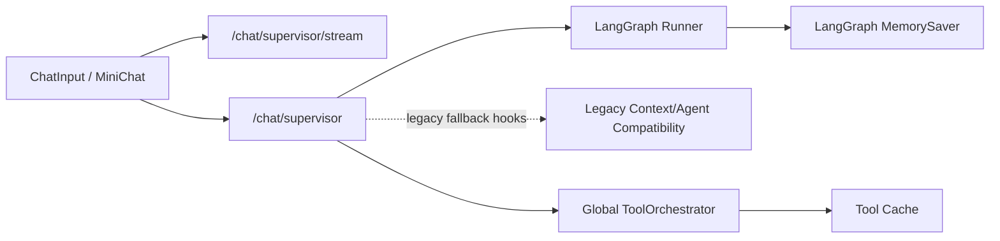
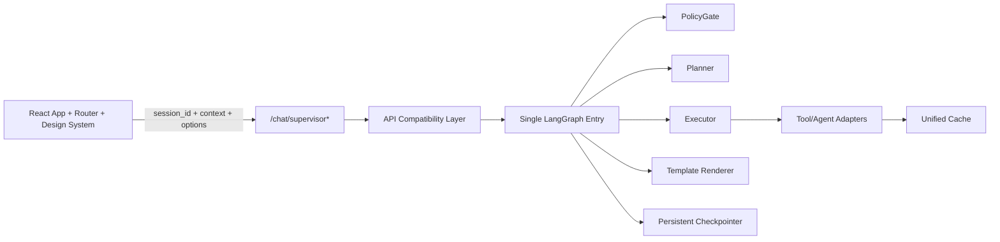
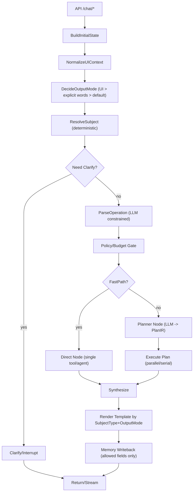
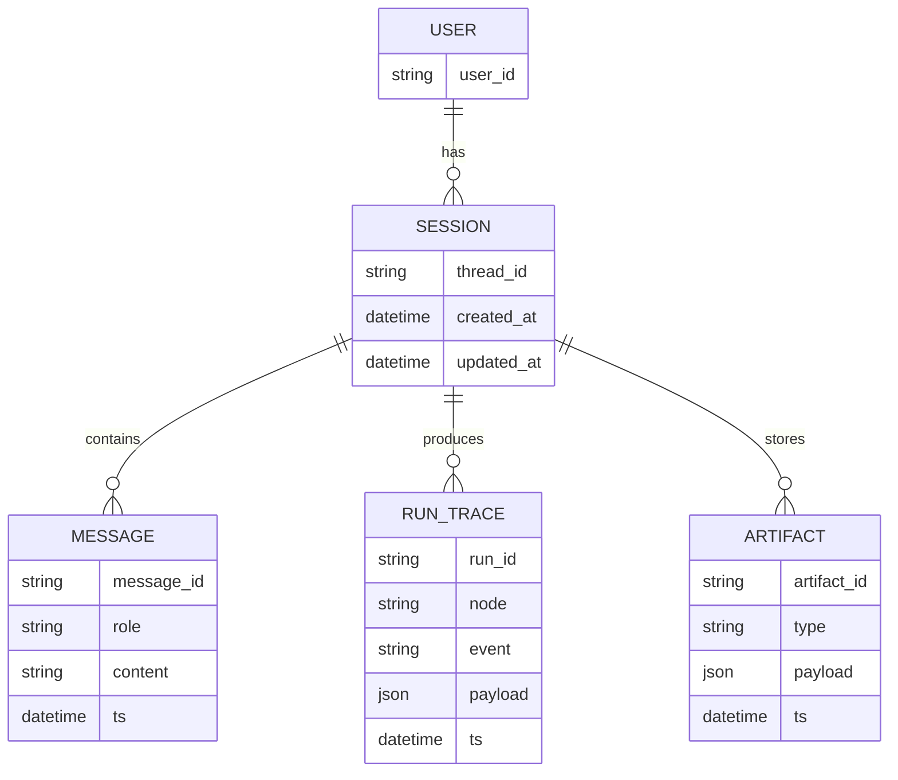

# FinSight LangGraph/LangChain 重构设计规范（设计 / 架构 / 约束指南）

> **状态**：Living Doc（持续更新）
> **更新日期**：2026-02-06
> **目的**：设计 / 前端 / 后端 / 产品团队的总包文件（架构与设计规范）
> **唯一真实来源（SSOT）**：本文件是 LangGraph 重构的唯一设计文件。当与历史文档冲突时，以本文件为准。具体的「变更记录」和「补充说明」见 `06b_LANGGRAPH_CHANGELOG.md`，TODO/路线图见 `AGENTIC_SPRINT_TODOLIST.md`。

---

## 0. 更新管理（重要！）

### 0.1 本文档的「小步」更新流程

- 任何与 LangGraph 重构相关的实现、测试、接口、UI 变动，均须登记在 `AGENTIC_SPRINT_TODOLIST.md` 的 **TODOLIST** 中作为目标（优先查找目标再写代码）。
- 每完成一个 **小步**（一个可独立合并并验证的单元），须更新 TODOLIST：
  - 标记应更新为 `TODO` → `DOING` → `DONE`（含规格 + 日期 + PR/commit 标注）
  - 必须附带验证证据（截图/日志关键字/ trace 记录）
- 每新增一项工具（比如：字段、输入、按钮位置、模板章节、预设测试），须同步写入 `06b_LANGGRAPH_CHANGELOG.md` 的 **变更记录**。

### 0.2 设计约束（防止再次雪山崩塌）

- 禁止无条件地图遍历 + if-else 嵌套来路由整个流程；路由必须通过 **显式 State + 常量映射 + 子图**。
- 禁止用 selection 来拼接 query（因为这样逻辑会被隐藏在模板和提示词中，而非作为唯一信号）。
- 不允许「猜测」输出格式；用 **显式 OutputMode** 让 UI 拿到确切格式（不再是「差不多差不多」）。

### 0.3 2026-02-06 的实际情况（Hard Truth）

> 以下是当前代码目前的状态，请以「代码与实际为准」，不再以历史「计划和设想」为准。

1. **架构双轨并行**：后端同时有 LangGraph（主） API 和若干 legacy 残留（历史的通过 `agent.context.resolve_reference`、`agent.orchestrator` 等兼容）。
2. **会话 ID 问题**：前端格式和服务端未稳定透传 `session_id`（曾用默认 `"new_session"` 会导致跨用户/跨窗口内存会话共享）。
3. **会话渲染与数据不稳定**：指令格式与容器数据的实现间存在缺少会话隔离码，容易出现跨上下文渲染。
4. **前端消息结构脆弱**：主界 Chat 和 MiniChat 间共享的消息格式、会话状态、上下文容器、输出模式的边界不够明确，存在过度「统一」实际分裂。
5. **文档与现实状态漂移**：历史章节中大量「计划和设想」，目标和实际结果之间不直接对照时一致性和可维护性差。

### 0.4 当前项目架构图（简明代码）

#### 0.4.1 当前（2026-02-06）



#### 0.4.2 目标（最终态）



### 0.5 2026-02-06 起执行的重构原则（强制）

1. API 层不再初始化 `ConversationAgent` 作为运行时主对象；仅保留兼容性测试钩子，不再参与主路由。
2. `session_id` 必须前端稳定透传，缺失时服务端生成 UUID，严禁固定默认传入。
3. 上下文容器须按 `session_id` 隔离，禁止全局上下文容器渲染。
4. 文档的「完成」只以验证为准：跑过 `pytest` + 前端 `build` + 必要的 e2e。
5. 所有重构工作须统一登记到 `AGENTIC_SPRINT_TODOLIST.md`，同步写入 Worklog。

---

## 1. 核心目标与非目标

### 1.1 目标（必须完成）

1. **单一入口**：所有请求以 LangGraph 为唯一调度入口，兼容现有 API 兼容层，让各终端走入同一个图。
2. **三维语义模型**：用 `subject_type + operation + output_mode` 取代 100+ Intent。
3. **Planner-Executor**：用 LLM 生成结构化计划（PlanIR），执行器按计划并行/串行调用各个 agent。
4. **按 subject_type 模板渲染**：让财报/公司/基金 等有不同模板；投标按 output_mode，让报告强制覆盖 8 章节。
5. **MiniChat 与主 Chat 完全融合**：共用同一个 `thread_id(session_id)` 的对话机器，将 UI selection 作为上下文标注（ephemral context，不写长期记忆册）。
6. **可观测可调试**：每个关键决策点都要在 trace 中可见（routing reason、plan、selected tools/agents、budget、fallback）。

### 1.2 非目标（暂不做 / 以后再做）

- 暂不做本轮以内的复杂对话「辩论式多轮」（如 AutoGen 群聊式），以可靠单轮调度为主。
- 暂不做本期内产品级别的基金管理功能层；但可以做复用，做到可以用 State/Plan 约束。

### 1.3 验收标准（核心场景）

- **场景 1：选中新闻 + 输入「分析影响」**：不应被错误理解为强制生成 `investment_report`；Planner 默认只获取必要信息（不执行"默认全桶"）。
- **场景 2：相同条件下点投资报告按钮**：同一条新闻带上 `output_mode=investment_report` 的结构化报告。这一次会触发 Planner 生成更丰富的信息计划（含拉更多 agent）。
- **场景 3：选中财报/文档 + 输入「总结要点」**：走 `subject_type=filing/doc` 的模板，不会被误导为公司型投资报告。
- **场景 4：无 selection，直接输入「投资计划」**：不需要用模板（要求明确提供投标按钮），默认 brief（可被文件规格覆盖），视为一次可查阅。

---

## 2. 三维语义模型（统一分类）

### 2.1 语义分类模型（从「意图爆炸」到三维）

| 维度 | 字段 | 说明 | 来源优先级 |
|---|---|---|---|
| Subject（主体） | `subject_type` | 用户当前处理的「东西是什么」 | selection > query(显式 ticker/公司名) > active_symbol |
| Operation（操作） | `operation` | 用户要对主体做什么 | LLM parse（受约束） > 简单规则映射 |
| Output（输出格式） | `output_mode` | 输出格式/深度（报告或图表） | UI 显式 > 明确词 > 默认 |

> **重要**：`investment_report` 不是「操作」的同义词；它是一个格式，一种输出模式。

### 2.2 SubjectType 规范（正式发布版）

> 说明：为了避免「早期当初 selection 的 `type="report"`」引发的分类冲突，我们将 selection 来源类型改为更准确的「内容来源类型」。

| SubjectType | 含义 | 来源与规则 |
|---|---|---|
| `news_item` | 单条新闻 | selection.type=`news` |
| `news_set` | 多条新闻集合 | selection 多条 |
| `company` | 公司/股票主题 | active_symbol / ticker |
| `filing` | 财报/公告（结构化 PDF） | selection.type=`filing`（含过期） |
| `research_doc` | 研报/文档/PDF | selection.type=`doc`（含过期） |
| `portfolio` | 持仓概览 | UI 模块 / watchlist |
| `unknown` | 未明确主体 | 需要 clarify |

### 2.3 Operation 规范（稳定小列表）

| Operation | 说明 | 示例 |
|---|---|---|
| `fetch` | 获取/列出 | 「最近有什么新闻」 |
| `summarize` | 总结 | 「总结这篇新闻」 |
| `analyze_impact` | 分析影响 | 「分析对股价影响」 |
| `price` | 价格/行情 | 「NVDA 最新股价是多少」 |
| `technical` | 技术面分析 | 「NVDA 技术面分析 / RSI/MACD」 |
| `qa` | 问答 | 「这篇新闻的关键词是什么」 |
| `extract_metrics` | 提取指标 | 「从财报中提取营收/利润」 |
| `compare` | 对比 | 「AAPL vs MSFT 哪个更好」 |
| `generate_report` | 生成研报（须配 output_mode=investment_report） | 「生成投资报告 / 研报」 |

> Operation 可以扩展，但必须通过常量映射到子图。不得让其扩展导致新的 if-else。

### 2.4 OutputMode（让 UI 拿到确切格式传入）

| OutputMode | 说明 | UI |
|---|---|---|
| `chat` | 普通对话（极短） | 默认返回 |
| `brief` | 结构化摘要（推荐默认） | 默认返回 |
| `investment_report` | 研报（完整，需拉多 agent） | **按钮触发专用** |

---

## 3. 目标架构概览（LangGraph 主图 + 子图）

### 3.1 完整主图（Mermaid）



### 3.2 分层职责（Clean Architecture 视角）

| 层 | 模块类型 | 示例 |
|---|---|---|
| Domain | 核心/计划/证据/模板的含义与数据结构 | `TaskSpec`, `PlanIR`, `EvidenceItem` |
| Use Case | Graph Nodes（路由、规划、执行、合成） | `ResolveSubjectNode`, `PlannerNode` |
| Adapters | 现有 agents/tools 的适配器 | `PriceAgentAdapter`, `NewsToolAdapter` |
| Frameworks | FastAPI、LangGraph runtime、SSE | `/chat/stream`, checkpointer |

### 3.3 验收标准（架构层）

- 所有语义入口最终走进 **同一个 LangGraph**（同一个入口函数），不允许散落在多个 Router/Supervisor 中路由。
- selection 的处理由 `ResolveSubject` 完成，不允许在入口或其他节点通过字符串 contains 来补充。

---

## 4. State 设计约束（后端/前端保持一致）

### 4.1 ChatRequest 扩展（建议）

> 说明：以下计划分批落实，添加可选字段即可，旧客户端不传也可以默认行为。

```python
# 伪代码（以 Pydantic v2 为例）
class ChatOptions(BaseModel):
    output_mode: Literal["chat", "brief", "investment_report"] | None = None
    strict_selection: bool | None = None  # 默认 False（用户要松散一些）
    locale: str | None = None             # e.g. "zh-CN"

class ChatContext(BaseModel):
    active_symbol: str | None = None
    view: str | None = None
    selections: list[SelectionContext] | None = None

class ChatRequest(BaseModel):
    query: str
    session_id: str | None = None
    context: ChatContext | None = None
    options: ChatOptions | None = None
```

### 4.2 LangGraph State（TypedDict 推荐字段）

```python
from typing import TypedDict, Literal, NotRequired

SubjectType = Literal["news_item","news_set","company","filing","research_doc","portfolio","unknown"]
OutputMode = Literal["chat","brief","investment_report"]

class Subject(TypedDict):
    subject_type: SubjectType
    tickers: list[str]
    selection_ids: list[str]
    selection_types: list[str]        # 原始 selection.type（news/filing/doc）
    selection_payload: list[dict]     # 标题/链接/摘要等结构化

class Operation(TypedDict):
    name: str
    confidence: float
    params: dict

class GraphState(TypedDict):
    thread_id: str
    messages: list[dict]              # LangChain messages
    query: str

    ui_context: NotRequired[dict]     # view/active_symbol/selections（ephemeral）
    subject: NotRequired[Subject]
    operation: NotRequired[Operation]
    output_mode: NotRequired[OutputMode]
    strict_selection: NotRequired[bool]

    policy: NotRequired[dict]         # PolicyGate 的输出（budget/allowlist/schema）
    plan_ir: NotRequired[dict]        # Planner 输出的结构化
    artifacts: NotRequired[dict]      # 执行结果集（news, filings, prices, evidence...）
    trace: NotRequired[dict]          # 路由/计划/执行轨迹
```

### 4.3 验收标准（设计约束）

- selection 必须以结构化字段进入 state，不允许拼接 query 来识别。
- `output_mode` 必须 UI 显式传入，来源优先级最高。
- `strict_selection` 默认 false（宽松），但输入必须保留此位以备未来进行活动。

---

## 5. Node/子图设计（常量映射消灭 if-else 蔓延）

### 5.1 核心 Nodes 清单（最小实现的小步集合）

| Node | 输入（读取字段） | 输出（写入字段） | 失败/回退 |
|---|---|---|---|
| `BuildInitialState` | request | `thread_id,messages,query,ui_context` | 无 |
| `NormalizeUIContext` | `ui_context` | 规范化 selections 去重 | 无 |
| `ResolveSubject` | `ui_context,query` | `subject`（deterministic） | `subject_type=unknown` |
| `Clarify` | `subject,query` | interrupt / clarify question | 统一错误回复 |
| `ParseOperation` | `query,subject` | `operation` | 简单规则兜底 |
| `DecideOutputMode` | `options,query` | `output_mode` | 默认 `brief` |
| `PolicyGate` | `output_mode,subject` | `policy/budget` | 触发 fastpath |
| `Planner` | `subject,operation,output_mode` | `plan_ir` | fallback 单 agent |
| `ExecutePlan` | `plan_ir` | `artifacts` | 单步失败记录 |
| `Synthesize` | `artifacts` | `draft_answer` | 简化回复 |
| `Render` | `subject_type,output_mode` | 最终 markdown | 模板缺失回退 |
| `MemoryWriteback` | `messages,selected_memory` | 持久化 | 只写允许字段 |

### 5.2 Subject 子图映射（常量表）

> 原则：调度只靠常量表路由到 `SubjectSubgraph[subject_type]`，每个子图内部按 operation 来支撑。

```python
SUBJECT_SUBGRAPHS = {
  "news_item": NewsSubgraph,
  "news_set": NewsSubgraph,
  "company": CompanySubgraph,
  "filing": FilingSubgraph,
  "research_doc": DocSubgraph,
  "portfolio": PortfolioSubgraph,
}
```

### 5.3 验收标准（消灭蔓延）

- 新增一个 subject_type 或 operation，不需要改超过 3 个 router；只需增加子图/节点并更新映射表。
- 所有路由逻辑不允许出现「关键词就是规则」全桶匹配、默认行为。

---

## 6. Planner-Executor（LLM 做计划，严格执行）

### 6.1 PlanIR（结构化计划的 Schema，最小字段）

```json
{
  "goal": "string",
  "subject": { "subject_type": "company|news_item|filing|...", "tickers": ["AAPL"], "selection_ids": ["..."] },
  "output_mode": "chat|brief|investment_report",
  "steps": [
    {
      "id": "s1",
      "kind": "tool|agent|llm",
      "name": "get_company_news|price_agent|news_agent|...",
      "inputs": { "ticker": "AAPL", "selection_ids": ["..."] },
      "parallel_group": "g1",
      "why": "一句话原因",
      "optional": true
    }
  ],
  "synthesis": {
    "style": "concise|structured",
    "sections": ["...等.."]
  },
  "budget": { "max_rounds": 6, "max_tools": 8 }
}
```

### 6.2 Planner 约束（防止「完美无法散步」）

- Planner 只能从白名单内的 `tools/agents`（由 PolicyGate 提供）。
- 默认 `output_mode=brief` 时，`budget.max_rounds` 缩小（禁止研报专用章节补全导致发散）。
- 有 selection 时，不要自由发散：**强制只围绕 selection**（即 Planner 锁定）：
  - 有 selection 作为高权重 evidence，不是忽略「去总结」。
  - 锁住后续 selection 去搜无关全市场（PolicyGate 可以限制）。

### 6.3 Executor 规则（并行/失败处理）

- 同一 `parallel_group` 的步骤并行执行，不同 group 串行。
- 任何 `optional=true` 失败不中止；写入 `artifacts.errors[]` ，合成器会提示「可选信息缺失」。
- 对同一工具的重复调用去重（key=tool+inputs hash）。

### 6.4 验收标准（Planner/Executor）

- Planner 的输出须被 Schema 校验（结构化 JSON），失败时走 fallback（见 8.3）。
- 分析影响时的「默认计划不包含 `fundamental+technical+macro+price` 全桶」除非 query 和 output_mode 明确要求。

---

## 7. 模板系统（按 SubjectType + OutputMode）

### 7.1 模板选择规则

| subject_type | output_mode=brief | output_mode=investment_report |
|---|---|---|
| `news_item/news_set` | 新闻简报 Brief 模板 | 新闻事件研报模板（不是公司研报 8 章） |
| `company` | 公司概况 Brief 模板 | 投资研报模板（完整扩展章节） |
| `filing/research_doc` | 文档摘要 Brief 模板 | 文档深度解读模板（带原文引用要求） |
| `portfolio` | 持仓摘要 Brief 模板 | 持仓全面报告模板 |

> 关键：**不要用一套通用 8 章模板覆盖所有 subject**。

### 7.2 示例：`news_item` Brief 模板（结构化）

```md
### 新闻摘要

### 影响分析
- 正面：
- 负面：

### 关键词与相关标的

### 风险与不确定性
```

### 7.3 示例：`company` 投资研报模板（结构化，可扩展章节）

```md
## 投资摘要
## 公司业务
## 关键催化剂与风险（事件）
## 基本面与估值（数据）
## 技术面
## 结论（含投资建议评级）
```

### 7.4 验收标准（模板层）

- 选中新闻 + `brief` 不应出现「公司研报内容空白」漏洞。
- 投资报告和研报时，模板按 subject_type 匹配（不要用「公司研报」渲染新闻研报）。

---

## 8. 前端设计（MiniChat 与主界面 + 研报按钮）

### 8.1 会话共享原则

- **共享**：同一个 `session_id/thread_id` 下的 messages/memory。
- **不共享写入**：`active_symbol/selections/view` 只作为临时注入 `context`（不写入长期 memory，避免交叉渲染）。

### 8.2 「生成投资报告」按钮（布局位置与交互）

#### 推荐位置

- 放在 **输入框右侧的发送区域**，和 `Send` 并排，在 Chat 和 MiniChat 同样位置（方便用户也找到）。
- 按钮启用条件（任一即时满足）：
  - 有 `active_symbol`
  - 有 selections 非空
- 条件不满也可以提示「请先选择一条消息内容再生成投标」。

#### 发送差异

- 按钮点击时使用同一个消息发送方法，但在 payload 中强制：`options.output_mode="investment_report"`。
- 普通发送按钮保持默认，`output_mode` 不传时服务端默认 `brief`。

### 8.3 前端发送示例（SSE）

```json
{
  "query": "分析影响",
  "session_id": "u123",
  "context": {
    "view": "dashboard",
    "active_symbol": "AAPL",
    "selections": [
      {"type":"news","id":"n1","title":"...","url":"...","snippet":"..."}
    ]
  },
  "options": {
    "output_mode": "investment_report",
    "strict_selection": false
  }
}
```

### 8.4 验收标准（前端部分）

- 在 Chat 和 MiniChat 间切换 session_id 下，历史对话一致，但 UI selection 是上下文而非偏向用户积累。
- 「生成投资报告」按钮只改变 output_mode，不改变用户输入（别注入「生成 研报」等关键词到输入框）。

---

## 9. 测试与验收（严格执行不可删路由）

### 9.1 测试矩阵（必须覆盖）

| Case ID | 场景 | UI Context | 期望 subject_type | 期望 output_mode | 关键验证 |
|---|---|---|---|---|---|
| T-N1 | 分析新闻影响 | selection=news(1) | `news_item` | `brief` | 不生成 investment_report；计划不默认全桶 |
| T-N2 | 分析新闻影响（含研报） | selection=news(1) | `news_item` | `investment_report` | 模板为新闻研报；Planner 可以适当扩展 |
| T-C1 | 分析投资计划 | active_symbol=AAPL | `company` | `brief` | 不强制生成报告 |
| T-C2 | 生成投资报告 | active_symbol=AAPL | `company` | `investment_report` | 生成公司研报结构 |
| T-F1 | 「总结要点」 | selection=filing(1) | `filing` | `brief` | 文档摘要模板 |
| T-P1 | 「对比AAPL和MSFT」 | none | `company`/`portfolio` | `brief` | operation=compare；计划包含对比所需信息 |
| T-T1 | 「NVDA 最新股价和技术面分析」 | active_symbol=GOOGL | `company` | `brief` | subject 应为 NVDA；operation=technical；计划含 price+technical |

### 9.2 测试建议（审查）

- `test_resolve_subject_selection_priority.py`
- `test_output_mode_ui_override.py`
- `test_planner_planir_schema_validation.py`
- `test_executor_parallel_groups.py`
- `test_news_brief_template_no_empty_chapters.py`

### 9.3 验收标准（测试部分）

- 每个 Case 至少 1 个自动化测试（pytest）。
- 关键 trace 记录可断言（比如：`routing.subject_type`、`planner.plan_created`、`executor.step_started`）。

---

## 12. 记录、持久化/存储 ER 图（可选实现）

> 说明：以下仅是为 Planner、artifact、report 结构的提案，可按需扩展。


