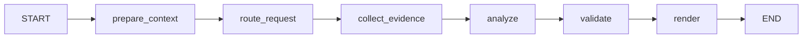

# LangGraph 生产设计规范

更新时间：2026-07-16

本文记录当前分支的运行时不变量。节点与边以 `backend/graph/runner.py` 为最终事实源；本文不代表某个 commit 已部署，也不替代生产验收证据。

## 1. 唯一主图

```mermaid
flowchart LR
    START --> PC[prepare_context]
    PC --> RR[route_request]
    RR --> CE[collect_evidence]
    CE --> AN[analyze]
    AN --> VA[validate]
    VA --> RE[render]
    RE --> END
```

图固定为六个节点。`direct`、`research`、`clarify` 三种 lane 在节点内部按结构化 route 决定是否跳过工作，不再通过第二套图、旧节点或兼容引擎分流。

| Lane | 外部工具 | 业务 LLM | 结果 |
|---|---:|---:|---|
| `direct` | 0 | 0 | 确定性术语解释或直接回复 |
| `clarify` | 0 | 0 | 缺失标的或范围的明确追问 |
| `research` 事实查询 | 按计划 | 0 | 基于证据的确定性渲染 |
| `research` 分析/观点 | 按计划 | 最多 1 次 `ResearchAnalyst` | 经验证的分析答案 |
| 长报告 | 按计划 | 1 次分析，可追加 1 次 verifier | 质量门通过后发布 |

Prediction 不经过 Chat 图生成，由独立 `PredictionAnalyst` 服务处理。

## 2. 节点职责

1. `prepare_context`：初始化本轮状态，裁剪/摘要当前 thread 历史，规范化 UI 上下文；不得读取跨 thread 用户画像。
2. `route_request`：用确定性规则生成 understanding、request frame、tasks、blocked tasks 和 render identity；不得调用 LLM。
3. `collect_evidence`：只对 `research` lane 执行 policy、规则计划、DAG 和外部 I/O；其他 lane 必须零 I/O。
4. `analyze`：事实查询构造确定性 render vars；需要判断的请求最多调用一次 `ResearchAnalyst`。
5. `validate`：汇总 evidence、Claim、引用、拒绝项和质量阻断状态；diagnostics 不能进入 evidence pool。
6. `render`：只消费已验证产物并生成最终回复，同时把当前 thread 的必要焦点和报告上下文写入 checkpoint。

planning、policy、execution、synthesis 和 rendering 的实现分别归属对应目录。节点只做边界编排，不在节点里复制另一层的规则。

## 3. Collector 与 LLM 边界

- Price、News、Fundamental、Technical、Macro、Risk、Deep Search 是内部 evidence collector profile，不是七个可配置 LLM 人格。
- `collector_adapter` 以 `llm=None` 构造 collector；`BaseFinancialAgent` 丢弃兼容参数，collector 只调用工具、规范化数据并封装证据。
- 普通研究禁止 reflection、补充搜索循环、research debate 和动态 collector registry。
- 业务 LLM 角色只允许 `ResearchAnalyst` 与 `PredictionAnalyst`；工具、planner、router 和 renderer 不得暗中增加业务 LLM 调用。
- `PredictionAnalyst` 只能返回 Prediction JSON；anchor、可信行情、指标、约束校验和最终落库由服务端控制。

## 4. 证据与失败语义

- 规划只能选择 capability registry 和 policy 允许的工具/collector。
- `failed`、`timeout`、`empty`、`rejected` 和 fallback 文本进入 diagnostics，不得伪装为事实证据。
- 每条确定性 Claim 必须能映射到 evidence id；需要引用的回答必须保留 URL 或明确说明来源不可用。
- provider、`as_of`、freshness、quality 必须跨工具、证据、合成和 UI 保留。
- `quality != trusted` 的 Kline 不得进入 Prediction anchor 或 Outcome。
- synthesis 与 renderer 不调用工具，不制造证据池外的数字、时间序列或引用。
- 每个 task 必须结算为 `answered`、`partial`、`unavailable` 或 `blocked`，不能静默丢失。

## 5. 状态与持久化

- 生产 LangGraph checkpointer 使用 PostgreSQL；开发测试可显式使用内存 checkpointer。
- 同一 thread 的焦点与报告追问上下文随 checkpoint 保存；不存在 JSON Memory 或跨 thread 用户画像回退。
- 会话、Watchlist、报告、Prediction、Outcome、Monitor、LLM usage 均以 PostgreSQL 为核心写路径。
- RAG 的 memory 只消费当前 thread 的可信上下文；working set 与 knowledge base 使用 PostgreSQL/pgvector。
- 应用启动只检查 Alembic revision，不在启动或请求路径创建核心表。

## 6. 事件与安全

- Chat/Report 只保留一个 SSE 执行入口；事件合同以 `execution-event-contract.md` 为准。
- 事件、证据、checkpoint 和业务记录必须同时遵守 user、thread、run scope。
- 降级、取消和终态必须显式发送，前端不得把认证、行情、LLM、配额和存储错误折叠成同一个“暂不可用”。
- 生产受保护 API 必须使用有效用户身份；公开共享报告只读且以不可枚举 token 访问。

## 7. 禁止回归

- 不恢复 `legacy_engine.py`、`*_stub.py`、旧节点主图、confirmation loop、research debate 或 reflection。
- 不恢复 Agent 偏好 API、浏览器 Agent 选择、第二套执行器或 JSON/SQLite 核心写路径。
- 不从任意 collector 执行后隐式生成 Prediction。
- 不用 synthetic/mock OHLC、搜索摘要数字或模型生成序列替代真实 Kline。
- 不在下游重新按原始 query 猜 operation、ticker、render kind 或安全策略。

## 8. 变更验收

任何跨层改动至少满足：

- 图节点/边、GraphState 生产者和消费者同步；
- capability、policy、计划与 evidence gate 同步；
- 后端合同、OpenAPI、前端类型和消费逻辑同步；
- 受影响的定向测试通过，跨层变化有集成测试；
- README、架构文档和 Mermaid 与代码一致；
- 不含真实密钥、临时调试代码、孤儿环境变量或未解释兼容分支。
