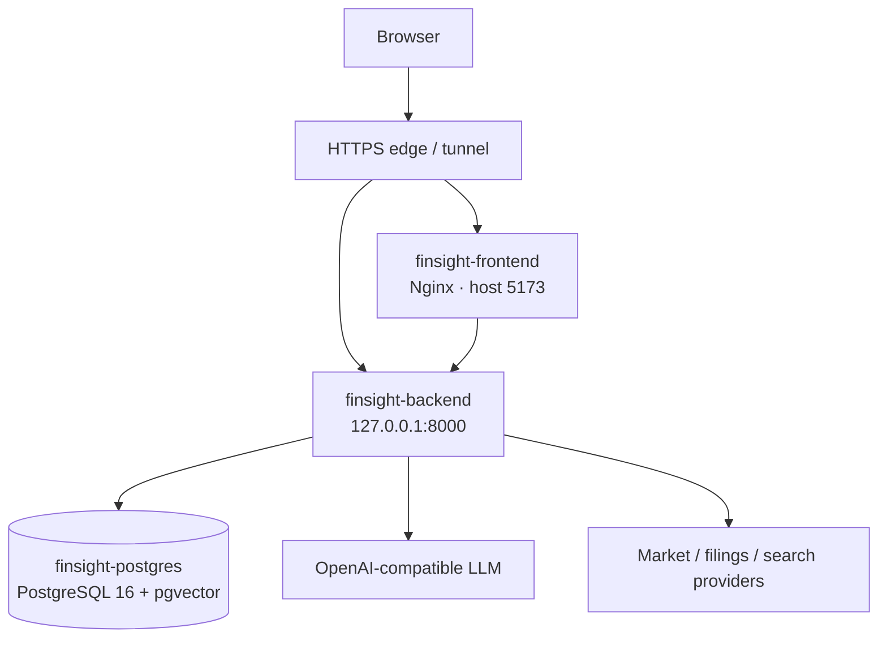

# FinSight 生产部署 Runbook

更新时间：2026-07-13

## 1. 当前拓扑



生产目录：`/home/ubuntu/FinSight`。Compose 服务名为 `postgres`、`backend`、`frontend`，容器名分别为 `finsight-postgres`、`finsight-backend`、`finsight-frontend`。

## 2. Secret 与关键配置

服务器本地 `.env.server` 是 secret 文件，不进入 Git、镜像层、文档或部署证据。至少需要：

```env
OPENAI_COMPATIBLE_API_KEY=...
OPENAI_COMPATIBLE_API_BASE=https://provider.example/v1
OPENAI_COMPATIBLE_MODEL=model-id
FINSIGHT_CONTEXT_ROUTER_MAX_TIMEOUT_SEC=45
FINSIGHT_CONTEXT_REPLY_MAX_TIMEOUT_SEC=60
```

若 OpenAI-compatible 代理与 FinSight 部署在同一台 Linux 宿主机，不要填写宿主机公网 IP；应使用
`OPENAI_COMPATIBLE_API_BASE=http://host.docker.internal/v1`。生产 Compose 已将
`host.docker.internal` 映射到 Docker host gateway，可避免公网回源的 hairpin NAT 连接抖动。

LLM 供应商可替换，只要支持 OpenAI-compatible API。生产 RAG 和 checkpointer 使用 Compose 注入的 PostgreSQL DSN：

```env
RAG_V2_BACKEND=postgres
LANGGRAPH_CHECKPOINTER_BACKEND=postgres
LANGGRAPH_CHECKPOINTER_ALLOW_MEMORY_FALLBACK=false
```

不得把真实 key 作为 Docker build arg、命令行参数或提交内容。轮换时只修改服务器 `.env.server` 或受控配置存储并重启相关服务。

## 3. 发布前门禁

跨层发布至少完成：

```bash
python -m pytest backend/tests -q
npm run test:unit --prefix frontend
npm run build --prefix frontend
docker compose --env-file .env.server config --quiet
```

涉及真实交互时追加 Playwright。涉及 schema/迁移时，必须先备份数据库并准备向后兼容回滚；数据库结构变更仍需单独授权。

- [ ] 工作区目标版本已确定，用户改动未被覆盖。
- [ ] 文档、规格、OpenAPI/前端类型与代码同步。
- [ ] 无真实密钥、调试端点或无保护诊断入口。
- [ ] PostgreSQL、后端、前端现有容器健康。
- [ ] 已记录上一稳定镜像或 commit，能够回滚。

## 4. 部署

```bash
cd /home/ubuntu/FinSight
git status --short
git fetch --all --tags
# 将工作树更新到本次已验证版本；不要覆盖服务器本地 .env.server。
docker compose --env-file .env.server up -d --build
docker compose --env-file .env.server ps
```

仅文档变化不需要重建容器；前后端代码、依赖或 Dockerfile 变化应重建受影响服务。

## 5. 部署后冒烟

```bash
curl -fsS http://127.0.0.1:8000/health
curl -fsS http://127.0.0.1:5173/ >/dev/null
docker compose --env-file .env.server ps
docker compose --env-file .env.server logs --tail=100 backend frontend
```

再从公网验证首页、`/chat`、`/dashboard/AAPL`、`/screener`，并确认纯社交请求快速结束、研究请求产生 SSE 事件并完成 evidence → synthesis → render。聊天至少用同一 session 连续验证“明确标的 → 省略式追问 → 风险追问”；标的焦点必须保持，助手正文中的大写缩写不得污染 subject。若 LLM 失败，响应必须出现 `degraded` 事件/字段和前端警告，不得表现为正常成功。不得在冒烟命令、截图或日志摘录中打印 LLM key。

## 6. 回滚

持续 5xx、健康检查失败、SSE 大面积中断、数据库连接/迁移异常、身份隔离失败或明显错误研究输出均应触发回滚：

1. 停止继续发布。
2. 将代码或镜像恢复到上一稳定版本。
3. 使用原 `.env.server` 重建/启动服务。
4. 数据迁移只按已批准的回滚方案恢复，不临时猜测 SQL。
5. 重跑健康检查和关键冒烟，记录原因、影响和恢复时间。

## 7. 日常检查

```bash
docker compose --env-file .env.server ps
docker compose --env-file .env.server logs --since=30m backend
docker exec finsight-postgres pg_isready -U finsight
```

关注 5xx、P95、LLM 错误率/熔断、PostgreSQL 连接、磁盘/volume、RAG 空结果率、SSE 断开率和用户成本配额。
