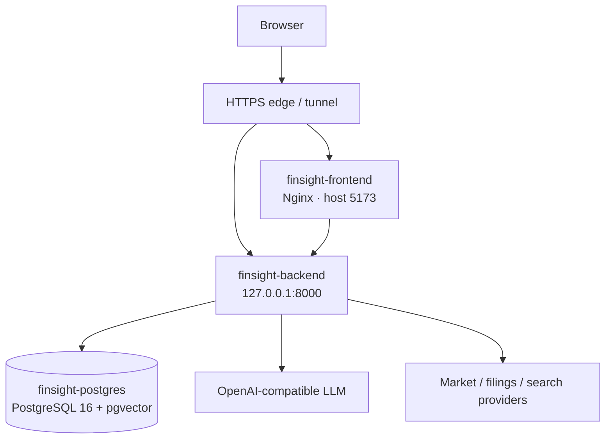

# FinSight 生产部署 Runbook

更新时间：2026-07-15

## 1. 当前拓扑



生产目录：`/home/ubuntu/FinSight`。Compose 服务名为 `postgres`、`backend`、`frontend`，容器名分别为 `finsight-postgres`、`finsight-backend`、`finsight-frontend`。

## 2. Secret 与关键配置

服务器本地 `.env.server` 是 secret 文件，不进入 Git、镜像层、文档或部署证据。至少需要：

```env
APP_MODE=production
SUPABASE_AUTH_REQUIRED=true
SUPABASE_URL=https://project.example.supabase.co
SUPABASE_PUBLISHABLE_KEY=...
OPENAI_COMPATIBLE_API_KEY=...
OPENAI_COMPATIBLE_API_BASE=https://provider.example/v1
OPENAI_COMPATIBLE_MODEL=model-id
FINSIGHT_CONTEXT_ROUTER_MAX_TIMEOUT_SEC=45
FINSIGHT_CONTEXT_REPLY_MAX_TIMEOUT_SEC=60
FINSIGHT_INTENT_FRAME=on
FINSIGHT_DAG_EXECUTOR=on
FINSIGHT_AGENT_BRIEF=on
FINSIGHT_EVIDENCE_BUS=on
FINSIGHT_FINANCIAL_TERM_RESOLVER=on
FINSIGHT_STRUCTURED_SYNTHESIS=shadow
LANGGRAPH_EXECUTE_LIVE_TOOLS=true
AGENT_LLM_ANALYZE_ENABLED=true
LANGGRAPH_SYNTHESIZE_MODE=llm
```

若 OpenAI-compatible 代理与 FinSight 部署在同一台 Linux 宿主机，不要填写宿主机公网 IP；应使用
`OPENAI_COMPATIBLE_API_BASE=http://host.docker.internal/v1`。生产 Compose 已将
`host.docker.internal` 映射到 Docker host gateway，可避免公网回源的 hairpin NAT 连接抖动。

LLM 供应商可替换，只要支持 OpenAI-compatible API。生产 RAG 和 checkpointer 使用 Compose 注入的 PostgreSQL DSN：

```env
RAG_V2_BACKEND=postgres
LANGGRAPH_CHECKPOINTER_BACKEND=postgres
LANGGRAPH_CHECKPOINTER_ALLOW_MEMORY_FALLBACK=false
```

不得把真实 key 作为 Docker build arg、命令行参数或提交内容。轮换时只修改服务器 `.env.server` 或受控配置存储并重启相关服务。

生产环境不得把认证、Prediction、Outcome 或页面 lease 隐式降级为匿名模式。启动前至少检查以下组合，但检查命令只能输出布尔状态，不能回显值：

```text
APP_MODE=production
SUPABASE_AUTH_REQUIRED=true
SUPABASE_URL 与 SUPABASE_PUBLISHABLE_KEY 同时存在
OPENAI_COMPATIBLE_API_KEY / API_BASE / MODEL 同时存在
FINSIGHT_PREDICTION_SUBMIT_ENABLED=true
PREDICTION_OUTCOME_SCHEDULER_ENABLED=true
```

### 2.1 代理隔离

`YFINANCE_PROXY` 只由 yfinance 使用，`SEARCH_PROXY` 只由搜索客户端使用；两者不得写入或覆盖
`HTTP_PROXY`、`HTTPS_PROXY`。在修改前保留既有绕过列表后，以大小写不敏感去重方式合并
`host.docker.internal,localhost,127.0.0.1` 到 `NO_PROXY` 和 `no_proxy`，且两者最终必须相同。

部署后从 backend 容器分别在导入 `backend.tools` 前后验证 LLM gateway 可达；若 yfinance 代理值需要
改变，必须修改 `.env.server` 后重启 backend，不能在运行中热改。

## 3. 发布前门禁

### 3.1 基线、备份与恢复验证

先在代码工作区生成不读取环境变量、不输出 secret 的静态基线：

```bash
python scripts/audit_product_baseline.py --output .omx/evidence/product-baseline.json
```

数据库迁移或大规模删除前必须同时备份 PostgreSQL、`backend_data` volume、仍待迁移的 SQLite/JSON、`.env.server` 和运行镜像元数据。备份目录权限设为 `0700`，文件权限设为 `0600`。PostgreSQL dump 不能只运行 `pg_restore --list`，还必须恢复到临时数据库，并核对 public 表数量后删除临时库。

```bash
umask 077
stamp="$(date -u +%Y%m%dT%H%M%SZ)"
backup_dir="$HOME/finsight-backups/$stamp"
mkdir -p "$backup_dir"
docker exec finsight-postgres sh -lc \
  'pg_dump -U "$POSTGRES_USER" -d "$POSTGRES_DB" -Fc' \
  > "$backup_dir/postgres.dump"
docker exec finsight-backend tar -C /app/data -czf - . \
  > "$backup_dir/backend-data.tar.gz"
cp .env.server docker-compose.yml "$backup_dir/"
docker inspect finsight-postgres finsight-backend finsight-frontend \
  > "$backup_dir/docker-inspect.json"
sha256sum "$backup_dir"/* > "$backup_dir/SHA256SUMS"
chmod 700 "$backup_dir"
chmod 600 "$backup_dir"/*
```

恢复演练必须使用独立临时库，禁止覆盖生产库。演练完成后确认临时库已删除，并保存源库/恢复库表数和 checksum 作为发布证据。

### 3.2 SSH 门禁

生产只允许已登记的 ED25519 公钥登录。变更 SSH 配置时按固定顺序执行：先确认现有密钥指纹，写入 `PasswordAuthentication no`、`KbdInteractiveAuthentication no`、`PermitRootLogin no`，运行 `sshd -t`，重载服务，在第二个新会话中验证密钥登录，最后锁定旧密码。任何一步失败都不得关闭当前会话。

每次发布检查最近七天 SSH 失败次数和成功认证方式。异常暴增时先保存 `journalctl -u ssh` 与云厂商审计证据，再继续发布。

先执行只读磁盘门禁：

```bash
df -h /
docker system df
sudo du -xhd1 /var/lib/docker "$HOME" 2>/dev/null
```

根分区使用率 `>= 90%` 或可用空间 `< 5 GiB` 时立即停止 build、pull、up、数据库操作和日志压测；使用率 `85%-89%` 时记录容量负责人和预计增长。只有使用率 `< 90%` 且可用空间 `>= 5 GiB` 才能继续。任何磁盘清理都必须先列出对象并另行取得授权，禁止把 `docker system prune -a --volumes` 当作发布步骤。

跨层发布至少完成：

```bash
python -m pytest backend/tests -q
npm run test:unit --prefix frontend
npm run build --prefix frontend
docker compose --env-file .env.server config --quiet
```

涉及真实交互时追加 Playwright。涉及 schema/迁移时，必须先备份数据库并准备向后兼容回滚；数据库结构变更仍需单独授权。

- [ ] 工作区目标版本已确定，用户改动未被覆盖。
- [ ] 文档、规格、OpenAPI/前端类型与代码同步。
- [ ] 无真实密钥、调试端点或无保护诊断入口。
- [ ] PostgreSQL、后端、前端现有容器健康。
- [ ] 已记录上一稳定镜像或 commit，能够回滚。

## 4. 部署

```bash
cd /home/ubuntu/FinSight
git status --short
git fetch --all --tags
# 将工作树更新到本次已验证版本；不要覆盖服务器本地 .env.server。
docker compose --env-file .env.server up -d --build
docker compose --env-file .env.server ps
```

仅文档变化不需要重建容器；前后端代码、依赖或 Dockerfile 变化应重建受影响服务。

首次发布保持 `FINSIGHT_STRUCTURED_SYNTHESIS=shadow`：只执行确定性转换、校验、coverage 和 gate 观测，不增加第二次 LLM 调用，也不改变旧正文。至少观察 30 分钟且累计 20 个逻辑 LLM 调用，确认无请求放大、task coverage 缺口或敏感日志后，才改为 `on` 并重启 backend。术语 resolver 默认 `on`；代理隔离、health 白名单和 LLM fail-fast 不设关闭开关。

## 5. 部署后冒烟

```bash
curl -fsS http://127.0.0.1:8000/health
curl -fsS http://127.0.0.1:5173/ >/dev/null
docker compose --env-file .env.server ps
docker compose --env-file .env.server logs --tail=100 backend frontend
```

`/health` 只允许固定组件状态和 UTC 时间戳，递归检查不得出现 query、recent run、URL、异常文本、模型、token、key、DSN 或内部配置。Prediction latest 与 Monitor comments 的 GET/SSE 均为严格只读；空 latest 返回 204，不得为冒烟插入记录或触发 schema helper。

再从公网验证首页、`/chat`、`/dashboard/AAPL`、`/workbench`、`/screener`。Dashboard 必须只有一张主 K 线并显示“日线快照”与 `as_of`；“问 AI”只把 draft/context 交给主 Chat，不自动发送；Workbench 默认页不超过三条待处理、一行持仓摘要和一份报告，四个 tab 均可达。

确认纯社交请求快速结束、研究请求产生 SSE 事件并完成 evidence → synthesis → render。聊天至少用同一 session 连续验证“明确标的 → 推荐怎么操作？ → 那风险呢？”；后两问必须保持标的焦点并生成对应研究任务，即使 trace 显示 router LLM 降级也不得返回泛化文案。助手正文中的大写缩写不得污染 subject。另用纯 PE 定义确认 direct/zero-LLM，用“AAPL 当前 PE”确认进入取值研究，用“NVDA 和 AMD 哪个估值更合理，并说明宏观环境”确认每个 task 均可见且逐标的给出可比证据或明确缺口；无证据 opinion 不得给方向性结论。用“NVDA 最近一个月价格走势图”检查前端请求周期为 `1mo`、图表标题为价格趋势而非收益率趋势、日期对应值为真实收盘价，价格轴不得强制从零开始，且 tooltip 有正确货币单位和至多两位小数。HTTP 200、容器 healthy 或 `degraded=false` 都不能替代答案语义检查。若 LLM 失败，响应必须出现 `degraded` 事件/字段和前端警告，不得表现为正常成功。不得在冒烟命令、截图或日志摘录中打印 LLM key。

## 6. 回滚

持续 5xx、健康检查失败、SSE 大面积中断、数据库连接/迁移异常、身份隔离失败或明显错误研究输出均应触发回滚：

1. 停止继续发布。
2. 将代码或镜像恢复到上一稳定版本。
3. 使用原 `.env.server` 重建/启动服务。
4. 数据迁移只按已批准的回滚方案恢复，不临时猜测 SQL。
5. 重跑健康检查和关键冒烟，记录原因、影响和恢复时间。

## 7. 日常检查

```bash
docker compose --env-file .env.server ps
docker compose --env-file .env.server logs --since=30m backend
docker exec finsight-postgres pg_isready -U finsight
```

关注 5xx、P95、LLM 错误率/熔断、PostgreSQL 连接、磁盘/volume、RAG 空结果率、SSE 断开率和用户成本配额。
