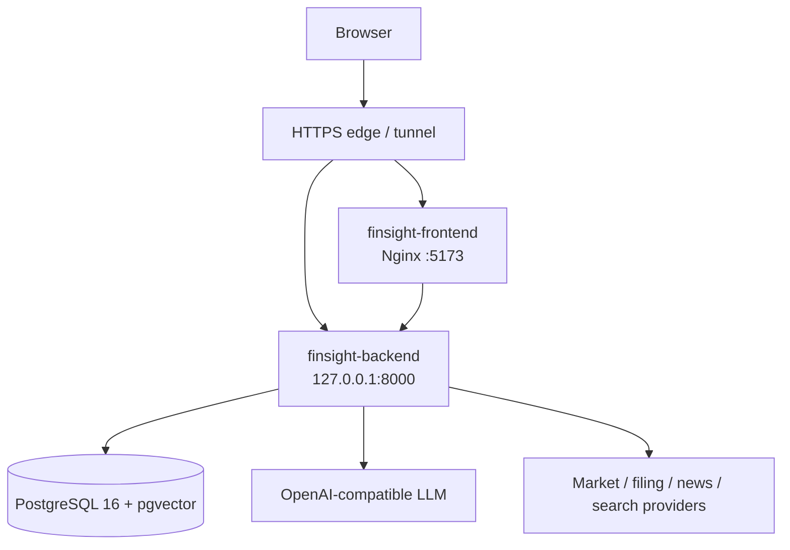

# FinSight 生产发布 Runbook

更新时间：2026-07-16

本文是 FinSight 当前唯一生产发布流程。生产目录为 `/home/ubuntu/FinSight`，Compose 服务为
`postgres`、`backend`、`frontend`。发布必须使用同一个 Git commit SHA 构建前后端镜像；禁止用
`latest`、未提交工作区或旧 SQLite/JSON 运行路径部署。

## 1. 发布不变量



- 核心业务只写 PostgreSQL；schema 只由 Alembic 管理，应用启动不建表。
- 生产必须启用 Supabase 认证；Prediction、Chat、History、Watchlist、Monitor 均不得匿名写入。
- Price、Technical、Fundamental、News、Macro、Risk 和 Deep Search 只采集证据，不独立调用 LLM，
  不运行 reflection、补充搜索循环或动态委托。
- 业务 LLM 角色只有 `PredictionAnalyst` 与 `ResearchAnalyst`；长报告可以追加一次 verifier。
- Prediction 只接受可信 provider 的真实 K 线；provider/LLM 失败必须返回稳定错误码，不生成替代行情或方向性假结论。
- 常规发布不读取、备份或恢复旧 SQLite/JSON。`scripts/migrate_legacy_storage.py` 只用于经批准的一次性离线导入。
- `.env.server` 只保存在服务器受限目录，不进入 Git、镜像层、命令参数、日志、截图或发布证据。

## 2. 必需配置

部署前确认 `.env.server` 至少满足以下组合。检查时只输出“存在/不存在”或布尔值，不回显内容。

```text
APP_MODE=production
SUPABASE_AUTH_REQUIRED=true
SUPABASE_URL、SUPABASE_PUBLISHABLE_KEY 完整且与前端构建配置同源
POSTGRES_DB、POSTGRES_USER、POSTGRES_PASSWORD 完整
OPENAI_COMPATIBLE_API_KEY、OPENAI_COMPATIBLE_API_BASE、OPENAI_COMPATIBLE_MODEL 完整
MARKET_KLINE_PRIMARY_PROVIDER 在 MARKET_KLINE_TRUSTED_PROVIDERS 中
PREDICTION_GENERATION_ENABLED=true
PREDICTION_PROMPT_VERSION=prediction-analyst-v1
PREDICTION_RUN_TIMEOUT_SECONDS=75
PREDICTION_LLM_ATTEMPT_TIMEOUT_SECONDS=30
PREDICTION_MAX_CONCURRENT_RUNS=2
PREDICTION_OUTCOME_SCHEDULER_ENABLED=true
MONITOR_REALTIME_ENABLED=true
LANGGRAPH_EXECUTE_LIVE_TOOLS=true
LANGGRAPH_SYNTHESIZE_MODE=llm
RAG_V2_BACKEND=postgres
LANGGRAPH_CHECKPOINTER_BACKEND=postgres
LANGGRAPH_CHECKPOINTER_ALLOW_MEMORY_FALLBACK=false
```

`YFINANCE_PROXY` 只允许由 yfinance 客户端读取，`SEARCH_PROXY` 只允许由搜索客户端读取；两者不得
覆盖进程级 `HTTP_PROXY`/`HTTPS_PROXY`。`NO_PROXY` 与 `no_proxy` 必须相同，并至少包含
`host.docker.internal,localhost,127.0.0.1`。同宿主机 LLM 网关使用
`http://host.docker.internal/v1`，不经公网地址回源。

## 3. 本地发布门禁

从干净、已提交的目标 SHA 执行。任何一步失败都停止发布并修复根因，不带失败结果进入生产。

```bash
git status --short
sha="$(git rev-parse HEAD)"
test -n "$sha"
python -m compileall -q backend scripts
python -m pytest backend/tests -q
python -m pytest tests/golden -q
pnpm --dir frontend lint
pnpm --dir frontend test:unit
pnpm --dir frontend build
pnpm --dir frontend test:e2e
python scripts/audit_product_baseline.py --output .omx/evidence/product-baseline.json
docker compose --env-file .env.server config --quiet
```

同时确认：

- FastAPI Router 不超过 9，OpenAPI 操作不超过 35，前端产品路由恰好 5 个。
- OpenAPI snapshot 与 `frontend/src/api/schema.d.ts` 已由目标代码重新生成。
- greeting、news impact、single report 三类 golden 已重录并人工检查引用、降级语义与最终正文。
- 仓库、构建参数和镜像 history 不含真实 key、token、密码、Cookie 或 DSN。
- 桌面与移动关键路径已通过 Playwright；不能只以 HTTP 200 或容器 healthy 代替语义验收。

## 4. 生产预检与备份

登录后先进入生产目录，确认服务器工作区没有本地改动，记录上一稳定 SHA 与镜像 ID。发布所需空间门禁为：
根分区使用率 `< 90%` 且可用空间 `>= 5 GiB`。

```bash
set -euo pipefail
cd /home/ubuntu/FinSight
git status --short
test -z "$(git status --porcelain)"
df -h /
docker system df
docker compose --env-file .env.server ps
previous_sha="$(git rev-parse HEAD)"
docker image inspect "finsight-backend:${previous_sha}" --format '{{.Id}}' || true
docker image inspect "finsight-frontend:${previous_sha}" --format '{{.Id}}' || true
```

PostgreSQL 备份必须实际恢复到临时数据库；`pg_restore --list` 不能替代恢复演练。备份目录不得纳入发布证据同步。

```bash
umask 077
stamp="$(date -u +%Y%m%dT%H%M%SZ)"
backup_dir="$HOME/finsight-backups/$stamp"
restore_db="finsight_restore_${stamp//[^0-9A-Za-z_]/_}"
mkdir -p "$backup_dir"

docker compose --env-file .env.server exec -T postgres sh -lc \
  'pg_dump -U "$POSTGRES_USER" -d "$POSTGRES_DB" -Fc' \
  > "$backup_dir/postgres.dump"
test -s "$backup_dir/postgres.dump"
cp docker-compose.yml "$backup_dir/"
docker inspect finsight-postgres finsight-backend finsight-frontend \
  > "$backup_dir/docker-inspect.json"
sha256sum "$backup_dir"/* > "$backup_dir/SHA256SUMS"

docker compose --env-file .env.server exec -e RESTORE_DB="$restore_db" -T postgres sh -lc \
  'createdb -U "$POSTGRES_USER" "$RESTORE_DB"'
docker compose --env-file .env.server exec -e RESTORE_DB="$restore_db" -T postgres sh -lc \
  'pg_restore -U "$POSTGRES_USER" -d "$RESTORE_DB" --exit-on-error' \
  < "$backup_dir/postgres.dump"

source_tables="$(docker compose --env-file .env.server exec -T postgres sh -lc \
  'psql -U "$POSTGRES_USER" -d "$POSTGRES_DB" -Atc "select count(*) from pg_tables where schemaname='"'"'public'"'"'"')"
restored_tables="$(docker compose --env-file .env.server exec -e RESTORE_DB="$restore_db" -T postgres sh -lc \
  'psql -U "$POSTGRES_USER" -d "$RESTORE_DB" -Atc "select count(*) from pg_tables where schemaname='"'"'public'"'"'"')"
test "$source_tables" -gt 0
test "$source_tables" -eq "$restored_tables"
docker compose --env-file .env.server exec -e RESTORE_DB="$restore_db" -T postgres sh -lc \
  'dropdb -U "$POSTGRES_USER" "$RESTORE_DB"'
```

## 5. Alembic 回滚演练

先构建目标 backend 镜像，再在独立临时数据库执行 `upgrade -> downgrade 一版 -> upgrade`。不得用生产库做回滚演练。

```bash
sha="$(git rev-parse HEAD)"
export IMAGE_TAG="$sha"
docker compose --env-file .env.server build backend

drill_db="finsight_migration_drill_$(date -u +%Y%m%d%H%M%S)"
docker compose --env-file .env.server exec -e DRILL_DB="$drill_db" -T postgres sh -lc \
  'createdb -U "$POSTGRES_USER" "$DRILL_DB"'
docker compose --env-file .env.server run --rm -e DRILL_DB="$drill_db" backend sh -lc \
  'export FINSIGHT_POSTGRES_DSN="${FINSIGHT_POSTGRES_DSN%/*}/$DRILL_DB"; \
   alembic upgrade head; alembic current; \
   alembic downgrade 20260716_0003; alembic upgrade head; alembic current'
docker compose --env-file .env.server exec -e DRILL_DB="$drill_db" -T postgres sh -lc \
  'dropdb -U "$POSTGRES_USER" "$DRILL_DB"'
```

演练输出必须以唯一 head `20260716_0004` 结束。若新增 revision，应把 downgrade 目标更新为新 head 的直接父 revision，
并在文档评审中明确数据损失边界。

## 6. SHA 镜像与顺序部署

服务器只更新到已通过本地门禁的精确 SHA。保留 `.env.server`，禁止在服务器解决冲突或修改代码。

```bash
target_sha="<VERIFIED_COMMIT_SHA>"
git fetch origin "$target_sha"
git merge --ff-only "$target_sha"
test "$(git rev-parse HEAD)" = "$target_sha"
test -z "$(git status --porcelain)"

export IMAGE_TAG="$target_sha"
docker compose --env-file .env.server build backend frontend
backend_image_id="$(docker image inspect "finsight-backend:$target_sha" --format '{{.Id}}')"
frontend_image_id="$(docker image inspect "finsight-frontend:$target_sha" --format '{{.Id}}')"
test -n "$backend_image_id"
test -n "$frontend_image_id"
printf 'commit=%s\nbackend=%s\nfrontend=%s\n' \
  "$target_sha" "$backend_image_id" "$frontend_image_id"

# 1. 先迁移生产数据库
docker compose --env-file .env.server run --rm backend alembic upgrade head
docker compose --env-file .env.server run --rm backend alembic current

# 2. 只替换后端并等待健康
docker compose --env-file .env.server up -d --no-deps backend
for i in $(seq 1 30); do
  curl -fsS http://127.0.0.1:8000/health >/dev/null && break
  test "$i" -lt 30
  sleep 2
done

# 3. 后端通过后再替换前端
docker compose --env-file .env.server up -d --no-deps frontend
curl -fsS http://127.0.0.1:5173/ >/dev/null
docker compose --env-file .env.server ps
```

检查运行容器确实使用目标镜像，而不是只检查标签存在：

```bash
test "$(docker inspect finsight-backend --format '{{.Image}}')" = "$backend_image_id"
test "$(docker inspect finsight-frontend --format '{{.Image}}')" = "$frontend_image_id"
```

## 7. 真实 Canary

Canary 必须使用隔离的真实 Supabase 用户。访问 token 只读入当前 shell 内存，不写命令历史或证据文件。

```bash
read -rsp 'Canary access token: ' CANARY_TOKEN; echo
read -rp 'Canary user UUID: ' CANARY_USER_ID
case "$CANARY_USER_ID" in (*[!0-9A-Fa-f-]*) echo 'invalid canary UUID' >&2; exit 2;; esac
api="https://api.finsight-ai.chat"
auth="Authorization: Bearer $CANARY_TOKEN"

curl -fsS "$api/health"
curl -fsS -H "$auth" "$api/api/user/profile"
curl -fsS "$api/api/stock/kline/AAPL?period=1mo&interval=1d"
```

### 7.1 Prediction 与 Outcome

```bash
generate_json="$(curl -fsS -X POST -H "$auth" -H 'Content-Type: application/json' \
  -d '{"symbol":"AAPL","timeframe":"1d"}' \
  "$api/api/predictions/generate")"
run_id="$(printf '%s' "$generate_json" | jq -er '.run.id')"

for i in $(seq 1 90); do
  run_json="$(curl -fsS -H "$auth" "$api/api/predictions/runs/$run_id")"
  status="$(printf '%s' "$run_json" | jq -er '.run.status')"
  case "$status" in
    succeeded) break ;;
    unavailable|failed|cancelled) printf '%s\n' "$run_json" | jq .; exit 1 ;;
  esac
  test "$i" -lt 90
  sleep 1
done
prediction_id="$(printf '%s' "$run_json" | jq -er '.run.prediction_id')"
curl -fsS -H "$auth" "$api/api/predictions/$prediction_id" | jq .
curl -fsS -H "$auth" "$api/api/predictions/latest?symbol=AAPL" | jq .
curl -fsS -H "$auth" "$api/api/predictions/history?symbol=AAPL&limit=10" | jq .
curl -fsS -H "$auth" "$api/api/predictions/stats?symbol=AAPL" | jq .
```

Outcome scheduler 必须能运行且无未解释错误。若新 Prediction 尚未到可终结窗口，可使用已有到期 canary Prediction；
不得篡改行情或把 open 伪装成终态。记录实际 `outcome_id/prediction_id`。

### 7.2 Chat、Report 与 Monitor

```bash
session_id="canary-${target_sha:0:12}"
curl -fsS -N -H "$auth" -H 'Content-Type: application/json' \
  -d "{\"query\":\"基于真实证据分析 AAPL 最近一个月的主要驱动与风险，并给出来源\",\"session_id\":\"$session_id\",\"tickers\":[\"AAPL\"],\"output_mode\":\"chat\"}" \
  "$api/api/execute" | tee "/tmp/finsight-canary-chat-${target_sha:0:12}.sse"
rg -q 'event: done|"type":"done"|"type": "done"' "/tmp/finsight-canary-chat-${target_sha:0:12}.sse"

lease_json="$(curl -fsS -X POST -H "$auth" -H 'Content-Type: application/json' \
  -d "{\"session_id\":\"$session_id\",\"symbol\":\"AAPL\"}" \
  "$api/api/monitor/leases")"
lease_id="$(printf '%s' "$lease_json" | jq -er '.lease.id')"
lease_token="$(printf '%s' "$lease_json" | jq -er '.lease.lease_token')"
curl -fsS -H "$auth" \
  "$api/api/monitor/comments?session_id=$session_id&symbol=AAPL&limit=20" | jq .
curl -fsS -X DELETE -H "$auth" -H 'Content-Type: application/json' \
  -d "{\"lease_token\":\"$lease_token\"}" \
  "$api/api/monitor/leases/$lease_id" | jq .
unset lease_token CANARY_TOKEN
```

有效 lease 应产生真实 comment；释放后 90 秒内停止该 lease 驱动的外部行情/LLM I/O。Chat 必须有引用或明确证据缺口；
LLM 失败时必须出现稳定 `degraded`/error code，不能表现为正常成功。

### 7.3 数据库非零断言

以下查询只输出 ID、状态和计数，不输出 prompt、token 或用户资料。四类 Prediction 闭环表必须对 canary 用户非零；
Monitor comment、Report 与 Outcome 按本次验收要求记录真实 ID。

```bash
docker compose --env-file .env.server exec -T postgres sh -lc \
  'psql -v ON_ERROR_STOP=1 -U "$POSTGRES_USER" -d "$POSTGRES_DB"' <<SQL
SELECT 'prediction_runs' AS table_name, count(*) FROM prediction_runs WHERE user_id='$CANARY_USER_ID'
UNION ALL SELECT 'agent_predictions', count(*) FROM agent_predictions WHERE user_id='$CANARY_USER_ID'
UNION ALL SELECT 'agent_run_archive', count(*) FROM agent_run_archive WHERE user_id='$CANARY_USER_ID'
UNION ALL SELECT 'llm_usage', count(*) FROM llm_usage WHERE user_id='$CANARY_USER_ID'
UNION ALL SELECT 'monitor_comments', count(*) FROM monitor_comments WHERE user_id='$CANARY_USER_ID'
UNION ALL SELECT 'reports', count(*) FROM reports WHERE user_id='$CANARY_USER_ID';

SELECT id,run_id,status,source_type FROM agent_predictions
WHERE user_id='$CANARY_USER_ID' ORDER BY created_at DESC LIMIT 3;
SELECT prediction_id,status,algorithm_version FROM agent_prediction_outcomes
WHERE user_id='$CANARY_USER_ID' ORDER BY updated_at DESC LIMIT 3;
SELECT id,symbol,trigger_kind,prediction_id FROM monitor_comments
WHERE user_id='$CANARY_USER_ID' ORDER BY ts DESC LIMIT 3;
SQL
```

## 8. 界面验收与 24 小时观察

用真实 canary 登录分别验证桌面 `1440x1000` 与移动 `390x844`：

1. `/dashboard/AAPL` 显示真实 K 线、provider、`as_of`、规则指标和 AI Prediction 覆盖层。
2. 无 Prediction 时显示“尚未生成”；认证、数据、LLM、配额错误分别显示具体原因。
3. 生成 Prediction 后能看到 anchor、entry、stop、target、方向和状态，刷新后仍存在。
4. “问 AI”进入 `/chat`，不在 Dashboard 启动第二条执行流。
5. `/history` 能读取 Prediction/Outcome/Report，并能回放和创建只读分享。
6. 页面 lease 只跟随当前标的；切换或离开页面后释放。
7. `/welcome`、`/dashboard/:symbol`、`/chat`、`/history`、`/share/r/:token` 之外不存在旧产品入口。

发布后连续观察 24 小时。至少在 `T+0`、`T+30m`、`T+2h`、`T+6h`、`T+12h`、`T+24h`
记录一次脱敏快照：

```bash
docker compose --env-file .env.server ps
docker compose --env-file .env.server logs --since=30m backend frontend \
  | rg -i 'error|exception|timeout|401|429|schema|synthetic|scorer' || true
docker compose --env-file .env.server exec -T postgres sh -lc \
  'psql -U "$POSTGRES_USER" -d "$POSTGRES_DB" -Atc "select version_num from alembic_version"'
df -h /
docker system df
```

观察门禁：参考 ticker Prediction 成功率 `>= 95%`；无 lease 时 Monitor 行情与 LLM 调用均为 0；没有未解释的
401、scorer timeout、schema missing、synthetic data、跨租户读取或 LLM 请求放大。Dashboard warm-cache p95
`<= 2.5s`、cold p95 `<= 8s`；Prediction 结果 p95 `<= 45s`；Chat 首段正文 p95 `<= 15s`、完成 p95
`<= 90s`。

## 9. 回滚

持续 5xx、健康失败、SSE 大面积中断、租户隔离失败、迁移异常、真实行情污染或明显错误研究输出均触发回滚。

```bash
export IMAGE_TAG="$previous_sha"
docker compose --env-file .env.server up -d --no-deps backend
curl -fsS http://127.0.0.1:8000/health >/dev/null
docker compose --env-file .env.server up -d --no-deps frontend
curl -fsS http://127.0.0.1:5173/ >/dev/null
```

优先回滚应用，保持向后兼容 schema。生产已经产生新写入后，不得直接 `alembic downgrade`；只有确认旧应用无法使用
新 schema、停止写入并获得数据库恢复授权后，才按已演练 revision 回退或从备份恢复。回滚后重新执行认证、行情、
Prediction latest、Chat SSE 和租户隔离冒烟，并记录原因、影响范围与恢复时间。

## 10. 完成证据

Goal 只有在以下证据全部存在时才能完成：

1. 部署 commit SHA、backend/frontend image ID，以及运行容器对应关系。
2. PostgreSQL 备份 checksum、临时恢复表数一致、Alembic 当前 revision 和回滚演练结果。
3. 脱敏的 canary `run_id`、`prediction_id`、`comment_id`、`outcome_id`、`report_id`。
4. `prediction_runs`、`agent_predictions`、`agent_run_archive`、`llm_usage` 非零断言。
5. 桌面和移动关键路径截图及浏览器控制台检查。
6. 24 小时 SLO、provider、错误率、Monitor I/O 与 LLM usage 报告。
7. 生产日志中不存在未解释的认证、scorer、schema、synthetic data 或跨租户问题。

任何一项缺失，都不得标记 Goal complete 或删除上一稳定 SHA 镜像。
