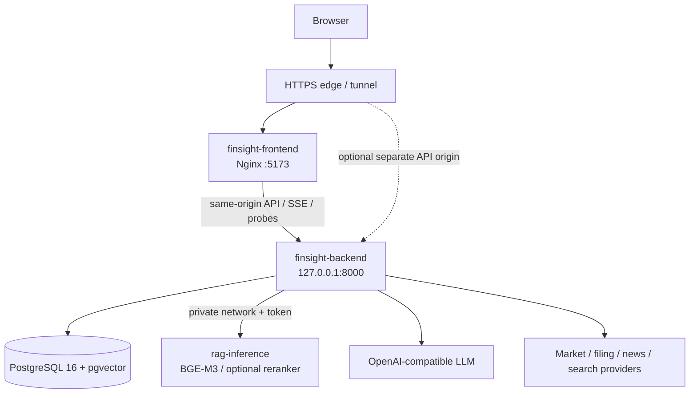

# FinSight 生产发布 Runbook

更新时间：2026-10-04

本文是 FinSight 当前唯一生产发布流程。生产目录为 `/home/ubuntu/FinSight`，Compose 服务为
`postgres`、`backend`、`rag-inference`、`frontend`，公开账本另使用 `predictions` profile 下的 `prediction-watchdog`。发布必须使用同一个 Git commit SHA 构建应用镜像，worker 复用 backend 镜像；禁止用
`latest`、未提交工作区或旧 SQLite/JSON 运行路径部署。

## 1. 发布不变量


```mermaid
flowchart TB
    USER[Browser] --> EDGE[HTTPS edge / tunnel]
    EDGE --> FE[finsight-frontend\nNginx :5173]
    FE -->|same-origin API / SSE / probes| BE[finsight-backend\n127.0.0.1:8000]
    EDGE -. optional separate API origin .-> BE
    BE --> PG[(PostgreSQL 16 + pgvector)]
    BE -->|private network + token| RAG[rag-inference\nBGE-M3 / optional reranker]
    BE --> LLM[OpenAI-compatible LLM]
    BE --> DATA[Market / filing / news / search providers]
```

- 核心业务只写 PostgreSQL；schema 只由 Alembic 管理，应用启动不建表。
- 生产必须启用 Supabase 认证；Prediction、Chat、History、Watchlist、Monitor 均不得匿名写入。
- 常规研究链中的 Price、Technical、Fundamental、News、Macro、Risk 和 Deep Search 只采集证据，不独立调用 LLM，
  不运行 reflection、补充搜索循环或动态委托。
- LLM 用途为 `PredictionAnalyst`、`ResearchAnalyst` 及无需取数的概念 `direct_answer`；研究任务、报告草稿、核验及重试按实际 usage 记录，不能按角色数声称只有一次调用。
- 固定公开 US20 评估另设 Technical/Risk forecast 模式，采集预算与用户业务分开；其 SQLite 账本和 watchdog 状态位于 backend_data 持久卷，不恢复旧业务存储。
- Prediction 只接受可信 provider 的真实 K 线；provider/LLM 失败必须返回稳定错误码，不生成替代行情或方向性假结论。
- 常规发布不读取、备份或恢复旧 SQLite/JSON。`scripts/migrate_legacy_storage.py` 只用于经批准的一次性离线导入。
- `.env.server` 只保存在服务器受限目录，不进入 Git、镜像层、命令参数、日志、截图或发布证据。
- `/livez` 只检查进程存活；`/readyz` 是容器编排、发布和回滚的唯一就绪门禁；`/health` 只保留兼容状态摘要。
- 前端默认使用同源 API 并由 Nginx 反向代理。只有生产边缘明确维护独立 API origin 时才设置 `VITE_API_BASE_URL`。
- 研究运行终态与权威消息已持久化；执行 task、取消路由、scheduler、Prediction worker 和近期 SSE 事件缓冲仍在 Web 进程内。本次仍只运行一个 backend 副本，不声明分布式调度能力。
- 最终消息事务提交后才发送保存成功；恢复旧 run 不重复付费执行。质量 `pass/warn/block`、执行状态和保存状态必须分别核验。
- API 与 QA 进程不得另加载 BGE 副本。模型只在受资源约束的私网 worker 推理；worker 不可用时允许持久词法降级，但不得宣称语义能力已验证。
- quality blocked 报告不得进入默认索引、共享链接或最终报告缓存；共享报告只返回 allowlist 字段并使用 `private, no-store`。
- 公开 quote/news/Kline/Dashboard GET 仍通过 IP 限流。`/health`、`/livez`、`/readyz` 为避免编排器误判而不进入流量桶。

## 2. 必需配置

部署前确认 `.env.server` 至少满足以下组合。检查时只输出“存在/不存在”或布尔值，不回显内容。

```text
APP_MODE=production
SUPABASE_AUTH_REQUIRED=true
SUPABASE_URL、SUPABASE_PUBLISHABLE_KEY 完整且与前端构建配置同源
POSTGRES_DB、POSTGRES_USER、POSTGRES_PASSWORD 完整
OPENAI_COMPATIBLE_API_KEY、OPENAI_COMPATIBLE_API_BASE、OPENAI_COMPATIBLE_MODEL 完整
MARKET_KLINE_PRIMARY_PROVIDER 在 MARKET_KLINE_TRUSTED_PROVIDERS 中
PREDICTION_GENERATION_ENABLED=true
PREDICTION_PROMPT_VERSION=prediction-analyst-v1
PREDICTION_RUN_TIMEOUT_SECONDS=1800
PREDICTION_LLM_ATTEMPT_TIMEOUT_SECONDS=1200
PREDICTION_MAX_CONCURRENT_RUNS=2
PREDICTION_OUTCOME_SCHEDULER_ENABLED=true
MONITOR_REALTIME_ENABLED=true
LANGGRAPH_EXECUTE_LIVE_TOOLS=true
LANGGRAPH_SYNTHESIZE_MODE=llm
FINSIGHT_STRUCTURED_SYNTHESIS=on
LLM_FOREGROUND_MAX_TOKENS=65536
LLM_REQUEST_TIMEOUT_SECONDS=1200
LLM_REQUEST_TOKEN_BUDGET=0
USER_DAILY_COST_LIMIT_USD=0
LANGGRAPH_EXECUTION_TIMEOUT_SECONDS=3600
LANGGRAPH_EXECUTION_TIMEOUT_REPORT_SECONDS=7200
MCP_SERVER_ENABLED=false
RAG_V2_BACKEND=postgres
RAG_V2_ALLOW_MEMORY_FALLBACK=false
RAG_EMBEDDING=bge-m3
RAG_WORKER_URL=http://rag-inference:8010
RAG_WORKER_TOKEN 已配置且仅服务端可读
RAG_RERANKER=none
RAG_WORKER_MEMORY_LIMIT=3000m
RAG_WORKER_MEMORY_SWAP_LIMIT=3600m
RAG_WORKER_MIN_AVAILABLE_MB=2400
RAG_WORKER_CPUS=1.0
LANGGRAPH_CHECKPOINTER_BACKEND=postgres
LANGGRAPH_CHECKPOINTER_ALLOW_MEMORY_FALLBACK=false
PREDICTION_ENABLED=false
CONCURRENCY_LIMIT_ENABLED=false
```

`YFINANCE_PROXY` 只允许由 yfinance 客户端读取，`SEARCH_PROXY` 只允许由搜索客户端读取；两者不得
覆盖进程级 `HTTP_PROXY`/`HTTPS_PROXY`。`NO_PROXY` 与 `no_proxy` 必须相同，并至少包含
`host.docker.internal,localhost,127.0.0.1`。同宿主机 LLM 网关使用
`http://host.docker.internal/v1`，不经公网地址回源。

公开账本须通过 `backend.tools.yfinance_client.create_ticker` 复用已验证的 Yahoo 代理，不能以裸 `yf.Ticker` 的直连结果代替生产预检。模型 key 使用服务端 `STEPFUN_API_KEY`，SMTP 配置和 `PREDICTION_ALERT_EMAIL` 仅合并进现有 `.env.server`，不得用部分配置覆盖数据库与认证字段。本轮保持 `PREDICTION_ENABLED=false` 和已授权的 `CONCURRENCY_LIMIT_ENABLED=false`，不降低已有模型预算；US20 采集启用属于后续单独决策，本次不额外发送测试告警邮件。

部署公开账本时必须同时列出独立监控服务：

```bash
IMAGE_TAG="$release_sha" docker compose --env-file .env.server --profile predictions up -d --build backend rag-inference frontend prediction-watchdog
```

镜像回滚前关闭采集并保留 `prediction_ledger.db` 和 `prediction_watchdog.json`；恢复采集会补记漏日 missed，不补写历史预测。常规业务数据库仍执行本 Runbook 的 PostgreSQL 回滚流程。

生产 Compose 的 BGE 推理在 `rag-inference` 中预热，worker 的 `/health` 只有真实编码及模型 revision 读取成功才返回 `inference_verified=true`。默认关闭 reranker；开启后须实际推理验证，模块可导入不代表可用。API 读取 worker 的真实状态，健康成功缓存约 15 秒，失败/降级默认缓存 45 秒（`RAG_PROBE_FAILURE_TTL_SECONDS` 范围 1–300 秒）。

worker 默认限制 3000m 内存、3600m 内存加 swap、1 CPU、128 PID，启动保护 180 秒，失败自动重启最多 3 次。3600m 是内存与 swap 总和。首次加载前读取 `/proc/meminfo` 的 `MemAvailable` 和 cgroup `memory.max-memory.current`，按较小值判断；默认 `RAG_WORKER_MIN_AVAILABLE_MB=2400`，不足则返回 `resource_limited/inference_verified=false`，不启动模型加载。部署前必须实测宿主可用内存及其它容器占用，不能同时在主 backend 与额外审计进程加载模型。资源不足时保留文本和 NULL 向量，明确使用 PostgreSQL 词法检索。

前台研究保留已配置的大输出和长推理预算：Step 上限 65536 token，单次 1200 秒，聊天整轮 3600 秒，报告整轮 7200 秒；重试仍有次数上限。采集外部行情/搜索的等待与模型推理分开，`COLLECTOR_TIMEOUT_SECONDS=180`、`COLLECTOR_REPORT_TIMEOUT_SECONDS=300` 控制采集等待，不缩小 LLM 预算。不得复制旧的 75/30 秒 Prediction 或 3000/6000 token 合成模板覆盖当前生产配置。

本轮目标机预检总内存约 3.32 GiB、其他业务占用后可用约 600 MiB，预计发布后 worker 会进入 `resource_limited`。这是预期的保护与语义降级，不是真实 BGE 推理通过；需要运维提供至少满足预检门槛的可用资源后再验证模型 revision 与实际编码。本次不清理其他业务容器、不擅自修改已有全局并发/预算配置来换取推理资源。

`/readyz` 在 PostgreSQL 健康且 `lexical_ready=true` 时允许 RAG 降级就绪，必须同时记录 `semantic_ready=false` 及原因；不能把 API 就绪当成语义检索验收通过。PostgreSQL 不可用仍阻断生产就绪，不以内存/hash 替代生产存储或 BGE 向量。不同模型/版本的 `metadata.embedding_identity` 必须隔离，旧未知身份不自动回填。

## 3. 本地发布门禁

从干净、已提交的目标 SHA 执行。任何一步失败都停止发布并修复根因，不带失败结果进入生产。

```bash
git status --short
sha="$(git rev-parse HEAD)"
test -n "$sha"
python -m compileall -q backend scripts
python -m pytest backend/tests -q
python -m pytest tests/golden -q
npm run lint --prefix frontend
npm run test:unit --prefix frontend
npm run build --prefix frontend
npm run test:e2e --prefix frontend -- --workers=1
npm audit --omit=dev --prefix frontend
python scripts/audit_product_baseline.py --output .omx/evidence/product-baseline.json
docker compose --env-file .env.server config --quiet
```

同时确认：

- FastAPI 路由与生成的 OpenAPI、前端产品入口一致；包括持久 run GET、右侧战绩工作区及 `/track-record` 公开分享页，不使用过时的固定数量作为验收。
- OpenAPI snapshot 与 `frontend/src/api/schema.d.ts` 已由目标代码重新生成。
- golden 与真实问法覆盖问候、报价、多维 INTC、催化追问、技术、财报、双股比较、宏观、港股、A 股、新闻、单股报告和比较报告；逐项检查主体、财期、维度、引用、质量与保存状态。
- 仓库、构建参数和镜像 history 不含真实 key、token、密码、Cookie 或 DSN。
- 桌面与移动关键路径已通过 Playwright；不能只以 HTTP 200 或容器 healthy 代替语义验收。
- `npm audit --omit=dev --prefix frontend` 必须为 0。完整开发依赖的已知漏洞单独登记和升级；2026-09-15 基线仍有 17 个开发链漏洞，不能误写为全依赖清零。
- 浏览器 E2E 的登录 fixture 必须通过 Supabase client 的 `getSession/onAuthStateChange` 合同建立身份，不能只写 localStorage；生产 canary 仍使用真实隔离用户。

## 4. 生产预检与备份

登录后先进入生产目录，确认服务器工作区没有本地改动，记录上一稳定 SHA 与镜像 ID。空间门禁必须以当次 `df` 实测为准，不因计划发布而假定机器满足条件：根分区使用率 `< 90%` 且可用空间 `>= 5 GiB`。任一条件不满足就停止部署；可先清理明确可回收的构建缓存/日志，再重新测量，仍不满足则扩容。不得删除当前运行镜像、唯一回滚镜像、数据库卷或未验证的用户数据来凑空间。

每次正式构建前重新测量磁盘、可用内存和 swap。历史机器状态不作为本次资源充足的证据；本记录不保存主机地址或凭据。

```bash
set -euo pipefail
cd /home/ubuntu/FinSight
git status --short
test -z "$(git status --porcelain)"
df -h /
root_use_pct="$(df -P / | awk 'NR==2 {gsub(/%/, "", $5); print $5}')"
root_available_kib="$(df -Pk / | awk 'NR==2 {print $4}')"
test "$root_use_pct" -lt 90
test "$root_available_kib" -ge 5242880
docker system df
free -h
docker stats --no-stream
docker compose --env-file .env.server ps
previous_sha="$(git rev-parse HEAD)"
running_backend_image_id="$(docker inspect finsight-backend --format '{{.Image}}')"
running_frontend_image_id="$(docker inspect finsight-frontend --format '{{.Image}}')"
test -n "$running_backend_image_id"
test -n "$running_frontend_image_id"

# 旧部署若没有精确 SHA tag，先给当前运行中的不可变 image ID 补 tag；不重建镜像。
docker image inspect "finsight-backend:${previous_sha}" >/dev/null 2>&1 || \
  docker image tag "$running_backend_image_id" "finsight-backend:${previous_sha}"
docker image inspect "finsight-frontend:${previous_sha}" >/dev/null 2>&1 || \
  docker image tag "$running_frontend_image_id" "finsight-frontend:${previous_sha}"
previous_backend_image_id="$(docker image inspect "finsight-backend:${previous_sha}" --format '{{.Id}}')"
previous_frontend_image_id="$(docker image inspect "finsight-frontend:${previous_sha}" --format '{{.Id}}')"
test "$previous_backend_image_id" = "$running_backend_image_id"
test "$previous_frontend_image_id" = "$running_frontend_image_id"
```

PostgreSQL 备份必须实际恢复到临时数据库；`pg_restore --list` 不能替代恢复演练。备份目录不得纳入发布证据同步。

```bash
umask 077
stamp="$(date -u +%Y%m%dT%H%M%SZ)"
backup_dir="$HOME/finsight-backups/$stamp"
restore_db="finsight_restore_${stamp//[^0-9A-Za-z_]/_}"
mkdir -p "$backup_dir"

docker compose --env-file .env.server exec -T postgres sh -lc \
  'pg_dump -U "$POSTGRES_USER" -d "$POSTGRES_DB" -Fc' \
  > "$backup_dir/postgres.dump"
test -s "$backup_dir/postgres.dump"
cp docker-compose.yml "$backup_dir/"
docker inspect finsight-postgres finsight-backend finsight-frontend \
  > "$backup_dir/docker-inspect.json"
sha256sum "$backup_dir"/* > "$backup_dir/SHA256SUMS"

docker compose --env-file .env.server exec -e RESTORE_DB="$restore_db" -T postgres sh -lc \
  'createdb -U "$POSTGRES_USER" "$RESTORE_DB"'
docker compose --env-file .env.server exec -e RESTORE_DB="$restore_db" -T postgres sh -lc \
  'pg_restore -U "$POSTGRES_USER" -d "$RESTORE_DB" --exit-on-error' \
  < "$backup_dir/postgres.dump"

source_tables="$(docker compose --env-file .env.server exec -T postgres sh -lc \
  'psql -U "$POSTGRES_USER" -d "$POSTGRES_DB" -Atc "select count(*) from pg_tables where schemaname='"'"'public'"'"'"')"
restored_tables="$(docker compose --env-file .env.server exec -e RESTORE_DB="$restore_db" -T postgres sh -lc \
  'psql -U "$POSTGRES_USER" -d "$RESTORE_DB" -Atc "select count(*) from pg_tables where schemaname='"'"'public'"'"'"')"
test "$source_tables" -gt 0
test "$source_tables" -eq "$restored_tables"

# 表数一致不足以证明数据可恢复；逐表对比关键业务记录数。
critical_tables="conversation_threads watchlist_items reports report_citations prediction_runs agent_predictions agent_prediction_outcomes agent_run_archive monitor_page_leases monitor_comments llm_usage rag_documents_v2 rag_chunks"
# 0005 之前的数据库尚无这两张表；已部署0005后必须加入逐表核对。
if docker compose --env-file .env.server exec -T postgres sh -lc \
  'psql -U "$POSTGRES_USER" -d "$POSTGRES_DB" -Atc "select to_regclass('\''research_runs'\'') is not null"' | rg -q '^t$'; then
  critical_tables="$critical_tables research_runs conversation_messages"
fi
for table_name in $critical_tables; do
  source_rows="$(docker compose --env-file .env.server exec -e TABLE_NAME="$table_name" -T postgres sh -lc \
    'psql -v ON_ERROR_STOP=1 -U "$POSTGRES_USER" -d "$POSTGRES_DB" -Atc "select count(*) from $TABLE_NAME"')"
  restored_rows="$(docker compose --env-file .env.server exec -e TABLE_NAME="$table_name" -e RESTORE_DB="$restore_db" -T postgres sh -lc \
    'psql -v ON_ERROR_STOP=1 -U "$POSTGRES_USER" -d "$RESTORE_DB" -Atc "select count(*) from $TABLE_NAME"')"
  test "$source_rows" = "$restored_rows"
done
docker compose --env-file .env.server exec -e RESTORE_DB="$restore_db" -T postgres sh -lc \
  'dropdb -U "$POSTGRES_USER" "$RESTORE_DB"'
```

## 5. Alembic 升级与兼容回滚演练

先构建目标 backend 镜像，在独立临时数据库验证旧 revision 升级到新 head，并执行真实事务测试。`0005` 新增运行/消息表及会话版本，`0006` 允许无向量词法文档；二者保留数据、禁止 downgrade 删除。不得在生产库做演练，也不得把旧的 `upgrade -> downgrade -> upgrade` 命令用于本次前向迁移。

```bash
sha="$(git rev-parse HEAD)"
export IMAGE_TAG="$sha"
docker compose --env-file .env.server build backend

drill_db="finsight_test_migration_$(date -u +%Y%m%d%H%M%S)"
docker compose --env-file .env.server exec -e DRILL_DB="$drill_db" -T postgres sh -lc \
  'createdb -U "$POSTGRES_USER" "$DRILL_DB"'
docker compose --env-file .env.server run --rm --no-deps -e DRILL_DB="$drill_db" backend sh -lc \
  'export FINSIGHT_POSTGRES_DSN="${FINSIGHT_POSTGRES_DSN%/*}/$DRILL_DB"; \
   alembic upgrade 20260716_0004; alembic upgrade head; alembic current; \
   export FINSIGHT_TEST_POSTGRES_DSN="$FINSIGHT_POSTGRES_DSN"; \
   python -m pytest backend/tests/test_research_run_postgres.py -q'
docker compose --env-file .env.server exec -e DRILL_DB="$drill_db" -T postgres sh -lc \
  'dropdb -U "$POSTGRES_USER" "$DRILL_DB"'
```

演练输出必须为唯一 head `20261003_0006`。事务测试只接受 `FINSIGHT_TEST_POSTGRES_DSN` 且库名为 `finsight_test_*`，使用随机 schema 验证迁移、重复 run、迟到快照、重试原位回复、事务回滚和失联恢复。实际 RLS 拒绝测试必须使用非 superuser、无 BYPASSRLS 的测试库 owner；若使用超级用户而该项跳过，不得声称 RLS 已实测通过。

应用启动从镜像的迁移文件计算期望 head，因此只认识 `0004` 的旧镜像会拒绝新 schema。发布前准备兼容回滚镜像：保留旧业务代码和 `0001–0004`、`env.py`、`alembic.ini`，增加 `20261003_0005_research_delivery.py` 与 `20261003_0006_rag_lexical.py` 两个迁移文件，再验证新 head 下启动与只读历史。记录兼容镜像不可变 ID，不把数据库降级作为应用回滚前提。

## 6. SHA 镜像与顺序部署

服务器只更新到已通过本地门禁的精确 SHA。保留 `.env.server`，禁止在服务器解决冲突或修改代码。

```bash
target_sha="<VERIFIED_COMMIT_SHA>"
git fetch origin "$target_sha"
git merge --ff-only "$target_sha"
test "$(git rev-parse HEAD)" = "$target_sha"
test -z "$(git status --porcelain)"

export IMAGE_TAG="$target_sha"
docker compose --env-file .env.server build backend frontend
backend_image_id="$(docker image inspect "finsight-backend:$target_sha" --format '{{.Id}}')"
frontend_image_id="$(docker image inspect "finsight-frontend:$target_sha" --format '{{.Id}}')"
test -n "$backend_image_id"
test -n "$frontend_image_id"
printf 'commit=%s\nbackend=%s\nfrontend=%s\n' \
  "$target_sha" "$backend_image_id" "$frontend_image_id"

# 1. 先迁移生产数据库
docker compose --env-file .env.server run --rm backend alembic upgrade head
docker compose --env-file .env.server run --rm backend alembic current

# 2. 替换API和独立推理worker；worker不可用时核对明确词法降级
docker compose --env-file .env.server up -d --no-deps backend
docker compose --env-file .env.server up -d --no-deps rag-inference
for i in $(seq 1 30); do
  curl -fsS http://127.0.0.1:8000/readyz >/dev/null && break
  test "$i" -lt 30
  sleep 2
done

# 3. 后端 ready 后再替换前端，并验证 Nginx 同源代理
docker compose --env-file .env.server up -d --no-deps frontend
docker compose --env-file .env.server --profile predictions up -d --no-deps prediction-watchdog
curl -fsS http://127.0.0.1:5173/ >/dev/null
curl -fsS http://127.0.0.1:5173/livez >/dev/null
curl -fsS http://127.0.0.1:5173/readyz >/dev/null
docker compose --env-file .env.server ps
```

检查运行容器确实使用目标镜像，而不是只检查标签存在：

```bash
test "$(docker inspect finsight-backend --format '{{.Image}}')" = "$backend_image_id"
test "$(docker inspect finsight-frontend --format '{{.Image}}')" = "$frontend_image_id"
test "$(docker inspect finsight-rag-inference --format '{{.Image}}')" = "$backend_image_id"
```

## 7. 真实 Canary

Canary 必须使用隔离的真实 Supabase 用户。访问 token 只读入当前 shell 内存，不写命令历史或证据文件。

```bash
read -rsp 'Canary access token: ' CANARY_TOKEN; echo
read -rp 'Canary user UUID: ' CANARY_USER_ID
case "$CANARY_USER_ID" in (*[!0-9A-Fa-f-]*) echo 'invalid canary UUID' >&2; exit 2;; esac
api="${FINSIGHT_CANARY_API_BASE:?set FINSIGHT_CANARY_API_BASE to the deployed API origin}"
auth="Authorization: Bearer $CANARY_TOKEN"

curl -fsS "$api/livez" | jq -e '.live == true'
curl -fsS "$api/readyz" | jq -e '.ready == true and .status == "ready"'
curl -fsS "$api/health" | jq .
curl -fsS -H "$auth" "$api/api/user/profile"
curl -fsS "$api/api/stock/kline/AAPL?period=1mo&interval=1d"
```

### 7.1 Prediction 与 Outcome

```bash
generate_json="$(curl -fsS -X POST -H "$auth" -H 'Content-Type: application/json' \
  -d '{"symbol":"AAPL","timeframe":"1d"}' \
  "$api/api/predictions/generate")"
run_id="$(printf '%s' "$generate_json" | jq -er '.run.id')"

for i in $(seq 1 90); do
  run_json="$(curl -fsS -H "$auth" "$api/api/predictions/runs/$run_id")"
  status="$(printf '%s' "$run_json" | jq -er '.run.status')"
  case "$status" in
    succeeded) break ;;
    unavailable|failed|cancelled) printf '%s\n' "$run_json" | jq .; exit 1 ;;
  esac
  test "$i" -lt 90
  sleep 1
done
prediction_id="$(printf '%s' "$run_json" | jq -er '.run.prediction_id')"
curl -fsS -H "$auth" "$api/api/predictions/$prediction_id" | jq .
curl -fsS -H "$auth" "$api/api/predictions/latest?symbol=AAPL" | jq .
curl -fsS -H "$auth" "$api/api/predictions/history?symbol=AAPL&limit=10" | jq .
curl -fsS -H "$auth" "$api/api/predictions/stats?symbol=AAPL" | jq .
```

Outcome scheduler 必须能运行且无未解释错误。若新 Prediction 尚未到可终结窗口，可使用已有到期 canary Prediction；
不得篡改行情或把 open 伪装成终态。记录实际 `outcome_id/prediction_id`。

### 7.2 Chat、Report 与 Monitor

```bash
session_id="public:${CANARY_USER_ID}:canary-${target_sha:0:12}"
curl -fsS -N -H "$auth" -H 'Content-Type: application/json' \
  -d "{\"query\":\"基于真实证据分析 AAPL 最近一个月的主要驱动与风险，并给出来源\",\"session_id\":\"$session_id\",\"tickers\":[\"AAPL\"],\"output_mode\":\"chat\"}" \
  "$api/api/execute" | tee "/tmp/finsight-canary-chat-${target_sha:0:12}.sse"
rg -q 'event: done|"type":"done"|"type": "done"' "/tmp/finsight-canary-chat-${target_sha:0:12}.sse"

lease_json="$(curl -fsS -X POST -H "$auth" -H 'Content-Type: application/json' \
  -d "{\"session_id\":\"$session_id\",\"symbol\":\"AAPL\"}" \
  "$api/api/monitor/leases")"
lease_id="$(printf '%s' "$lease_json" | jq -er '.lease.id')"
lease_token="$(printf '%s' "$lease_json" | jq -er '.lease.lease_token')"
curl -fsS -H "$auth" \
  "$api/api/monitor/comments?session_id=$session_id&symbol=AAPL&limit=20" | jq .
curl -fsS -X DELETE -H "$auth" -H 'Content-Type: application/json' \
  -d "{\"lease_token\":\"$lease_token\"}" \
  "$api/api/monitor/leases/$lease_id" | jq .
unset lease_token CANARY_TOKEN
```

有效 lease 应产生真实 comment；释放后 90 秒内停止该 lease 驱动的外部行情/LLM I/O。Chat 必须有引用或明确证据缺口；LLM 失败时必须出现稳定 `degraded`/error code，不能表现为正常成功。

聊天与报告还须覆盖以下交付检查，不能只搜索 SSE 中的 `done` 字符串：

- 保存 `run_id` 与两个消息 ID，断言 `persistence_status=saved` 后会话正文可读；刷新/重开历史和同 owner token 刷新不丢回答。
- 相同 run 重放或 POST 不新增模型调用；主动重新生成新 run/assistant ID，旧 run 晚到也不能覆盖新回答。
- 在隔离实例清空内存回放或重启后，GET run/events 能恢复最终结果；失联 running 转为 interrupted，而非自动重新收费。
- 迟到旧快照不能抹去服务器回复；跨用户 run GET、events、cancel 均被拒绝。
- 完整报告必须有受支持论据及有效引用。零论据或必需维度缺失的报告应被 block，保留预览且不归档；不能 mock quality=pass 绕过成功 fixture。
- 数据库保存失败须保留正文预览并提示，不能声称已保存。故障注入只在隔离实例完成。
- RAG 记录 worker 实际推理状态与 embedding identity；语义未验证、仅词法降级通过时分别记录。

### 7.3 数据库非零断言

以下查询只输出 ID、状态和计数，不输出 prompt、token 或用户资料。四类 Prediction 闭环表必须对 canary 用户非零；
Monitor comment、Report 与 Outcome 按本次验收要求记录真实 ID。

```bash
docker compose --env-file .env.server exec -T postgres sh -lc \
  'psql -v ON_ERROR_STOP=1 -U "$POSTGRES_USER" -d "$POSTGRES_DB"' <<SQL
SELECT 'prediction_runs' AS table_name, count(*) FROM prediction_runs WHERE user_id='$CANARY_USER_ID'
UNION ALL SELECT 'agent_predictions', count(*) FROM agent_predictions WHERE user_id='$CANARY_USER_ID'
UNION ALL SELECT 'agent_run_archive', count(*) FROM agent_run_archive WHERE user_id='$CANARY_USER_ID'
UNION ALL SELECT 'llm_usage', count(*) FROM llm_usage WHERE user_id='$CANARY_USER_ID'
UNION ALL SELECT 'monitor_comments', count(*) FROM monitor_comments WHERE user_id='$CANARY_USER_ID'
UNION ALL SELECT 'reports', count(*) FROM reports WHERE user_id='$CANARY_USER_ID';

SELECT id,run_id,status,source_type FROM agent_predictions
WHERE user_id='$CANARY_USER_ID' ORDER BY created_at DESC LIMIT 3;
SELECT prediction_id,status,algorithm_version FROM agent_prediction_outcomes
WHERE user_id='$CANARY_USER_ID' ORDER BY updated_at DESC LIMIT 3;
SELECT id,symbol,trigger_kind,prediction_id FROM monitor_comments
WHERE user_id='$CANARY_USER_ID' ORDER BY ts DESC LIMIT 3;
SQL
```

新增 `research_runs/conversation_messages` 启用 RLS。用服务端 store 或在受限事务内绑定 canary owner 查询其状态和计数；不输出完整正文或 final payload 到公开发布日志。对应 canary 必须有已提交终态和唯一助手消息。

## 8. 界面验收与 24 小时观察

用真实 canary 登录分别验证桌面 `1440x1000` 与移动 `390x844`：

1. `/` 在欢迎门通过后进入 `/today`；带 `?symbol=AAPL` 时进入对应 Dashboard。
2. 登录用户的 `/today` 显示自选报价、最近 Prediction/Outcome 和待跟进判断，数据带来源与时间；匿名状态不得加载个人数据。
3. `/dashboard/AAPL` 显示真实 K 线、provider、`as_of`、规则指标和 AI Prediction 覆盖层。
4. 无 Prediction 时显示“尚未生成”；认证、数据、LLM、配额错误分别显示具体原因。
5. 生成 Prediction 后能看到 anchor、entry、stop、target、方向和状态，刷新后仍存在。
6. “问 AI”进入 `/chat`，不在 Dashboard 启动第二条执行流。
7. `/history` 能读取 Prediction/Outcome/Report，并能回放和创建只读分享。
8. 页面 lease 只跟随当前标的；切换或离开页面后释放。
9. 右侧战绩区区分个人 Prediction 与固定 US20；`/track-record` 仅作公开分享入口，统计口径不混合。
10. 普通聊天、报告、生成中刷新、完成后重开、重试原位替换与断线恢复均检查实际正文及保存状态。

发布后连续观察 24 小时。至少在 `T+0`、`T+30m`、`T+2h`、`T+6h`、`T+12h`、`T+24h`
记录一次脱敏快照：

```bash
docker compose --env-file .env.server ps
docker compose --env-file .env.server logs --since=30m backend rag-inference frontend \
  | rg -i 'error|exception|timeout|401|429|schema|synthetic|scorer' || true
docker compose --env-file .env.server exec -T postgres sh -lc \
  'psql -U "$POSTGRES_USER" -d "$POSTGRES_DB" -Atc "select version_num from alembic_version"'
df -h /
docker system df
```

观察门禁：参考 ticker Prediction 成功率 `>= 95%`；无 lease 时 Monitor 行情与 LLM 调用均为 0；没有未解释的
401、scorer timeout、schema missing、synthetic data、跨租户读取或 LLM 请求放大。Dashboard warm-cache p95
`<= 2.5s`、cold p95 `<= 8s`；Prediction 结果 p95 `<= 45s`；Chat 首段正文 p95 `<= 15s`、完成 p95
`<= 90s`。这些是观察目标，不能用提高超时预算宣称已达到；报告、复杂多任务与降级请求分别记录实际分布，未完成的 24 小时观察在发布记录中保留待补状态。

### 小内存主机的验收约束

线上约 3.32 GiB 内存且与其他业务共用。即使给临时 QA 容器设置了 750 MiB 上限，也不能假定它不会挤占宿主机剩余内存。完整供应商测试与报告验收应在开发机或独立验收主机运行；生产只做少量串行冒烟。上线前同时检查 `MemAvailable`、swap 余量、容器实际用量和持续交换，不以“容器尚未 OOM”判断安全。

禁止在运行中的 API/QA 容器额外启动会导入整个应用或 ML 库的检查点导出进程。检查点只通过 PostgreSQL 只读查询导出，移到开发机解码。资源异常先停止本次创建的 QA 容器，保留结果，再检查生产；不得顺手停掉其他业务。SSH 直连和代理均不能握手且站点出现 1033 时，使用腾讯云 VNC/网页终端恢复管理入口，不继续启动新测试或反复重试部署。

## 9. 回滚

持续 5xx、健康失败、SSE 大面积中断、租户隔离失败、迁移异常、真实行情污染或明显错误研究输出均触发回滚。

```bash
export IMAGE_TAG="$rollback_compatible_tag"
docker compose --env-file .env.server up -d --no-deps backend
curl -fsS http://127.0.0.1:8000/readyz >/dev/null
docker compose --env-file .env.server up -d --no-deps frontend
curl -fsS http://127.0.0.1:5173/ >/dev/null
curl -fsS http://127.0.0.1:5173/readyz >/dev/null
```

`rollback_compatible_tag` 必须在发布前绑定并记录：后端是上一稳定业务代码加当前迁移元数据的兼容镜像，前端对应上一稳定资源；不能临时设成不认识新 head 的旧 tag。先回滚 API/前端，保留新 schema、运行终态、消息和词法文档；worker 若异常可停止并记录语义降级，不在主 API 进程补载模型。

生产产生新写入后禁止对 `0005/0006` 执行 downgrade。只有确认损坏并取得数据库恢复授权，才按经过验证的备份恢复流程处理数据。回滚后重新执行认证、行情、Prediction latest、Chat SSE、历史恢复和租户隔离冒烟，记录原因、影响范围与恢复时间。

## 10. 完成证据

前端可独立通过 `FRONTEND_IMAGE_TAG` 发布，未设置时沿用 `IMAGE_TAG`。发布后核对 `/app-version.json` 的 `build_id` 和实际 frontend image；后端未变更时无需重启正在运行的研究任务。版本文件及 Service Worker 禁止缓存；页面导航使用 NetworkFirst，避免 F5 仍从旧 app shell 启动旧客户端。打开的页面发现新版本时提示刷新，生成中或有未发送输入时不会自动重载。

旧 Service Worker 仍控制导航时，可打开 `/api/client-recovery`，由用户点击修复。该静态只读入口在旧版 `/api/` NetworkOnly 范围内，不依赖 React 或登录；仅注销本站 `/sw.js` 并删除 `workbox-precache-*`、`finsight-*` 页面缓存，不读取或清空 localStorage、Cookie、模型设置或用户会话，不调用生成接口。`/chat` 和 SPA HTML 路由本身也必须返回 `Cache-Control: no-store`。

发布记录必须区分已经完成的发布验收和后续观察，并包含以下证据或准确的待补状态：

1. 部署 commit SHA、backend/frontend image ID，以及运行容器对应关系。
2. PostgreSQL 备份 checksum、临时恢复关键数据一致、新 head 升级、真实事务/RLS 测试及兼容回滚镜像启动结果。
3. 脱敏的 canary `run_id`、`prediction_id`、`comment_id`、`outcome_id`、`report_id`。
4. `prediction_runs`、`agent_predictions`、`agent_run_archive`、`llm_usage` 非零断言。
5. 桌面和移动关键路径截图及浏览器控制台检查。
6. 24 小时 SLO、provider、错误率、Monitor I/O 与 LLM usage 报告。
7. 生产日志中不存在未解释的认证、scorer、schema、synthetic data 或跨租户问题。
8. 后端直连和前端同源代理的 `/livez`、`/readyz` 均通过；生产存储仍为 PostgreSQL，明确记录 semantic/lexical/reranker 能力。
9. Chat/Report 的质量、持久化、刷新/重启恢复、旧快照冲突与跨用户隔离证据；真实 worker 推理或资源限制导致的明确未验证结论。

必要发布验收缺失时不得宣称发布验证全部通过，也不得删除兼容回滚镜像。24 小时观察尚未结束时明确标记待补，不伪造观察结果。当前改动及外部验证证据归档在 [2026-10-03 基座重构](archive/2026-10-03-foundation-refactor/README.md)，由实际发布步骤补充。
