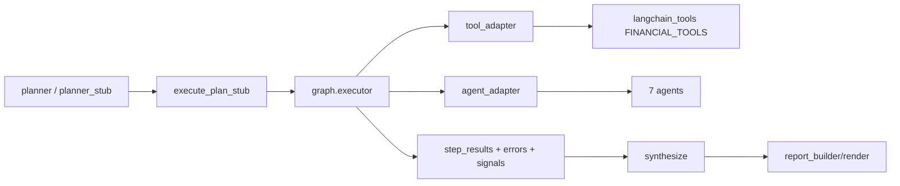

# FinSight Agent & Tool 链路指南

> 更新时间：2026-05-21
> 目标：让「Agent -> Tool -> 输出 -> 消费节点」一目了然。

## 1. 执行链路概览

## 2. Agent 清单

| Agent | 文件 | 典型职责 | 主要依赖工具 |
|---|---|---|---|
| `price_agent` | `backend/agents/price_agent.py` | 价格与短期行情信号 | `get_stock_price`, `get_option_chain_metrics`, `search` |
| `news_agent` | `backend/agents/news_agent.py` | 新闻提要、事件影响、信源质量 | `get_company_news`, `get_event_calendar`, `score_news_source_reliability`, `search` |
| `fundamental_agent` | `backend/agents/fundamental_agent.py` | 基本面/估值/财务解释 | `get_company_info`, `get_earnings_estimates`, `get_eps_revisions`, `search` |
| `technical_agent` | `backend/agents/technical_agent.py` | 技术指标、支撑/阻力、量能、实时位置、期权拥挤度与市场情绪共振 | `get_stock_historical_data`, `get_stock_price`, `get_option_chain_metrics`, `get_market_sentiment`, `search` |
| `macro_agent` | `backend/agents/macro_agent.py` | 宏观环境与市场风险背景 | `get_market_sentiment`, `get_economic_events`, `get_fred_data`, `search` |
| `risk_agent` | `backend/agents/risk_agent.py` | 因子暴露与压力测试信号 | `get_stock_price`, `get_factor_exposure`, `run_portfolio_stress_test` |
| `deep_search_agent` | `backend/agents/deep_search_agent.py` | 深度检索与高可靠证据补强 | `search` + 外部检索策略（Tavily/Exa 等） |

## 3. Tool 注册（执行白名单基础）

注册文件：`backend/langchain_tools.py`

### 3.1 FINANCIAL_TOOLS（当前注册顺序）

1. `get_current_datetime`
2. `get_stock_price`
3. `get_technical_snapshot`
4. `get_option_chain_metrics`
5. `get_sec_filings`
6. `get_sec_material_events`
7. `get_sec_company_facts_quarterly`
8. `get_sec_risk_factors`
9. `get_institutional_holdings`
10. `get_institution_holdings_by_ticker`
11. `get_insider_transactions`
12. `get_holdings_overlap`
13. `screen_stocks`
14. `get_cn_market_fund_flow`
15. `get_cn_market_northbound`
16. `get_cn_limit_board`
17. `get_cn_lhb`
18. `get_cn_concept_map`
19. `run_strategy_backtest`
20. `get_company_info`
21. `get_company_news`
22. `get_event_calendar`
23. `get_authoritative_media_news`
24. `get_earnings_call_transcripts`
25. `score_news_source_reliability`
26. `get_local_market_filings`
27. `fetch_url_content`
28. `search`
29. `get_market_sentiment`
30. `get_economic_events`
31. `get_official_macro_releases`
32. `get_earnings_estimates`
33. `get_eps_revisions`
34. `get_performance_comparison`
35. `analyze_historical_drawdowns`
36. `get_factor_exposure`
37. `run_portfolio_stress_test`

### 3.2 allowlist 入口

- 入口文件：`backend/graph/nodes/policy_gate.py`
- subject/company/report 等场景会裁剪 tool 白名单
- `analysis_depth=deep_research` 时会强制补入 `deep_search_agent`

## 4. Planner 与 Stub 路由

### 4.1 LLM Planner

文件：`backend/graph/nodes/planner.py`

- 支持 `LANGGRAPH_PLANNER_MODE=llm|stub`
- LLM 输出 JSON parse 失败时回落 stub
- A/B 分流与观测：`LANGGRAPH_PLANNER_AB_*`

### 4.2 Stub Planner（关键）

文件：`backend/graph/nodes/planner_stub.py`

已支持关键词注入以下工具步骤：

- EPS/预期相关 -> `get_earnings_estimates`, `get_eps_revisions`
- 期权/IV/PCR/Skew -> `get_option_chain_metrics`
- 风险因子/压力测试 -> `get_factor_exposure`, `run_portfolio_stress_test`
- 财报/FOMC/CPI/分红日历 -> `get_event_calendar`
- 信源可信度 -> `score_news_source_reliability`
- 强报告 query 即使前端默认发 `output_mode=chat`，也会升格为 `investment_report` / `report_generation`。
- request-understanding tasks 路径的研报会补齐 SEC 10-K/10-Q、CompanyFacts、8-K、权威媒体、业绩电话会 transcript 与报告 agent 步骤。
- 显式技术面 query 在 chat 模式会计划 `technical_agent`，和价格、技术快照工具一起执行。
- 显式研报 / 技术面请求在 `conversation_router` 有 fast path，不再先等会话路由 LLM；Agent 内部 LLM 分析和反思补查有硬超时，超时后交付确定性摘要。

## 5. 执行与事件可观测性

执行核心：`backend/graph/executor.py`

输出事件：

- step：`step_start`, `step_done`, `step_error`
- tool：`tool_start`, `tool_end`
- agent：`agent_start`, `agent_done`

前端消费：`frontend/src/api/client.ts`

- 已兼容 `tool_call`, `agent_step`, `agent_start/agent_done`, `thinking`, `done`

## 6. 结果整合与冲突处理

整合节点：`backend/graph/nodes/synthesize.py`

- 支持多 agent 交叉冲突收集（technical/news/fundamental/macro/price）
- 可在深度报告中输出冲突与裁决上下文
- 与 `report_builder.py` 一起生成结构化报告与引用

## 7. 常见排查入口

- 看策略：`backend/graph/nodes/policy_gate.py`
- 看规划：`backend/graph/nodes/planner.py`, `backend/graph/nodes/planner_stub.py`
- 看执行：`backend/graph/nodes/execute_plan_stub.py`, `backend/graph/executor.py`
- 看 SSE：`backend/services/execution_service.py`, `frontend/src/api/client.ts`
- 看仪表盘洞察：`backend/dashboard/insights_engine.py`

## 8. Phase J 证据质量增强（2026-02-19）

- SEC 证据链路激活：
  - `planner_stub.py` / `planner.py` 在 `investment_report` 模式自动补充可选 SEC 步骤（US 市场）。
  - `execute_plan_stub.py` 将 SEC 输出展开为逐条 evidence（10-K/10-Q/8-K 可直接被 quality gate 识别）。
- 免费增强源：
  - `backend/tools/jina_reader.py`：正文不足时补充抓取（可配置开关）。
  - `backend/tools/authoritative_feeds.py`：权威媒体 RSS 补充。
- 质量门槛分级：
  - `backend/graph/report_builder.py` 按 report type 选择检查项，并使用 graded penalty 代替统一钳制。
- 前端片段定位修复：
  - `ResearchTab.tsx`：中文 requirement fallback + 延迟滚动。
  - `ReferenceList.tsx`：展开后下一帧滚动，修复 ref 竞态。

## 9. Phase J P0/P1 Tool Matrix Update (2026-02-20)

### 9.1 Newly Added Report-Quality Tools
- `get_authoritative_media_news`
  - file: `backend/tools/authoritative_feeds.py`
  - role: free authoritative RSS aggregation (Reuters/Bloomberg/WSJ/FT/CNBC/Yahoo domain set)
  - fail mode: fail-open (returns empty list, no pipeline break)
- `get_earnings_call_transcripts`
  - file: `backend/tools/earnings_transcripts.py`
  - role: free transcript discovery + optional Jina enrichment for short snippets
  - fail mode: fail-open
- `get_local_market_filings`
  - file: `backend/tools/local_disclosure.py`
  - role: CN/HK local disclosure retrieval for non-US deep financial reports
  - fail mode: fail-open

### 9.2 Planner Enforcement Rules
- `deep_financial` report now force-includes:
  - authoritative media retrieval
  - earnings transcript retrieval
- market switch:
  - US -> SEC filing chain
  - CN/HK -> local disclosure chain
- budget pruning keeps required report tools pinned (cannot be dropped by tool budget trimming).

### 9.3 Quality Gate Mapping
- US deep financial checks: `10-K + 10-Q + transcript + authoritative_media + rich_snippet`
- CN/HK deep financial checks: `local_filing + transcript + authoritative_media + rich_snippet`
- penalty strategy: graded deduction (instead of one hard cap for all cases).

### 9.4 Real Smoke Status
- See `scripts/phase_j_smoke_before_after_2026-02-19.json`
- Latest run (live tools):
  - `AAPL`: all deep-financial checks pass
  - `600519.SS`: local-market profile checks pass

## 10. Phase J P2 Tool Matrix Update (2026-02-20)

### 10.1 DeepSearch Fallback Chain
- Updated file: `backend/agents/deep_search_agent.py`
- Current fallback order (for short-body pages):
  1. direct HTTP fetch
  2. Jina Reader (`backend/tools/jina_reader.py`)
  3. Wayback snapshot (`backend/tools/wayback.py`)
- Control flag:
  - `DEEPSEARCH_ENABLE_WAYBACK_FALLBACK`
- Rule:
  - fail-open only (no pipeline interruption on fallback failure)

### 10.2 Transcript Source Expansion
- Updated file: `backend/tools/earnings_transcripts.py`
- Capabilities:
  - market inference (`US/CN/HK`)
  - market-specific query templates
  - localized transcript keyword matching
  - structured return fields: `market`, `searched_queries`

### 10.3 Official Macro Release Tool
- New tool: `get_official_macro_releases`
- File: `backend/tools/macro_official.py`
- Source scope:
  - BLS
  - BEA
  - FED
- Integration points:
  - `backend/agents/macro_agent.py`
  - `backend/langchain_tools.py`
  - `backend/tools/manifest.py`

### 10.4 Validation Snapshot
- `pytest -q backend/tests/test_wayback_tool.py backend/tests/test_earnings_transcripts_tool.py backend/tests/test_macro_official_tool.py backend/tests/test_deep_research.py backend/tests/test_tool_manifest.py backend/tests/test_tools_capabilities_api.py`
- Result: `32 passed`
- `pytest backend/tests -x`
- Result: `847 passed, 8 skipped`

## 11. Phase J P3 Market Data Routing Update (2026-02-20)

### 11.1 New Runtime Data Source
- `backend/tools/cn_hk_market.py` (new)
  - quote: Eastmoney `push2` endpoint (`CN/HK` valuation fallback)
  - kline: Eastmoney `push2his` endpoint (`CN/HK` technical fallback)
  - financials: Eastmoney datacenter endpoints (`CN/HK` quarterly statement fallback)

### 11.2 SEC CompanyFacts Quarterly Fallback
- Updated file: `backend/tools/sec.py`
  - added `get_sec_company_facts_quarterly`
  - source: SEC XBRL CompanyFacts API
  - output: normalized quarterly fields for dashboard schema

### 11.3 Dashboard Routing Changes
- Updated file: `backend/dashboard/data_service.py`
  - `fetch_valuation`:
    - CN/HK -> Eastmoney first
    - US -> yfinance, then fallback
  - `fetch_financial_statements`:
    - CN/HK -> Eastmoney financials
    - US -> yfinance -> SEC CompanyFacts -> Finnhub
  - `_load_ohlcv_frame`:
    - CN/HK -> Eastmoney kline fallback added

### 11.4 Peer Routing Changes
- Updated file: `backend/dashboard/peer_service.py`
  - default peer pool split by market (`US/CN/HK`)
  - CN/HK peer metrics fallback uses Eastmoney quote metrics
  - non-US symbols no longer fall back to US default peer basket

### 11.5 Validation Snapshot
- Targeted:
  - `pytest -q backend/tests/test_sec_tools.py backend/tests/test_dashboard_finnhub_fallback.py` -> `14 passed`
- Full backend:
  - `pytest backend/tests -x` -> `856 passed, 8 skipped`
- Function-level smoke:
  - `AAPL` / `600519.SS` valuation + financials + technicals + peers all return non-empty payloads.

## 12. Evidence Research Agents Update (2026-05-18)

### 12.1 证据合同与覆盖率

- 证据合同入口：`backend/research/evidence_ledger.py`
  - `EvidenceLedger` 统一承载 `claims`、`sources`、`uncertainties`、`contradictions`、`coverage_targets`。
  - `backend/research/ledger_builder.py` 从 `artifacts.step_results`、`artifacts.evidence_pool`、`artifacts.rag_context` 归并出 `artifacts.evidence_ledger`。
- 查询覆盖入口：`backend/research/query_coverage.py`
  - `synthesize.py` 生成 `artifacts.query_coverage`。
  - `report_builder.py` 把 coverage warning、`query_coverage_gap` tag、`query_coverage` payload 写入报告。
- 默认开关：
  - `RESEARCH_LEDGER_ENABLED=true`
  - `QUERY_COVERAGE_ENABLED=true`

### 12.2 Deep Research 与 Debate

- DeepSearch flow facade：`backend/research/deep_research_flow.py`
  - 稳定阶段：`plan_search -> fetch_sources -> extract_claims -> gap_check -> targeted_followup -> ledger_write`。
  - 新写入使用 `ws:deepsearch:*` working set，不再新增 `session:deepsearch:*` collection。
- Debate engine：`backend/research/debate.py`
  - 输出 `bull_thesis`、`bear_thesis`、`cross_examination`、`judge_scorecard`、`consensus`、`open_questions`。
  - 新增 `build_read_only_adjudications`（2026-05-20）：输出 Bull/Bear/Judge 只读裁决产物，供前端展示和 API 消费。
- LangGraph 节点：`backend/graph/nodes/research_debate.py`
  - 节点顺序为 `execute_plan -> research_debate -> synthesize`。
  - `DEBATE_GRAPH_ENABLED=false` 时节点保持无副作用跳过。

### 12.3 公开持仓与协议暴露

- SEC 持仓工具：`backend/tools/sec_holdings.py`
  - `get_institutional_holdings`
  - `get_institution_holdings_by_ticker`
  - `get_insider_transactions`
  - `get_holdings_overlap`
- 边界：
  - 第一版仅支持 US 市场。
  - 13F 有季度披露延迟，不能当实时交易信号。
  - Form 4 是公开披露交易记录，不代表投资建议或隐藏意图。
  - `SEC_HOLDINGS_ENABLED=false` 时 planner 不主动注入持仓工具。
- 只读研究 API：`backend/api/research_router.py`
  - `/api/research/ledger/{report_id}`
  - `/api/research/debate/{report_id}`
  - `/api/research/holdings/{ticker}`
  - `/api/research/run-debate`
- 协议适配：
  - MCP：`backend/protocols/mcp_server.py`，默认 `MCP_SERVER_ENABLED=false`。
  - A2A：`backend/protocols/a2a_server.py` / `a2a_models.py`，默认 `A2A_SERVER_ENABLED=false`，`A2A_PUBLIC_URL` 为空。

### 12.4 前端消费入口

- Evidence 展示：`frontend/src/components/report/EvidenceLedgerPanel.tsx`
- Debate 展示：`frontend/src/components/report/DebateScorecard.tsx`
- Holdings 展示：`frontend/src/components/report/HoldingsWatchPanel.tsx`
- `ReportView.tsx` 负责组合展示 query coverage warning、证据、辩论和持仓披露，不展示原始 trace。

## 13. 执行追踪 Console 与 Token 可观测（2026-05-31）

补强 `## 5 执行与事件可观测性`，把 Planner 的 agent 选择诊断与 LLM token 计量贯通到前端指挥台。

### 13.1 Agent 预算优先级诊断（budget_priority）

- Planner 在 `plan_ready.agent_selection.budget_priority` 输出**每个候选 agent** 的预算排序：`rank`（选择顺序）/ `effort`（投入档位）/ `latency`（预估延迟）。
- 与 `agent_selection` 的 skip 原因（被跳过 agent 的诊断，见 `## 9.2`）互补：一个解释「为什么不选」，一个解释「选了的按什么优先级跑」。
- 前端 `executionStore.pipelineReducer` 解析后写入 `ExecutionRun.budgetPriority`，expert 指挥台计划摘要渲染为表。

### 13.2 Agent LLM Token 计量

- Agent 内部 LLM 调用统一经 `backend/services/llm_retry.ainvoke_with_rate_limit_retry`，由 `backend/services/llm_usage.py` 的 `record_llm_usage` 把每次调用的 prompt/completion token 累加进 `ContextVar` 级 `TokenUsageAccumulator`（每个 run 天然隔离）。
- 不走统一入口的 4 处直接 `ainvoke`（`resolve_subject` ×1 / `conversation_router` ×3）已补 `record_llm_usage`，避免漏计。
- `execution_service.run_graph_pipeline` 在 `done.metrics` 合并 `token_acc.summary()`（`total_tokens` / `total_cost_usd` / `tokens_by_model` 等），前端 `ExecutionStats` 展示总量与成本。
- 单价经 `LLM_PRICING_JSON`（每 1K token USD）配置；未配置时仅显示 token 量。

### 13.3 排查入口（补充）

- 看 token 计量：`backend/services/llm_usage.py`、`done.metrics`
- 看 agent 预算诊断：`backend/graph/nodes/planner.py` 的 `agent_selection`、前端 `ExecutionPanel` 计划摘要
- 看并行结构：前端 `components/execution/waterfallLayout.ts`（按 `parallel_group` 分泳道）
