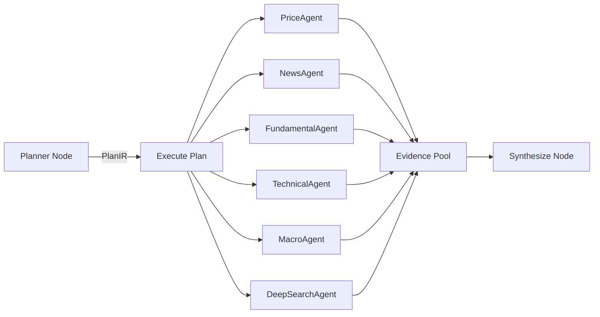

# FinSight Sub-Agent Guide

> Detailed documentation for all 6 financial analysis agents and the orchestration system.

---

## Architecture Overview



---

## Base Class: BaseFinancialAgent

**File**: `backend/agents/base_agent.py`

### Core Data Structures

```python
@dataclass
class EvidenceItem:
    text: str              # Evidence content
    source: str            # Data source name
    url: str               # Source URL (if available)
    timestamp: str         # ISO timestamp
    confidence: float      # 0.0 - 1.0
    title: str             # Evidence title
    meta: dict             # Arbitrary metadata

@dataclass
class AgentOutput:
    agent_name: str
    summary: str           # LLM or template-generated summary
    evidence: list[EvidenceItem]
    confidence: float      # Overall confidence score
    data_sources: list[str]
    as_of: str             # Timestamp
    evidence_quality: dict  # Quality metrics
    fallback_used: bool    # Whether fallback was activated
    risks: list[str]       # Identified risk factors
    trace: list[dict]      # Step-by-step trace
```

### Standard research() Flow

```
1. _initial_search(query, ticker)    → Raw data from primary source
2. _first_summary(data)              → Initial LLM summary
3. Reflection loop (max MAX_REFLECTIONS rounds):
   a. _identify_gaps(summary)        → LLM identifies info gaps
   b. _targeted_search(gaps, ticker) → Supplementary data fetch
   c. _update_summary(summary, data) → LLM integrates new data
4. _format_output(summary, results)  → AgentOutput
```

### Circuit Breaker (3-State)

```
CLOSED → (failures >= threshold) → OPEN → (recovery_timeout) → HALF_OPEN → (success) → CLOSED
```

**File**: `backend/services/circuit_breaker.py`

---

## 1. PriceAgent

| Property | Value |
|----------|-------|
| **File** | `backend/agents/price_agent.py` |
| **Class** | `PriceAgent` |
| **AGENT_NAME** | `"PriceAgent"` |
| **Cache TTL** | 30 seconds |
| **Reflections** | 0 (disabled) |
| **CB Config** | 5 failures / 60s cooldown |

### Data Sources (Priority Cascade)

```
yfinance → finnhub → alpha_vantage → tavily → search (fallback)
```

Each source is independently circuit-breaker protected. Failure triggers cascade to next source.

### Output

```
summary: "The current price of AAPL is USD 185.50. Day change +1.2%."
confidence: 1.0 (primary) | 0.5 (fallback)
```

### Error: `AllSourcesFailedError`

Raised when all 5 sources are exhausted or circuit-broken.

---

## 2. NewsAgent

| Property | Value |
|----------|-------|
| **File** | `backend/agents/news_agent.py` |
| **Class** | `NewsAgent` |
| **AGENT_NAME** | `"NewsAgent"` |
| **Cache TTL** | 600 seconds (10 min) |
| **Reflections** | 2 (base default) |
| **CB Config** | 3 failures / 180s cooldown |

### Data Sources (Priority Cascade)

```
finnhub_news → news_api → tavily → search (fallback)
```

Auto-cascades when results < 3 items.

### Deduplication

- **Title-level**: `seen_titles` set
- **Content-level**: `SearchConvergence` with Jaccard similarity (threshold: 0.7)
- **Information gain scoring**: `doc_score * 0.3 + novelty * 0.5 + diversity * 0.2`

### Special: Streaming Mode

`analyze_stream()` provides per-source streaming search + LLM streaming summary via `llm.astream()`.

---

## 3. FundamentalAgent

| Property | Value |
|----------|-------|
| **File** | `backend/agents/fundamental_agent.py` |
| **Class** | `FundamentalAgent` |
| **AGENT_NAME** | `"fundamental"` |
| **Cache TTL** | 86,400 seconds (24h) |
| **Reflections** | 2 (base default) |
| **CB Config** | Default (3 / 300s) |

### Data Sources

- `tools.get_financial_statements(ticker)` — Income / Balance / Cash flow
- `tools.get_company_info(ticker)` — Company profile

Underlying source: `yfinance`

### Tracked Metrics

| Key | Label | Source Table |
|-----|-------|-------------|
| `revenue` | Revenue | income |
| `net_income` | Net Income | income |
| `operating_income` | Operating Income | income |
| `operating_cash_flow` | Operating Cash Flow | cashflow |
| `total_assets` | Total Assets | balance |
| `total_liabilities` | Total Liabilities | balance |

### Standardization

- Auto-infers period type: `quarterly` (<=130 days) or `annual` (>=300 days)
- Calculates **YoY** and **QoQ** growth rates for each metric
- Evidence quality: `metric_coverage * 0.60 + growth_coverage * 0.40`

### Auto-Risk Detection

- Net income negative → risk flag
- Leverage ratio > 60% → risk flag
- Financial data degraded → risk flag

---

## 4. TechnicalAgent

| Property | Value |
|----------|-------|
| **File** | `backend/agents/technical_agent.py` |
| **Class** | `TechnicalAgent` |
| **AGENT_NAME** | `"technical"` |
| **Cache TTL** | 1,800 seconds (30 min) |
| **Reflections** | 2 (base default) |
| **CB Config** | Default (3 / 300s) |

### Data Sources

- `tools.get_stock_historical_data(ticker, period="6mo", interval="1d")` — K-line data

### Calculated Indicators (Local, No LLM)

| Indicator | Method |
|-----------|--------|
| MA20 / MA50 / MA200 | Pandas rolling mean |
| RSI(14) | Wilder's RSI |
| MACD | EMA(12) - EMA(26), Signal = EMA(9) of MACD |
| Trend | close > MA20 > MA50 → uptrend / reverse → downtrend |
| RSI State | ≥70 overbought / ≤30 oversold / else neutral |
| Momentum | MACD > Signal → bullish / else bearish |

**Minimum data**: 30 data points required (`MIN_POINTS = 30`)

---

## 5. MacroAgent

| Property | Value |
|----------|-------|
| **File** | `backend/agents/macro_agent.py` |
| **Class** | `MacroAgent` |
| **AGENT_NAME** | `"macro"` |
| **Cache TTL** | None (no explicit cache) |
| **Reflections** | 2 (base default) |
| **CB Config** | Default (3 / 300s) |

### Data Sources (Multi-Source Merge)

| Priority | Source | Type |
|----------|--------|------|
| 1 | FRED API | Numeric indicators |
| 2 | CNN Fear & Greed | Sentiment text |
| 3 | Economic Calendar | Event text |
| 4 | Web Search | Cross-check text |

### Tracked Indicators

| Key | Label | Conflict Tolerance |
|-----|-------|--------------------|
| `fed_rate` | Federal Funds Rate | ±0.35% |
| `cpi` | CPI | ±0.60% |
| `unemployment` | Unemployment Rate | ±0.40% |
| `gdp_growth` | GDP Growth | ±0.80% |
| `treasury_10y` | 10Y Treasury Yield | ±0.35% |
| `yield_spread` | 10Y-2Y Spread | ±0.35% |

### Conflict Detection

When sources disagree beyond tolerance threshold:
- Winning value selected by source priority
- Conflict flagged in `evidence.meta.conflict_flag`
- Risk added: "Cross-source macro conflicts detected"

### Recession Warning

`yield_spread < 0` → automatic recession warning risk flag

### Evidence Quality

```
overall = coverage * 0.45 + diversity * 0.20 + source_health * 0.35 - conflict_penalty
```

---

## 6. DeepSearchAgent

| Property | Value |
|----------|-------|
| **File** | `backend/agents/deep_search_agent.py` |
| **Class** | `DeepSearchAgent` |
| **AGENT_NAME** | `"deep_search"` |
| **Cache TTL** | 3,600 seconds (1h) |
| **Reflections** | 2 (configurable via `DEEPSEARCH_MAX_REFLECTIONS`) |
| **CB Config** | Default (3 / 300s) |

### Data Sources

| Priority | Source | Max Results |
|----------|--------|-------------|
| 1 | Tavily (advanced search) | 8 |
| 2 | Exa (neural search) | 8 |
| 3 | tools.search (fallback) | — |
| + | HTTP document fetch | Up to 4 docs |

### Self-RAG Flow

```
1. _build_queries()         → Generate 1-3 search queries
2. _initial_search()        → Multi-source web search + document fetch
3. _first_summary()         → LLM structured research memo
4. SearchConvergence        → Information gain scoring
5. Reflection loop:
   a. _identify_gaps()      → LLM gap analysis (JSON output)
   b. _targeted_search()    → Supplementary search + fetch
   c. Convergence check     → Stop if gain < 0.05
   d. _update_summary()     → LLM integration
6. _compute_evidence_quality()
7. _format_output()
```

### Stop Conditions

- Max 3 reflection rounds
- No new documents found
- 2 consecutive low-gain rounds (< 0.15)
- Extremely low gain (< 0.05) → immediate stop

### Security

- **SSRF Protection**: `is_safe_url()` checks both URL and redirect targets
- Document limits: `DEEPSEARCH_MIN_TEXT_CHARS=400`, `DEEPSEARCH_MAX_TEXT_CHARS=12000`

### Conflict Detection

Sentiment-based document-level conflict detection:
- **Positive signals**: beat, strong, growth, upside, raised, outperform, bullish
- **Negative signals**: miss, weak, decline, downside, cut, underperform, bearish, risk

### Source Reliability Tiers

| Tier | Sources | Reliability |
|------|---------|-------------|
| High | sec.gov, reuters.com, bloomberg.com, wsj.com, ft.com, investor.* | 0.9 |
| High | PDF documents | 0.9 |
| Medium | Tavily, Exa results | 0.75 |
| Standard | General web search | 0.6 |

---

## Agent Selection: Capability Registry

**File**: `backend/graph/capability_registry.py`

### Scoring Formula

```
score = 0.05 (base)
      + subject_weights[subject_type]
      + operation_weights[operation]
      + output_mode_weights[output_mode]
      + keyword_boost (if query matches keyword_hints)
      + special_bonuses
```

### Required Agents (investment_report mode)

| Condition | Required |
|-----------|----------|
| operation=technical | price_agent, technical_agent |
| operation=price | price_agent |
| operation=compare | price_agent, fundamental_agent |
| subject=company | price_agent, news_agent, fundamental_agent |
| subject=filing | deep_search_agent, fundamental_agent |
| subject=news_item | news_agent, price_agent |
| Query has macro keywords | +macro_agent |
| Query has tech keywords | +technical_agent |
| Query has deep keywords | +deep_search_agent |

### High-Cost Escalation

`macro_agent` and `deep_search_agent` are tagged as high-cost:
- `__escalation_stage: "high_cost"`
- `__run_if_min_confidence: 0.72`
- Only force-run if in required list or query has deep hint
