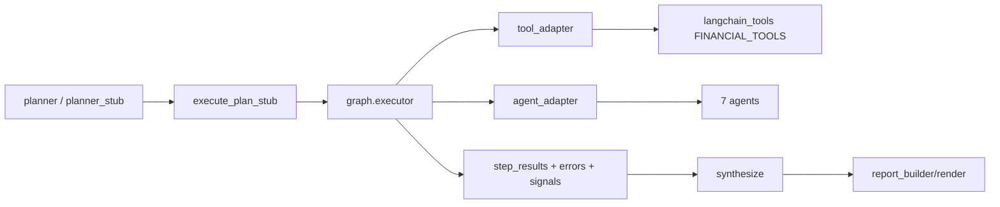

# FinSight Agent & Tool 链路指南

> 更新时间：2026-02-18  
> 目标：让「Agent -> Tool -> 输出 -> 消费节点」一目了然。

## 1. 执行链路概览

## 2. Agent 清单

| Agent | 文件 | 典型职责 | 主要依赖工具 |
|---|---|---|---|
| `price_agent` | `backend/agents/price_agent.py` | 价格与短期行情信号 | `get_stock_price`, `get_option_chain_metrics`, `search` |
| `news_agent` | `backend/agents/news_agent.py` | 新闻提要、事件影响、信源质量 | `get_company_news`, `get_event_calendar`, `score_news_source_reliability`, `search` |
| `fundamental_agent` | `backend/agents/fundamental_agent.py` | 基本面/估值/财务解释 | `get_company_info`, `get_earnings_estimates`, `get_eps_revisions`, `search` |
| `technical_agent` | `backend/agents/technical_agent.py` | 技术指标与形态判断 | `get_stock_historical_data`, `search` |
| `macro_agent` | `backend/agents/macro_agent.py` | 宏观环境与市场风险背景 | `get_market_sentiment`, `get_economic_events`, `get_fred_data`, `search` |
| `risk_agent` | `backend/agents/risk_agent.py` | 因子暴露与压力测试信号 | `get_stock_price`, `get_factor_exposure`, `run_portfolio_stress_test` |
| `deep_search_agent` | `backend/agents/deep_search_agent.py` | 深度检索与高可靠证据补强 | `search` + 外部检索策略（Tavily/Exa 等） |

## 3. Tool 注册（执行白名单基础）

注册文件：`backend/langchain_tools.py`

### 3.1 FINANCIAL_TOOLS（当前注册顺序）

1. `get_current_datetime`
2. `get_stock_price`
3. `get_technical_snapshot`
4. `get_option_chain_metrics`
5. `get_company_info`
6. `get_company_news`
7. `get_event_calendar`
8. `score_news_source_reliability`
9. `search`
10. `get_market_sentiment`
11. `get_economic_events`
12. `get_earnings_estimates`
13. `get_eps_revisions`
14. `get_performance_comparison`
15. `analyze_historical_drawdowns`
16. `get_factor_exposure`
17. `run_portfolio_stress_test`

### 3.2 allowlist 入口

- 入口文件：`backend/graph/nodes/policy_gate.py`
- subject/company/report 等场景会裁剪 tool 白名单
- `analysis_depth=deep_research` 时会强制补入 `deep_search_agent`

## 4. Planner 与 Stub 路由

### 4.1 LLM Planner

文件：`backend/graph/nodes/planner.py`

- 支持 `LANGGRAPH_PLANNER_MODE=llm|stub`
- LLM 输出 JSON parse 失败时回落 stub
- A/B 分流与观测：`LANGGRAPH_PLANNER_AB_*`

### 4.2 Stub Planner（关键）

文件：`backend/graph/nodes/planner_stub.py`

已支持关键词注入以下工具步骤：

- EPS/预期相关 -> `get_earnings_estimates`, `get_eps_revisions`
- 期权/IV/PCR/Skew -> `get_option_chain_metrics`
- 风险因子/压力测试 -> `get_factor_exposure`, `run_portfolio_stress_test`
- 财报/FOMC/CPI/分红日历 -> `get_event_calendar`
- 信源可信度 -> `score_news_source_reliability`

## 5. 执行与事件可观测性

执行核心：`backend/graph/executor.py`

输出事件：

- step：`step_start`, `step_done`, `step_error`
- tool：`tool_start`, `tool_end`
- agent：`agent_start`, `agent_done`

前端消费：`frontend/src/api/client.ts`

- 已兼容 `tool_call`, `agent_step`, `agent_start/agent_done`, `thinking`, `done`

## 6. 结果整合与冲突处理

整合节点：`backend/graph/nodes/synthesize.py`

- 支持多 agent 交叉冲突收集（technical/news/fundamental/macro/price）
- 可在深度报告中输出冲突与裁决上下文
- 与 `report_builder.py` 一起生成结构化报告与引用

## 7. 常见排查入口

- 看策略：`backend/graph/nodes/policy_gate.py`
- 看规划：`backend/graph/nodes/planner.py`, `backend/graph/nodes/planner_stub.py`
- 看执行：`backend/graph/nodes/execute_plan_stub.py`, `backend/graph/executor.py`
- 看 SSE：`backend/services/execution_service.py`, `frontend/src/api/client.ts`
- 看仪表盘洞察：`backend/dashboard/insights_engine.py`

## 8. Phase J 证据质量增强（2026-02-19）

- SEC 证据链路激活：
  - `planner_stub.py` / `planner.py` 在 `investment_report` 模式自动补充可选 SEC 步骤（US 市场）。
  - `execute_plan_stub.py` 将 SEC 输出展开为逐条 evidence（10-K/10-Q/8-K 可直接被 quality gate 识别）。
- 免费增强源：
  - `backend/tools/jina_reader.py`：正文不足时补充抓取（可配置开关）。
  - `backend/tools/authoritative_feeds.py`：权威媒体 RSS 补充。
- 质量门槛分级：
  - `backend/graph/report_builder.py` 按 report type 选择检查项，并使用 graded penalty 代替统一钳制。
- 前端片段定位修复：
  - `ResearchTab.tsx`：中文 requirement fallback + 延迟滚动。
  - `ReferenceList.tsx`：展开后下一帧滚动，修复 ref 竞态。

## 9. Phase J P0/P1 Tool Matrix Update (2026-02-20)

### 9.1 Newly Added Report-Quality Tools
- `get_authoritative_media_news`
  - file: `backend/tools/authoritative_feeds.py`
  - role: free authoritative RSS aggregation (Reuters/Bloomberg/WSJ/FT/CNBC/Yahoo domain set)
  - fail mode: fail-open (returns empty list, no pipeline break)
- `get_earnings_call_transcripts`
  - file: `backend/tools/earnings_transcripts.py`
  - role: free transcript discovery + optional Jina enrichment for short snippets
  - fail mode: fail-open
- `get_local_market_filings`
  - file: `backend/tools/local_disclosure.py`
  - role: CN/HK local disclosure retrieval for non-US deep financial reports
  - fail mode: fail-open

### 9.2 Planner Enforcement Rules
- `deep_financial` report now force-includes:
  - authoritative media retrieval
  - earnings transcript retrieval
- market switch:
  - US -> SEC filing chain
  - CN/HK -> local disclosure chain
- budget pruning keeps required report tools pinned (cannot be dropped by tool budget trimming).

### 9.3 Quality Gate Mapping
- US deep financial checks: `10-K + 10-Q + transcript + authoritative_media + rich_snippet`
- CN/HK deep financial checks: `local_filing + transcript + authoritative_media + rich_snippet`
- penalty strategy: graded deduction (instead of one hard cap for all cases).

### 9.4 Real Smoke Status
- See `scripts/phase_j_smoke_before_after_2026-02-19.json`
- Latest run (live tools):
  - `AAPL`: all deep-financial checks pass
  - `600519.SS`: local-market profile checks pass

## 10. Phase J P2 Tool Matrix Update (2026-02-20)

### 10.1 DeepSearch Fallback Chain
- Updated file: `backend/agents/deep_search_agent.py`
- Current fallback order (for short-body pages):
  1. direct HTTP fetch
  2. Jina Reader (`backend/tools/jina_reader.py`)
  3. Wayback snapshot (`backend/tools/wayback.py`)
- Control flag:
  - `DEEPSEARCH_ENABLE_WAYBACK_FALLBACK`
- Rule:
  - fail-open only (no pipeline interruption on fallback failure)

### 10.2 Transcript Source Expansion
- Updated file: `backend/tools/earnings_transcripts.py`
- Capabilities:
  - market inference (`US/CN/HK`)
  - market-specific query templates
  - localized transcript keyword matching
  - structured return fields: `market`, `searched_queries`

### 10.3 Official Macro Release Tool
- New tool: `get_official_macro_releases`
- File: `backend/tools/macro_official.py`
- Source scope:
  - BLS
  - BEA
  - FED
- Integration points:
  - `backend/agents/macro_agent.py`
  - `backend/langchain_tools.py`
  - `backend/tools/manifest.py`

### 10.4 Validation Snapshot
- `pytest -q backend/tests/test_wayback_tool.py backend/tests/test_earnings_transcripts_tool.py backend/tests/test_macro_official_tool.py backend/tests/test_deep_research.py backend/tests/test_tool_manifest.py backend/tests/test_tools_capabilities_api.py`
- Result: `32 passed`
- `pytest backend/tests -x`
- Result: `847 passed, 8 skipped`
