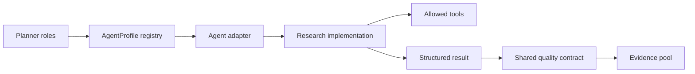

# FinSight Agent 指南

更新时间：2026-07-12

## 1. 统一模型

`backend/agents/profiles.py` 定义 7 个共享 `AgentProfile`，它是 Agent 身份、能力、工具许可和质量要求的公共合同。规划、执行、设置 UI、观测和评估应复用该合同，禁止各 Agent 自建互不兼容的 profile schema。

```mermaid
flowchart LR
    PLAN[Planner roles] --> PROFILE[AgentProfile registry]
    PROFILE --> ADAPTER[Agent adapter]
    ADAPTER --> AGENT[Research implementation]
    AGENT --> TOOLS[Allowed tools]
    AGENT --> RESULT[Structured result]
    RESULT --> QUALITY[Shared quality contract]
    QUALITY --> EVIDENCE[Evidence pool]
```

## 2. 当前 Agent

| Profile | 主要职责 | 常见证据 |
|---|---|---|
| `price_agent` | 行情、价格变化、市场状态 | price snapshot、历史价格 |
| `news_agent` | 公司新闻、事件和情绪 | 带来源与时间的新闻条目 |
| `fundamental_agent` | 财报、估值和经营趋势 | statements、ratios、filings |
| `technical_agent` | 指标、趋势和技术形态 | OHLCV、indicator series |
| `macro_agent` | 宏观数据与传导机制 | 官方宏观序列、事件 |
| `risk_agent` | 波动、回撤、暴露和压力场景 | risk metrics、scenario outputs |
| `deep_search_agent` | 网页、公告和跨来源补充研究 | URL、摘要、抓取状态 |

Agent 数量只按 `profiles.py` 统计。仪表盘洞察评分器是轻量评分服务，不算第 8 个研究 Agent。

## 3. 调度生命周期

1. `understand_request` 生成任务与 required evidence。
2. `policy_gate` 确定允许的能力和证据下限。
3. `planner` 将任务映射到工具或 Agent role，并生成依赖关系。
4. `execute_plan` 通过 `backend/graph/adapters/agent_adapter.py` 调用 Agent。
5. 结果经公共质量合同和 evidence gate 进入证据池；失败进入 diagnostics。
6. `research_debate` 聚合冲突和置信度，之后才进入 synthesis/render。

## 4. Agent 输出要求

- 明确标的、市场、时间范围和数据时间戳。
- 事实与推断分开；推断必须能指向输入证据。
- 不得返回凭据、完整请求头或供应商私有响应。
- 工具不可用时返回结构化失败/限制，不生成占位数字。
- 引用型回答必须保留 URL/来源；内部模型分析应标明性质。
- 遵守 run、thread、user 和取消作用域。

## 5. 新增或修改 Agent

- [ ] 在 `profiles.py` 注册或调整 profile。
- [ ] 更新能力注册、planner role 和 policy allowlist。
- [ ] 通过 adapter 调用，不在图节点硬编码 Agent 类。
- [ ] 复用公共结果/质量合同并接入 evidence gate。
- [ ] 添加定向单测和至少一个跨层执行测试。
- [ ] 同步本指南、前端类型/设置（如可见）和观测字段。

不应恢复 `planner_stub.py` 或 `execute_plan_stub.py`。规则回退属于 `backend/graph/planning/`，执行入口属于 `backend/graph/execution/`。
