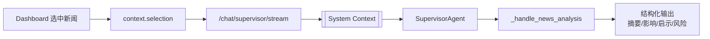

# FinSight Dashboard 开发指南

> 最后更新: 2026-02-01 | 版本: 0.7.0

本文档为 FinSight 前端 Dashboard 开发提供完整的技术指南，包括架构设计、组件规范、状态管理、API 集成和最佳实践。

---

## 目录

1. [技术栈概览](#技术栈概览)
2. [项目结构](#项目结构)
3. [核心架构](#核心架构)
4. [组件开发规范](#组件开发规范)
5. [状态管理 (Zustand)](#状态管理-zustand)
6. [API 集成](#api-集成)
7. [类型系统](#类型系统)
8. [主题与样式](#主题与样式)
9. [可复用模式](#可复用模式)
10. [开发最佳实践](#开发最佳实践)

---

## 技术栈概览

| 技术 | 版本 | 用途 |
|------|------|------|
| React | 18+ | UI 框架 |
| TypeScript | 5.0+ | 类型安全 |
| Vite | 5.x | 构建工具 |
| Zustand | 4.x | 状态管理 |
| Tailwind CSS | 3.x | 原子化样式 |
| Axios | 1.x | HTTP 客户端 |
| Lucide React | - | 图标库 |
| ECharts | 5.x | 图表可视化 |

---

## 项目结构

```
frontend/src/
├── api/
│   └── client.ts           # API 客户端 (Axios + SSE)
├── components/
│   ├── App.tsx             # 根组件
│   ├── ChatList.tsx        # 聊天消息列表
│   ├── ChatInput.tsx       # 输入框组件
│   ├── RightPanel.tsx      # 右侧面板 (资产/图表/日志)
│   ├── ReportView.tsx      # 研报卡片渲染
│   ├── StockChart.tsx      # K线图表组件
│   ├── AgentLogPanel.tsx   # Agent 实时日志面板
│   ├── DiagnosticsPanel.tsx # 诊断面板
│   ├── ThinkingProcess.tsx # 思考过程展示
│   ├── Sidebar.tsx         # 左侧导航栏
│   ├── SettingsModal.tsx   # 设置弹窗
│   └── SubscribeModal.tsx  # 订阅弹窗
├── store/
│   ├── useStore.ts         # Zustand 全局状态 (Chat/Agent)
│   └── dashboardStore.ts   # Dashboard 专用状态 (资产/关注/新闻/选中上下文)
├── types/
│   ├── index.ts            # TypeScript 核心类型定义
│   └── dashboard.ts        # Dashboard 类型 (ActiveAsset/WatchItem/SelectionItem)
├── utils/
│   └── hash.ts             # 哈希工具 (DJB2 算法生成新闻 ID)
├── assets/                 # 静态资源
├── designs/                # 设计稿
├── index.css               # 全局样式 + Tailwind
└── main.tsx                # 入口文件
```

---

## 核心架构

### 应用布局结构 (三栏式 Bento Grid)

```
┌─────────────────────────────────────────────────────────────────┐
│  App.tsx (Root)                                                 │
├──────────┬──────────────────────────────────────┬───────────────┤
│ Sidebar  │         Main Workspace               │  RightPanel   │
│ (240px)  │  ┌────────────────────────────────┐  │   (340px)     │
│          │  │   顶部: KPI 卡片 (Snapshot)     │  │               │
│ 导航菜单 │  ├────────────────────────────────┤  │               │
│ 实时关注 │  │                                │  │  AI 对话窗口  │
│ 列表     │  │   C位: K线图 (MarketChart)      │  │  深度分析     │
│          │  │     (占用最大面积)             │  │               │
│          │  ├──────────┬─────────────────────┤  │               │
│          │  │ 新闻流   │   财务/持仓数据     │  │               │
│          │  │(NewsFeed)│  (Revenue/Holdings) │  │               │
│          │  └──────────┴─────────────────────┘  │               │
└──────────┴──────────────────────────────────────┴───────────────┘
```

**视线流设计：**
- **左手查阅** (List) → **中间分析** (Chart) → **右侧求证** (AI)
- 最大化屏幕利用率，明确"数据-可视化-分析"的视觉层次

### 数据架构与决策系统

#### 资产类型驱动架构 (Type-Driven Architecture)

```
用户输入 symbol → 资产解析 → 能力集选择 → 组件渲染
    ↓              ↓           ↓          ↓
  AAPL         equity     revenue_trend   RevenueTrendCard
  ^GSPC        index      sector_weights  SectorWeightsCard  
  SPY          etf        holdings        HoldingsCard
  BTC-USD      crypto     market_chart    MarketChartCard
```

**决策流程：**
1. `resolve_asset()` 根据 ticker 格式判断类型
2. `select_capabilities()` 返回能力集对象
3. 前端按 capabilities 条件渲染对应组件
4. 图表类型由数据结构确定（时间序列→柱状图，占比→饼图）

#### RAG 数据入库策略

| 数据层级 | 存储方式 | TTL | RAG 用途 |
|---------|---------|-----|----------|
| **短期缓存** | Redis/内存 | 5-60s | 当前价格、实时涨跌（不需要 RAG） |
| **中期存储** | SQLite/PostgreSQL | 1-7天 | K线历史、新闻摘要（向量化后支持历史分析） |
| **长期知识库** | 向量数据库 | 永久 | 财报、研报、基本面（支持深度问答） |

**实现路径：**
- 对话时异步将新闻/财报数据写入向量库
- 当用户问"为什么跌了？"时，先检索向量库中的相关片段
- 让 AI 回答更有"记忆"，不只是重新调 API

### 数据流架构

```
User Action (选择股票)
    │
    ▼
┌─────────────┐     ┌─────────────┐     ┌─────────────┐
│  Component  │────▶│   Zustand   │────▶│  API Client │
│  (onClick)  │     │   (Store)   │     │  (Axios)    │
└─────────────┘     └─────────────┘     └─────────────┘
                           │                   │
                           ▼                   ▼
                    ┌─────────────┐     ┌─────────────┐
                    │  Re-render  │◀────│ Dashboard   │
                    │  (React)    │     │  API Route  │
                    └─────────────┘     └─────────────┘
                                              │
                                              ▼
                                     ┌─────────────┐
                                     │ Asset Type  │
                                     │ Resolution  │
                                     │ + Widget    │ 
                                     │ Selection   │
                                     └─────────────┘
```

#### 组件展示决策逻辑

| 资产类型 | 启用组件 | 示例标的 | 决策原因 |
|---------|---------|---------|----------|
| **equity** | 营收趋势、分部收入、K线图、新闻 | AAPL, TSLA | 公司有财务数据 |
| **index** | 行业权重、成分股排行、K线图 | ^GSPC, ^DJI | 指数包含多个成分股 |
| **etf** | 行业权重、持仓明细、K线图 | SPY, QQQ | 基金有持仓结构 |
| **crypto** | K线图、新闻 | BTC-USD | 加密货币数据结构简单 |

**图表类型映射：**
- 时间序列数据 → 柱状图/折线图 (`RevenueTrendCard`)
- 占比数据 → 饼图 (`SectorWeightsCard`, `SegmentMixCard`)
- OHLC 数据 → K线图 (`MarketChartCard`)
- 排名数据 → 表格/条形图 (`TopConstituentsCard`)

---

## 组件开发规范

### 1. 组件命名规范

```typescript
// 文件命名: PascalCase.tsx
// 组件命名: 与文件名一致
// 导出方式: 命名导出优先，default 导出可选

// Good
export const ChatList: React.FC = () => { ... }
export const ChatList = () => { ... }  // 函数组件

// Bad
export default function chatList() { ... }  // 小写命名
```

### 2. 组件模板

```typescript
import { useState, useEffect } from 'react';
import { useStore } from '../store/useStore';
import type { Message } from '../types';

interface ChatListProps {
  maxMessages?: number;
  onMessageClick?: (id: string) => void;
}

export const ChatList: React.FC<ChatListProps> = ({
  maxMessages = 100,
  onMessageClick,
}) => {
  // 1. Hooks (状态、副作用)
  const { messages, addMessage } = useStore();
  const [isLoading, setIsLoading] = useState(false);

  // 2. Derived state (计算属性)
  const displayMessages = messages.slice(-maxMessages);

  // 3. Effects
  useEffect(() => {
    // 副作用逻辑
  }, []);

  // 4. Event handlers
  const handleClick = (id: string) => {
    onMessageClick?.(id);
  };

  // 5. Render
  return (
    <div className="flex flex-col gap-2">
      {displayMessages.map((msg) => (
        <div key={msg.id} onClick={() => handleClick(msg.id)}>
          {msg.content}
        </div>
      ))}
    </div>
  );
};
```

### 3. 可折叠 Widget 模式

RightPanel 中使用的可折叠组件模式：

```typescript
interface WidgetProps {
  title: string;
  icon?: React.ReactNode;
  action?: React.ReactNode;
  defaultOpen?: boolean;
  children: React.ReactNode;
}

const Widget: React.FC<WidgetProps> = ({
  title,
  icon,
  action,
  defaultOpen = true,
  children,
}) => {
  const [isOpen, setIsOpen] = useState(defaultOpen);

  return (
    <section className="bg-fin-card border border-fin-border rounded-xl shadow-sm flex flex-col">
      <button
        onClick={() => setIsOpen(!isOpen)}
        className="flex items-center justify-between p-3 hover:bg-fin-hover/50 transition-colors rounded-t-xl"
      >
        <div className="flex items-center gap-2 text-xs font-semibold text-fin-text-secondary uppercase tracking-wider">
          {icon}
          {title}
        </div>
        <div className="flex items-center gap-2">
          {action}
          {isOpen ? <ChevronUp size={14} /> : <ChevronDown size={14} />}
        </div>
      </button>
      {isOpen && <div className="px-4 pb-4">{children}</div>}
    </section>
  );
};
```

---

## 状态管理 (Zustand)

### Store 结构

```typescript
// store/useStore.ts
interface AppState {
  // === 聊天状态 ===
  messages: Message[];
  isChatLoading: boolean;
  statusMessage: string | null;
  draft: string;
  abortController: AbortController | null;

  // === 用户偏好 ===
  theme: 'dark' | 'light';
  layoutMode: 'centered' | 'full';
  subscriptionEmail: string;
  portfolioPositions: Record<string, number>;

  // === 图表状态 ===
  currentTicker: string | null;

  // === Agent 日志 (实时追踪) ===
  agentLogs: AgentLogEntry[];
  agentStatuses: Record<AgentLogSource, AgentStatus>;
  isAgentLogsPanelOpen: boolean;

  // === 开发者控制台 ===
  rawEvents: RawSSEEvent[];
  isConsoleOpen: boolean;

  // === Actions ===
  addMessage: (message: Message) => void;
  updateMessage: (id: string, patch: Partial<Message>) => void;
  // ... 更多 actions
}
```

### 使用模式

```typescript
// 读取状态
const { messages, theme } = useStore();

// 调用 action
const { addMessage, setTheme } = useStore();
addMessage({ id: 'xxx', role: 'user', content: '...' });

// 选择性订阅 (性能优化)
const messages = useStore((state) => state.messages);
const addMessage = useStore((state) => state.addMessage);
```

### 持久化策略

```typescript
// 主题持久化
const getInitialTheme = (): Theme => {
  if (typeof window === 'undefined') return 'dark';
  const stored = window.localStorage.getItem('finsight-theme');
  if (stored === 'light' || stored === 'dark') return stored;
  return window.matchMedia?.('(prefers-color-scheme: dark)').matches ? 'dark' : 'light';
};

// Portfolio 持久化
const persistPortfolioPositions = (positions: PortfolioPositions) => {
  if (typeof window === 'undefined') return;
  window.localStorage.setItem('finsight-portfolio-positions', JSON.stringify(positions));
};
```

---

## Selection Context (上下文附件)

> v0.7.0 新增 - 解决"都不知道我说哪个新闻"问题

### 设计概念

| 概念 | 说明 | 约束强度 |
|-----|------|---------|
| **Active Symbol** | Dashboard 当前查看的股票 | 弱约束 (默认上下文) |
| **Selection Context** | 用户显式选中的新闻/报告 | 强约束 (明确引用) |

### 数据流

```
NewsFeed "问这条" → dashboardStore.activeSelection
                            ↓
Selection Pill (MiniChat / ChatInput) ← 读取显示
                            ↓
用户发送消息 → context.selection → API /chat/supervisor/stream
                                        ↓
              后端组装 [System Context] → AI 明确知道引用的是哪条新闻
```

### SelectionItem 类型

```typescript
// types/dashboard.ts
export interface SelectionItem {
  type: 'news' | 'report';
  id: string;           // hash(title + source + ts)
  title: string;
  url?: string;
  source?: string;
  ts?: string;
  snippet?: string;     // 摘要/前100字
}
```

### dashboardStore 状态

```typescript
// store/dashboardStore.ts
interface DashboardStore {
  // ... 其他状态
  activeSelection: SelectionItem | null;  // 当前选中的新闻/报告

  // Actions
  setActiveSelection: (selection: SelectionItem | null) => void;
  clearSelection: () => void;
}
```

### NewsFeed "问这条"按钮

```typescript
// components/dashboard/NewsFeed.tsx
import { generateNewsId } from '../../utils/hash';

const handleAskAbout = (news: NewsItem) => {
  const newsId = generateNewsId(news.title, news.source, news.ts);
  setActiveSelection({
    type: 'news',
    id: newsId,
    title: news.title,
    url: news.url,
    source: news.source,
    ts: news.ts,
    snippet: news.summary?.slice(0, 100) || news.title.slice(0, 100),
  });
};
```

### Selection Pill 显示

```tsx
// 在 ChatInput.tsx 和 MiniChat.tsx 中
{activeSelection && (
  <span className="inline-flex items-center gap-1.5 px-3 py-1 rounded-full bg-amber-500/10 text-amber-500 text-xs">
    <Paperclip size={12} />
    <span className="truncate">
      {activeSelection.type === 'news' ? '📰' : '📊'} 引用: {activeSelection.title.slice(0, 40)}...
    </span>
    <button onClick={clearSelection}>
      <X size={12} />
    </button>
  </span>
)}
```

### 后端处理

```python
# backend/api/main.py
if request.context.selection:
    sel = request.context.selection
    type_label = "新闻" if sel.type == "news" else "报告"
    selection_info = f"用户正在询问以下{type_label}：\n"
    selection_info += f"- 标题：{sel.title}\n"
    if sel.source:
        selection_info += f"- 来源：{sel.source}\n"
    # ... 组装到 conversation_context
```

### 后端路由约束（重要）

- **Selection Context + NEWS**：后端会把引用新闻的分析统一路由到 `SupervisorAgent._handle_news_analysis()`（避免重复 prompt 和分叉逻辑）。
- **只要用户请求“分析/影响”**：即使分析步骤失败，也**不允许**直接回显原始新闻列表；会返回结构化的“失败原因 + 下一步建议”。



---

## API 集成

### API Client 架构

```typescript
// api/client.ts
const API_BASE_URL = 'http://127.0.0.1:8000';

const api = axios.create({
  baseURL: API_BASE_URL,
  headers: { 'Content-Type': 'application/json; charset=utf-8' },
  timeout: 120000,  // 120秒超时
});

export const apiClient = {
  // REST API
  sendMessage: (query: string, sessionId?: string) => Promise<ChatResponse>,
  fetchKline: (ticker: string, period?: string, interval?: string) => Promise<KlineResponse>,
  fetchStockPrice: (ticker: string) => Promise<any>,

  // SSE 流式 API
  sendMessageStream: (
    query: string,
    onToken: (token: string) => void,
    onToolStart?: (name: string) => void,
    onToolEnd?: () => void,
    onDone?: (report?: any, thinking?: any[], meta?: any) => void,
    onError?: (error: string) => void,
    onThinking?: (step: any) => void,
    history?: Array<{role: string, content: string}>,
    onRawEvent?: (event: RawSSEEvent) => void,
    context?: ChatContext,  // 临时上下文 (Selection + Active Symbol)
  ) => Promise<void>,
};

// ChatContext 类型
interface ChatContext {
  active_symbol?: string;  // 当前查看的股票
  view?: string;           // 当前视图: chat/dashboard
  selection?: SelectionItem;  // 用户选中的新闻/报告引用
}
```

### SSE 流式处理

```typescript
// 流式响应处理核心逻辑
const response = await fetch(`${API_BASE_URL}/chat/supervisor/stream`, {
  method: 'POST',
  headers: { 'Content-Type': 'application/json' },
  body: JSON.stringify({ query, history }),
});

const reader = response.body?.getReader();
const decoder = new TextDecoder('utf-8');
let buffer = '';

while (true) {
  const { done, value } = await reader.read();
  if (done) break;

  buffer += decoder.decode(value, { stream: true });
  const lines = buffer.split('\n');
  buffer = lines.pop() || '';

  for (const line of lines) {
    if (line.startsWith('data: ')) {
      const data = JSON.parse(line.slice(6));

      // 处理不同事件类型
      switch (data.type) {
        case 'token':
          onToken(data.content);
          break;
        case 'tool_start':
          onToolStart?.(data.name);
          break;
        case 'thinking':
          onThinking?.(data);
          break;
        case 'done':
          onDone?.(data.report, data.thinking, data);
          break;
        case 'error':
          onError?.(data.message);
          break;
      }
    }
  }
}
```

### API 端点列表

| 端点 | 方法 | 描述 |
|------|------|------|
| `/chat/supervisor` | POST | 同步聊天请求 |
| `/chat/supervisor/stream` | POST | SSE 流式聊天 |
| `/api/stock/kline/{ticker}` | GET | K线数据 |
| `/api/stock/price/{ticker}` | GET | 实时价格 |
| `/api/dashboard` | GET | Dashboard 聚合数据（state + data） |
| `/api/dashboard/health` | GET | Dashboard 健康检查 + 缓存统计 |
| `/api/user/profile` | GET | 用户配置 |
| `/api/user/watchlist/add` | POST | 添加自选 |
| `/api/subscribe` | POST | 订阅提醒 |
| `/health` | GET | 健康检查 |
| `/diagnostics/orchestrator` | GET | 协调器诊断 |

### Dashboard 聚合接口（真实数据）

- **后端实现**：`GET /api/dashboard?symbol=...` 由后端聚合 `snapshot/charts/news` 后返回；`state.debug.mock=false`。
- **数据来源**：默认使用 `yfinance` 拉取
  - `snapshot`：股票优先读基础面字段（如 revenue/eps/gross_margin/fcf），指数/加密用最近收盘作为 `index_level`，ETF 用 `navPrice` 或最近收盘作为 `nav`
  - `charts.market_chart`：默认返回 1Y 日线 OHLC（time/open/high/low/close）
  - `news`：返回 `market`（默认 SPY）+ `impact`（当前 symbol）两路新闻
- **缓存策略**：使用 `dashboard_cache` 分别缓存 `snapshot/charts/news`（TTL 见后端 `backend/dashboard/cache.py`）。

---

## 类型系统

### 核心类型定义

```typescript
// types/index.ts

// 消息类型
export interface Message {
  id: string;
  role: 'user' | 'assistant' | 'system';
  content: string;
  timestamp: number;
  intent?: 'chat' | 'report' | 'alert' | 'followup' | 'clarify' | 'unknown';
  relatedTicker?: string;
  isLoading?: boolean;
  thinking?: ThinkingStep[];
  report?: ReportIR;
  error?: string;
  canRetry?: boolean;
}

// 思考步骤
export interface ThinkingStep {
  stage: string;
  message?: string;
  result?: any;
  timestamp: string;
}

// 研报 IR (中间表示)
export interface ReportIR {
  report_id: string;
  ticker: string;
  company_name: string;
  title: string;
  summary: string;
  sentiment: 'bullish' | 'bearish' | 'neutral';
  confidence_score: number;
  generated_at: string;
  synthesis_report?: string;
  sections: ReportSection[];
  citations: Citation[];
  risks?: string[];
  recommendation?: string;
}

// Agent 日志
export interface AgentLogEntry {
  id: string;
  timestamp: string;
  source: AgentLogSource;
  level: 'info' | 'debug' | 'warn' | 'error' | 'success';
  message: string;
  details?: Record<string, any>;
  duration_ms?: number;
  tool_name?: string;
}

// SSE 原始事件 (开发者控制台)
export type RawEventType =
  | 'token' | 'thinking'
  | 'tool_start' | 'tool_end' | 'tool_call'
  | 'llm_start' | 'llm_end'
  | 'cache_hit' | 'cache_miss'
  | 'agent_start' | 'agent_done' | 'agent_error'
  | 'supervisor_start' | 'supervisor_done'
  | 'forum_start' | 'forum_done'
  | 'done' | 'error' | 'unknown';

export interface RawSSEEvent {
  id: string;
  timestamp: string;
  eventType: RawEventType;
  rawData: string;
  parsedData: any;
  size: number;
}
```

---

## 主题与样式

### Tailwind 自定义颜色

```css
/* index.css */
:root {
  --fin-bg: #0d1117;
  --fin-card: #161b22;
  --fin-border: #30363d;
  --fin-text: #e6edf3;
  --fin-text-secondary: #8b949e;
  --fin-muted: #6e7681;
  --fin-primary: #58a6ff;
  --fin-success: #3fb950;
  --fin-warning: #d29922;
  --fin-danger: #f85149;
  --fin-hover: rgba(88, 166, 255, 0.1);
}

.light {
  --fin-bg: #ffffff;
  --fin-card: #f6f8fa;
  --fin-border: #d0d7de;
  --fin-text: #1f2328;
  --fin-text-secondary: #656d76;
  --fin-muted: #8c959f;
  --fin-primary: #0969da;
  --fin-success: #1a7f37;
  --fin-warning: #9a6700;
  --fin-danger: #cf222e;
  --fin-hover: rgba(9, 105, 218, 0.1);
}
```

### 常用样式类

```typescript
// 卡片容器
className="bg-fin-card border border-fin-border rounded-xl shadow-sm"

// 文本层级
className="text-fin-text"           // 主文本
className="text-fin-text-secondary" // 次级文本
className="text-fin-muted"          // 弱化文本

// 交互状态
className="hover:bg-fin-hover transition-colors"
className="hover:text-fin-primary hover:border-fin-primary"

// 涨跌颜色
className={value >= 0 ? 'text-fin-success' : 'text-fin-danger'}

// 布局
className="flex flex-col gap-4"
className="grid grid-cols-2 gap-3"
```

### 主题切换

```typescript
// 应用主题类到 HTML 根元素
const applyThemeClass = (theme: Theme) => {
  const root = document.documentElement;
  root.classList.toggle('light', theme === 'light');
  root.classList.toggle('dark', theme === 'dark');
};

// 使用
const { theme, setTheme } = useStore();
<button onClick={() => setTheme(theme === 'dark' ? 'light' : 'dark')}>
  {theme === 'dark' ? <Sun /> : <Moon />}
</button>
```

---

## 可复用模式

### 1. 定时刷新模式

```typescript
const refreshAll = async () => {
  setLoading(true);
  await Promise.all([
    loadMarketQuotes(),
    loadWatchlist(),
    loadAlerts(),
  ]);
  setLastUpdated(new Date());
  setLoading(false);
};

useEffect(() => {
  refreshAll();
  const timer = setInterval(refreshAll, 60000);  // 每分钟刷新
  return () => clearInterval(timer);
}, []);
```

### 2. 价格解析模式

```typescript
const parsePriceText = (payload: any): { price?: number; changePct?: number } => {
  if (!payload) return {};

  // 对象格式
  if (typeof payload === 'object' && payload.price) {
    return {
      price: Number(payload.price),
      changePct: payload.change_percent !== undefined
        ? Number(payload.change_percent)
        : undefined,
    };
  }

  // 字符串格式 (兼容旧 API)
  const text = String(payload);
  const priceMatch = text.match(/\$([0-9.,]+)/);
  const pctMatch = text.match(/\(([-+]?[0-9.]+)%\)/);

  return {
    price: priceMatch ? Number(priceMatch[1].replace(/,/g, '')) : undefined,
    changePct: pctMatch ? Number(pctMatch[1]) : undefined,
  };
};
```

### 3. 全屏模态框模式

```typescript
const [isMaximized, setIsMaximized] = useState(false);

// ESC 退出全屏
useEffect(() => {
  const handleEsc = (e: KeyboardEvent) => {
    if (e.key === 'Escape') setIsMaximized(false);
  };
  window.addEventListener('keydown', handleEsc);
  return () => window.removeEventListener('keydown', handleEsc);
}, []);

// 渲染
{isMaximized && (
  <div className="fixed inset-0 z-[100] bg-black/80 backdrop-blur-sm flex items-center justify-center p-6">
    <div className="bg-fin-panel border border-fin-border rounded-xl w-full max-w-5xl h-[80vh] flex flex-col shadow-2xl animate-in fade-in zoom-in duration-200">
      {/* 内容 */}
    </div>
  </div>
)}
```

### 4. 可拖拽调整高度模式

```typescript
const [height, setHeight] = useState(250);

<div
  className="cursor-ns-resize"
  onMouseDown={(e) => {
    const startY = e.clientY;
    const startHeight = height;

    const onMouseMove = (moveEvent: MouseEvent) => {
      const diff = moveEvent.clientY - startY;
      setHeight(Math.max(150, Math.min(500, startHeight + diff)));
    };

    const onMouseUp = () => {
      document.removeEventListener('mousemove', onMouseMove);
      document.removeEventListener('mouseup', onMouseUp);
    };

    document.addEventListener('mousemove', onMouseMove);
    document.addEventListener('mouseup', onMouseUp);
  }}
>
  <div className="w-8 h-1 bg-fin-border rounded-full" />
</div>
```

---

## 开发最佳实践

### 1. 组件设计原则

- **单一职责**: 每个组件只做一件事
- **可组合性**: 使用 props 和 children 实现组合
- **受控优先**: 状态提升到父组件或 Store
- **TypeScript 严格模式**: 所有 props 和 state 都要类型定义

### 2. 性能优化

```typescript
// 使用 useMemo 缓存计算结果
const portfolioSummary = useMemo(() => {
  const holdings = positionRows.filter((item) => item.shares > 0);
  // ... 复杂计算
  return { totalValue, dayChange };
}, [positionRows]);

// 选择性订阅 Store
const messages = useStore((state) => state.messages);

// 避免在渲染中创建新对象/函数
// Bad
<Button onClick={() => handleClick(item.id)} />
// Good (使用 useCallback)
const handleItemClick = useCallback((id) => handleClick(id), []);
```

### 3. 错误处理

```typescript
try {
  const response = await apiClient.fetchStockPrice(ticker);
  return parsePriceText(response);
} catch (error) {
  console.error('Price fetch failed:', error);
  return { label: ticker, raw: 'error' };  // 优雅降级
}
```

### 4. Agent 日志限制

```typescript
// 保留最近 500 条日志，防止内存溢出
addAgentLog: (log) =>
  set((state) => ({
    agentLogs: [...state.agentLogs, log].slice(-500),
  })),
```

### 5. SSE 事件处理

```typescript
// 发送原始事件到控制台
if (onRawEvent) {
  onRawEvent({
    id: `sse-${Date.now()}-${eventCounter++}`,
    timestamp: new Date().toISOString(),
    eventType: data.type || 'unknown',
    rawData: rawJson,
    parsedData: data,
    size: new Blob([rawJson]).size,
  });
}
```

---

## 常见问题

### Q: 如何添加新的 Agent 日志来源?

1. 在 `types/index.ts` 的 `AgentLogSource` 联合类型中添加新值
2. 在 `useStore.ts` 的 `agentStatuses` 初始状态中添加对应条目
3. 在后端确保 SSE 事件包含正确的 source 字段

### Q: 如何新增 API 端点?

1. 在 `api/client.ts` 中添加新方法
2. 定义请求和响应类型在 `types/index.ts`
3. 使用 `axios` 实例确保统一的错误处理

### Q: 如何处理深色/浅色主题?

使用 CSS 变量 `--fin-*`，它们会根据 `.light` / `.dark` 类自动切换。

---

## 参考资源

- [React 官方文档](https://react.dev/)
- [Zustand 文档](https://github.com/pmndrs/zustand)
- [Tailwind CSS](https://tailwindcss.com/)
- [Lucide Icons](https://lucide.dev/)
- [ECharts](https://echarts.apache.org/)

---

*本文档由 FinSight 开发团队维护*

---

# 附录: TradingKey 风格改造规划 (Phase 2)

> 最后更新: 2026-02-13
> 依赖: AGENTIC_SPRINT_TODOLIST.md Phase 2 (P2-1 ~ P2-8)
> 前置条件: P1-3 (Dashboard 卡片可操作化) 完成后启动
> 参考设计: [TradingKey](https://www.tradingkey.com/) 暗色分析面板风格

---

## P2-1: 设计 Token 与主题系统

### 色板定义

```typescript
// frontend/src/styles/tradingkey-theme.ts

export const tradingKeyTheme = {
  // 背景层次 (从深到浅)
  bg: {
    base:    '#181a1f',   // 页面底色
    surface: '#1e2025',   // 卡片/面板
    raised:  '#24282f',   // 悬浮/弹出层
    subtle:  '#2b3139',   // 次级背景
    muted:   '#363d47',   // 禁用/占位
  },

  // 强调色
  accent: {
    primary:  '#fa8019',  // 主橙色 (Tab 下划线、按钮、高亮)
    positive: '#0cad92',  // 涨/利好/健康
    negative: '#f74f5c',  // 跌/利空/错误
    info:     '#5b8def',  // 信息/链接
    warning:  '#f0b429',  // 警告
  },

  // 文本
  text: {
    primary:   '#e8eaed',  // 主文本
    secondary: '#9ca3af',  // 次文本
    tertiary:  '#6b7280',  // 三级文本
    disabled:  '#4b5563',  // 禁用文本
  },

  // 边框
  border: {
    default: '#2d3748',
    subtle:  '#374151',
    active:  '#fa8019',
  },

  // 圆角与阴影
  radius: '10px',
  shadow: '0 4px 20px 2px rgba(0,0,0,.4)',

  // 字体族
  fontFamily: '-apple-system, "PingFang SC", "Microsoft YaHei", sans-serif',
} as const
```

### Tailwind 集成

`frontend/tailwind.config.js` 新增 TradingKey token 映射:

```javascript
theme: {
  extend: {
    colors: {
      tk: {
        base:     '#181a1f',
        surface:  '#1e2025',
        raised:   '#24282f',
        subtle:   '#2b3139',
        muted:    '#363d47',
        orange:   '#fa8019',
        green:    '#0cad92',
        red:      '#f74f5c',
        blue:     '#5b8def',
      },
    },
    fontSize: {
      '2xs': ['11px', { lineHeight: '16px' }],
    },
  },
}
```

---

## P2-2: Dashboard 布局重构 (6-Tab)

### 路由设计

```
/dashboard/:symbol?tab=overview|financial|technical|news|research|peers
```

### 页面结构

```
┌─────────────────────────────────────────────────────────────────┐
│  Stock Header                                                    │
│  [AAPL Logo] Apple Inc. | NASDAQ | $198.50 ▲2.3% | 盘后 $199.10 │
│  [★ 关注] [🤖 快速分析]                                          │
├─────────────────────────────────────────────────────────────────┤
│  Metrics Bar (7 列关键指标)                                       │
│  市值 $3.1T | PE 33.2 | PB 52.1 | EPS $6.73 | ...              │
├─────────────────────────────────────────────────────────────────┤
│  Tab Bar (TradingKey 风格，橙色下划线)                              │
│  综合分析 | 财务报表 | 技术面 | 新闻动态 | 深度研究 | 同行对比       │
├─────────────────────────────────────────────────────────────────┤
│  Tab Content (根据选中 tab 渲染)                                  │
│                                                                  │
│  ...                                                             │
│                                                                  │
└─────────────────────────────────────────────────────────────────┘
```

### Stock Header 组件

**新建**: `frontend/src/components/dashboard/StockHeader.tsx`

| 元素 | 数据源 | 说明 |
|------|--------|------|
| Logo | 本地映射或 CDN | 主流股票 logo |
| 名称 + 交易所 | `/api/dashboard` snapshot | `company_name`, `exchange` |
| 实时价格 + 涨跌 | snapshot.market | `current_price`, `change`, `change_percent` |
| 盘后数据 | snapshot.after_hours | 可选，非交易时段显示 |
| 关注按钮 | watchlist API | 切换 watchlist 状态 |
| 快速分析按钮 | `useExecuteAgent()` | 触发全 Agent 分析 |

### Metrics Bar 组件

**新建**: `frontend/src/components/dashboard/MetricsBar.tsx`

7 列指标卡:

| 指标 | 字段 | 格式 |
|------|------|------|
| 市值 | `market_cap` | 缩写 ($3.1T) |
| PE | `pe_ratio` | 1 位小数 |
| PB | `pb_ratio` | 1 位小数 |
| EPS | `eps` | 2 位小数 |
| 股息率 | `dividend_yield` | 百分比 |
| 52周区间 | `week_52_low` / `week_52_high` | 范围条 |
| Beta | `beta` | 2 位小数 |

---

## P2-3: Tab 1 — 综合分析 (Overview)

布局为 2x3 + 1 网格:

```
┌──────────────────┬──────────────────┐
│ 综合评分环         │ 分析师评级卡       │
│ (Score Ring)      │ (Analyst Rating)  │
├──────────────────┼──────────────────┤
│ 目标价格卡         │ 公司亮点与风险      │
│ (Target Price)    │ (Highlights)      │
├──────────────────┼──────────────────┤
│ 维度评分雷达图      │ 关键洞察卡         │
│ (Radar Chart)     │ (AI Insights)     │
├──────────────────┴──────────────────┤
│ 风险指标卡 (Risk Metrics)            │
└─────────────────────────────────────┘
```

### 组件清单

| 组件 | 文件 | 数据源 | 说明 |
|------|------|--------|------|
| **ScoreRing** | `ScoreRing.tsx` | synthesize → `investment_score` | SVG 环形图 + 数字评分 (0-100) + 星级 (1-5) |
| **AnalystRating** | `AnalystRatingCard.tsx` | fundamental → `analyst_consensus` | 共识评级条 (Strong Buy/Buy/Hold/Sell/Strong Sell) + 目标上涨空间 |
| **TargetPrice** | `TargetPriceCard.tsx` | fundamental → `target_prices` | 最低/平均/最高 + 渐变范围条 + 当前价格标记线 |
| **Highlights** | `HighlightsCard.tsx` | synthesize → `highlights/risks` | 🟢 利好点列表 + 🔴 利空点列表 |
| **RadarChart** | `DimensionRadar.tsx` | all agents → scores | SVG 五边形雷达图 (基本面/技术面/新闻/深度/宏观) |
| **AIInsights** | `AIInsightsCard.tsx` | synthesize → `investment_summary` | AI 生成的结构化摘要 (markdown 渲染) |
| **RiskMetrics** | `RiskMetricsCard.tsx` | price → risk indicators | Beta/波动率/夏普/最大回撤 + 4 条风险告警 |

---

## P2-4: Tab 2 — 财务报表 (Financial)

数据源: `FundamentalAgent` 输出 → `/api/dashboard` 的 `fundamental_data`

### 组件清单

| 组件 | 文件 | 说明 |
|------|------|------|
| **IncomeStatement** | `IncomeStatementTable.tsx` | 5 年年度数据表 (营收/毛利/EBITDA/净利/EPS)，行高亮变化 |
| **ProfitabilityChart** | `ProfitabilityChart.tsx` | 毛利率/净利率柱状图 (ECharts) + 同比变化 |
| **ValuationGrid** | `ValuationGrid.tsx` | 四宫格: PE / PEG / EV-EBITDA / FCF Yield |
| **BalanceSheet** | `BalanceSheetSummary.tsx` | 核心行项目 (总资产/总负债/净资产/现金) + 同比变化 |

### 数据映射

```typescript
interface FinancialTabData {
  income_statement: {
    years: string[]                    // ['2022', '2023', '2024', '2025', '2026E']
    revenue: number[]                  // 每年营收
    gross_profit: number[]
    net_income: number[]
    eps: number[]
  }
  profitability: {
    gross_margin: number[]
    net_margin: number[]
    roe: number[]
  }
  valuation: {
    pe: number
    peg: number
    ev_ebitda: number
    fcf_yield: number
  }
  balance_sheet: {
    total_assets: number
    total_liabilities: number
    shareholders_equity: number
    cash_and_equivalents: number
    yoy_change: Record<string, number> // 同比变化百分比
  }
}
```

---

## P2-5: Tab 3 — 技术面 (Technical)

数据源: `TechnicalAgent` + `PriceAgent` 输出

### 组件清单

| 组件 | 文件 | 说明 |
|------|------|------|
| **CandlestickPlaceholder** | `CandlestickChart.tsx` | K 线图占位 (后续接入 TechnicalAgent 实时数据) |
| **TechnicalSummary** | `TechnicalSummary.tsx` | 综合评估: 评分 + 均线信号总览 + 震荡信号总览 |
| **MovingAverages** | `MovingAveragesTable.tsx` | MA5/10/20/50/100/200 + EMA12/EMA26，每行: 值 + 信号 (买入/卖出/中性) |
| **Oscillators** | `OscillatorsTable.tsx` | RSI/Stoch/MACD/ADX/CCI/Williams，每行: 值 + 信号 |
| **SupportResistance** | `SupportResistance.tsx` | R3→R1 / 当前价 / S1→S3 可视化条 |
| **BollingerVolume** | `BollingerVolume.tsx` | 上中下轨 + 日均成交量 vs 今日成交量 |

### 技术指标信号编码

```typescript
type Signal = 'strong_buy' | 'buy' | 'neutral' | 'sell' | 'strong_sell'

// 样式映射
const signalStyles: Record<Signal, { bg: string; text: string }> = {
  strong_buy: { bg: 'bg-tk-green/20', text: 'text-tk-green' },
  buy:        { bg: 'bg-tk-green/10', text: 'text-tk-green' },
  neutral:    { bg: 'bg-tk-muted/20', text: 'text-gray-400' },
  sell:       { bg: 'bg-tk-red/10',   text: 'text-tk-red' },
  strong_sell:{ bg: 'bg-tk-red/20',   text: 'text-tk-red' },
}
```

---

## P2-6: Tab 4 — 新闻动态 (News)

数据源: `NewsAgent` 输出 + `/api/market/news`

### 组件清单

| 组件 | 文件 | 说明 |
|------|------|------|
| **SentimentStats** | `SentimentStatsCards.tsx` | 三卡: 正面/中性/负面百分比 + 彩色进度条 |
| **NewsFilters** | `NewsFilterPills.tsx` | 筛选 Pills: 全部/利好/中性/利空/财报/产品/监管 |
| **NewsList** | `NewsListTimeline.tsx` | 情绪标签 + 标题摘要 + 来源 + 时间，点击展开详情 |
| **AISummary** | `AINewsSummaryCard.tsx` | NewsAgent 综合分析摘要 (markdown 渲染) |

### 情绪标签样式

| 情绪 | 标签 | 样式 |
|------|------|------|
| 正面 | 利好 | `bg-tk-green/15 text-tk-green border-tk-green/30` |
| 中性 | 中性 | `bg-tk-muted/15 text-gray-400 border-gray-600` |
| 负面 | 利空 | `bg-tk-red/15 text-tk-red border-tk-red/30` |

---

## P2-7: Tab 5 — 深度研究 (Research)

数据源: `DeepSearchAgent` 输出

### 组件清单

| 组件 | 文件 | 说明 |
|------|------|------|
| **ResearchMeta** | `ResearchMetaBar.tsx` | 信心度环形图 / 引用数 / 证据质量评分 / 冲突数量 |
| **ExecutiveSummary** | `ExecutiveSummaryCard.tsx` | DeepSearch synthesis 摘要 (markdown 渲染) |
| **CoreFindings** | `CoreFindingsPanel.tsx` | 分节展示核心发现，每节含引文证据块 (来源URL + 引述文字) |
| **ConflictPanel** | `ConflictPanel.tsx` | 乐观 vs 悲观双列对照面板，左右对比展示 |
| **References** | `ReferencesList.tsx` | 参考文献列表，含可信度评分和来源类型标签 |

### 深度研究数据接口

```typescript
interface DeepResearchData {
  confidence: number           // 0-1
  citation_count: number
  evidence_quality: 'high' | 'medium' | 'low'
  conflict_count: number

  executive_summary: string    // markdown
  findings: Array<{
    title: string
    content: string            // markdown
    citations: Array<{
      source: string
      url: string
      excerpt: string
      credibility: number      // 0-1
    }>
  }>
  conflicts: Array<{
    topic: string
    bullish_view: string
    bearish_view: string
    sources: { bull: string[]; bear: string[] }
  }>
  references: Array<{
    title: string
    url: string
    source_type: 'news' | 'research' | 'sec_filing' | 'social'
    credibility: number
  }>
}
```

---

## P2-8: Tab 6 — 同行对比 (Peers)

数据源: 后端 `/api/dashboard` 的 `peer_comparison` 字段 (需新增)

### 组件清单

| 组件 | 文件 | 说明 |
|------|------|------|
| **PeerScoreCards** | `PeerScoreCards.tsx` | 6 公司圆形评分卡，当前股票高亮橙色边框 |
| **PeerComparisonTable** | `PeerComparisonTable.tsx` | 12+ 列对比表 (PE/PEG/PB/EV-EBITDA/净利率/ROE/营收增速/股息率/评分) |
| **ValuationBars** | `ValuationBars.tsx` | 估值水平横向条形图 (当前股票 vs 行业中位数) |
| **GrowthBars** | `GrowthBars.tsx` | 营收增速横向条形图 |
| **PeerAISummary** | `PeerAISummaryCard.tsx` | AI 同行分析摘要 (相对优势/劣势/适合投资者类型) |

### 对比数据接口

```typescript
interface PeerComparison {
  target_ticker: string                // 当前股票
  peers: Array<{
    ticker: string
    name: string
    score: number                      // 综合评分 0-100
    pe: number
    peg: number
    pb: number
    ev_ebitda: number
    net_margin: number
    roe: number
    revenue_growth: number
    dividend_yield: number
  }>
  industry_median: Record<string, number>  // 行业中位数
  ai_summary: string                       // AI 分析摘要
}
```

---

## 组件目录结构

```
frontend/src/components/dashboard/
├── DashboardTabs.tsx              # Tab 容器 + 路由
├── StockHeader.tsx                # 股票信息头部
├── MetricsBar.tsx                 # 7 列关键指标
│
├── overview/                      # Tab 1: 综合分析
│   ├── ScoreRing.tsx
│   ├── AnalystRatingCard.tsx
│   ├── TargetPriceCard.tsx
│   ├── HighlightsCard.tsx
│   ├── DimensionRadar.tsx
│   ├── AIInsightsCard.tsx
│   └── RiskMetricsCard.tsx
│
├── financial/                     # Tab 2: 财务报表
│   ├── IncomeStatementTable.tsx
│   ├── ProfitabilityChart.tsx
│   ├── ValuationGrid.tsx
│   └── BalanceSheetSummary.tsx
│
├── technical/                     # Tab 3: 技术面
│   ├── CandlestickChart.tsx
│   ├── TechnicalSummary.tsx
│   ├── MovingAveragesTable.tsx
│   ├── OscillatorsTable.tsx
│   ├── SupportResistance.tsx
│   └── BollingerVolume.tsx
│
├── news/                          # Tab 4: 新闻动态
│   ├── SentimentStatsCards.tsx
│   ├── NewsFilterPills.tsx
│   ├── NewsListTimeline.tsx
│   └── AINewsSummaryCard.tsx
│
├── research/                      # Tab 5: 深度研究
│   ├── ResearchMetaBar.tsx
│   ├── ExecutiveSummaryCard.tsx
│   ├── CoreFindingsPanel.tsx
│   ├── ConflictPanel.tsx
│   └── ReferencesList.tsx
│
└── peers/                         # Tab 6: 同行对比
    ├── PeerScoreCards.tsx
    ├── PeerComparisonTable.tsx
    ├── ValuationBars.tsx
    ├── GrowthBars.tsx
    └── PeerAISummaryCard.tsx
```

### Agent 数据 → Tab 映射

| Agent | Tab 1 综合 | Tab 2 财务 | Tab 3 技术 | Tab 4 新闻 | Tab 5 深度 | Tab 6 同行 |
|-------|-----------|-----------|-----------|-----------|-----------|-----------|
| PriceAgent | ✅ 价格+风险 | | ✅ K线数据 | | | |
| NewsAgent | ✅ 亮点摘要 | | | ✅ 全部 | | |
| FundamentalAgent | ✅ 评分+评级 | ✅ 全部 | | | | ✅ 对比数据 |
| TechnicalAgent | ✅ 雷达图 | | ✅ 全部 | | | |
| MacroAgent | ✅ 雷达图 | | | | | |
| DeepSearchAgent | ✅ AI洞察 | | | | ✅ 全部 | |
| Synthesize | ✅ 综合评分 | | | | | ✅ AI摘要 |
