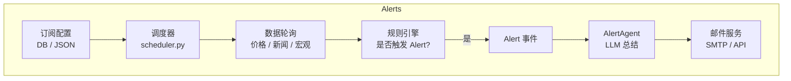
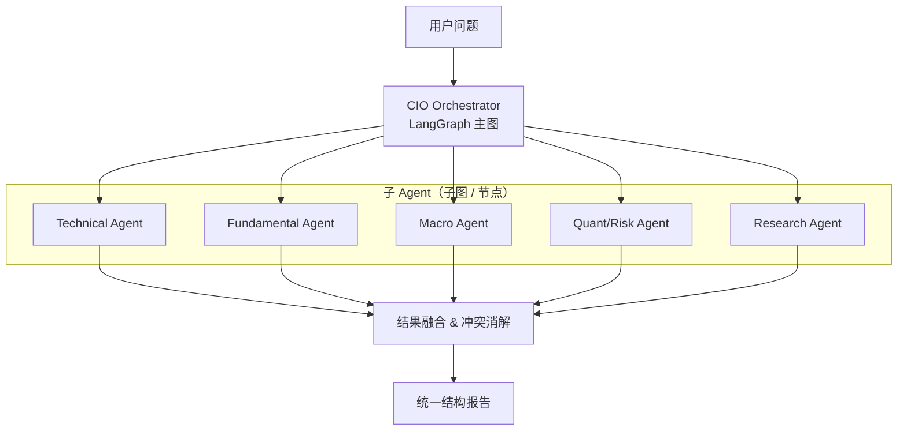
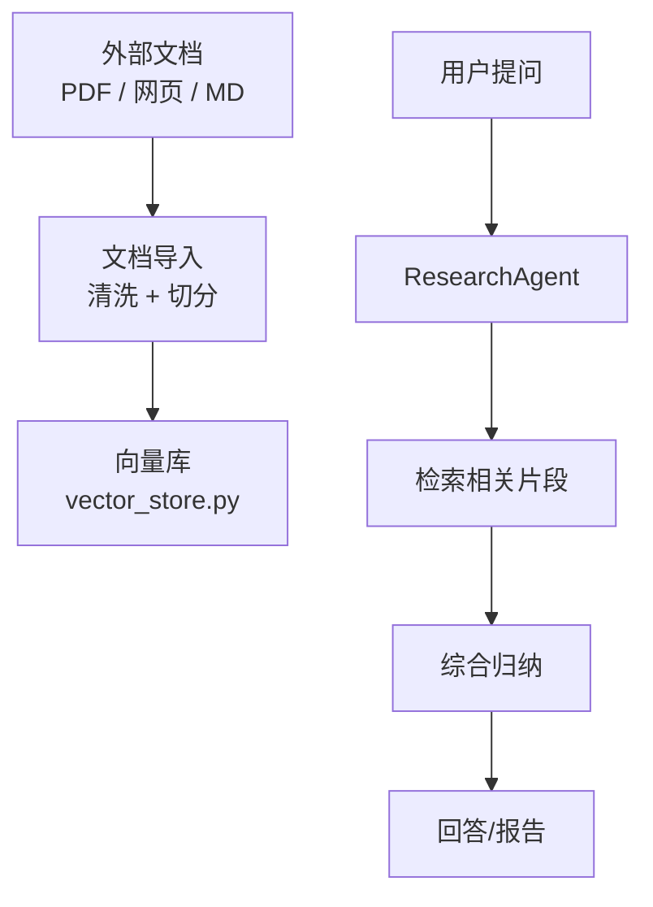

# FinSight AI 升级蓝图执行计划（Sub‑Agent & 深度研究方向）

> 本文是对 [`Future_Blueprint_CN.md`](./Future_Blueprint_CN.md) 与  
> [`CONVERSATIONAL_AGENT_BLUEPRINT_V3.md`](./CONVERSATIONAL_AGENT_BLUEPRINT_V3.md) 的 **落地版执行蓝图**，
> 重点描述：优先级、分阶段目标、关键任务、风险与验收标准。

---

## 1. 当前状态速览（NOW）

### 1.1 Agent 与工具层

- 对话入口：`backend/conversation/agent.py` 的 `ConversationAgent`。
- 意图路由：`router.py` 中的 `Intent`（CHAT / REPORT / FOLLOWUP / ALERT / CLARIFY / GREETING）。
- 工具层：`backend/tools.py` 提供多源数据获取与回退逻辑。
- LangChain 工具注册表：`langchain_tools.py` 使用 `@tool` 装饰器暴露金融工具。
- CIO 报告 Agent：`backend/langchain_agent.py` 中的 `LangChainFinancialAgent`，通过 LangGraph + LangChain Tools 生成 800+ 字专业报告。

### 1.2 前端与用户体验

- 左侧对话（ChatList + ChatInput），右侧行情图表（StockChart + InlineChart）。
- 主题切换：深色 / 浅色。
- 布局模式：居中布局 / 铺满宽度，可在设置中切换。
- 思考过程：ThinkingProcess 组件可显示推理步骤、用时、调用的工具。
- PDF 导出：支持将对话导出为 PDF（含基础信息）。

> 结论：当前版本已经有「单 Agent + 强工具层 + LangGraph CIO 报告」的基础，接下来重点从 **稳定性 → Sub‑Agent → 主动提醒（Alert）→ 深度研究（DeepSearch）** 逐步迭代。

---

## 2. 分阶段目标与优先级

### 总体分层

1. **P0 – 稳定性与易用性**（必须先做）  
   - 工具层 / 回退策略梳理与监控。  
   - 对话流程与错误处理统一。  
   - 前端体验打磨（布局、滚动、提示）。  

2. **P1 – Alert & 邮件订阅体系**（强价值，优先落地）  
   - 订阅模型、触发规则、调度服务。  
   - 邮件内容模版化，支持一键生成简报。  

3. **P2 – Sub‑Agent 多 Agent 协作**  
   - Technical / Fundamental / Macro / Quant / Research 等子 Agent。  
   - 顶层 CIO Agent 负责协调与冲突消解。  

4. **P3 – DeepSearch & 研究档案库**  
   - 向量库、长文抓取、研报归档与复用。  

5. **P4 – 多用户 / 权限 / 历史会话管理**  
   - 用户体系、权限、workspace，准备好云端化的空间。  

> 实施顺序建议：**P0 → P1 → P2 → P3 → P4**。  
> 其中 P0 + P1 适合作为一个大版本（比如 v1.1），P2 / P3 则可以拆成多个小迭代。

---

## 3. P0：稳定性与体验（高优先级）

### 3.1 后端稳定性

**目标**：确保任何工具失败都不会把整个 Agent „拉挂“，同时方便排查问题。

建议任务：

- `backend/tools.py`
  - [ ] 为关键工具补充更细粒度的异常捕获与日志。  
  - [ ] 为回退链增加「来源标签」与「使用计数」统计，便于后续在 LangSmith / 日志中观察。  
  - [ ] 明确每个工具的「硬失败」与「软失败」策略（如：硬失败中断，软失败返回解释文本）。  

- `backend/langchain_agent.py`
  - [ ] 为 LangGraph Agent 增加简单的超时控制与 `max_iterations` 保护。  
  - [ ] 在 `analyze()` 返回结果中增加结构化字段（如 `observations` / `risks` / `recommendation`），方便前端以后做结构化展示。  

- `backend/api/main.py`
  - [ ] 对 `/chat` 与 `/chat/stream` 做统一的错误包装与日志输出。  
  - [ ] 确保即使 LangGraph Agent 挂掉，也能够回退到简化回答（例如仅使用工具层 + 简短说明）。  

### 3.2 前端体验

**目标**：保持品牌条始终可见，聊天区域可滚动，左右布局可根据偏好切换。

建议任务：

- 布局与样式：
  - [x] 移除无用竖线与边框，减少视觉噪音。  
  - [x] 增加“居中布局 / 铺满宽度”设置（已完成）。  
  - [ ] 根据用户反馈继续优化暗色主题、边距和间距。  

- 交互逻辑：
  - [x] 聊天滚动区域只滚动消息，不遮挡顶部栏。  
  - [ ] 当出现图表时智能展开右侧面板，并支持记忆上一次展开状态。  
  - [ ] Settings 中对布局 / 主题 / LLM 配置加强提示文案，避免用户误以为保存失败是“系统坏了”。  

**验收标准（P0 完成）**：  

- 任意工具失败不会导致 500，而是返回“可读”的错误说明。  
- Chat + Report + Followup 三个主场景都能稳定往复调用，无需刷新前端。  
- 深色 / 浅色主题切换、布局模式切换、图表展开与收起行为符合用户直觉。  

---

## 4. P1：Alert & 邮件订阅体系

### 4.1 目标与场景

1. 用户可以订阅：**某只股票 / 指数** 的：
   - 重大新闻（如裁员、并购、政策变化）。  
   - 重要财报与指引。  
   - 大幅波动（如单日涨跌超过 X%、创阶段新高 / 新低）。  
   - 关键宏观事件（FOMC、CPI、公投等）。  

2. 触发时通过邮件（或未来的站内通知）提醒，并附上简短 AI 解读与“是否需要进一步深度分析”的按钮。

### 4.2 后端设计草图

建议新增模块：

- `backend/alerts/models.py`  
  - 定义订阅对象（用户邮箱、标的、触发条件、频率等）。  

- `backend/alerts/scheduler.py`  
  - 简单可行的做法：使用 `asyncio` + `while True + sleep` 或 `APScheduler`，定期拉数据。  

- `backend/alerts/agent.py`  
  - 复用 `backend/langchain_agent.py` 或 Chat 模型，为每个 Alert 生成 2–3 段简短解读。  

- FastAPI 端点：
  - `POST /api/subscribe`、`POST /api/unsubscribe`、`GET /api/subscriptions`。  

### 4.3 前端改动建议

- 在 `SettingsModal` 中新增「订阅管理」区域：
  - 选择标的（手动输入 / 从最近对话中提取）。  
  - 选择事件类型：新闻 / 大幅波动 / 财报 / 宏观等。  
  - 输入邮箱，确认订阅。  

- 后续可以在主界面加入「通知中心」或「最近触发的 Alert」列表。

**验收标准（P1 完成）**：  

- 用户可以完成：创建订阅 → 等待触发 → 收到至少一封结构化 Alert 邮件。  
- 对于明显错误的配置（如无效邮箱、无效标的），系统能给出友好提示。  

---

## 5. P2：Sub‑Agent 多 Agent 协作

### 5.1 目标

从「单 CIO Agent」升级为「CIO Orchestrator + 多子 Agent」：

- Technical Agent：价格、形态、技术指标。  
- Fundamental Agent：财务、估值、商业模式。  
- Macro Agent：宏观环境、行业周期、政策。  
- Quant / Risk Agent：回撤、波动率、相关性。  
- Research Agent：长文研报 / DeepSearch 结果整合。  

顶层 CIO Orchestrator 负责：

- 选择调用哪些子 Agent；  
- 协调不同结论之间的冲突；  
- 以统一风格输出最终报告。  

### 5.2 LangGraph 结构草案

实现建议：

- 在 `backend/agents/` 目录下为每个子 Agent 建独立文件：
  - `technical_agent.py`、`fundamental_agent.py`、`macro_agent.py`、`quant_agent.py`、`research_agent.py`。  
  - 各自绑定不同的工具子集与系统提示。  

- 使用 LangGraph：
  - 顶层图负责解析用户问题、调用子图、收集结果。  
  - 子图保证输出统一的 JSON 结构（例如 `{"summary": ..., "evidence": [...], "confidence": ...}`），方便融合。  

**验收标准（P2 完成）**：  

- 对典型问题（如“综合分析 TSLA 投资价值”），可以看到至少 2–3 个子 Agent 被调用。  
- 最终报告中能明显体现「技术 / 基本面 / 宏观 / 风险」等维度，而不是一坨混合文本。  

---

## 6. P3：DeepSearch 与研究档案库

### 6.1 目标

将 FinSight 从“即时问答工具”升级为“**可持续积累的研究平台**”：

- 可以抓取并解析长文：研报、年报、深度文章等。  
- 将这些内容切分、向量化，存入向量库。  
- 以后对同一公司提问时，可以复用历史研究成果，而不是每次从零开始。  

### 6.2 模块设计草案

建议新增模块：

- `backend/research/deepsearch.py`  
  - 封装爬取 / 抓取逻辑与格式清洗。  

- `backend/research/vector_store.py`  
  - 暂时可以使用简单实现（如 `faiss` 或 `chromadb`），未来再替换为云端服务。  

- `backend/research/agent.py`  
  - ResearchAgent：负责将检索到的片段与实时工具数据结合，产出「深度版」报告。  

**验收标准（P3 完成）**：  

- 至少支持导入 1–2 份公司年报 / 深度分析 PDF，并能在后续问答中引用其中内容。  
- 对同一公司多次提问时，回答能体现「历史研究积累」，而不仅是实时数据。  

---

## 7. P4：多用户 / 权限 / 历史会话

此阶段主要面向未来的「多人使用 / 云端部署」准备。

建议思路：

- 用户模型：`user_id`、权限级别（普通 / 专业 / 内部）、偏好（默认主题、默认布局、默认数据源等）。  
- 历史会话存储：会话标题、时间、摘要、重要结论、引用的工具等。  
- 权限：某些高成本工具或付费数据源，仅对特定用户开放。  

由于目前仍处于单机 / 单用户场景，此阶段可排在较后，但在设计数据库结构与接口时可提前预留字段。  

---

## 8. 风险与思考

1. **数据源稳定性与限流**  
   - 多源回退会带来更多 API 调用，需要注意限流与配额。  
   - 建议在 `backend/tools.py` 中为高成本调用增加简单的节流逻辑或缓存（例如 1 小时内相同请求优先命中缓存）。  

2. **多 Agent 复杂度**  
   - Sub‑Agent 过早、过度设计，可能导致调试难度暴涨。  
   - 建议先在 LangGraph 内实现“单图多工具”的 CIO Agent，当 P0 / P1 稳定后再逐步拆成多个子图。  

3. **前端信息过载**  
   - 随着 Alert / DeepSearch / Multi‑Agent 引入，前端信息量会增加。  
   - 需要注意：不要一次把所有信息堆在一个聊天气泡里，适当使用 Tab、折叠、摘要。  

4. **成本与可观测性**  
   - 建议继续利用 LangSmith 记录调用链路，结合本地日志，观察最常用的工具与失败率。  
   - 在 Sub‑Agent 阶段，可以为每个子 Agent 单独打标签，方便分析“谁最贵 / 谁最不稳定”。  

---

## 9. 阶段性验收 Checklist（摘要）

### P0：稳定性 & 体验

- [ ] 所有工具都有可读的错误信息与日志记录。  
- [ ] `/chat` 不因单个工具失败而 500。  
- [ ] 深浅色主题 + 布局模式 + 图表展开行为稳定、无明显 UI Bug。  

### P1：Alert & 邮件订阅

- [ ] 可创建 / 删除订阅；订阅规则持久化。  
- [ ] 至少一种事件类型可以可靠触发 Alert。  
- [ ] 邮件格式规范，包含简短 AI 解读与“是否需要进一步分析”的提示。  

### P2：Sub‑Agent

- [ ] 至少 2 个子 Agent（例如 Technical + Fundamental）已接入 CIO Orchestrator。  
- [ ] CIO 报告中能明显区分不同维度的结论。  

### P3：DeepSearch

- [ ] 支持导入至少一份长文档，并在回答中引用。  
- [ ] ResearchAgent 能将向量检索结果与工具数据结合输出。  

---

## 10. 总结：从现在到未来

概括来说，未来演进路线可以用一句话概括：

> **先把“单 Agent + 强工具 + 稳体验”打磨到极致，再逐步引入 Alert、Sub‑Agent 和 DeepSearch，最终演化为一款可持续积累、可审计的研究助手。**

本文件将作为后续开发的「执行路线图」使用：  
每完成一个阶段或一个模块，建议在此文末更新实际完成内容与遇到的问题，保持设计与实现同步演进。

