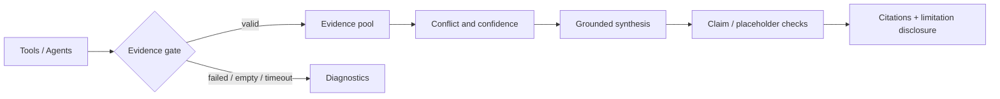

# 幻觉与错误事实治理

更新时间：2026-07-12

FinSight 的目标不是声称“消灭幻觉”，而是把未经取证的金融事实阻挡在证据、合成和渲染边界之外，并在证据不足时明确降级。

## 防线

1. 能力与工具许可：planner 只能选择注册能力，policy 可进一步收紧。
2. 证据门：来源、时间、标的和状态不合格的结果不得进入 evidence pool。
3. diagnostics 隔离：失败文本不会被当成事实提供给 synthesis。
4. 来源优先级：实时/权威数据与历史知识冲突时，显式展示时间和冲突。
5. Agent 公共质量合同：事实、分析和限制分开，保留来源与置信度。
6. research debate：识别跨 Agent 分歧、缺口和低置信结论。
7. synthesis 约束：所有确定性数字、日期和事件必须能回指证据。
8. 后处理与 renderer：过滤占位值/无支撑事件，并按 citation policy 渲染或披露不可用。

## 必须降级的情况

- 实时价格、财务数字或事件没有有效来源；
- 来源过期或时间口径冲突且无法判断；
- 工具全部失败、超时或返回空数据；
- RAG 只返回弱相关文本；
- 多个 Agent 结论冲突且证据不足以消解；
- LLM 输出出现证据中不存在的确定日期、金额、比例或 URL。

正确输出是“当前证据不足/供应商不可用/截至某时间只能确认……”，而不是补写貌似合理的数字。

## 数据与引用规则

- 引用必须保留 source id、标题/URL（可用时）、as-of/published time 和作用域。
- 模型分析可以存在，但必须标为分析或推断，不能伪装为外部事实。
- `chart_ref` 只引用真实 API/数据产物；图表标题和说明不能改变数据含义。
- 用户要求“不使用新闻/链接”等约束由 reply contract/policy 传播，下游不得偷偷加入。

## 验证

测试至少覆盖 evidence/diagnostics 隔离、冲突披露、占位值清理、无来源数字、引用覆盖、过期数据、工具全失败、RAG 空结果和多用户 scope。RAG 指标与运行方法见 [`rag-evaluation-guide.md`](rag-evaluation-guide.md)。
