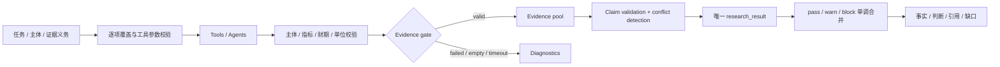

# 幻觉与错误事实治理

更新时间：2026-10-03

FinSight 的目标不是声称“消灭幻觉”，而是把未经取证的金融事实阻挡在证据、合成和渲染边界之外，并在证据不足时明确降级。

```mermaid
flowchart LR
    REQUEST[任务 / 主体 / 证据义务] --> PLAN[逐项覆盖与工具参数校验]
    PLAN --> TOOL[Tools / Agents]
    TOOL --> FACT[主体 / 指标 / 财期 / 单位校验]
    FACT --> GATE{Evidence gate}
    GATE -->|valid| POOL[Evidence pool]
    GATE -->|failed / empty / timeout| DIAG[Diagnostics]
    POOL --> CLAIMS[Claim validation + conflict detection]
    CLAIMS --> SYNTH[唯一 research_result]
    SYNTH --> SCRUB[pass / warn / block 单调合并]
    SCRUB --> RENDER[事实 / 判断 / 引用 / 缺口]
```

## 防线

1. 能力与工具许可：planner 只能选择注册能力，使用实际工具 schema 在调用前校验参数；显式证据义务不能被成本策略删除。
2. 证据门：来源、时间、标的和状态不合格的结果不得进入 evidence pool。
3. diagnostics 隔离：失败文本不会被当成事实提供给 synthesis。
4. 来源优先级：实时/权威数据与历史知识冲突时，显式展示时间和冲突。
5. Agent 公共质量合同：事实、分析和限制分开，保留来源与置信度。
6. Claim 校验与冲突检测：按主体、指标、维度、期限和情景识别同一命题的分歧；不把不同维度的 `bull/bear/neutral` 标签差异自动算作冲突，也不把内部冲突 ID 堆进正文。
7. synthesis 约束：所有确定性数字、日期和事件必须能回指证据。
8. 后处理与 renderer：过滤占位值/无支撑事件，并按 citation policy 渲染或披露不可用。
9. 统一结果与质量：聊天和报告共享 `evaluate_result_quality`，所有来源按最严重状态合并；报告构建成功不能覆盖验证器的阻断，`report=None` 不能让聊天门禁变成通过。

## 金融事实入口

`backend/tools/financial_facts.py` 保存 `subject/metric/value/unit/source/period_start/period_end/frequency` 以及 filing 信息，供 SEC、financial 与 Fundamental 适配复用。

- duration 与 instant 分开，单季度按真实起止日期判定。`10-Q` 标签本身不能证明数值是单季；半年累计、年度与单季不得混用，EPS 不靠累计相减伪补。
- 财务指标使用明确别名和优先级，结果不能依赖供应商数组顺序，也不能用子串把成本当收入或 EBITDA 当 EBIT。
- 报价复用中央解析器，来源、币种和行情时间跨 PriceAgent 保留；`analyzed_at` 只表示分析时点，未知行情时间必须保持空，不能用当前时刻补齐或默认成 USD。
- 同比和环比分别按真实日期匹配，非日历财年保留实际期末；没有对应期就披露缺失。
- 官方公告必须验证发行人代码/名称。另一家公司的官方年报仍是错误主体，不能因为域名可信而引用。
- 新闻搜索格式头/分隔线不是新闻；宏观 CPI 指数水平与同比通胀率必须保留不同指标和单位。

## 实时新闻与事件

`news_event_quality` 将来源、主体、时效、内容性质与核验状态分开。发布时间保留原始精度，首次观察时间不作为发布时间，报道时间也不冒充事件发生时间。旧闻、未知时间、未来异常时间、传闻、观点与搜索摘要不能被列作已确认的当前催化；明确错误标的的报道只留排除诊断。

当前 `reported_news` 是归因报道，核验级别仍为 `headline_only`。规范 URL 与保守报道分组用于去重并保留后续更新，来源数量与报道热度不等于独立核实。未核实的日历搜索结果保存为 `discovery_candidates`，不补造事件日期或真实事件计数。原文取证、语义事件聚类与持续新闻采集不在本版已完成能力中。参考依据和取舍见 [AIHOT 对照记录](archive/2026-10-03-foundation-refactor/NEWS_EVENT_QUALITY.md)。

中间层必须保留 `event_quality/supporting_reports/retrieval_kind/published_at_precision`；同 URL 的跨日新闻、不同主体或不同财务期间不能互相覆盖。Agent 来源 ID 纳入主体、事件与期间身份，同时保留“相同 ID 内容冲突”的阻断检查。

用户明确的 72 小时或 90 天范围从请求合同传到工具参数与证据。`request_window` 仅表示请求，不能证明已采集；实际 `coverage_window` 区分 bounded/complete。返回文章或供应商日历的有限覆盖不能支持“整个窗口没有其它事件”的断言，供应商排程也不冒充官方确认。

业务和竞争必须读取实际披露正文。`include_content=True` 不代表读取成功，必须有 `content_read=True` 和非空 `content_sections`。SEC 公告索引只能证明存在披露文件，不能凭文件名生成商业模式结论。

## 必须降级的情况

- 实时价格、财务数字或事件没有有效来源；
- 来源过期或时间口径冲突且无法判断；
- 工具全部失败、超时或返回空数据；
- RAG 只返回弱相关文本；
- 同一主体、指标、期限和情景下存在真正的相反判断，且证据不足以消解；
- LLM 输出出现证据中不存在的确定日期、金额、比例或 URL。

正确输出是“当前证据不足/供应商不可用/截至某时间只能确认……”，而不是补写貌似合理的数字。

质量只使用 `pass/warn/block`；未知状态不能默认成功，已有 `block` 不可被下游清除。保留受支持内容时聊天可为 `partial`，没有支持内容时为 `unavailable/blocked`。完整研究报告缺少规范化受支持 Claim 或必需维度时不可发布/归档，只有事实的内容仍可作为预览展示。

“执行完成”“质量通过”“已保存”是不同状态：`done` 可能携带质量阻断或保存失败。前端必须分别显示 `answer_status`、质量原因和 `persistence_status`，不能只看到 `done` 就宣称分析完整。

## 数据与引用规则

- 引用必须保留 source id、标题/URL（可用时）、as-of/published time 和作用域。
- 模型分析可以存在，但必须标为分析或推断，不能伪装为外部事实。
- `chart_ref` 只引用真实 API/数据产物；图表标题和说明不能改变数据含义。
- 价格语义的内联图必须强制切到真实行情；renderer 不得把“使用了某种方法/证据”写成已经完成的估值结论。
- 比较型问题必须逐标的展示实际可比指标。缺少 P/E、Forward P/E 或同行基准时，应明确说无法排序，不能用空泛模板替代答案。
- 用户要求“不使用新闻/链接”等约束由 reply contract/policy 传播，下游不得偷偷加入。
- RAG 候选必须满足 owner/thread scope 及模型版本身份；同维 hash、未知身份旧向量不能进入 BGE 语义比较。词法检索可作为明确降级，不等于语义检索验证通过。

## 验证

测试至少覆盖主体/财期/单位正确性、逐任务与标的维度覆盖、evidence/diagnostics 隔离、真实冲突与多维观点共存、质量阻断不可覆盖、引用支持论据、价格图真实数据，以及答案保存恢复。非空正文、HTTP 200 或引用条数都不能单独作为通过标准。RAG 指标与运行方法见 [`rag-evaluation-guide.md`](rag-evaluation-guide.md)。真实外部验收状态记录在本次发布归档，未执行的检查不得写为通过。
