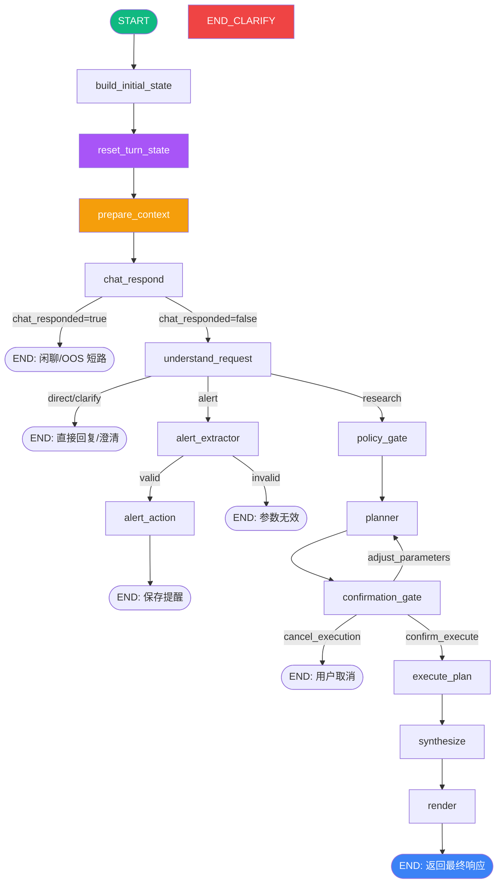
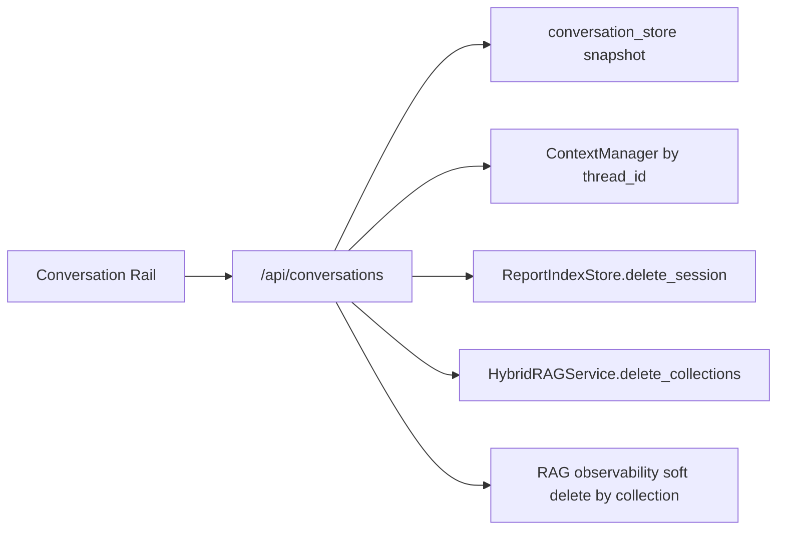
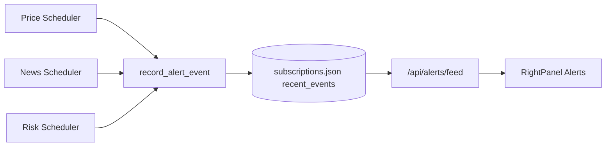

# FinSight LangGraph Flow Documentation

> 2026-05-03 状态说明：当前主路径已接入 `prepare_context -> chat_respond -> understand_request`。`chat_respond` 提供两层闲聊/OOS 防御（Tier-1 规则白名单 + Tier-2 LLM 分类器 sidecar），命中即 END。旧 `trim_history / summarize_history / normalize_ui_context / decide_output_mode / resolve_subject / clarify / parse_operation` 章节保留为 helper 或兼容节点说明，不再代表主聊天路径。会话生命周期走 `/api/conversations` + `conversation_store` snapshot；停止生成会产生 `cancelled` trace/pipeline 事件，并通过 executor/agent cancellation token 尽量中止后续工作。

> Current overview is aligned to `backend/graph/runner.py`; legacy node-by-node notes are marked as compatibility detail.

---

## Architecture Overview



**Source**: `backend/graph/runner.py` — `_build_graph()`

---

## Node-by-Node Data Flow

### 1. build_initial_state

| Field | Direction | Description |
|-------|-----------|-------------|
| `query` | Read | 用户原始查询 |
| `ui_context` | Read | 前端传入的上下文 (selections, ticker, etc.) |
| `thread_id` | Write | 生成/复用线程 ID |
| `schema_version` | Write | 当前 State schema 版本 |

**Source**: `backend/graph/nodes/__init__.py` → `build_initial_state`

---

### 1b. reset_turn_state

| Field | Direction | Description |
|-------|-----------|-------------|
| `subject` | Write (None) | 清除上一轮残留的 subject |
| `operation` | Write (None) | 清除上一轮残留的 operation |
| `clarify` | Write (None) | 清除澄清标记 |
| `policy` | Write (None) | 清除策略缓存 |
| `plan_ir` | Write (None) | 清除计划 IR |
| `artifacts` | Write (None) | 清除制品 |
| `chat_responded` | Write (None) | 清除聊天回复标记 |
| `understanding/tasks/blocked_tasks/context_refs` | Write (None) | 清除上一轮请求理解结果 |
| `confirmation_*` (5) | Write (None) | 清除所有确认门控字段 |
| `trace` | Write | 保留 spans (events/timings/failures)，清除运行时 sub-keys (operation_decision/planner_runtime/synthesize_runtime/executor/rag) |

**设计意图**: 确保每个新 turn 从干净状态开始，防止 early-stop turn（如问候语）的残留数据污染后续 turn。

**Source**: `backend/graph/nodes/reset_turn_state.py`

---

### 2. prepare_context（主路径）

| Field | Direction | Description |
|-------|-----------|-------------|
| `messages` | Read/Write | 修剪超预算历史，并在需要时写入摘要 |
| `ui_context` | Read/Write | 规范化 selections、active_symbol、view 等前端上下文 |
| `output_mode` | Write | 合并 UI 显式模式和默认 chat/report hints；普通聊天默认 `chat`，只有报告按钮或报告词进入 `investment_report` |

`prepare_context` 是当前主路径的上下文准备入口。它承接旧 `trim_history`、`summarize_history`、`normalize_ui_context`、`decide_output_mode` 的职责，减少图上前半段节点数量，并保证 `understand_request` 获取的是同一份规范化上下文。

**Source**: `backend/graph/nodes/prepare_context.py`

---

### 2L. trim_history (legacy helper)

| Field | Direction | Description |
|-------|-----------|-------------|
| `messages` | Read | Checkpointer 累积的完整对话历史 |
| `messages` | Write | `RemoveMessage` 列表 (删除超出 token 预算的旧消息) |

**Token 预算兜底**: 使用 `langchain_core.messages.trim_messages` + `tiktoken` (cl100k_base) 计算 token 数。当总 token 超过预算时，从最早的消息开始删除，保留最近的消息。

- 删除方式: 返回 `RemoveMessage(id=...)` 列表，由 `add_messages` reducer 原生处理
- 如果消息数为空或在预算内: 返回空 dict `{}`，不做任何修改

| Environment Variable | Default | Description |
|---------------------|---------|-------------|
| `LANGGRAPH_MAX_HISTORY_TOKENS` | `8000` | 对话历史最大 token 数 |

**Source**: `backend/graph/nodes/trim_conversation_history.py`

---

### 3L. summarize_history (legacy helper)

| Field | Direction | Description |
|-------|-----------|-------------|
| `messages` | Read | 当前对话消息列表 |
| `messages` | Write | `RemoveMessage` 列表 + `SystemMessage` 摘要 |

**条件压缩**: 当对话消息数超过阈值时，将旧消息压缩为一条 `SystemMessage` 摘要，保留最近 N 条消息。

**处理流程**:
1. 统计 `HumanMessage` + `AIMessage` 数量
2. 若 ≤ 阈值 → 返回空 dict，不做任何处理
3. 若 > 阈值 → 提取旧消息内容为摘要文本 (`[对话摘要]` 前缀)
4. 返回: `RemoveMessage` (删除旧消息) + `SystemMessage` (摘要)

**摘要提取** (确定性，零 LLM):
- `HumanMessage` → 保留完整 content
- `AIMessage` → 截断到 100 字符 + "..."
- 格式: `[用户]: xxx` / `[助手]: xxx`

| Environment Variable | Default | Description |
|---------------------|---------|-------------|
| `LANGGRAPH_SUMMARIZE_THRESHOLD` | `12` | 触发摘要的消息数阈值 |
| `LANGGRAPH_SUMMARIZE_KEEP_RECENT` | `6` | 保留最近 N 条消息 |

**Source**: `backend/graph/nodes/summarize_history.py`

---

### 4L. normalize_ui_context (legacy helper)

| Field | Direction | Description |
|-------|-----------|-------------|
| `ui_context` | Read/Write | 规范化 UI 上下文 (补全缺失字段, 格式统一) |

将前端传入的松散 `ui_context` 规范化为标准格式。

---

### 5L. decide_output_mode (legacy helper)

| Field | Direction | Description |
|-------|-----------|-------------|
| `query` | Read | 用户查询 |
| `ui_context` | Read | 规范化后的上下文 |
| `output_mode` | Write | `"brief"` \| `"investment_report"` \| `"chat"` |

基于查询意图和上下文决定输出模式:
- 简单价格查询 → `brief`
- 深度分析/比较 → `investment_report`
- 日常对话 → `chat`

---

### 6. understand_request（主路径）

| Field | Direction | Description |
|-------|-----------|-------------|
| `query` | Read | 用户查询 |
| `ui_context` | Read | selection、active_symbol、portfolio 等上下文 |
| `understanding` | Write | route、summary、confidence、assumptions |
| `tasks` | Write | 可执行任务列表 |
| `blocked_tasks` | Write | 局部阻塞任务列表 |
| `subject` / `operation` | Write | primary task 的兼容投影 |
| `artifacts.draft_markdown` | Write | direct/clarify route 的短回复 |
| `trace` | Write | understanding 用户可见 trace |

**条件边**:
- `route=direct/clarify` → **END**
- `route=alert` 或 primary operation=`alert_set` → `alert_extractor`
- `route=research` → `policy_gate`

**Source**: `backend/graph/nodes/understand_request.py`

---

### 6L. resolve_subject（legacy compatibility）

| Field | Direction | Description |
|-------|-----------|-------------|
| `query` | Read | 用户查询 |
| `ui_context` | Read | UI 上下文 (可能包含预选 ticker) |
| `subject` | Write | `{subject_type, tickers, selection_ids, selection_types, selection_payload}` |

识别查询主体:
- `subject_type`: `company` \| `portfolio` \| `news_item` \| `filing` \| `research_doc` \| `market`
- `tickers`: 解析出的股票代码列表

---

### 7L. clarify（legacy compatibility）

| Field | Direction | Description |
|-------|-----------|-------------|
| `query` | Read | 用户查询 |
| `subject` | Read | 解析后的主体 |
| `clarify` | Write | `{needed: bool, message?: str}` |

**条件边**:
- `clarify.needed = true` → **END** (返回澄清请求给用户)
- `clarify.needed = false` → 继续到 `parse_operation`

---

### 8L. parse_operation（legacy compatibility）

| Field | Direction | Description |
|-------|-----------|-------------|
| `query` | Read | 用户查询 |
| `subject` | Read | 主体信息 |
| `operation` | Write | `{type, params}` — 如 `price`, `technical`, `compare`, `generate_report` |

将查询意图映射为可执行操作类型。

---

### 9. policy_gate

| Field | Direction | Description |
|-------|-----------|-------------|
| `operation` | Read | 操作类型 |
| `subject` | Read | 主体信息 |
| `tasks` | Read | 多任务请求的 ready task 列表 |
| `policy` | Write | `{budget, constraints, allowed_tools, max_rounds, max_seconds}`，工具白名单按 tasks 并集 |

根据操作类型设置资源预算:
- `BUDGET_MAX_TOOL_CALLS` (default: 24)
- `BUDGET_MAX_ROUNDS` (default: 12)
- `BUDGET_MAX_SECONDS` (default: 120)

---

### 10. planner ★

| Field | Direction | Description |
|-------|-----------|-------------|
| `query` | Read | 用户查询 |
| `subject` | Read | 主体信息 |
| `operation` | Read | 操作类型 |
| `tasks` | Read | 多任务请求时生成多组 PlanIR steps |
| `policy` | Read | 资源预算 |
| `plan_ir` | Write | PlanIR (执行计划中间表示) |
| `trace` | Write | `planner_runtime` 追踪数据 |

**双模式**:
- `LANGGRAPH_PLANNER_MODE=stub` (default): 确定性 stub 生成 PlanIR
- `LANGGRAPH_PLANNER_MODE=llm`: LLM 生成 PlanIR (带 A/B 实验)

**PlanIR Schema**:
```json
{
  "steps": [
    {
      "id": "step_1",
      "kind": "tool|agent|llm",
      "name": "get_price|news_agent|...",
      "inputs": {"ticker": "AAPL", ...},
      "parallel_group": 1,
      "timeout_sec": 30
    }
  ],
  "budget": {"max_tool_calls": 24, "max_rounds": 12, "max_seconds": 120}
}
```

**A/B 实验**: SHA256(thread_id + salt) % 100 < split → Variant A, else B
- Variant A: 最少步骤, 强确定性
- Variant B: 可解释性和鲁棒性

**Agent 选择**: 通过 `capability_registry.select_agents_for_request()` 动态选择 2-4 个 agent

**Source**: `backend/graph/nodes/planner.py`

---

### 11. execute_plan ★

| Field | Direction | Description |
|-------|-----------|-------------|
| `plan_ir` | Read | 执行计划 |
| `subject` | Read | 主体信息 (包含 selection_payload) |
| `artifacts` | Write | `{evidence_pool, rag_context, step_results}` |
| `trace` | Write | 执行追踪 |

**双模式**:
- `LANGGRAPH_EXECUTE_LIVE_TOOLS=false` (default): dry_run stub 模式
- `LANGGRAPH_EXECUTE_LIVE_TOOLS=true`: 实际调用 tools 和 agents

**执行流程**:
1. 解析 PlanIR steps, 按 `parallel_group` 分组
2. 同一 parallel_group 内的 steps 并发执行 (`asyncio.gather`)
3. 收集所有 step_results
4. 构建 `evidence_pool` (合并 selection_payload + tool outputs + agent outputs)
5. RAG v2: ingest evidence → hybrid_search → rag_context

**Source**: `backend/graph/nodes/execute_plan_stub.py`

---

### 12. synthesize ★

| Field | Direction | Description |
|-------|-----------|-------------|
| `artifacts` | Read | evidence_pool, rag_context, step_results |
| `subject` | Read | 主体信息 |
| `plan_ir` | Read | 执行计划 (用于模板选择) |
| `artifacts.render_vars` | Write | 模板渲染变量 (RenderVars) |
| `trace` | Write | `synthesize_runtime` 追踪数据 |

**双模式**:
- `LANGGRAPH_SYNTHESIZE_MODE=stub` (default): 确定性模板填充
- `LANGGRAPH_SYNTHESIZE_MODE=llm`: LLM 生成渲染变量

**RenderVars** (16 个字符串字段):
`title`, `executive_summary`, `price_section`, `fundamental_section`, `news_section`, `technical_section`, `macro_section`, `deep_section`, `risks_section`, `outlook_section`, `agent_summaries`, `agent_status`, `key_data`, `recommendation`, `confidence_score`, `meta_section`

**Protected Fields** (LLM 模式下不可覆盖): `price_section`, `fundamental_section`, `technical_section`, `macro_section`, `key_data`

**Source**: `backend/graph/nodes/synthesize.py`

---

### 13. render

| Field | Direction | Description |
|-------|-----------|-------------|
| `artifacts` | Read | render_vars |
| `output_mode` | Read | 输出模式 |
| `messages` | Write | 最终响应消息 |

根据 `output_mode` 选择模板渲染最终输出:
- `brief`: 简短价格/摘要回复
- `investment_report`: 完整投资研报 (Markdown)
- `chat`: 对话式回复

**Source**: `backend/graph/nodes/__init__.py` → `render_stub`

---

## Environment Variables

| Variable | Default | Effect |
|----------|---------|--------|
| `LANGGRAPH_MAX_HISTORY_TOKENS` | `8000` | 对话历史最大 token 数 (trim_history) |
| `LANGGRAPH_SUMMARIZE_THRESHOLD` | `12` | 触发摘要压缩的消息数阈值 |
| `LANGGRAPH_SUMMARIZE_KEEP_RECENT` | `6` | 摘要时保留最近 N 条消息 |
| `LANGGRAPH_PLANNER_MODE` | `stub` | planner 模式: stub \| llm |
| `LANGGRAPH_SYNTHESIZE_MODE` | `stub` | synthesize 模式: stub \| llm |
| `LANGGRAPH_EXECUTE_LIVE_TOOLS` | `false` | executor 是否实际调用 tools |
| `LANGGRAPH_PLANNER_TEMPERATURE` | `0.2` | LLM planner 温度 |
| `LANGGRAPH_SYNTHESIZE_TEMPERATURE` | `0.2` | LLM synthesize 温度 |
| `LANGGRAPH_PLANNER_AB_ENABLED` | `false` | A/B 实验开关 |
| `LANGGRAPH_PLANNER_AB_SPLIT` | `50` | A/B 分流比例 (%) |
| `LANGGRAPH_ESCALATION_MIN_CONFIDENCE` | `0.72` | 高成本 Agent 最低置信度门槛 |
| `BUDGET_MAX_TOOL_CALLS` | `24` | 单次查询最大工具调用数 |
| `BUDGET_MAX_ROUNDS` | `12` | 最大轮次 |
| `BUDGET_MAX_SECONDS` | `120` | 最大执行秒数 |

---

## Checkpointer

Supports 3 backends (configured via `LANGGRAPH_CHECKPOINTER_BACKEND`):
- `memory` (default dev): In-memory, lost on restart
- `sqlite`: File-based persistence
- `postgres`: Production-grade with optional pipelining

**Source**: `backend/graph/checkpointer.py`

---

## Phase I Event Contracts (I1-I4)

### A) Execution stream identity contract

- 所有 SSE 事件携带：
  - `run_id`
  - `session_id`
  - `schema_version`
- 统一注入点：`backend/services/execution_service.py` 的 `_stamp_ids(payload)`。
- 前端消费：
  - `frontend/src/api/client.ts` 透传 `runId/sessionId` 到 `onThinking/onRawEvent`
  - `frontend/src/store/executionStore.ts` 按 `runId` 过滤并写入 `timeline`
- 取消语义：
  - 前端点击停止后调用 `AbortController.abort()`。
  - 后端在 `run_graph_pipeline` / `resume_graph_pipeline` 中捕获 `asyncio.CancelledError`，发送 `trace.stage="cancelled"` 与 `pipeline_stage.stage="cancelled"`。
  - executor 与 agent adapter 读取 `backend/graph/cancellation.py` 的 context-scoped token，停止后续 step/agent 输出。
  - 前端保留 partial answer、thinking steps 和停止提示，不报 missing done。


### A2) Conversation lifecycle contract

- `GET /api/conversations`：列出当前后端 conversation snapshot 与 session context 摘要。
- `POST /api/conversations`：创建或触达会话，返回规范化 `session_id`。
- `GET /api/conversations/{id}`：读取会话摘要和轻量 messages/title snapshot。
- `PATCH /api/conversations/{id}`：同步标题、messages、置顶和归档 metadata。
- `DELETE /api/conversations/{id}`：清理 session context、report/citation index、thread RAG collections 和对应 RAG observability runs。



### B) Alert feed contract

- 新增接口：`GET /api/alerts/feed?email&limit&since`
- 事件源：
  - `PriceChangeScheduler`
  - `NewsAlertScheduler`
  - `RiskAlertScheduler`
- 持久化：`SubscriptionService.record_alert_event` 写入每个订阅的 `recent_events`
- 前端消费：`RightPanelAlertsTab` 展示“最近触发事件 + 当前订阅配置”



### B2) Alert feed contract（更新版，2026-02-18）

- 新增接口：`GET /api/alerts/feed?email&limit&since`
- 事件源：`PriceChangeScheduler`、`NewsAlertScheduler`、`RiskAlertScheduler`
- 持久化：`SubscriptionService.record_alert_event` 写入 `recent_events`
- 前端消费：`RightPanelAlertsTab` 展示“最近触发事件 + 当前订阅配置”
- 轮询策略：`useRightPanelData` 每 `60s` 拉取 `alerts/feed + subscriptions`
- 空态模型：
  - 事件：`no_email | loading | error | no_events | ready`
  - 订阅：`no_email | loading | error | no_subscriptions | ready`

### C) Execution visibility close-out

- `RightPanel` 仅在 `activeRuns` 出现 `0->N` 时自动切到 `execution`。
- 若用户已锁定非执行标签页（`userPinnedTab`），执行标签页显示脉冲提示，不强切当前视图。
- 进入 `execution` 标签页后自动清除“未查看执行”提示。
