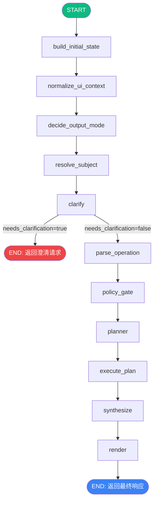

# FinSight LangGraph Flow Documentation

> Complete data flow documentation for the 11-node StateGraph pipeline.

---

## Architecture Overview



**Source**: `backend/graph/runner.py:33-77` — `_build_graph()`

---

## Node-by-Node Data Flow

### 1. build_initial_state

| Field | Direction | Description |
|-------|-----------|-------------|
| `query` | Read | 用户原始查询 |
| `ui_context` | Read | 前端传入的上下文 (selections, ticker, etc.) |
| `thread_id` | Write | 生成/复用线程 ID |
| `schema_version` | Write | 当前 State schema 版本 |

**Source**: `backend/graph/nodes/__init__.py` → `build_initial_state`

---

### 2. normalize_ui_context

| Field | Direction | Description |
|-------|-----------|-------------|
| `ui_context` | Read/Write | 规范化 UI 上下文 (补全缺失字段, 格式统一) |

将前端传入的松散 `ui_context` 规范化为标准格式。

---

### 3. decide_output_mode

| Field | Direction | Description |
|-------|-----------|-------------|
| `query` | Read | 用户查询 |
| `ui_context` | Read | 规范化后的上下文 |
| `output_mode` | Write | `"brief"` \| `"investment_report"` \| `"chat"` |

基于查询意图和上下文决定输出模式:
- 简单价格查询 → `brief`
- 深度分析/比较 → `investment_report`
- 日常对话 → `chat`

---

### 4. resolve_subject

| Field | Direction | Description |
|-------|-----------|-------------|
| `query` | Read | 用户查询 |
| `ui_context` | Read | UI 上下文 (可能包含预选 ticker) |
| `subject` | Write | `{subject_type, tickers, selection_ids, selection_types, selection_payload}` |

识别查询主体:
- `subject_type`: `company` \| `portfolio` \| `news_item` \| `filing` \| `research_doc` \| `market`
- `tickers`: 解析出的股票代码列表

---

### 5. clarify (条件分支)

| Field | Direction | Description |
|-------|-----------|-------------|
| `query` | Read | 用户查询 |
| `subject` | Read | 解析后的主体 |
| `clarify` | Write | `{needed: bool, message?: str}` |

**条件边**:
- `clarify.needed = true` → **END** (返回澄清请求给用户)
- `clarify.needed = false` → 继续到 `parse_operation`

---

### 6. parse_operation

| Field | Direction | Description |
|-------|-----------|-------------|
| `query` | Read | 用户查询 |
| `subject` | Read | 主体信息 |
| `operation` | Write | `{type, params}` — 如 `price`, `technical`, `compare`, `generate_report` |

将查询意图映射为可执行操作类型。

---

### 7. policy_gate

| Field | Direction | Description |
|-------|-----------|-------------|
| `operation` | Read | 操作类型 |
| `subject` | Read | 主体信息 |
| `policy` | Write | `{budget, constraints, allowed_tools, max_rounds, max_seconds}` |

根据操作类型设置资源预算:
- `BUDGET_MAX_TOOL_CALLS` (default: 24)
- `BUDGET_MAX_ROUNDS` (default: 12)
- `BUDGET_MAX_SECONDS` (default: 120)

---

### 8. planner ★

| Field | Direction | Description |
|-------|-----------|-------------|
| `query` | Read | 用户查询 |
| `subject` | Read | 主体信息 |
| `operation` | Read | 操作类型 |
| `policy` | Read | 资源预算 |
| `plan_ir` | Write | PlanIR (执行计划中间表示) |
| `trace` | Write | `planner_runtime` 追踪数据 |

**双模式**:
- `LANGGRAPH_PLANNER_MODE=stub` (default): 确定性 stub 生成 PlanIR
- `LANGGRAPH_PLANNER_MODE=llm`: LLM 生成 PlanIR (带 A/B 实验)

**PlanIR Schema**:
```json
{
  "steps": [
    {
      "id": "step_1",
      "kind": "tool|agent|llm",
      "name": "get_price|news_agent|...",
      "inputs": {"ticker": "AAPL", ...},
      "parallel_group": 1,
      "timeout_sec": 30
    }
  ],
  "budget": {"max_tool_calls": 24, "max_rounds": 12, "max_seconds": 120}
}
```

**A/B 实验**: SHA256(thread_id + salt) % 100 < split → Variant A, else B
- Variant A: 最少步骤, 强确定性
- Variant B: 可解释性和鲁棒性

**Agent 选择**: 通过 `capability_registry.select_agents_for_request()` 动态选择 2-4 个 agent

**Source**: `backend/graph/nodes/planner.py`

---

### 9. execute_plan ★

| Field | Direction | Description |
|-------|-----------|-------------|
| `plan_ir` | Read | 执行计划 |
| `subject` | Read | 主体信息 (包含 selection_payload) |
| `artifacts` | Write | `{evidence_pool, rag_context, step_results}` |
| `trace` | Write | 执行追踪 |

**双模式**:
- `LANGGRAPH_EXECUTE_LIVE_TOOLS=false` (default): dry_run stub 模式
- `LANGGRAPH_EXECUTE_LIVE_TOOLS=true`: 实际调用 tools 和 agents

**执行流程**:
1. 解析 PlanIR steps, 按 `parallel_group` 分组
2. 同一 parallel_group 内的 steps 并发执行 (`asyncio.gather`)
3. 收集所有 step_results
4. 构建 `evidence_pool` (合并 selection_payload + tool outputs + agent outputs)
5. RAG v2: ingest evidence → hybrid_search → rag_context

**Source**: `backend/graph/nodes/execute_plan_stub.py`

---

### 10. synthesize ★

| Field | Direction | Description |
|-------|-----------|-------------|
| `artifacts` | Read | evidence_pool, rag_context, step_results |
| `subject` | Read | 主体信息 |
| `plan_ir` | Read | 执行计划 (用于模板选择) |
| `artifacts.render_vars` | Write | 模板渲染变量 (RenderVars) |
| `trace` | Write | `synthesize_runtime` 追踪数据 |

**双模式**:
- `LANGGRAPH_SYNTHESIZE_MODE=stub` (default): 确定性模板填充
- `LANGGRAPH_SYNTHESIZE_MODE=llm`: LLM 生成渲染变量

**RenderVars** (16 个字符串字段):
`title`, `executive_summary`, `price_section`, `fundamental_section`, `news_section`, `technical_section`, `macro_section`, `deep_section`, `risks_section`, `outlook_section`, `agent_summaries`, `agent_status`, `key_data`, `recommendation`, `confidence_score`, `meta_section`

**Protected Fields** (LLM 模式下不可覆盖): `price_section`, `fundamental_section`, `technical_section`, `macro_section`, `key_data`

**Source**: `backend/graph/nodes/synthesize.py`

---

### 11. render

| Field | Direction | Description |
|-------|-----------|-------------|
| `artifacts` | Read | render_vars |
| `output_mode` | Read | 输出模式 |
| `messages` | Write | 最终响应消息 |

根据 `output_mode` 选择模板渲染最终输出:
- `brief`: 简短价格/摘要回复
- `investment_report`: 完整投资研报 (Markdown)
- `chat`: 对话式回复

**Source**: `backend/graph/nodes/__init__.py` → `render_stub`

---

## Environment Variables

| Variable | Default | Effect |
|----------|---------|--------|
| `LANGGRAPH_PLANNER_MODE` | `stub` | planner 模式: stub \| llm |
| `LANGGRAPH_SYNTHESIZE_MODE` | `stub` | synthesize 模式: stub \| llm |
| `LANGGRAPH_EXECUTE_LIVE_TOOLS` | `false` | executor 是否实际调用 tools |
| `LANGGRAPH_PLANNER_TEMPERATURE` | `0.2` | LLM planner 温度 |
| `LANGGRAPH_SYNTHESIZE_TEMPERATURE` | `0.2` | LLM synthesize 温度 |
| `LANGGRAPH_PLANNER_AB_ENABLED` | `false` | A/B 实验开关 |
| `LANGGRAPH_PLANNER_AB_SPLIT` | `50` | A/B 分流比例 (%) |
| `LANGGRAPH_ESCALATION_MIN_CONFIDENCE` | `0.72` | 高成本 Agent 最低置信度门槛 |
| `BUDGET_MAX_TOOL_CALLS` | `24` | 单次查询最大工具调用数 |
| `BUDGET_MAX_ROUNDS` | `12` | 最大轮次 |
| `BUDGET_MAX_SECONDS` | `120` | 最大执行秒数 |

---

## Checkpointer

Supports 3 backends (configured via `LANGGRAPH_CHECKPOINTER_BACKEND`):
- `memory` (default dev): In-memory, lost on restart
- `sqlite`: File-based persistence
- `postgres`: Production-grade with optional pipelining

**Source**: `backend/graph/checkpointer.py`
