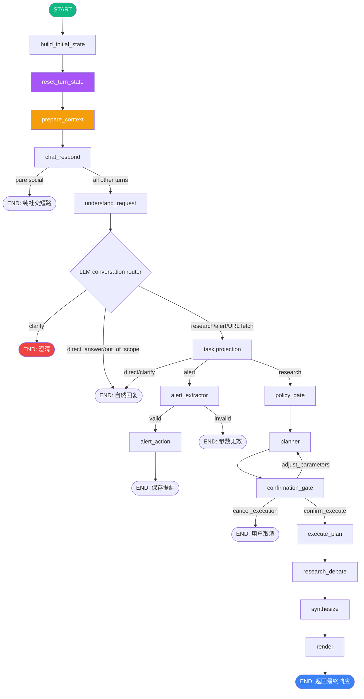
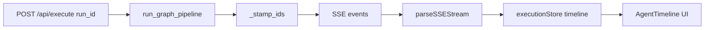
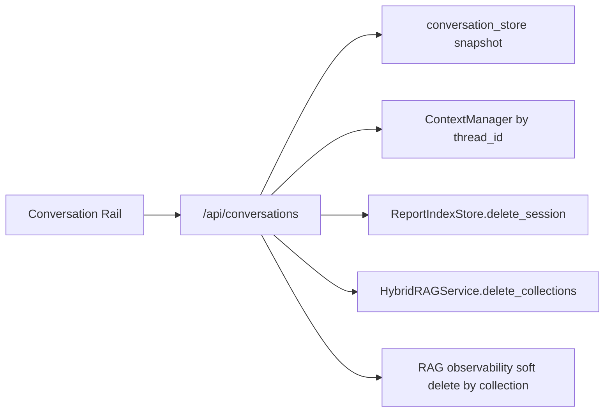
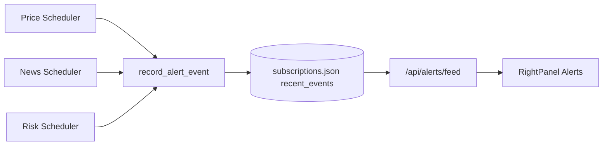

# FinSight LangGraph Flow Documentation

> 2026-05-06 状态说明：当前主路径为 `prepare_context -> chat_respond -> understand_request`。`chat_respond` 只短路纯问候/感谢/确认/再见；开放闲聊、非金融请求、能力问题、URL/网页/文章请求、指代追问和普通金融问题都进入 `understand_request` 的 LLM conversation router。Router 在 planner 前决定 direct/research/alert/clarify/out_of_scope，只有 research/alert 才继续进入工具规划；URL 读取是 planner/agent 工具 `fetch_url_content`，不是理解层预抓取。显式报告按钮、`investment_report` 或强报告 query（深度投资报告 / deep report / filing document longform）进入报告模板。旧 `trim_history / summarize_history / normalize_ui_context / decide_output_mode / resolve_subject / clarify / parse_operation` 章节保留为 helper 或兼容节点说明，不再代表主聊天路径。
> 2026-05-10 增量：`understand_request` 写入 `reply_contract`，用 `chat_answer/source_grounded_answer/report_generation` 三条 lane 固定 UX 行为；工具失败、403、rejected、empty、timeout 等写入 `artifacts.tool_diagnostics`，不得进入 `evidence_pool`。
> 2026-05-11 验收：`tests/eval/chat_router_100.json` 的最终 current-state 运行见 `docs/qa/chat-router-100-final100-current-state.md` / `.json`，结果 `100/100 PASS`，覆盖 18 类连续对话和取证/报告红线。
> 2026-05-24 增量：`understand_request` 现在把 router 解析出的 frame 统一编译为 `intent_contract`。`facets -> required_evidence` 是 planner/tool/agent 选择的权威输入；`operation` 只是兼容投影。外部实体影响类 query（如 TSLA + SpaceX）由 `external_entity_impact` facet 触发 price/news/risk evidence，而不是靠实体名白名单。普通机制解释如果没有 current/latest/source/news/price 等取证要求，会在 planner 前保持 direct。
> 2026-05-25 增量：生产发布默认启用 request-frame contract enforcement。`answer` lane 的零 evidence frame 只在解释/定义/机制类问题上短路 direct；缺少对象的“这只票/分析影响”等弱指代仍走 clarify。`research/action/report` lane 必须由 coverage validator 证明 required evidence/results 已被 plan steps 满足；holdings、backtest、external impact、valuation rank、macro context 都有对应回归样例。

> Current overview is aligned to `backend/graph/runner.py`; legacy node-by-node notes are marked as compatibility detail.

---

## Architecture Overview



**Source**: `backend/graph/runner.py` — `_build_graph()`

### 全部 21 个注册节点（`graph.add_node`）

| # | 节点 | 角色 | 归属 |
|---|---|---|---|
| 1 | build_initial_state | 初始化 state / thread_id | ✅ 主路径 |
| 2 | reset_turn_state | 重置每轮状态 | ✅ 主路径 |
| 3 | prepare_context | 准备上下文（记忆 / selection） | ✅ 主路径 |
| 4 | chat_respond | 纯社交短路（问候 / 感谢 / 告别） | ✅ 主路径 |
| 5 | understand_request | LLM 对话路由 + intent_contract | ✅ 主路径 |
| 6 | policy_gate | agent/tool 白名单 + **agents_override** | ✅ 主路径 |
| 7 | planner | 任务规划 | ✅ 主路径 |
| 8 | confirmation_gate | 执行前确认（report 模式） | ✅ 主路径 |
| 9 | execute_plan | 执行计划 → 调度 agents / tools | ✅ 主路径 |
| 10 | research_debate | 多 agent 辩论 / 裁决 | ✅ 主路径 |
| 11 | synthesize | 综合 agent 多段分析 + claims + chart_specs | ✅ 主路径 |
| 12 | render | 渲染最终响应 | ✅ 主路径 |
| 13 | alert_extractor | 提取提醒参数 | 🔔 alert 分支 |
| 14 | alert_action | 保存提醒（可回流 policy_gate） | 🔔 alert 分支 |
| 15 | resolve_subject | 解析标的 | 🧩 legacy 兼容 |
| 16 | clarify | 澄清 | 🧩 legacy 兼容 |
| 17 | parse_operation | 解析操作 | 🧩 legacy 兼容 |
| 18 | trim_history | 裁剪历史 | ⚙️ helper（未接主图边） |
| 19 | summarize_history | 摘要历史 | ⚙️ helper（未接主图边） |
| 20 | normalize_ui_context | 规范化 ui_context | ⚙️ helper（未接主图边） |
| 21 | decide_output_mode | 决定输出模式 | ⚙️ helper（未接主图边） |

> 主路径（✅）+ alert 分支（🔔）构成当前运行时图；legacy（🧩）节点保留供兼容/聚焦单测，helper（⚙️）节点已 `add_node` 但当前主图未接入边。**手动选 Agent（`@agent`）经 `ui_context.agents_override` 在 `policy_gate` 生效**（与 `/api/execute` 复用同一覆盖入口）。

---

## Node-by-Node Data Flow

### 1. build_initial_state

| Field | Direction | Description |
|-------|-----------|-------------|
| `query` | Read | 用户原始查询 |
| `ui_context` | Read | 前端传入的上下文 (selections, ticker, etc.) |
| `thread_id` | Write | 生成/复用线程 ID |
| `schema_version` | Write | 当前 State schema 版本 |

**Source**: `backend/graph/nodes/__init__.py` → `build_initial_state`

---

### 1b. reset_turn_state

| Field | Direction | Description |
|-------|-----------|-------------|
| `subject` | Write (None) | 清除上一轮残留的 subject |
| `operation` | Write (None) | 清除上一轮残留的 operation |
| `clarify` | Write (None) | 清除澄清标记 |
| `policy` | Write (None) | 清除策略缓存 |
| `plan_ir` | Write (None) | 清除计划 IR |
| `artifacts` | Write (None) | 清除制品 |
| `chat_responded` | Write (None) | 清除聊天回复标记 |
| `understanding/reply_contract/tasks/blocked_tasks/context_refs` | Write (None) | 清除上一轮请求理解结果和 UX 契约 |
| `confirmation_*` (5) | Write (None) | 清除所有确认门控字段 |
| `trace` | Write | 保留 spans (events/timings/failures)，清除运行时 sub-keys (operation_decision/planner_runtime/synthesize_runtime/executor/rag) |

**设计意图**: 确保每个新 turn 从干净状态开始，防止 early-stop turn（如问候语）的残留数据污染后续 turn。

**Source**: `backend/graph/nodes/reset_turn_state.py`

---

### 2. prepare_context（主路径）

| Field | Direction | Description |
|-------|-----------|-------------|
| `messages` | Read/Write | 修剪超预算历史，并在需要时写入摘要 |
| `ui_context` | Read/Write | 规范化 selections、active_symbol、view 等前端上下文 |
| `output_mode` | Write | 合并 UI 显式模式和默认 chat/report hints；普通聊天默认 `chat`，报告按钮、显式 `investment_report` 或强报告 query 进入报告模板 |

`prepare_context` 是当前主路径的上下文准备入口。它承接旧 `trim_history`、`summarize_history`、`normalize_ui_context`、`decide_output_mode` 的职责，减少图上前半段节点数量，并保证 `understand_request` 获取的是同一份规范化上下文。

**Source**: `backend/graph/nodes/prepare_context.py`

---

### 2L. trim_history (legacy helper)

| Field | Direction | Description |
|-------|-----------|-------------|
| `messages` | Read | Checkpointer 累积的完整对话历史 |
| `messages` | Write | `RemoveMessage` 列表 (删除超出 token 预算的旧消息) |

**Token 预算兜底**: 使用 `langchain_core.messages.trim_messages` + `tiktoken` (cl100k_base) 计算 token 数。当总 token 超过预算时，从最早的消息开始删除，保留最近的消息。

- 删除方式: 返回 `RemoveMessage(id=...)` 列表，由 `add_messages` reducer 原生处理
- 如果消息数为空或在预算内: 返回空 dict `{}`，不做任何修改

| Environment Variable | Default | Description |
|---------------------|---------|-------------|
| `LANGGRAPH_MAX_HISTORY_TOKENS` | `8000` | 对话历史最大 token 数 |

**Source**: `backend/graph/nodes/trim_conversation_history.py`

---

### 3L. summarize_history (legacy helper)

| Field | Direction | Description |
|-------|-----------|-------------|
| `messages` | Read | 当前对话消息列表 |
| `messages` | Write | `RemoveMessage` 列表 + `SystemMessage` 摘要 |

**条件压缩**: 当对话消息数超过阈值时，将旧消息压缩为一条 `SystemMessage` 摘要，保留最近 N 条消息。

**处理流程**:
1. 统计 `HumanMessage` + `AIMessage` 数量
2. 若 ≤ 阈值 → 返回空 dict，不做任何处理
3. 若 > 阈值 → 提取旧消息内容为摘要文本 (`[对话摘要]` 前缀)
4. 返回: `RemoveMessage` (删除旧消息) + `SystemMessage` (摘要)

**摘要提取** (确定性，零 LLM):
- `HumanMessage` → 保留完整 content
- `AIMessage` → 截断到 100 字符 + "..."
- 格式: `[用户]: xxx` / `[助手]: xxx`

| Environment Variable | Default | Description |
|---------------------|---------|-------------|
| `LANGGRAPH_SUMMARIZE_THRESHOLD` | `12` | 触发摘要的消息数阈值 |
| `LANGGRAPH_SUMMARIZE_KEEP_RECENT` | `6` | 保留最近 N 条消息 |

**Source**: `backend/graph/nodes/summarize_history.py`

---

### 4L. normalize_ui_context (legacy helper)

| Field | Direction | Description |
|-------|-----------|-------------|
| `ui_context` | Read/Write | 规范化 UI 上下文 (补全缺失字段, 格式统一) |

将前端传入的松散 `ui_context` 规范化为标准格式。

---

### 5L. decide_output_mode (legacy helper)

| Field | Direction | Description |
|-------|-----------|-------------|
| `query` | Read | 用户查询 |
| `ui_context` | Read | 规范化后的上下文 |
| `output_mode` | Write | `"brief"` \| `"investment_report"` \| `"chat"` |

历史 helper 的输出模式推断仅供兼容入口使用。当前主路径中普通发送默认 `chat`，简单价格/新闻可以由合成层自然短答；显式报告按钮、`output_mode=investment_report` 或强报告 query 才进入报告模板；“不要生成报告 / no report” 这类否定词优先保持 chat。

---

### 6. understand_request（主路径）

| Field | Direction | Description |
|-------|-----------|-------------|
| `query` | Read | 用户查询 |
| `ui_context` | Read | selection、active_symbol、portfolio 等上下文 |
| `understanding` | Write | route、summary、confidence、assumptions |
| `reply_contract` | Write | lane、answer_style、length_preference、source_constraints、citation_policy、continuation_target |
| `intent_contract` / `intent_contracts` | Write | evidence-first 语义合同；保存 facets、required_evidence、render_intent 和 budget_profile |
| `tasks` | Write | 可执行任务列表 |
| `blocked_tasks` | Write | 局部阻塞任务列表 |
| `subject` / `operation` | Write | primary task 的兼容投影 |
| `artifacts.draft_markdown` | Write | direct/out_of_scope/clarify route 的短回复 |
| `artifacts.conversation_decision` | Write | LLM router 的执行路径、上下文绑定、关系和领域意图 |
| `trace` | Write | conversation_router / understanding 用户可见 trace |

**条件边**:
- `route=direct/clarify` → **END**
- `route=alert` 或 primary operation=`alert_set` → `alert_extractor`
- `route=research` → `policy_gate`

**Planner 前 gate**:
- `direct_answer` / `out_of_scope`：直接由 LLM 生成自然对话回复，不进入 planner。
- `research`：投影成 ready task，进入 `policy_gate -> planner`。
- `clarify`：缺少必要上下文时结束并提示补充。
- `no news/no links/direct answer` 纠偏会写入 `reply_contract.source_constraints.disallow_news=true`，后续 policy/planner 必须遵守。
- router `task_hints` 不是最终操作指令；落 task 前会先通过 `intent_contract.py` 编译为证据义务，再投影成兼容 `operation`。
- 金融机制解释 guard：`why/how/can` 型问题默认 direct；如果 router hint 只是 macro/theme/unknown 的代理标的（例如 `CL=F`），且 query 没有取证要求，不视为必须执行。

**Source**: `backend/graph/nodes/understand_request.py`

---

### 6L. resolve_subject（legacy compatibility）

| Field | Direction | Description |
|-------|-----------|-------------|
| `query` | Read | 用户查询 |
| `ui_context` | Read | UI 上下文 (可能包含预选 ticker) |
| `subject` | Write | `{subject_type, tickers, selection_ids, selection_types, selection_payload}` |

识别查询主体:
- `subject_type`: `company` \| `portfolio` \| `news_item` \| `filing` \| `research_doc` \| `market`
- `tickers`: 解析出的股票代码列表

---

### 7L. clarify（legacy compatibility）

| Field | Direction | Description |
|-------|-----------|-------------|
| `query` | Read | 用户查询 |
| `subject` | Read | 解析后的主体 |
| `clarify` | Write | `{needed: bool, message?: str}` |

**条件边**:
- `clarify.needed = true` → **END** (返回澄清请求给用户)
- `clarify.needed = false` → 继续到 `parse_operation`

---

### 8L. parse_operation（legacy compatibility）

| Field | Direction | Description |
|-------|-----------|-------------|
| `query` | Read | 用户查询 |
| `subject` | Read | 主体信息 |
| `operation` | Write | `{type, params}` — 如 `price`, `technical`, `compare`, `generate_report` |

将查询意图映射为可执行操作类型。

---

### 9. policy_gate

| Field | Direction | Description |
|-------|-----------|-------------|
| `operation` | Read | 操作类型 |
| `subject` | Read | 主体信息 |
| `tasks` | Read | 多任务请求的 ready task 列表 |
| `policy` | Write | `{budget, constraints, allowed_tools, max_rounds, max_seconds}`，工具白名单按 tasks 并集 |

根据操作类型设置资源预算:
- `BUDGET_MAX_TOOL_CALLS` (default: 24)
- `BUDGET_MAX_ROUNDS` (default: 12)
- `BUDGET_MAX_SECONDS` (default: 120)

---

### 10. planner ★

| Field | Direction | Description |
|-------|-----------|-------------|
| `query` | Read | 用户查询 |
| `subject` | Read | 主体信息 |
| `operation` | Read | 操作类型 |
| `tasks` | Read | 多任务请求时生成多组 PlanIR steps |
| `policy` | Read | 资源预算 |
| `plan_ir` | Write | PlanIR (执行计划中间表示) |
| `trace` | Write | `planner_runtime` 追踪数据 |

**双模式**:
- `LANGGRAPH_PLANNER_MODE=stub` (default): 确定性 stub 生成 PlanIR
- `LANGGRAPH_PLANNER_MODE=llm`: LLM 生成 PlanIR (带 A/B 实验)

**PlanIR Schema**:
```json
{
  "steps": [
    {
      "id": "step_1",
      "kind": "tool|agent|llm",
      "name": "get_price|news_agent|...",
      "inputs": {"ticker": "AAPL", ...},
      "parallel_group": 1,
      "timeout_sec": 30
    }
  ],
  "budget": {"max_tool_calls": 24, "max_rounds": 12, "max_seconds": 120}
}
```

**A/B 实验**: SHA256(thread_id + salt) % 100 < split → Variant A, else B
- Variant A: 最少步骤, 强确定性
- Variant B: 可解释性和鲁棒性

**Agent 选择**: 通过 `capability_registry.select_agents_for_request()` 动态选择 2-4 个 agent

**Agent 选择诊断** (2026-05-20)：`plan_ready` 事件新增 `agent_selection` 字段，包含每个被跳过 Agent 的原因枚举（`deepsearch_not_requested` / `not_needed_for_output_mode` / `budget_or_depth_limited` / `not_selected_by_planner`）和已选 Agent 的 `budget_priority` 排序。前端 `pipelineReducer` 消费此字段；`decision_note.details.agent_selection` 同步携带。

**Schema 容错** (2026-05-20)：LLM 返回 PlanIR JSON 解析失败时，先自动修复常见错误（缺逗号、截断等），仍失败则构造含错误上下文的重试 prompt 二次请求 LLM（`PlannerSchemaShapeError` → `_build_schema_retry_prompt`）。

**安全边界** (2026-05-20)：conversation_router 新增内幕/非公开信息请求检测，此类请求被拒绝进入 research 链路。新闻引用兜底确保 `reply_contract` 有可引用 URL。多轮对话中历史 ticker 自动补全主题提示。

**报告与技术面执行闭环** (2026-05-21)：强报告 query 可覆盖前端默认 `chat`，进入 `report_generation`；request-understanding tasks 路径的 `investment_report` 会保留 SEC 10-K/10-Q、CompanyFacts、8-K、权威媒体、电话会 transcript 和报告 agent 步骤。显式技术面 query 在 chat 模式也会计划 `technical_agent`，与价格和技术指标快照共同执行。

**执行闭环守卫** (2026-05-21)：`conversation_router` 对 `task_hints` 做结构化可执行判定；`understand_request` 会把错误的 `direct_answer + 可执行 task_hints` 强制投射为 research，同时保留 no-news、纯机制解释和历史数值追问的 direct 路径。direct 答复层清理“是否启动研究/进入研究链路”类二次确认，避免用户已明确提问时继续绕圈。

**显式执行 fast path 与 Agent 超时** (2026-05-21)：`investment_report` 与技术面 query 已明确需要执行时，`conversation_router` 直接返回 research，不再等待路由 LLM；`BaseFinancialAgent` 对内部 LLM 分析、gap detection、summary update 设置硬超时，超时后保留确定性摘要。`technical_agent` 的确定性摘要补充支撑/阻力、MA20 偏离和成交量相对均量。

**Source**: `backend/graph/nodes/planner.py`

---

### 11. execute_plan ★

| Field | Direction | Description |
|-------|-----------|-------------|
| `plan_ir` | Read | 执行计划 |
| `subject` | Read | 主体信息 (包含 selection_payload) |
| `artifacts` | Write | `{evidence_pool, tool_diagnostics, rag_context, step_results}` |
| `trace` | Write | 执行追踪 |

**双模式**:
- `LANGGRAPH_EXECUTE_LIVE_TOOLS=false` (default): dry_run stub 模式
- `LANGGRAPH_EXECUTE_LIVE_TOOLS=true`: 实际调用 tools 和 agents

**执行流程**:
1. 解析 PlanIR steps, 按 `parallel_group` 分组
2. 同一 parallel_group 内的 steps 并发执行 (`asyncio.gather`)
3. 收集所有 step_results
4. 构建 `evidence_pool` (合并 selection_payload + 成功 tool outputs + agent outputs)；失败/拒绝/空/超时输出进入 `tool_diagnostics`
5. RAG v2: ingest evidence → hybrid_search → rag_context

**Source**: `backend/graph/nodes/execute_plan_stub.py`

---

### 12. synthesize ★

| Field | Direction | Description |
|-------|-----------|-------------|
| `artifacts` | Read | evidence_pool, tool_diagnostics, rag_context, step_results |
| `subject` | Read | 主体信息 |
| `plan_ir` | Read | 执行计划 (用于模板选择) |
| `artifacts.render_vars` | Write | 模板渲染变量 (RenderVars) |
| `trace` | Write | `synthesize_runtime` 追踪数据 |

**双模式**:
- `LANGGRAPH_SYNTHESIZE_MODE=stub` (default): 确定性模板填充
- `LANGGRAPH_SYNTHESIZE_MODE=llm`: LLM 生成渲染变量

**RenderVars** (16 个字符串字段):
`title`, `executive_summary`, `price_section`, `fundamental_section`, `news_section`, `technical_section`, `macro_section`, `deep_section`, `risks_section`, `outlook_section`, `agent_summaries`, `agent_status`, `key_data`, `recommendation`, `confidence_score`, `meta_section`

**Protected Fields** (LLM 模式下不可覆盖): `price_section`, `fundamental_section`, `technical_section`, `macro_section`, `key_data`

**Source**: `backend/graph/nodes/synthesize.py`

---

### 13. render

| Field | Direction | Description |
|-------|-----------|-------------|
| `artifacts` | Read | render_vars |
| `output_mode` | Read | 输出模式 |
| `messages` | Write | 最终响应消息 |

根据 `output_mode` 选择最终输出:
- `chat`: 默认对话式回复，可短可长，按 query 和上下文决定
- `brief`: 兼容轻量摘要模式，不作为主 UI 的“深度/简报”切换心智模型
- `investment_report`: 完整投资研报 (Markdown)，由报告按钮、显式选项或强报告 query 触发

**Source**: `backend/graph/nodes/__init__.py` → `render_stub`

---

## Environment Variables

| Variable | Default | Effect |
|----------|---------|--------|
| `LANGGRAPH_MAX_HISTORY_TOKENS` | `8000` | 对话历史最大 token 数 (trim_history) |
| `LANGGRAPH_SUMMARIZE_THRESHOLD` | `12` | 触发摘要压缩的消息数阈值 |
| `LANGGRAPH_SUMMARIZE_KEEP_RECENT` | `6` | 摘要时保留最近 N 条消息 |
| `LANGGRAPH_PLANNER_MODE` | `stub` | planner 模式: stub \| llm |
| `LANGGRAPH_SYNTHESIZE_MODE` | `stub` | synthesize 模式: stub \| llm |
| `LANGGRAPH_EXECUTE_LIVE_TOOLS` | `false` | executor 是否实际调用 tools |
| `LANGGRAPH_PLANNER_TEMPERATURE` | `0.2` | LLM planner 温度 |
| `LANGGRAPH_SYNTHESIZE_TEMPERATURE` | `0.2` | LLM synthesize 温度 |
| `LANGGRAPH_PLANNER_AB_ENABLED` | `false` | A/B 实验开关 |
| `LANGGRAPH_PLANNER_AB_SPLIT` | `50` | A/B 分流比例 (%) |
| `LANGGRAPH_ESCALATION_MIN_CONFIDENCE` | `0.72` | 高成本 Agent 最低置信度门槛 |
| `BUDGET_MAX_TOOL_CALLS` | `24` | 单次查询最大工具调用数 |
| `BUDGET_MAX_ROUNDS` | `12` | 最大轮次 |
| `BUDGET_MAX_SECONDS` | `120` | 最大执行秒数 |

---

## Checkpointer

Supports 3 backends (configured via `LANGGRAPH_CHECKPOINTER_BACKEND`):
- `memory` (default dev): In-memory, lost on restart
- `sqlite`: File-based persistence
- `postgres`: Production-grade with optional pipelining

**Source**: `backend/graph/checkpointer.py`

---

## Phase I Event Contracts (I1-I4)

### A) Execution stream identity contract

- 所有 SSE 事件携带：
  - `run_id`
  - `session_id`
  - `schema_version`
- 统一注入点：`backend/services/execution_service.py` 的 `_stamp_ids(payload)`。
- 前端消费：
  - `frontend/src/api/client.ts` 透传 `runId/sessionId` 到 `onThinking/onRawEvent`
  - `frontend/src/store/executionStore.ts` 按 `runId` 过滤并写入 `timeline`
- 取消语义：
  - 前端点击停止后调用 `AbortController.abort()`。
  - 后端在 `run_graph_pipeline` / `resume_graph_pipeline` 中捕获 `asyncio.CancelledError`，发送 `trace.stage="cancelled"` 与 `pipeline_stage.stage="cancelled"`。
  - executor 与 agent adapter 读取 `backend/graph/cancellation.py` 的 context-scoped token，停止后续 step/agent 输出。
  - 前端保留 partial answer、thinking steps 和停止提示，不报 missing done。



### A2) Conversation lifecycle contract

- `GET /api/conversations`：列出当前后端 conversation snapshot 与 session context 摘要。
- `POST /api/conversations`：创建或触达会话，返回规范化 `session_id`。
- `GET /api/conversations/{id}`：读取会话摘要和轻量 messages/title snapshot。
- `PATCH /api/conversations/{id}`：同步标题、messages、置顶和归档 metadata。
- `DELETE /api/conversations/{id}`：清理 session context、report/citation index、thread RAG collections 和对应 RAG observability runs。



### B) Alert feed contract

- 新增接口：`GET /api/alerts/feed?email&limit&since`
- 事件源：
  - `PriceChangeScheduler`
  - `NewsAlertScheduler`
  - `RiskAlertScheduler`
- 持久化：`SubscriptionService.record_alert_event` 写入每个订阅的 `recent_events`
- 前端消费：`RightPanelAlertsTab` 展示“最近触发事件 + 当前订阅配置”



### B2) Alert feed contract（更新版，2026-02-18）

- 新增接口：`GET /api/alerts/feed?email&limit&since`
- 事件源：`PriceChangeScheduler`、`NewsAlertScheduler`、`RiskAlertScheduler`
- 持久化：`SubscriptionService.record_alert_event` 写入 `recent_events`
- 前端消费：`RightPanelAlertsTab` 展示“最近触发事件 + 当前订阅配置”
- 轮询策略：`useRightPanelData` 每 `60s` 拉取 `alerts/feed + subscriptions`
- 空态模型：
  - 事件：`no_email | loading | error | no_events | ready`
  - 订阅：`no_email | loading | error | no_subscriptions | ready`

### C) Execution visibility close-out

- `RightPanel` 仅在 `activeRuns` 出现 `0->N` 时自动切到 `execution`。
- 若用户已锁定非执行标签页（`userPinnedTab`），执行标签页显示脉冲提示，不强切当前视图。
- 进入 `execution` 标签页后自动清除“未查看执行”提示。
