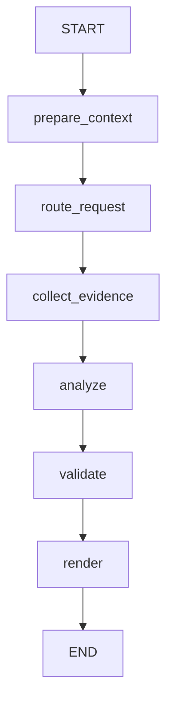

# FinSight LangGraph 当前流程

更新时间：2026-07-16

`backend/graph/runner.py` 是图结构唯一事实源。生产图固定为六个节点，不注册旧兼容节点、confirmation loop、alert action 或 research debate。

```mermaid
flowchart TD
    START --> PC[prepare_context]
    PC --> RR[route_request]
    RR --> CE[collect_evidence]
    CE --> AN[analyze]
    AN --> VA[validate]
    VA --> RE[render]
    RE --> END
```

| 节点 | 输入重点 | 输出与硬约束 |
|---|---|---|
| `prepare_context` | query、thread id、UI context、checkpoint | 本轮 GraphState；不得跨租户复用上下文 |
| `route_request` | query、当前 thread 历史、active symbol/selection | direct/clarify/research 路由与请求帧；确定性优先，歧义时最多一次 router LLM |
| `collect_evidence` | 请求帧、planning、policy | 工具结果、evidence、diagnostics、TaskOutcome；collector 自身 LLM/reflection 固定关闭 |
| `analyze` | 结构化 evidence | 事实查询 0 次 LLM；研究最多一次 ResearchAnalyst；报告可进入 verifier 条件 |
| `validate` | Claim、引用、outcome、候选正文 | 质量状态、阻断/降级理由；失败不能伪装为成功证据 |
| `render` | 已验证产物 | Chat/Report 最终输出；不得再次取数或生成新事实 |

## 路由原则

- 用户本轮显式 ticker/URL/selection 优先于历史。
- 普通金融概念与问候可直接回答，不进入工具执行。
- 当前价格、新闻、财务、技术指标、SEC/FRED 或来源请求进入 evidence 采集。
- Dashboard handoff 只传 active symbol 和来源标签；不存在 Portfolio UI context 或 MiniChat 专用协议。
- 用户明确写出的多 ticker/持仓问题可作为研究主题，但系统不读取已删除的组合工作台状态。
- 工具不可用、数据不足、认证失败和 LLM 错误均使用稳定状态码并进入 diagnostics。

## SSE 边界

所有 Chat 与 Report 执行只使用 `POST /api/execute`。运行事件回放使用 `/api/execute/runs/{run_id}/events`，取消使用 `/api/execute/runs/{run_id}/cancel`。前端不得建立第二个执行流。
