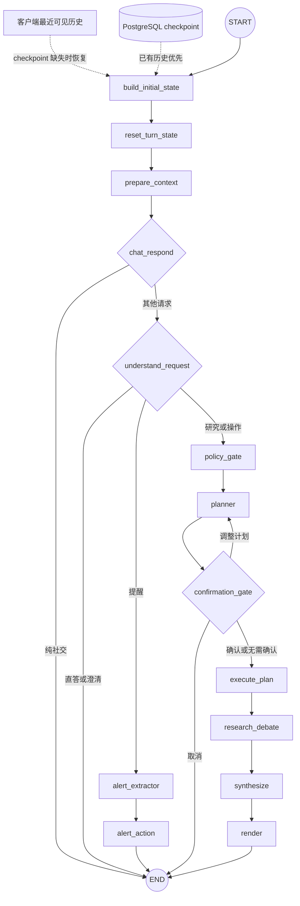

# LangGraph 当前流程

更新时间：2026-07-14　事实源：`backend/graph/runner.py`

## 主图

```mermaid
flowchart TD
    UIH[客户端最近可见历史] -. checkpoint 缺失时恢复 .-> INIT
    CP[(PostgreSQL checkpoint)] -. 已有历史优先 .-> INIT
    S((START)) --> INIT[build_initial_state]
    INIT --> RESET[reset_turn_state]
    RESET --> PREP[prepare_context]
    PREP --> CHAT{chat_respond}
    CHAT -->|纯社交| E((END))
    CHAT -->|其他请求| U{understand_request}
    U -->|直答或澄清| E
    U -->|提醒| AX[alert_extractor] --> AA[alert_action] --> E
    U -->|研究或操作| PG[policy_gate] --> PL[planner] --> CG{confirmation_gate}
    CG -->|取消| E
    CG -->|调整计划| PL
    CG -->|确认或无需确认| EX[execute_plan]
    EX --> DB[research_debate] --> SY[synthesize] --> RE[render] --> E
```

## 节点职责

| 节点 | 输入重点 | 输出重点 |
|---|---|---|
| `build_initial_state` | API 请求、checkpoint、客户端最近可见历史 | 标准 GraphState；仅在 checkpoint 无消息时恢复最多 12 条客户端历史 |
| `reset_turn_state` | 历史 state | 清理本轮临时字段，保留有作用域的会话信息 |
| `prepare_context` | query、UI、历史 | 规范化本轮上下文 |
| `chat_respond` | 当前 query | 仅纯社交快速回复；其他请求继续理解 |
| `understand_request` | query 与上下文 | 确定性术语直答，或 tasks、request frames、reply contract、路由决定 |
| `alert_extractor/action` | 提醒意图 | 结构化提醒与执行结果 |
| `policy_gate` | 请求合同 | 能力、工具、证据和安全约束 |
| `planner` | tasks + policy | PlanIR；LLM 失败时使用规则规划器回退 |
| `confirmation_gate` | 计划与风险 | 继续、取消或调整 |
| `execute_plan` | PlanIR | step results、evidence pool、diagnostics、execution events |
| `research_debate` | 多 Agent 结果 | 分歧、置信度和待披露限制 |
| `synthesize` | task 身份、PlanStep、证据与研究结论 | Claim 校验、四态 TaskOutcome、结构化 task/report 产物与 coverage |
| `render` | 合成产物与 output mode | 按 task group 或报告合同单次渲染，并统一 finalize 引用与告警 |

## 分支约束

- 纯社交可以不进入工具与 RAG。
- 直答/澄清由请求理解结果直接结束，不创建虚假研究计划。
- 提醒走独立 extractor/action 分支。
- 高影响操作由 `confirmation_gate` 暂停；调整后回到 `planner`。
- 工具失败只能进入 diagnostics；只有通过 evidence gate 的结果进入证据池。
- 纯金融术语定义在任何 active symbol/history 绑定和 LLM 路由前确定性结束，且不创建计划或 provider 调用。
- ready/blocked task 均保留 task/frame/group/render/order 身份；blocked task 不进入 PlanIR，执行后每个原始 requested task 必须结算为四态之一。
- `research_debate` 位于执行与合成之间，不是独立 API 入口。
- 普通回答按 group/priority/order 使用隔离 state slice 渲染；报告必须先通过结构化 pre/final gate，禁止 renderer 二次合成或补写 Claim。
- 客户端历史只用于同线程 checkpoint 缺失恢复；已有 checkpoint 时不得重复注入。
- 匿名长期记忆按完整 thread id 派生隔离身份；ticker 焦点只接受当前 query 明示值或当前 thread 已验证主焦点，不从助手正文扩散缩写。已验证焦点必须进入 router 输入；明确的操作、风险、技术面等省略追问即使 router LLM 不可用，也要投影为该 ticker 的研究任务，不能落到泛化闲聊文案。
- 会话 router/reply 失败时允许给出可用回退，但必须在 trace、SSE 和终态中明确标记降级。

## 注册但不在当前主边的节点

`trim_history`、`summarize_history`、`normalize_ui_context`、`decide_output_mode` 仍被图注册，供兼容或独立调用；不要在当前主路径图中把它们画成 `prepare_context` 后的必经节点。
