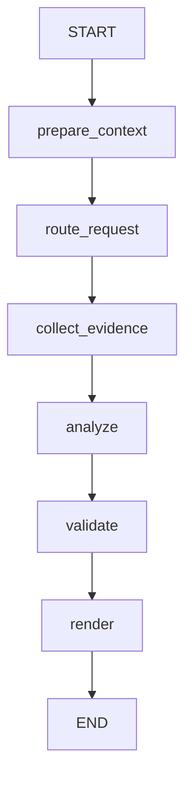
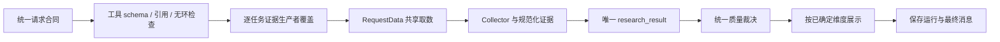

# FinSight LangGraph 当前流程

更新时间：2026-10-08

`backend/graph/runner.py` 是图结构唯一事实源。生产图固定为六个节点，不注册旧兼容节点、confirmation loop、alert action 或 research debate。

```mermaid
flowchart TD
    START --> PC[prepare_context]
    PC --> RR[route_request]
    RR --> CE[collect_evidence]
    CE --> AN[analyze]
    AN --> VA[validate]
    VA --> RE[render]
    RE --> END
```

| 节点 | 输入重点 | 输出与硬约束 |
|---|---|---|
| `prepare_context` | query、thread id、UI context、checkpoint | 本轮 GraphState；不得跨租户复用上下文 |
| `route_request` | query、当前 thread 历史、active symbol/selection | 简单请求走明确规则；复杂请求由当前选定模型提取原始要求，再由 `request_compiler` 校验和投影 frame/task/operation 与证据义务 |
| `collect_evidence` | 请求合同、planning、policy | 真实工具 schema 与 DAG 校验、逐任务/主体/维度覆盖、共享取数、证据和 diagnostics |
| `analyze` | 规范化 evidence/claim、任务结果 | 确定性事实或受证据约束的研究结果；模型调用按实际任务/草稿/核验与重试记录 |
| `validate` | `research_result`、引用、outcome | `pass/warn/block` 按严重程度合并；保留缺口与已有阻断 |
| `render` | 已验证产物 | Chat/Report 最终输出；不得再次取数或生成新事实 |

## 路由原则

- 用户本轮显式 ticker/URL/selection 优先于历史。
- 普通金融概念与问候可直接回答，不进入工具执行；通用概念使用同一选定模型，固定术语和问候可零模型调用。澄清正文由最终渲染保留，不覆盖成研究证据缺失提示。
- 当前价格、新闻、财务、技术指标、SEC/FRED 或来源请求进入 evidence 采集。
- Dashboard handoff 只传 active symbol 和来源标签；不存在 Portfolio UI context 或 MiniChat 专用协议。
- 用户明确写出的多 ticker/持仓问题可作为研究主题，但系统不读取已删除的组合工作台状态。
- 工具不可用、数据不足、认证失败和 LLM 错误均使用稳定状态码并进入 diagnostics。
- 标的绑定完成后，一次性编译 `request_frame_id`、task ID、`required_evidence` 与 render identity；兼容 operation 是投影视图，不能成为另一个意图所有者。
- 多标的请求逐项检查 `(task_id, subject, evidence_kind)`，只取得 AAPL 报价不能满足 MSFT 的技术或基本面义务。
- 复杂请求的原始分母保存在 `understanding.semantic_contract`，包括指标、交易日/日历/财期、否定约束及输入依赖。后续计划丢项不能缩小完整性检查范围；未知能力保留为未支持，缺公司或旧报告时明确澄清。
- 模型只抽取语义，注册能力、证据类别和工具参数由代码确定。报表合并/母公司口径使用类型化限定值，时间范围及价格口径有各自字段；未知限定原样保留，不让已支持基础指标停止取数。结构校验最多纠正一次，与首次理解共用阶段截止时间。仍失败则在 `trace.request_requirements` 记录 `request_contract_unconfirmed`，按原问进行通用检索，并将完整原问保留为未确认要求；实际事实可以展示，但任何旧规则任务不得据此被标成已回答，未确认报告不归档。

`request_spec.py` 定义版本化请求与限定条件；`research_capabilities.py` 是指标、属性、实际生产者与验证域的共享注册。未知限定条件保留原文并标记未映射，不能作为自由 payload 键查找。报告意图由入口语义决定，编译后不再以全局 query 或旧 operation 重写任务范围。

执行阶段保存 `task_evidence_normalization`，文档内容、任务引用及抓取观测分开；合成直接引用这一份规范化结果。`validate` 冻结任务状态和发布结果，`render` 只读。同一内容状态经 SSE、恢复、历史读取保持一致；旧告警和来源质量与内容完成度分别呈现。

## 采集与回答边界

```mermaid
flowchart LR
    REQUEST[统一请求合同] --> PLAN[工具 schema / 引用 / 无环检查]
    PLAN --> COVER[逐任务证据生产者覆盖]
    COVER --> DATA[RequestData 共享取数]
    DATA --> AGENT[Collector 与规范化证据]
    AGENT --> RESULT[唯一 research_result]
    RESULT --> GATE[统一质量裁决]
    GATE --> RENDER[按已确定维度展示]
    RENDER --> SAVE[保存运行与最终消息]
```

`depends_on` 要求上游成功；`data_dependencies` 只要求上游结束，允许 Agent 披露某个来源失败并使用其他有效证据。阶段分组只用于展示，不再决定真实依赖或去重身份。

生成唯一研究结果不代表只允许一次模型调用。结构化结果已产生时不再追加一份竞争的通用正文；多任务分析、报告草稿、核验和允许的重试各有明确消费者及 usage 记录。

## SSE 边界

所有 Chat 与 Report 执行只使用 `POST /api/execute`。`GET /api/execute/runs/{run_id}` 读取持久状态，`/events` 续传或恢复终态，`/cancel` 取消当前进程中的执行。前端不得建立第二个执行流。

登录请求先保存问题及助手占位，最终回复事务提交后才发送完成；`done` 分别携带内容质量、运行状态与 `persistence_status`。进程重启后的读取不会重跑付费调用；失联租约转为 `interrupted`，重新生成需要新的 run ID。详见 [执行事件合同](execution-event-contract.md)。
