# FinSight LangGraph 全流程深度拆解

> 版本：v1.2.0-request-understanding | 更新时间：2026-05-03 | 当前运行时以 `backend/graph/runner.py` 为准 | Agent 数：7

> 2026-05-03 状态说明：主聊天路径已接入 `prepare_context -> understand_request`。旧 `trim_history / summarize_history / normalize_ui_context / decide_output_mode / resolve_subject / clarify / parse_operation` 内容保留为兼容与历史细节，不再代表主路径。会话生命周期与删除清理走 `/api/conversations` + `conversation_store` snapshot；停止生成保留 partial answer，并发出 cancelled trace/pipeline 事件与 executor/agent cancellation token。

---

## 目录

1. [架构总览](#1-架构总览)
2. [历史主流程图（11 节点快照）](#2-主流程图)
3. [GraphState 状态模型](#3-graphstate-状态模型)
4. [节点逐层拆解](#4-节点逐层拆解)
5. [Agent 子系统](#5-agent-子系统)
6. [能力注册表与评分机制](#6-能力注册表与评分机制)
7. [模板系统与路由矩阵](#7-模板系统与路由矩阵)
8. [Report Builder 构建流程](#8-report-builder-构建流程)
9. [LLM 重试与端点轮转](#9-llm-重试与端点轮转)
10. [Prompt 体系全览](#10-prompt-体系全览)
11. [端到端数据流示例](#11-端到端数据流示例)
12. [故障降级策略](#12-故障降级策略)

---

## 1. 架构总览

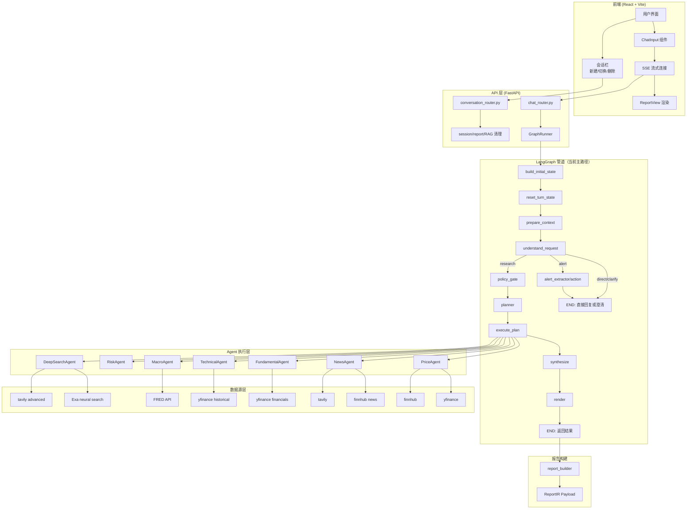

### 核心设计原则

| 原则 | 实现方式 |
|------|---------|
| **确定性优先** | 默认 stub 模式，所有节点不依赖 LLM 即可输出 |
| **渐进升级** | chat → brief → investment_report 三档模式 |
| **故障隔离** | 每个 Agent 独立断路器 + 缓存 + 降级 |
| **端点轮转** | LLM 调用失败自动切换到下一个 API 端点 |
| **可观测** | 全量 trace 事件 + timing + failure 记录 |
| **会话隔离** | `/api/conversations` 保存轻量 snapshot，并清理 session context、report index、thread RAG collections 和 observability runs |
| **可停止** | 前端 abort + 后端 cancelled trace/pipeline + executor/agent cancellation token；partial answer 不回滚 |

---

## 2. 主流程图

### 2.1 完整节点路由

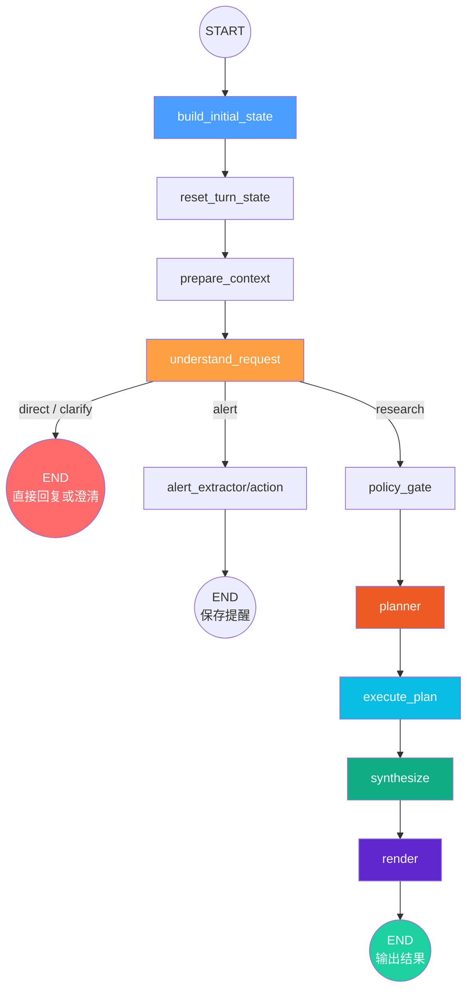

### 2.2 output_mode 三档路由（prepare_context 内部）

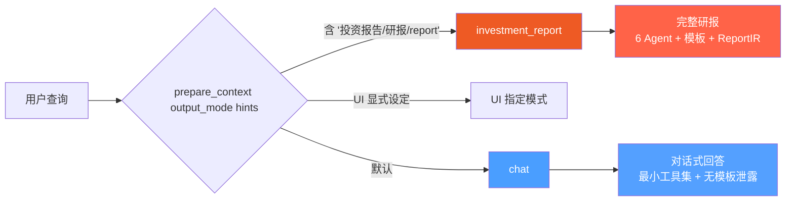

---

## 3. GraphState 状态模型

### 3.1 顶层 State 结构

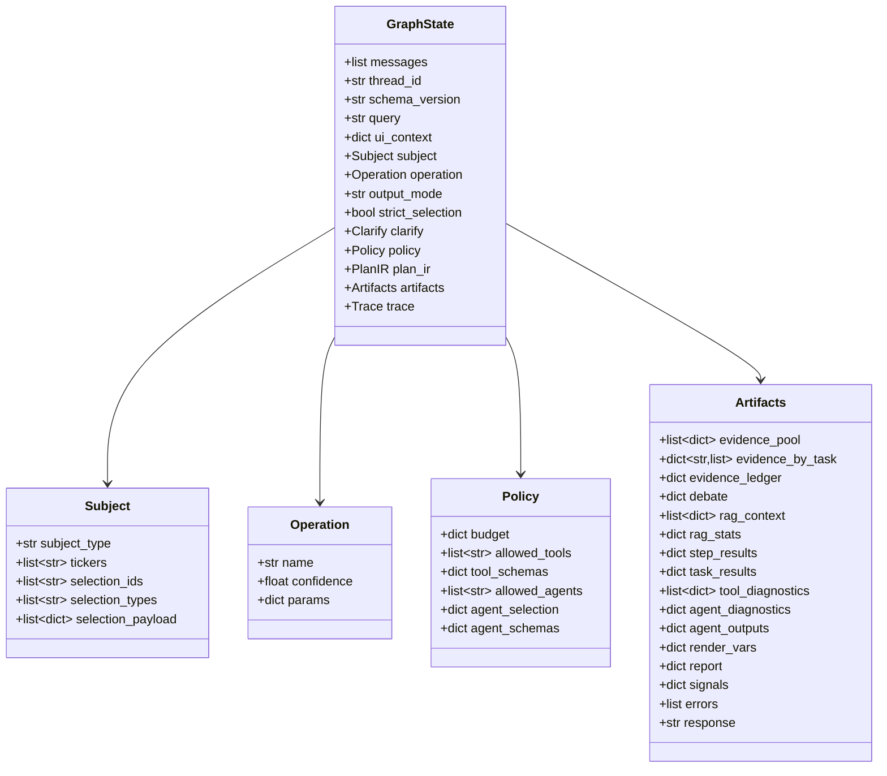

### 3.2 字段生命周期

| 字段 | 写入节点 | 读取节点 | 类型 |
|------|---------|---------|------|
| `query` | 外部输入 | 所有节点 | `str` |
| `ui_context` | 外部输入, prepare_context | understand_request, policy_gate | `dict` |
| `understanding` | understand_request | policy_gate, planner, frontend trace | `Understanding` |
| `tasks` | understand_request | policy_gate, planner, render | `list[UnderstandingTask]` |
| `blocked_tasks` | understand_request | render, frontend trace | `list[BlockedTask]` |
| `subject` | understand_request 兼容投影 | policy_gate, planner, execute_plan, synthesize, render | `Subject` |
| `operation` | understand_request 兼容投影 | policy_gate, planner, execute_plan, synthesize, render | `Operation` |
| `output_mode` | prepare_context | policy_gate, planner, synthesize, render, report_builder | `str` |
| `clarify` | understand_request / legacy clarify | route=clarify 或兼容测试 | `Clarify` |
| `chat_responded` | chat_respond | route 决策（跳过后续节点） | `bool` |
| `memory_context` | build_initial_state | understand_request, prepare_context | `dict` |
| `intent_contract` | understand_request | policy_gate, planner_stub, coverage_validator | `IntentContract` |
| `intent_contracts` | understand_request（多 frame） | policy_gate, planner_stub | `list[IntentContract]` |
| `request_frame` | understand_request | policy_gate, planner_stub | `dict` |
| `request_frames` | understand_request | policy_gate, planner_stub | `list[dict]` |
| `reply_contract` | understand_request | synthesize, chat_renderer, render | `ReplyContract` |
| `context_refs` | understand_request | synthesize, render | `list[ContextRef]` |
| `user_email` | 外部输入 | alert_action | `str` |
| `alert_params` | alert_extractor | alert_action | `dict` |
| `alert_valid` | alert_extractor | route 决策 | `bool` |
| `require_confirmation` | planner | confirmation_gate | `bool` |
| `confirmation_mode` | planner | confirmation_gate | `ConfirmationMode` |
| `user_confirmation` | 外部（resume） | confirmation_gate | `Any` |
| `policy` | policy_gate | planner, execute_plan | `Policy` |
| `plan_ir` | planner | execute_plan | `PlanIR` |
| `artifacts` | execute_plan, synthesize, render | synthesize, render, report_builder | `Artifacts` |
| `trace` | 所有节点 (追加) | 可观测性 | `Trace` |

### 3.3 subject_type 类型枚举

| subject_type | 触发条件 | 典型场景 |
|-------------|---------|---------|
| `company` | query 中包含 ticker 或公司名 | "分析 AAPL" |
| `news_item` | 选中单条新闻 | 点击新闻卡片 |
| `news_set` | 选中多条新闻 | 多选新闻 |
| `filing` | 选中财报/公告 | 选择 10-K 文件 |
| `research_doc` | 选中研究文档 | 选择研报 PDF |
| `portfolio` | 投资组合相关 | "我的持仓分析" |
| `macro` | 宏观主题 | "美联储利率路径" |
| `index` | 指数/ETF | "QQQ / 纳指" |
| `commodity` | 大宗商品 | "黄金 / 原油" |
| `theme` | 行业主题 | "半导体 / 大型科技股" |
| `unknown` | 无法识别主体 | "你好" / 模糊查询 |

---

## 4. 节点逐层拆解

### 4.1 build_initial_state

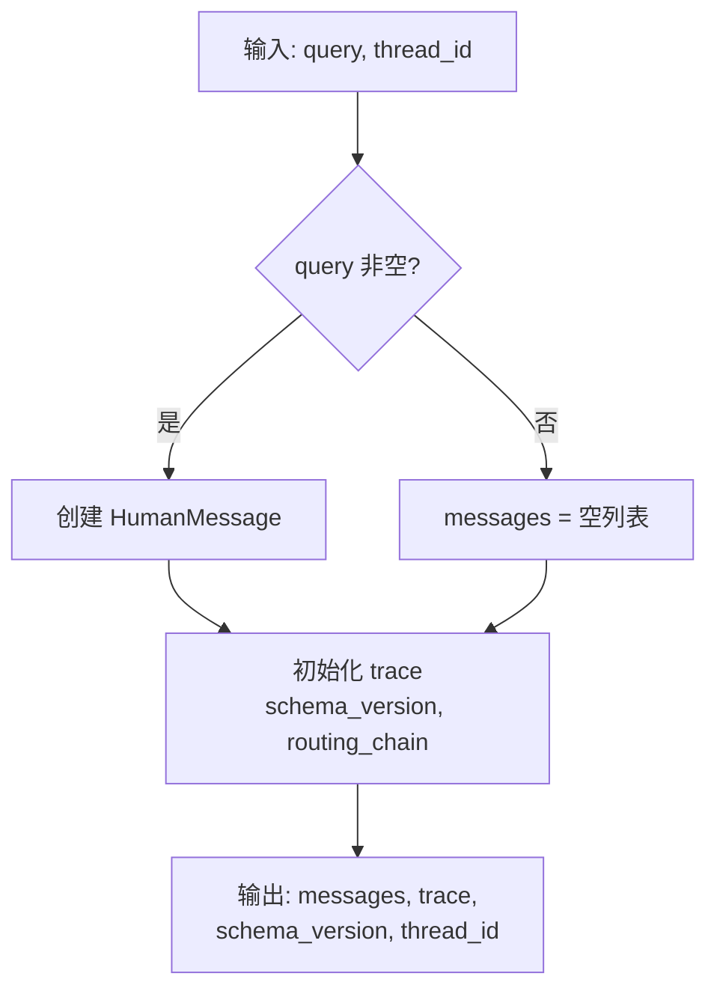

| 项 | 详情 |
|----|------|
| **输入** | `query`, `thread_id`, `trace` |
| **输出** | `trace`, `schema_version`, `thread_id`, `messages` |
| **错误处理** | 无（纯确定性） |
| **耗时** | < 1ms |

---

### 4.2 prepare_context

| 项 | 详情 |
|----|------|
| **输入** | `messages`, `ui_context.selections`, `output_mode`, `query` |
| **输出** | 修剪/摘要后的 `messages`、标准化 `ui_context`、`output_mode` |
| **主职责** | 合并历史窗口控制、长上下文摘要、selection 去重、UI 显式 output mode 与默认 hints |
| **兼容实现** | 旧 `trim_history/summarize_history/normalize_ui_context/decide_output_mode` 逻辑保留为 helper 或历史测试对象 |

---

### 4.2L normalize_ui_context（legacy helper）

| 项 | 详情 |
|----|------|
| **输入** | `ui_context.selections` |
| **输出** | `ui_context`（去重 + 标准化） |
| **标准化规则** | `type="report"` → `"doc"`（遗留兼容） |
| **去重** | 按 `(type, id)` 唯一键去重 |
| **容错** | 忽略非 dict 类型的 selection |

---

### 4.3L decide_output_mode（legacy helper）

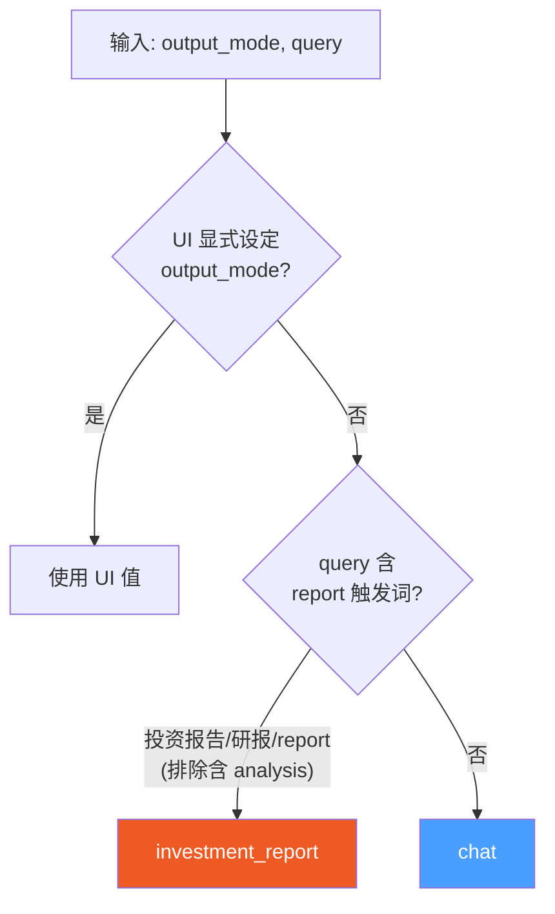

**report 触发词完整列表：**

| 语言 | 触发词 |
|------|--------|
| 简体中文 | 投资报告, 研报, 生成报告, 深度研究 |
| 繁体中文 | 投資報告, 研報, 生成報告 |
| English | in-depth report, report (排除含 "analysis" 的查询), deep research |

---

### 4.4 resolve_subject

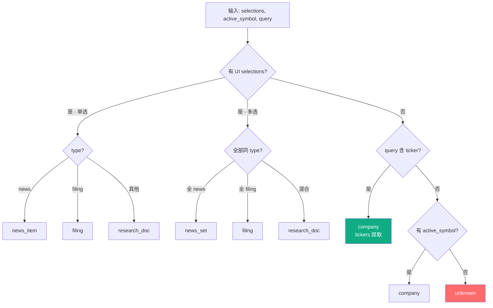

**ticker 提取机制：**
- 使用 `backend.config.ticker_mapping.extract_tickers()`
- 支持 600+ 公司名到 ticker 的映射
- 支持中文公司名（苹果→AAPL，特斯拉→TSLA）
- 正则匹配 1-5 字符大写字母组合

---

### 4.5 clarify（条件路由节点）

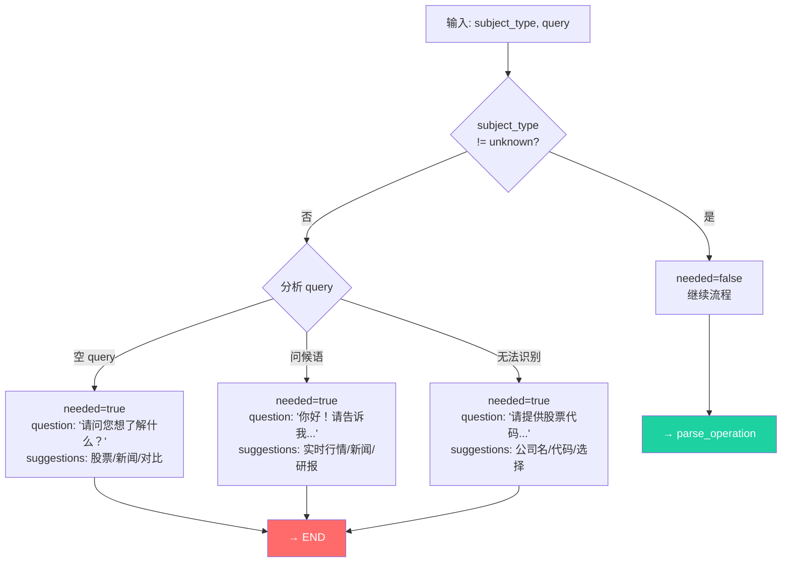

**问候语检测词：** `hi, hello, hey, 你好, 嗨, 哈喽` + 正则 `^(hi|hey|hello|你好|嗨)\s*[!！.。]?$`

---

### 4.6 parse_operation

**操作类型完整优先级表：**

| 优先级 | 操作名 | 置信度 | 中文触发词 | 英文触发词 |
|--------|--------|--------|-----------|-----------|
| 1 | `compare` | 0.80 | 对比, 比較, 相比, 哪个更 | vs, compare |
| 2 | `analyze_impact` | 0.75 | 影响, 冲击, 利好, 利空 | impact |
| 3 | `technical` | 0.85 | 技术面, 技术分析, 均线, 支撑, 阻力 | technical analysis, macd, rsi, kdj |
| 4 | `price` | 0.80 | 股价, 现价, 报价, 行情, 多少钱 | price, quote |
| 5 | `summarize` | 0.75 | 总结, 概括, 摘要, 要点 | tl;dr, summary |
| 6 | `extract_metrics` | 0.70 | 抽取, 提取, 指标 (仅 filing/doc) | extract, metrics, eps, guidance |
| 7 | `fetch` | 0.65 | 获取, 列出, 有哪些, 新闻, 最新 | fetch, latest, what happened |
| 8 | `qa` (默认) | 0.40-0.55 | — | — |

> **注意**：ASCII 短词（≤3字符如 "ma", "rsi"）使用 `\b` 词边界匹配，避免 "market" 误匹配 "ma"。

---

### 4.7 policy_gate

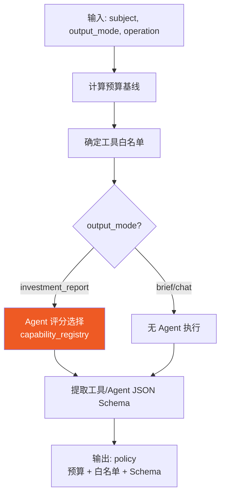

**预算基线配置：**

| output_mode | max_rounds | max_tool_calls | max_seconds |
|-------------|-----------|----------------|-------------|
| `investment_report` | 6 | 8 | 120 |
| `chat` | 4 | 4 | 60 |
| `brief` | 3 | 4 | 60 |

**工具白名单矩阵：**

| subject_type | operation | 允许的工具 |
|-------------|-----------|-----------|
| news_item/news_set | * | get_company_news, search, get_current_datetime |
| company | price | get_stock_price, get_current_datetime, search |
| company | technical | + get_technical_snapshot |
| company | compare | + get_performance_comparison |
| company | 其他 (investment_report) | **全量 7 个工具** |
| filing/research_doc | * | search, get_current_datetime |

---

### 4.8 planner（核心调度）

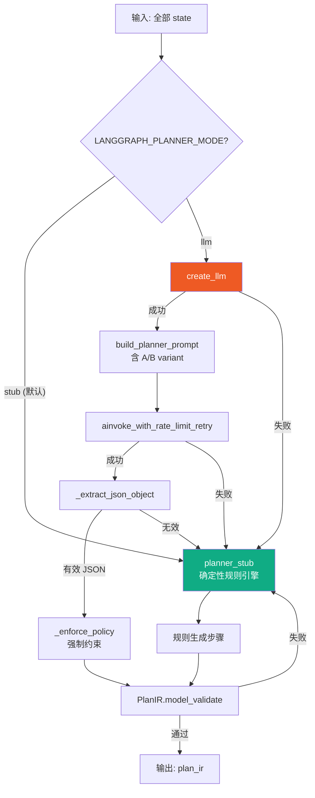

**Planner A/B 测试：**

| Variant | 特征 | 适用场景 |
|---------|------|---------|
| **A** | 最少步骤, 强确定性, 低成本 | 生产默认 |
| **B** | 可解释性优先, why 字段详细, parallel_group | 实验对照 |

分桶逻辑：`SHA256(salt + thread_id) % 100 < split_percent → B，否则 A`

**_enforce_policy 强制约束流程：**
1. 强制 output_mode/budget 覆盖（防 LLM 自我升级）
2. 过滤 steps 到白名单工具/Agent
3. 标准化 step 输入格式
4. 注入必需工具步骤（若缺失）
5. 注入 `report_agents` 并行组
6. 高成本 Agent 标记 `__escalation_stage`
7. 预算断言 + 超出时渐进裁剪

---

### 4.9 execute_plan（执行引擎）

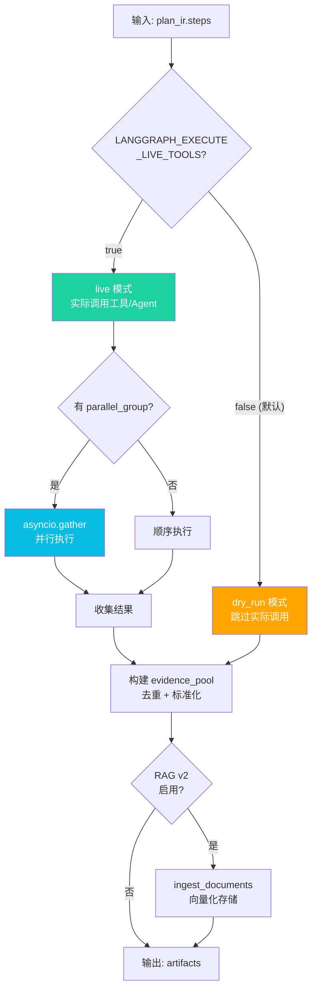

**Agent 执行并发模型：**

```mermaid
gantt
    title Agent 并行执行 (parallel_group="report_agents")
    dateFormat  X
    axisFormat  %s

    section 并行组
    PriceAgent      :a1, 0, 2
    NewsAgent       :a2, 0, 5
    FundamentalAgent:a3, 0, 3
    TechnicalAgent  :a4, 0, 2
    MacroAgent      :a5, 0, 8

    section 高成本（可选）
    DeepSearchAgent :a6, 0, 15
```

**evidence_pool 构建流程：**

| 来源 | 格式 | 去重键 |
|------|------|--------|
| selection_payload | 直接复制 | `(url, title)` |
| 工具输出 | `_append_tool_evidence()` | `(url, title)` |
| Agent 输出 | `_append_agent_evidence()` (summary + evidence[]) | `(url, title)` |

**RAG v2 TTL 策略：**

| subject_type | TTL |
|-------------|-----|
| filing / research_doc | 永久 |
| news / selection | 7 天 |
| 其他 | 12 小时 |

---

### 4.10 synthesize（数据合成）

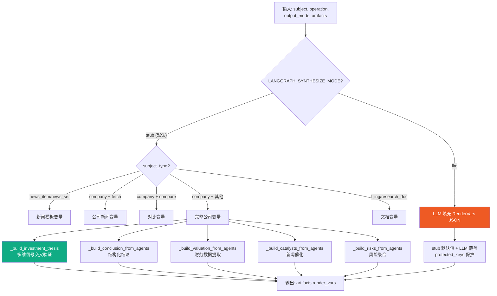

**investment_thesis 信号聚合逻辑：**

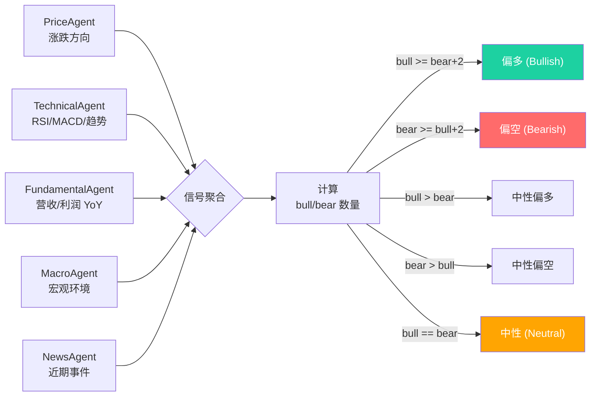

**利多/利空信号提取规则：**

| 来源 | 利多条件 | 利空条件 |
|------|---------|---------|
| PriceAgent | summary 含 "up" / "上涨" | summary 含 "down" / "下跌" |
| TechnicalAgent | RSI oversold, MACD bullish | RSI overbought, MACD bearish |
| FundamentalAgent | Revenue YoY > +5% | Revenue YoY < -5% |
| FundamentalAgent | Net Income YoY > +10% | Net Income YoY < -10% |

---

### 4.11 render（模板渲染）

| 项 | 详情 |
|----|------|
| **输入** | `subject`, `output_mode`, `operation`, `artifacts.render_vars` |
| **输出** | `artifacts.draft_markdown` |
| **渲染引擎** | Python `string.Template.safe_substitute()` |
| **evidence 显示** | 仅 `LANGGRAPH_SHOW_EVIDENCE=true` 时输出 |

---

## 5. Agent 子系统

### 5.1 Agent 继承体系

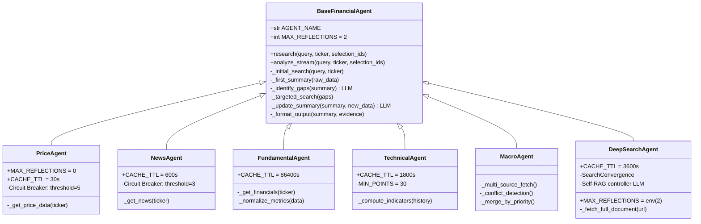

### 5.2 Agent 详细对比表

| 属性 | PriceAgent | NewsAgent | FundamentalAgent | TechnicalAgent | MacroAgent | DeepSearchAgent |
|------|-----------|-----------|-----------------|---------------|------------|----------------|
| **反思轮次** | 0 | 2 | 2 | 2 | 2 | env(2) |
| **缓存 TTL** | 30s | 600s | 86400s | 1800s | — | 3600s |
| **断路器阈值** | 5 | 3 | — | — | — | — |
| **断路器恢复** | 60s | 180s | — | — | — | — |
| **主数据源** | yfinance | finnhub news | yfinance financials | yfinance historical | FRED | tavily/exa |
| **备用数据源** | finnhub → alpha_vantage → tavily | get_company_news → tavily → search | get_company_info | — | market_sentiment → events → search | exa → search |
| **置信度范围** | 0.5-1.0 | 0.1-0.8 | 0.2-0.92 | 0.3-0.85 | 0.2-0.95 | 0.6-0.95 |
| **输出** | price, change, direction | headlines, summary | metrics, YoY/QoQ | MA/RSI/MACD/趋势 | 6 项宏观指标 | summary + evidence |
| **风险检测** | — | — | 负利润, 高杠杆 | 超买/超卖 | 收益率倒挂 | 信号冲突 |

### 5.3 BaseAgent 反思循环

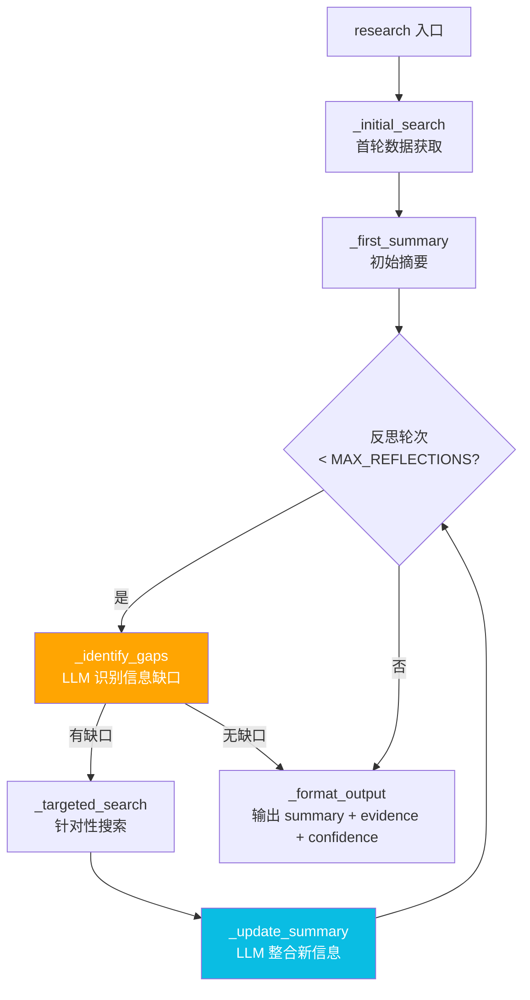

### 5.4 DeepSearchAgent Self-RAG 流程

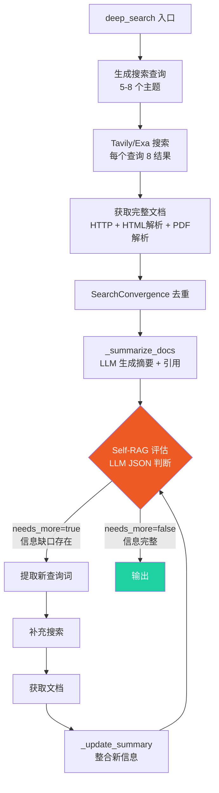

**SearchConvergence 停止条件：**
- `info_gain < threshold` (信息增量不足)
- 达到 MAX_REFLECTIONS
- 文档数达到 MAX_DOCS

---

## 6. 能力注册表与评分机制

### 6.1 评分公式

```
score = 0.05 (base)
      + subject_weight       (0.0 ~ 0.85)
      + operation_weight     (0.0 ~ 0.75)
      + output_mode_weight   (0.0 ~ 0.35)
      + keyword_boost        (0.0 ~ 0.45)
```

### 6.2 评分矩阵热力图

| Agent ↓ \ subject → | company | news_item | news_set | filing | research_doc | portfolio |
|---------------------|---------|-----------|----------|--------|-------------|-----------|
| **price_agent** | 0.55 | 0.20 | 0.20 | — | — | 0.40 |
| **news_agent** | 0.45 | 0.70 | 0.75 | — | — | — |
| **fundamental_agent** | 0.60 | — | — | 0.60 | 0.45 | — |
| **technical_agent** | 0.50 | — | — | — | — | 0.35 |
| **macro_agent** | 0.35 | — | 0.35 | — | — | 0.45 |
| **deep_search_agent** | 0.10 | — | — | 0.85 | 0.85 | — |

### 6.3 investment_report 必需 Agent 规则

| 条件组合 | 必需 Agent |
|---------|-----------|
| subject=company + output_mode=investment_report | **price, news, fundamental, macro, technical** (全5个) |
| subject=filing/research_doc | deep_search, fundamental |
| subject=news_item/news_set | news, price |
| operation=technical | price, technical |
| operation=compare | price, fundamental |
| query 含宏观关键词 | + macro |
| query 含深度关键词 | + deep_search |

### 6.4 Agent 选择流程

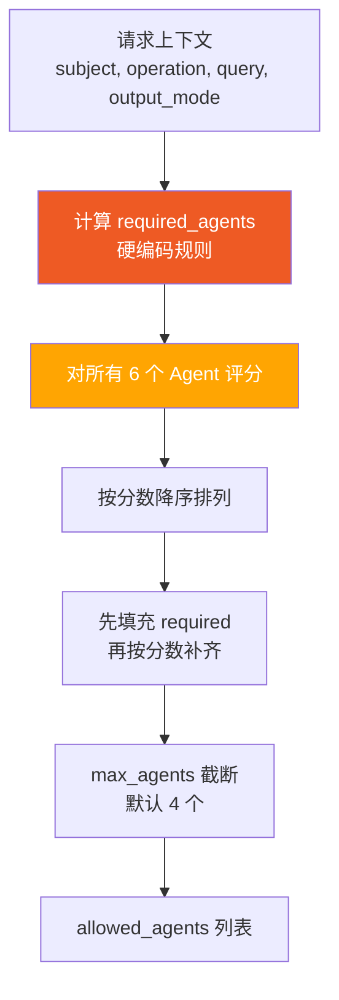

---

## 7. 模板系统与路由矩阵

### 7.1 模板选择完整矩阵

| subject_type | operation | output_mode | 模板文件 | 模板变量 |
|-------------|-----------|-------------|---------|---------|
| news_item/news_set | * | brief/chat | `news_brief.md` | news_summary, impact_analysis, next_watch, risks |
| news_item/news_set | * | investment_report | `news_report.md` | query + 上述 |
| company | fetch | brief/chat | `company_news_brief.md` | ticker, query, news_summary, conclusion, risks |
| company | fetch | investment_report | `company_news_report.md` | ticker, query, news_summary, impact_analysis, next_watch, risks |
| company | * (多ticker) | brief/chat | `company_compare_brief.md` | tickers, query, comparison_conclusion, comparison_metrics, risks |
| company | * (多ticker) | investment_report | `company_compare_report.md` | tickers, query, comparison_conclusion, comparison_metrics, risks, evidence |
| company | * (单ticker) | brief/chat | `company_brief.md` | ticker, query, conclusion, price_snapshot, technical_snapshot, risks |
| **company** | ***** | **investment_report** | **`company_report.md`** | **ticker, query, investment_thesis, company_overview, price_snapshot, technical_snapshot, catalysts, valuation, risks, conclusion** |
| filing/research_doc | * | brief/chat | `filing_brief.md` | query, summary, highlights, section_citations, risks |
| filing/research_doc | * | investment_report | `filing_report.md` | query, summary, highlights, section_citations, analysis, risks |
| unknown | * | * | `company_brief.md` (降级) | — |

### 7.2 company_report.md 模板结构

```
## 投资研报：$ticker
  **问题**：$query
## 综合投资观点         ← _build_investment_thesis()
  $investment_thesis
## 公司与业务           ← _build_company_overview_from_agents()
  $company_overview
## 价格快照             ← _fmt_price_snapshot()
  $price_snapshot
## 技术面               ← _fmt_technical_snapshot()
  $technical_snapshot
## 关键催化剂           ← _build_catalysts_from_agents()
  $catalysts
## 财务与估值           ← _build_valuation_from_agents()
  $valuation
## 风险                 ← _build_risks_from_agents()
  $risks
## 结论与展望           ← _build_conclusion_from_agents()
  $conclusion
---
*免责声明*
```

---

## 8. Report Builder 构建流程

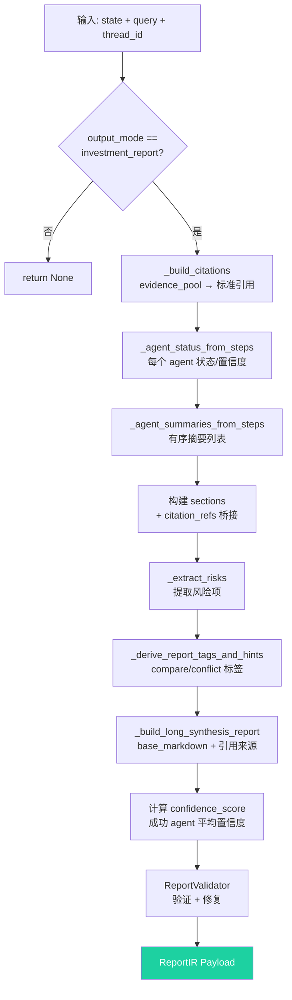

**ReportIR Payload 最终结构：**

```json
{
  "title": "AAPL 分析报告",
  "query": "深度分析 Apple",
  "thread_id": "xxx",
  "generated_at": "2026-02-11T...",
  "confidence_score": 0.85,
  "tickers": ["AAPL"],
  "sections": [...],
  "citations": [...],
  "meta": {
    "filing_section_citations": [...],
    "report_hints": { "is_compare": false, "has_conflict": false }
  },
  "synthesis_report": "## AAPL 综合研究报告\n...",
  "agent_status": {
    "price_agent": { "status": "success", "confidence": 1.0 },
    "fundamental_agent": { "status": "success", "confidence": 0.92 },
    ...
  },
  "risks": ["Leverage ratio elevated", ...],
  "tags": [],
  "report_hints": { "is_compare": false, "has_conflict": false }
}
```

---

## 9. LLM 重试与端点轮转

### 9.1 端点管理架构

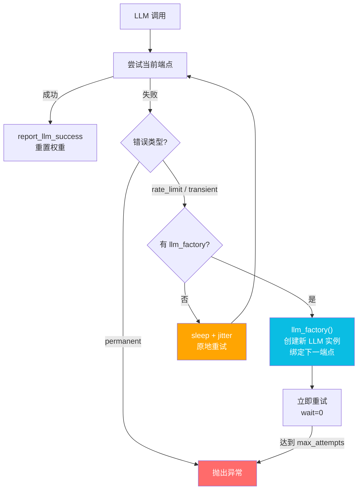

### 9.2 端点轮转算法

```
EndpointManager (加权 Smooth 轮转):

  for each endpoint:
    current_weight += weight

  selected = max(current_weight)
  selected.current_weight -= total_weight

  if selected is cooling_down:
    skip → select next

  if all cooling_down:
    select earliest recovery
```

### 9.3 重试参数配置

| 参数 | 默认值 | 环境变量 |
|------|--------|---------|
| max_attempts | 6 | `LLM_RATE_LIMIT_RETRY_MAX_ATTEMPTS` |
| sleep_seconds | 5 | `LLM_RATE_LIMIT_RETRY_SLEEP_SECONDS` |
| jitter_seconds | 2 | `LLM_RATE_LIMIT_RETRY_JITTER_SECONDS` |
| cooldown_sec | 90 | `LLM_ENDPOINT_DEFAULT_COOLDOWN_SEC` |
| acquire_timeout | 3600 | — |

### 9.4 可重试错误检测

| 类别 | 匹配模式 |
|------|---------|
| Rate Limit | "429", "rate limit", "too many requests", "quota", "exceeded" |
| HTTP 状态码 | 401, 403, 404, 408, 409, 425, 429, 500, 502, 503, 504 |
| 临时错误 | "unauthorized", "forbidden", "timeout", "ssl", "eof", "connection" |
| 中文错误 | "无可用渠道", "资源不足" |

---

## 10. Prompt 体系全览

### 10.1 Prompt 清单

| # | Prompt 名称 | 文件 | 语言 | 质量 | 调用时机 |
|---|------------|------|------|------|---------|
| 1 | CIO System Prompt | `langchain_agent.py:53` | EN | ⭐⭐⭐⭐⭐ | LangChain Agent 模式 |
| 2 | Followup System | `prompts/system_prompts.py:20` | EN | ⭐⭐⭐⭐ | 追问处理 |
| 3 | Forum Synthesis | `prompts/system_prompts.py:57` | CN | ⭐⭐⭐⭐⭐ | 报告合成（270行） |
| 4 | Gap Detection | `agents/base_agent.py:164` | CN | ⭐⭐⭐⭐ | Agent 反思循环 |
| 5 | Summary Update | `agents/base_agent.py:264` | CN | ⭐⭐⭐⭐ | Agent 摘要整合 |
| 6 | Self-RAG Controller | `agents/deep_search_agent.py:234` | CN | ⭐⭐⭐⭐⭐ | 深度搜索缺口检测 |
| 7 | Deep Research Memo | `agents/deep_search_agent.py:758` | CN | ⭐⭐⭐⭐⭐ | 研究备忘录生成 |
| 8 | Planner Prompt | `graph/planner_prompt.py:56` | EN | ⭐⭐⭐⭐ | LLM 规划模式 |
| 9 | Synthesize LLM | `graph/nodes/synthesize.py:1070` | EN | ⭐⭐⭐ | LLM 合成模式 |
| 10 | Intent Classifier | `orchestration/intent_classifier.py:443` | EN/CN | ⭐⭐⭐ | 意图分类回退 |
| 11 | Schema Router | `conversation/schema_router.py:583` | EN | ⭐⭐⭐ | 工具路由 |
| 12 | News Summary | `agents/news_agent.py:437` | CN | ⭐⭐⭐ | 新闻摘要流式生成 |

### 10.2 Prompt 调用链路

```mermaid
flowchart LR
    USER[用户查询] --> IC[Intent Classifier<br/>Prompt #10]
    IC --> SR[Schema Router<br/>Prompt #11]

    subgraph "LangGraph Pipeline"
        SR --> PLANNER[Planner<br/>Prompt #8]
        PLANNER --> AGENTS[Agent 执行]
        AGENTS --> SYNTH[Synthesize<br/>Prompt #9]
    end

    subgraph "Agent 内部"
        AGENTS --> GAP[Gap Detection<br/>Prompt #4]
        GAP --> UPDATE[Summary Update<br/>Prompt #5]
        AGENTS --> SELFRAG[Self-RAG<br/>Prompt #6]
        SELFRAG --> MEMO[Deep Memo<br/>Prompt #7]
    end

    SYNTH --> FORUM[Forum Synthesis<br/>Prompt #3]

    USER -->|追问| FOLLOWUP[Followup<br/>Prompt #2]

    style FORUM fill:#ee5a24,color:#fff
    style SELFRAG fill:#0abde3,color:#fff
```

---

## 11. 端到端数据流示例

### 示例：`"深度研究 Apple 投资报告"`

```mermaid
sequenceDiagram
    participant U as 用户
    participant API as ChatRouter
    participant G as LangGraph
    participant PA as PriceAgent
    participant NA as NewsAgent
    participant FA as FundamentalAgent
    participant TA as TechnicalAgent
    participant MA as MacroAgent
    participant RB as ReportBuilder

    U->>API: "深度研究 Apple 投资报告"
    API->>G: ainvoke(query, thread_id)

    Note over G: build_initial_state
    Note over G: prepare_context → ui_context + output_mode hints
    Note over G: understand_request → company/AAPL task + investment_report
    Note over G: policy_gate → 5 agents, 7 tools
    Note over G: planner → PlanIR (7 steps)

    par execute_plan (parallel)
        G->>PA: research("AAPL")
        PA-->>G: price=$273.31, change=-0.48%
        G->>NA: research("AAPL")
        NA-->>G: 5 headlines, summary
        G->>FA: research("AAPL")
        FA-->>G: revenue, net_income, YoY
        G->>TA: research("AAPL")
        TA-->>G: MA/RSI/MACD/trend
        G->>MA: research("AAPL")
        MA-->>G: fed_rate, cpi, unemployment
    end

    Note over G: synthesize → RenderVars<br/>investment_thesis: "中性偏空"<br/>conclusion: 技术面+基本面+后续关注
    Note over G: render → company_report.md 模板渲染

    G->>RB: build_report_payload(state)
    RB-->>G: ReportIR payload

    G-->>API: state (含 draft_markdown + report)
    API-->>U: SSE stream (synthesis_report + agent cards)
```

### 状态流转表

| 步骤 | 节点 | state 变更 | 耗时估算 |
|------|------|-----------|---------|
| 1 | build_initial_state | +messages, +trace, +schema_version | <1ms |
| 2 | prepare_context | ui_context 标准化 + output_mode hints + history safety | <1ms |
| 3 | understand_request | tasks/blocked_tasks + subject/operation compatibility projection | ~5ms |
| 4 | policy_gate | policy = {agents: 5个, tools: 7个, rounds: 6} | ~10ms |
| 5 | planner | plan_ir = {steps: [tools + agents]} | ~50ms (stub) |
| 6 | execute_plan | artifacts = {evidence_pool, agent_outputs, task_results} | **5-30s** |
| 7 | synthesize | artifacts.render_vars = {thesis, conclusion, ...} | ~10ms |
| 8 | render | artifacts.draft_markdown = 完整 Markdown | ~5ms |
| 9 | report_builder | report payload = ReportIR | ~20ms |

---

## 12. 故障降级策略

### 12.1 降级链路

```mermaid
flowchart TD
    LLM_PLANNER[LLM Planner] -->|失败| STUB_PLANNER[Stub Planner]
    LLM_SYNTH[LLM Synthesize] -->|失败| STUB_SYNTH[Stub Synthesize]

    AGENT_PRIMARY[Agent 主数据源] -->|失败| AGENT_FALLBACK[备用数据源]
    AGENT_FALLBACK -->|失败| AGENT_SEARCH[通用搜索]
    AGENT_SEARCH -->|失败| AGENT_CACHE[缓存数据]
    AGENT_CACHE -->|失败| AGENT_EMPTY[空输出 + 低置信度]

    DEEP_LLM[DeepSearch LLM 摘要] -->|失败| DEGRADED[_build_degraded_summary<br/>拼接标题/snippet]

    REPORT[报告生成] -->|失败| REPORT_NONE[report = None<br/>仅返回 draft_markdown]

    style STUB_PLANNER fill:#ffa502,color:#fff
    style AGENT_EMPTY fill:#ff6b6b,color:#fff
    style DEGRADED fill:#ffa502,color:#fff
```

### 12.2 故障记录格式

```json
{
  "schema_version": "failure.v1",
  "ts": "2026-02-11T...",
  "node": "planner",
  "stage": "llm_invoke",
  "error": "Rate limit exceeded",
  "fallback": "planner_stub",
  "retryable": true,
  "retry_attempts": 3,
  "metadata": { "endpoint": "api.openai.com" }
}
```

### 12.3 环境变量速查

| 变量 | 默认值 | 说明 |
|------|--------|------|
| `LANGGRAPH_PLANNER_MODE` | stub | planner 模式: stub / llm |
| `LANGGRAPH_SYNTHESIZE_MODE` | stub | synthesize 模式: stub / llm |
| `LANGGRAPH_EXECUTE_LIVE_TOOLS` | false | 是否实际调用工具 |
| `LANGGRAPH_SHOW_EVIDENCE` | false | 渲染时是否显示 evidence |
| `LANGGRAPH_PLANNER_AB_ENABLED` | false | A/B 测试开关 |
| `LANGGRAPH_REPORT_MAX_AGENTS` | 4 | 最大 Agent 数 |
| `LANGGRAPH_REPORT_MIN_AGENTS` | 2 | 最小 Agent 数 |
| `DEEPSEARCH_MAX_REFLECTIONS` | 2 | DeepSearch 最大反思轮次 |
| `LLM_RATE_LIMIT_RETRY_MAX_ATTEMPTS` | 6 | LLM 最大重试次数 |
| `LLM_ENDPOINT_DEFAULT_COOLDOWN_SEC` | 90 | 端点冷却时间 |

### 12.4 会话删除与取消

```mermaid
flowchart TD
    POST["POST /api/conversations"] --> STORE["conversation_store snapshot"]
    PATCH["PATCH /api/conversations/{session_id}"] --> STORE
    GET["GET /api/conversations/{session_id}"] --> STORE
    DEL["DELETE /api/conversations/{session_id}"] --> STORE
    DEL --> CTX["移除 ContextManager"]
    DEL --> REPORT["删除 report_index / citation_index"]
    DEL --> RAG["删除 thread memory + working-set collections"]
    DEL --> OBS["按 collection 软删除 RAG observability runs"]

    STOP["用户点击停止"] --> ABORT["AbortController.abort"]
    ABORT --> CANCEL["后端 CancelledError"]
    CANCEL --> TRACE["trace: stage=cancelled"]
    CANCEL --> PIPE["pipeline_stage: stage=cancelled"]
    CANCEL --> TOKEN["executor/agent cancellation token"]
    TRACE --> UI["前端保留 partial answer + thinking steps"]
```

约束：

- 删除会话不能只删前端消息；必须同步隔离后端 thread context 和 RAG 临时材料。
- `conversation_store` 是当前服务端轻量 snapshot，不替代多用户数据库；多设备同步需要数据库迁移和用户权限隔离。
- 取消不是失败；不能触发 missing done 错误，也不能清空已收到的 token 和 trace。

---

## LLM Token 计量与 ContextVar 埋点（2026-05-31 增量）

执行追踪指挥台需要每个 run 的 LLM token 与成本。难点在于 LangGraph 用 `asyncio.create_task` 并发跑多个 agent / 工具，若用全局累加器会串号。

### 机制：ContextVar 天然隔离

`backend/services/llm_usage.py` 的 `TokenUsageAccumulator` 挂在 `ContextVar` 上：

- `asyncio.create_task` 会**复制当前上下文**，每个 run 的 producer 任务各自持有独立累加器实例 → 天然按 run 隔离，无需手动 reset / 层层传参。
- `set_token_accumulator(acc)` 在 `run_graph_pipeline` 的 producer 入口设置；`record_llm_usage(response, model)` 从 `get_token_accumulator()` 取当前上下文的累加器写入。

### 采集点：统一入口 + 直接调用补点

- 统一入口 `llm_retry.ainvoke_with_rate_limit_retry` 两处 `return` 前调用 `record_llm_usage`，覆盖绝大多数 agent LLM 调用。
- 不走统一入口的 4 处直接 `llm.ainvoke`（`resolve_subject` ×1、`conversation_router` ×3）单独补 `record_llm_usage`，避免漏计。
- 提取逻辑兼容两代 LangChain 响应：新版 `AIMessage.usage_metadata`（`input_tokens` / `output_tokens`）与旧版 `response_metadata.token_usage` / `usage`（`prompt_tokens` / `completion_tokens`），缺字段安全归零。

### 上送：done.metrics

`run_graph_pipeline` 在 `done` 事件的 `metrics` 合并 `token_acc.summary()`：`total_prompt_tokens` / `total_completion_tokens` / `total_tokens` / `total_cost_usd` / `tokens_by_model`。成本按 `LLM_PRICING_JSON`（每 1K token USD）计算，未配置则为 0；前端 `ExecutionStats` 消费展示。

> 该机制在 LLM 调用层直接计量，绕过 raw-trace 事件过滤（`trace_raw` 关闭时会丢弃 `llm_end` 事件），不依赖事件可见性开关。

---

> 文档由 FinSight AI 工程团队维护 | 最后更新：2026-05-31
