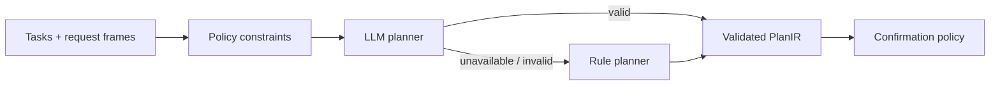
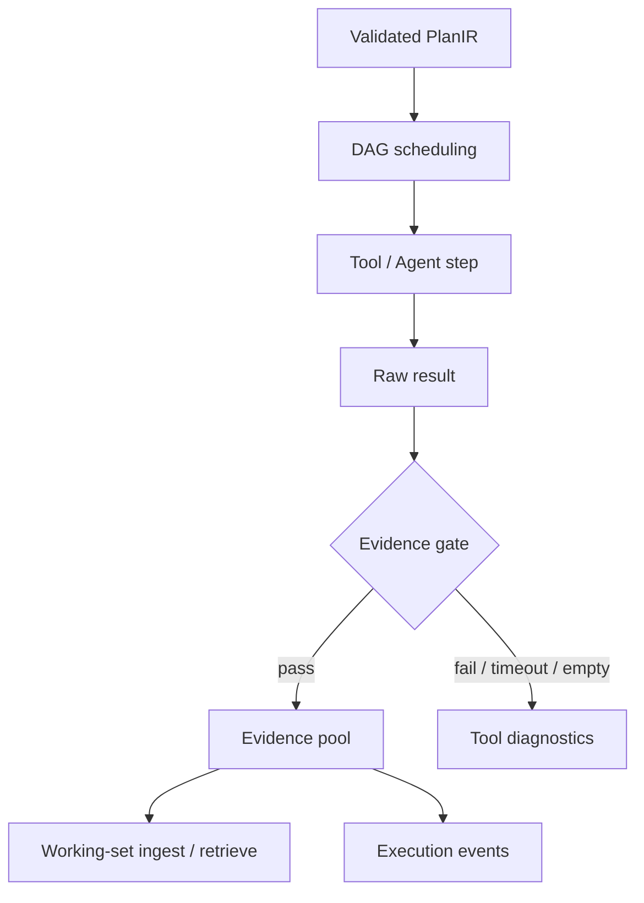

# LangGraph 管线深潜

更新时间：2026-07-12

本文补充 [`LANGGRAPH_FLOW.md`](LANGGRAPH_FLOW.md) 的实现边界；节点顺序仍以 `backend/graph/runner.py` 为准。

## 1. 请求理解

`understand_request` 组合 intent pipeline、请求帧与任务合同，产出机器可消费的结构，而不是只返回单个 intent 字符串。后续层重点读取：

- 目标与实体：ticker、市场、组合、URL、时间范围；
- tasks / request frames：多目标请求可以拆分；
- reply contract：自然对话、需引用回答、投资报告等体验约束；
- required evidence：策略和规划需要覆盖的证据类型；
- context binding：query、UI selection、active symbol、会话 artifact 的来源与优先级。

`backend/graph/intent/legacy_engine.py` 和 `understanding_v2.py` 仍承担兼容迁移职责，不是应删除的死代码。

## 2. 策略与规划

`backend/graph/policy/` 在计划执行前收紧允许能力、工具和证据下限。`backend/graph/planning/` 负责 PlanIR：

```mermaid
flowchart LR
    CONTRACT[Tasks + request frames] --> POLICY[Policy constraints]
    POLICY --> LLM[LLM planner]
    LLM -->|valid| PLAN[Validated PlanIR]
    LLM -->|unavailable / invalid| RULE[Rule planner]
    RULE --> PLAN
    PLAN --> CONFIRM[Confirmation policy]
```

规划回退位于 `planning/rule_planner.py` 等模块，不再存在 `planner_stub.py`。PlanIR 必须通过结构校验、依赖校验、能力校验和策略收紧，不能让 LLM 自由发明工具。

## 3. 执行与证据

当前入口是 `backend/graph/nodes/execute_plan_node.py`，核心编排位于 `backend/graph/execution/plan_pipeline.py`。executor 按依赖关系调度步骤，并通过 adapter 调用工具或 Agent。

```mermaid
flowchart TD
    PLAN[Validated PlanIR] --> DAG[DAG scheduling]
    DAG --> STEP[Tool / Agent step]
    STEP --> RESULT[Raw result]
    RESULT --> GATE{Evidence gate}
    GATE -->|pass| EVIDENCE[Evidence pool]
    GATE -->|fail / timeout / empty| DIAG[Tool diagnostics]
    EVIDENCE --> RAG[Working-set ingest / retrieve]
    EVIDENCE --> EVENTS[Execution events]
```

关键不变量：

- `EvidenceItem` 必须可追溯到来源或明确标记为模型分析。
- diagnostics 与 evidence 分离，失败文本不能被合成层当作事实。
- 取消令牌在长工具调用、Agent 和 DAG 层传播。
- 同一轮的事件、证据和最终回复使用一致的 run/thread/user scope。

## 4. Agent 辩论与合成

执行后，`research_debate` 识别多个 Agent 的一致意见、冲突、证据缺口与置信度。`backend/graph/synthesis/` 负责叙事生成，`backend/graph/renderers/` 负责最终形态。二者不得重新做工具调用，也不得制造证据池中不存在的确定性数字。

当证据不足时，正确行为是披露不可用、降低置信度或提供后续建议，而不是补写占位值。

## 5. 状态与持久化

- LangGraph 生产 checkpointer：PostgreSQL。
- RAG：PostgreSQL + pgvector，BGE-M3 1024 维。
- execution events：通过事件总线映射到 SSE，由前端 store 消费。
- 部分历史业务 store 仍为 SQLite/JSON，按 user scope 隔离。

## 6. 修改检查清单

- [ ] 图边变化已同步 `runner.py`、流程图和 skeleton 测试。
- [ ] GraphState 字段变化已同步生产者、消费者、前端类型和序列化测试。
- [ ] 新工具/Agent 已进入能力注册、策略约束、规划和 evidence gate。
- [ ] 新事件已同步 [`execution-event-contract.md`](execution-event-contract.md) 和前端处理。
- [ ] 新回答形态只在 renderer 扩展，没有绕过 synthesis/evidence。
