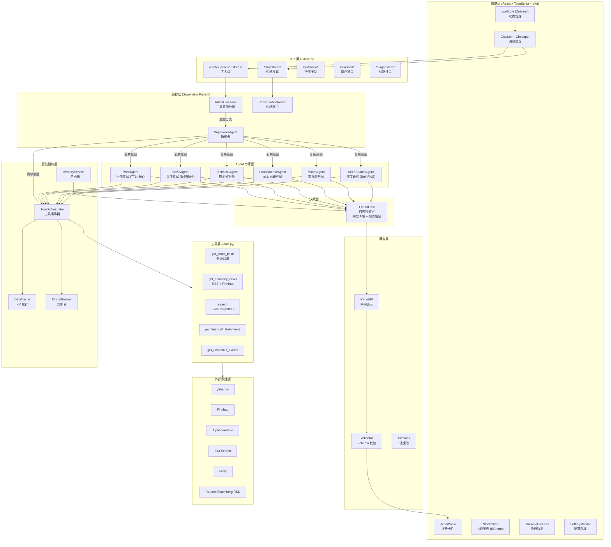
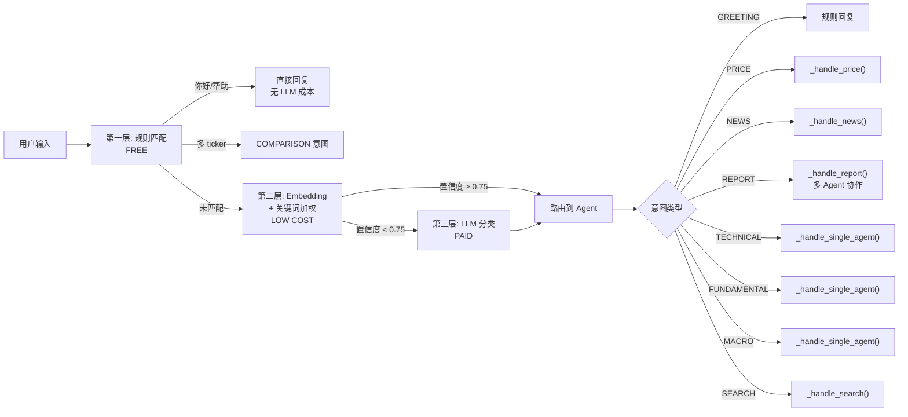
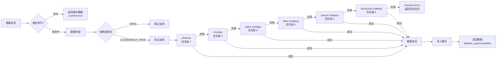
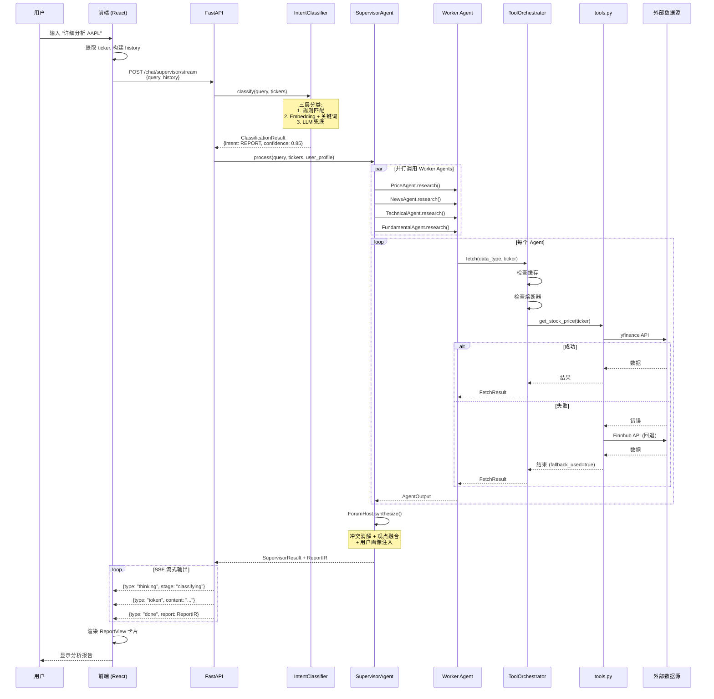
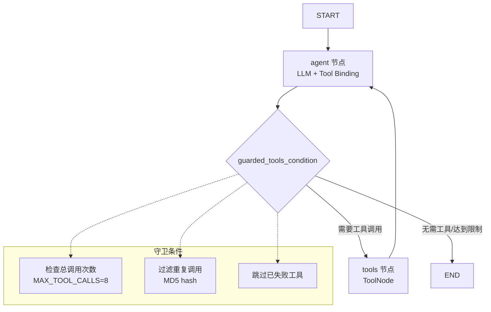
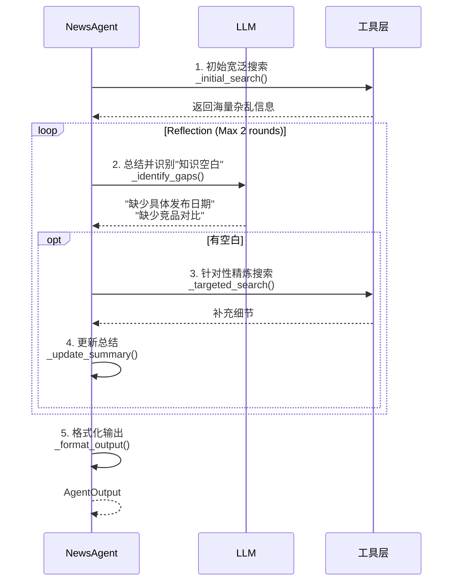

# FinSight 项目架构深度分析报告
> Update 2026-01-22: backend/tools.py split into backend/tools/ package. Legacy line refs map to backend/_archive/tools_legacy.py.


> **版本**: V1.0
> **分析日期**: 2026-01-21
> **分析师**: 架构审计官 + Agent 编排工程师
> **项目版本**: 0.6.4

---

## 目录 (Table of Contents)

1. [证据索引表](#一证据索引表)
2. [系统架构全景图](#二系统架构全景图)
3. [核心流程时序图](#三核心流程时序图)
4. [Agent 清单与角色分解](#四agent-清单与角色分解)
5. [模块剖析详解](#五模块剖析详解)
   - 5.1 编排与对话层
   - 5.2 报告智能体层
   - 5.3 工具层
   - 5.4 前端呈现层
6. [责任矩阵表](#六责任矩阵表)
7. [工具/数据源矩阵](#七工具数据源矩阵)
8. [失败模式矩阵 (FMEA)](#八失败模式矩阵-fmea)
9. [配置项清单](#九配置项清单)
10. [端到端案例分析](#十端到端案例分析)
11. [改造建议](#十一改造建议)
12. [成熟度评分](#十二成熟度评分)

---

## 一、证据索引表

本节列出所有关键结论的证据来源，确保每条结论可追溯。

### 1.1 核心文档证据

| 证据ID | 文件路径 | 关键内容 | 用途 |
|--------|----------|----------|------|
| DOC-01 | `README.md` | 项目概述、架构图、功能特性 | 项目愿景与功能基线 |
| DOC-02 | `docs/01_ARCHITECTURE.md` | Supervisor Agent 架构设计 | 架构决策依据 |
| DOC-03 | `docs/PROJECT_STATUS.md` | 模块完成度、API 清单 | 进度跟踪 |
| DOC-04 | `docs/CLAUDE.md` | 项目执行计划、阶段目标 | 开发路线图 |

### 1.2 后端核心代码证据

| 证据ID | 文件路径 | 关键类/函数 | 职责 |
|--------|----------|-------------|------|
| BE-01 | `backend/api/main.py` | `app`, `lifespan()` | FastAPI 入口、调度器生命周期 |
| BE-02 | `backend/orchestration/supervisor_agent.py` | `SupervisorAgent`, `process()` | 协调者模式核心 |
| BE-03 | `backend/orchestration/intent_classifier.py` | `IntentClassifier`, `classify()` | 三层意图分类 |
| BE-04 | `backend/orchestration/forum.py` | `ForumHost`, `synthesize()` | 多 Agent 观点融合 |
| BE-05 | `backend/agents/base_agent.py` | `BaseFinancialAgent`, `research()` | Agent 基类、反思循环 |
| BE-06 | `backend/agents/news_agent.py` | `NewsAgent`, `_initial_search()` | 新闻 Agent 实现 |
| BE-07 | `backend/agents/price_agent.py` | `PriceAgent` | 行情 Agent |
| BE-08 | `backend/orchestration/orchestrator.py` | `ToolOrchestrator`, `fetch()` | 工具编排、多源回退 |
| BE-09 | `backend/services/circuit_breaker.py` | `CircuitBreaker`, `can_call()` | 熔断器状态机 |
| BE-10 | `backend/tools.py` | 各工具函数 | 数据获取层 |
| BE-11 | `backend/report/ir.py` | `ReportIR`, `Citation` | 报告中间表示 |
| BE-12 | `backend/conversation/router.py` | `ConversationRouter`, `route()` | 传统模式路由 |
| BE-13 | `backend/langchain_agent.py` | `LangChainFinancialAgent` | LangGraph 集成 |
| BE-14 | `backend/orchestration/data_context.py` | `DataContextCollector` | 数据一致性上下文 |
| BE-15 | `backend/orchestration/budget.py` | `BudgetManager` | 预算/超时控制 |
| BE-16 | `backend/report/disclaimer.py` | `DISCLAIMER_TEXT` | 合规免责声明模板 |
| BE-17 | `backend/api/main.py` | `security_gate` | API 鉴权/限流门禁 |

### 1.3 前端核心代码证据

| 证据ID | 文件路径 | 关键组件 | 职责 |
|--------|----------|----------|------|
| FE-01 | `frontend/src/App.tsx` | `App` | 主框架、市场指数头部 |
| FE-02 | `frontend/src/api/client.ts` | `apiClient` | API 调用封装 |
| FE-03 | `frontend/src/components/ChatList.tsx` | `ChatList` | 消息列表渲染 |
| FE-04 | `frontend/src/components/ChatInput.tsx` | `ChatInput` | 输入框、流式处理 |
| FE-05 | `frontend/src/components/ReportView.tsx` | `ReportView` | 报告卡片渲染 |
| FE-06 | `frontend/src/components/StockChart.tsx` | `StockChart` | K 线图表 |
| FE-07 | `frontend/src/components/ThinkingProcess.tsx` | `ThinkingProcess` | Agent 执行轨迹 |
| FE-08 | `frontend/src/components/SettingsModal.tsx` | `SettingsModal` | 设置面板 |
| FE-09 | `frontend/src/store/useStore.ts` | `useStore` | Zustand 状态管理 |
| FE-10 | `frontend/src/types/index.ts` | 类型定义 | TypeScript 接口 |

### 1.4 配置与服务证据

| 证据ID | 文件路径 | 关键内容 | 用途 |
|--------|----------|----------|------|
| CFG-01 | `backend/config/keywords.py` | `Intent`, `KEYWORD_BOOST` | 意图关键词配置 |
| CFG-02 | `backend/config/ticker_mapping.py` | `COMPANY_MAP`, `extract_tickers()` | Ticker 映射 |
| CFG-03 | `backend/services/memory.py` | `MemoryService`, `UserProfile` | 用户画像存储 |
| CFG-04 | `backend/services/alert_scheduler.py` | 调度器函数 | 后台任务 |
| CFG-05 | `.env.example` | 环境变量模板 | 配置项清单 |

---

## 二、系统架构全景图

### 2.1 总体架构图

> **证据来源**: DOC-01 (README.md), DOC-02 (01_ARCHITECTURE.md), BE-02 (supervisor_agent.py)



### 2.2 意图分类决策图

> **证据来源**: BE-03 (intent_classifier.py:98-146), CFG-01 (keywords.py)



### 2.3 数据源回退策略图

> **证据来源**: BE-08 (orchestrator.py:72-150), BE-10 (tools.py)



---

## 三、核心流程时序图

### 3.1 端到端请求处理时序图

> **证据来源**: BE-01 (main.py), BE-02 (supervisor_agent.py), FE-04 (ChatInput.tsx)



### 3.2 LangGraph Agent 执行流程图

> **证据来源**: BE-13 (langchain_agent.py:333-450)



### 3.3 反思循环 (Reflection Loop) 时序图

> **证据来源**: BE-05 (base_agent.py:38-58), DOC-02 (01_ARCHITECTURE.md)



---

## 四、Agent 清单与角色分解

### 4.1 编排与对话层

#### 4.1.1 SupervisorAgent (协调者)

> **证据来源**: BE-02 (supervisor_agent.py:35-90)

| 属性 | 描述 |
|------|------|
| **文件路径** | `backend/orchestration/supervisor_agent.py` |
| **类名** | `SupervisorAgent` |
| **职责** | 协调者模式核心，负责意图分类、路由分发、Worker Agent 调度、Forum 综合 |
| **Do** | 意图分类、路由决策、并行调度 Agent、结果聚合 |
| **Don't** | 直接获取数据、生成最终报告文本 |

**输入/输出契约**:
```json
// Input
{
  "query": "详细分析 AAPL",
  "tickers": ["AAPL"],
  "user_profile": {"risk_tolerance": "balanced"},
  "context_summary": "之前讨论了苹果的财报"
}

// Output: SupervisorResult
{
  "success": true,
  "intent": "REPORT",
  "response": "...",
  "agent_outputs": {"price": AgentOutput, "news": AgentOutput, ...},
  "forum_output": ForumOutput,
  "classification": ClassificationResult
}
```

#### 4.1.2 IntentClassifier (意图分类器)

> **证据来源**: BE-03 (intent_classifier.py:86-146)

| 属性 | 描述 |
|------|------|
| **文件路径** | `backend/orchestration/intent_classifier.py` |
| **类名** | `IntentClassifier` |
| **职责** | 三层混合意图分类：规则 → Embedding + 关键词加权 → LLM 兜底 |
| **Embedding 模型** | `paraphrase-multilingual-MiniLM-L12-v2` (延迟加载) |
| **置信度阈值** | 0.75 (可配置) |

**支持的意图类型**:
| Intent | 触发条件 | 处理方式 | 成本 |
|--------|---------|---------|------|
| GREETING | "你好/帮助/你是谁" | 规则直接回复 | 免费 |
| PRICE | "价格/股价/行情" | 单工具调用 | 低 |
| NEWS | "新闻/消息/舆情" | NewsAgent (子意图分类) | 中 |
| SENTIMENT | "情绪/恐慌指数" | 单工具调用 | 低 |
| TECHNICAL | "技术分析/MACD/RSI" | TechnicalAgent | 中 |
| FUNDAMENTAL | "基本面/财报/估值" | FundamentalAgent | 中 |
| MACRO | "宏观/利率/CPI" | MacroAgent | 中 |
| REPORT | "分析/研究/报告" | 多 Agent + Forum | 高 |
| COMPARISON | 多个 ticker | 对比分析 | 中 |
| SEARCH | 兜底 | LLM + 搜索 | 中 |

#### 4.1.3 ConversationRouter (传统路由)

> **证据来源**: BE-12 (router.py:43-150)

| 属性 | 描述 |
|------|------|
| **文件路径** | `backend/conversation/router.py` |
| **类名** | `ConversationRouter` |
| **职责** | 传统模式路由，处理 `/chat` 和 `/chat/stream` 端点 |
| **特点** | 规则 + LLM 混合分类，支持 handler 注册 |

### 4.2 报告智能体层 (Worker Agents)

#### 4.2.1 BaseFinancialAgent (基类)

> **证据来源**: BE-05 (base_agent.py:29-89)

| 属性 | 描述 |
|------|------|
| **文件路径** | `backend/agents/base_agent.py` |
| **类名** | `BaseFinancialAgent` |
| **职责** | 定义 Agent 标准接口和反思循环框架 |
| **核心方法** | `research()`, `analyze_stream()`, `_initial_search()`, `_identify_gaps()` |
| **反思轮数** | MAX_REFLECTIONS = 2 |

**AgentOutput 结构**:
```python
@dataclass
class AgentOutput:
    agent_name: str           # Agent 名称
    summary: str              # 分析摘要
    evidence: List[EvidenceItem]  # 证据列表
    confidence: float         # 置信度 (0-1)
    data_sources: List[str]   # 数据源列表
    as_of: str               # 时间戳
    fallback_used: bool      # 是否使用回退
    risks: List[str]         # 风险列表
    trace: List[Dict]        # 执行轨迹
```

#### 4.2.2 PriceAgent (行情专家)

> **证据来源**: BE-07 (price_agent.py)

| 属性 | 描述 |
|------|------|
| **文件路径** | `backend/agents/price_agent.py` |
| **类名** | `PriceAgent` |
| **职责** | 实时行情获取、买卖盘分析 |
| **缓存 TTL** | 30 秒 |
| **数据源** | yfinance → Finnhub → Alpha Vantage → 搜索 |

#### 4.2.3 NewsAgent (舆情专家)

> **证据来源**: BE-06 (news_agent.py:6-150)

| 属性 | 描述 |
|------|------|
| **文件路径** | `backend/agents/news_agent.py` |
| **类名** | `NewsAgent` |
| **职责** | 新闻获取、舆情分析、反思循环 |
| **缓存 TTL** | 600 秒 (10 分钟) |
| **数据源** | Reuters/Bloomberg RSS + Finnhub (48h) + 搜索回退 |
| **特性** | 支持反思循环、去重、结构化输出 |

#### 4.2.4 TechnicalAgent (技术分析师)

> **证据来源**: `backend/agents/technical_agent.py`

| 属性 | 描述 |
|------|------|
| **文件路径** | `backend/agents/technical_agent.py` |
| **类名** | `TechnicalAgent` |
| **职责** | 技术指标分析 (MACD/RSI/布林带)、支撑阻力位 |
| **缓存 TTL** | 30 分钟 |

#### 4.2.5 FundamentalAgent (基本面研究员)

> **证据来源**: `backend/agents/fundamental_agent.py`

| 属性 | 描述 |
|------|------|
| **文件路径** | `backend/agents/fundamental_agent.py` |
| **类名** | `FundamentalAgent` |
| **职责** | 财报解读、估值分析 (P/E, P/S, DCF) |
| **缓存 TTL** | 24 小时 |

#### 4.2.6 MacroAgent (宏观分析师)

> **证据来源**: `backend/agents/macro_agent.py`

| 属性 | 描述 |
|------|------|
| **文件路径** | `backend/agents/macro_agent.py` |
| **类名** | `MacroAgent` |
| **职责** | 宏观经济数据分析 (CPI/GDP/利率) |
| **缓存 TTL** | 1 小时 |
| **数据源** | FRED API + Exa 搜索 |

#### 4.2.7 DeepSearchAgent (深度研究)

> **证据来源**: `backend/agents/deep_search_agent.py`

| 属性 | 描述 |
|------|------|
| **文件路径** | `backend/agents/deep_search_agent.py` |
| **类名** | `DeepSearchAgent` |
| **职责** | 长文研报抓取、PDF 解析、Self-RAG 反思检索 |
| **缓存 TTL** | 1 小时 |
| **特性** | SSRF 防护、HTTP 重试、动态查询模板 |

### 4.3 决策层

#### 4.3.1 ForumHost (首席投资官)

> **证据来源**: BE-04 (forum.py:13-150)

| 属性 | 描述 |
|------|------|
| **文件路径** | `backend/orchestration/forum.py` |
| **类名** | `ForumHost` |
| **职责** | 多 Agent 观点融合、冲突消解、个性化注入、8 节报告生成 |
| **输入** | Dict[str, AgentOutput] + UserProfile |
| **输出** | ForumOutput (consensus, disagreement, confidence, recommendation, risks) |

**报告 8 节结构**:
1. 执行摘要 (EXECUTIVE SUMMARY)
2. 当前市场表现 (MARKET POSITION)
3. 基本面分析 (FUNDAMENTAL ANALYSIS)
4. 宏观环境与催化剂 (MACRO & CATALYSTS)
5. 风险评估 (RISK ASSESSMENT)
6. 投资策略 (INVESTMENT STRATEGY)
7. 情景分析 (SCENARIO ANALYSIS)
8. 关注事件 (MONITORING EVENTS)

### 4.4 工具层

#### 4.4.1 ToolOrchestrator (工具编排器)

> **证据来源**: BE-08 (orchestrator.py:72-150)

| 属性 | 描述 |
|------|------|
| **文件路径** | `backend/orchestration/orchestrator.py` |
| **类名** | `ToolOrchestrator` |
| **职责** | 多数据源管理、优先级排序、智能回退、缓存集成、数据验证 |
| **健康阈值** | 失败率 ≥ 60% 跳过、最小调用数 3、跳过时间 300s |

**FetchResult 结构**:
```python
@dataclass
class FetchResult:
    success: bool
    data: Any
    source: str
    cached: bool
    validation: ValidationResult
    error: str
    duration_ms: float
    as_of: str
    fallback_used: bool
    tried_sources: List[str]
    trace: Dict[str, Any]
```

#### 4.4.2 CircuitBreaker (熔断器)

> **证据来源**: BE-09 (circuit_breaker.py:33-100)

| 属性 | 描述 |
|------|------|
| **文件路径** | `backend/services/circuit_breaker.py` |
| **类名** | `CircuitBreaker` |
| **职责** | 保护不稳定数据源，防止级联故障 |
| **状态** | CLOSED → OPEN → HALF_OPEN → CLOSED |
| **默认配置** | failure_threshold=3, recovery_timeout=300s |

### 4.5 前端呈现层

#### 4.5.1 核心组件清单

| 组件 | 文件路径 | 职责 |
|------|----------|------|
| `App` | `frontend/src/App.tsx` | 主框架、市场指数头部、布局管理 |
| `ChatList` | `frontend/src/components/ChatList.tsx` | 消息列表渲染、图表内联 |
| `ChatInput` | `frontend/src/components/ChatInput.tsx` | 输入框、流式处理、快捷示例 |
| `ReportView` | `frontend/src/components/ReportView.tsx` | 报告卡片、章节折叠、证据池 |
| `StockChart` | `frontend/src/components/StockChart.tsx` | K 线/折线图 (ECharts) |
| `ThinkingProcess` | `frontend/src/components/ThinkingProcess.tsx` | Agent 执行轨迹展示 |
| `SettingsModal` | `frontend/src/components/SettingsModal.tsx` | 订阅管理、LLM 配置、主题切换 |
| `RightPanel` | `frontend/src/components/RightPanel.tsx` | 消息中心、资产组合、诊断 |
| `Sidebar` | `frontend/src/components/Sidebar.tsx` | 用户画像、导航菜单 |

---

## 五、责任矩阵表

> **证据来源**: 综合 BE-01 至 BE-13, FE-01 至 FE-10

| 模块 | 职责 | 输入 | 输出 | 触发条件 |
|------|------|------|------|----------|
| **IntentClassifier** | 三层意图分类 | query, tickers | ClassificationResult | 每次用户请求 |
| **SupervisorAgent** | 协调者调度 | query, tickers, user_profile | SupervisorResult | 协调者模式请求 |
| **ConversationRouter** | 传统路由 | query, context | Intent, metadata, handler | 传统模式请求 |
| **PriceAgent** | 实时行情 | query, ticker | AgentOutput | PRICE 意图 |
| **NewsAgent** | 新闻舆情 | query, ticker | AgentOutput | NEWS 意图 |
| **TechnicalAgent** | 技术分析 | query, ticker | AgentOutput | TECHNICAL 意图 |
| **FundamentalAgent** | 基本面分析 | query, ticker | AgentOutput | FUNDAMENTAL 意图 |
| **MacroAgent** | 宏观分析 | query, ticker | AgentOutput | MACRO 意图 |
| **DeepSearchAgent** | 深度研究 | query, ticker | AgentOutput | REPORT 意图 |
| **ForumHost** | 观点融合 | Dict[AgentOutput], UserProfile | ForumOutput | REPORT 意图 |
| **ToolOrchestrator** | 工具编排 | data_type, ticker | FetchResult | Agent 数据请求 |
| **CircuitBreaker** | 熔断保护 | source | bool (can_call) | 每次数据源调用 |
| **ReportIR** | 报告结构 | ForumOutput | ReportIR | 报告生成 |
| **apiClient** | API 封装 | 各种参数 | Promise | 前端交互 |
| **useStore** | 状态管理 | actions | state | 前端状态变更 |

---

## 六、工具/数据源矩阵

> **证据来源**: BE-10 (tools.py), BE-08 (orchestrator.py)

### 6.1 股价数据源

| 数据源 | 优先级 | API Key | 缓存 TTL | 限流 | 状态 |
|--------|--------|---------|----------|------|------|
| yfinance | 1 | 无需 | 30s | 无 | ✅ 稳定 |
| Finnhub | 2 | FINNHUB_API_KEY | 30s | 60/min | ✅ 稳定 |
| Alpha Vantage | 3 | ALPHA_VANTAGE_API_KEY | 30s | 5/min | ✅ 稳定 |
| Twelve Data | 4 | TWELVE_DATA_API_KEY | 30s | 8/min | ⚠️ 可选 |
| Web Scraping | 5 | 无需 | 30s | 无 | ⚠️ 回退 |
| Search Fallback | 6 | 视搜索源 | 30s | 视搜索源 | ⚠️ 回退 |

### 6.2 新闻数据源

| 数据源 | 优先级 | 特点 | 缓存 TTL | 状态 |
|--------|--------|------|----------|------|
| Reuters RSS | 1 | 官方 RSS，免费 | 10min | ✅ 稳定 |
| Bloomberg RSS | 1 | 官方 RSS，免费 | 10min | ✅ 稳定 |
| Finnhub News | 2 | 48h 新闻，需 API Key | 10min | ✅ 稳定 |
| Exa Search | 3 | 语义搜索，付费 | 10min | ⚠️ 可选 |
| Tavily Search | 4 | AI 搜索，付费 | 10min | ⚠️ 可选 |
| DuckDuckGo | 5 | 免费，无 API Key | 10min | ✅ 回退 |

### 6.3 搜索数据源

| 数据源 | 优先级 | API Key | 特点 | 状态 |
|--------|--------|---------|------|------|
| Exa | 1 | EXA_API_KEY | 语义搜索，高质量 | ⚠️ 付费 |
| Tavily | 2 | TAVILY_API_KEY | AI 搜索，1000次/月免费 | ⚠️ 付费 |
| Wikipedia | 3 | 无需 | 免费，百科类 | ✅ 免费 |
| DuckDuckGo | 4 | 无需 | 免费，通用搜索 | ✅ 免费 |

---

## 七、失败模式矩阵 (FMEA)

> **证据来源**: BE-08 (orchestrator.py), BE-09 (circuit_breaker.py)

| 故障点 | 概率 | 影响 | 检测方式 | 降级策略 |
|--------|------|------|----------|----------|
| yfinance API 超时 | 中 | 行情延迟 | 超时检测 (5s) | 切换 Finnhub |
| Finnhub 限流 | 高 | 请求失败 | 429 状态码 | 切换 Alpha Vantage |
| Alpha Vantage 限流 | 高 | 请求失败 | 429 状态码 | 切换搜索回退 |
| RSS 解析失败 | 低 | 新闻缺失 | 异常捕获 | 切换 Finnhub News |
| LLM API 超时 | 中 | 响应延迟 | 超时检测 (60s) | 规则合成 (ForumHost) |
| LLM API 限流 | 中 | 请求失败 | 429 状态码 | 队列等待 + 重试 |
| 熔断器 OPEN | 中 | 数据源不可用 | 状态检查 | 跳过该源，尝试下一个 |
| 缓存未命中 | 高 | 延迟增加 | 缓存检查 | 正常回退链 |
| 网络连接失败 | 低 | 全部失败 | 异常捕获 | 返回 Graceful Error |
| Ticker 无法识别 | 中 | 无法查询 | 映射检查 | 提示用户澄清 |
| 用户画像缺失 | 低 | 个性化失效 | 空值检查 | 使用默认画像 |

---

## 八、配置项清单

> **证据来源**: CFG-05 (.env.example), BE-01 (main.py)

### 8.1 LLM 配置

| 配置项 | 默认值 | 说明 |
|--------|--------|------|
| `GEMINI_PROXY_API_KEY` | - | Gemini 代理 API Key |
| `GEMINI_PROXY_API_BASE` | - | Gemini 代理 API Base URL |
| `OPENAI_API_KEY` | - | OpenAI API Key (可选) |
| `OPENAI_API_BASE` | - | OpenAI API Base URL (可选) |

### 8.2 数据源 API Key

| 配置项 | 默认值 | 说明 |
|--------|--------|------|
| `ALPHA_VANTAGE_API_KEY` | - | Alpha Vantage API Key |
| `FINNHUB_API_KEY` | - | Finnhub API Key |
| `TIINGO_API_KEY` | - | Tiingo API Key |
| `TWELVE_DATA_API_KEY` | - | Twelve Data API Key |
| `TAVILY_API_KEY` | - | Tavily Search API Key |
| `EXA_API_KEY` | - | Exa Search API Key |
| `FRED_API_KEY` | - | FRED 宏观数据 API Key |

### 8.3 调度器配置

| 配置项 | 默认值 | 说明 |
|--------|--------|------|
| `PRICE_ALERT_SCHEDULER_ENABLED` | false | 价格提醒调度器开关 |
| `PRICE_ALERT_INTERVAL_MINUTES` | 15 | 价格检查间隔 (分钟) |
| `NEWS_ALERT_SCHEDULER_ENABLED` | false | 新闻提醒调度器开关 |
| `NEWS_ALERT_INTERVAL_MINUTES` | 30 | 新闻检查间隔 (分钟) |
| `HEALTH_PROBE_ENABLED` | false | 健康探针开关 |
| `HEALTH_PROBE_INTERVAL_MINUTES` | 30 | 健康检查间隔 (分钟) |

### 8.4 熔断器配置

| 配置项 | 默认值 | 说明 |
|--------|--------|------|
| `CB_FAILURE_THRESHOLD` | 3 | 触发熔断的连续失败次数 |
| `CB_RECOVERY_TIMEOUT` | 120 | 熔断恢复超时 (秒) |
| `CB_HALF_OPEN_SUCCESS` | 1 | 半开状态成功次数阈值 |

### 8.5 健康检查配置

| 配置项 | 默认值 | 说明 |
|--------|--------|------|
| `PRICE_HEALTH_FAIL_RATE` | 0.6 | 失败率阈值 (跳过该源) |
| `PRICE_HEALTH_MIN_CALLS` | 3 | 最小调用次数 (统计有效) |
| `PRICE_HEALTH_SKIP_SECONDS` | 300 | 跳过时间 (秒) |
| `PRICE_HEALTH_LATENCY_MS` | 5000 | 延迟阈值 (毫秒) |

### 8.6 邮件配置

| 配置项 | 默认值 | 说明 |
|--------|--------|------|
| `SMTP_SERVER` | smtp.gmail.com | SMTP 服务器 |
| `SMTP_PORT` | 587 | SMTP 端口 |
| `SMTP_USER` | - | SMTP 用户名 |
| `SMTP_PASSWORD` | - | SMTP 密码 |
| `EMAIL_FROM` | - | 发件人地址 |

### 8.7 数据一致性与预算

| 配置项 | 默认值 | 说明 |
|--------|--------|------|
| `DATA_CONTEXT_MAX_SKEW_HOURS` | 24 | 允许的 as_of 最大时间偏差（小时），过大触发 warning |
| `BUDGET_MAX_TOOL_CALLS` | 24 | 单次请求最多允许调用工具次数 |
| `BUDGET_MAX_ROUNDS` | 12 | 单次请求最多允许执行 agent/forum 轮次 |
| `BUDGET_MAX_SECONDS` | 120 | 单次请求最大耗时（秒），超限抛出 BudgetExceededError |

### 8.8 安全与限流

| 配置项 | 默认值 | 说明 |
|--------|--------|------|
| `API_AUTH_ENABLED` | false | 是否启用 API Key 鉴权 |
| `API_AUTH_KEYS` | - | 允许访问的 API Key 列表（逗号分隔） |
| `RATE_LIMIT_ENABLED` | false | 是否启用限流（结合 API Key/客户端 IP） |
| `RATE_LIMIT_PER_MINUTE` | 120 | 每分钟允许请求次数 |
| `RATE_LIMIT_WINDOW_SECONDS` | 60 | 限流窗口大小（秒） |

---

## 九、端到端案例分析

### 案例 1: 简单价格查询

**用户问题**: "AAPL 现在多少钱？"

#### 执行流程

```
1. 前端 ChatInput 提取 ticker: ["AAPL"]
2. POST /chat/supervisor/stream {query: "AAPL 现在多少钱？", history: [...]}
3. IntentClassifier.classify()
   - 规则匹配: 包含"多少钱" → 加权
   - Embedding 相似度: PRICE 意图 0.82
   - 方法: embedding+keyword
   - 结果: Intent.PRICE, confidence=0.82
4. SupervisorAgent._handle_price("AAPL")
   - 调用 tools.get_stock_price("AAPL")
   - yfinance 成功返回数据
   - 缓存写入 (TTL=30s)
5. 返回 SupervisorResult
   - success: true
   - intent: PRICE
   - response: "AAPL 当前价格 $185.50，涨跌 +1.2%..."
6. SSE 流式输出
   - {type: "thinking", stage: "classified", intent: "PRICE"}
   - {type: "token", content: "AAPL..."}
   - {type: "done", success: true}
7. 前端渲染消息气泡
```

#### 关键指标

| 指标 | 值 |
|------|-----|
| 意图分类方法 | embedding+keyword |
| LLM 调用次数 | 0 |
| 工具调用次数 | 1 (get_stock_price) |
| 数据源 | yfinance |
| 回退发生 | 否 |
| 缓存命中 | 否 (首次请求) |
| 预估延迟 | 500-1000ms |
| 成本 | 免费 (无 LLM) |

---

### 案例 2: 深度分析报告

**用户问题**: "详细分析一下苹果公司，给我一份投资报告"

#### 执行流程

```
1. 前端 ChatInput 提取 ticker: ["AAPL"] (通过 COMPANY_MAP 映射"苹果")
2. POST /chat/supervisor/stream {query: "详细分析一下苹果公司...", history: [...]}
3. IntentClassifier.classify()
   - 规则匹配: 无
   - Embedding 相似度: REPORT 意图 0.88
   - 关键词加权: "分析" +0.12, "报告" +0.12
   - 方法: embedding+keyword
   - 结果: Intent.REPORT, confidence=0.88
4. SupervisorAgent._handle_report("AAPL", user_profile)
   - 并行调用 4 个 Worker Agents:
     a. PriceAgent.research() → 实时行情
     b. NewsAgent.research() → 新闻舆情 (含反思循环)
     c. TechnicalAgent.research() → 技术指标
     d. FundamentalAgent.research() → 基本面
   - 可选调用:
     e. MacroAgent.research() → 宏观环境
     f. DeepSearchAgent.research() → 深度研报
5. 各 Agent 工具调用:
   - PriceAgent: get_stock_price() → yfinance 成功
   - NewsAgent: get_company_news() → RSS + Finnhub
   - TechnicalAgent: get_stock_historical_data() → yfinance
   - FundamentalAgent: get_financial_statements() → yfinance
6. ForumHost.synthesize(agent_outputs, user_profile)
   - 提取各 Agent 摘要
   - 注入用户画像 (risk_tolerance: balanced)
   - 调用 LLM 生成 8 节报告
   - 计算加权置信度
7. 构建 ReportIR
   - report_id: "rpt_AAPL_1737475200"
   - sentiment: "bullish"
   - confidence_score: 0.78
   - sections: [8 个章节]
   - citations: [证据列表]
8. SSE 流式输出
   - {type: "thinking", stage: "supervisor_start"}
   - {type: "thinking", stage: "agent_start", agent: "PriceAgent"}
   - {type: "thinking", stage: "agent_done", agent: "PriceAgent"}
   - ... (其他 Agent)
   - {type: "thinking", stage: "forum_start"}
   - {type: "token", content: "## 执行摘要..."}
   - {type: "done", report: ReportIR}
9. 前端渲染 ReportView 卡片
   - 情感徽章: Bullish
   - 置信度进度条: 78%
   - 8 个可折叠章节
   - 证据池 (按来源聚合)
```

#### 关键指标

| 指标 | 值 |
|------|-----|
| 意图分类方法 | embedding+keyword |
| LLM 调用次数 | 1 (ForumHost) |
| 工具调用次数 | 4-6 |
| 数据源 | yfinance, RSS, Finnhub |
| 回退发生 | 可能 (视数据源状态) |
| 缓存命中 | 部分 (视历史请求) |
| 预估延迟 | 8-15s |
| 成本 | 中等 (1 次 LLM 调用) |

#### Chart Tags 示例

报告中可能包含:
```
[CHART:AAPL:candlestick]  → 触发 K 线图渲染
[CHART:AAPL:line]         → 触发折线图渲染
```

#### Trace 记录示例

```json
{
  "thinking": [
    {"stage": "classifying", "timestamp": "2026-01-21T10:00:00Z"},
    {"stage": "classified", "intent": "REPORT", "confidence": 0.88},
    {"stage": "supervisor_start", "agents": ["price", "news", "technical", "fundamental"]},
    {"stage": "agent_start", "agent": "PriceAgent"},
    {"stage": "agent_done", "agent": "PriceAgent", "duration_ms": 450},
    {"stage": "agent_start", "agent": "NewsAgent"},
    {"stage": "agent_done", "agent": "NewsAgent", "duration_ms": 2100},
    {"stage": "forum_start"},
    {"stage": "forum_done", "duration_ms": 5200}
  ]
}
```

---

### 案例 3: 新闻分析 (子意图分类)

**用户问题**: "分析一下特斯拉最近的新闻对股价有什么影响"

#### 执行流程

```
1. 前端 ChatInput 提取 ticker: ["TSLA"] (通过 CN_TO_TICKER 映射"特斯拉")
2. POST /chat/supervisor/stream {query: "分析一下特斯拉最近的新闻...", history: [...]}
3. IntentClassifier.classify()
   - Embedding 相似度: NEWS 意图 0.85
   - 关键词加权: "新闻" +0.12
   - 结果: Intent.NEWS, confidence=0.85
4. SupervisorAgent._classify_news_subintent()
   - 检测关键词: "分析", "影响"
   - 子意图: "analyze" (非 "fetch")
5. SupervisorAgent._handle_news_analysis("TSLA")
   - 调用 NewsAgent.research()
   - NewsAgent 执行反思循环:
     a. 初始搜索: get_company_news("TSLA")
     b. 第一轮反思: 识别空白 "缺少市场反应数据"
     c. 针对性搜索: search("TSLA stock market reaction")
     d. 更新摘要
   - 调用 LLM 生成深度分析
6. 返回 SupervisorResult
   - success: true
   - intent: NEWS
   - response: "## 特斯拉新闻分析\n\n### 新闻摘要\n...\n### 市场影响\n...\n### 投资启示\n...\n### 风险提示\n..."
7. SSE 流式输出
   - {type: "thinking", stage: "classified", intent: "NEWS", subintent: "analyze"}
   - {type: "token", content: "## 特斯拉新闻分析..."}
   - {type: "done", success: true}
8. 前端渲染消息气泡 (Markdown 格式)
```

#### 关键指标

| 指标 | 值 |
|------|-----|
| 意图分类方法 | embedding+keyword |
| 子意图 | analyze |
| LLM 调用次数 | 1 (深度分析) |
| 工具调用次数 | 2-3 (新闻 + 搜索) |
| 数据源 | RSS, Finnhub, Exa/Tavily |
| 反思循环 | 是 (1-2 轮) |
| 预估延迟 | 3-6s |
| 成本 | 中等 |

#### 与普通新闻查询的区别

| 查询类型 | 触发条件 | 处理方式 | 输出格式 |
|----------|---------|---------|---------|
| 新闻查询 (fetch) | "特斯拉新闻" | `_handle_news()` | 新闻列表 + 链接 |
| 新闻分析 (analyze) | "分析特斯拉新闻影响" | `_handle_news_analysis()` | 摘要 + 影响 + 启示 + 风险 |

---

## 十、改造建议 (按 ROI 排序)

### P0: 稳定性增强 (高优先级)

| 建议 | 现状 | 改造方案 | 预期收益 | 工作量 |
|------|------|----------|----------|--------|
| **数据源健康探针** | 被动检测 (失败后才知道) | 主动定时探针 + 健康评分 | 提前发现问题，减少用户感知故障 | 2-3 天 |
| **冷却期优化** | 固定 300s | 动态冷却 (指数退避 + 成功率恢复) | 更快恢复健康源，减少回退 | 1-2 天 |
| **跳过原因记录** | 仅记录 tried_sources | 增加 skip_reason 字段 | 便于排查为何跳过某源 | 0.5 天 |
| **LLM 调用超时控制** | 固定 60s | 分级超时 (简单 30s / 复杂 120s) | 避免简单请求等待过久 | 1 天 |

**落地位置**:
- `backend/services/health_probe.py` - 新增主动探针
- `backend/services/circuit_breaker.py` - 增加动态冷却
- `backend/orchestration/orchestrator.py` - 增加 skip_reason

### P1: 可观测性增强 (中优先级)

| 建议 | 现状 | 改造方案 | 预期收益 | 工作量 |
|------|------|----------|----------|--------|
| **诊断面板 API** | 基础统计 | 增加实时数据源状态、熔断器状态、缓存命中率 | 运维可视化 | 2 天 |
| **Trace Schema 标准化** | 各模块自定义 | 统一 TraceEvent 结构 (stage/timestamp/duration/metadata) | 便于分析和展示 | 1-2 天 |
| **LangSmith 集成** | 可选 | 默认开启 (生产环境) | 全链路追踪 | 1 天 |
| **前端诊断增强** | 基础展示 | 增加数据源健康图表、历史趋势 | 用户可见系统状态 | 2-3 天 |

**落地位置**:
- `backend/api/main.py` - 增强 `/diagnostics/*` 端点
- `backend/agents/base_agent.py` - 统一 trace 结构
- `frontend/src/components/DiagnosticsPanel.tsx` - 增强展示

### P2: 性能优化 (低优先级)

| 建议 | 现状 | 改造方案 | 预期收益 | 工作量 |
|------|------|----------|----------|--------|
| **缓存预热** | 无 | 后台预加载热门股票数据 | 首次请求更快 | 2 天 |
| **并行度优化** | 固定 4 Agent | 动态并行 (根据意图复杂度) | 简单请求更快 | 1-2 天 |
| **批量请求** | 单个请求 | 合并同类数据源请求 | 减少 API 调用次数 | 2-3 天 |
| **响应压缩** | 无 | 启用 gzip 压缩 | 减少传输时间 | 0.5 天 |

**落地位置**:
- `backend/services/cache.py` - 增加预热逻辑
- `backend/orchestration/supervisor_agent.py` - 动态并行控制

### 与 README Roadmap 对齐

| Roadmap 项目 | 当前状态 | 建议优先级 |
|--------------|----------|------------|
| RAG 集成 DeepSearch | 未完成 | P1 (已有 RAGEngine 基础) |
| 用户长期记忆 (向量存储) | 未完成 | P2 (ChromaDB 已集成) |
| RiskAgent (VaR, 仓位) | 未完成 | P2 (Phase 3) |
| 组合分析 | 未完成 | P2 |
| 多语言支持 | 未完成 | P3 |
| 移动端响应式 | 未完成 | P3 |

---

## 十一、成熟度评分 (0-5)

### 评分标准

| 分数 | 含义 |
|------|------|
| 0 | 未实现 |
| 1 | 基础实现，功能不完整 |
| 2 | 功能完整，但缺乏健壮性 |
| 3 | 生产可用，有基本保护机制 |
| 4 | 成熟稳定，有完善的监控和回退 |
| 5 | 业界领先，全面优化 |

### 模块评分

| 模块 | Reliability | Explainability | Observability | Cost Control | Testability | 综合 |
|------|-------------|----------------|---------------|--------------|-------------|------|
| **IntentClassifier** | 4 | 4 | 3 | 5 | 3 | 3.8 |
| **SupervisorAgent** | 4 | 4 | 3 | 4 | 3 | 3.6 |
| **PriceAgent** | 4 | 3 | 3 | 4 | 3 | 3.4 |
| **NewsAgent** | 4 | 4 | 3 | 3 | 3 | 3.4 |
| **TechnicalAgent** | 3 | 3 | 2 | 3 | 2 | 2.6 |
| **FundamentalAgent** | 3 | 3 | 2 | 3 | 2 | 2.6 |
| **MacroAgent** | 3 | 3 | 2 | 3 | 2 | 2.6 |
| **DeepSearchAgent** | 4 | 4 | 3 | 3 | 3 | 3.4 |
| **ForumHost** | 4 | 4 | 3 | 3 | 2 | 3.2 |
| **ToolOrchestrator** | 4 | 4 | 4 | 4 | 4 | 4.0 |
| **CircuitBreaker** | 4 | 3 | 3 | 5 | 4 | 3.8 |
| **ReportIR** | 4 | 5 | 3 | 4 | 3 | 3.8 |
| **前端组件** | 4 | 4 | 3 | 5 | 2 | 3.6 |

### 评分说明

#### IntentClassifier (3.8)
- **Reliability (4)**: 三层分类架构稳健，有 LLM 兜底
- **Explainability (4)**: 返回 method/confidence/reasoning
- **Observability (3)**: 有日志，缺少指标统计
- **Cost Control (5)**: 规则优先，LLM 仅兜底，成本最优
- **Testability (3)**: 有单测，缺少边界测试

#### ToolOrchestrator (4.0)
- **Reliability (4)**: 多源回退 + 熔断器 + 健康检查
- **Explainability (4)**: FetchResult 包含完整 trace
- **Observability (4)**: 统计信息完善
- **Cost Control (4)**: 缓存 + 优先级排序
- **Testability (4)**: 有完整单测

#### ForumHost (3.2)
- **Reliability (4)**: 有 LLM fallback 规则合成
- **Explainability (4)**: 8 节结构化报告
- **Observability (3)**: 缺少详细耗时统计
- **Cost Control (3)**: 单次 LLM 调用，但 prompt 较长
- **Testability (2)**: 依赖 LLM，难以单测

### 整体评估

| 维度 | 平均分 | 评价 |
|------|--------|------|
| **Reliability** | 3.7 | 良好，多源回退和熔断机制完善 |
| **Explainability** | 3.6 | 良好，trace 和 evidence 机制完整 |
| **Observability** | 2.8 | 中等，需增强诊断面板和指标统计 |
| **Cost Control** | 3.7 | 良好，意图分类成本优化出色 |
| **Testability** | 2.8 | 中等，需增加集成测试和 mock |

**总体成熟度**: **3.3 / 5** (生产可用，有改进空间)

---

## 附录 A: 关键代码路径速查

| 功能 | 文件 | 行号 | 函数/类 |
|------|------|------|---------|
| 意图分类入口 | `intent_classifier.py` | 98-146 | `classify()` |
| 协调者处理 | `supervisor_agent.py` | 91-175 | `process()` |
| Agent 反思循环 | `base_agent.py` | 38-58 | `research()` |
| 工具编排 | `orchestrator.py` | 72-150 | `fetch()` |
| 熔断器状态机 | `circuit_breaker.py` | 58-100 | `can_call()`, `record_failure()` |
| Forum 综合 | `forum.py` | 116-150 | `synthesize()` |
| ReportIR 定义 | `ir.py` | 55-86 | `ReportIR` |
| 流式输出 | `streaming.py` | - | `stream_supervisor_sse()` |
| 前端流式处理 | `ChatInput.tsx` | - | `sendMessageStream()` |
| 报告卡片渲染 | `ReportView.tsx` | - | `ReportView` |

---

## 附录 B: API 端点速查

| 端点 | 方法 | 功能 | 模式 |
|------|------|------|------|
| `/chat/supervisor` | POST | 协调者模式对话 | 同步 |
| `/chat/supervisor/stream` | POST | 协调者模式流式 | SSE |
| `/chat` | POST | 传统模式对话 | 同步 |
| `/chat/stream` | POST | 传统模式流式 | SSE |
| `/api/stock/price/{ticker}` | GET | 获取股价 | - |
| `/api/stock/kline/{ticker}` | GET | 获取 K 线 | - |
| `/api/user/profile` | GET/PUT | 用户画像 | - |
| `/api/subscribe` | POST | 订阅提醒 | - |
| `/diagnostics/orchestrator` | GET | 编排器诊断 | - |
| `/diagnostics/langgraph` | GET | LangGraph 诊断 | - |
| `/health` | GET | 健康检查 | - |

---

*本文档由架构审计官基于代码和文档分析生成，最后更新于 2026-01-21*

