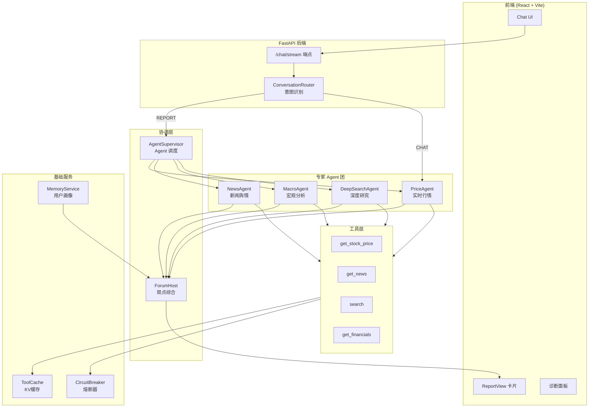
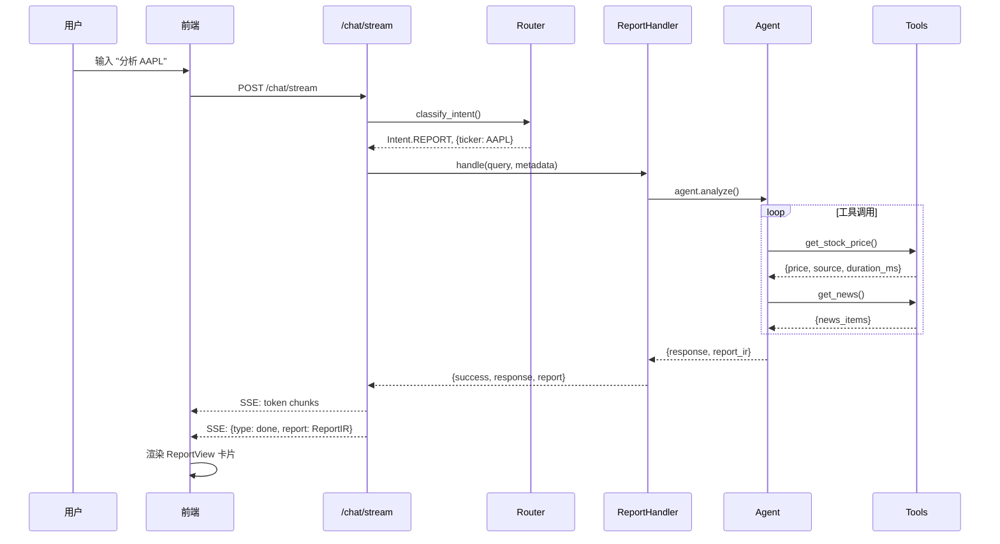
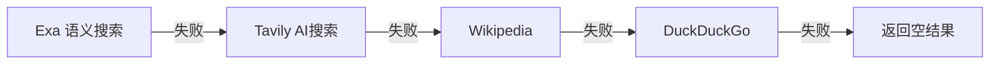
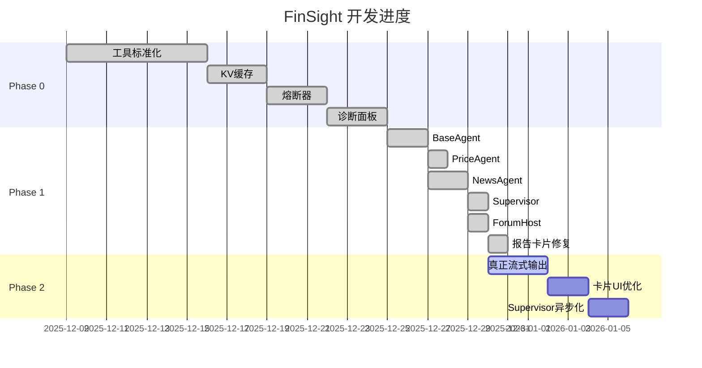

# FinSight 项目状态总览
> 📅 **更新日期**: 2025-12-30
> 🎯 **版本**: 0.5.0 (Phase 1 完成, Phase 2 进行中)

---

## 🏗️ 一、系统架构总览

### 1.1 核心架构图



### 1.2 请求处理流程



---

## 🤖 二、Agent 状态清单

### 2.1 Agent 架构

| Agent | 文件 | 状态 | 职责 | 缓存TTL |
|-------|------|------|------|---------|
| **BaseFinancialAgent** | `agents/base_agent.py` | ✅ 完成 | 基类，定义 `research()` 和 `analyze_stream()` 接口 | - |
| **PriceAgent** | `agents/price_agent.py` | ✅ 完成 | 实时行情、买卖盘 | 30秒 |
| **NewsAgent** | `agents/news_agent.py` | ✅ 完成 | 新闻舆情、反思循环 | 600秒 |
| **MacroAgent** | `agents/macro_agent.py` | ✅ 完成 | 宏观经济事件 | 1小时 |
| **DeepSearchAgent** | `agents/deep_search_agent.py` | ✅ 完成 | 深度研究、多源搜索 | 1小时 |
| **TechnicalAgent** | 未实现 | ❌ 待开发 | 技术指标分析 | - |
| **FundamentalAgent** | 未实现 | ❌ 待开发 | 基本面分析 | - |

### 2.2 关键方法

```python
# BaseFinancialAgent 核心接口
class BaseFinancialAgent:
    async def research(query, ticker) -> AgentOutput  # 标准研究流程
    async def analyze_stream(query, ticker)           # 流式分析 (yields tokens)
    async def _initial_search(query, ticker)          # 初始搜索 (子类实现)
    async def _first_summary(data)                    # 生成摘要
    async def _identify_gaps(summary)                 # 识别信息空白
    async def _stream_summary(data)                   # 流式摘要生成
```

---

## 🔧 三、Tools 函数清单

### 3.1 核心工具 (tools.py - 2673 行)

| 函数 | 类型 | 数据源 | 回退策略 | 状态 |
|------|------|--------|----------|------|
| `get_stock_price(ticker)` | 行情 | Yahoo→Google→Stooq→CNBC→Finnhub | 搜索引擎解析 | ✅ |
| `get_news(ticker)` | 新闻 | Finnhub→Tavily | Exa搜索 | ✅ |
| `search(query)` | 搜索 | Exa→Tavily→Wikipedia→DuckDuckGo | 级联回退 | ✅ |
| `get_company_info(ticker)` | 公司 | yfinance | 搜索 | ✅ |
| `get_financial_statements(ticker)` | 财务 | yfinance | - | ✅ |
| `get_key_metrics(ticker)` | 指标 | yfinance/计算 | - | ✅ |
| `get_kline_data(ticker)` | K线 | yfinance | - | ✅ |
| `get_market_sentiment()` | 情绪 | CNN Fear&Greed | 搜索 | ✅ |
| `get_economic_events()` | 宏观 | Exa搜索 | - | ✅ |
| `analyze_historical_drawdowns(ticker)` | 风险 | yfinance | - | ✅ |
| `get_performance_comparison(tickers)` | 对比 | yfinance | - | ✅ |

### 3.2 搜索源优先级



---

## 🌐 四、API 端点清单

### 4.1 核心端点 (main.py - 791 行)

| 端点 | 方法 | 功能 | 状态 |
|------|------|------|------|
| `/chat/stream` | POST | 流式对话（主入口） | ✅ 工作中 |
| `/chat` | POST | 同步对话 | ✅ |
| `/api/chart/detect` | POST | 智能图表类型检测 | ✅ |
| `/api/chart/data` | POST | 图表数据加入上下文 | ✅ |
| `/api/price/{ticker}` | GET | 获取股价 | ✅ |
| `/api/news/{ticker}` | GET | 获取新闻 | ✅ |
| `/api/financials/{ticker}` | GET | 获取财务数据 | ✅ |
| `/api/user/profile` | GET/PUT | 用户画像 | ✅ |
| `/api/user/watchlist` | POST/DELETE | 关注列表 | ✅ |
| `/diagnostics/langgraph` | GET | Agent 自检 | ✅ |
| `/diagnostics/orchestrator` | GET | 编排器健康 | ✅ |
| `/subscribe` | POST | 订阅提醒 | ✅ |
| `/health` | GET | 健康检查 | ✅ |

---

## 📊 五、协调层组件

### 5.1 AgentSupervisor

```python
# backend/orchestration/supervisor.py
class AgentSupervisor:
    agents = {
        "price": PriceAgent,
        "news": NewsAgent,
        "deep_search": DeepSearchAgent,
        "macro": MacroAgent
    }
    
    async def analyze(query, ticker, user_profile) -> Dict
    async def analyze_stream(query, ticker) -> AsyncGenerator  # ⚠️ 异步问题待修复
```

**当前问题**: `asyncio.run()` 不能在 FastAPI 事件循环中调用，已暂时禁用 Supervisor 路径

### 5.2 ForumHost

```python
# backend/orchestration/forum.py
class ForumHost:
    async def synthesize(outputs: Dict[str, AgentOutput], user_profile) -> ForumOutput
```

**输出结构**:
- `consensus`: 综合观点
- `disagreement`: 观点分歧
- `confidence`: 综合置信度
- `recommendation`: 投资建议
- `risks`: 风险提示

---

## 📦 六、数据结构

### 6.1 AgentOutput

```python
@dataclass
class AgentOutput:
    agent_name: str
    summary: str
    evidence: List[EvidenceItem]
    confidence: float  # 0-1
    data_sources: List[str]
    as_of: str  # ISO时间戳
    fallback_used: bool
    risks: List[str]
```

### 6.2 ReportIR (中间表示)

```python
ReportIR = {
    "report_id": "rpt_AAPL_1767025320",
    "ticker": "AAPL",
    "company_name": "Apple Inc.",
    "title": "AAPL 深度投资分析报告",
    "summary": "...",
    "sentiment": "bullish" | "bearish" | "neutral",
    "confidence_score": 0.75,
    "generated_at": "2025-12-30T00:00:00",
    "sections": [...],
    "citations": [...],
    "risks": [...],
    "recommendation": "HOLD"
}
```

---

## 📈 七、进度跟踪

### 7.1 阶段完成度



### 7.2 当前状态总结

| 模块 | 状态 | 说明 |
|------|------|------|
| **工具层** | ✅ 100% | 多源回退、缓存、熔断 |
| **Agent 层** | ✅ 80% | 4个 Agent 完成，缺 Technical/Fundamental |
| **协调层** | ⚠️ 70% | Supervisor 存在异步问题 |
| **Report 卡片** | ✅ 90% | 显示正常，缺少流式效果 |
| **流式输出** | ⚠️ 30% | 仅模拟分块，非真正 token 流式 |

---

## 🚀 八、未来计划

### 8.1 近期 (1-2周)

| 优先级 | 任务 | 预估工时 | 说明 |
|--------|------|----------|------|
| 🔴 高 | **真正流式输出** | 4-6h | LLM stream=True + 前端实时渲染 |
| 🔴 高 | **修复 Supervisor 异步化** | 3-4h | 使用 `await` 替代 `asyncio.run()` |
| 🟡 中 | **前端卡片美化** | 2-3h | 对齐 design_concept_v2.html |
| 🟡 中 | **Agent 进度指示器** | 2h | 显示各 Agent 实时状态 |

### 8.2 中期 (3-4周)

| 任务 | 说明 |
|------|------|
| TechnicalAgent | MA/RSI/MACD 技术分析 |
| FundamentalAgent | PE/ROE/财报分析 |
| 反思循环增强 | 自动识别信息空白并补充搜索 |
| PDF 报告导出 | 生成专业 PDF 报告 |

### 8.3 长期 (Phase 3)

| 任务 | 说明 |
|------|------|
| 实时推送服务 | WebSocket 价格预警 |
| 邮件订阅 | 定时发送分析报告 |
| 多语言支持 | 英文/中文报告切换 |
| 移动端适配 | 响应式 UI |

---

## 📁 九、项目结构

```
FinSight/
├── backend/
│   ├── agents/          # Agent 专家团
│   │   ├── base_agent.py
│   │   ├── price_agent.py
│   │   ├── news_agent.py
│   │   ├── macro_agent.py
│   │   └── deep_search_agent.py
│   ├── orchestration/   # 协调层
│   │   ├── supervisor.py
│   │   ├── forum.py
│   │   └── orchestrator.py
│   ├── handlers/        # 请求处理器
│   │   ├── report_handler.py
│   │   └── chat_handler.py
│   ├── services/        # 基础服务
│   │   ├── cache.py
│   │   ├── circuit_breaker.py
│   │   └── memory.py
│   ├── api/            # API 端点
│   │   └── main.py
│   └── tools.py        # 工具函数 (2673行)
├── frontend/
│   └── src/
│       ├── components/
│       │   ├── ChatList.tsx
│       │   ├── ChatInput.tsx
│       │   └── ReportView.tsx
│       └── api/
│           └── client.ts
└── docs/
    ├── 01_ARCHITECTURE.md
    ├── 02_PHASE0_COMPLETION.md
    ├── 03_PHASE1_IMPLEMENTATION.md
    └── feature_logs/
        └── 12.9plan.md  # 主计划文档
```

---

## ⚠️ 十、已知问题

| 问题 | 严重程度 | 状态 | 解决方案 |
|------|----------|------|----------|
| Supervisor `asyncio.run()` 错误 | 🔴 高 | 已禁用 | 需要异步化整个调用链 |
| 流式输出只是分块 | 🟡 中 | 待修复 | LLM 需支持 stream=True |
| 首次请求无流式效果 | 🟡 中 | 已知 | 前端逻辑需优化 |

---

*本文档由 Antigravity AI 自动生成，最后更新于 2025-12-30*
