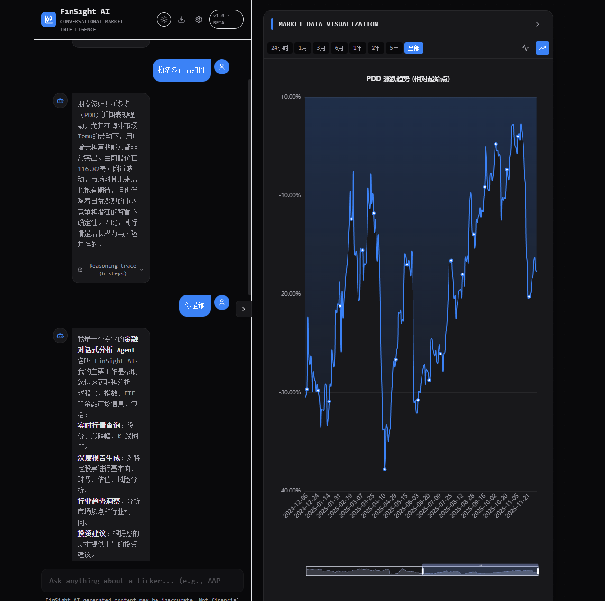
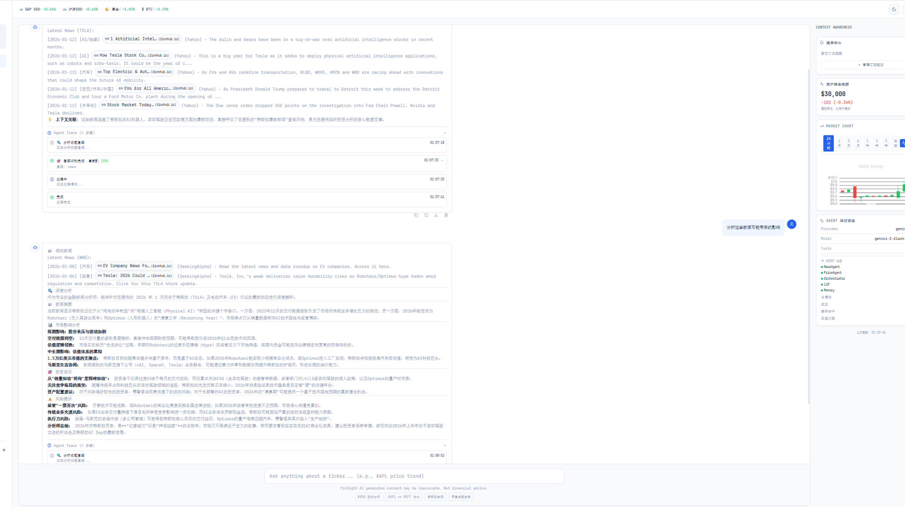
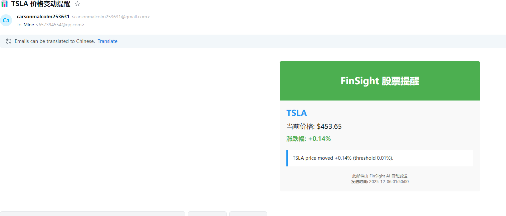
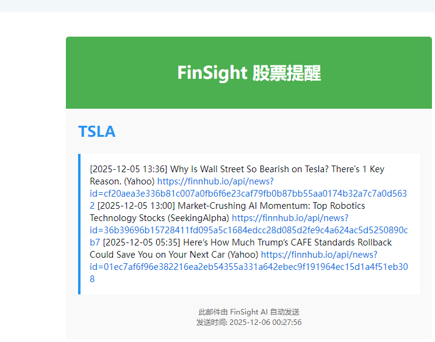
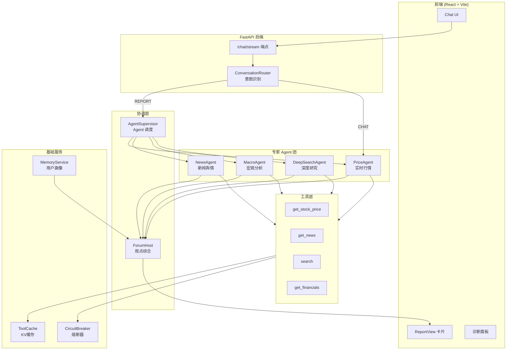
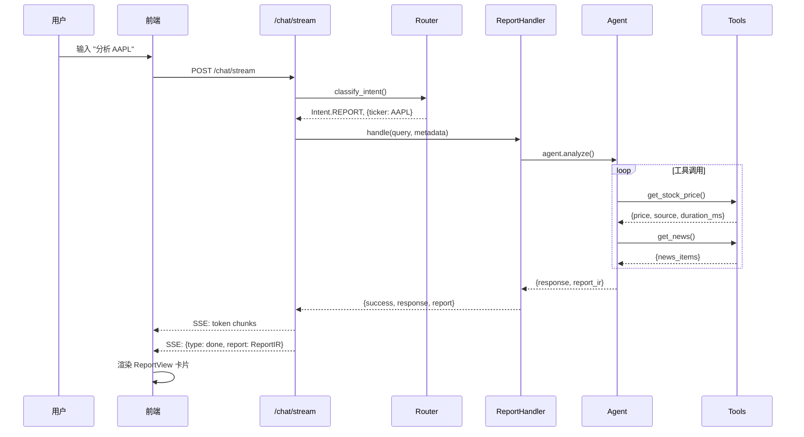
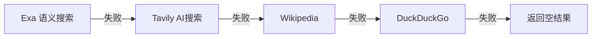
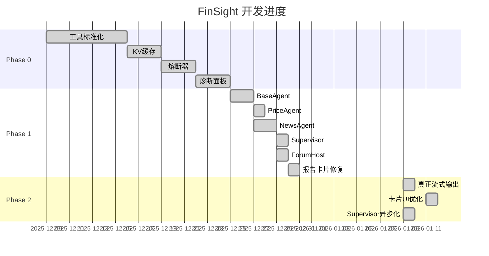

# FinSight 项目状态总览
> 📅 **更新日期**: 2026-01-13
> 🎯 **版本**: 0.6.3 (NEWS 子意图分类 + 文档同步)

---

## ✅ 2026-01-13 更新摘要 (v0.6.3)

### NEWS 子意图分类（新增）
- **子意图检测**：`_classify_news_subintent()` 区分"获取新闻"与"分析新闻影响"
- **分析类关键词**：分析、影响、解读、意味、评估、看法、趋势、预测等
- **新增处理器**：`_handle_news_analysis()` 提供深度新闻分析（新闻摘要 + 市场影响 + 投资启示 + 风险提示）

### ReportIR 构建优化
- **Forum 完整分析解析**：`_parse_forum_sections()` 解析 Forum 的 8 节分析文本
- **执行摘要提取**：`_extract_executive_summary()` 提取摘要作为卡片摘要
- **章节结构化**：优先使用 Forum 完整分析作为 ReportIR sections

### 文档同步更新
- **README.md**: 更新架构图、截图说明、版本号
- **readme_cn.md**: 中文版同步更新
- **所有 5 张截图**：深度报告、章节面板、K线图、价格提醒、新闻提醒

---

## 📸 界面截图

### 深度研究报告


### 报告章节详情


### K线图弹窗


### 邮件提醒
| 价格提醒 | 新闻提醒 |
|---------|---------|
|  |  |

---

## ✅ 2026-01-12 更新摘要 (v0.6.2)

### 多轮对话上下文管理（新增）
- **前端传递对话历史**：`ChatInput.tsx` 现在发送最近 6 条消息给后端
- **后端上下文提取**：`SupervisorAgent._extract_context_info()` 从对话历史中提取股票代码和摘要
- **意图分类增强**：`IntentClassifier.classify()` 支持 `context_summary` 参数
- **API Schema 更新**：`ChatRequest` 新增 `history` 字段

### 报告生成功能修复
- **ForumHost 真实 LLM 调用**：不再使用占位实现，真正调用 LLM 生成综合报告
- **Fallback 机制**：LLM 调用失败时使用规则合成
- **Prompt 优化**：更清晰的报告结构（共识观点、分歧观点、投资建议、风险提示）

### 代码变更文件
- `backend/api/schemas.py` - 新增 `ChatMessage` 和 `history` 字段
- `backend/api/main.py` - `/chat/supervisor/stream` 支持对话上下文
- `backend/orchestration/supervisor_agent.py` - 新增 `_extract_context_info()` 方法
- `backend/orchestration/intent_classifier.py` - `classify()` 支持 `context_summary`
- `backend/orchestration/forum.py` - 真实 LLM 调用 + fallback
- `frontend/src/api/client.ts` - `sendMessageStream()` 支持 `history` 参数
- `frontend/src/components/ChatInput.tsx` - 传递对话历史

---

## ✅ 2026-01-12 更新摘要 (v0.6.1)

### 代码重构与优化
- **集中化配置管理**：
  - 新增 `backend/config/keywords.py` - 关键词配置集中管理
  - 新增 `backend/config/ticker_mapping.py` - Ticker 映射集中管理
  - 删除 ~100 行重复代码（router.py 中的映射定义）
- **Pydantic V2 模型**：新增 `backend/api/schemas.py`，为所有 API 端点定义请求/响应模型
- **代码注释英文化**：核心模块注释转为英文，用户响应保持中文
- **安全修复**：EXA_API_KEY 从硬编码改为环境变量读取
- **文件归档**：未使用的 `smart_router.py` 和 `smart_dispatcher.py` 移至 `backend/_archive/`

### Supervisor Agent 架构（已完成）
- **混合意图分类器**：三层架构（规则 → Embedding + 关键词加权 → LLM兜底）
- **Embedding 模型**：`paraphrase-multilingual-MiniLM-L12-v2` (支持中英文，延迟加载)
- **新端点**：`/chat/supervisor` 和 `/chat/supervisor/stream`
- **前端模式切换**：设置面板支持"协调者模式"和"传统模式"切换

### Supervisor Agent 架构（三层混合方案）

```
用户输入
    ↓
┌─────────────────────────────────────┐
│ 第一层：规则匹配（快速通道）          │
│ - "你好/帮助/退出" → 直接处理         │
│ - 多 ticker → 自动识别为对比         │
└─────────────────────────────────────┘
    ↓ 没匹配到
┌─────────────────────────────────────┐
│ 第二层：Embedding相似度 + 关键词加权  │
│ - 计算与各意图例句的相似度            │
│ - 关键词命中 → 加权 +0.12           │
│ - 相似度 >= 0.75 → 直接分类          │
└─────────────────────────────────────┘
    ↓ 置信度不够
┌─────────────────────────────────────┐
│ 第三层：LLM Router（兜底）           │
│ - 把候选意图告诉LLM                  │
│ - LLM做最终决策                      │
└─────────────────────────────────────┘
```

**方案对比**:
| 方案 | 适用场景 | 准确率 | 成本 |
|------|---------|--------|------|
| 关键词匹配 | 快速通道、辅助加权 | 60-70% | 免费 |
| Embedding相似度 | 主力方案 | 80-90% | 低 |
| LLM Router | 兜底、复杂场景 | 90%+ | 高 |

**FinSight 采用**: Embedding为主 + 关键词加权 + LLM兜底

## ✅ 2026-01-11 更新摘要

- TechnicalAgent + FundamentalAgent 已实现并接入 Supervisor
- ReportIR Schema + Validator 已完成并接入报告生成路径
- DeepSearchAgent 已完成真实检索 + PDF 解析 + Self-RAG 反思检索
- 前端 Report 卡片 UI 已对齐 design_concept_v2.html
- Report 卡片订阅按钮已接入 Settings 邮箱（避免 prompt）
- 章节导航滚动高亮（IntersectionObserver）已接入
- 新增 ReportIR Chart Option 规范文档（docs/REPORT_CHART_SPEC.md）
- Reasoning trace 现已覆盖全流程步骤，并在 /chat 与 /chat/stream 返回细节
- ???->Ticker ????????Finnhub symbol lookup + ????????????
- ??????????????????? ticker?????????
- DeepSearch trace/citations ???????? Markdown???????
- /chat/stream 全意图真实 token 流式输出，REPORT 默认走 ReportAgent，SSE done 事件带 ReportIR
- /chat 与 /chat/stream 均已接入异步 Supervisor 与指代消解（resolve_reference）
- **Bug 修复**：
  - ✅ API 配置持久化：`GET /api/config` 现从 `user_config.json` 读取已保存配置
  - ✅ 三指标卡片布局：改用 `sm:grid-cols-3` 在更小断点横排显示
  - ✅ 邮件发送逻辑：只有发送成功才更新 `last_alert_at`，避免误判
  - ✅ AI Confidence 说明：添加置信度等级标签和证据来源说明

## 🏗️ 一、系统架构总览

### 1.1 核心架构图



### 1.2 请求处理流程



---

## 🤖 二、Agent 状态清单

### 2.1 Agent 架构

| Agent | 文件 | 状态 | 职责 | 缓存TTL |
|-------|------|------|------|---------|
| **BaseFinancialAgent** | `agents/base_agent.py` | ✅ 完成 | 基类，定义 `research()` 和 `analyze_stream()` 接口 | - |
| **PriceAgent** | `agents/price_agent.py` | ✅ 完成 | 实时行情、买卖盘 | 30秒 |
| **NewsAgent** | `agents/news_agent.py` | ✅ 完成 | 新闻舆情、反思循环 | 600秒 |
| **MacroAgent** | `agents/macro_agent.py` | ✅ 完成 | 宏观经济事件 | 1小时 |
| **DeepSearchAgent** | `agents/deep_search_agent.py` | ✅ 已完成（真实检索 + PDF + Self-RAG） | 深度研究、多源检索 | 1小时 |
| **TechnicalAgent** | `agents/technical_agent.py` | ✅ 完成 | 技术指标分析 | 30分钟 |
| **FundamentalAgent** | `agents/fundamental_agent.py` | ✅ 完成 | 基本面分析 | 24小时 |

### 2.2 关键方法

```python
# BaseFinancialAgent 核心接口
class BaseFinancialAgent:
    async def research(query, ticker) -> AgentOutput  # 标准研究流程
    async def analyze_stream(query, ticker)           # 流式分析 (yields tokens)
    async def _initial_search(query, ticker)          # 初始搜索 (子类实现)
    async def _first_summary(data)                    # 生成摘要
    async def _identify_gaps(summary)                 # 识别信息空白
    async def _stream_summary(data)                   # 流式摘要生成
```

---

## 🔧 三、Tools 函数清单

### 3.1 核心工具 (tools.py - 2673 行)

| 函数 | 类型 | 数据源 | 回退策略 | 状态 |
|------|------|--------|----------|------|
| `get_stock_price(ticker)` | 行情 | yfinance→Finnhub→AlphaVantage | 搜索兜底 | ✅ |
| `get_news(ticker)` | 新闻 | Reuters/Bloomberg RSS + Finnhub(48h) → Tavily/Exa | 3d/7d 时效过滤 + 标题长度过滤 + 标签分类 | ✅ |
| `search(query)` | 搜索 | Exa→Tavily→Wikipedia→DuckDuckGo | 级联回退 | ✅ |
| `get_company_info(ticker)` | 公司 | yfinance | 搜索 | ✅ |
| `get_financial_statements(ticker)` | 财务 | yfinance | - | ✅ |
| `get_key_metrics(ticker)` | 指标 | yfinance/计算 | - | ✅ |
| `get_kline_data(ticker)` | K线 | yfinance | - | ✅ |
| `get_market_sentiment()` | 情绪 | CNN Fear&Greed | 搜索 | ✅ |
| `get_economic_events()` | 宏观 | Exa搜索 | - | ✅ |
| `analyze_historical_drawdowns(ticker)` | 风险 | yfinance | - | ✅ |
| `get_performance_comparison(tickers)` | 对比 | yfinance | - | ✅ |

### 3.2 搜索源优先级



---

## 🌐 四、API 端点清单

### 4.1 核心端点 (main.py - 791 行)

| 端点 | 方法 | 功能 | 状态 |
|------|------|------|------|
| `/chat/supervisor` | POST | 协调者模式对话（主入口） | ✅ 稳定（意图分类+Agent协调） |
| `/chat/supervisor/stream` | POST | 协调者模式流式对话 | ✅ 稳定 |
| `/chat/stream` | POST | 流式对话（传统模式） | ✅ 稳定（全意图 token 流式） |
| `/chat` | POST | 同步对话（传统模式） | ✅ 稳定（异步 Supervisor） |
| `/chat/smart` | POST | 兼容旧接口，重定向到 supervisor | ✅ 兼容 |
| `/api/chart/detect` | POST | 智能图表类型检测 | ✅ 可用 |
| `/api/chart/data` | POST | 图表数据加入上下文 | ✅ 可用 |
| `/api/price/{ticker}` | GET | 获取股价 | ✅ 可用 |
| `/api/news/{ticker}` | GET | 获取新闻 | ✅ 可用 |
| `/api/financials/{ticker}` | GET | 获取财务数据 | ✅ 可用 |
| `/api/user/profile` | GET/PUT | 用户画像 | ✅ 可用 |
| `/api/user/watchlist` | POST/DELETE | 关注列表 | ✅ 可用 |
| `/diagnostics/langgraph` | GET | Agent 自检 | ✅ 可用 |
| `/diagnostics/orchestrator` | GET | 编排器健康 | ✅ 可用 |
| `/api/subscribe` | POST | 订阅提醒 | ✅ 可用（MVP） |
| `/api/unsubscribe` | POST | 取消订阅 | ✅ 可用 |
| `/api/subscriptions` | GET | 获取订阅 | ✅ 可用 |
| `/health` | GET | 健康检查 | ✅ 可用 |

---

## 📊 五、协调层组件

### 5.1 SupervisorAgent (协调者模式)

```python
# backend/orchestration/supervisor_agent.py
class SupervisorAgent:
    """
    协调者 Agent - 业界标准的多Agent架构
    流程：IntentClassifier → 意图路由 → Worker Agents → Forum
    """
    classifier = IntentClassifier(llm)  # 意图分类器
    agents = {
        "price": PriceAgent,
        "news": NewsAgent,
        "technical": TechnicalAgent,
        "fundamental": FundamentalAgent,
        "macro": MacroAgent,
        "deep_search": DeepSearchAgent
    }

    async def process(query, tickers, user_profile) -> SupervisorResult
    async def process_stream(query, tickers) -> AsyncGenerator
```

**当前状态**:
- `/chat/supervisor` 使用 SupervisorAgent 处理请求
- 意图分类采用"规则优先 + LLM兜底"策略
- 简单问题（问候、价格）规则直接处理，省钱
- 复杂问题（报告）多Agent协作 + Forum综合

### 5.2 IntentClassifier (意图分类器)

```python
# backend/orchestration/intent_classifier.py
class IntentClassifier:
    def classify(query, tickers) -> ClassificationResult
    def _rule_classify(query, tickers)  # 规则匹配 - 免费
    def _llm_classify(query, tickers)   # LLM分类 - 付费
```

### 5.3 AgentSupervisor (旧版)

```python
# backend/orchestration/supervisor.py
class AgentSupervisor:
    agents = {
        "price": PriceAgent,
        "news": NewsAgent,
        "deep_search": DeepSearchAgent,
        "macro": MacroAgent
    }
    
    async def analyze(query, ticker, user_profile) -> Dict
    async def analyze_stream(query, ticker) -> AsyncGenerator  # ✅ 异步链路已修复
```

**当前状态**:
- /chat 使用 `chat_async`，避免 `asyncio.run()` 在事件循环中调用
- /chat/stream 默认走 ReportAgent 流式，支持 `SUPERVISOR_STREAM_FORCE` 强制 Supervisor
- 同步 `agent.chat()` 在无事件循环时安全回退

### 5.2 ForumHost

```python
# backend/orchestration/forum.py
class ForumHost:
    async def synthesize(outputs: Dict[str, AgentOutput], user_profile) -> ForumOutput
```

**输出结构**:
- `consensus`: 综合观点
- `disagreement`: 观点分歧
- `confidence`: 综合置信度
- `recommendation`: 投资建议
- `risks`: 风险提示

---

## 📦 六、数据结构

### 6.1 AgentOutput

```python
@dataclass
class AgentOutput:
    agent_name: str
    summary: str
    evidence: List[EvidenceItem]
    confidence: float  # 0-1
    data_sources: List[str]
    as_of: str  # ISO时间戳
    fallback_used: bool
    risks: List[str]
```

### 6.2 ReportIR (中间表示)

```python
ReportIR = {
    "report_id": "rpt_AAPL_1767025320",
    "ticker": "AAPL",
    "company_name": "Apple Inc.",
    "title": "AAPL 深度投资分析报告",
    "summary": "...",
    "sentiment": "bullish" | "bearish" | "neutral",
    "confidence_score": 0.75,
    "generated_at": "2025-12-30T00:00:00",
    "sections": [...],
    "citations": [...],
    "risks": [...],
    "recommendation": "HOLD"
}
```

---

## 📈 七、进度跟踪

### 7.1 阶段完成度



### 7.2 当前状态总结

| 模块 | 状态 | 说明 |
|------|------|------|
| **工具层** | ✅ 100% | 多源回退、缓存、熔断 |
| **Agent 层** | ✅ 95% | Technical/Fundamental/DeepSearch 已完成，Macro 待升级 |
| **协调层** | ✅ 95% | Supervisor 异步与流式聚合稳定 |
| **Report 卡片** | ✅ 100% | 视觉与结构已对齐 design_concept_v2.html |
| **流式输出** | ✅ 100% | /chat/stream 全意图真实 token 流式 |

---

## 🚀 八、未来计划

### 8.1 近期 (1-2周)

| 优先级 | 任务 | 预估工时 | 说明 |
|--------|------|----------|------|
| ✅ 已完成 | **TechnicalAgent + FundamentalAgent** | - | 2026-01-10 完成 |
| ✅ 已完成 | **ReportIR Schema + Validator** | - | 2026-01-10 完成 |
| ✅ 已完成 | **前端 Report 卡片优化** | - | 2026-01-11 完成 |
| ✅ 已完成 | **DeepSearchAgent 真实检索 + PDF + Self-RAG** | - | 2026-01-11 完成 |
| 🟡 中 | **Agent 进度指示器** | 2h | 显示各 Agent 实时状态 |

### 8.2 中期 (3-4周)

| 任务 | 说明 |
|------|------|
| DeepSearchAgent 真实检索 + PDF 解析（已完成 2026-01-11） | 长文抓取与解析落地 |
| MacroAgent 升级 | 集成 FRED API 宏观数据 |
| Self-RAG v1（已完成 2026-01-11） | 反思式检索已接入 DeepSearchAgent |
| PDF 报告导出 | 生成专业 PDF 报告 |

### 8.3 长期 (Phase 3)

| 任务 | 说明 |
|------|------|
| 实时推送服务 | WebSocket 价格预警 |
| 邮件订阅 | 定时发送分析报告 |
| 多语言支持 | 英文/中文报告切换 |
| 移动端适配 | 响应式 UI |

---

## 📁 九、项目结构

```
FinSight/
├── backend/
│   ├── agents/          # Agent 专家团
│   │   ├── base_agent.py
│   │   ├── price_agent.py
│   │   ├── news_agent.py
│   │   ├── macro_agent.py
│   │   ├── deep_search_agent.py
│   │   ├── technical_agent.py
│   │   └── fundamental_agent.py
│   ├── orchestration/   # 协调层
│   │   ├── supervisor.py
│   │   ├── forum.py
│   │   └── orchestrator.py
│   ├── handlers/        # 请求处理器
│   │   ├── report_handler.py
│   │   └── chat_handler.py
│   ├── services/        # 基础服务
│   │   ├── cache.py
│   │   ├── circuit_breaker.py
│   │   └── memory.py
│   ├── report/          # ReportIR Schema + Validator
│   │   ├── ir.py
│   │   └── validator.py
│   ├── api/            # API 端点
│   │   └── main.py
│   └── tools.py        # 工具函数 (2673行)
├── frontend/
│   └── src/
│       ├── components/
│       │   ├── ChatList.tsx
│       │   ├── ChatInput.tsx
│       │   └── ReportView.tsx
│       └── api/
│           └── client.ts
└── docs/
    ├── 01_ARCHITECTURE.md
    ├── 02_PHASE0_COMPLETION.md
    ├── 03_PHASE1_IMPLEMENTATION.md
    ├── 04_PHASE2_DEEP_RESEARCH.md
    ├── 05_RAG_ARCHITECTURE.md
    ├── 05_PHASE3_ACTIVE_SERVICE.md
    └── feature_logs/
        └── 12.9plan.md  # 主计划文档
```

---

## ⚠️ 十、已知问题

| 问题 | 严重程度 | 状态 | 解决方案 |
|------|----------|------|----------|
| 向量 RAG 管线缺失 | 🟡 中 | 待处理 | 引入 LlamaIndex + Chroma |
| 订阅/提醒策略仍需完善 | 🟡 中 | 进行中 | 触发策略 + 去重/频控 + 邮件模板优化 |
| 首次请求无流式效果 | 🟡 中 | 已知 | 前端流式重连与加载逻辑优化 |

---

*本文档由 Antigravity AI 自动生成，最后更新于 2026-01-11*
