# FinSight 项目状态总览
> 📅 **更新日期**: 2026-01-12
> 🎯 **版本**: 0.5.4 (Phase 1 完成，Phase 2 进行中)

---

## ✅ 2026-01-12 更新摘要

- **P0: 配置热加载**：`get_llm_config()` 现在优先从 `user_config.json` 热加载，用户修改配置后无需重启
- **P1: CHAT 意图调用子 Agent**：ChatHandler 现在可以使用 NewsAgent 的反思循环获取新闻
- **P2: Ticker 识别优化**：Router 已识别的 ticker（如 AAPL）不再触发 clarification
- **P3: 财报查询专用路由**：新增 `_is_financial_report_query()` 和 `_handle_financial_report_query()`

## ✅ 2026-01-11 更新摘要

- TechnicalAgent + FundamentalAgent 已实现并接入 Supervisor
- ReportIR Schema + Validator 已完成并接入报告生成路径
- DeepSearchAgent 已完成真实检索 + PDF 解析 + Self-RAG 反思检索
- 前端 Report 卡片 UI 已对齐 design_concept_v2.html
- Report 卡片订阅按钮已接入 Settings 邮箱（避免 prompt）
- 章节导航滚动高亮（IntersectionObserver）已接入
- 新增 ReportIR Chart Option 规范文档（docs/REPORT_CHART_SPEC.md）
- Reasoning trace 现已覆盖全流程步骤，并在 /chat 与 /chat/stream 返回细节
- ???->Ticker ????????Finnhub symbol lookup + ????????????
- ??????????????????? ticker?????????
- DeepSearch trace/citations ???????? Markdown???????
- /chat/stream 全意图真实 token 流式输出，REPORT 默认走 ReportAgent，SSE done 事件带 ReportIR
- /chat 与 /chat/stream 均已接入异步 Supervisor 与指代消解（resolve_reference）
- **Bug 修复**：
  - ✅ API 配置持久化：`GET /api/config` 现从 `user_config.json` 读取已保存配置
  - ✅ 三指标卡片布局：改用 `sm:grid-cols-3` 在更小断点横排显示
  - ✅ 邮件发送逻辑：只有发送成功才更新 `last_alert_at`，避免误判
  - ✅ AI Confidence 说明：添加置信度等级标签和证据来源说明

## 🏗️ 一、系统架构总览

### 1.1 核心架构图

```mermaid
flowchart TB
    subgraph Frontend["前端 (React + Vite)"]
        UI[Chat UI]
        Report[ReportView 卡片]
        Diag[诊断面板]
    end

    subgraph API["FastAPI 后端"]
        Main["/chat/stream 端点"]
        Router[ConversationRouter<br/>意图识别]
    end

    subgraph Agents["专家 Agent 团"]
        PA[PriceAgent<br/>实时行情]
        NA[NewsAgent<br/>新闻舆情]
        MA[MacroAgent<br/>宏观分析]
        DSA[DeepSearchAgent<br/>深度研究]
    end

    subgraph Orchestration["协调层"]
        Sup[AgentSupervisor<br/>Agent 调度]
        Forum[ForumHost<br/>观点综合]
    end

    subgraph Services["基础服务"]
        Cache[ToolCache<br/>KV缓存]
        CB[CircuitBreaker<br/>熔断器]
        Mem[MemoryService<br/>用户画像]
    end

    subgraph Tools["工具层"]
        Price[get_stock_price]
        News[get_news]
        Search[search]
        Financial[get_financials]
    end

    UI --> Main
    Main --> Router
    Router -->|REPORT| Sup
    Router -->|CHAT| PA
    
    Sup --> PA & NA & MA & DSA
    PA & NA & MA & DSA --> Forum
    Forum --> Report
    
    PA & NA & MA & DSA --> Tools
    Tools --> Cache
    Tools --> CB
    
    Mem --> Forum
```



### 1.2 请求处理流程

```mermaid
sequenceDiagram
    participant U as 用户
    participant F as 前端
    participant API as /chat/stream
    participant R as Router
    participant H as ReportHandler
    participant A as Agent
    participant T as Tools

    U->>F: 输入 "分析 AAPL"
    F->>API: POST /chat/stream
    API->>R: classify_intent()
    R-->>API: Intent.REPORT, {ticker: AAPL}
    
    API->>H: handle(query, metadata)
    H->>A: agent.analyze()
    
    loop 工具调用
        A->>T: get_stock_price()
        T-->>A: {price, source, duration_ms}
        A->>T: get_news()
        T-->>A: {news_items}
    end
    
    A-->>H: {response, report_ir}
    H-->>API: {success, response, report}
    
    API-->>F: SSE: token chunks
    API-->>F: SSE: {type: done, report: ReportIR}
    F->>F: 渲染 ReportView 卡片
```



---

## 🤖 二、Agent 状态清单

### 2.1 Agent 架构

| Agent | 文件 | 状态 | 职责 | 缓存TTL |
|-------|------|------|------|---------|
| **BaseFinancialAgent** | `agents/base_agent.py` | ✅ 完成 | 基类，定义 `research()` 和 `analyze_stream()` 接口 | - |
| **PriceAgent** | `agents/price_agent.py` | ✅ 完成 | 实时行情、买卖盘 | 30秒 |
| **NewsAgent** | `agents/news_agent.py` | ✅ 完成 | 新闻舆情、反思循环 | 600秒 |
| **MacroAgent** | `agents/macro_agent.py` | ✅ 完成 | 宏观经济事件 | 1小时 |
| **DeepSearchAgent** | `agents/deep_search_agent.py` | ✅ 已完成（真实检索 + PDF + Self-RAG） | 深度研究、多源检索 | 1小时 |
| **TechnicalAgent** | `agents/technical_agent.py` | ✅ 完成 | 技术指标分析 | 30分钟 |
| **FundamentalAgent** | `agents/fundamental_agent.py` | ✅ 完成 | 基本面分析 | 24小时 |

### 2.2 关键方法

```python
# BaseFinancialAgent 核心接口
class BaseFinancialAgent:
    async def research(query, ticker) -> AgentOutput  # 标准研究流程
    async def analyze_stream(query, ticker)           # 流式分析 (yields tokens)
    async def _initial_search(query, ticker)          # 初始搜索 (子类实现)
    async def _first_summary(data)                    # 生成摘要
    async def _identify_gaps(summary)                 # 识别信息空白
    async def _stream_summary(data)                   # 流式摘要生成
```

---

## 🔧 三、Tools 函数清单

### 3.1 核心工具 (tools.py - 2673 行)

| 函数 | 类型 | 数据源 | 回退策略 | 状态 |
|------|------|--------|----------|------|
| `get_stock_price(ticker)` | 行情 | yfinance→Finnhub→AlphaVantage | 搜索兜底 | ✅ |
| `get_news(ticker)` | 新闻 | Reuters/Bloomberg RSS + Finnhub(48h) → Tavily/Exa | 3d/7d 时效过滤 + 标题长度过滤 + 标签分类 | ✅ |
| `search(query)` | 搜索 | Exa→Tavily→Wikipedia→DuckDuckGo | 级联回退 | ✅ |
| `get_company_info(ticker)` | 公司 | yfinance | 搜索 | ✅ |
| `get_financial_statements(ticker)` | 财务 | yfinance | - | ✅ |
| `get_key_metrics(ticker)` | 指标 | yfinance/计算 | - | ✅ |
| `get_kline_data(ticker)` | K线 | yfinance | - | ✅ |
| `get_market_sentiment()` | 情绪 | CNN Fear&Greed | 搜索 | ✅ |
| `get_economic_events()` | 宏观 | Exa搜索 | - | ✅ |
| `analyze_historical_drawdowns(ticker)` | 风险 | yfinance | - | ✅ |
| `get_performance_comparison(tickers)` | 对比 | yfinance | - | ✅ |

### 3.2 搜索源优先级

```mermaid
flowchart LR
    A[Exa 语义搜索] -->|失败| B[Tavily AI搜索]
    B -->|失败| C[Wikipedia]
    C -->|失败| D[DuckDuckGo]
    D -->|失败| E[返回空结果]
```



---

## 🌐 四、API 端点清单

### 4.1 核心端点 (main.py - 791 行)

| 端点 | 方法 | 功能 | 状态 |
|------|------|------|------|
| `/chat/stream` | POST | 流式对话（主入口） | ✅ 稳定（全意图 token 流式） |
| `/chat` | POST | 同步对话 | ✅ 稳定（异步 Supervisor） |
| `/api/chart/detect` | POST | 智能图表类型检测 | ✅ 可用 |
| `/api/chart/data` | POST | 图表数据加入上下文 | ✅ 可用 |
| `/api/price/{ticker}` | GET | 获取股价 | ✅ 可用 |
| `/api/news/{ticker}` | GET | 获取新闻 | ✅ 可用 |
| `/api/financials/{ticker}` | GET | 获取财务数据 | ✅ 可用 |
| `/api/user/profile` | GET/PUT | 用户画像 | ✅ 可用 |
| `/api/user/watchlist` | POST/DELETE | 关注列表 | ✅ 可用 |
| `/diagnostics/langgraph` | GET | Agent 自检 | ✅ 可用 |
| `/diagnostics/orchestrator` | GET | 编排器健康 | ✅ 可用 |
| `/api/subscribe` | POST | 订阅提醒 | ✅ 可用（MVP） |
| `/api/unsubscribe` | POST | 取消订阅 | ✅ 可用 |
| `/api/subscriptions` | GET | 获取订阅 | ✅ 可用 |
| `/health` | GET | 健康检查 | ✅ 可用 |

---

## 📊 五、协调层组件

### 5.1 AgentSupervisor

```python
# backend/orchestration/supervisor.py
class AgentSupervisor:
    agents = {
        "price": PriceAgent,
        "news": NewsAgent,
        "deep_search": DeepSearchAgent,
        "macro": MacroAgent
    }
    
    async def analyze(query, ticker, user_profile) -> Dict
    async def analyze_stream(query, ticker) -> AsyncGenerator  # ✅ 异步链路已修复
```

**当前状态**:
- /chat 使用 `chat_async`，避免 `asyncio.run()` 在事件循环中调用
- /chat/stream 默认走 ReportAgent 流式，支持 `SUPERVISOR_STREAM_FORCE` 强制 Supervisor
- 同步 `agent.chat()` 在无事件循环时安全回退

### 5.2 ForumHost

```python
# backend/orchestration/forum.py
class ForumHost:
    async def synthesize(outputs: Dict[str, AgentOutput], user_profile) -> ForumOutput
```

**输出结构**:
- `consensus`: 综合观点
- `disagreement`: 观点分歧
- `confidence`: 综合置信度
- `recommendation`: 投资建议
- `risks`: 风险提示

---

## 📦 六、数据结构

### 6.1 AgentOutput

```python
@dataclass
class AgentOutput:
    agent_name: str
    summary: str
    evidence: List[EvidenceItem]
    confidence: float  # 0-1
    data_sources: List[str]
    as_of: str  # ISO时间戳
    fallback_used: bool
    risks: List[str]
```

### 6.2 ReportIR (中间表示)

```python
ReportIR = {
    "report_id": "rpt_AAPL_1767025320",
    "ticker": "AAPL",
    "company_name": "Apple Inc.",
    "title": "AAPL 深度投资分析报告",
    "summary": "...",
    "sentiment": "bullish" | "bearish" | "neutral",
    "confidence_score": 0.75,
    "generated_at": "2025-12-30T00:00:00",
    "sections": [...],
    "citations": [...],
    "risks": [...],
    "recommendation": "HOLD"
}
```

---

## 📈 七、进度跟踪

### 7.1 阶段完成度

```mermaid
gantt
    title FinSight 开发进度
    dateFormat  YYYY-MM-DD
    section Phase 0
    工具标准化     :done, p0-1, 2025-12-09, 7d
    KV缓存         :done, p0-2, 2025-12-16, 3d
    熔断器         :done, p0-3, 2025-12-19, 3d
    诊断面板       :done, p0-4, 2025-12-22, 3d
    
    section Phase 1
    BaseAgent      :done, p1-1, 2025-12-25, 2d
    PriceAgent     :done, p1-2, 2025-12-27, 1d
    NewsAgent      :done, p1-3, 2025-12-27, 2d
    Supervisor     :done, p1-4, 2025-12-29, 1d
    ForumHost      :done, p1-5, 2025-12-29, 1d
    报告卡片修复   :done, p1-6, 2025-12-30, 1d
    
    section Phase 2
    真正流式输出   :done, p2-1, 2026-01-09, 1d
    卡片UI优化     :done, p2-2, 2026-01-11, 1d
    Supervisor异步化:done, p2-3, 2026-01-09, 1d
```



### 7.2 当前状态总结

| 模块 | 状态 | 说明 |
|------|------|------|
| **工具层** | ✅ 100% | 多源回退、缓存、熔断 |
| **Agent 层** | ✅ 95% | Technical/Fundamental/DeepSearch 已完成，Macro 待升级 |
| **协调层** | ✅ 95% | Supervisor 异步与流式聚合稳定 |
| **Report 卡片** | ✅ 100% | 视觉与结构已对齐 design_concept_v2.html |
| **流式输出** | ✅ 100% | /chat/stream 全意图真实 token 流式 |

---

## 🚀 八、未来计划

### 8.1 近期 (1-2周)

| 优先级 | 任务 | 预估工时 | 说明 |
|--------|------|----------|------|
| ✅ 已完成 | **TechnicalAgent + FundamentalAgent** | - | 2026-01-10 完成 |
| ✅ 已完成 | **ReportIR Schema + Validator** | - | 2026-01-10 完成 |
| ✅ 已完成 | **前端 Report 卡片优化** | - | 2026-01-11 完成 |
| ✅ 已完成 | **DeepSearchAgent 真实检索 + PDF + Self-RAG** | - | 2026-01-11 完成 |
| 🟡 中 | **Agent 进度指示器** | 2h | 显示各 Agent 实时状态 |

### 8.2 中期 (3-4周)

| 任务 | 说明 |
|------|------|
| DeepSearchAgent 真实检索 + PDF 解析（已完成 2026-01-11） | 长文抓取与解析落地 |
| MacroAgent 升级 | 集成 FRED API 宏观数据 |
| Self-RAG v1（已完成 2026-01-11） | 反思式检索已接入 DeepSearchAgent |
| PDF 报告导出 | 生成专业 PDF 报告 |

### 8.3 长期 (Phase 3)

| 任务 | 说明 |
|------|------|
| 实时推送服务 | WebSocket 价格预警 |
| 邮件订阅 | 定时发送分析报告 |
| 多语言支持 | 英文/中文报告切换 |
| 移动端适配 | 响应式 UI |

---

## 📁 九、项目结构

```
FinSight/
├── backend/
│   ├── agents/          # Agent 专家团
│   │   ├── base_agent.py
│   │   ├── price_agent.py
│   │   ├── news_agent.py
│   │   ├── macro_agent.py
│   │   ├── deep_search_agent.py
│   │   ├── technical_agent.py
│   │   └── fundamental_agent.py
│   ├── orchestration/   # 协调层
│   │   ├── supervisor.py
│   │   ├── forum.py
│   │   └── orchestrator.py
│   ├── handlers/        # 请求处理器
│   │   ├── report_handler.py
│   │   └── chat_handler.py
│   ├── services/        # 基础服务
│   │   ├── cache.py
│   │   ├── circuit_breaker.py
│   │   └── memory.py
│   ├── report/          # ReportIR Schema + Validator
│   │   ├── ir.py
│   │   └── validator.py
│   ├── api/            # API 端点
│   │   └── main.py
│   └── tools.py        # 工具函数 (2673行)
├── frontend/
│   └── src/
│       ├── components/
│       │   ├── ChatList.tsx
│       │   ├── ChatInput.tsx
│       │   └── ReportView.tsx
│       └── api/
│           └── client.ts
└── docs/
    ├── 01_ARCHITECTURE.md
    ├── 02_PHASE0_COMPLETION.md
    ├── 03_PHASE1_IMPLEMENTATION.md
    ├── 04_PHASE2_DEEP_RESEARCH.md
    ├── 05_RAG_ARCHITECTURE.md
    ├── 05_PHASE3_ACTIVE_SERVICE.md
    └── feature_logs/
        └── 12.9plan.md  # 主计划文档
```

---

## ⚠️ 十、已知问题

| 问题 | 严重程度 | 状态 | 解决方案 |
|------|----------|------|----------|
| 向量 RAG 管线缺失 | 🟡 中 | 待处理 | 引入 LlamaIndex + Chroma |
| 订阅/提醒策略仍需完善 | 🟡 中 | 进行中 | 触发策略 + 去重/频控 + 邮件模板优化 |
| 首次请求无流式效果 | 🟡 中 | 已知 | 前端流式重连与加载逻辑优化 |

---

*本文档由 Antigravity AI 自动生成，最后更新于 2026-01-11*
