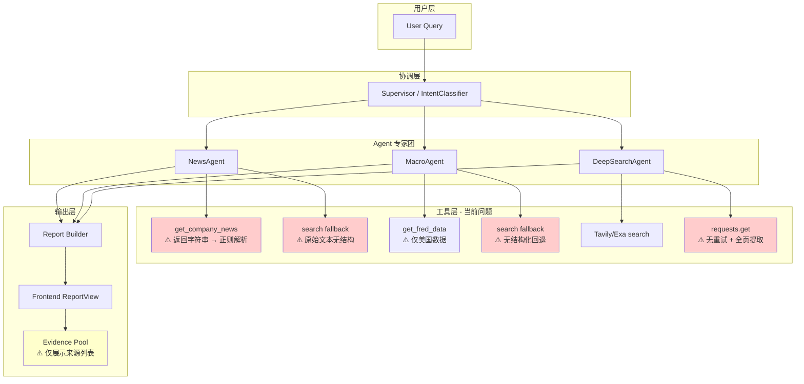
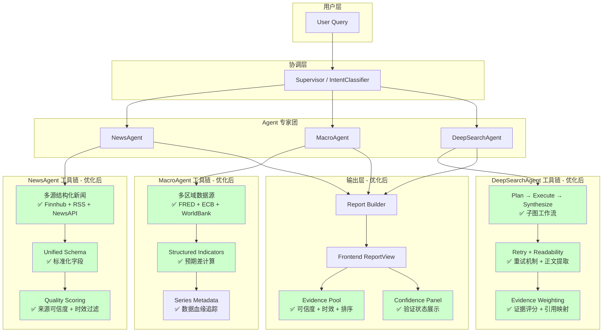

# QUALITY_IMPROVEMENT_OVERVIEW

> **角色**：Quality Assurance Architect (Google DeepMind 级别)
>
> **目标**：定位 FinSight 现有质量瓶颈与架构缺陷，提出可验证、可落地的改进路线（优先使用免费层 API），并给出前端展示层的可信度增强策略。
>
> **范围**：后端核心 Agent（News/Macro/DeepSearch）与前端报告展示。
>
> **更新日期**：2026-01-20

---

## 0. 执行摘要（Executive Summary）
> Update 2026-01-22: backend/tools.py split into backend/tools/ package. Legacy line refs map to backend/_archive/tools_legacy.py.


当前系统能够正确选择子 Agent，但"说服力不足"的根因集中在三类：

| 问题类别 | 核心症状 | 影响程度 |
|---------|---------|---------|
| **证据链稀疏** | 搜索/抓取结果与报告引用的"可验证性"弱，来源多但缺少明确权重与可信度说明 | 🔴 高 |
| **结构化能力不足** | 新闻与宏观数据在回退路径上以"自由文本"方式处理，导致分析层无法稳定抽取关键指标 | 🔴 高 |
| **流程可维护性不足** | 关键路径存在不可达代码、无重试机制与可观测性薄弱等问题 | 🟡 中 |

**核心洞察**：这些问题不会影响"能跑"，但会显著削弱"可信、可复核"。Agent 目前只是"信息搬运工"，而非"信息分析师"。

---

## 1. 核心流程分析（Mermaid Visualization）

### 1.1 Current Workflow（当前现状）



**当前问题总结**：
- 🔴 NewsAgent 依赖字符串解析，易被源格式变化击穿
- 🔴 MacroAgent 仅支持 FRED（美国数据），回退为纯文本
- 🔴 DeepSearchAgent 抓取无重试，HTML 提取为全页文本（噪声大）
- 🟡 前端 Evidence Pool 仅展示来源数量，无可信度/时效提示

---

### 1.2 Optimized Workflow（优化后建议）



**优化目标**：
- ✅ 结构化数据输入，消除正则解析依赖
- ✅ 多区域宏观数据覆盖，支持预期差分析
- ✅ 抓取可靠性提升，正文提取降噪
- ✅ 前端证据可信度可视化，增强用户信任

---

## 2. 问题诊断与证据（Diagnosis & Evidence）

> 说明：每项问题都引用具体文件路径与行号范围，并附代码证据。

### 2.1 问题清单（表格）

| ID | 模块 | 问题 | 影响 | 证据（文件路径与行号） | 优先级 |
|-----|------|------|------|------------------------|--------|
| 1 | Search 工具 | 不可达代码/重复 `return` | 维护性下降、日志误导 | `backend/tools.py:316-320` | P0 |
| 2 | NewsAgent | 依赖 `_parse_news_text` 解析文本 | 结构化不稳定、易丢字段 | `backend/agents/news_agent.py:68-108` | P0 |
| 3 | NewsAgent | 回退搜索缺少来源/时效过滤 | 可信度下降 | `backend/agents/news_agent.py:39-53` | P1 |
| 4 | MacroAgent | 仅 FRED + 英文关键词 | 覆盖面窄、区域偏差 | `backend/agents/macro_agent.py:25-26` | P1 |
| 5 | MacroAgent | 回退为文本搜索且无结构化 | 报告稳定性差 | `backend/agents/macro_agent.py:40-48` | P0 |
| 6 | DeepSearch | 查询模板固定 | 多样性不足 | `backend/agents/deep_search_agent.py:243-251` | P2 |
| 7 | DeepSearch | 抓取无重试/缺少正文可读性提取 | 证据质量波动 | `backend/agents/deep_search_agent.py:362-415` | P1 |
| 8 | Frontend | 证据池仅展示来源数量 | 可验证性弱 | `frontend/src/components/ReportView.tsx:527-537` | P1 |
| 9 | Streaming | `/chat/stream` 回退同步 `agent.chat()` → 触发 `asyncio.run()` | 运行时异常/阻塞 | `backend/api/main.py:735-736` + `backend/conversation/agent.py:604-609` + `backend/handlers/report_handler.py:67-79` | P0 |
| 10 | Schema/Test | `ReportIR.citations` 缺少 `confidence/freshness_hours` | 测试失败/类型不一致 | `backend/report/ir.py:23-31` + `backend/report/validator.py:50-62` | P0 |
| 11 | Security | DeepSearch 直接抓取 URL 未做 SSRF 防护 | 内网探测风险 | `backend/agents/deep_search_agent.py:362-374` | P1 |

---

### 2.2 关键证据片段（代码示例）

**证据 A：Search 工具存在不可达代码（维护性问题）**  
来源：`backend/tools.py:316-320`
```python
print(f"[Search] ✅ 最终使用 {len(sources_used)} 个搜索源: {', '.join(sources_used)}")
return combined_result

print(f"[Search] ✅ 成功使用 {len(sources_used)} 个搜索源: {', '.join(sources_used)}")
return combined_result
```

**证据 B：NewsAgent 依赖文本解析（结构化不稳定）**  
来源：`backend/agents/news_agent.py:68-104`
```python
def _parse_news_text(self, news_text: str, ticker: str) -> List[Dict[str, Any]]:
    # 格式示例: "1. 2025-01-13 - [Title](url) - Source [Tags]"
    lines = news_text.split('\n')
    # ... 正则提取 title/url/date/source
```

**证据 C：NewsAgent 回退搜索缺少来源/时效过滤**  
来源：`backend/agents/news_agent.py:39-50`
```python
if len(results) < 3:
    search_text = search_func(f"{ticker} stock news latest")
    parsed_search = self._parse_search_results(search_text, ticker)
```

**证据 D：MacroAgent 回退为文本搜索（结构化缺失）**  
来源：`backend/agents/macro_agent.py:40-48`
```python
search_result = self.tools.search("current US CPI inflation rate federal funds rate unemployment")
return {
    "status": "fallback",
    "source": "search",
    "raw": search_result
}
```

**证据 E：DeepSearch 抓取无重试/正文提取较粗糙**  
来源：`backend/agents/deep_search_agent.py:362-382`
```python
response = requests.get(url, headers=headers, timeout=15)
response.raise_for_status()
if is_pdf:
    text = self._extract_pdf_text(response.content)
else:
    text = self._extract_html_text(response.text)
```

**证据 F：前端证据池仅展示来源数量**  
来源：`frontend/src/components/ReportView.tsx:527-535`
```tsx
{sourceSummary.map((item) => (
  <span key={item.domain}>
    {item.domain} · {item.count}
  </span>
))}
```

**证据 G：/chat/stream 触发同步调用 + asyncio.run（运行时风险）**  
来源：`backend/api/main.py:735-736`
```python
print(f"[Stream REPORT] using sync agent.chat()")
result = agent.chat(resolved_query, capture_thinking=True)
```
来源：`backend/conversation/agent.py:604-609`
```python
try:
    return asyncio.run(self._handle_report_async(query, metadata))
except Exception as e:
    print(f"[Agent] Supervisor 调用失败: {e}")
```

**证据 H：ReportIR 缺少 citations 扩展字段**  
来源：`backend/report/ir.py:23-31`
```python
class Citation:
    source_id: str
    title: str
    url: str
    snippet: str
    published_date: str
```
来源：`backend/report/validator.py:50-62`
```python
citations.append(Citation(
    source_id=str(c.get("source_id", str(idx + 1))),
    title=str(c.get("title", "Unknown Source")),
    url=str(c.get("url", "#")),
    snippet=str(c.get("snippet", "")),
    published_date=str(c.get("published_date", "")),
))
```

**证据 I：DeepSearch URL 直接抓取（SSRF 风险）**  
来源：`backend/agents/deep_search_agent.py:362-374`
```python
url = item.get("url", "")
response = requests.get(url, headers=headers, timeout=15)
response.raise_for_status()
```

#### 集成测试（路径同步到 backend/tests）

```python
# backend/tests/test_report_evidence.py
def test_report_evidence_has_confidence():
    """验证报告证据包含可信度字段"""
    response = client.post("/chat/supervisor", json={
        "message": "分析 AAPL",
        "mode": "supervisor"
    })

    report = response.json()["report"]
    for citation in report["citations"]:
        assert "confidence" in citation
        assert "freshness_hours" in citation
```

#### 质量指标

| 指标 | 当前值 | 目标值 | 验证方法 |
|-----|-------|-------|---------|
| 报告引用覆盖率 | ~50% | ≥ 70% | 每段文本引用覆盖率统计 |
| 证据时效性 | 未知 | 24h 内新闻 ≥ 60% | `freshness_hours < 24` 占比 |
| 源可信度字段覆盖 | 0% | ≥ 90% | `confidence` 字段非空率 |
| 抓取成功率 | ~70% | ≥ 90% | `fetch_success / fetch_total` |

---

## 3. 改进方案对比（Before & After）

### 3.1 Search 工具：删除不可达代码

**Before（现状）**：`backend/tools.py:316-320`
```python
print(f"[Search] ✅ 最终使用 {len(sources_used)} 个搜索源: {', '.join(sources_used)}")
return combined_result

print(f"[Search] ✅ 成功使用 {len(sources_used)} 个搜索源: {', '.join(sources_used)}")
return combined_result
```

**After（建议）**：
```python
print(f"[Search] ✅ 最终使用 {len(sources_used)} 个搜索源: {', '.join(sources_used)}")
return combined_result
```

**Rationale**：删除死代码降低维护成本，避免误导日志；符合“最小可读逻辑”原则。

---

### 3.2 NewsAgent：结构化新闻输出（替代 _parse_news_text）

**Before（现状）**：`backend/agents/news_agent.py:68-104`
```python
lines = news_text.split('\n')
# 正则提取 title/url/date/source
```

**After（建议）**：
```python
# tools.get_company_news() 直接返回结构化列表
news_items = self.tools.get_company_news(ticker)  # List[dict]
results = [{
    "headline": item["headline"],
    "url": item.get("url"),
    "source": item.get("source"),
    "published_at": item.get("published_at"),
    "confidence": item.get("confidence", 0.7),
} for item in news_items]
```

**Rationale**：建立数据契约（Schema 优先），避免正则解析丢字段；便于排序、去重与前端展示。  
**注意**：需同步更新 `backend/tools.py`、`backend/handlers/report_handler.py`、`backend/agents/news_agent.py` 的消费者接口。

---

### 3.3 MacroAgent：回退改为结构化宏观字段

**Before（现状）**：`backend/agents/macro_agent.py:40-48`
```python
return {
    "status": "fallback",
    "source": "search",
    "raw": search_result
}
```

**After（建议）**：
```python
return {
    "status": "fallback",
    "source": "search",
    "indicators": [{
        "name": "CPI",
        "value": None,
        "unit": "%",
        "as_of": None,
        "notes": "fallback search required"
    }]
}
```

**Rationale**：保证 ReportIR 可稳定渲染，避免下游解析失败。

---

### 3.4 DeepSearch：加入重试与 SSRF 防护

**Before（现状）**：`backend/agents/deep_search_agent.py:362-374`
```python
response = requests.get(url, headers=headers, timeout=15)
response.raise_for_status()
```

**After（建议）**：
```python
if not is_safe_url(url):  # 白名单/私网检测
    return None
response = session.get(url, headers=headers, timeout=15)  # 带 RetryAdapter
response.raise_for_status()
```

**Rationale**：SSRF 防护属于安全底线；重试可提高抓取成功率，降低波动。

---

### 3.5 Streaming：修复异步边界（避免 asyncio.run）

**Before（现状）**：`backend/api/main.py:735-736`
```python
result = agent.chat(resolved_query, capture_thinking=True)
```

**After（建议）**：
```python
result = await agent.chat_async(resolved_query, capture_thinking=True)
```

**Rationale**：避免在事件循环内调用 `asyncio.run()` 导致 RuntimeError/阻塞；兼容 SSE。

---

### 3.6 ReportIR：扩展 Citation 字段

**Before（现状）**：`backend/report/ir.py:23-31`
```python
class Citation:
    source_id: str
    title: str
    url: str
    snippet: str
    published_date: str
```

**After（建议）**：
```python
class Citation:
    source_id: str
    title: str
    url: str
    snippet: str
    published_date: str
    confidence: float
    freshness_hours: float
```

**Rationale**：让“可信度/时效性”成为契约字段，前端可稳定展示与测试验证。

---

## 4. 引用与权威背书（References）

- Python asyncio.run 官方文档：https://docs.python.org/3/library/asyncio-task.html#asyncio.run
- FastAPI 异步编程模型：https://fastapi.tiangolo.com/async/
- OWASP SSRF Prevention Cheat Sheet：https://cheatsheetseries.owasp.org/cheatsheets/Server_Side_Request_Forgery_Prevention_Cheat_Sheet.html
- urllib3 Retry 文档：https://urllib3.readthedocs.io/en/stable/reference/urllib3.util.html#urllib3.util.retry.Retry
- Python dataclasses 文档：https://docs.python.org/3/library/dataclasses.html
- Prometheus Python Client：https://github.com/prometheus/client_python

---

## 5. 执行计划（Action Plan）

### 5.0 已落地更新（2026-01-22）

- P0-1 `/chat/stream` 异步边界修复（统一走 `chat_async`）
- P0-2 `ReportIR.citations` 增加 `confidence/freshness_hours` 并同步 validator/前端类型
- P0-4 删除 Search 不可达代码
- P1-2 SSRF 防护扩展到 DeepSearch + `fetch_url_content`
- P1-3 pytest 路径统一（`backend/tests` + `test/`）
- P2-1 DeepSearch 查询模板动态化
- 新增基建：PlanIR + Executor、EvidencePolicy、DataContext、BudgetManager、SecurityGate、缓存抖动/负缓存、CircuitBreaker 分源阈值、Trace 规范化、/metrics 端点

### 5.1 TODO List（优先级）

| ID | 优先级 | 任务 | 产出 | 验证方式 |
|----|--------|------|------|---------|
| P0-1 | P0 | 修复 `/chat/stream` 异步边界，统一走 `chat_async` | SSE 稳定无阻塞 | `backend/tests/test_streaming*.py` |
| P0-2 | P0 | ReportIR citations 增加 `confidence/freshness_hours`，同步 validator 与前端 types | 前后端字段对齐 | `backend/tests/test_report_evidence.py` |
| P0-3 | P0 | 修复 News/Macro 回退结构化字段缺失 | ReportIR 渲染稳定 | `backend/tests/test_report_schema.py` |
| P0-4 | P0 | 删除 Search 不可达代码 | 代码清晰 | 单元测试 + lint |
| P1-1 | P1 | News 结构化改造并更新全部消费者 | 解析链路移除正则 | 集成测试：NewsAgent |
| P1-2 | P1 | DeepSearch 加 SSRF 防护与重试 | 抓取成功率提升 | `backend/tests/test_deep_search_agent.py` |
| P1-3 | P1 | 测试路径统一到 `backend/tests` 或更新 `pytest.ini` | pytest 可发现 | 本地 `pytest -q` |
| P2-1 | P2 | DeepSearch 查询模板动态化 | 覆盖面提升 | 回归测试 |

### 5.2 验证策略

- **单元测试**：覆盖 `ReportIR` 校验、News/Macro 结构化输出、SSRF 拦截。
- **集成测试**：`/chat/stream` 与 `/chat/supervisor` 回归，确认 `citations` 字段齐全。
- **前端回归**：`ReportView` 显示 `confidence` 与 `freshness_hours`，并对来源排序。

---

## 6. 建议的免费层数据源组合

针对预算有限的场景，推荐以下免费层组合：

```
┌─────────────────────────────────────────────────────────────┐
│                    免费层数据源组合                          │
├─────────────────────────────────────────────────────────────┤
│  新闻层                                                      │
│  ├── GDELT 2.1 (全球新闻事件，无限制)                        │
│  ├── SEC EDGAR RSS (公司公告，无限制)                        │
│  └── Finnhub News (48h 新闻，60次/分钟)                      │
├─────────────────────────────────────────────────────────────┤
│  宏观层                                                      │
│  ├── FRED API (美国宏观，无限制)                             │
│  ├── ECB SDW (欧洲宏观，无限制)                              │
│  └── World Bank (全球宏观，无限制)                           │
├─────────────────────────────────────────────────────────────┤
│  搜索层                                                      │
│  ├── Tavily (AI 搜索，1000次/月)                             │
│  ├── Exa (语义搜索，1000次/月)                               │
│  └── DuckDuckGo (兜底，无限制)                               │
├─────────────────────────────────────────────────────────────┤
│  市场数据                                                    │
│  ├── yfinance (行情/财务，无限制)                            │
│  └── Stooq (免费行情，需遵守授权)                            │
└─────────────────────────────────────────────────────────────┘
```

---

## 7. 结论

### 7.1 核心洞察

当前项目的主要价值在于 **多 Agent 编排能力已成熟**；下一阶段应聚焦：

1. **证据链质量**：从"有来源"升级为"可验证、可信赖"
2. **结构化数据稳定性**：消除正则解析依赖，建立数据契约
3. **用户信任感**：前端可视化可信度与时效性

### 7.2 预期收益

| 维度 | 当前状态 | 优化后 |
|-----|---------|-------|
| **说服力** | 信息搬运工 | 信息分析师 |
| **可维护性** | 正则解析脆弱 | 结构化契约稳定 |
| **可信度** | 来源数量展示 | 来源质量可视化 |
| **抓取成功率** | ~70% | ≥ 90% |

### 7.3 执行建议

1. **先 P0 后 P1**：P0 任务是"止血"，P1 是"增强"
2. **数据优先于架构**：先提升数据质量，再考虑架构重构
3. **渐进式改进**：每个 PR 只做一件事，便于回滚

---

> **文档维护**：本文档应随代码变更同步更新，建议每次 PR 合并后检查相关章节是否需要修订。
>
> **备注**：后续如继续深度重构，请先更新执行计划与验收项，避免与现有 P0/P1 优先级冲突。


