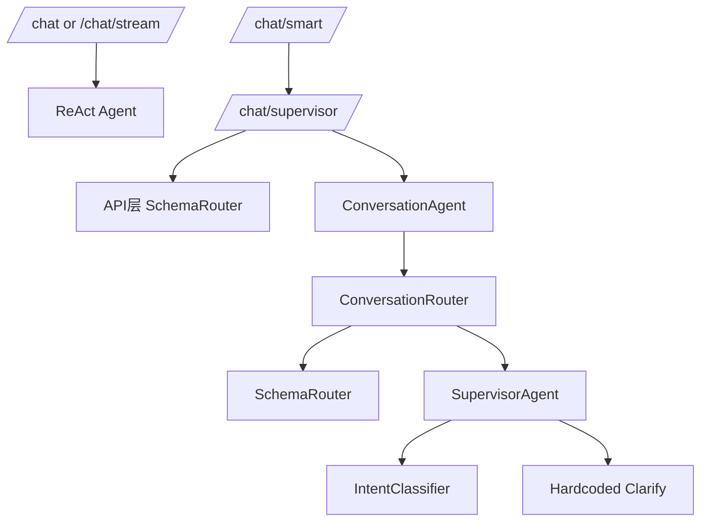
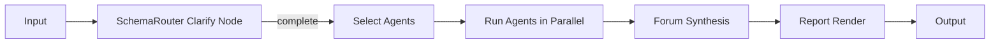
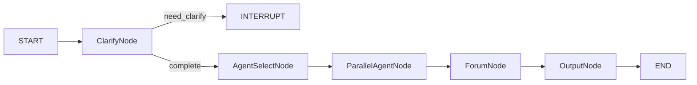
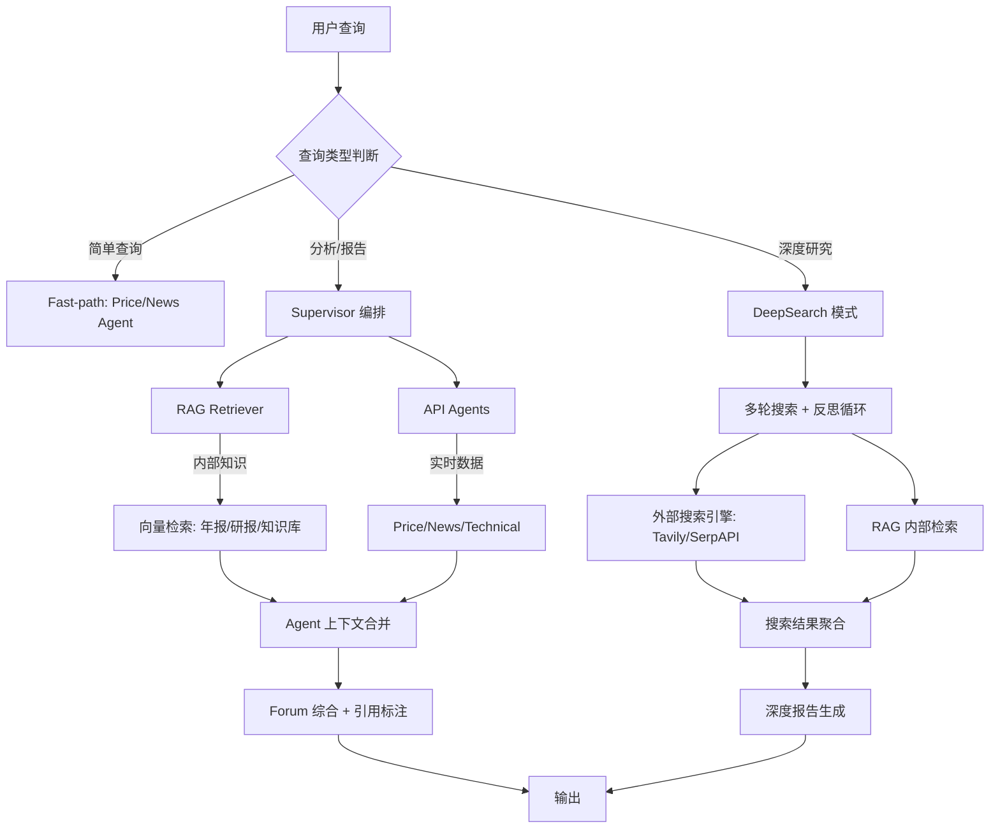

# 2026-01-xx 架构重构复盘与决策记录（FinSight）

> 面向：研发团队内部
> 目的：复盘当前架构问题与根因，形成一致的决策与可执行重构计划，作为未来开发/交接/演进依据。
> 适用分支：`main`（HEAD commit 时工作区未提交）

**关联文档：**
- `docs/Thinking/2026-01-31_architecture_refactor_guide.md` — LangGraph 迁移代码参考（附件级，含 D.3-D.6 完整 Python 示例）
- `docs/Thinking/unified_supervisor_proposal.py` — Unified Supervisor 原型代码

---

## 0. 摘要（TL;DR）

- **当前问题的核心不是功能缺失，而是“多入口 + 多路由 + 多意图 + 多澄清”并存**，导致请求路径分裂、追问不一致、trace 混乱、成本不可控。  
- **本次决策方向**：
  1) **单入口**（仅保留 `/chat/supervisor` 与 `/chat/supervisor/stream`），
  2) **单路由**（SchemaRouter 仅在 ConversationRouter 内部调用），
  3) **单追问**（Clarify 只允许 SchemaRouter 产出），
  4) **旧 Agent 清理**（移除 ReAct Agent 初始化与旧端点），
  5) **轻量 SchemaRouter 保留**（保留 pending + SlotCompletenessGate + schema_* 结构）。
- **未来演进**：Report/深度分析链路将迁移到 LangGraph workflow（逐步替换 Supervisor 内部编排），提升可观测性与可测试性。

---

## 1. 背景与目标

### 1.1 背景

FinSight 经过多次迭代后，出现了“新旧路径共存”的复杂局面：
- API 层存在旧版 `/chat`、`/chat/stream`、`/chat/smart`，同时新增 `/chat/supervisor`。
- ConversationRouter 内部已接入 SchemaRouter，但 API 层又直接调用 SchemaRouter。
- Supervisor/IntentClassifier 与 Router/Intent 双意图体系并行。
- Clarify 既来自 SchemaRouter 的模板化问句，又来自 Supervisor 的硬编码追问。

这导致：
- 相同请求可能走不同路径，结果不一致。
- 追问文案不稳定，trace 出现意图跳变。
- LLM 调用被重复触发，造成额外成本。
- 新人难以理解入口与路由策略，维护成本上升。

### 1.2 目标

本次决策的核心目标是：
- **可预测**：同一问题只能走一条确定路径。
- **可解释**：追问与路由只有一个来源。
- **可维护**：减少重复逻辑与兼容层。
- **可演进**：为未来 LangGraph 编排迁移预留清晰接口。

---

## 2. 事实证据（代码层面可定位）

> 下面是本次决策依赖的“明确事实”，用于避免纯主观判断。

### 2.1 多入口并存（严重）

当前 `backend/api/main.py` 仍保留多条旧路径：
- `/chat`
- `/chat/stream`
- `/chat/smart`
- `/chat/smart/stream`
- `/chat/supervisor`
- `/chat/supervisor/stream`

这意味着前端或调用方只要使用旧路径，就会绕过新架构。

### 2.2 SchemaRouter 被重复调用（严重）

- `backend/conversation/router.py` 内部已有 SchemaRouter 调用。
- 但 `backend/api/main.py` 的 `/chat/supervisor` 又直接调用 SchemaRouter。

结果：同一请求可能被判定两次（甚至出现两套澄清路径）。

### 2.3 双意图系统并行（高风险）

- ConversationRouter 内部有 `Intent` 枚举（CHAT/REPORT/ALERT 等）。
- Supervisor 侧又使用 `IntentClassifier` 的 `Intent`（price/news/technical 等）。

两个“Intent”在不同层级被复用，存在名称冲突与语义混淆。

### 2.4 双追问模板并行（高风险）

- SchemaRouter 使用 `CLARIFY_TEMPLATES`（模板化追问）。
- Supervisor/ChatHandler 中存在硬编码追问。  

导致同一场景出现不同追问文案，且追问来源不可追踪。

### 2.5 旧 ReAct Agent 仍初始化（严重）

`backend/api/main.py` 仍执行 `create_agent()` 并初始化 ReAct Agent，旧端点可完全绕过新编排系统。

### 2.6 文档与代码不一致（重要）

文档宣称“单入口 + SchemaRouter 错误 JSON -> clarify”，但代码仍保留旧入口、API 层重复调用 SchemaRouter。

### 2.7 编码与临时文件问题（工程风险）

- CRLF/LF 混用，中文输出乱码。
- 临时文件（`main_temp.py`、`schema_router.py.untracked.bak`）存在潜在打包风险。

---

## 3. 成熟多 Agent 项目的“原则借鉴”

> 这里只写“原则”，不复述他人实现细节。

参考 BettaFish（多 Agent 编排项目）总结出的成熟原则：

1) **单入口原则**
   - 对外只暴露 1-2 个入口，避免路由歧义。

2) **单编排中心**
   - 编排权集中，不在 API 层、Router 层、Agent 层重复做同一决策。

3) **多 Agent 并行执行 + 单点综合**
   - 专家 Agent 可并行执行，但最终交由统一综合节点输出结果。

4) **决策透明**
   - 每一层要有清晰的“输入 -> 输出”规范，便于 trace 与调试。

5) **弱路由/轻规则**
   - 尽量避免多层意图分类，减少重复判断成本。

对照 FinSight 当前状态：
- 入口多、路由多、澄清多，违背了“单入口/单编排中心”。
- 因此首要目标不是“功能堆叠”，而是“结构收敛”。

---

## 4. 追问机制：是“提示词就够”还是“SchemaRouter 必要”？

### 4.1 纯提示词追问的优缺点

优点：
- 代码最少，开发最快。
- 追问自然，交互流畅。

缺点：
- 不稳定、不可测。  
- 无法结构化追踪“缺失字段”。
- 多轮补槽无法可靠拼接。

### 4.2 SchemaRouter 的价值

- **确定性**：缺字段就追问，且可复用统一模板。
- **结构化**：`schema_action/schema_args/schema_missing/schema_question` 便于追踪与测试。
- **可回填**：`pending_tool_call` 允许用户只回答一个词（如“特斯拉”）即可继续。

### 4.3 结论

- **保留轻量 SchemaRouter** 是更适合当前 ToB/金融场景的折中方案。  
- 但它必须在“单路由 + 单追问”框架下使用，否则会变成过度设计。

---

## 5. 当前架构图（问题态）



问题点：
- SchemaRouter 在 API 层与 Router 层重复执行。  
- Clarify 既来自 SchemaRouter，又来自 Supervisor。
- /chat、/chat/stream 与 /chat/supervisor 并存。

---

## 6. 目标架构图（决策态）

```mermaid
flowchart TD
    A[/chat/supervisor or /chat/supervisor/stream/] --> B[ConversationAgent]
    B --> C[ConversationRouter]
    C --> D[SchemaRouter (single source of clarify)]
    D -->|clarify| E[Clarify Response]
    D -->|complete| F[SupervisorAgent]
    F --> G[Agent Selection]
    G --> H[Agents Parallel Run]
    H --> I[Forum/Final Synthesis]

    %% single entry, single router, single clarify
```

---

## 7. 架构决策对比（文档 vs 代码）

| 维度 | 文档描述 | 当前代码 | 问题 | 决策方向 |
|---|---|---|---|---|
| API 入口 | 单入口 `/chat/supervisor` | 多入口共存 | 路由歧义 | 统一保留 `/chat/supervisor` + `/stream` |
| Router | SchemaRouter 单入口 | API 层 + Router 层重复 | 双路由 | 只保留 ConversationRouter 内调用 |
| Clarify | ClarifyTool 模板化 | Supervisor/SchemaRouter 双模板 | 文案不一致 | 只允许 SchemaRouter 产出 |
| Intent | 单体系 | ConversationRouter + IntentClassifier | 冲突 | 维持双层但明确边界/命名 |
| Agent | Supervisor 为主 | ReAct Agent 仍初始化 | 旧路径绕过 | 删除旧 Agent |
| SecurityGate | 统一网关 | 仅限流/API key | 缺失 | 后续实现统一中间件 |
| 测试 | 统一测试体系 | legacy test/ 仍在 | 混乱 | 清理/迁移 |

---

## 8. “LangGraph 化”的未来规划（必须写入文档）

### 8.1 当前 LangGraph 使用情况

目前 LangGraph 并没有覆盖主流程，仅在 legacy report agent 中局部使用（`backend/langchain_agent.py`），用于构建 report 流程图。

### 8.2 为什么考虑迁移 Report → LangGraph

- **可视化执行路径**：每个节点输出可追踪。
- **天然支持中断/澄清**：节点可显式声明“需要用户补槽”。
- **易于测试**：节点可单独单测，而不是大段 Supervisor 逻辑。

### 8.3 迁移目标（未来版本）

Report/深度分析路径将改造成 LangGraph workflow：



### 8.4 迁移范围边界

- **短期**：仅 report/supervisor 流程迁移；chat fast-path 保持轻量。
- **中期**：Supervisor 的 agent selection 与 forum synthesis 全部在图内完成。
- **长期**：统一进 LangGraph，但入口仍保持单一。

---

## 8.5 参考 2026-01-31 guide 的补充要点（已吸收）

以下内容来自 `docs/Thinking/2026-01-31_architecture_refactor_guide.md` 的可复用部分，已整合进本决策文档：

### A. SchemaRouter 必须保留的“硬性能力”

1) **pending_tool_call**
   - 作用：支持多轮追问后的回填（如用户只回复“特斯拉”）。
2) **SlotCompletenessGate**
   - 作用：阻断 `get_market_sentiment` 等无必填参数工具的误选。
3) **schema_action / schema_args / schema_missing / schema_question**
   - 作用：下游 Router / Handler / 前端测试均依赖此结构。
4) **异常与未知 tool 的 clarify fallback**
   - 作用：保证错误 JSON 或未知工具时不回退旧路由，而是直接进入 clarify。

### B. Supervisor 必须保留 Fast-path

对于低复杂度查询（例如仅需 Price/News 1-2 个 Agent），需要在 Supervisor 内执行 fast-path，避免 Forum/多 Agent 带来的延迟与成本。

### C. Report → LangGraph 迁移蓝图（要点）

推荐的 ReportGraph 结构：



核心节点意图：
- **ClarifyNode**：复用 SchemaRouter 的缺槽判断逻辑；使用 LangGraph interrupt 模式等待用户补充。
- **ParallelAgentNode**：通过 LangGraph `Send` 原语并发分发任务。
- **ForumNode**：封装现有 ForumHost 逻辑，输出统一报告中间结果。
- **OutputNode**：生成标准化 ReportIR，便于前端或后续存储。

---

## 8.6 参考文档的缺陷（必须记录）

> `2026-01-31_architecture_refactor_guide.md` 参考价值高，但存在以下显著缺陷：

1) **编码问题导致文本乱码**
   - 文件显示为明显的 UTF-8/CP936 混淆（中文乱码）。
   - 改进：统一保存为 UTF-8 无 BOM，并强制 LF 行尾。

2) **过度使用框图字符（视觉噪声大）**
   - 大量 ASCII/框线在 Git diff 中产生噪声，难以审查与维护。
   - 改进：使用 Mermaid 或简化文本结构替代。

3) **缺少“版本状态与适用范围”**
   - 未明确适用的代码版本/分支/commit，易与当前实现脱节。
   - 改进：文档顶部必须标注适用 commit 或分支。

4) **指南与执行清单混杂**
   - 原则/约束/行动项混在一起，复盘阅读成本高。
   - 改进：拆分为“原则/约束”“执行步骤”“迁移计划”。

5) **测试策略偏描述**
   - 未定义最小可验收用例与断言基线。
   - 改进：补充“最小用例列表 + trace 对齐项”。

---

## 8.7 为什么不“完全依赖 LangChain”？以及什么地方可以用

### 8.7.1 不完全依赖的原因

- **确定性优先**：Clarify/SlotGate 属于强规则，需要稳定可测，而非纯 LLM 决策。
- **性能与成本**：多层 Router/Agent 叠加时，框架包装会放大 token 与调用次数。
- **可观测性与排障**：手写编排能精确记录每个门控与分支，避免“框架黑盒”。
- **历史包袱**：旧路径与新架构并存，直接改为全 LangChain 需要大规模重写与回归。

### 8.7.2 可以用 LangChain 的部分（推荐）

- **结构化输出**（JSON schema / Pydantic 输出约束）
- **Tool/Function Calling 适配层**（统一工具注册与描述）
- **Prompt 模板体系**（可统一版本控制）
- **Callbacks/Tracing**（与 LangSmith 接入）
- **Retriever/VectorStore 适配**（为 RAG 做准备）

### 8.7.3 最符合当前项目的选择

- **路由与门控**：继续手写（ConversationRouter + SchemaRouter），确保确定性。
- **编排与深度报告**：逐步迁移到 LangGraph（见 8.5 / 8.8）。
- **工具与提示词**：使用 LangChain 作为"适配层"，而非完全替代业务逻辑。

### 8.7.4 LangChain 适配层具体落地方案

> 以下是"可以用 LangChain 的部分"对应到具体文件和改造方式的落地指引。

| LangChain 能力 | 当前状态 | 建议落地文件 | 改造方式 |
|---|---|---|---|
| **结构化输出** | 手写 JSON parse + 正则 | `schema_router.py` | 用 `llm.with_structured_output(ToolSchema)` 替代手动解析 JSON，减少解析异常分支 |
| **Tool/Function Calling** | `langchain_tools.py` 已有 `@tool` | `langchain_tools.py` | ✅ 已在用，保持不变 |
| **Prompt 模板** | 各文件硬编码 prompt 字符串 | 新建 `backend/prompts/` 目录 | 用 `ChatPromptTemplate` 管理所有 prompt，支持版本控制与复用 |
| **Callbacks/Tracing** | 部分接入 LangSmith | `llm_config.py` | 统一配置 `CallbackManager`，所有 LLM 调用自动上报 trace |
| **Retriever/VectorStore** | ❌ 未使用 | RAG 阶段新建 `backend/rag/` | 见 8.8.4 RAG 实施路径 |

**注意边界**：
- **不用 LangChain 做路由**：ConversationRouter / SchemaRouter 保持手写，确保确定性。
- **不用 LangChain 做编排**：Supervisor 的 agent 选择与并行执行保持手写（或迁移 LangGraph）。
- **只用 LangChain 做"适配层"**：LLM 调用、工具注册、prompt 管理、向量检索。

---

## 8.8 什么时候需要 RAG？（以及数据类型与时效）

### 8.8.1 需要 RAG 的判断标准

当满足以下条件之一，就应开始引入 RAG：
- **知识规模增大**：超过人工可维护的规则/模板范围。
- **问题重复率高**：用户频繁问相似问题且需要一致答案。
- **信息溯源要求**：需要给出引用或证据来源。
- **内容长尾**：知识分散在大量报告/年报/研究文档中。

### 8.8.2 建议的数据类型与时效策略

| 内容类型 | 时效性 | 更新节奏 | 推荐策略 | 备注 |
|---|---|---|---|---|
| 公司年报/财报 | 长期有效（1-3 年） | 按发布季/年更新 | **RAG + 长期索引** | 适合结构化检索与引用 |
| 行业研究报告 | 半年有效 | 半年更新 | **RAG + 版本管理** | 需记录报告版本与日期 |
| 投资知识库 | 长期有效（可永久） | 持续补充 | **RAG + 标签体系** | 适合做知识图谱补充 |
| 实时新闻/热点 | 短期有效 | 实时 | **搜索/抓取，不进 RAG** | 避免过期污染 |

### 8.8.3 与 DeepSearch 的关系

- **RAG** 解决"内部知识库的稳定检索"。
- **DeepSearch** 解决"外部资料的深度研究/多轮搜索"。

### 8.8.4 RAG 实施路径（分阶段）

> 以下是从"零 RAG"到"生产可用"的分阶段路线图，每阶段可独立交付与验证。

**阶段 R1｜基础设施搭建**

| 项目 | 内容 | 产出 |
|---|---|---|
| 向量数据库选型 | 推荐 `pgvector`（与现有 PostgreSQL 复用）或 `Qdrant`（独立部署，性能更优） | 选型文档 + docker-compose 配置 |
| Embedding 模型 | 推荐 `text-embedding-3-small`（OpenAI）或 `bge-large-zh-v1.5`（本地/私有化） | Embedding 服务封装 |
| 目录结构 | 新建 `backend/rag/`，含 `embedder.py`、`retriever.py`、`indexer.py` | 代码骨架 |
| LangChain 适配 | 使用 `langchain.vectorstores` + `langchain.retrievers` 接入 | 见 8.7.4 Retriever/VectorStore 行 |

**阶段 R2｜知识入库**

| 数据类型 | 处理流程 | 分块策略 | 更新机制 |
|---|---|---|---|
| 公司年报/财报 | PDF → 结构化提取 → 分段 → Embedding → 入库 | 按章节/表格拆分，每段 512-1024 tokens | 按发布季批量更新，旧版本保留但降权 |
| 行业研究报告 | PDF/Word → 清洗 → 分段 → Embedding → 入库 | 按段落拆分，保留标题层级 | 半年更新，标记报告版本与有效期 |
| 投资知识库 | Markdown/结构化文本 → 直接分段 → Embedding → 入库 | 按条目拆分，附加标签 metadata | 持续增量补充，不删除 |

**阶段 R3｜检索增强集成**

```text
用户查询
  → SchemaRouter（参数补全）
  → Supervisor（Agent 选择）
  → RAG Retriever（检索相关文档段）
  → Agent 执行（API 数据 + RAG 上下文合并）
  → Forum 综合（引用溯源标注）
  → 输出（含引用来源）
```

集成要点：
- RAG 检索结果作为 **Agent 上下文补充**，而非替代 API 数据
- 检索结果通过 `metadata.source` 字段标注来源（文件名、页码、日期）
- Forum 综合时自动生成引用标注（如 `[来源: 2025年报 P.42]`）

**阶段 R4｜质量保障**

| 验证项 | 方法 | 通过标准 |
|---|---|---|
| 检索召回率 | 构建测试问答集（50+ 对），验证 Top-5 召回 | 召回率 ≥ 80% |
| 答案准确性 | 人工评审 + LLM-as-Judge | 准确率 ≥ 85% |
| 引用溯源 | 验证引用来源与原文匹配 | 匹配率 ≥ 90% |
| 过期内容过滤 | 查询时检查 `metadata.valid_until` | 零过期内容命中 |
| 性能指标 | 检索延迟 P95 | ≤ 200ms |

---

## 8.9 DeepSearchAgent-Demo 的原则参考

参考仓库：`https://github.com/666ghj/DeepSearchAgent-Demo`

该项目强调：
- **无框架**的 deep search agent 设计（从零实现，不依赖重型框架）。
- **多轮搜索 + 反思循环** 的研究流程。
- **搜索引擎集成**（Tavily）。
- **状态管理与可恢复**。
- **Web 界面（Streamlit）**与 **Markdown 报告输出**。

对 FinSight 的启发：
- 可作为 **"深度研究/长报告"模式** 的实现原型；
- 与 **Report → LangGraph** 迁移路径高度契合；
- 适合引入 **"DeepSearch 模式开关"**，只在用户请求深度研究时启用。

### 8.9.1 DeepSearch + RAG 集成架构



**三条路径的边界说明：**

| 路径 | 触发条件 | 数据来源 | RAG 参与 | 典型场景 |
|---|---|---|---|---|
| Fast-path | 简单查询，≤2 Agent | API 实时数据 | ❌ | "特斯拉现在多少钱" |
| Supervisor 标准编排 | 分析/报告，≥2 Agent | API + RAG | ✅ 检索补充 | "分析特斯拉 Q3 财报表现" |
| DeepSearch | 用户显式请求深度研究 | 外部搜索 + RAG | ✅ 内外合并 | "深度研究新能源汽车行业格局" |

---

## 8.10 最小可验收测试用例（基线断言）

> 以下测试用例是重构各阶段的"通过/不通过"判断基准，需在 pytest 中实现为自动化断言。

### 8.10.1 SchemaRouter 与追问

| # | 场景 | 输入 | 期望行为 | 验证要点 |
|---|---|---|---|---|
| T1 | 缺少股票代码 | "查一下股价" | SchemaRouter 返回 `schema_action=clarify`，`schema_question` 包含追问 | `schema_missing` 含 `ticker` |
| T2 | 仅说公司名 | "特斯拉" | SchemaRouter 判定**缺少意图动作**，追问用户想查什么（价格/新闻/分析） | `schema_action=clarify`，`schema_missing` 含 `action/intent` |
| T3 | 槽位回填 | 先 T1，再回复"特斯拉" | pending_tool_call 回填 ticker="TSLA"，执行工具 | `schema_action=execute`，`schema_args.ticker=TSLA` |
| T4 | 完整查询 | "查一下特斯拉的股价" | 直接进入 Supervisor，不触发追问 | `schema_action=execute`，无 clarify |
| T5 | 未知工具 | "帮我订个外卖" | SchemaRouter fallback clarify | `schema_action=clarify`，提示不支持 |

### 8.10.2 路由与编排

| # | 场景 | 输入 | 期望行为 | 验证要点 |
|---|---|---|---|---|
| T6 | 简单价格查询 fast-path | "AAPL 股价" | Supervisor 走 fast-path，仅调用 PriceAgent | 无 Forum，延迟 < 3s |
| T7 | 多 Agent 分析 | "分析特斯拉近期表现" | Supervisor 选择多 Agent + Forum 综合 | 输出包含价格、新闻、技术分析 |
| T8 | 旧端点 404 | `POST /chat` | 返回 404 或重定向提示 | Phase 1 完成后必须通过 |
| T9 | 闲聊 fast-path | "你好" | 直接返回闲聊，不进 SchemaRouter | 无 schema_* metadata |

### 8.10.3 Trace 与一致性

| # | 场景 | 验证方式 | 通过标准 |
|---|---|---|---|
| T10 | 同一查询多次执行 | 发送相同请求 3 次 | 路由路径一致（trace 中 intent 不跳变） |
| T11 | SchemaRouter 单次调用 | 检查 trace 日志 | SchemaRouter 在整个请求中只执行 1 次 |
| T12 | Clarify 来源唯一 | 检查 clarify 响应 metadata | `source=schema_router`，无 `source=supervisor` |

---

## 9. 最终确认的 TODO（可执行版）

> 这是“确认后的调整版”，确保保留 SchemaRouter 的核心能力与 metadata 结构。

### Phase 1｜清理旧入口
- 删除旧 API 端点：`/chat`、`/chat/stream`、`/chat/smart`、`/chat/smart/stream`
  - 文件：`backend/api/main.py:459,602,749,755`
- 删除旧 ReAct Agent 初始化
  - 文件：`backend/api/main.py:65,80-89`
- 处理 `/diagnostics/langgraph` 的兼容（如仍需要，改为显式依赖 Report Graph）
  - 文件：`backend/api/main.py:419`
- **[新增] 清理诊断链路依赖**：同步移除 `langchain_agent.py` / 文档 / tests 中与 ReAct 相关的引用（避免悬挂依赖）
- **[新增] 前端联动**：移除 `SettingsModal.tsx` 中旧 mode 与 `/chat` 路径调用
- **[新增] 文档同步**：更新 OpenAPI schema、README、`docs/01-05` 的端点说明

### Phase 2｜SchemaRouter 轻量化（保留核心结构）
- **保留**：`pending_tool_call` + `SlotCompletenessGate` + `schema_* metadata`
- **精简**：过度异常处理、冗长工具描述
- **不改变**：输出结构（`schema_action/schema_args/schema_missing/schema_question`）

### Phase 3｜Router 单路由
- SchemaRouter **只在** `ConversationRouter.route()` 调用
  - 文件：`backend/conversation/router.py:145-147`
- API 层 **不再**直接调用 SchemaRouter
  - 文件：`backend/api/main.py:528-545,637-648`
- Clarify **只允许** SchemaRouter 产出
- **[新增] Clarify 透传保证**：API 返回必须包含 `schema_question`，trace 标记 `source=schema_router`，ChatHandler/Supervisor 不得覆盖追问文案  
  - **补充**：流式 `/chat/supervisor/stream` 必须在首个事件或 metadata 中透传 `schema_question`
- **[新增] Intent 命名去冲突**：将 `IntentClassifier.Intent` 改名为 `AgentIntent`（或添加明确命名空间），避免与 `ConversationRouter.Intent` 混用  
  - **补充**：同步修改 tests/文档/trace 字段命名，避免断言失败
  - 文件：`backend/orchestration/intent_classifier.py`

### Phase 4｜Supervisor 统一编排
- CHAT / REPORT 统一交给 Supervisor
- Supervisor 内置 **fast-path**（简单问题快速返回）
- 移除 Supervisor 内硬编码追问（仅保留 fallback clarify）

### Phase 5｜清理与测试
- 删除临时/备份文件：`main_temp.py`、`schema_router.py.untracked.bak`
- 统一编码：UTF-8 + LF（加 `.gitattributes`，可选补充 `.editorconfig`）
- **[新增] pytest 用例落地**：T1-T12 测试用例必须自动化实现 + 回归基线更新
- **[新增] 清理 legacy tests/fixtures**：先更新 pytest 配置/收集路径，再删除旧端点相关 tests/fixtures
- **[新增] 开关清理**：去掉 `USE_SCHEMA_ROUTER` 开关或默认强制启用，避免隐性分叉  
  - **补充**：确保 `llm=None` 场景不触发 SchemaRouter（测试环境兜底）
- 跑全量 pytest + regression

---

## 10. 风险与缓解

| 风险 | 影响 | 缓解措施 |
|---|---|---|
| 删除旧入口导致客户端报错 | 中 | 先更新前端调用路径，再移除旧端点 |
| **[新增] 前端/测试不同步** | 高 | Phase 1 必须同步修改 SettingsModal.tsx，Phase 5 必须更新测试基线 |
| SchemaRouter 轻量化出错 | 中 | 保留原 metadata 结构，逐步删减 |
| **[新增] Clarify 被覆盖** | 中 | API 层强制透传 schema_question，trace 验证来源唯一 |
| Supervisor fast-path 误判 | 中 | 增加简单规则 + 回退路径 |
| LangGraph 迁移复杂度 | 中高 | 先从 Report 子流程迁移，不动 Chat |

---

## 11. 结论与下一步

本次决策的核心是“**收敛结构而非堆叠功能**”。

- **短期**：完成单入口 + 单路由 + 单追问，恢复一致性与可维护性。
- **中期**：Supervisor 内部重构为更清晰的编排与 fast-path。
- **长期**：Report 迁移到 LangGraph workflow，提高透明度与可测试性。

---

## 12. 附录：仓库差异说明（供内部核对）

- 当前主仓库路径：`D:\AgentProject\FinSight`
- HEAD 与 origin/main 同步，但工作区存在大量未提交修改。
- 需要先收敛代码再更新文档，避免“文档先行导致不一致”。

---

## 13. 参考链接（仅原则性借鉴）

```text
BettaFish 项目主页（原则参考）
https://github.com/666ghj/BettaFish

FinSight 项目主页（内部参考）
https://github.com/kkkano/FinSight
```
真正的“最佳实践”：Postgres +（可选）向量库，而不是 Mongo vs SQL 二选一

很多成熟做法是三层：

Postgres：存 session/messages/state/evidence/trace（事实记录、可审计）

对象存储（可选）：大块 artifact（长报告、抓取网页全文、PDF）放 S3/MinIO，DB 只存引用
强烈建议：Postgres（或先 SQLite）+ JSONB

先快速把 sessions/messages/session_state/events 落库

Evidence/Trace 先用 JSONB 存

后续再把关键字段“抽列”做索引


把 RAG 定位成一个独立能力/独立工具：ResearchLibrary / ReportLibrary
然后让 DeepSearch 在需要时调用它，而不是把 DeepSearch 直接等同于 RAG。

这样你得到的是“组合能力”：

DeepSearch：负责 orchestration（搜什么、怎么对照、怎么写报告、怎么拼 evidence）

RAG/研报库：负责从“你自己的库”里检索出可靠片段

4) 最实用的判断规则：什么时候用 RAG，什么时候用联网搜索？

你可以用你现有的 Gate 思路（freshness_need / evidence_need）直接做一个硬规则：

用 RAG（研报库/年报库）的条件更像：

freshness_need = low（不强调“今天/最新”）

evidence_need = high（要求“出处/引用/依据”）

或者问题是“结构化长期知识”：

公司商业模式、风险因素、历史财务摘要

行业框架、名词解释、投资知识

用联网 DeepSearch（Web/Search/News）的条件更像：

freshness_need = high（今天、最新、刚刚、本周）

事件驱动：财报发布、突发新闻、政策变化、市场波动

你库里不可能及时更新的内容

一句话：

“要最新”靠联网，“要稳定可引用”靠 RAG。

5) 我建议你现在“最优路径”（不浪费重构成本）

你现在如果问我：DeepSearch 要不要立刻上 RAG？
我会推荐这个顺序（最稳、最省返工）：

Step A：先把 DeepSearch 做成“检索编排器”，先不强依赖 RAG

先把这些打牢：

抓取/搜索的证据入池（EvidenceItem 完整：url、ts、snippet、freshness）

缓存（同一 URL/同一 query 的缓存 + 负缓存）

去重（同一新闻多源重复）

失败回退链（搜索源/抓取源/降级提示）

Trace 全链路（后面做前端仪表盘就能直接吃）

Step B：再加一个“研报库（RAG Tool）”，作为独立路由/独立工具

先从最有价值的语料开始：

你认可来源的研报（可控）

公司年报/财报文本（稳定）

DeepSearch 在需要“长期知识/引用”的时候调用它

Step C：最后再做 Hybrid：RAG 优先 + Web fallback

“库里命中就引用”

“库里缺就联网补齐”

这时候 DeepSearch 就是最强形态：既稳又新
---

> 记录人：Codex
> 状态：待执行
> 备注：此文档为决策记录与执行参考，不作为对外承诺。
